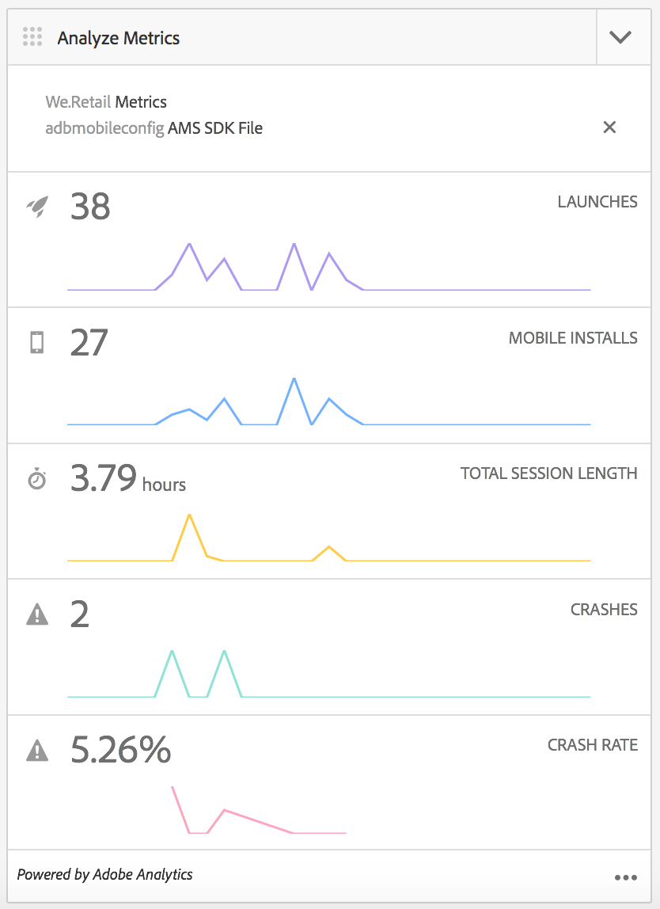

# Adobe Mobile Services Cloud Service konfigurieren {#configure-your-adobe-mobile-services-cloud-service}

>[!CAUTION]
>
>AEM 6.4 hat das Ende der erweiterten Unterstützung erreicht und diese Dokumentation wird nicht mehr aktualisiert. Weitere Informationen finden Sie in unserer [technische Unterstützung](https://helpx.adobe.com/de/support/programs/eol-matrix.html). Unterstützte Versionen suchen [here](https://experienceleague.adobe.com/docs/?lang=de).

>[!NOTE]
>
>Adobe empfiehlt die Verwendung des SPA-Editors für Projekte, für die ein frameworkbasiertes Client-seitiges Rendering für einzelne Seiten (z. B. React) erforderlich ist. [Weitere Informationen](/help/sites-developing/spa-overview.md)

Die **Mobilmetrikbereich** im Befehlszentrum bietet Echtzeitanalysen für Ihre Mobile App.

Die [Adobe Mobile Analytics](https://www.adobe.com/ca/solutions/digital-analytics/mobile-web-apps-analytics.html) SDK wird über ein PhoneGap-Plug-in bereitgestellt. Metriken werden erfasst und auf dem Gerät zwischengespeichert, bis das Gerät verbunden ist. Zu diesem Zeitpunkt werden die Daten zur Berichterstellung und Analyse an die Adobe Mobile Services Cloud gesendet.

Adobe Mobile Analytics SDK bietet Folgendes:

1. **Datenerfassung für mobile Kanäle** - Erfassen Sie umfassende Daten für Ihre mobilen Websites und Apps auf allen gängigen Betriebssystemen.
1. **Mobile Interaktionsanalyse** - Erfahren Sie mehr über die Benutzerinteraktion innerhalb Ihrer mobilen App, Website oder Videos, einschließlich der Häufigkeit, mit der Verbraucher den Kanal starten, ob sie Käufe darüber tätigen und mehr.
1. **Dashboards und Berichte für mobile Apps** - Rufen Sie Nutzungsberichte ab, die Lebenszyklusmetriken für Ihre Apps und App Store-Metriken enthalten - siehe Trends für Benutzer, Starts, durchschnittliche Sitzungslänge, Aufbewahrungsdauer und Abstürze.
1. **Analyse mobiler Kampagnen** - Quantifizieren Sie die Effektivität mobiler Kampagnen wie SMS, mobile Suchanzeigen, mobile Display-Anzeigen und QR-Codes.
1. **Geolocation-Analyse** - Ermitteln Sie, wo Ihre App-Benutzer Ihre mobilen Erlebnisse starten und mit ihnen interagieren, nach GPS-Standort oder Zielpunkten.
1. **Pfadanalyse** - Erfahren Sie, wie Benutzer durch Ihre App navigieren, um zu ermitteln, welche Bildschirme und Benutzeroberflächenelemente Benutzer anregen und welche dazu führen, dass Benutzer abbrechen.

>[!CAUTION]
>
>Die **Metriken analysieren** Die Kachel wird nur dann im Dashboard angezeigt, wenn Sie Cloud Services konfiguriert haben.

AEM Kachel &quot;Befehlszeilenmetriken&quot;

## Konfigurieren des Cloud Service {#configuring-the-cloud-service}

Um Adobe Mobile Services Analytics nutzen zu können, müssen Sie den AEM Mobile Analytics Cloud-Dienst mit Ihren Adobe Analytics-Kontoinformationen konfigurieren.

1. Klicken Sie auf das Symbol oben rechts, um die Cloud Services über das **Cloud Services verwalten** im App-Dashboard.

   

1. Die **Cloud Services hinzufügen oder bearbeiten** angezeigt. Auswählen **Adobe Mobile Services** und klicken Sie auf **Nächste**.

   

1. Wählen Sie eine vorhandene Konfiguration aus dem **Mobile Services** oder wählen Sie **Konfiguration erstellen** , um eine neue zu erstellen.

   Geben Sie für eine neue Konfiguration die **Eigenschaften von Mobile Services** und klicken Sie auf **Überprüfen.**

   

   Wenn die Anmeldeinformationen geprüft werden, wird die **Überprüfen** Schaltflächenänderungen in **Verifiziert**. Sie können eine Mobile-Service-App unter **Auswählen eines Mobile-App-Dienstes**.

   Klicken **Einsenden** zum Einrichten der Konfiguration.

   

1. Nachdem Sie eine Cloud-Konfiguration eingerichtet haben, können Sie dieselbe Ansicht in Ihrem Dashboard anzeigen.

   

   >[!NOTE]
   >
   >Nachdem Sie Ihre Cloud-Konfiguration eingerichtet haben, können Sie die **Metriken analysieren** Kacheln Sie in Ihrem App-Dashboard.

   
