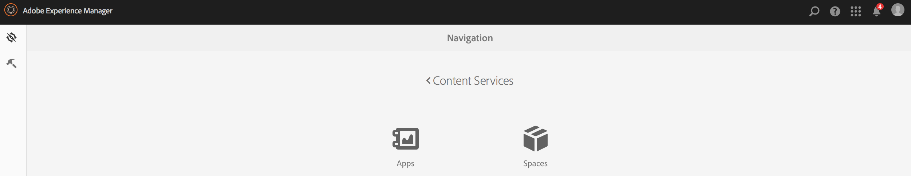
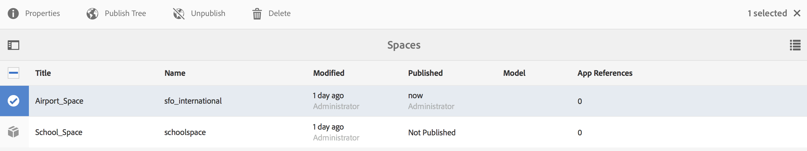

# Bereiche und Entitäten{#spaces-and-entities}

>[!NOTE]
>
>Adobe empfiehlt die Verwendung des SPA-Editors für Projekte, für die ein frameworkbasiertes clientseitiges Rendering für einzelne Seiten (z. B. React) erforderlich ist. [Weitere Informationen](/help/sites-developing/spa-overview.md)

Ein Leerzeichen ist ein bequemer Speicherort für Entitäten, die über die Content Services REST API verfügbar gemacht werden. Dies ist besonders nützlich, da eine App (oder ein beliebiger Kanal) vielen Entitäten zugeordnet werden kann. Wenn Entitäten gezwungen werden, sich in einem Bereich zu befinden, wird die beste Vorgehensweise zur Gruppierung der Anforderungen einer App erzwungen. Optional können Sie eine App in AEM mit einer kleinen Anzahl von Bereichen verknüpfen.

>[!NOTE]
>
>Um einem Kanal über Content Services etwas zur Verfügung zu stellen, muss es unter einem Leerzeichen stehen.

## Erstellen eines Bereichs {#creating-a-space}

Wenn der Benutzer einer mobilen App einen Haufen Inhalte und Assets bereitstellen möchte, erstellt der Benutzer den Bereich mithilfe des AEM Mobile-Dashboards.

Erstmals zeigt das AEM Mobile-Dashboard nur Apps an, nachdem der Benutzer keine Inhaltsdienste für die Verwendung mit Leerzeichen konfiguriert hat, nachdem er **Content Services** ausgewählt hat.

>[!CAUTION]
>
>**Voraussetzungen für das Hinzufügen eines Raums**
>
>Markieren Sie die Option &quot; **AEM Content Services** aktivieren&quot;, um mit Bereichen zu arbeiten, und aktivieren Sie sie in Ihrem AEM Mobile-Anwendungs-Dashboard.
>
>Weitere Informationen finden Sie unter [Verwalten von Content Services](/help/mobile/developing-content-services.md) .

Nachdem Sie Leerzeichen in Dashboard konfiguriert haben, führen Sie die folgenden Schritte aus, um Leerzeichen zu erstellen:

1. Wählen Sie **Bereiche** in Content Services.

   

1. Wählen Sie **Erstellen** , um einen Bereich zu erstellen. Geben Sie **Titel**, **Name** und **Beschreibung** für den Bereich ein.

   Klicken Sie auf **Erstellen**.

   

## Verwalten eines Bereichs {#managing-a-space}

Nachdem Sie einen Bereich erstellt haben, klicken Sie auf der linken Seite, um den Bereich in der Liste zu verwalten.

Sie können die Eigenschaften des Bereichs festlegen, den Bereich löschen oder den Ansicht- und Inhaltsbereich in einer AEM Veröffentlichungsinstanz veröffentlichen.

**Anzeigen und Bearbeiten von Eigenschaften eines Bereichs**

1. Wählen Sie den Bereich aus der Liste
1. Choose **Properties** from the toolbar
1. Click **Close** when done

**Veröffentlichen eines Bereichs** Wenn ein Bereich veröffentlicht wird, werden auch alle Ordner und Entitäten in diesem Bereich veröffentlicht.

1. Wählen Sie den Bereich aus, indem Sie auf das Symbol in der Liste &quot;Space Console&quot;klicken
1. Veröffentlichungsstruktur **auswählen**

>[!NOTE]
>
>Sie können die **Veröffentlichung** eines Bereichs rückgängig machen, wodurch der Bereich aus der Veröffentlichungsinstanz entfernt wird.
>
>Die folgende Abbildung zeigt die Aktionen, die nach der Veröffentlichung des Bereichs durchgeführt werden können.

## Arbeiten mit Ordnern in einem Bereich {#working-with-folders-in-a-space}

Leerzeichen können Ordner enthalten, um den Inhalt und die Assets des Raums weiter zu organisieren. Benutzer können ihre eigene Hierarchie unter einem Bereich erstellen.

### Erstellen eines Ordners {#creating-a-folder}

1. Klicken Sie auf den Bereich in der Liste in der Leertaste und dann auf Ordner **erstellen**

   

1. Geben Sie den **Titel**, **den** Namen und die **Beschreibung** für den Ordner ein

   

1. Klicken Sie auf **Erstellen** , um den Ordner in einem Bereich zu erstellen

## Sprachkopie {#language-copy}

>[!CAUTION]
>
>Die Sprachkopie funktioniert in dieser Version nicht vollständig. Es richtet nur die Struktur ein.

Mit der Funktion &quot; **Sprachkopie** &quot;können Autoren ihre Übergeordnet-Sprachkopie kopieren und dann ein Projekt und einen Workflow erstellen, um den Inhalt automatisch zu übersetzen. Sprachkopie erstellt die richtige Struktur. Nachdem Sie einen Ordner in einem Bereich hinzugefügt haben, können Sie dem Bereich &quot;Sprachkopie&quot;hinzufügen.

>[!NOTE]
>
>Es wird empfohlen, alle Inhalte, die übersetzt werden können, unter dem Knoten Sprachkopie zu platzieren.

### Sprachkopie hinzufügen {#adding-language-copy}

1. Nachdem Sie einen Raum erstellt haben, klicken Sie auf diesen Bereich, um eine Sprachkopie zu erstellen.

   Klicken Sie auf **Erstellen** und wählen Sie **Sprachkopie**.

   

   >[!NOTE]
   >
   >Sprachkopie-Knoten können nur als direkt untergeordnetes Element des Bereichs vorhanden sein.

1. Wählen Sie **Content Package Language&amp;ast;** und geben Sie **Title&amp;ast ein;** im Dialogfeld &quot;Sprachkopie **erstellen&quot;** .

   Klicken Sie auf **Erstellen**.

   

1. Nachdem Sie eine Sprachkopie erstellt haben, wird sie in Ihrem Bereich in **Sprachführern** angezeigt.

   

   >[!NOTE]
   >
   >Wählen Sie &quot; **Sprachmaster** &quot;, um die Sprachkopieordner Ansicht.

### Entfernen eines Ordners aus dem Bereich {#removing-a-folder-from-the-space}

1. Wählen Sie den Ordner aus der Liste des Bereichsinhalts
1. Click **Delete** from the toolbar

   >[!NOTE]
   >
   >Um in einen Ordner zu navigieren und dessen Inhalt anzuzeigen oder einen Unterordner oder eine Entität hinzuzufügen, klicken Sie auf den Ordnertitel in der Liste &quot;Inhalt&quot;des Bereichs.

## Arbeiten mit Entitäten in einem Bereich {#working-with-entities-in-a-space}

Entitäten stellen Inhalte dar, die über den Webdienst-Endpunkt verfügbar gemacht werden. Entitäten werden in Räumen gespeichert, damit sie leicht gefunden werden können und unabhängig von der AEM Repository-Struktur, die ihren zugehörigen Inhalt enthält, aufbewahrt werden.

Möglicherweise möchten Sie Entitäten in einer logischen Zusammenstellung gruppieren. Dazu können Sie eine beliebige Anzahl von Ordnern erstellen.

Wenn Entitätsuntergeordnete Elemente, bei denen es sich um andere Entitäten handelt, zur Datenmodellierung erfasst werden, kann der Entwickler spezifische &quot;Gruppenmodelle&quot;aus dem Modelltyp &quot;Entitätsgruppe&quot;erstellen, sofern diese vorab bereitgestellt werden.

>[!NOTE]
>
>Entitäten sind immer mit einem Leerzeichen verknüpft, sodass auf den Großteil der Benutzeroberfläche der Entität über die Leertaste zugegriffen wird.

### Erstellen einer Entität {#creating-an-entity}

1. Öffnen Sie die Space-Konsole und klicken Sie auf den Titel des Bereichs.

   Optional können Sie zu dem Ordner navigieren, indem Sie auf den Titel des Ordners in der Liste klicken.

   

1. Wählen Sie das Modell für die Entität aus. Dies ist der Typ der Entität, die Sie erstellen möchten. Klicken Sie auf Weiter.

   

   >[!NOTE]
   >
   >Sie haben die Möglichkeit, das **Asset-Modell**, das **Seitenmodell** oder ein zuvor erstelltes Entitätsmodell auszuwählen.
   >
   >Siehe [Erstellen eines Modells](/help/mobile/administer-mobile-apps.md), um Ihre benutzerdefinierte Entität zu erstellen.

1. Geben Sie einen **Titel**, einen **Namen**, eine **Beschreibung** und **Tags** für die Entität ein. Klicken Sie auf **Erstellen**.

   

   Sobald Sie fertig sind, erscheint die Entität in den untergeordneten Elementen Ihres Raums.

### Bearbeiten einer Entität {#editing-an-entity}

1. Nachdem Sie eine Entität erstellt haben, wechseln Sie zu Ihrem Ordner oder Raum und wählen Sie Ihre Entität in der Space-Konsole aus, um sie zu bearbeiten.

   

1. Wählen Sie eine Entität zur Bearbeitung aus und klicken Sie auf **Bearbeiten**.

   

   >[!CAUTION]
   >
   >Je nachdem, welche Vorlage Sie zum Erstellen der Entität auswählen, wird die Benutzeroberfläche für die Bearbeitung und Anzeige der Eigenschaften Ihrer Entität unterschiedlich sein. Weitere Informationen finden Sie in den unten stehenden Schritten.

   ***Wenn Sie die Vorlage zum Erstellen der Entität als Assets-Modelle*** auswählen, können Sie mit dem Klick auf **Bearbeiten** Assets hinzufügen, wie in der folgenden Abbildung dargestellt:

   

   Alternativ können Sie auf **Vorschau** klicken, um den JSON-Link Ansicht.

   

   ***Wenn Sie die Vorlage zum Erstellen der Entität als Seitenmodelle*** auswählen, können Sie mit dem Klick auf **Bearbeiten** Assets hinzufügen, wie in der folgenden Abbildung dargestellt:

   

   Klicken Sie auf das Symbol im **Pfad** , um ein Asset hinzuzufügen

   

   >[!NOTE]
   >
   >Nachdem Sie eine Entität hinzugefügt haben, muss sie gespeichert werden, damit der Link &quot;Vorschau&quot;funktioniert. Um die Vorschau Ansicht, klicken Sie auf **Speichern**. Wenn Sie auf die **Vorschau** klicken, wird der JSON des hinzugefügten Assets angezeigt, wie in der folgenden Abbildung dargestellt:

   

   >[!NOTE]
   >
   >Nach dem Hinzufügen von Assets zu Ihrer Entität können Sie entweder &quot; **Speichern** &quot;wählen, um die Änderungen zu speichern, oder &quot; **Speichern und Schließen** &quot;wählen, um zu speichern und zur Space Console-Liste umzuleiten, in der die Entitäten definiert sind.

   Wählen Sie außerdem eine Entität aus der Liste der Leertaste aus und klicken Sie auf **Eigenschaften** , um die Eigenschaften für eine definierte Entität Ansicht und zu bearbeiten.

   

   Sie können den Titel, die Beschreibung und die Tags bearbeiten und die Assets Ihrer Entität hinzufügen.

   

### Entfernen einer Entität {#removing-an-entity}

1. Wählen Sie die Entität aus der Liste des Bereichsinhalts

   

1. Klicken Sie auf der Symbolleiste auf **Löschen** , um die betreffende Entität aus dem Bereich zu entfernen.

### Veröffentlichen einer Entität {#publishing-an-entity}

Sie haben die Möglichkeit, zum Veröffentlichen der Entität die Option &quot; **Veröffentlichungsstruktur** &quot;oder &quot; **Schnelle Veröffentlichung** &quot;zu wählen.

1. Wählen Sie eine Entität aus der Liste der Leertaste und klicken Sie auf **Veröffentlichungsstruktur **um diese Entität und ihre untergeordneten Elemente zu veröffentlichen.

   

   **Oder**

   Klicken Sie auf **Schnellveröffentlichung** , um die betreffende Entität zu veröffentlichen.
