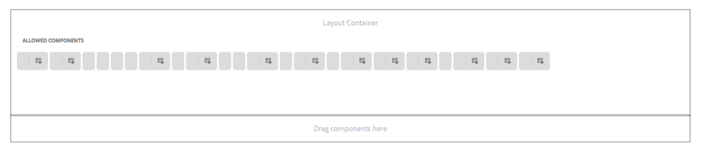

# AEM 6.4 Versionshinweise zum Cumulative Fix Pack {#aem-cumulative-fix-pack-release-notes}

## Versionshinweise {#release-information}

<!-- TBD: Update the SD URL. -->

| Produkte | **Adobe Experience Manager (AEM) 6.4** |
|---|---|
| Version | 6.4.8.4 |
| Typ | Cumulative Fix Pack |
| Datum | 25. Februar 2021 |
| Voraussetzung | [AEM 6.4 Service Pack 8 (6.4.8.0)](sp-release-notes.md) |
| Download-URL | [Softwareverteilung](https://experience.adobe.com/#/downloads/content/software-distribution/en/aem.html?package=/content/software-distribution/en/details.html/content/dam/aem/public/adobe/packages/cq640/cumulativefixpack/aem-6.4.8-cfp-4.0.zip) |

## Was ist in AEM 6.4.8.4 enthalten?{#what-s-included-in-aem}

AEM Cumulative Fix Pack 6.4.8.4 ist ein wichtiges Update, das seit der allgemeinen Verfügbarkeit von AEM 6.4 Service Pack 8 (6.4.8.0) im März 2020 mehrere interne und kundenspezifische Korrekturen enthält.

AEM 6.4.8.4 ist ein Cumulative Fix Pack (CFP), das von AEM 6.4 Service Pack 8 abhängig ist. Installieren Sie CFP nach der Installation von AEM 6.4 Service Pack 8.

Die wichtigsten Funktionen und Verbesserungen von [!DNL Adobe Experience Manager] 6.4.8.4 sind:

* Möglichkeit, die [!DNL Experience Manager Forms]-Registrierungsänderungen beim Ausführen einer PDFG-Konvertierung zu aktivieren oder zu deaktivieren.

* Authentifizierung für SOAP-basierte Webdienste im Formulardatenmodell durch X-509-Zertifikat.

* Das integrierte Repository (Apache Jackrabbit Oak) wird auf Version 1.8.24 aktualisiert.

Informationen zu CFP und anderen Veröffentlichungstypen finden Sie unter [AEM Update Release Vehicle Definitions](https://experienceleague.adobe.com/docs/experience-manager-release-information/aem-release-updates/update-release-vehicle-definitions.html?lang=en)

Adobe Experience Manager 6.4.8.4 bietet Fehlerbehebungen für die folgenden Probleme.

### Sites {#sites-6484}

* Nach der Installation von Experience Manager Service Pack 6.4.8.2 können Benutzer Inhaltsfragmentmodelle nicht bearbeiten. Der folgende Fehler tritt auf:

   `Uncaught TypeError: Cannot read property 'debounce' of undefined` (NPR-35312)
* Wenn ein Benutzer auf die Abmelde-Schaltfläche klickt, wird der Benutzer nicht von Package Manager abgemeldet. (NPR-35161)
* Nach dem Upgrade von Experience Manager 6.4.x auf Experience Manager 6.4.8.3 können Benutzer eine Seite nicht über Veröffentlichung verwalten veröffentlichen. (CQ-4312511)
* Wenn Sie eine untergeordnete Blueprint-Seite zurück an den ursprünglichen Speicherort verschieben, wird die Konfiguration cq:liveSyncConfig nicht von einer untergeordneten Live Copy-Seite entfernt. (NPR-35900)
* Wenn Sie einen Blueprint mit Live Copies hin und her verschieben, funktioniert nur der erste Schritt, dann schlägt er fehl und es wird keine Fehlermeldung angezeigt. (NPR-35899)


### [!DNL Assets] {#assets-6484}

* `IndexWriter.merge` verursacht  `OutOfMemoryError` Fehler, da Smart-Tagging-Funktionen große  `/oak:index/lucene` und  `/oak:index/ntBaseLucene` Indizes erstellen (NPR-35650).
* Benutzer können keine Assets einchecken, nachdem sie diese in [!DNL Adobe InDesign] bearbeitet haben, und erhalten einen Fehler wegen fehlender Berechtigungen. (NPR-35340)
* Wenn nach dem Auflösen des Namenskonflikts eine neue Version eines vorhandenen Assets erstellt wird, werden die Metadaten des ursprünglichen Assets überschrieben. (NPR-35939)
* Automatisch generierte private Ordner werden nicht beibehalten und nicht entfernt, wenn der Ordner gelöscht oder der Ordner mit der Optionseinstellung [!UICONTROL Private Ordnerbeschränkungen entfernen] aktualisiert wird (NPR-35625).

#### [!DNL Dynamic Media] {#dynamic-media}

* Der zeitweise auftretende ImageServer-Fehler verursacht eine 403-Antwort für einige Funktionen von [!DNL Experience Manager] und das daraus resultierende Fehlschlagen dieser Funktion. (CQ-4308565)

### Integrationen {#integrations-6484}

* Wenn Sie die Eigenschaften einer Seite nach dem Upgrade auf Experience Manager 6.4.8.3 öffnen, treten in der Konsole JavaScript-Fehler auf (NPR-35649).

### Forms {#forms-6484}

>[!NOTE]
>
>[!DNL Experience Manager Forms] veröffentlicht die Add-On-Pakete eine Woche nach dem geplanten Veröffentlichungsdatum der [!DNL Experience Manager] Cumulative Fix Packs.

**Korrespondenzverwaltung**

* Wenn Sie einen Brief bearbeiten, dauert das Laden der Module mit Bedingungen länger (NPR-35326).

* Beim Bearbeiten eines Briefs werden die Inhalte und Datenbindungen nicht auf der Benutzeroberfläche angezeigt (CQ-4312905).

**Document Services**

* PDF-Dateien können nach der Aktualisierung [!DNL JAVA] auf [!DNL JDK1.8.0_261] nicht zusammengeführt werden (NPR-35761, NPR-35848).

**Foundation JEE**

* Wenn Sie eine Aufgabenbenachrichtigung im [!DNL Forms]-Workflow bearbeiten, können Sie sie nicht speichern (CQ-4315055).

Informationen zu Sicherheitsupdates finden Sie auf der Seite [Experience Manager-Sicherheitsbulletins](https://helpx.adobe.com/security/products/experience-manager.html).

## Hotfixes und Feature Packs, die in früheren Cumulative Fix Packs enthalten waren {#hotfixes-and-feature-packs-included-in-previous-cumulative-fix-packs}

### Adobe Experience Manager 6.4.8.3 {#experience-manager-6483}

AEM Cumulative Fix Pack 6.4.8.3 ist ein wichtiges Update, das seit der allgemeinen Verfügbarkeit von AEM 6.4 Service Pack 8 (6.4.8.0) im März 2020 mehrere interne und kundenspezifische Korrekturen enthält.

AEM 6.4.8.3 ist ein Cumulative Fix Pack (CFP), das von AEM 6.4 Service Pack 8 abhängig ist. Installieren Sie CFP nach der Installation von AEM 6.4 Service Pack 8.

In AEM 6.4.8.3 wird das integrierte Repository (Apache Jackrabbit Oak) auf Version 1.8.23 aktualisiert.

Informationen zu CFP und anderen Veröffentlichungstypen finden Sie unter [AEM Update Release Vehicle Definitions](https://docs.adobe.com/content/help/en/experience-manager-65/deploying/deploying/update-release-vehicle-definitions.html)

Adobe Experience Manager 6.4.8.3 bietet Fehlerbehebungen für die folgenden Probleme.

#### Sites {#sites-6483}

* Wenn Sie den Text einer Variante eines Inhaltsfragments aktualisieren, wird der Inhalt des Übergeordneten Inhaltsfragments anstelle der Variante aktualisiert (NPR-35080).

* Wenn Sie einen numerischen Wert für die Beschriftungseigenschaft des Typs Zeichenfolge einer Komponente festlegen, die Komponente löschen und die Rückgängig-Option verwenden, um sie wiederherzustellen, ändert sich der Typ der Beschriftungseigenschaft automatisch von String in Long (NPR-34738).

* Wenn Sie eine Datei-Upload-Komponente zu mehreren Feldern hinzufügen, wird der Bildpfad im Komponentenknoten statt im Knoten Multi-Field gespeichert (NPR-34423).

* Im Assistenten Seite verschieben bleibt die nächste Schaltfläche aktiviert, auch wenn kein Ziel ausgewählt ist (NPR-34460).

* Wenn die übergeordnete Komponente die Eigenschaft `cq:isContainer` enthält, enthält die geerbte Komponente nicht automatisch die Eigenschaft (CQ-4308409).

* Wenn Sie die CSS-Minimierung mit der Funktion `calc()` verwenden, werden die Leerzeichen um das `+`-Zeichen entfernt (NPR-34991).

* Wenn Sie eine AEM Instanz starten, werden die Komponenten `com.adobe.granite.maintenance.impl.MaintenanceTaskManagerImpl` und `com.adobe.granite.maintenance.impl.TaskScheduler` nicht im Status `Active` angezeigt (NPR-34952).

#### [!DNL Assets] {#assets-6483}

* Beim Erstellen einer Version eines vorhandenen Assets wird das Benutzer-Update auf Metadaten nicht beibehalten, wenn ein Metadatenprofil auf den Ordner angewendet wird (NPR-34833).
* Bei Verwendung von [!DNL Adobe Asset Link] mit [!DNL Adobe InDesign] enthalten die Suchergebnisse keine Ordner und Sammlungen, sondern nur Assets (NPR-34700).
* Beim Ziehen eines Assets auf einen Ordner zum Verschieben zeigt die Benutzeroberfläche auch die Option [!UICONTROL In Lightbox ablegen] und [!UICONTROL In Sammlung ablegen] an. Selbst wenn der Verschiebungsvorgang abgebrochen wird, zeigt die Benutzeroberfläche weiterhin die beiden letztgenannten Optionen an (NPR-34525).
* Wenn die Benutzeroberfläche Veröffentlichung verwalten geöffnet ist, ist die Veröffentlichungsoption nicht verfügbar und bei Auswahl der Option Veröffentlichung rückgängig machen ist die Seite mit dem Umfang leer (CQ-4302509).

##### [!DNL Dynamic Media] {#dynamic-media-6483}

* Wenn in den Bildvorgabeneinstellungen die Option [!UICONTROL JPG-Chrominanz-Downsampling aktivieren] in [!DNL Experience Manager] deaktiviert ist, wird die Änderung nicht mit [!DNL Dynamic Media] synchronisiert (NPR-34284).
* Im [!UICONTROL Viewer-Vorgaben-Editor] ist bei der Bearbeitung der Vorgabe [!UICONTROL PanoramicImage/PanoramicImage_VR] in der Komponente `PanoramicView` die Modifikatorbeschriftung `PANORAMICVIEW_AUTOROTATE` nicht verfügbar (CQ-4302043).
* Beim Rückgängigmachen der Veröffentlichung eines Videos von [!DNL Experience Manager] wird die Veröffentlichung des adaptiven Videosets in konfigurierter Dynamic Media Classic nicht rückgängig gemacht. (CQ-4304405).

#### Plattform {#platform-6483}

* Die `emitUseStrict`-Markierung wird der Google Closure Compiler (GCC)-Prozessorfunktion `com.adobe.granite.ui.clientlibs.impl.HtmlLibraryManagerImpl` hinzugefügt. Die Markierung unterdrückt die Ausgabe der `use strict`-Anweisung (NPR-34830).
* Ein `NullPointerException` wird beim Starten von täglichen oder wöchentlichen Wartungsaufgaben zurückgegeben (NPR-34702).
* Das [!DNL Apache Sling Health Check]-Tool wird nicht mehr unterstützt. Verwenden Sie stattdessen [Musterdetektor](https://experienceleague.adobe.com/docs/experience-manager-64/deploying/upgrading/pattern-detector.html), um Inhaltsverletzungen zu erkennen (NPR-33929).

#### Integrationen {#integrations-6483}

* Die Schaltfläche [!UICONTROL Erstellen] wird auf der Seite [!UICONTROL Zielgruppen] angezeigt, wenn Sie von einem Ordner zur Seite [!UICONTROL Zielgruppen] navigieren (NPR-35152).

#### Benutzeroberfläche {#ui-6483}

* Das Suchfeld [!UICONTROL Filter] auf der [!UICONTROL Omnisearch]-Benutzeroberfläche gibt auch Ergebnisse von anderen Orten zurück als von wo aus die Suche ausgeführt wird (NPR-34877).
* Beim Schließen des Bedienfelds [!UICONTROL Filter] auf der [!UICONTROL Omnisearch]-Benutzeroberfläche wird die linke Leiste nicht auf die Auswahl [!UICONTROL Inhalt] zurückgesetzt, wodurch verhindert wird, dass das Bedienfeld [!UICONTROL Filter] erneut geöffnet wird (NPR-34483).
* Beim Zugriff auf die Seiteneigenschaften wird ein `NullPointerException` zurückgegeben (NPR-34509).

#### Communities {#communities-6483}

<!-- Following fixes of 6483 are documented on Nov 11 20202 by Vishabh. 
-->

* Alle Fälle ungleicher Terminologie im Produkt werden durch anerkannte Äquivalente ersetzt (NPR-34506).

#### Commerce {#commerce-6483}

* Wenn eine Kollektion mehr als 15 Produkte enthält, zeigt die Kollektion nur die ersten 15 Produkte an (NPR-34494).

#### Forms {#forms-6483}

>[!NOTE]
>
>[!DNL Experience Manager Forms] veröffentlicht die Add-On-Pakete eine Woche nach dem geplanten Veröffentlichungsdatum der [!DNL Experience Manager] Cumulative Fix Packs.

>[!NOTE]
>
>[!DNL Experience Manager] Das Cumulative Fix Pack enthält keine Korrekturen für  [!DNL Experience Manager Forms]. Sie werden mithilfe eines separaten [!DNL Forms] Add-On-Pakets bereitgestellt. Darüber hinaus wird ein kumulatives Installationsprogramm veröffentlicht, das Fehlerbehebungen für [!DNL Experience Manager Forms] auf JEE enthält. Weitere Informationen finden Sie unter [Installieren des AEM Forms Add-On-Pakets](#install-aem-forms-add-on-package) und [Installieren des AEM Forms JEE-Installationsprogramms](#install-aem-forms-jee-installer).

**Adaptive Formulare**

* Adaptive Formulare können nach Anwendung des [!DNL Experience Manager] Cumulative Fix Pack (NPR-35127) nicht mit der klassischen Benutzeroberfläche bearbeitet werden.

* Das Laden von Fragmenten in einem adaptiven Formular dauert aufgrund der Cache-Invalidierung länger. (NPR-34655)

* Barrierefreiheit: Die Registerkartennavigation funktioniert nicht ordnungsgemäß für Bildschirmlesehilfen in einem adaptiven Formular (NPR-34550).

**Korrespondenzverwaltung**

* Wenn Sie die Assets aus ES3 migrieren, enthalten die Assets zwei nicht bearbeitbare Standardbedingungen (NPR-34971).

**Foundation JEE**

* Migrieren Sie [!DNL AEM Forms] -Benutzer von Flash zu HTML (CQ-4304075).

### Adobe Experience Manager 6.4.8.2 {#experience-manager-6482}

AEM Cumulative Fix Pack 6.4.8.2 ist ein wichtiges Update, das seit der allgemeinen Verfügbarkeit von AEM 6.4 Service Pack 8 (6.4.8.0) im März 2020 mehrere interne und kundenspezifische Korrekturen enthält.

AEM 6.4.8.2 ist ein Cumulative Fix Pack (CFP), das von AEM 6.4 Service Pack 8 abhängig ist. Installieren Sie CFP nach der Installation von AEM 6.4 Service Pack 8.

In AEM 6.4.8.2 wird das integrierte Repository (Apache Jackrabbit Oak) auf Version 1.8.22 aktualisiert.

Informationen zu CFP und anderen Veröffentlichungstypen finden Sie unter [AEM Update Release Vehicle Definitions](https://docs.adobe.com/content/help/en/experience-manager-65/deploying/deploying/update-release-vehicle-definitions.html)

Adobe Experience Manager 6.4.8.2 bietet Fehlerbehebungen für die folgenden Probleme.

#### Sites {#sites-6482}

* Wenn `RolloutConfigManagerFactoryImpl` keine Rollout-Konfiguration laden kann, wird nicht versucht, die fehlenden Konfigurationen zu laden. Es werden die zwischengespeicherten Konfigurationen zurückgegeben (NPR-34091).
* In der Text-Kernkomponente wird nach Verwendung der HTML-Bearbeitungsoption der Quelle die Klasse aus dem Tag `em` entfernt (NPR-34080).
* Wenn Sie von Experience Manager 6.2 auf Experience Manager 6.5 aktualisieren, wird die Parsys-Komponente statischer Vorlagen nicht korrekt angezeigt. Die Höhe der Parsys-Komponente ist auf 0 festgelegt und die darin enthaltenen Komponenten sind nicht sichtbar (NPR-34044).
* Die Beschriftungsinformationen der zulässigen Komponenten werden im Vorlageneditor nicht angezeigt (NPR-33908).

   

* Benutzer können nach der vierten Ebene verschachtelter Komponenten keine Komponenten zum parsys hinzufügen oder bearbeiten (NPR-33873).
* Wenn der anfängliche Inhalt einer bearbeitbaren Vorlage geändert und die Vorlage veröffentlicht wird, zeigen alle neuen Seiten, die mit dieser Vorlage erstellt wurden, das Veröffentlichungsdatum der Vorlage an, auch wenn die Seiten nicht veröffentlicht werden (NPR-33822).
* Die Eigenschaften `cq:acLinks` und `cq:acUUID` für [!DNL Adobe Campaign] auf der Kopie werden beim Kopieren und Einfügen entfernt (NPR-33793).
* Auf der Registerkarte [!UICONTROL Live-Nutzung] werden nur 49 Ergebnisse angezeigt. Es wird nicht die gesamte Verwendung für die Komponente angezeigt (NPR-33710).
* Eine Webseite mit dem Zeichen `/` in der URL reagiert beim Authoring nicht mehr. Wenn beim Authoring eine Komponente hinzugefügt wird, erhöht sich die CPU-Auslastung und der Browser reagiert nicht mehr (NPR-33625).
* Im Inline-Bearbeitungsmodus in [!DNL RTE] funktioniert das Ziehen eines Bildes nicht für die Textkomponente (NPR-33579).
* Es ist möglich, eine Komponente in einer Blueprint-Seite mit demselben Namen wie die Seite zu erstellen. Während des Rollouts wird eine solche Komponente durch Suffix `_msm_moved` umbenannt. Die Komponente wird jedoch an das Ende des [!UICONTROL Absatzsystems] (NPR-33534) verschoben.
* Die Launch-Promotion veröffentlicht keine Seiten, wenn die Eigenschaft [!UICONTROL Include-Unterseiten] im ersten Inhaltsstamm nicht aktiviert ist (NPR-33533).
* Die Umleitung auf die Seite [!DNL Experience Manager] mit Anker funktioniert nicht in der Autoreninstanz, da `PageRedirectServlets` Abfragezeichenfolgen nach einem URL-Fragment oder Anker setzt (NPR-34287).
* `PageRedirectServlet` wird  `.html` nach der Sling-Zuordnung angehängt, was zu Link-Fehlern führt (NPR-34271).
* Sie können die [!DNL Live Copy] einer Seite aussetzen und die Vererbung ist, wie im Editor-Modus angezeigt, unterbrochen. In den Seiteneigenschaften zeigt das Symbol für Vererbung jedoch fälschlicherweise an, dass die Vererbung vorhanden und nicht beschädigt ist (NPR-34096).
* Problem mit der Anzeige der zulässigen Komponenten auf der Seite Vorlage bearbeiten (CQ-4297295).
* Nach dem Upgrade von Chrome und Firefox funktionieren die Popup-Menüs nicht erwartungsgemäß. Beim Laden der Seiteneigenschaften wird das Bedienfeld nicht angezeigt, wenn darin Daten enthalten sind. (CQ-4292995)
* Mehrere Site-übergreifende Skripterstellungsinstanzen in [!DNL Experience Manager Sites] -Komponenten (NPR-33926).
* Benutzereingaben sind beim Senden von Informationen an den Client für verschiedene Komponenten nicht angemessen kodiert (NPR-33696).
* Eine URL, die auf `childrenlist.html` endet, zeigt eine HTML-Seite anstelle einer 404-Antwort an. Solche URLs sind anfällig für Site-übergreifendes Skripting (NPR-33441).

#### Assets {#assets-6482}

* Die Textextraktion für die hochgeladenen PDF-Dateien funktioniert nicht und die Volltextsuche nach einigen Wörtern in einer PDF-Datei kann diese PDF-Datei nicht abrufen. (NPR-34165)

   >[!NOTE]
   >Damit diese Korrektur funktioniert, starten Sie die Adobe Experience Manager-Instanz nach der Installation des Service Packs 6.4.8.2 neu.

* Backslashes werden vor Sonderzeichen in Suchvorschlägen von Assets hinzugefügt, deren Name Sonderzeichen enthält (NPR-33833).

* Die benutzerdefinierten Filter, die als Smart-Sammlungen gespeichert werden, werden nicht korrekt auf Assets angewendet. Daher sind die Suchergebnisse nicht korrekt   (NPR-33725).

* Die Zeitleiste eines Assets in einem Ordner, der neu angeordnet wurde, zeigt an, dass das Asset verschoben wurde (NPR-33580).

* Das Rückgängigmachen der Veröffentlichung der Assets stapelweise von [!DNL Brand Portal] führt zum `Request-URI Too Long`-Fehler (NPR-34158).

* In der Spaltenansicht, wenn der Benutzer die Option [!UICONTROL Filter] auswählt, nachdem er einen Satz von Assets ausgewählt hat (die Assets werden deaktiviert), und dann einen anderen Satz von Assets zum Verschieben auswählt, werden die zuvor ausgewählten Assets ebenfalls an den neuen Speicherort verschoben (NPR-34018).

* Die Bildlaufleiste ist in der Listenansicht nicht sichtbar, selbst wenn zahlreiche Assets auf die Seite passen (NPR-34156).

* Die Seite [!UICONTROL Veröffentlichung verwalten] für Assets ist fehlerhaft und die darin enthaltenen Optionen funktionieren nicht (CQ-4302509).

**Dynamic Media**

* Die Funktion für smartes Zuschneiden schlägt mit einem Fehler fehl, wenn einem Ordner mit mehreren Seitenverhältnissen (z. B. 11) ein Bildprofil hinzugefügt wird (NPR-34083).

* Änderungen an Bildvorgaben in [!UICONTROL Adobe Experience Manager] werden nicht mit Dynamic Media Classic synchronisiert (NPR-34284, CQ-4299713).

* Die Bezeichnung [!UICONTROL PANORAMICVIEW_AUTOROTATE] für den Modifikator fehlt auf der Registerkarte [!UICONTROL Verhalten] auf der Seite [!UICONTROL Viewer-Vorgabe-Editor] (CQ-4302043).

#### Plattform {#platform-6482}

* Die Standardwerte für die Einstellungen **[!UICONTROL Verbindungs-Timeout]** und **[!UICONTROL Socket-Timeout]** für die Konfiguration des Standardagenten (Publish) sind nicht angegeben (NPR-33708).
* Der Planer für Wartungsaufgaben startet und beendet Wartungsaufgaben zu oft als konfiguriert (NPR-33520).
* Protokolle können nicht mit dem Diagnosetool auf einer aktualisierten Experience Manager-Instanz heruntergeladen werden (NPR-34419).

#### Integrationen {#integrations-6482}

* Der Wert von `library_path` wird beim Generieren der [!DNL Adobe Launch] Bibliotheks-URL für Bibliotheken, die aus [!DNL Adobe Dynamic Tag Management] migriert werden, nicht berücksichtigt. Außerdem verwenden die migrierten Bibliotheken ein anderes Präfix als [!DNL Adobe Launch] -Bibliotheken. (NPR-34238).
* Die von einem Cloud-Service geerbten Eigenschaften bleiben beim Aktualisieren der Seiteneigenschaften nicht erhalten (NPR-33865).

#### Benutzeroberfläche {#ui-6482}

* Die Anzeige der Anzahl ausgewählter Assets auf einer Suchseite ist falsch (NPR-33540).

#### Communities {#communities-6482}

* Die vorhandenen Benutzer einer Community-Gruppe, die über die Admin Console hinzugefügt wurde, werden bei jeder Änderung in der Community-Gruppenkonsole aus der Benutzerliste entfernt (NPR-34312).

#### Forms {#forms-6482}

>[!NOTE]
>
>[!DNL Experience Manager] Das Cumulative Fix Pack enthält keine Korrekturen für  [!DNL Experience Manager Forms]. Sie werden mithilfe eines separaten [!DNL Forms] Add-On-Pakets bereitgestellt. Darüber hinaus wird ein kumulatives Installationsprogramm veröffentlicht, das Fehlerbehebungen für [!DNL Experience Manager Forms] auf JEE enthält. Weitere Informationen finden Sie unter [Installieren des AEM Forms Add-On-Pakets](#install-aem-forms-add-on-package) und [Installieren des AEM Forms JEE-Installationsprogramms](#install-aem-forms-jee-installer).

**Adaptive Formulare**

* Wenn ein adaptives Formularfragment fehlt, kann das adaptive Formular nicht wiedergegeben werden. (NPR-34303)

* Die Inhaltsbeschreibung für ein adaptives Formularfeld zeigt ein HTML-Tag für Absatz an (NPR-34117).

* Wenn Sie einen Forms-Container auf einer [!DNL Experience Manager Sites]-Seite hinzufügen, zeigt die Seite die folgende Fehlermeldung an und lässt das Hinzufügen neuer Komponenten nicht zu (NPR-33858):

   `DevTools failed to load SourceMap: Could not load content for <Link>. HTTP error: status code 404, net::ERR_HTTP_RESPONSE_CODE_FAILURE`

* Wenn Sie die Eigenschaft **[!UICONTROL Auf Server]** erneut überprüfen und mehrere Anlagen hochladen, kann das adaptive Formular nicht gesendet werden (NPR-33701).

* Wenn Sie die Optionen **[!UICONTROL Seitensprache verwenden]** und **[!UICONTROL Formular für die gesamte Breite der Optionen Seite]** in der Komponente [!DNL Experience Manager Forms] auf einer [!DNL Experience Manager Sites]-Seite auswählen, schlägt die Übersetzung der Seite fehl (NPR-33641).

* Wenn Sie ein adaptives Formular mit aktivierter Analysefunktion senden, das in eine [!DNL Experience Manager Sites]-Seite eingebettet ist, funktioniert die Analyse nicht ordnungsgemäß (NPR-31359).

* Abhängigkeiten von [!DNL Lodash]- und [!DNL backbone]-Bibliotheken wurden entfernt (NPR-33458).

* Die Übermittlungsaktion **[!UICONTROL An REST-Endpunkt senden]** funktioniert nicht für ein adaptives Formular (NPR-34513).

* Barrierefreiheit: Wenn Sie versuchen, ein adaptives Formular zu senden, ohne eine Anlage für ein Pflichtfeld hochzuladen, wird der Fokus nicht automatisch auf das Anlagenfeld verschoben (NPR-34511).

* Benutzereingaben sind für [!DNL Forms]-Komponenten beim Senden von Informationen an den Client nicht angemessen kodiert (NPR-33611).

**Arbeitsablauf**

* [!DNL Experience Manager] Workflow-Bereinigung schlägt fehl und zeigt die folgende Fehlermeldung an (NPR-33576):

   `java.lang.UnsupportedOperationException: The query read more than 500000 nodes in memory`

* Wenn Sie [!DNL Experience Manager] 6.4.8.1 installieren, wird die Liste der Elemente [!UICONTROL To Do] nicht als Link angezeigt. Der Text für die Elemente [!UICONTROL To Do] enthält HTML-Tags (NPR-34318).

**BackendIntegration**

* Formulardatenmodell kann nicht in einer auf AWS gehosteten [!DNL Experience Manager Forms Linux]-Umgebung konfiguriert werden (NPR-33617).

**Designer**

* Wenn [!DNL Acrobat DC] auf einem [!DNL Experience Manager] Forms-Server installiert ist, ist die Option **[!UICONTROL Formular]** verteilen in [!DNL Experience Manager Designer] Version 6.x nicht verfügbar (NPR-34325).

**Dokumentensicherheit**

* Der Sign-Vorgang mit HSM-basierten Zertifikaten kann nicht in einer PDF-Datei ausgeführt werden, nachdem [!DNL Experience Manager] 6.4.8.0 installiert wurde (NPR-34309).

**Aktualisierung**

* Wenn Sie die [!DNL JBoss]-Version auf 7.0.9 für [!DNL Experience Manager Forms] mit Document Security in einer [!DNL Linux]-Umgebung aktualisieren, tritt ein Fehler auf (CQ-4300546).

Informationen zu Sicherheitsupdates finden Sie auf der Seite [Experience Manager-Sicherheitsbulletins](https://helpx.adobe.com/security/products/experience-manager.html).

### Adobe Experience Manager 6.4.8.1 {#experience-manager-6481}

AEM Cumulative Fix Pack 6.4.8.1 ist ein wichtiges Update, das seit der allgemeinen Verfügbarkeit von AEM 6.4 Service Pack 8 (6.4.8.0) im März 2020 mehrere interne und kundenspezifische Korrekturen enthält.

AEM Cumulative Fix Pack 6.4.8.1 ist von AEM 6.4 Service Pack 8 abhängig. Daher müssen Sie das AEM Cumulative Fix Pack 6.4.8.1-Paket nach der Installation von AEM 6.4 Service Pack 8 installieren.

Zu den wichtigsten Highlights von AEM 6.4.8.1 gehören:

* Der anonyme Zugriff auf die CRXDE Lite ist zur Erhöhung der Sicherheit nicht zulässig. Stattdessen werden die Benutzer zum Anmeldebildschirm weitergeleitet. Siehe [Entwickeln mit CRXDE Lite](/help/sites-developing/developing-with-crxde-lite.md).
* Die Package Share-Integration mit Adobe Experience Manager wurde entfernt.
* Das integrierte Repository (Apache Jackrabbit Oak) wird auf Version 1.8.21 aktualisiert.

Informationen zu CFP und anderen Veröffentlichungstypen finden Sie unter [AEM Update Release Vehicle Definitions](https://docs.adobe.com/content/help/en/experience-manager-65/deploying/deploying/update-release-vehicle-definitions.html)

Adobe Experience Manager 6.4.8.1 bietet Fehlerbehebungen für die folgenden Probleme.

#### Sites {#sites-6481}

* Anonyme Benutzer können auf CRX DE Lite-Funktionen zugreifen (NPR-33522).
* Wenn der Name einer lokalen Komponente in einer Live Copy mit dem Namen einer Komponente im Blueprint identisch ist und die Komponente aus dem Blueprint ausgerollt wird, wird der Begriff _msm_moved nicht zum Namen der lokalen Komponente hinzugefügt (NPR-33207).
* Die an die ursprüngliche Anfrage angehängten Parameter sind nicht in der Umleitungs-URL enthalten (NPR-33174).
* Wenn die Option Coral.Select den Wert emptyOption=true festlegt oder ein Standardelement mit dem Wert = &quot;&quot;enthält, tritt in der Datei dropdownshowhide.js ein Fehler auf: Uncaught TypeError: component.getValue ist keine Funktion (NPR-33163).
* Wenn eine Komponente eine andere Komponente als data-sly-resource enthält, wird der Platzhalter der übergeordneten Container-Komponente durch den Platzhalter für die inneren Komponenten ersetzt (NPR-33119).
* Wenn Sie ein Inhaltsfragment auf einem Schema basieren und einen obligatorischen Textbereich oder ein Pfadfeld enthält, kann das Inhaltsfragment nicht gespeichert werden. (NPR-33007)
* Wenn Sie eine benutzerdefinierte Komponente mit der vordefinierten Experience Fragment-Komponente erstellen und sie auf AEM Sites-Seiten verwenden, zeigt AEM keine Verweise (Verwendung) für die benutzerdefinierte Komponente an (NPR-32852).
* Wenn eine AEM Sites-Seite Teil eines großen Inhaltssatzes mit mehreren Live Copies ist, kann die Vorschau des Seitenversionsverlaufs nicht geladen werden. (NPR-32772)
* Wenn Sie einen Launch bewerben, wird das Mixin &quot;cq:LiveRelationship&quot;zu jeder im Launch hinzugefügten Komponente hinzugefügt. Sie wirkt sich auf alle Launches aus, unabhängig davon, ob ein Launch mit oder ohne Auswahl der Option — Quellseiten-Live-Daten übernehmen — erstellt wird (NPR-32664).
* Beim Start der Paginierung lädt die Experience Fragments-Auswahl nicht alle Elemente (NPR-32605).
* Launch für eine AEM Sites-Seite kann nicht erstellt werden. Die Launch-Erstellung führt zu einem Fehler (NPR-32544).
* Veröffentlichung verwalten enthält keine referenzierten Assets im Aktivierungsanfrage-Workflow (NPR-32463).
* Die Dispatcher-Konsistenzprüfung zeigt die Warnmeldung `Invalid cookie header` in den Protokolldateien an (NPR-33630).
* Die Salesforce-Integration ist anfällig für SSRF (NPR-32671).
* XSS in PreferencesServlet (NPR-33439) dargestellt.

#### Assets {#assets-6481}

* Die Anzahl der Assets ändert sich nicht entsprechend der Änderung der Auswahl in der Listenansicht (NPR-33285).

* Die Schaltfläche Weiter ist nicht aktiviert, wenn der übergeordnete Knoten ausgewählt (wobei ein einzelner untergeordneter Ordner sichtbar ist) und anschließend der untergeordnete Ordner ausgewählt wird (NPR-33284).

* Die Touch-Benutzeroberfläche kann für Benutzer, die keinen Lesezugriff auf den Repository-Stammordner haben, nicht gerendert werden (mit Fehler), wenn der DMS7- oder Hybridmodus aktiviert ist (NPR-33175).

* Die GB18030-Zeichen, die in Ordnern und Asset-Namen vorkommen, werden in den heruntergeladenen ZIP-Dateien leer angezeigt (NPR-33150).

* Der Ordner &quot;Mehr&quot;wird beim smarten Zuschneiden eines Assets erstellt, das sich in einem übergeordneten Ordner mit dem Punkt `.` im Namen befindet (NPR-32755).

* Das verzögerte Laden wird nicht ausgelöst und bei der Auswahl, die Aufgaben aus dem Benachrichtigungs-Posteingang zu überprüfen, werden nicht mehr als 100 Assets angezeigt. (NPR-32749)

* Die Linkseite für die Freigabe der Sammlung ist aufgrund von Änderungen in coral-info fehlerhaft (NPR-32510).

* Die Asset-Verarbeitung beim Massen-Upload wird blockiert (CQ-4293916).

* SSRF-Schwachstelle in Experience Manager (NPR-33437).

#### Plattform {#platform-6481}

* Der Filter [!DNL Sling] wird nicht aufgerufen, wenn der Zuordnungseintrag `sling:match` unter `/etc/maps` erstellt wird (NPR-33308).
* Alle Flush-Agenten werden beim Deaktivieren einer Seite ausgelöst (NPR-32941).
* Wenn Sie die `ScriptProcessor`-API zum Minimieren einer JavaScript-Bibliothek verwenden, zeigt die Protokolldatei eine Fehlermeldung an, dass der JavaScript-Code nicht mit dem strikten Modus konform ist. Die API bietet keine Option zum Aktivieren oder Deaktivieren des strikten Modus. (NPR-32746).
* Wenn eine SQL-Abfrage länger ausgeführt wird, z. B. 7 Stunden, reagiert AEM nicht mehr (NPR-33043).

#### Benutzeroberfläche {#ui-6481}

* Wenn Sie einen Pfad mithilfe eines Auswahldialogfelds suchen oder durchsuchen, zeigt das Auswahldialogfeld alle Inhalte des ausgewählten JCR-Knotens an, anstatt nur die Bilder anzuzeigen (NPR-32712).

#### Übersetzungsprojekte {#tranlation-6481}

* In den Protokollen wird beim Ausführen eines Übersetzungsauftrags ein `NullPointerException`-Fehler angezeigt (NPR-32220).

#### Integrationen {#integrations-6481}

* Site-übergreifendes Skripting für JSON (NPR-32745).

#### Communities {#communities-6481}

* Autoren werden nach der Erstellung einer neuen Gruppe nicht zum Abschnitt [!UICONTROL Community-Gruppe] unter [!DNL Internet Explorer] 11 weitergeleitet (NPR-33202).
* Beim Zugriff auf die Seite [!UICONTROL Aktivitäts-Stream] tritt ein Fehler auf (NPR-33152).
* Wenn Sie eine [!DNL Communities]-Gruppe bearbeiten und das Miniaturbild ändern, wird das Gruppenminiaturbild nicht aktualisiert. (NPR-32603)
* Beim Erstellen einer Version von Benachrichtigungen und Abonnements von benutzergenerierten Inhalten (UGC) wird eine falsche ID der Quellseite gespeichert (CQ-4289703).
* Site-übergreifendes Skriptproblem (NPR-33212).

#### Workflow {#workflow-6481}

* Einige Komponenten werden nicht im Dialogfeld angezeigt, das angezeigt wird, wenn ein Benutzer einen Workflow abschließt, der einen [!UICONTROL Dialog Participant step] enthält (NPR-32989).

* Die Option [!UICONTROL Timeline] in der linken Leiste benötigt mehr Zeit zum Laden als erwartet (NPR-32850).

#### Forms {#forms-6481}

>[!NOTE]
>
>AEM Cumulative Fix Pack enthält keine Fehlerbehebungen für AEM Forms. Diese werden im Rahmen eines separaten Add-on-Pakets für Forms bereitgestellt. Außerdem wird ein kumulatives Installationsprogramm herausgegeben, das Fehlerbehebungen für AEM Forms JEE enthält. Weitere Informationen finden Sie unter [Installieren des AEM Forms Add-On-Pakets](#install-aem-forms-add-on-package) und [Installieren des AEM Forms JEE-Installationsprogramms](#install-aem-forms-jee-installer).

* Correspondence Management: Wenn ein Benutzer Inhalte aus einem [!DNL Word]-Dokument einfügt, behält das Textdokumentfragment keine Formatierung bei (NPR-33213).
* Adaptive Forms: Eine neue Zeile zu einer Zeichenfolge in einem Wörterbuch für adaptive Formulare fügt dem Wörterbuch `&#xa;` -Zeichen hinzu (NPR-33265).
* Adaptive Forms: Der Benutzer kann ein adaptives Formular nicht mit mehr als einem Anhang speichern (NPR-33214).
* Adaptive Forms: `AddInstance` und `RemoveInstance` Methoden für die Instanz-Manager-Klasse fügen keine dynamische Anzahl von Instanzen für verzögerte Ladefragmente unter [!DNL Internet Explorer 11] hinzu (NPR-33201).
* Adaptive Forms: Analytics, das für ein adaptives Formular aktiviert ist, das in eine [!DNL Sites]-Seite eingebettet ist, zeichnet keine Daten für Senden- und Abbruchsereignisse auf (NPR-31359).
* Adaptive Forms: Wenn ein Benutzer den Inhalt aus einem [!DNL Word]-Dokument in ein adaptives Formular eingefügt und es sendet, enthält das gesendete adaptive Formular Unicode-Zeichen. Darüber hinaus schlägt die Konvertierung von PDF in PDF/A aufgrund von Unicode-Zeichen fehl (NPR-33348).
* BackendIntegration: Formulardatenmodellanforderungen schlagen fehl, da das Aktualisierungs-Token aufgrund eines falschen inaktiven Status abläuft (NPR-33168).
* Document Services: Der Convert PDF-Dienst kann PDF-Dokumente nicht in PostScript konvertieren, da Gibson-JARs für [!DNL WebLogic] auf dem [!DNL Linux]-Server fehlen (NPR-33515, CQ-4292239).
* Document Services: Wenn ein Benutzer eine Textdatei in eine PDF-Datei konvertiert, werden japanische Zeichen nicht korrekt dargestellt (NPR-33239).
* XSS wird mit dem GuideSOMProviderServlet gespeichert (NPR-32701).

## Installieren von Version 6.4.8.4 {#install}

### Einrichtungsvoraussetzungen {#setup-requirements}

<!--

>[!NOTE]
>
>For successful installation of AEM 6.4.6.0 on the instance, it is strongly recommended to upgrade the version of com.adobe.granite.oak.s3connector to 1.8.4 for the customers who are on the older version of s3 connector.
>The process of upgrading the com.adobe.granite.oak.s3connector is available at [https://helpx.adobe.com/in/experience-manager/6-4/sites/deploying/using/data-store-config.html](https://helpx.adobe.com/in/experience-manager/6-4/sites/deploying/using/data-store-config.html).
>Download the latest version of com.adobe.granite.oak.s3connector from: [https://repo.adobe.com/nexus/content/groups/public/com/adobe/granite/com.adobe.granite.oak.s3connector/](https://repo.adobe.com/nexus/content/groups/public/com/adobe/granite/com.adobe.granite.oak.s3connector/)

-->

>[!CAUTION]
>
>Für Kunden mit Feature Packs, die in AEM 6.4 installiert sind. Die von Adobe bereitgestellten optionalen Feature Packs hängen von der Release-Version und den Service Packs ab. Wenn Sie Feature Pack installiert haben, wenden Sie sich an das AEM Kundenunterstützungsteam, um die Kompatibilität dieser Feature Packs mit diesem kumulativen Fixpack für AEM 6.4 zu überprüfen.

* Für AEM 6.4.8.4 ist AEM 6.4.8.0 erforderlich. Detaillierte Anweisungen finden Sie in der [Upgrade-Dokumentation](../sites-deploying/upgrade.md) .
* Installieren Sie bei einer Implementierung mit MongoDB und mehreren Instanzen AEM 6.4.8.4 mithilfe von Package Manager auf einer der Autoreninstanzen.
* Stellen Sie vor der Installation des Cumulative Fix Packs sicher, dass Sie einen Schnappschuss oder eine neue Sicherung Ihrer AEM-Instanz haben.
* Starten Sie die Instanz vor der Installation neu. Dies ist zwar nur dann erforderlich, wenn sich die Instanz noch im Aktualisierungsmodus befindet (und dies ist der Fall, wenn die Instanz gerade von einer früheren Version aktualisiert wurde). Dennoch wird dies allgemein empfohlen, wenn die Instanz über einen längeren Zeitraum ausgeführt wurde.

>[!NOTE]
>
>Adobe rät davon ab, das AEM 6.4.8.4-Paket zu entfernen oder zu deinstallieren.

### Installieren Sie das kumulative Fixpack {#install-cumulative-fix-pack}

Führen Sie die folgenden Schritte aus, um das Cumulative Fix Pack auf einer vorhandenen AEM 6.4.8.0-Instanz zu installieren:

1. Klicken Sie auf den Link [Software Distribution](https://experience.adobe.com/#/downloads/content/software-distribution/en/aem.html?package=/content/software-distribution/en/details.html/content/dam/aem/public/adobe/packages/cq640/cumulativefixpack/aem-6.4.8-cfp-4.0.zip), um das Paket herunterzuladen.

1. Öffnen Sie [Package Manager](http://localhost:4502/crx/packmgr/index.jsp) und klicken Sie auf **[!UICONTROL Paket hochladen]**, um das Paket hochzuladen.

1. Wählen Sie das Paket aus und klicken Sie auf **[!UICONTROL Installieren]**.

>[!NOTE]
>
>**Das Dialogfeld auf der Benutzeroberfläche von Package Manager wird in einigen Fällen während der Installation von 6.4.8.4 frühzeitig beendet.**
>
>Es wird daher empfohlen, auf die Stabilisierung der Fehlerprotokolle zu warten, bevor auf die Instanz zugegriffen wird. Der Benutzer muss auf bestimmte Protokolle im Zusammenhang mit der Deinstallation des Aktualisierungs-Bundles warten, bevor sichergestellt wird, dass die Installation erfolgreich ist. In der Regel trifft dies auf Safari zu, kann aber mitunter auch auf allen anderen Browsern der Fall sein.

### Automatische Installation {#auto-installation}

Es gibt zwei Möglichkeiten, AEM 6.4.8.4 automatisch in einer laufenden Instanz zu installieren:

A. Platzieren Sie das Paket in ..Ordner */crx-quickstart/install*, während der Server läuft. Das Paket wird automatisch installiert.

B. Verwenden Sie die [HTTP-API von Package Manager](https://helpx.adobe.com/de/experience-manager/aem-previous-versions.html) - stellen Sie sicher, dass Sie `cmd=install&recursive=true` verwenden - damit das verschachtelte Paket installiert wird.

>[!NOTE]
>
>AEM 6.4.8.4 unterstützt keine Bootstrap-Installation.

### Bestätigen der Installation {#validate-install}

1. Auf der Seite „Produktinformationen“ (*/system/console/productinfo*) sollte nun unter „Installierte Produkte“ die aktualisierte Version „Adobe Experience Manager, Version 6.4.8.4“ angezeigt werden.
1. Alle OSGI-Bundles sind in der OSGI-Konsole entweder AKTIV oder FRAGMENT. (Verwenden Sie die Web-Konsole: /system/console/bundles.)
1. Das OSGI-Bundle org.apache.jackrabbit.oak-core befindet sich auf Version 1.8.17 oder höher (Webkonsole verwenden: /system/console/bundles).

Informationen zur Bestimmung der zertifizierten Plattform für die Ausführung mit dieser Version von AEM Sites und Assets finden Sie unter [Technische Anforderungen](../sites-deploying/technical-requirements.md).

>[!NOTE]
>Bei erfolgreicher Installation des Pakets erscheint eine Informationsmeldung, die angibt, dass das Inhaltspaket erfolgreich installiert wurde, z. B. **&quot;Inhaltspaket AEM-6.4-Service-Pack-8 erfolgreich installiert wurde&quot;**.

### Aktualisieren von Dynamic Media-Viewern (5.10.1) {#update-dynamic-media-viewers}

AEM Version 6.4.8.4 enthält eine neue Version von Dynamic Media-Viewern (5.10.1), die die Überprüfung auf doppelte Namen auf der Seite Bildvorgabe ermöglicht. Dynamic Media-Kunden wird empfohlen, den folgenden Befehl auszuführen, um die standardmäßigen Viewer-Vorgaben in einen aktuellen Status zu versetzen.

`curl -u admin:admin http://localhost:4502/libs/settings/dam/dm/presets/viewer.pushviewerpresets`

, wodurch neue Viewer-Vorgaben in den Speicherort /conf kopiert werden.

### Installieren des AEM Forms-Add-on-Pakets {#install-aem-forms-add-on-package}

>[!NOTE]
>
>[!DNL Experience Manager Forms] veröffentlicht die Add-On-Pakete eine Woche nach dem geplanten Veröffentlichungsdatum der [!DNL Experience Manager] Cumulative Fix Packs.

>[!NOTE]
>
>Überspringen Sie diesen Schritt, wenn Sie AEM Forms nicht verwenden. Fehlerbehebungen in AEM Forms werden über ein separates Add-on-Paket bereitgestellt.

1. Stellen Sie sicher, dass Sie das AEM Cumulative Fix Pack installiert haben.
1. Laden Sie das entsprechende Formular-Add-On-Paket herunter, das unter [AEM Forms releases](https://experienceleague.adobe.com/docs/experience-manager-release-information/aem-release-updates/forms-updates/aem-forms-releases.html?lang=en#forms-updates) für Ihr Betriebssystem aufgeführt ist.
1. Installieren Sie das Formular-Add-On-Paket wie unter [Installieren AEM Forms-Add-On-Pakete](https://docs.adobe.com/content/help/en/experience-manager-64/forms/install-aem-forms/osgi-installation/installing-configuring-aem-forms-osgi.html#install-aem-forms-add-on-package) beschrieben.

### Installieren des AEM Forms JEE-Installationsprogramms {#install-aem-forms-jee-installer}

>[!NOTE]
>
>Überspringen Sie diesen Schritt, wenn Sie AEM Forms JEE nicht verwenden. Fehlerbehebungen in AEM Forms JEE werden über ein separates Installationsprogramm bereitgestellt.

Informationen zum Installieren des kumulativen Installationsprogramms für AEM Forms JEE und zur Konfiguration nach der Bereitstellung finden Sie unter [AEM Forms JEE-Patch-Installationsprogramm](jee-patch-installer-64.md).

>[!NOTE]
>
>Nachdem Sie das kumulative Installationsprogramm für Experience Manager Forms on JEE installiert haben, installieren Sie das neueste Add-On-Paket für Forms, löschen Sie das Add-On-Paket für Forms aus dem Ordner `crx-repository\install` und starten Sie den Server neu.

### Uber Jar {#uber-jar}

Das Uber Jar für AEM 6.4.8.4 ist im [Maven Central Repository](https://repo.maven.apache.org/maven2/com/adobe/aem/uber-jar/6.4.8.4/) verfügbar.

Informationen zur Verwendung von Uber Jar in einem Maven-Projekt finden Sie in [diesem Artikel](../sites-developing/ht-projects-maven.md). Beziehen Sie die folgenden Abhängigkeiten in Ihr Projekt-POM ein:

```shell
<dependency>
      <groupId>com.adobe.aem</groupId>
      <artifactId>uber-jar</artifactId>
      <version>6.4.8.4</version>
      <scope>provided</scope>  
</dependency>
```

>[!NOTE]
>
>UberJar und andere zugehörige Artefakte sind im Maven Central Repository anstelle des Adobe Public Maven-Repositorys (repo.adobe.com) verfügbar. Die UberJar-Hauptdatei wird in `uber-jar-<version>.jar` umbenannt. Daher gibt es für das Tag `dependency` kein `classifier` mit dem Wert `apis`.

## Entfernte/veraltete Funktionen {#removed-deprecated-features}

Dieser Abschnitt listet Funktionen und Fähigkeiten auf, die aus AEM 6.4 entfernt oder veraltet sind.

| Bereich | Funktion | Ersatz | Version |
|---|---|---|---|
| Assets | Tag-Aktion für Teil-Assets verwalten | Kein Ersatz vorhanden. | AEM 6.4.2.0 |
| Assets und Adobe Creative Cloud-Integration | [Die gemeinsame Nutzung von AEM-Ordnern in Creative Cloud](https://docs.adobe.com/content/help/de-DE/experience-manager-64/assets/administer/aem-cc-folder-sharing-best-practices.html) wurde in AEM 6.2 eingeführt, um Benutzern von Creative Cloud den Zugang zu den Assets von AEM zu ermöglichen. Eine neue Funktion des Creative Cloud-Programms, Adobe Asset Link, bietet ein wesentlich besseres Benutzererlebnis und einen leistungsfähigeren Zugriff auf Assets aus AEM direkt aus Photoshop, InDesign und Illustrator heraus. Adobe wird die Ordnerfreigabe nicht weiter verbessern. Auch wenn die Funktion in AEM enthalten ist, empfehlen die Kunden dringend, den Ersatz zu verwenden. | Adobe Asset Link oder Desktop-Programm. Weitere Informationen finden Sie im Artikel zur [AEM Creative Cloud-Integration](/help/assets/aem-cc-integration-best-practices.md). | AEM 6.4.4.0 |

## Bekannte Probleme {#known-issues}

* Wenn Sie ein Upgrade von [!DNL Experience Manager] 6.4 auf [!DNL Experience Manager] 6.5 durchführen, wird für einige der Bundles möglicherweise nicht der Status `Active` angezeigt. Installieren Sie das neueste [!DNL Experience Manager] 6.5 Service Pack, um das Problem zu beheben.

Informationen zu den bekannten Problemen des AEM 6.4.8.0 Service Pack finden Sie unter [AEM 6.4.8.0 Service Pack Versionshinweise](sp-release-notes.md).

## Enthaltene OSGi-Bundles und Inhaltspakete {#osgi-bundles-and-content-packages-included}

In den folgenden Textdokumenten sind die in AEM 6.4.8.4 enthaltenen OSGi-Pakete und Inhaltspakete aufgeführt.

Liste der in AEM 6.4.8.4 enthaltenen OSGi-Bundles

[Datei laden](assets/6.4.8.4_osgi_bundles.txt)

Liste der in AEM 6.4.8.4 enthaltenen Inhaltspakete

[Datei laden](assets/6.4.8.4_content_packages.txt)

## Hilfreiche Ressourcen {#helpful-resources}

* [AEM 6.4 – Versionshinweise](../release-notes/release-notes.md)
* [AEM-Produktseite](https://www.adobe.com/solutions/web-experience-management.html)
* [Dokumentation zu AEM 6.4](https://experienceleague.adobe.com/docs/experience-manager-64.html?lang=de)
* Abonnieren von [Adobe-Prioritäts-Produkt-Updates](https://www.adobe.com/subscription/priority-product-update.html)

## Eingeschränkte Sites {#restricted-sites-new}

Diese Sites sind nur für Kunden verfügbar. Wenn Sie Kunde sind und Zugriff benötigen, wenden Sie sich an Ihren Adobe-Kundenbetreuer.

* [Produktdownload unter licensing.adobe.com](https://licensing.adobe.com/)
* [Wenden Sie sich an den Kundensupport.](https://docs.adobe.com/content/help/en/customer-one/using/home.html)
