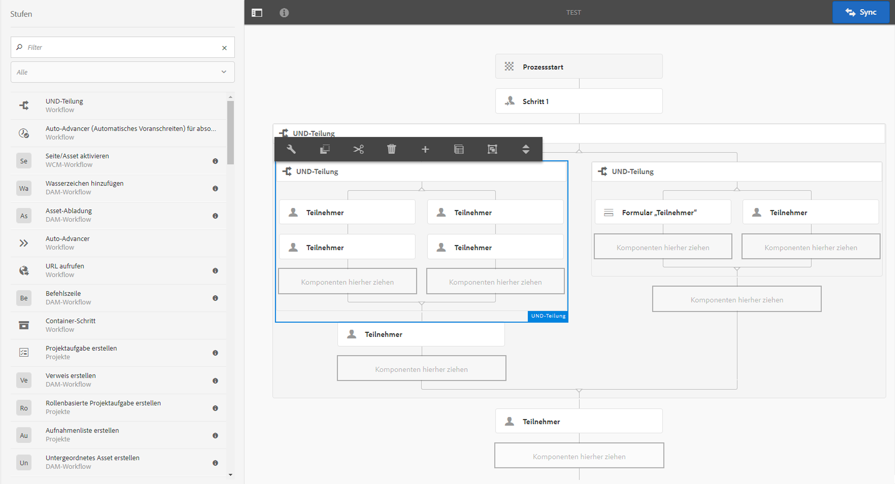
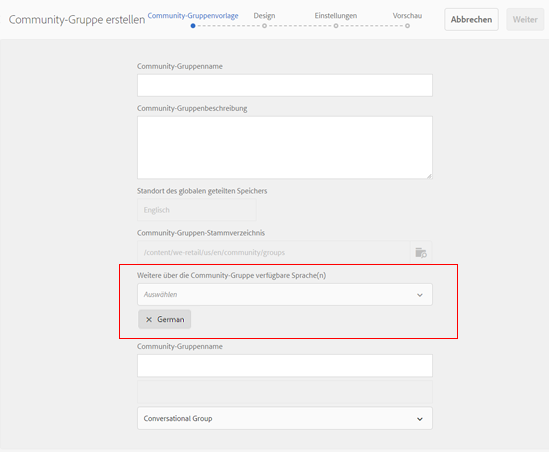
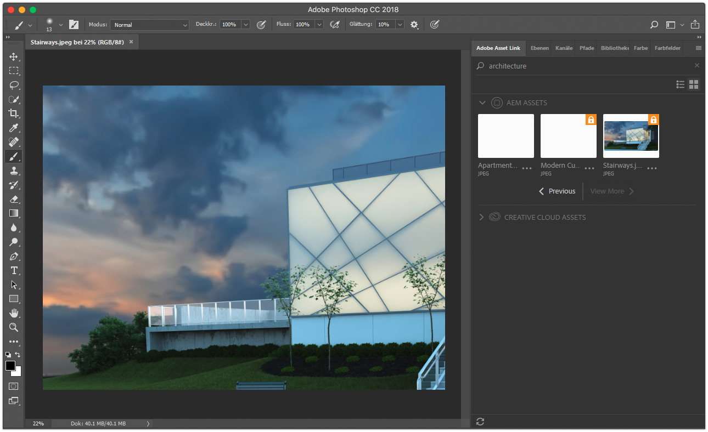
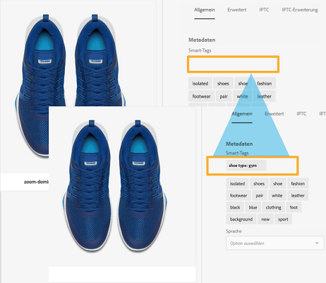

# Allgemeine Versionshinweise zu Adobe Experience Manager 6.4 {#general-release-notes-for-adobe-experience-manager}

>[!CAUTION]
>
>AEM 6.4 hat das Ende der erweiterten Unterstützung erreicht und diese Dokumentation wird nicht mehr aktualisiert. Weitere Informationen finden Sie in unserer [technische Unterstützung](https://helpx.adobe.com/de/support/programs/eol-matrix.html). Unterstützte Versionen suchen [here](https://experienceleague.adobe.com/docs/?lang=de).

## Versionshinweise {#release-information}

| Produkt | Adobe Experience Manager |
|---|---|
| Version | 6.4 |
| Typ | Hauptversion |
| Datum der allgemeinen Verfügbarkeit | 4. April 2018 |
| Empfohlene Updates | Informationen hierzu finden Sie unter [AEM-Versionen und -Updates](https://helpx.adobe.com/de/experience-manager/aem-releases-updates.html) |

### Wissenswertes {#trivia}

Der Versionszyklus für diese Version von Adobe Experience Manager begann am 27. April 2017, durchlief 22 Iterationen zur Qualitätssicherung und Fehlerbehebung und endete am 22. März 2018. Insgesamt wurden in dieser Version 704 kundenbezogene Probleme behandelt, einschließlich Verbesserungen und neuer Funktionen.

Adobe Experience Manager 6.4 ist seit dem 4. April 2018 allgemein verfügbar.

>[!NOTE]
>
>Adobe empfiehlt die Installation des neuesten Service Packs, da alle neuen Feature Packs nur über bereitgestellt werden. [Service Packs](https://helpx.adobe.com/de/experience-manager/maintenance-releases-roadmap.html).

## Neuerungen {#what-s-new}

Adobe Experience Manager 6.4 ist eine Upgrade-Version für die Code-Basis von Adobe Experience Manager 6.3. Die Software bietet neue und erweiterte Funktionen, wichtige Kundenkorrekturen, Erweiterungen für Kunden mit hoher Priorität und allgemeine Fehlerbehebungen, die auf die Produktstabilisierung ausgerichtet sind. Sie umfasst auch die meisten aller Adobe Experience Manager 6.3 Feature Packs, Hotfixes und Service Packs.

Die folgende Liste bietet eine Übersicht und die nachfolgenden Seiten enthalten die vollständigen Details.

### Experience Manager Foundation {#experience-manager-foundation}

Vollständige Liste der Änderungen in [AEM Foundation](wcm-platform.md).

Die Plattform von Adobe Experience Manager 6.4 basiert auf aktualisierten Versionen des OSGi-basierten Frameworks (Apache Sling und Apache Felix) und dem Java Content Repository: Apache Jackrabbit Oak 1.8.2.

Quickstart verwendet Eclipse Jetty 9.3.22 als Servlet-Engine.

#### Benutzeroberfläche {#user-interface}

An der Benutzeroberfläche wurden verschiedene Verbesserungen vorgenommen, um sie produktiver und benutzerfreundlicher zu gestalten.

* [Neue Inhaltsstruktur-Leiste](/help/sites-authoring/basic-handling.md#content-tree) um schnell in einer Hierarchie zu navigieren. In Kombination mit der Listenansicht wird dadurch das Interaktionsmodell der klassischen Benutzeroberfläche wiederhergestellt.
* Verbesserte Bildlauferfahrung in der Karten- und Listenansicht großer Ordner.
* [Verbesserte Interaktion mit den Suchergebnissen](/help/sites-authoring/search.md) - Die Schaltfläche &quot;Zurück&quot;stellt das vorherige Suchergebnis wieder her.
* [Zusätzliche Tastaturbefehle](/help/sites-authoring/keyboard-shortcuts.md), für die gängigsten Aktionen, wie das Öffnen einer bestimmten Leiste, das Bearbeiten, Verschieben und Löschen von Elementen oder das Öffnen von Eigenschaften.
* [Möglichkeit, Tastaturbefehle zu deaktivieren](/help/sites-authoring/user-properties.md) (Aktivieren/deaktivieren Sie unter Voreinstellungen ).
* [Anhalten der Anzeige von Zeitstempeln über die gesamte Benutzeroberfläche](/help/sites-authoring/user-properties.md) relativ nach 7 Tagen (in den Voreinstellungen als Standard festlegen).

Siehe [Authoring - Dokumentation](/help/sites-authoring/home.md) für weitere Informationen zu diesen Funktionen.

>[!CAUTION]
>
>Adobe plant keine weiteren Verbesserungen an der klassischen Benutzeroberfläche. AEM Version 6.4 enthält die klassische Benutzeroberfläche, und Kunden, die ein Upgrade von früheren Versionen durchführen, können diese weiterhin unverändert verwenden. Beachten Sie, dass die klassische Benutzeroberfläche zwar veraltet ist, aber weiterhin umfassend unterstützt wird. [Weitere Informationen](/help/sites-deploying/ui-recommendations.md).

#### Content-Repository {#content-repository}

* Schnellere und effizientere Komprimierung durch die Online-Revisionsbereinigung. Interne Tests zeigen, dass die neue Tail-Komprimierung bis zu 10-mal schneller ist und mehr Speicherplatz mit weniger IOPS als AEM 6.3 zurückgewinnen kann. Dies führt zu weniger Leistungseinbußen, während die Online-Revisionsbereinigung läuft. Weitere Informationen finden Sie unter [die Dokumentationsseite](/help/sites-deploying/revision-cleanup.md#full-and-tail-compaction-modes).

* Die kontinuierliche Revisionsbereinigung für MongoMK ersetzt die geplante Bereinigung
* Verbesserte Effizienz bei der Revisionsbereinigung von Dokument-Knotenspeichern

#### Suche und Indizierung {#search-indexing}

* Verbesserte Unterstützung für Indizierungsvorgänge über oak-run (CLI):

   * Indexkonsistenzprüfung
   * Indizierungsstatistiken
   * Import oder Export von Indexkonfigurationen
   * Neuindizierung

* Verringertes Repository-Wachstum im Zusammenhang mit Lucene für eine insgesamt verbesserte Systemleistung

Weitere Informationen finden Sie unter [Diese Dokumentationsseite](/help/sites-deploying/indexing-via-the-oak-run-jar.md).

#### Monitoring {#monitoring}

* Eine neue [Systemübersicht](/help/sites-administering/operations-dashboard.md#system-overview) bietet eine Momentaufnahme aller leistungsbezogenen Systemstatus und Aktivitäten.
* Ein neuer Satz von [Konsistenzprüfungen](/help/sites-administering/operations-dashboard.md#health-checks) Indizierung, Abfragen und Wartung

#### Projekte und Workflows {#projects-and-workflows}

* Neuigkeiten [Workflow-Editor zum Erstellen und Bearbeiten von Workflow-Modellen](/help/sites-developing/workflows-models.md).

#### Upgrade von früherer Version {#upgrade-from-earlier-version}

* [Abwärtskompatibilität](/help/sites-deploying/backward-compatibility.md): Abwärtskompatible Funktionen in Version 6.4 helfen Ihnen, Ihren benutzerdefinierten Code in den meisten Fällen kompatibel zu halten und reduzieren den Upgrade-Aufwand.
* [Bewertung der Upgrade-Komplexität](/help/sites-deploying/pattern-detector.md): Neues Mustererkennungs-Tool zur Beurteilung der Komplexität Ihrer Upgrades vor der Aktualisierung.
* [Repository-Neustrukturierung](/help/sites-deploying/repository-restructuring.md): erhebliche Umstrukturierung (in erster Linie /etc), um einfachere Upgrades zu erleichtern und Best Practices für die Implementierung zu fördern
* Weitere allgemeine Informationen zu Upgrades finden Sie unter [diese Seite](/help/sites-deploying/upgrade.md) für weitere Details.

### Experience Manager Sites {#experience-manager-sites}

Vollständige Liste der Änderungen in [AEM Sites und Add-ons](sites.md).

#### Fluid Experiments {#fluid-experiences}

Die Einführung von Fluid Experiences Anfang 2017, unterstützt von Content Fragments, Experience Fragments und Content Services, war der Anfang der Entwicklung zu einem mehrkanaligen Content-Management. AEM 6.4 erweitert jedes Gebiet erheblich:

**[Inhaltsfragmente](/help/assets/content-fragments.md)**

Neu in 6.4 sind visuelle Funktionen [Inhaltsmodell](/help/assets/content-fragments-models.md) Editor und eine neue [konfigurierbare Komponente](https://experienceleague.adobe.com/docs/experience-manager-core-components/using/components/content-fragment-component.html?lang=de) , um eine flexible HTML-Ausgabe und JSON für die Aufnahme in Content Services bereitzustellen.

**Experience Fragments**

Das Erstellen von Varianten in einem Fragment mit demselben Inhalt, aber unterschiedlichem Layout ist jetzt dank der Funktion &quot;Bausteine&quot;effizienter. Zusätzlich zum Senden von Experience Fragments an Facebook und Pinterest ist es jetzt möglich, sie als Angebot an Adobe Target zu senden.

**Content Services**

Es wurden verschiedene Verbesserungen am Sling Model Exporter und den Kernkomponenten vorgenommen, um eine robuste JSON-Ausgabe zur Einbettung von Inhalten in mobile Apps und Erlebnisse bereitzustellen, die mit Einzelseitenanwendungen erstellt wurden.

#### Schnellere Erstellung von Sites {#gettings-sites-built-quicker}

AEM 6.4 schließt die Umwandlung in das Komponentenmodell der nächsten Generation ab. Das in AEM 6.3 eingeführte und jetzt durch das Stilsystem verknüpfte Konzept der Kernkomponenten bietet eine effiziente Möglichkeit zum Erstellen neuer und Erweitern vorhandener Sites.

Empfohlenes Tutorial , um zu erfahren, wie Sie das neue Komponentenmodell optimal nutzen können: [Erste Schritte mit AEM Sites - WKND-Tutorial](https://experienceleague.adobe.com/docs/experience-manager-learn/getting-started-wknd-tutorial-develop/overview.html?lang=de)

#### Screens-Add-on {#screens-add-on}

AEM Screens steht für die Bereitstellung einer konsistenten Botschaft über alle Marketingkanäle, einschließlich Digital Signage- und Kiosk-Netzwerken. AEM 6.4 unterstützt nun die Ausführung des Signage-Players auf Microsoft Windows- und Google Chrome OS-Hardware. Darüber hinaus sind Verbesserungen bei der Remote-Geräteverwaltung und den Zeitplänen (Gruppen von Kanälen) verfügbar.

Weitere Informationen zu Screens-Aktualisierungen finden Sie unter [AEM Screens-Benutzerhandbuch](https://experienceleague.adobe.com/docs/experience-manager-screens/user-guide/aem-screens-introduction.html?lang=de).

### Experience Manager Communities {#experience-manager-communities}

AEM 6.4 bietet Communities viele neue Funktionen und Verbesserungen. Eine vollständige Liste der Änderungen finden Sie unter [AEM Communities](communities-release-notes.md). Highlights dieser Version sind:

#### Verbesserungen bei der Moderation {#enhancements-to-moderation}

**Automatische Spam-Erkennung**

Es wurde eine neue Engine zur Spam-Erkennung bereitgestellt, um unerwünschte benutzergenerierte Inhalte auf Community-Sites und -Gruppen herauszufiltern. Nach der Aktivierung über system/console/configMgr markiert es einen vom Benutzer generierten Inhalt basierend auf einem vordefinierten Satz von Spam-Wörtern als Spam. Weitere Informationen zur Spamerkennungs-Engine finden Sie unter [Automatisieren der Community-Benutzer, die Inhalte generieren](/help/communities/moderate-ugc.md#spam-detection).

**Neue Filter für Fragen und Antworten**

In der Massenmoderationskonsole wurden neue Filter namens &quot;Beantwortet&quot;und &quot;Nicht beantwortet&quot;hinzugefügt, mit denen Fragen gefiltert werden können. Informationen zur Funktionsweise der Statusfilter &quot;Antworten&quot;und &quot;Nicht beantwortet&quot;finden Sie unter [Massenmoderation benutzergenerierter Inhalte](/help/communities/moderation.md#main-pars-note-521961797).

**Lesezeichen für Moderationsfilter**

Die Möglichkeit, die vordefinierten Moderationsfilter in der Moderationskonsole mit einem Lesezeichen zu versehen, wurde bereitgestellt. Diese Filter werden am Ende der URL-Zeichenfolge angehängt und können daher später freigegeben, wiederverwendet und erneut besucht werden. Erfahren Sie, wie Sie Filter mit Lesezeichen versehen [Massenmoderationskonsole](/help/communities/moderation.md#main-pars-note-429176623).

#### Löschen von benutzergenerierten Inhalten und Benutzerprofilen {#delete-ugc-and-user-profiles}

AEM 6.4 Communities [vordefinierte APIs](/help/communities/user-ugc-management-service.md) und Beispiel [Servlet](https://github.com/Adobe-Marketing-Cloud/aem-communities-ugc-migration/tree/master/bundles/communities-ugc-management-servlet) , damit Endbenutzer die Kontrolle über ihre Daten haben. Mit diesen APIs können auch Datenverarbeitungs- und Datenkontrollorganisationen Anforderungen im Zusammenhang mit der DSGVO in der EU erfüllen.

#### Verbesserungen der Site- und Gruppenverwaltung {#enhancements-to-site-and-group-management}

**Erstellen von Gruppen mit mehreren Gebietsschemas in einem einzigen Schritt**

Die Möglichkeit, mehrsprachige Gruppen in einem einzigen Vorgang zu erstellen, wurde bereitgestellt. Um solche Gruppen zu erstellen, können Benutzer über die Sites-Konsole zur Gruppenkollektion der gewünschten Communities-Site navigieren. Erstellen Sie eine Gruppe und geben Sie die gewünschten Sprachen auf der Seite Community-Gruppenvorlage an. Weitere Informationen zu dieser Funktion finden Sie unter [Community-Gruppen-Konsole](/help/communities/groups.md).

**[Löschen von Community-Sites und -Gruppen mit einem Klick](/help/communities/groups.md)**

Das Löschsymbol ist jetzt auf den entsprechenden Sites und Gruppen verfügbar, während Sie von der globalen Navigation aus navigieren. Mit diesem Symbol werden alle Elemente und Inhalte gelöscht, die mit der Site oder Gruppe verknüpft sind, und alle Benutzerverknüpfungen werden entfernt. Weitere Informationen zu dieser Funktion finden Sie unter [Verwalten von Community-Sites](/help/communities/create-site.md#main-pars-text-fe17) und [Verwalten von Community-Gruppen](/help/communities/groups.md#main-pars-text-5e8c).

#### Verbesserungen bei der Aktivierung {#enhancements-to-enablement}

Zuweisungs- und Katalogfunktionen sind jetzt in Gruppen verfügbar. Dies ermöglicht die Erstellung, Verwaltung und Veröffentlichung von Lerninhalten für eine bestimmte Gruppe zielgerichteter Community-Mitglieder. Weitere Informationen zum Aktivieren von Community-Gruppen finden Sie unter [Verwalten von Aktivierungsressourcen](/help/communities/resource.md).

### Experience Manager Assets {#experience-manager-assets}

AEM 6.4 bietet eine Reihe neuer Funktionen und Verbesserungen für Assets, darunter die neue, verbesserte Creative Cloud-Integration, wichtige künstliche Intelligenz-Innovationen, verbesserte Metadatenverwaltung, Verbesserungen bei der Berichterstellung und allgemeine Verbesserungen für das Benutzererlebnis. Die vollständige Liste der Änderungen finden Sie unter [AEM Assets](assets.md). Die Highlights der Version sind:

**Adobe Asset Link**

Adobe Asset Link in Creative Cloud für Unternehmen optimiert die Zusammenarbeit zwischen Kreativen und Marketingexperten bei der Inhaltserstellung. Es handelt sich um eine neue native Funktion in Creative Cloud für Unternehmen, die Photoshop, Illustrator und InDesign mit AEM verbindet - ohne dass Kreative ihre Werkzeuge ihrer Wahl überlassen müssen.

Weitere Informationen zu dieser Funktion, den Voraussetzungen und dem Zugriff darauf finden Sie unter [Adobe Asset Link](https://www.adobe.com/de/creativecloud/business/enterprise/adobe-asset-link.html).

**AEM-Desktop-Programm**

AEM Desktop-Programm wurde auf Version 1.8 aktualisiert, die mit AEM 6.4 kompatibel ist. Die vollständige Liste der Änderungen für AEM Desktop-Programm finden Sie in einer speziellen [Versionshinweise zum AEM-Desktop-Programm](https://experienceleague.adobe.com/docs/experience-manager-desktop-app/using/release-notes.html?lang=de) Dokument.

Zu den seit AEM Version 6.3 eingeführten Verbesserungen gehören die Möglichkeit, hierarchische Ordner im Hintergrund hochzuladen, eine neue Benutzeroberfläche zur Überwachung von Asset-Hintergrundvorgängen, verbesserte Zwischenspeicherung, Vernetzung und Anmeldung sowie allgemeine Stabilitätsverbesserungen. Die Dokumentation enthält auch eine [Best Practices-Handbuch](https://experienceleague.adobe.com/docs/experience-manager-desktop-app/using/using.html?lang=de).

**Adobe Sensei Services**

Zu den neuen Funktionen gehören optimierte Smart-Tags, die die Taxonomie des Kundengeschäftes erlernen, die automatische Kennzeichnung digitaler Assets mit kundenspezifischen Tags und die intelligente Übersetzungssuche, die die Auffindbarkeit in mehreren Sprachen verbessert, indem Suchbegriffe direkt übersetzt werden. Weitere Informationen zu dieser Funktion finden Sie unter [Verbesserte Smart-Tags](/help/assets/enhanced-smart-tags.md).

**Metadaten**

Verschiedene Verbesserungen umfassen die Möglichkeit, Metadaten für eine große Anzahl von Assets gleichzeitig zu importieren und zu exportieren, sowie erweiterte Metadatenkonstrukte wie [Kaskadierende Metadaten](/help/assets/cascading-metadata.md).

**Berichte**

Die Asset-Berichterstellung wurde in AEM 6.4 grundlegend überarbeitet und enthält jetzt ein neues Reporting-Framework, ein neues Benutzererlebnis und mehr OOTB-Berichte für Anwendungsfälle von Kunden. Informationen zum Generieren verschiedener Berichte finden Sie unter [Asset-Berichte](/help/assets/asset-reports.md).

**Anwendererlebnis**

Verschiedene Verbesserungen zur Verbesserung des Durchsuchens, Suchens und Admin-Erlebnisses für Assets-Benutzer, wie Scrollerlebnis, Schaltfläche &quot;Suchen zurück&quot;, verbesserte Suchfilter und vieles mehr. Die vollständige Liste finden Sie unter [AEM Assets](assets.md).

**Brand Portal**

Verschiedene Verbesserungen in den Bereichen Metadaten, Berichterstellung, digitale Rechte, Anmeldeerfahrung und Veröffentlichungsleistung für die Asset-Verteilung. Informationen zu den neuen Verbesserungen und Funktionen finden Sie unter [Neue Funktionen in AEM Assets Brand Portal](https://experienceleague.adobe.com/docs/experience-manager-brand-portal/using/introduction/whats-new.html?lang=de).

#### Dynamic Media Add-on {#dynamic-media-add-on}

AEM 6.4 umfasst viele neue Funktionen und Verbesserungen für Dynamic Media. Die vollständige Liste finden Sie unter [AEM Assets](assets.md). Zu den wichtigsten Highlights zählen:

**Smartes Zuschneiden**

Smartes Zuschneiden mit Adobe Sensei ermöglicht automatisch das zerstörungsfreie Zuschneiden von Bildern und bewahrt so die für ein responsives Design interessante Position. Sie können eine Vorschau der zugeschnittenen Bildvorschläge anzeigen und diese bei Bedarf manuell anpassen. Diese Funktion ermöglicht auch die automatisierte Mustergenerierung für Produktbilder.

Siehe [Bildprofile](/help/assets/image-profiles.md) Dokumentation , um mehr über die Verwendung von smartem Zuschneiden zu erfahren.

Siehe [Hinzufügen von Dynamic Media-Assets zu Seiten](/help/assets/adding-dynamic-media-assets-to-pages.md) , um mehr über das Arbeiten mit smartem Zuschneiden in der Dynamic Media-Komponente zu erfahren.

**Intelligente Bildbearbeitung**

Intelligente Bildbearbeitung nutzt die individuellen anzeigebezogenen Eigenschaften jedes Benutzers, um automatisch für sein Erlebnis optimierte Bilder bereitzustellen, was zu einer besseren Leistung und Interaktion führt.

Siehe [Intelligente Bildbearbeitung](/help/assets/imaging-faq.md) Dokumentation .

**Neue Verbesserungen bei Media und Viewer**

Neue Viewer, einschließlich Panorama- und VR-Viewer, ermöglichen interaktivere Erlebnisse.

Siehe [Panoramabilder](/help/assets/panoramic-images.md) Dokumentation .

### Experience Manager Forms {#experience-manager-forms}

AEM 6.4 Forms bietet mehrere neue Funktionen und Verbesserungen. Hier einige der Highlights:

* Interaktive Kommunikation mit mehreren Kanälen
* Vorabfüllen interaktiver Kommunikation aus Geschäftsanwendungen
* Modernisierung von Workflows und Unterstützung mobiler Arbeitskräfte
* Verzögertes Laden von Fragmenten
* Einzelne Aktualisierung von LiveCycle auf Experience Manager Forms 6.4

Weitere Informationen unter [AEM Forms](forms.md) Seite mit Versionshinweisen . Siehe auch [Zusammenfassung der neuen Funktionen und Verbesserungen in AEM 6.4 Forms](/help/forms/using/whats-new.md) für Informationen zu neuen und verbesserten Funktionen und Dokumentationsressourcen.

### Experience Manager Livefyre {#experience-manager-livefyre}

Livefyre lässt sich in AEM 6.4-Instanzen integrieren. Informationen zur Integration von Livefyre in AEM finden Sie hier:

* [Integrieren mit Livefyre](https://experienceleague.adobe.com/docs/experience-manager-64/administering/integration/livefyre.html?lang=de)

### Kundenorientierte Entwicklung nutzen {#leverage-customer-focused-development}

Adobe verwendet ein kundenorientiertes Entwicklungsmodell, das es Kunden ermöglicht, in allen Phasen des Entwicklungsprozesses, bei der Spezifikation, Entwicklung und Tests, zu helfen. Unser Dank geht an alle beteiligten Kunden und Partner in diesem Prozess.

Adobe hält die erforderlichen Vorgehensweisen und Prozesse bereit, um die Erfassung, Priorisierung und Verfolgung kundenorientierter Fehlerbehebungs- und Verbesserungsanforderungsentwicklung zu ermöglichen. Die [Adobe Marketing Cloud Support Portal](https://helpx.adobe.com/de/contact/enterprise-support.ec.html) ist in das Adobe Enhancement &amp; Defect Tracking System integriert. Kundenfragen werden nach Möglichkeit mit der Kundenunterstützung identifiziert und gelöst. Bei einer Weiterleitung an Forschung und Entwicklung werden alle Kundeninformationen erfasst und zu Priorisierungs- und Reporting-Zwecken verwendet. Bei der Entwicklung wird gebührenpflichtigen Support- und Garantieproblemen sowie bezahlten Kundenverbesserungen Priorität eingeräumt.

Dieser Prozess der Priorisierung hat zu mehr als 500 kundenorientierten Änderungen geführt, die in AEM 6.4 vorgenommen wurden.

## Liste der Dateien, die Teil der Version sind {#list-of-files-that-are-part-of-the-release}

**Foundation**

* Eigenständiger Schnellstart: cq-quickstart-6.4.0.jar
* Anwendungsserver-Schnellstart: cq-quickstart-6.4.0.war
* Dispatcher 4.3.1 oder höher für verschiedene Webserver und Plattformen. Siehe [Downloadlink](https://experienceleague.adobe.com/docs/experience-manager-dispatcher/using/getting-started/release-notes.html?lang=de).
* Plug-in für Eclipse IDE. [Mehr dazu und Download](/help/sites-developing/aem-eclipse.md).

* Erweiterung für den Brackets-Code-Editor. [Mehr dazu und Download](/help/sites-developing/aem-brackets.md).
* Maven-/Gradle-Abhängigkeiten. Siehe [Downloadlink](https://repo.adobe.com/nexus/content/repositories/releases/com/adobe/aem/uber-jar/6.1.0/).

**Sites**

* Kernkomponenten ([GitHub-Projekt](https://github.com/Adobe-Marketing-Cloud/aem-core-wcm-components))
* We.Retail-Referenzimplementierung ([mehr dazu](/help/sites-developing/we-retail.md))
* Projekt-Blueprint-Archetyp ([GitHub-Projekt](https://github.com/Adobe-Marketing-Cloud/aem-project-archetype))
* AEM Screens-Player für verschiedene Zielplattformen ([Download](https://download.macromedia.com/screens/))
* Smart Content-Sprachmodelle. Englisch ist vorinstalliert - weitere Sprachen können heruntergeladen werden

   * [Deutsch](https://experience.adobe.com/#/downloads/content/software-distribution/en/aem.html?lang=de?package=/content/software-distribution/en/details.html/content/dam/aem/public/adobe/packages/cq630/product/smartcontent-model-de)
   * [Spanisch](https://experience.adobe.com/#/downloads/content/software-distribution/en/aem.html?lang=de?package=/content/software-distribution/en/details.html/content/dam/aem/public/adobe/packages/cq630/product/smartcontent-model-es)
   * [Italienisch](https://experience.adobe.com/#/downloads/content/software-distribution/en/aem.html?lang=de?package=/content/software-distribution/en/details.html/content/dam/aem/public/adobe/packages/cq630/product/smartcontent-model-it)
   * [Französisch](https://experience.adobe.com/#/downloads/content/software-distribution/en/aem.html?lang=de?package=/content/software-distribution/en/details.html/content/dam/aem/public/adobe/packages/cq630/product/smartcontent-model-fr)

* [AEM Modernisierungs-Tools](/help/sites-developing/modernization-tools.md) Migrieren von Komponenten der klassischen Benutzeroberfläche zu Coral 3

**Assets**

* Adobe Experience Manager-Desktop-Programm ([mehr dazu](https://experienceleague.adobe.com/docs/experience-manager-desktop-app/using/using.html?lang=de) und [herunterladen](https://experienceleague.adobe.com/docs/experience-manager-desktop-app/using/release-notes.html?lang=de))

* Paket zum Hinzufügen eines erweiterten PDF Rasterizer ([mehr dazu](/help/assets/aem-pdf-rasterizer.md) und [herunterladen](https://experience.adobe.com/#/downloads/content/software-distribution/de/aem.html?package=/content/software-distribution/de/details.html/content/dam/aem/public/adobe/packages/cq640/product/assets/aem-assets-pdf-rasterizer-pkg))

* Paket zum Hinzufügen der erweiterten RAW-Bildunterstützung ([mehr dazu](/help/assets/camera-raw.md))

**Formulare**

* Pakete für AEM Forms-Funktionen:

   * [adobe-aemfd-aix-pkg](https://experienceleague.adobe.com/docs/experience-manager-release-information/aem-release-updates/forms-updates/aem-forms-releases.html?lang=de)
   * [adobe-aemfd-linux-pkg](https://experienceleague.adobe.com/docs/experience-manager-release-information/aem-release-updates/forms-updates/aem-forms-releases.html?lang=de)
   * [adobe-aemfd-solaris-pkg](https://experienceleague.adobe.com/docs/experience-manager-release-information/aem-release-updates/forms-updates/aem-forms-releases.html?lang=de)
   * [adobe-aemfd-win-pkg](https://experienceleague.adobe.com/docs/experience-manager-release-information/aem-release-updates/forms-updates/aem-forms-releases.html?lang=de)
   * [adobe-aemfd-osx-pkg](https://experienceleague.adobe.com/docs/experience-manager-release-information/aem-release-updates/forms-updates/aem-forms-releases.html?lang=de)

## Sprachen {#languages}

Die Benutzeroberfläche von ist in den folgenden Sprachen verfügbar:

* Englisch
* Deutsch
* Französisch
* Spanisch
* Italienisch
* Brasilianisches Portugiesisch
* Japanisch
* Vereinfachtes Chinesisch
* Traditionelles Chinesisch (begrenzte Unterstützung)
* Koreanisch

Experience Manager 6.4 wurde für GB18030-2005 CITS zertifiziert, um den chinesischen Kodierungsstandard zu verwenden.

## Installieren und Aktualisieren {#install-update}

Siehe [Installationsanweisungen](/help/sites-deploying/custom-standalone-install.md) für Einrichtungsanforderungen.

Siehe [Upgrade-Dokumentation](/help/sites-deploying/upgrade.md) für detaillierte Anweisungen.

## Unterstützte Plattformen {#supported-platforms}

Bitte finden Sie die vollständige Matrix der unterstützten Plattformen einschließlich . Unterstützungsebene auf [AEM 6.4 Technische Anforderungen](/help/sites-deploying/technical-requirements.md).

>[!NOTE]
>
>Oracle ist auf ein LTS-Modell (Long Term Support) für Oracle Java SE-Produkte umgestiegen. Java 9 und 10 sind Nicht-LTS-Versionen von Oracle (siehe [Oracle Java SE-Support-Roadmap](https://www.oracle.com/technetwork/java/eol-135779.html)). Adobe bietet nur Unterstützung für LTS-Versionen von Java, um AEM in der Produktion auszuführen. Daher ist Java 8 die empfohlene Version für AEM 6.4.

## Veraltete und entfernte Funktionen {#deprecated-and-removed-features}

Adobe bewertet laufend die Funktionen des Produkts und plant im Laufe der Zeit, Funktionen durch leistungsfähigere Versionen zu ersetzen, oder beschließt, ausgewählte Teile neu zu implementieren, um besser auf zukünftige Erwartungen oder Erweiterungen vorbereitet zu sein.

Für Adobe Experience Manager 6.4: [Liste veralteter und entfernter Funktionen lesen](deprecated-removed-features.md). Die Seite enthält auch eine Vorankündigung von Änderungen im Jahr 2019 und wichtige Hinweise für Kunden, die von früheren Versionen aktualisieren.

## Detaillierte Änderungslisten {#detailed-changes-lists}

[AEM Sites](sites.md)

[AEM Assets](assets.md)

[AEM Communities](communities-release-notes.md)

[AEM Forms](forms.md)

[AEM Foundation](wcm-platform.md)

## Bekannte Probleme {#known-issues}

[Liste der bekannten Probleme](known-issues.md)

### Produktdownload und Support (beschränkte Websites) {#product-download-and-support-restricted-sites}

Diese Sites sind nur für Kundinnen und Kunden verfügbar. Wenn Sie ein Kunde sind und Zugriff benötigen, wenden Sie sich an Ihren Kundenbetreuer für Adoben.

* [Produktdownload unter licensing.adobe.com](https://licensing.adobe.com/).
* Produktaktualisierungen, Patches und Pakete für zusätzliche Funktionen in der [Softwareverteilung](https://experience.adobe.com/#/downloads/content/software-distribution/en/aem.html).
* [Kunden-Support über die Admin Console](https://adminconsole.adobe.com/). Weitere Informationen finden Sie unter [Neues Adobe-Kunden-Supporterlebnis](https://experienceleague.adobe.com/docs/customer-one/using/home.html?lang=de).
