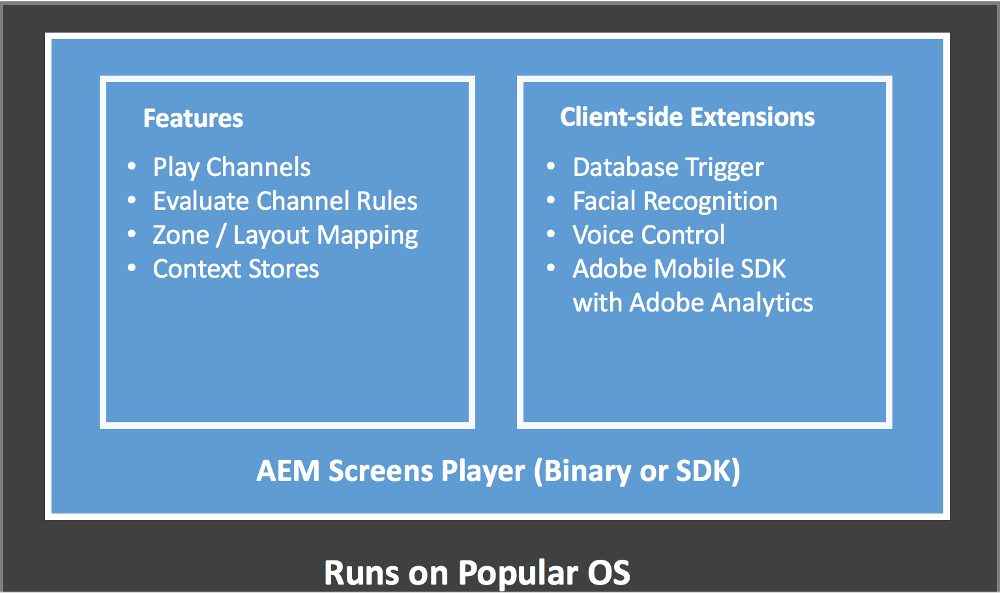

# Was ist AEM Screens? {#what-is-aem-screens}

**AEM (Adobe Experience Manager) Screens** - *eine Digital Signage-Lösung* , mit der Sie dynamische und interaktive digitale Erlebnisse und Interaktionen mit verschiedenen Arten von Bildschirmen in Verbindung mit einer umfassenden digitalen Marketingplattform veröffentlichen können.

Nutzen Sie den [Schnellstart für AEM Screens](kickstart-for-aem-screens.md) für einen schnellen Einstieg in die einfach zu nutzende Lösung für digitale Beschilderungen.

## Überblick {#overview}

**AEM Screens** setzt auf der soliden Basis von ***AEM Sites*** auf und ermöglicht es Marketing-Experten und IT-Fachleuten, Erlebnisse auf mehreren digitalen Bildschirmen zu erstellen und zu verwalten, die im Ladengeschäft/vor Ort eine Marke bewerben und die Nachfrage ankurbeln können. Durch die Integration von AEM Screens mit Sites können Sie bereits vorhandene Inhalte wiederverwenden und eine kohärente und konsistente Kundenlösung bereitstellen. Dadurch entsteht ein optimierter Arbeitsablauf, mit dem digitale Erlebnisse entwickelt werden können, die äußerst kostengünstig und optimal nutzbar sind. Zusätzlich können Sie damit die Markenwahrnehmung stärken und Entscheidungen beeinflussen, was zusätzliche Käufe und Interaktionen zur Folge hat.

AEM Screens ist eine leistungsstarke webbasierte Lösung, mit der Sie dedizierte digitale Menüboards, Produktempfehlungen und Hintergrundbilder für Lifestyle erstellen können, um die Interaktion mit Kunden zu erweitern und einheitliche und nützliche Markenerlebnisse in physische Orte wie Läden, Hotels, Banken, Gesundheitseinrichtungen und Bildungseinrichtungen und vieles mehr bereitzustellen - von derselben AEM-Plattform aus. Screens kann für eine große Anzahl einzigartiger Anwendungen eingesetzt werden, wie etwa für interaktive Anzeigen, Orientierungssysteme und Branding. Zusätzlich kann je nach Domäne eine bestimmte Atmosphäre für Kunden und Mitarbeiter geschaffen werden.

Das Erstellen und Verwalten einer Anwendung mithilfe von Screens ist einfach und intuitiv. Eine *Anwendung* hostet die Webseiten, die von Kunden oder Implementierungspartnern für AEM Screens erstellt wurden. In *Speicherorten* wird die vordefinierte Hierarchie verwaltet. Hier sind auch die *Displays* enthalten. Jedes Display verfügt über ein Dashboard, in dem unterschiedliche angeschlossene Geräte und Bildschirme angezeigt werden. Inhalte für AEM Screens werden in *Kanälen* verwaltet. Mit dem AEM Screens-Player lassen sich in Kanälen vorhandene Inhalte auf Displays darstellen.

*Die Schlüsselbegriffe in Zusammenhang mit AEM Screens werden im[Glossar](screens-glossary.md)erklärt.*

## Architektur des Screens-Players {#architecture-of-screens-player}

Das folgende Diagramm zeigt die allgemeine Architektur von AEM Screens Player:

## Erstellen eines Erlebnisses für digitale Beschilderungen in fünf Minuten {#create-a-digital-signage-experience-in-minutes}

In [Schnellstart für AEM Screens](kickstart-for-aem-screens.md) finden Sie eine Anleitung zum Erstellen eines Screens-Demoprojekts und zum Veröffentlichen Ihres Inhalts in Screens-Player.

## Beginnen eines neuen AEM Screens-Projekts {#starting-a-new-aem-screens-project}

Für den Start eines neuen Erlebnisses für digitale Beschilderungen müssen mehrere Personen mit unterschiedlichen Rollen zusammenarbeiten.

In der folgenden Abbildung werden die beteiligten Personen und ihre Rollen für AEM Screens definiert. 

>[!NOTE]
>
>*Wenn Sie darüber hinaus verschiedene Aufgabenbereiche der jeweiligen Rollen anzeigen möchten, klicken Sie auf die oben genannten Personen.*

## Erforderliche Kenntnisse {#prerequisite-knowledge}

Bevor Sie mit der Arbeit an einem Projekt für digitale Beschilderungen unter Einsatz von AEM Screens beginnen, benötigen Sie Wissen über Adobe Experience Manager (AEM) – am besten vor Beginn der Arbeit an einem AEM Screens-Projekt.

Weitere Informationen zu Adobe Experience Manager 6.4 und 6.5 finden Sie in den folgenden Übungen und Ressourcen:

* **[Erste Schritte mit Adobe Experience Manager](https://helpx.adobe.com/experience-manager/get-started.html)**: Entdecken Sie Artikel zu den ersten Schritten und Videoschulungen für Adobe Experience Manager.
* **[AEM 6.5-Tutorials und -Videos](https://helpx.adobe.com/experience-manager/kt/index/aem-6-5-videos.html)**: Eine Sammlung von Tutorials und Videos, in denen die mit der Veröffentlichung von AEM 6.5 herausgebrachten neuen und aktualisierten Funktionen für AEM Sites, Assets, Forms, Screens und Foundation erläutert werden.
* **[Grundlegende AEM-Konzepte](https://docs.adobe.com/content/help/en/experience-manager-64/developing/introduction/the-basics.html)**: Ein Überblick über die grundlegenden Konzepte der AEM-Struktur sowie der damit verbundenen Entwicklung, einschließlich Informationen zu JCR, Sling, OSGi, dem Dispatcher, Workflows und MSM.

## Tutorial zu den Grundlagen der Implementierung {#implementation-essentials}

Folgen Sie dem Tutorial-Lernpfad Grundlagen der Implementierung von AEM Screens, der sowohl grundlegende als auch erweiterte Funktionen abdeckt, die in AEM Screens unterstützt werden.

Beim Erstellen eines neuen Projekts können sich abhängig von Ihren Organisations- und Geschäftsanforderungen verschiedene Funktionen überschneiden. Die folgenden Ressourcen bieten Ihnen detaillierte Anleitungen zur Erstellung und Verwaltung von AEM Screens-Projekten:

1. [Screens installieren und konfigurieren](configuring-screens-introduction.md) 
1. [Erstellen und Verwalten von Screens-Projekten](creating-a-screens-project.md)
1. [Zuweisen von Geräten](managing-devices.md)
1. [Erstellen und Verwalten von Kanälen](managing-channels.md)
1. [Erstellen und Verwalten von Standorten](managing-locations.md)
1. [Erstellen und Verwalten von Anzeigen](managing-displays.md)
1. [Zuweisen von Kanälen](channel-assignment.md)
1. [Geräte verwalten](managing-devices.md)
1. [Erstellen und Verwalten von Zeitplänen](managing-schedules.md)
1. [AEM Screens-Player](working-with-screens-player.md)
1. [Fehlerbehebung beim Device Control Center](monitoring-screens.md)

### Verwandte Ressourcen {#related-resources}

Sehen Sie sich [Verstehen von AEM Screens](screens-concepts-feature-video-understand.md)als zusätzliche Ressource einschließlich Videos an, um verschiedene Bereiche eines AEM Screens-Projekts vorzustellen.
