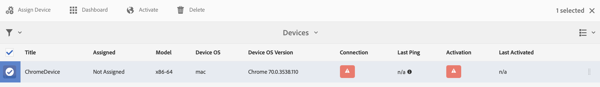

# Konfigurieren von Autoren- und Veröffentlichungsinstanz in AEM Screens{#configuring-author-and-publish-in-aem-screens}

Auf dieser Seite werden folgende Themen vorgestellt:

* **Konfigurieren von Autoren- und Veröffentlichungsinstanz**
* **Einrichten der Veröffentlichungstopologie**
* **Verwalten von Veröffentlichungen: Bereitstellen von Inhaltsaktualisierungen vom Autor zur Veröffentlichung auf dem Gerät**

## Voraussetzungen {#prerequisites}

Bevor Sie mit Autoren- und Veröffentlichungs-Servern beginnen, sollten Sie mit folgenden Themen vertraut sein:

* **AEM-Topologie**
* **Erstellen und Verwalten von AEM Screens-Projekten**
* **Verfahren zur Geräteregistrierung**

>[!NOTE]
>
>Diese AEM Screens-Funktion ist nur verfügbar, wenn Sie das Feature Pack 2 für AEM 6.4 Screens installiert haben. Wenden Sie sich an den Adobe-Support, um Zugriff auf dieses Feature Pack zu erhalten. Wenn Sie die entsprechenden Berechtigungen erhalten haben, können Sie es von Package Share herunterladen.

## Konfigurieren von Autoren- und Veröffentlichungsinstanz {#configuring-author-and-publish-instances}

>[!NOTE]
>
>Weitere Informationen zur Architektur der Autoren- und Veröffentlichungsinstanz sowie über die Methode, mit der Inhalte in einer AEM-Autoreninstanz verfasst und dann an mehrere Veröffentlichungsinstanzen vorwärts repliziert werden, finden Sie unter [Architektonischer Überblick zur Autoren- und Veröffentlichungsinstanz](author-publish-architecture-overview.md).

Im folgenden Abschnitt wird beschrieben, wie sich in der Autoren- und Veröffentlichungstopologie Replikationsagenten einrichten lassen.

Sie können ein einfaches Beispiel anlegen, in dem Sie eine Autoren- und zwei Veröffentlichungsinstanzen hosten:

* Autor --> localhost:4502
* Veröffentlichung 1 (pub1) --> localhost:4503
* Veröffentlichung 2 (pub2) --> localhost:4504

### Einrichten von Replikationsagenten in der Autoreninstanz {#setting-up-replication-agents-on-author}

Zur Erstellung von Replikationsagenten müssen Sie wissen, wie man einen standardmäßigen Replikationsagenten einrichtet.

Für Bildschirme sind drei Replizierungsagenten erforderlich:

1. **Standardmäßiger Replikationsagent ***(angegeben als***Standard Replication Agent**)

1. **Screens-Replikationsagent**
1. **Agent für Rückwärtsreplikation**

Führen Sie die gleichen Schritte aus, um einen Agenten für die Rückwärtsreplikation zu erstellen.

1. Navigieren Sie zu Ihrer AEM-Instanz > Hammersymbol > **Vorgänge** > **Konfiguration**.

   

1. Wählen Sie die **Replikation** in der linken Navigationsstruktur aus.

   

1. Wählen Sie die Option **Agenten für Autor** im Ordner **Replikation** und klicken Sie auf **Neu**, um einen neuen Replikationsagenten zu erstellen.

   

1. Geben Sie zum Einrichten des Replikationsagenten den **Titel** und den **Namen** ein und klicken Sie auf **Erstellen**.

   

1. Klicken Sie mit der rechten Maustaste auf den Replikationsagenten und klicken Sie auf **Öffnen**, um die Einstellungen zu bearbeiten.

   

1. Klicken Sie auf **Bearbeiten**, um das Dialogfeld **Agenteneinstellungen** zu öffnen und die Details einzugeben.

   

1. Navigieren Sie zur Registerkarte **Transport** und geben Sie den **URI**, den **Benutzer** und das **Kennwort** ein.

   

   >[!NOTE]
   >
   >Alternativ können Sie einen vorhandenen Replikationsagenten kopieren und umbenennen.

#### Erstellen von standardmäßigen Replikationsagenten {#creating-standard-replication-agents}

1. Erstellen Sie einen standardmäßigen Replikationsagenten für pub1 (standardmäßiger Agent, der bereits vorkonfiguriert sein sollte) (z. B. *https://&lt;Hostname>:4503/bin/receive?sling:authRequestLogin=1*).

1. Richten Sie einen standardmäßigen Replikationsagenten für pub2 ein. Sie können den Replikationsagenten für pub1 kopieren und den für pub2 zu verwendenden Transport aktualisieren, indem Sie in der Transportkonfiguration den Port ändern. (Beispiel: *https://&lt;Hostname>:4504/bin/receive?sling:authRequestLogin=1*)

#### Erstellen von Screens-Replikationsagenten {#creating-screens-replication-agents}

1. Richten Sie den AEM Screens-Replikationsagenten für pub1 ein. Standardmäßig gibt es einen benannten Screens-Replikationsagenten, der auf Port 4503 verweist. Dieser Port muss aktiviert sein.
1. Richten Sie den AEM Screens-Replikationsagenten für pub2 ein. Kopieren Sie den Screens-Replikationsagenten für pub1 und ändern Sie den Port für pub2 so, dass er auf 4504 verweist.

#### Erstellen von Screens-Agenten für die Rückwärtsreplikation {#creating-screens-reverse-replication-agents}

1. Erstellen Sie für pub1 einen standardmäßigen Agenten für die Rückwärtsreplikation.
1. Erstellen Sie für pub2 einen standardmäßigen Agenten für die Rückwärtsreplikation. Sie können den Agenten für die Rückwärtsreplikation für pub1 kopieren und den für pub2 zu verwendenden Transport aktualisieren, indem Sie in der Transportkonfiguration den Port ändern.

## Einrichten der Veröffentlichungstopologie {#setting-up-publish-topology}

### Schritt 1: Konfigurieren der Apache Sling Oak-basierten Erkennung {#step-configure-apache-sling-oak-based-discovery}

Einrichten der Apache Sling Oak-basierten Erkennung für alle Veröffentlichungsinstanzen in der Topologie

Bei jeder Veröffentlichungsinstanz:

1. Navigieren Sie zu https://&lt;Host>:&lt;Anschluss>/system/console/configMgr
1. Wählen Sie die Konfiguration **Apache Sling Oak-basierter Erkennungsdienst**.
1. Aktualisieren Sie die Topologie-Connector-URLs: Fügen Sie URLs aller beteiligten Veröffentlichungsinstanzen hinzu, d. h. [http://localhost:4502/libs/sling/topology/connector](http://localhost:4502/libs/sling/topology/connector)
1. Whitelist für Topologie-Connectoren: Nehmen Sie Anpassungen an IPs oder Subnetze vor, die beteiligte Veröffentlichungsinstanzen abdecken
1. Aktivieren Sie **Auto-Stop Local-Loops**

Die Konfiguration sollte für jede Veröffentlichungsinstanz identisch sein; „Auto-Stop Local-Loops“ verhindert eine Endlosschleife.

### Schritt 2: Überprüfen der Veröffentlichungstopologie {#step-verify-publish-topology}

Navigieren Sie für eine der Veröffentlichungsinstanzen zu https://&lt;Host>:&lt;Anschluss>/system/console/topology. Jede Veröffentlichungsinstanz sollte in der Topologie angezeigt werden.

### Schritt 3: Einrichten des ActiveMQ Artemis-Clusters {#step-setup-activemq-artemis-cluster}

In diesem Schritt können Sie ein verschlüsseltes Kennwort für den ActiveMQ Artemis-Cluster erstellen.\
Der Cluster-Benutzer und das Kennwort müssen bei allen Veröffentlichungsinstanzen in der Topologie identisch sein. Das Kennwort der ActiveMQ Artemis-Konfiguration muss verschlüsselt werden. Da jede Instanz über einen eigenen Verschlüsselungsschlüssel verfügt, müssen Sie mit Crypto Support eine verschlüsselte Kennwortzeichenfolge erstellen. Dann wird das verschlüsselte Kennwort in der OSGi-Konfiguration für ActiveMQ verwendet.

Bei jeder Veröffentlichungsinstanz:

1. Navigieren Sie in der OSGi-Konsole zu **MAIN** > **Crypto Support** (*https://&lt;Host>:&lt;Port>/system/console/crypto*).

1. Geben Sie in **Nur Text** das gewünschte Kennwort ein (nur Text; für alle Instanzen gleich).
1. Klicken Sie auf **Schützen**.
1. Kopieren Sie den Wert **Geschützter Text** in den Notizblock oder Text-Editor. Dieser Wert wird in der OSGi-Konfiguration für ActiveMQ verwendet.

Da jede Veröffentlichungsinstanz standardmäßig über eindeutige Verschlüsselungsschlüssel verfügt, müssen Sie diesen Schritt für jede Veröffentlichungsinstanz ausführen und den eindeutigen Schlüssel für die nächste Konfiguration speichern.

*Beispiel*:

Pub1 - {1ec346330f1c26b5c48255084c3b7272a5e85260322edd59119828d1fa0a 10e}\
Pub2 - {8d3d113c834cc4f52c2daee0da3cb0a21122a31f0138bfe4b70c9ead79415f41}

### Schritt 4: Aktivieren des ActiveMQ Artemis-Clusters {#step-activate-activemq-artemis-cluster}

Bei jeder Veröffentlichungsinstanz:

1. Navigieren Sie zum OSGi-Konfigurations-Manager *https://&lt;Host>:&lt;Port>/system/console/configMgr*
1. Wählen Sie die Konfiguration **Apache ActiveMQ Artemis JMS Provider**
1. Aktualisieren Sie Folgendes:

* ***Cluster-Passwort***: (verwenden Sie einen verschlüsselten Wert aus dem vorherigen Schritt pro Instanz)
* ***Themen***: {name: &#39;commands&#39;, address: &#39;com.adobe.cq.screens.commands&#39;, maxConsumers: 50}

### Überprüfen des ActiveMQ Artemis-Clusters {#verify-activemq-artemis-cluster}

Gehen Sie bei jeder Veröffentlichungsinstanz wie folgt vor:

1. Navigieren Sie zur OSGi-Konsole -> Main > ActiveMQ-Artemis ([http://localhost:4505/system/console/mq](http://localhost:4505/system/console/mq)).
1. Überprüfen Sie die Ports anderer Instanzen unter „Cluster-Informationen“ > „Topologie“ > „nodes=2, members=2“.
1. Senden Sie eine Testnachricht (oben im Bildschirm unter „Broker-Informationen“).
1. Geben Sie folgende Änderungen in die Felder ein:

   1. **Ziel**: /com.adobe.cq.screens/devTestTopic
   1. **Text**: Hallo Welt
   1. Zeigen Sie für jede Instanz das Fehlerprotokoll (error.log) an, um zu prüfen, ob die Nachricht im ganzen Cluster gesendet und empfangen wurde.

>[!NOTE]
>
>Das Navigieren zur OSGI-Konsole kann nach dem Speichern der Konfiguration im vorherigen Schritt einige Sekunden dauern. Sie können das Fehlerprotokoll (error.log) auch auf weitere Details prüfen.

Beispiel: Das folgende Bild zeigt eine erfolgreiche Konfiguration von ActiveMQ Artemis Server.

Wenn Sie die folgende Konfiguration über */system/console/mq* nicht sehen können, navigieren Sie zu */system/console/mq* und klicken Sie auf **Neu starten**, um den Broker neu zu starten.

### Anforderung für Referrer-Header entfernen {#remove-referrer-header-requirement}

Führen Sie für jede Veröffentlichungsinstanz folgende Schritte aus:

1. Navigieren Sie von der **OSGi-Konsole zu** Configuration Manager ****.
1. Wählen Sie **Apache Sling Referrer-Filter**.
1. Aktualisieren Sie die Konfiguration und aktivieren Sie **Allow Empty**.

## Konfigurieren der Autoren- und Veröffentlichungsinstanz {#configuring-author-and-publish-instance}

Nach dem Einrichten der Veröffentlichungstopologie müssen Sie die Autoren- und Veröffentlichungsinstanzen konfigurieren, um die praktischen Ergebnisse der Implementierung anzuzeigen:

>[!NOTE]
>
>**Voraussetzungen**
>
>Erstellen Sie zunächst ein neues AEM Screens-Projekt und anschließend einen Standort, eine Anzeige und einen Kanal in Ihrem Projekt. Fügen Sie Ihrem Kanal Inhalte hinzu und weisen Sie den Kanal einer Anzeige zu.

### Schritt 1: Starten eines AEM Screens-Players (Gerät) {#step-starting-an-aem-screens-player-device}

1. Öffnen Sie ein separates Browser-Fenster.
1. Wechseln Sie mithilfe des [Webbrowsers](http://localhost:4502/content/mobileapps/cq-screens-player/firmware.html) zum Screens-Player  oder starten Sie die AEM Screens-App. Wenn Sie das Gerät öffnen, können Sie sehen, dass das Gerät nicht registriert ist.

>[!NOTE]
>
>Sie können einen AEM Screens-Player über die heruntergeladene AEM Screens-App oder mithilfe des Webbrowsers öffnen.

### Schritt 2: Registrieren eines Geräts in der Autoreninstanz {#step-registering-a-device-on-author}

1. Wechseln Sie zu [http://localhost:4502/screens.html/content/screens/we-retail](http://localhost:4502/screens.html/content/screens/we-retail) oder wählen Sie Ihr Projekt aus und navigieren Sie zu Geräte > Geräte-Manager.
1. Wählen Sie **Gerät registrieren**.
1. Klicken Sie auf **Geräteregistrierung**, um das Gerät anzuzeigen.
1. Wählen Sie das zu registrierende Gerät aus und klicken Sie auf **Gerät registrieren**.
1. Prüfen Sie den Registrierungs-Code und klicken Sie auf **Überprüfen**.
1. Geben Sie einen Titel für Ihr Gerät ein und klicken Sie auf **Registrieren**.

#### Schritt 3: Zuweisen des Geräts zur Anzeige {#step-assigning-the-device-to-display}

1. Klicken Sie im Dialogfeld aus dem vorherigen Schritt auf **Anzeige zuweisen**.
1. Wählen Sie im Ordner **Standorte** den Anzeigepfad für Ihren Kanal aus.
1. Klicken Sie auf **Zuweisen**.
1. Klicken Sie auf **Beenden**, um den Vorgang abzuschließen. Das Gerät ist jetzt zugewiesen.

Wenn Sie den Player überprüfen, sehen Sie den Inhalt, den Sie in Ihrem Kanal hinzugefügt haben.

### Schritt 4: Veröffentlichen der Gerätekonfiguration auf Veröffentlichungsinstanzen {#step-publishing-device-configuration-to-publish-instances}

**Überprüfen des Geräts**

Ermitteln Sie zunächst die Geräte-ID, bevor Sie die Schritte unten ausführen. Suchen Sie dazu in CRXDELite mit */home/users/screens/{Projekt}/devices* als Pfad nach der Geräte-ID.

Gehen Sie wie folgt vor, um den Gerätebenutzer zu replizieren:

1. Navigieren Sie zur Admin-Seite für Benutzer (z. B.: [).http://localhost:4502/useradmin](http://localhost:4502/useradmin)).
1. Suchen Sie nach der Gruppe **screens-devices-master**.
1. Klicken Sie mit der rechten Maustaste auf die Gruppe und klicken Sie auf **Aktivieren**.

>[!CAUTION]
>
>Aktivieren Sie nicht „author-publish-screens-service“, da es sich dabei um einen Systembenutzer handelt, der vom Autorenauftrag verwendet wird.

Sie können das Gerät auch über die Geräteverwaltungskonsole aktivieren. Führen Sie dazu folgende Schritte durch:

1. Navigieren Sie zu Ihrem Screens-Projekt > **Geräte**.
1. Klicken Sie in der Aktionsleiste auf **Geräte-Manager**.
1. Wählen Sie das Gerät aus und klicken Sie in der Aktionsleiste auf **Aktivieren** (wie in der folgenden Abbildung dargestellt).

>[!NOTE]
>
>Alternativ können Sie nach Aktivierung des Geräts auch die Server-URL bearbeiten oder aktualisieren, indem Sie in der Aktionsleiste auf **Server-URL bearbeiten** klicken (wie in der Abbildung unten dargestellt). Ihre Änderungen werden an den AEM Screens-Player weitergeleitet.

## Checkliste für Veröffentlichungen {#publishing-check-list}

Folgende Punkte fassen die Checkliste für Veröffentlichungen zusammen:

* *Screens-Gerätebenutzer*: Dieser wird als AEM-Benutzer gespeichert und kann über **Tools** > **Sicherheit** > **Benutzer** aktiviert werden. Dem Benutzer wird „screens“ mit einer langen serialisierten Zeichenfolge vorangestellt.

* *Projekt*: Das AEM Screens-Projekt.

* *Standort*: Der Standort, mit dem das Gerät verbunden ist.
* *Kanäle*: Ein oder mehrere Kanäle, die am Standort gezeigt werden.
* *Zeitplan*: Stellen Sie bei Verwendung eines Zeitplans sicher, dass dieser veröffentlicht wird.
* *Standort-, Zeitplan- und Kanalordner*: Wenn sich die entsprechenden Ressourcen in einem Ordner befinden.

Nachdem Sie die Checkliste geprüft haben, müssen Sie die folgenden Änderungen/Verhaltensweisen in Ihrem Kanal überprüfen:

* Öffnen Sie nach dem Veröffentlichen der Gerätekonfiguration die Konfiguration des Screens-Players und verweisen Sie sie auf die Veröffentlichungsinstanz. Sie können das Gerät auch über die Geräteverwaltungskonsole aktivieren.
* Aktualisieren Sie in der Autoreninstanz einige Kanalinhalte, veröffentlichen Sie sie und prüfen Sie, ob nun der aktualisierte Kanal im AEM Screens-Player angezeigt wird.
* Verbinden Sie den Screens-Player mit einer anderen Veröffentlichungsinstanz und überprüfen Sie das oben beschriebene Verhalten.

### Schritt 5: Verweisen des Geräts auf eine Veröffentlichungsinstanz im Admininistrator-Panel {#step-pointing-the-device-to-publish-instance-in-the-admin-panel}

1. Um die Administrator-Benutzeroberfläche vom Screens-Player aus zu öffnen, halten Sie die linke obere Ecke gedrückt, um das Menü „Admin“ auf Ihrem Touch-optimierten AEM Screens-Player zu öffnen. Alternativ können Sie eine Maus verwenden.
1. Klicken Sie im Seitenbedienfeld auf die Option **Konfiguration **s.
1. Wechseln Sie in **Server** von der Autoreninstanz zur Veröffentlichungsinstanz.

Sehen Sie sich die Änderungen im AEM Screens-Player an.

Alternativ können Sie über die Geräteverwaltungskonsole die Server-URL aktualisieren/bearbeiten:

1. Navigieren Sie zu Ihrem AEM Screens-Projekt und wählen Sie den Ordner **Geräte**.
1. Klicken Sie in der Aktionsleiste auf **Geräte-Manager**.
1. Wählen Sie das Gerät aus und klicken Sie in der Aktionsleiste auf **Server-URL bearbeiten** (wie in der folgenden Abbildung dargestellt). Ihre Änderungen werden an den AEM Screens-Player weitergeleitet.

## Verwalten von Veröffentlichungen: Bereitstellen von Inhaltsaktualisierungen vom Autor zur Veröffentlichung auf dem Gerät {#managing-publication-delivering-content-updates-from-author-to-publish-to-device}

Sie können Inhalte in AEM Screens veröffentlichen und deren Veröffentlichung aufheben. Mit der Funktion „Veröffentlichung verwalten“ können Sie Inhaltsaktualisierungen vom Autor an das Gerät senden, um sie zu veröffentlichen. Sie können Inhalte für Ihr gesamtes AEM Screens-Projekt oder nur für einzelne Kanäle, Standorte, Geräte, Anwendungen oder einen Zeitplan veröffentlichen oder die Veröffentlichung aufheben.

### Verwalten von Veröffentlichungen für ein AEM Screens-Projekt {#managing-publication-for-an-aem-screens-project}

Gehen Sie wie folgt vor, um Inhaltsaktualisierungen vom Autor zur Veröffentlichung auf dem Gerät für ein AEM Screens-Projekt bereitzustellen:

1. Navigieren Sie zu Ihrem AEM Screens-Projekt.
1. Klicken Sie in der Aktionsleiste auf **Veröffentlichung verwalten**, um das Projekt in der Veröffentlichungsinstanz zu veröffentlichen.

   

1. Der Assistent **Veröffentlichung verwalten** wird geöffnet. Sie können die **Aktion** auswählen und auch die Veröffentlichungszeit für jetzt oder später planen. Klicken Sie auf **Weiter**.

   

1. Markieren Sie das Kästchen, um das gesamte Projekt im Assistenten **Veröffentlichung verwalten** auszuwählen.

   

1. Klicken Sie in der Aktionsleiste auf **+Untergeordnete Elemente einbeziehen**. Deaktivieren Sie alle Optionen, um alle Module im Projekt zu veröffentlichen, und klicken Sie auf **Hinzufügen**, um sie zu veröffentlichen.

   >[!NOTE]
   >
   >Standardmäßig werden alle Felder markiert und Sie müssen die Kontrollkästchen manuell deaktivieren, um alle Module in Ihrem Projekt zu veröffentlichen.

   

1. Click **Publish** from the **Manage **Publication wizard**.

   

   >[!NOTE]
   >
   >Warten Sie einige Sekunden/Minuten, damit der Inhalt die Veröffentlichungsinstanz erreicht.
   >
   >Die Funktion **Veröffentlichung verwalten** mit Aktualisierung der Offline-Inhalte besteht aus zwei Schritten. Die Schritte müssen in der richtigen Reihenfolge ausgeführt werden.
   >
   > 1. Der Workflow funktioniert nicht, wenn **Offline-Inhalt aktualisieren** vor der Veröffentlichung mit **Veröffentlichung verwalten** ausgelöst wird.
   > 1. Der Workflow funktioniert nicht, wenn keine Änderungen am Projekt vorgenommen wurden und keine **Offline-Inhalte aktualisiert** werden.
   > 1. Der Workflow funktioniert nicht, wenn der Autor den Replikationsprozess nicht abgeschlossen hat (Inhalte werden weiterhin in die Veröffentlichungsinstanz hochgeladen), nachdem im Workflow für die Verwaltung der Veröffentlichung auf die Schaltfläche **Veröffentlichen** geklickt wurde.

1. Nachdem Sie den Workflow zum Verwalten von Veröffentlichungen abgeschlossen haben, müssen Sie die Aktualisierung der Offline-Inhalte des Autors auslösen. Dadurch wird die Aktualisierung offline auf der Autoreninstanz erstellt.

   Navigieren Sie zum Projekt und klicken Sie in der Aktionsleiste auf **Offline-Inhalt aktualisieren**. Mit dieser Aktion wird derselbe Befehl an die Veröffentlichungsinstanz weitergeleitet, sodass die Offline-ZIP-Dateien auch in der Veröffentlichungsinstanz erstellt werden.

   

   >[!CAUTION]
   >
   >Sie müssen zuerst die Offline-Inhalte veröffentlichen und dann die Aktualisierung auslösen, wie in den vorhergehenden Schritten zusammengefasst.

### Verwalten der Veröffentlichung für einen Kanal {#managing-publication-for-a-channel}

Gehen Sie wie folgt vor, um Inhaltsaktualisierungen vom Autor zur Veröffentlichung auf dem Gerät für einen Kanal in einem AEM Screens-Projekt bereitzustellen:

>[!NOTE]
>
>Folgen Sie diesem Abschnitt nur, wenn Änderungen in einem Kanal vorliegen. Wenn ein Kanal nach der vorherigen Aktualisierung der Offline-Inhalte keine Änderungen aufweist, funktioniert der Verwaltungs-Workflow für die Veröffentlichung eines einzelnen Kanals nicht.

1. Navigieren Sie zu Ihrem Screens-Projekt und wählen Sie den Kanal aus.
1. Klicken Sie in der Aktionsleiste auf **Veröffentlichung verwalten**, um den Kanal in der Veröffentlichungsinstanz zu veröffentlichen.

   

1. Der Assistent **Veröffentlichung verwalten** wird geöffnet. Sie können die **Aktion** auswählen und auch die Veröffentlichungszeit für jetzt oder später planen. Klicken Sie auf **Weiter**.

   

1. Click **Publish **from the** Manage **Publication wizard.**

   

   >[!NOTE]
   >
   >Warten Sie einige Sekunden/Minuten, damit der Inhalt die Veröffentlichungsinstanz erreicht.

1. Nachdem Sie den Workflow zum Verwalten von Veröffentlichungen abgeschlossen haben, müssen Sie die Aktualisierung der Offline-Inhalte des Autors auslösen. Dadurch wird die Aktualisierung offline auf der Autoreninstanz erstellt.

   Navigieren Sie zum Kanal-Dashboard und klicken Sie auf **Offline-Inhalt aktualisieren**. Mit dieser Aktion wird derselbe Befehl an die Veröffentlichungsinstanz weitergeleitet, sodass die Offline-ZIP-Dateien auch in der Veröffentlichungsinstanz erstellt werden.

   

   >[!CAUTION]
   >
   >Sie müssen zuerst die Offline-Inhalte veröffentlichen und dann die Aktualisierung auslösen, wie in den vorhergehenden Schritten zusammengefasst.

### Neuzuweisung von Kanälen und Geräten: {#channel-and-device-re-assignment}

Wenn Sie ein Gerät neu zugewiesen haben, müssen Sie sowohl die Erstanzeige als auch die neue Anzeige veröffentlichen, nachdem das Gerät der neuen Anzeige neu zugewiesen wurde.

Wenn Sie einen Kanal erneut zugewiesen haben, müssen Sie sowohl die Erstanzeige als auch die neue Anzeige veröffentlichen, sobald der Kanal der neuen Anzeige neu zugewiesen wurde.
