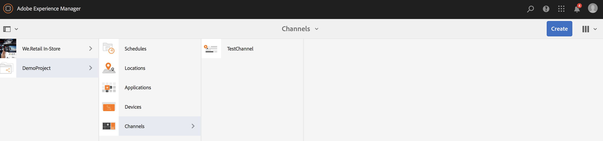
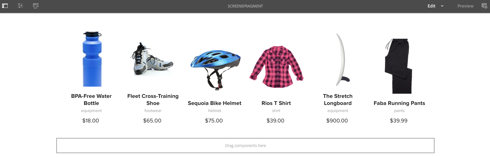
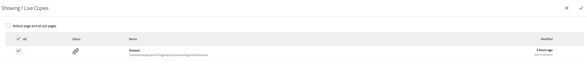

# Verwenden von Experience Fragments{#using-experience-fragments}

Die Verwendung von Erlebnisfragmenten umfasst die folgenden Themen:

* **Überblick**
* **Verwenden von Experience Fragments in AEM Screens**
* **Übertragen der Änderungen von der Master-Seite**

## Überblick {#overview}

Ein ***Experience Fragment*** ist eine Gruppe aus einer oder mehreren Komponenten (einschließlich Inhalt und Layout), die innerhalb von Seiten referenziert werden können. Experience Fragments können beliebige Komponenten enthalten, beispielsweise eine oder mehrere Komponenten mit beliebigen Elementen innerhalb eines Absatzsystems, das für das Gesamterlebnis referenziert oder von einem dritten Endpunkt angefordert wird.

## Verwenden von Experience Fragments in AEM Screens {#using-experience-fragments-in-aem-screens}

>[!NOTE]
>
>Im folgenden Beispiel wird **We.Retail** als Demoprojekt verwendet, bei dem das Experience Fragment von einer **Sites**-Seite in ein AEM Screens-Projekt übernommen wird.

Der folgende Workflow veranschaulicht beispielsweise die Verwendung von Experience Fragments aus Web.Retail in Sites. Sie können eine Webseite auswählen und diese Inhalte in Ihrem AEM Screens-Kanal in einem Ihrer Projekte nutzen.

### Voraussetzungen {#pre-requisites}

**Erstellen eines Demoprojekts mit einem Kanal**

***Erstellen eines Projekts***

1. Klicken Sie auf „Screens“ und wählen Sie **Erstellen** > „Projekt erstellen“ aus, um ein neues Projekt zu erstellen.

1. Wählen Sie im Assistenten „Screens-Projekt erstellen“ die Option „Screens“ aus.

1. Geben Sie **DemoProject** als Titel ein.
1. Klicken Sie auf **Erstellen**.

AEM Screens wird ein **DemoProject** hinzugefügt.  ***Erstellen eines Kanals***

1. Navigieren Sie zum erstellten **DemoProject** und wählen Sie den Ordner **Kanal** aus.

1. Klicken Sie in der Aktionsleiste auf **Erstellen** (siehe Abbildung unten). Ein Assistent wird geöffnet.
1. Wählen Sie den **Sequenzkanal** aus und klicken Sie auf **Weiter**.

1. Geben Sie **TestChannel** als **Titel** ein und klicken Sie auf **Erstellen**.

Ein **TestChannel** wird Ihrem **DemoProject** hinzugefügt.\

>[!NOTE]
>
>Weitere Informationen zum Erstellen eines Projekts und zum Erstellen eines Kanals finden Sie unter [Erstellen eines Projekts](creating-a-screens-project.md) bzw. [Verwalten von Kanälen](managing-channels.md) .

### Erstellen eines Experience Fragments {#creating-an-experience-fragment}

Gehen Sie wie folgt vor, um den Inhalt von **We.Retail** in Ihrem **TestChannel** in **DemoProject** zu nutzen.

1. **Navigieren zu einer Sites-Seite in We.Retail**

   1. Navigieren Sie zu „Sites“ und wählen Sie „We.Retail **>** „United States“ > „English“ und anschließend die Seite **Equipment** aus, um diese als Experience Fragment für Ihren Screens-Kanal zu verwenden.
   1. Klicken Sie in der Aktionsleiste auf **Bearbeiten**, um die Seite zu öffnen, die Sie als Experience Fragment für Ihren Screens-Kanal verwenden möchten.
   

1. **Wiederverwenden des Inhalts**

   1. Wählen Sie das Fragment aus, das Sie in den Kanal aufnehmen möchten.
   1. Klicken Sie auf das letzte Symbol rechts, um das Dialogfeld **In Experience Fragment konvertieren** zu öffnen.
   

1. **Erstellen eines Experience Fragments**

   1. Wählen Sie unter **Aktion** die Option **Neues Experience Fragment erstellen** aus.
   1. Wählen Sie den **übergeordneten Pfad** aus.
   1. Wählen Sie die **Vorlage** aus. Wählen Sie hier die Vorlage **We.Retail** .
   1. Geben Sie unter „Fragmenttitel“ den Wert **ScreensFragment** ein.
   1. Klicken Sie auf das Häkchen, um die Erstellung eines neuen Experience Fragments abzuschließen.
   

1. **Erstellen einer Live Copy des Experience Fragments**

   1. Navigieren Sie zur AEM-Homepage.
   1. Select **Experience Fragments** and highlight the **ScreensFragment** and click **Variation as live- Copy**, as shown in the figure below:
   

   c. Wählen Sie im Assistenten „Live Copy erstellen“ die Option „ScreensFragment“**** aus und klicken Sie auf **Weiter**.

   d. Geben Sie unter **Titel** und unter **Namen** den Wert **Screens** ein.

   e. Klicken Sie auf **Erstellen**, um die Live Copy zu erstellen.

   

1. **Verwenden des Erlebnisfragments im Bildschirmkanal**

   1. Navigieren Sie zum Screens-Kanal, in dem Sie das **Screens**-Fragment verwenden möchten.
   1. Select the **TestChannel** and click **Edit** from the bar.
   1. Klicken Sie in der Seitenleiste auf das Komponentensymbol.
   1. Drag and drop the **Embedded Page** to your channel.
   

   e. Select the **Embedded Page** component and select the top left (wrench) icon to open the **Page** dialog box.

   f. Wählen Sie im Feld „Pfad“ die Live Copy **Screens** des Fragments aus, die Sie in *Schritt 3* erstellt haben.

   

   h. Geben Sie die Sekunden in das Feld „Dauer“ ein.

   
i. Klicken Sie auf das Häkchen, um den Vorgang abzuschließen.

   

### Validieren des Ergebnisses {#validating-the-result}

After completion of precceeding steps, you can validate your experience fragment in the **TestChannel** by:

1. Navigieren Sie zum **TestChannel**.
1. Wählen Sie in der Aktionsleiste die **Vorschau** aus.

Sie sehen den Inhalt der **Sites**-Seite (Live Copy des Experience Fragments) in Ihrem Kanal, wie in der folgenden Abbildung dargestellt:\

## Übertragen der Änderungen von der Master-Seite {#propagating-changes-from-the-master-page}

***Live Copy*** bezieht sich auf die Kopie (der Quelle), die durch Synchronisierungsaktionen aufrechterhalten wird, wie in den Rollout-Konfigurationen definiert.

Da es sich bei dem von uns erstellten Experience Fragment um eine Live Copy der **Sites**-Seiten handelt, werden die Änderungen in Ihrem Kanal oder dem Ziel, in dem Sie das Experience Fragment verwendet haben, angezeigt, wenn Sie auf der Master-Seite Änderungen an diesem bestimmten Fragment vornehmen.

>[!NOTE]
>
>For more information on Live Copy, see [Reusing Content: Multi Site Manager and Live Copy](/help/sites-administering/msm.md).

Gehen Sie wie folgt vor, um Änderungen vom Master-Kanal zum Zielkanal zu übertragen:

1. Wählen Sie auf der **Sites**-Seite (Master) das Experience Fragment aus und klicken Sie auf das Stiftsymbol, um die Elemente im Experience Fragment zu bearbeiten.

   

1. Wählen Sie das Experience Fragment aus und klicken Sie auf das Schraubenschlüsselsymbol, um das Dialogfeld zum Bearbeiten der Bilder zu öffnen.

   

1. Das Dialogfeld **Produktraster** wird geöffnet.

   

1. Sie können alle Bilder bearbeiten. Hier wird beispielsweise das erste Bild in diesem Fragment ersetzt.

   

1. Wählen Sie das Experience Fragment aus und klicken Sie auf das Rollout-Symbol, um Änderungen an dem Fragment zu übertragen, das in Ihrem Kanal verwendet wird.

   

1. Klicken Sie auf „Rollout“, um die Änderungen zu bestätigen.

   Sie werden sehen, dass die Änderungen übertragen werden.

   

### Validieren der Änderungen {#validating-the-changes}

Gehen Sie wie folgt vor, um die Änderungen in Ihrem Kanal zu bestätigen:

1. Navigieren Sie zu **Screens** > **Kanäle** > **TestChannel**.

1. Klicken Sie in der Aktionsleiste auf **Vorschau**, um die Änderungen zu bestätigen.

Die folgende Abbildung zeigt die Änderungen in Ihrem **TestChannel**:\

