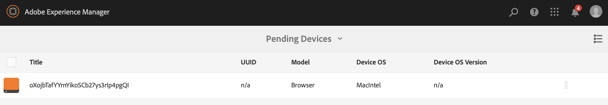

# Schnellstartanleitung    {#kickstart-guide}

Dieser Abschnitt ist eine Schnellstartanleitung für AEM Screens, in dem eine Reihe grundlegender Aktionen vorgestellt werden. Er erläutert, wie Sie ein einfaches Erlebnis für digitale Beschilderung mit Inhalten/Assets erstellen und in einem Screens-Player veröffentlichen. Detaillierte Informationen zu allen Komponenten für die Screens-Entwicklung finden Sie in den Ressourcen am Ende der Seite.

## Erstellen eines Erlebnisses für digitale Beschilderungen in fünf Minuten {#creating-a-digital-signage-experience-in-minutes}

Mit den nachfolgenden Schritten können Sie ein Beispielprojekt für Screens erstellen und Inhalte im Screens-Player veröffentlichen.

1. Um einen **AEM Screens-Player** herunterzuladen, klicken Sie [hier](https://download.macromedia.com/screens/).

   AEM Screens ist auch in **Google Play** verfügbar.

   Informationen zur Implementierung des Players für Chrome OS finden Sie unter [Chrome Management Console](implementing-chrome-os-player.md).

   Weitere Einzelheiten finden Sie unter [Installieren und Konfigurieren von Screens](configuring-screens-introduction.md).

   >[!NOTE]
   >
   >**OSGi-Einstellungen** 
   >
   >Sie müssen den leeren Referrer aktivieren, um dem Gerät das Bereitstellen von Daten auf dem Server zu erlauben. Wenn die Eigenschaft für den leeren Referrer deaktiviert ist, kann das Gerät keine Screenshots zurückgeben. Derzeit sind einige dieser Funktionen nur verfügbar, wenn der Apache Sling Referrer-Filter „Allow Empty“ in der OSGi-Konfiguration aktiviert ist. Im Dashboard wird ggf. eine Warnung angezeigt, dass einige dieser Funktionen aufgrund der Sicherheitseinstellungen nicht funktionieren.
   >
   >Führen Sie die nachfolgenden Schritte aus, um den ***Apache Sling Referrer-Filter „Allow Empty“*** zu aktivieren:
   >
   >1. Navigate to [Adobe Experience Manager Web Console Configuration](http://localhost:4502/system/console/configMgr/org.apache.sling.security.impl.ReferrerFilter).
   >1. Aktivieren Sie die Option **allow.empty**.
   >1. Klicken Sie auf **Speichern**.
   >    
   >Weitere Informationen zu den vorherigen Schritten finden Sie im Abschnitt ***Voraussetzungen*** unter [Konfigurieren und Bereitstellen von AEM-Bildschirmen](configuring-screens-introduction.md).

1. **Erstellen eines neuen Projekts**

   1. Wählen Sie den Adobe Experience Manager-Link (oben links) und dann **Screens** aus. Alternatively, you can go directly to: [http://localhost:4502/screens.html/content/screens](http://localhost:4502/screens.html/content/screens).
   1. Klicken Sie auf **Erstellen**, um ein neues Screens-Projekt zu erstellen (siehe Abbildung unten).
   1. Wählen Sie im Assistenten **Screens-Projekt erstellen** die Option **Screens** aus und klicken Sie auf **Weiter**.
   1. Geben Sie als Titel **Test_Project** ein und klicken Sie auf **Erstellen**.
   

   Wenn das Projekt erstellt wurde, kehren Sie zur Screens-Projektkonsole zurück. Sie können Ihr Projekt jetzt auswählen. In a project, there are five kind of folders namely **Schedules**, **Locations**, **Applications**, **Devices** and **Channels**, as shown in the figure below.

   >[!NOTE]
   >
   >Zeitpläne sind nur verfügbar, wenn Sie das Feature Pack 1 für AEM 6.3 Sites installiert haben. Wenden Sie sich an den Adobe-Support, um Zugriff auf dieses Feature Pack zu erhalten. Wenn Sie die entsprechenden Berechtigungen erhalten haben, können Sie es von Package Share herunterladen.

   

   Weitere Informationen finden Sie unter [Erstellen und Verwalten von Screens-Projekten](creating-a-screens-project.md).

1. **Erstellen von neuen Kanälen**

   Wenn Sie ein Projekt konfiguriert haben, müssen Sie einen neuen Kanal zum Verwalten der Inhalte erstellen.

   Gehen Sie wie folgt vor, um einen neuen Kanal für Ihr Projekt zu erstellen:

   1. Navigieren Sie zum erstellten **Test_Project** und wählen Sie den Ordner **Kanäle** aus.
   1. Klicken Sie in der Aktionsleiste auf **Erstellen** (siehe Abbildung unten). Ein Assistent wird geöffnet.
   1. Wählen Sie den **Sequenzkanal** aus und klicken Sie auf **Weiter**.
   1. Geben Sie als **Name** und **Titel** **TestChannel** ein und klicken Sie auf **Erstellen**.
   

   Der *TestChannel* wird erstellt und zum Ordner „Kanäle“ hinzugefügt, wie in der nachfolgenden Abbildung gezeigt.

   

   Weitere Einzelheiten zum Erstellen und Verwalten von Kanälen finden Sie unter [Kanalverwaltung](managing-channels.md).

1. **Hinzufügen von Inhalten zu Kanälen**

   Sobald Sie Ihren Kanal eingerichtet haben, müssen Sie Inhalt zu Ihrem Kanal hinzufügen, den der AEM Screens-Player anzeigen wird.

   Gehen Sie wie folgt vor, um dem Kanal (*TestChannel*) Ihres Projekts Inhalte hinzuzufügen:

   1. Navigieren Sie zum erstellten *Test_Project* und wählen Sie den Ordner **Kanäle** aus.
   1. Klicken Sie in der Aktionsleiste auf **Bearbeiten** (siehe Abbildung unten). Der Editor für den *Testkanal* wird geöffnet.
   1. Klicken Sie auf der linken Seite der Aktionsleiste auf das Symbol zum Ein-/Ausblenden des seitlichen Bedienfelds, um die Assets und Komponenten zu öffnen.
   1. Wählen Sie die Ihrem Kanal hinzuzufügenden Komponenten per Drag-and-Drop aus.
   

   In diesem Beispiel zeigt der Editor ein Bild, das dem Kanal hinzugefügt wurde.

   

1. **Erstellen eines neuen Standorts**

   Wenn der Kanal konfiguriert wurde, müssen Sie den Standort erstellen.

   ***Standorte*** gliedern die verschiedenen Digital Signage-Erlebnisse und enthalten die Konfigurationen der einzelnen Anzeigen, abhängig vom jeweiligen Standort.

   Gehen Sie wie folgt vor, um einen neuen Standort für Ihr Projekt zu erstellen:

   1. Navigieren Sie zum erstellten *Test_Project* und wählen Sie den Ordner **Standorte** aus.
   1. Klicken Sie neben dem Plussymbol in der Aktionsleiste auf **Erstellen** (siehe Abbildung unten). Ein Assistent wird geöffnet.
   1. Wählen Sie im Assistenten **Standort** aus und klicken Sie auf **Weiter**.
   1. Geben Sie den **Namen** und **Titel** für Ihren Standort ein (geben Sie als Titel *TestLocation* ein) und klicken Sie auf **Erstellen**.
   

   Der Standort *TestLocation* wird erstellt und dem Ordner **Standorte** hinzugefügt.

   

1. **Erstellen einer neuen Anzeige für *TestLocation ***

   Nachdem Sie einen Standort konfiguriert haben, müssen Sie eine neue Anzeige für diesen erstellen.

   ***Anzeigen*** repräsentieren das digitale Erlebnis, das auf einem oder mehreren Bildschirmen dargestellt wird.

   1. Navigieren Sie zum Standort, an dem Ihre Anzeige erstellt werden soll (*Test_Project* > **Standorte** > *TestLocation)*, wie in der Abbildung oben gezeigt, und wählen Sie *TestLocation* aus.
   1. Klicken Sie in der Aktionsleiste auf „Erstellen“.
   1. Wählen Sie im Assistenten **Erstellen** die Option **Anzeige** aus und klicken Sie auf **Weiter**.
   1. Enter **Title** for your display location (enter the title as *TestDisplay*).
   1. Klicken Sie auf **Erstellen**.
   A new display *TestDisplay* is added to your location *TestLocation*, as shown in the figure below.

   

1. **Hinzufügen von Zeitplänen**

   Mit der Funktion *Zeitpläne* in AEM Screens können Sie Kanäle zu wiederverwendbaren Gruppen zusammenfassen, sodass Sie nicht für jede einzelne Anzeige, in der Sie einen bestimmten Inhalt zeigen möchten, eine neue Zuweisung vornehmen müssen.

   >[!NOTE]
   >
   >Diese Bildschirmfunktion ist nur verfügbar, wenn Sie AEM 6.3 Sites Feature Pack 1 oder höher installiert haben. Wenden Sie sich an den Adobe-Support, um Zugriff auf dieses Feature Pack zu erhalten. Wenn Sie die entsprechenden Berechtigungen erhalten haben, können Sie es von Package Share herunterladen.

   1. Navigieren Sie über „Test_Project“ > **Zeitpläne** zum Ordner **Zeitpläne**.
   1. Klicken Sie in der Aktionsleiste auf „Erstellen“. Ein Assistent wird geöffnet.
   1. Wählen Sie auf der Seite des Assistenten **Erstellen** die Option **Zeitplan** aus.
   1. Enter the **Title** as *MorningSchedule* in the properties page.
   1. Wenn Sie auf **Erstellen** klicken, wird der Zeitplan zum Ordner **Zeitpläne** hinzugefügt, wie in der nachfolgend Abbildung gezeigt.
   

   Wählen Sie darüber hinaus den Zeitplan (*ZeitplanVormittag*) aus und klicken Sie in der Aktionsleiste auf **Dashboard**, um das Dashboard für Zeitpläne anzuzeigen. Mit dem Dashboard können Sie die Eigenschaften des Zeitplans anzeigen/ändern, Kanäle zuweisen und zugewiesene Anzeigen anzeigen.

   

   Unter [Erstellen und Verwalten von Zeitplänen](managing-schedules.md) finden Sie detaillierte Informationen zu Zeitplänen.

1. **Zuweisen von Kanälen**

   1. Navigieren Sie über *Test_Project* > **Standorte** > *TestLocation* > *TestDisplay* zur Anzeige.
   1. Wählen Sie *TestDisplay* aus und tippen/klicken Sie in der Aktionsleiste auf „Kanal zuweisen“.**
   1. Alternativ dazu können Sie auf **Dashboard** klicken und oben rechts im Bedienfeld **ZUGEWIESENE KANÄLE UND ZEITPLÄNE** die Option **+Kanal zuweisen** auswählen, wie in der nachfolgenden Abbildung gezeigt. Daraufhin wird das Dialogfeld **Kanalzuweisung** geöffnet.
   1. Wählen Sie als Vorgehensweise für **Kanal referenzieren** die Option **Pfad** aus.
   1. Wählen Sie den **Kanalpfad** (*Test_Project* > *Kanäle* > *TestChannel*) unter **Kanal** aus. Die **Kanalrolle** wird automatisch mit dem Kanalnamen gefüllt.
   1. Wählen Sie als **Priorität** für den Kanal *1* aus.
   1. Wählen Sie unter **Unterstützte Ereignisse** die Optionen **Erster Ladevorgang** und **Bildschirm bei Untätigkeit** aus.
   1. Geben Sie den **Zeitplan** ein und wählen Sie unter **aktiv ab** und **aktiv bis** jeweils ein Datum aus. *(Sie müssen diese Felder nur ausfüllen, wenn der Kanal für einen bestimmten Zeitraum angezeigt werden soll.)*
   1. Klicken Sie auf **Speichern**.
   Der Kanal wird dem Bedienfeld zugewiesen und hinzugefügt.

   

   Weitere Informationen zum Dialogfeld **Kanalzuweisung** und den damit verbundenen Eigenschaften finden Sie unter [Kanalzuweisung.](channel-assignment.md)

1. **Hinzufügen von Zeitplänen zu Kanälen**

   1. Navigieren Sie über *Test_Project* > **Standorte** > *TestLocation* > *TestDisplay* zur Anzeige.
   1. Klicken Sie auf **Dashboard** und wählen Sie oben rechts im Bedienfeld **ZUGEWIESENE KANÄLE UND ZEITPLÄNE** die Option **+Zeitplan zuweisen** aus, wie in der obigen Abbildung gezeigt. Das Dialogfeld **Zeitplanzuweisung** wird geöffnet.
   1. Wählen Sie den Pfad aus, unter dem Sie den Zeitplan erstellt haben (hier *Test_Project* > **Zeitpläne** > *ZeitplanVormittag*).
   1. Klicken Sie auf **Speichern**, um den Zeitplan Ihrem Kanal hinzuzufügen.
   

1. **Registrieren von Geräten**

   Sie müssen Ihr Gerät mithilfe des AEM-Dashboards registrieren.

   >[!NOTE]
   >
   >Sie können den Screens-Player über die heruntergeladene AEM Screens-App oder mithilfe des Webbrowsers öffnen.

   Anzeigen von ausstehenden Geräten:

   1. Öffnen Sie ein separates Browser-Fenster.
   1. Wechseln Sie mithilfe des [Webbrowsers](http://localhost:4502/content/mobileapps/cq-screens-player/firmware.html) zum Screens-Player  oder starten Sie die AEM Screens-App. Wenn Sie das Gerät öffnen, können Sie sehen, dass das Gerät nicht registriert ist.
   1. Navigieren Sie im AEM-Dashboard zu *Test_Project* > **Geräte**
   1. Klicken Sie in der Aktionsleiste auf **Geräte-Manager**.
   1. Klicken Sie auf **Geräteregistrierung**. Daraufhin werden die ausstehenden Geräte angezeigt, wie in der nachfolgenden Abbildung dargestellt.
   >[!NOTE]
   >
   >Wenn Sie AEM Screens Player als ChromeOS-Erweiterung verwenden, lesen Sie die Abfrage unter &quot; ***Installieren des ChromeOS-Players als Chrome Browser-Plugin*** &quot;in den [AEM Screens FAQs](aem-screens-faqs.md) .

   

   Wählen Sie das zu registrierende Gerät aus und klicken Sie auf **Gerät registrieren**.

   

   Sie müssen den Code validieren, indem Sie ihn über den Webbrowser oder den AEM Screens-Player überprüfen.

   Klicken Sie auf **Validieren**, um zum Bildschirm **Geräteregistrierung** zu wechseln.

   

   Geben Sie den **Titel** ein und klicken Sie auf **Registrieren**. Daraufhin wird das Gerät registriert.

   Klicken Sie auf **Beenden**, um die Geräteregistrierung abzuschließen.

   

   Durch Klicken auf **Beenden** kehren Sie zur Geräteseite zurück, auf der die zugewiesenen und nicht zugewiesenen Geräte angezeigt werden.

   

   >[!NOTE]
   >
   >Das hinzugefügte Gerät wird unter **Zugeordnet** mit dem Status **Nicht zugewiesen** angezeigt.

1. **Zuweisen von Geräten zu Anzeigen**

   Wenn Sie das Gerät registriert haben, müssen Sie es einer Anzeige zuweisen.

   Gehen Sie wie folgt vor, um ein Gerät zuzuweisen:

   1. Wählen Sie das zuzuweisende Gerät aus.
   1. Klicken Sie in der Aktionsleiste auf **Gerät zuweisen**.
   1. Wählen als Anzeigepfad für Ihren Kanal */content/screens/Test_Project/***Locations***/TestLocation/TestDisplay.*
   1. Klicken Sie auf **Zuweisen**.
   1. Klicken Sie auf **Beenden**, um den Vorgang abzuschließen. Das Gerät ist jetzt zugewiesen.
   

   Das Dashboard der Anzeige wird geöffnet und zeigt alle Informationen zu den zugewiesenen Kanälen und Zeitplänen sowie die Details der Gerätekonfiguration an.

   

### Anzeigen von Inhalten im Screens-Player {#viewing-the-content-in-screens-player}

Wenn die obigen Konfigurationen hinzugefügt wurden, sollte der Player automatisch den Standardkanal für die Anzeige auf Ihrem Gerät zeigen, z. B. ein Bild (in diesem Szenario sind ein Sequenzkanal und dessen Inhalt im Screens-Player für den Webbrowser dargestellt).

See [AEM Screens Player](working-with-screens-player.md), to get more detailed information on AEM Screens player.

### Zusätzliche Ressourcen {#additional-resources}

Detaillierte Informationen zu allen Modulen für Screens finden Sie in den folgenden Ressourcen:

1. [Installieren und Konfigurieren von Screens](configuring-screens-introduction.md)
1. [Erstellen und Verwalten von Screens-Projekten](creating-a-screens-project.md)
1. [Zuweisen von Geräten](managing-devices.md)
1. [Erstellen und Verwalten von Kanälen](managing-channels.md)
1. [Erstellen und Verwalten von Standorten](managing-locations.md)
1. [Erstellen und Verwalten von Anzeigen](managing-displays.md)
1. [Zuweisen von Kanälen](channel-assignment.md)
1. [Geräte verwalten](managing-devices.md)
1. [Erstellen und Verwalten von Zeitplänen](managing-schedules.md)
1. [AEM Screens-Player](working-with-screens-player.md)
1. [Fehlerbehebung beim Device Control Center](monitoring-screens.md)

