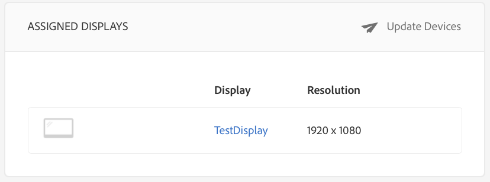

# Erstellen und Verwalten von Kanälen{#creating-and-managing-channels}

Ein Kanal zeigt eine Sequenz von Inhalten, Anzeigebildern und Videos an, kann aber auch eine Website oder eine Single Page Application anzeigen.

Auf dieser Seite wird gezeigt, wie Kanäle für Screens erstellt und verwaltet werden.

**Voraussetzungen**:

* [Konfigurieren und Bereitstellen von Screens](configuring-screens-introduction.md)
* [Erstellen und Verwalten von Screens-Projekten](creating-a-screens-project.md)

## Erstellen von neuen Kanälen {#creating-a-new-channel}

Wenn Sie Ihr Projekt für Screens erstellen, gehen Sie wie folgt vor, um einen neuen Kanal für ein Screens-Projekt zu erstellen:

1. Wählen Sie den Adobe Experience Manager-Link (oben links) und dann Screens aus. Alternatively, you can navigate directly from `http://localhost:4502/screens.html/content/screens`
1. Navigieren Sie zum Screens-Projekt und klicken Sie auf **Kanäle**.
1. Klicken Sie neben dem Pluszeichen in der Aktionsleiste auf **Erstellen**. Ein Assistent wird angezeigt (*Weitere Informationen finden Sie unter „Kanaltypen“*).

1. Wählen Sie die Vorlage aus dem Assistenten aus und klicken Sie auf **Weiter**.
1. Geben Sie die Eigenschaften für **Titel und Tags**, **Weitere Titel und Beschreibungen**, **Einschaltzeit/Ausschaltzeit** und **Vanity-URL** ein.

1. Klicken Sie auf **Erstellen**. Der Kanal wird erstellt und Ihrem Kanalordner hinzugefügt.

### Kanaltypen    {#channel-types}

Beim Verwenden des Assistenten stehen unter anderem die folgenden Vorlagenoptionen zur Verfügung:

| **Vorlagenoption** | **Beschreibung** |
|---|---|
| Kanal-Ordner | Ermöglicht die Erstellung eines Ordners zum Speichern von Kanalsammlungen |
| Sequenz-Kanal | Ermöglicht die Erstellung eines Kanals zum sequenziellen Wiedergeben der Komponenten (einzeln in einer Diashow) |
| Anwendungskanal | Ermöglicht die Präsentation benutzerdefinierter Webanwendungen im Screens-Player |
| 1x1-Splitscreen-Kanal | Ermöglicht das Anzeigen der Komponente in einer Zone. |
| 1x2-Splitscreen-Kanal | Ermöglicht das Anzeigen der Assets in zwei Bereichen (horizontal geteilt). |
| 2x2-Splitscreen-Kanal | Ermöglicht das Anzeigen der Assets in vier Bereichen (horizontal und vertikal in einer Matrix geteilt). |
| 2:3-Splitscreen-Kanal | Ermöglicht das Anzeigen der Assets in zwei Bereichen (horizontal geteilt), wobei ein Bereich größer ist als der andere ist. |

>[!NOTE]
>
>Die Splitscreen-Kanäle teilen die Anzeige in mehrere Bereiche, sodass Sie mehrere Erlebnisse gleichzeitig nebeneinander wiedergeben können. Die Erlebnisse können entweder statische Assets/Text oder eingebettete Sequenzen sein.

The following example shows the creation of a Sequence Channel **ChannelOne** for a Screens project **DemoProject**.

>[!NOTE]
>
>Sie können unterschiedliche Bereiche mithilfe der Vorlagenoptionen erstellen, etwa die oben genannten 1x2-, 2x2- oder 2:3-Splitscreen-Kanäle.

***Wichtig***:

Nachdem Sie Inhalte erstellt und dem Kanal hinzugefügt haben, müssen Sie als Nächstes einen Ort und dann eine Anzeige erstellen. Außerdem müssen Sie diesen Kanal einer Anzeige zuweisen. Weitere Informationen finden Sie über die am Ende des Abschnitts genannten Ressourcen.

## Arbeiten mit Kanälen {#working-with-channels}

Sie können Änderungen vornehmen, Eigenschaften und Dashboard anzeigen sowie einen Kanal kopieren, in der Vorschau anzeigen und löschen.

>[!NOTE]
>
>Klicken Sie auf das Symbol auf der linken Seite, um ein Element auszuwählen. Beispiel: Klicken Sie auf das Symbol für den Kanal und führen Sie die Schritte aus, die in der folgenden Abbildung dargestellt sind.

### Hinzufügen/Bearbeiten von Inhalt eines Kanals {#adding-editing-content-to-a-channel}

Um Inhalt in einem Kanal hinzuzufügen oder zu bearbeiten, gehen Sie wie folgt vor:

1. Klicken Sie auf den Kanal, den Sie bearbeiten möchten (wie in der obigen Abbildung gezeigt).
1. Klicken Sie in der oberen linken Ecke der Aktionsleiste auf **Bearbeiten**, um die Kanaleigenschaften zu bearbeiten. Der Editor wird geöffnet. Sie haben die Möglichkeit, Ihrem Kanal Assets/Komponenten hinzuzufügen, die Sie veröffentlichen möchten.

**Hochladen von Videos in den Kanal** Gehen Sie wie folgt vor, um Videos in Ihren Kanal hochzuladen:

1. Wählen Sie den Kanal aus, in den Sie das Video hochladen möchten.
1. Klicken Sie in der Aktionsleiste auf **Bearbeiten**, um den Editor zu öffnen.
1. Wählen Sie unter „Assets“ die Option **Videos** und verschieben Sie die betreffenden Videos per Drag-and-Drop.

>[!NOTE]
>
>Wenn Sie beim Hochladen von Videos in Ihren Kanal auf Probleme stoßen, lesen Sie [Fehlerbehebung beim Arbeiten mit Videos](troubleshoot-videos.md) unter „Verwalten von Screens“.

### Anzeigen von Eigenschaften {#viewing-properties}

Um die Eigenschaften eines Kanals anzuzeigen oder zu bearbeiten, gehen Sie wie folgt vor:

1. Klicken Sie auf den Kanal, den Sie bearbeiten möchten.
1. Klicken Sie auf **Eigenschaften **in der Aktionsleiste, um die Kanaleigenschaften anzuzeigen/zu bearbeiten. Anhand der folgenden Registerkarten können Sie die Optionen ändern.

### Anzeigen des Dashboards {#viewing-dashboard}

Um das Dashboard eines Kanals anzuzeigen, gehen Sie wie folgt vor:

1. Klicken Sie auf den Kanal, den Sie bearbeiten möchten.
1. Click **View Dashboard** from the action bar to view the dashobard. Das Fenster **KANALINFORMATIONEN** und **ZUGEWIESENE ANZEIGEN** wird geöffnet, wie in der folgenden Abbildung dargestellt:

### Kanalinformationen {#channel-information}

Im Bedienfeld „Kanalinformationen“ werden die Kanaleigenschaften zusammen mit der Kanalvorschau beschrieben. Darüber hinaus finden Sie dort Informationen dazu, ob der Kanal offline oder online ist.

Klicken Sie in der in Aktionsleiste **Kanalinformationen** auf (**...**), um Eigenschaften anzuzeigen, Inhalt zu bearbeiten oder den Cache (Offline-Inhalt) für den Kanal zu aktualisieren.

### Online- und Offline-Kanäle {#online-and-offline-channels}

>[!NOTE]
>
>Wenn Sie einen Kanal erstellen, ist der Kanal standardmäßig offline.

Wenn Sie einen Kanal erstellen, kann er entweder als Online- oder als Offline-Kanal definiert werden.

Ein ***Online-Kanal*** zeigt den aktualisierten Inhalt in der Echtzeitumgebung an, während ein ***Offline-Kanal*** den im Cache gespeicherten Inhalt wiedergibt.

Gehen Sie wie folgt vor, um den Kanal online zu schalten:

1. Navigieren Sie zum Kanal **TestChannel** aus dem Ordner **Channels** in Ihrem **TestProject**.

   Wählen Sie den Kanal aus.

   

   Klicken Sie in der Aktionsleiste auf **Dashboard anzeigen**, um den Status des Players anzuzeigen. Im Bedienfeld „ KANALINFORMATIONEN“ wird angezeigt, ob der Kanal online oder offline ist.

   

1. Klicken Sie in der Aktionsleiste auf **Eigenschaften** und navigieren Sie zur Registerkarte **Kanal**, wie unten gezeigt:

   

1. Markieren Sie den **Kanal online** machen, um ihn als online zu gestalten.

   Klicken Sie auf **Speichern und schließen**, um Ihre Option zu speichern.

   

   Das Kanal-Dashboard wird angezeigt und das Fenster **KANALINFORMATIONEN** zeigt an, dass der Player online ist.

   

#### Automatische oder manuelle Aktualisierungen über das Geräte-Dashboard {#automatic-versus-manual-updates-from-the-device-dashboard}

In der folgenden Tabelle werden die Ereignisse im Zusammenhang mit automatischen und manuellen Aktualisierungen über das Geräte-Dashboard zusammengefasst.

<table> 
 <tbody> 
  <tr> 
   <td><strong>Ereignis</strong></td> 
   <td><strong>Automatische Geräteaktualisierung</strong></td> 
   <td><strong>Manuelle Geräteaktualisierung</strong></td> 
  </tr> 
  <tr> 
   <td>Änderung am Online-Kanal</td> 
   <td>Inhalt automatisch aktualisiert</td> 
   <td>
Inhalt aktualisiert über „Gerät: Push-Konfiguration“
 
Oder
 
Inhalt aktualisiert über <strong><i>Gerät: Neustart</i></strong>
 </td> 
  </tr> 
  <tr> 
   <td>Änderung am Offline-Kanal, aber „Push-Inhalt“ wird für den Kanal NICHT ausgelöst (keine Neuerstellung des Offline-Pakets)</td> 
   <td>Keine Aktualisierung des Inhalts</td> 
   <td>Keine Aktualisierung des Inhalts</td> 
  </tr> 
  <tr> 
   <td>Änderung am Offline-Kanal und „Push-Inhalt“ wird für den Kanal ausgelöst (neues Offline-Paket)</td> 
   <td>Inhalt automatisch aktualisiert</td> 
   <td>
Inhalt aktualisiert über <strong><i>Gerät: Push-Konfiguration</i></strong>
 
Oder
 
Inhalt aktualisiert über <strong><i>Gerät: Neustart</i></strong>
 </td> 
  </tr> 
  <tr> 
   <td>
Änderung an Konfiguration
 
    <ul> 
     <li>Anzeige (erzwungener Kanal)</li> 
     <li>Gerät</li> 
     <li>Kanalzuweisungen (neuer Kanal, entfernter Kanal)</li> 
     <li>Kanalzuweisung (Rolle, Ereignis, Planung)</li> 
    </ul> </td> 
   <td>Konfiguration automatisch aktualisiert</td> 
   <td>
Konfiguration aktualisiert über <strong><i>Gerät: Push-Konfiguration</i></strong>
 
Oder
 
Konfiguration aktualisiert über <strong><i>Gerät: Neustart</i></strong>
 </td> 
  </tr> 
 </tbody> 
</table>

### Zugewiesene Anzeigen {#assigned-displays}

Das Fenster „Zugewiesene Anzeigen“ zeigt die zum Kanal gehörende Anzeige. Es bietet einen Überblick über die zugewiesene Anzeige und die Auflösung.

Die zugeordneten Anzeigen werden im Fenster **Zugewiesene Anzeigen** aufgelistet, wie unten gezeigt:

>[!NOTE]
>
>Weitere Informationen zum Erstellen einer Anzeige an einem Standort finden Sie unter:
>
>* [Erstellen und Verwalten von Standorten](managing-locations.md)
>* [Erstellen und Verwalten von Anzeigen](managing-displays.md)
>

Außerdem können Sie auf die Anzeige im Bedienfeld **ZUGEWIESENE ANZEIGEN** klicken, um die Anzeigeinformationen anzuzeigen, wie unten gezeigt:

### Die nächsten Schritte {#the-next-steps}

Der nächste Schritt nach dem Erstellen eines Kanals und dem Hinzufügen/Bearbeiten von Inhalt in Ihrem Kanal ist das Erstellen eines Orts und einer Anzeige. Schließlich muss dieser Anzeige dann noch ein Kanal zugewiesen werden.

Informationen zu den nächsten Schritten finden Sie in den folgenden Ressourcen:

* [Erstellen und Verwalten von Kanälen](managing-channels.md)
* [Erstellen und Verwalten von Standorten](managing-locations.md)
* [Erstellen und Verwalten von Anzeigen](managing-displays.md)