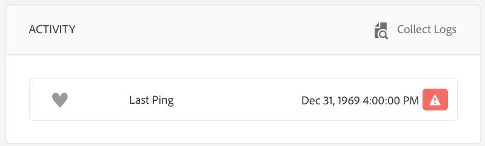

# Problembehebung in der Gerätesteuerung{#troubleshooting-device-control-center}

Über das Geräte-Dashboard können Sie die Leistung Ihrer Screens-Player-Aktivität und Ihres Geräts überwachen und Fehler beheben. Auf dieser Seite finden Sie Informationen zur Überwachung und Fehlerbehebung bei erkannten Leistungsproblemen des Screens-Players und der zugeordneten Geräte.

## Durchführen der Überwachung und Fehlerbehebung über das Geräte-Kontrollzentrum      {#monitor-and-troubleshoot-from-device-control-center}

Mit dem Geräte-Dashboard können Sie die Aktivität überwachen und somit eine Fehlerbehebung für Ihren Bildschirmplayer durchführen.

### Geräte-Dashboard {#device-dashboard}

Führen Sie die folgenden Schritte aus, um zum Geräte-Dashboard zu navigieren:

1. Navigieren Sie ausgehend von Ihrem Projekt zum Geräte-Dashboard, z. B. über ***Testprojekt*** > ***Geräte***.

   Wählen Sie in der Aktionsleiste die Optionen **Geräte** und **Geräte-Manager** aus.

   

1. Wählen Sie das Gerät aus, das Sie überwachen möchten.

   

1. Auf der Seite werden die Geräteinformationen, die Aktivitäten und die Gerätedetails angezeigt, mit denen Sie die Geräteaktivitäten und -funktionen überwachen können.

   

### Überwachen der Geräteaktivität {#monitor-device-activity}

Im Bedienfeld **Aktivität** wird das letzte Ping Ihres Screens-Players mit dem dazugehörigen Zeitstempel angezeigt. Das letzte Ping entspricht dem letzten Zeitpunkt, zu dem das Gerät den Server kontaktiert hat.

Klicken Sie außerdem oben rechts im Bedienfeld **Aktivität** auf **Protokolle erfassen**, um die Protokolle für Ihren Player anzuzeigen.

### Aktualisieren der Gerätedetails {#update-device-details}

Zeigen Sie im Bedienfeld **Gerätedetails** die Geräte-IP, Speicherverwendung, Firmware-Version und Player-Betriebszeit für Ihr Gerät an.

Klicken Sie außerdem auf **Zwischenspeicher löschen** und **Aktualisieren**, um den Zwischenspeicher Ihres Geräts zu löschen und die [Firmware-Version](screens-glossary.md) über dieses Bedienfeld zu aktualisieren.

Klicken Sie darüber hinaus oben rechts im Bedienfeld **Gerätedetails** auf **...**, um den Player neu zu starten bzw. den Status zu aktualisieren.

### Aktualisieren der Geräteinformationen {#update-device-information}

Check the **DEVICE INFORMATION** panel to view the configuration update, device, platform, version, and the diplay associated with the device.

Klicken Sie außerdem oben rechts im Bedienfeld „Geräteinformationen“ auf die Punkte (**...**), um Eigenschaften anzuzeigen oder das Gerät zu aktualisieren.

Klicken Sie auf **Eigenschaften**, um das Dialogfeld **Geräteeigenschaften** anzuzeigen. Sie können den Gerätetitel bearbeiten oder als Option für Konfigurationsaktualisierungen **Manuell** oder **Automatisch** wählen.

>[!NOTE]
>
>Weitere Informationen zu den Ereignissen, die den automatischen oder manuellen Aktualisierungen des Geräts zugeordnet sind, finden Sie im Abschnitt ***Automatische oder manuelle Aktualisierungen über das Geräte-Dashboard*** unter [Verwalten von Kanälen](managing-channels.md).

### Anzeigen des Player-Screenshots {#view-player-screenshot}

Sie können den Player-Screenshot für das Gerät im Bedienfeld „PLAYER-SCREENSHOT“ anzeigen.

Klicken Sie oben rechts im Bedienfeld „Player-Screenshot“ auf die Punkte (**...**) und wählen Sie die Option „Screenshot aktualisieren“, um den Screenshot des ausgeführten Players anzuzeigen.

### Verwalten von Einstellungen {#manage-preferences}

Im Bedienfeld **VOREINSTELLUNGEN** können Benutzer die Voreinstellungen des Geräts für **Administrator-Benutzeroberfläche**, **Kanalschalter** und **Remote-Debugging** ändern.

>[!NOTE]
>
>Weitere Informationen zu dieser Option finden Sie unter [AEM Screens-Player](working-with-screens-player.md).

Klicken Sie außerdem oben rechts auf **Anzeigevoreinstellungen**, um die Server-URL und die Auflösung zu aktualisieren.

## Durchführen der Fehlerbehebung für die OSGi-Einstellungen {#troubleshoot-osgi-settings}

Sie müssen den leeren Referrer aktivieren, um dem Gerät das Bereitstellen von Daten auf dem Server zu erlauben. Wenn die Eigenschaft für den leeren Referrer deaktiviert ist, kann das Gerät keine Screenshots zurückgeben.

Derzeit sind einige dieser Funktionen nur verfügbar, wenn der *Apache Sling Referrer-Filter „Allow Empty“* in der OSGi-Konfiguration aktiviert ist. Im Dashboard wird ggf. eine Warnung angezeigt, dass einige dieser Funktionen aufgrund der Sicherheitseinstellungen nicht funktionieren.

Führen Sie die nachfolgenden Schritte aus, um den Apache Sling Referrer-Filter „Allow Empty“ zu aktivieren

1. Navigate to [Adobe Experience Manager Web Console Configuration](http://localhost:4502/system/console/configMgr/org.apache.sling.security.impl.ReferrerFilter).
1. Aktivieren Sie die Option „allow.empty“.
1. Klicken Sie auf **Speichern**.

### Empfehlungen {#recommendations}

Im folgenden Abschnitt wird die Überwachung der Netzwerklinks, des Servers und der Player empfohlen, um Informationen zum Zustand zu erhalten und auf Probleme reagieren zu können.

AEM ermöglicht die integrierte Überwachung für:

* *Takt* alle fünf Sekunden, um anzugeben, dass der Player für AEM Screens betriebsbereit ist
* *Screenshot* vom Player, um zu sehen, was derzeit im Player angezeigt wird
* Auf dem Player installierte *Firmware für den Player für AEM Screens*
* *Freier Speicherplatz* auf dem Player

Empfehlungen für die Remoteüberwachung mit Drittanbieter-Software:

* CPU-Auslastung auf den Playern
* Überprüfung, ob der Prozess des Players für AEM Screens ausgeführt wird
* Neustart des Players per Remote-Zugriff
* Benachrichtigungen in Echtzeit

Es wird empfohlen, die Player-Hardware und das Betriebssystem so bereitzustellen, dass eine Remote-Anmeldung möglich ist, um Probleme zu diagnostizieren und den Player neu zu starten.

#### Zusätzliche Ressourcen {#additional-resources}

Informationen zum Debuggen und Behandeln von Problemen beim Abspielen von Videos in Ihrem Kanal finden Sie unter [Konfiguration der Videowiedergabe und Fehlerbehebung](troubleshoot-videos.md).
