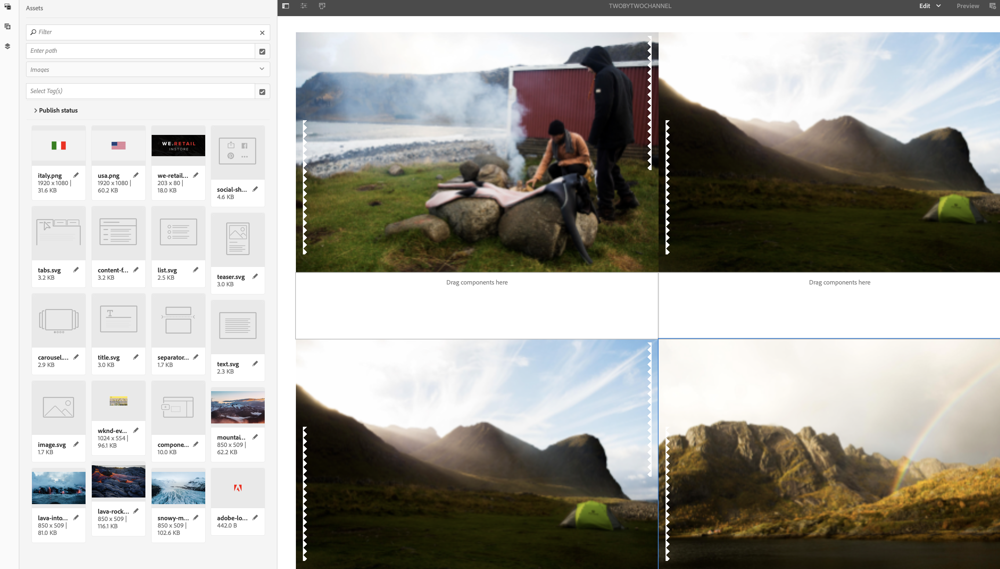

# Mehrzonen- zu Einzel-Zone-Übernahmeschleife{#single-zoneto-multizone}

## Nutzungsszenario – Beschreibung {#use-case-description}

In diesem Abschnitt wird ein Verwendungsfallbeispiel beschrieben, in dem hervorgehoben wird, wie ein Kanal mit einem Mehrzonenlayout eingerichtet wird, der mit einem Einzonenlayoutkanal wechselt. Jeder Kanal verfügt über sequenzierende Bild-/Video-Assets.

### Voraussetzungen {#preconditions}

Bevor Sie mit diesem Nutzungsszenario beginnen, sollten Sie sich mit den folgenden Themen vertraut machen:

* **[Erstellen und Verwalten von Kanälen](/help/screens/managing-channels.md)**
* **[Erstellen und Verwalten von Standorten](/help/screens/managing-locations.md)**
* **[Erstellen und Verwalten von Zeitplänen](/help/screens/managing-schedules.md)**
* **[Geräteregistrierung](/help/screens/device-registration.md)**

### Hauptakteure {#primary-actors}

Autoren von Inhalten

## Einrichten des Projekts {#setting-up-the-project}

Gehen Sie wie folgt vor, um ein Projekt einzurichten:

1. Erstellen Sie ein AEM Screens-Projekt mit dem Namen **TakeoverLoop** wie unten dargestellt.

   >[!NOTE]
   >
   >To learn more about creating and managing projects in AEM Screens, refer to [Creating a Project](/help/screens/creating-a-screens-project.md).

   

1. **Erstellen eines Teilungsbildschirms**

   1. Wählen Sie den Ordner **Kanäle** aus und klicken Sie in der Aktionsleiste auf **Erstellen**, um den Assistenten zum Erstellen eines Kanals zu öffnen.
   1. Wählen Sie im Assistenten die Option **Splitscreen-Kanal mit L-Balken links** aus und erstellen Sie den Kanal mit dem Namen **MultiZoneLayout**.

      

   1. Select the **MultiZoneLayout** channel and click **Edit** from the action bar to open the editor. Ziehen Sie die Assets in die einzelnen Zonen. Das folgende Beispiel zeigt ein Video, ein Bild und ein Textbanner im Kanal, wie nachfolgend gezeigt.
      

1. **Erstellen eines 2X2-Kanals mit vier Bildern**

   1. Wählen Sie den Ordner **Kanäle** aus und klicken Sie in der Aktionsleiste auf **Erstellen**, um den Assistenten zum Erstellen eines Kanals zu öffnen.

   1. Select **2X2 Split Screen Channel** template from the wizard and create the channel titled as **TwobyTwoChannel**.

      
   1. Wählen Sie den Kanal aus und klicken Sie in der Aktionsleiste auf &quot; **Bearbeiten** &quot;, um den Editor zu öffnen und vier Bilder (vier verschiedene Bereiche) wie unten dargestellt zu diesem Kanal zu ziehen.
      

1. **Erstellen eines 1X2-Split-Screen-Kanals mit zwei Bildern**

   1. Wählen Sie den Ordner **Kanäle** aus und klicken Sie in der Aktionsleiste auf **Erstellen**, um den Assistenten zum Erstellen eines Kanals zu öffnen.

   1. Select **1X2 Split Screen Channel** template from the wizard and create the channel titled as **OnebyTwoChannel**.

      
   1. Wählen Sie den Kanal aus und klicken Sie in der Aktionsleiste auf &quot; **Bearbeiten** &quot;, um den Editor zu öffnen und zwei Bilder (zwei verschiedene Bereiche) wie unten dargestellt zu diesem Kanal zu ziehen.
      

1. **Erstellen eines Kanals mit einem Vollbildvideo**

   1. Wählen Sie den Ordner **Kanäle** aus und klicken Sie in der Aktionsleiste auf **Erstellen**, um den Assistenten zum Erstellen eines Kanals zu öffnen.

   1. Select **Sequence Channel** template from the wizard and create the channel titled as **FullScreensVideo**.

      
   1. Wählen Sie den Kanal aus und klicken Sie in der Aktionsleiste auf &quot; **Bearbeiten** &quot;, um den Editor zu öffnen, ziehen Sie die Videokomponente auf den Kanal und fügen Sie dann das gewünschte Video hinzu, wie unten dargestellt.
      