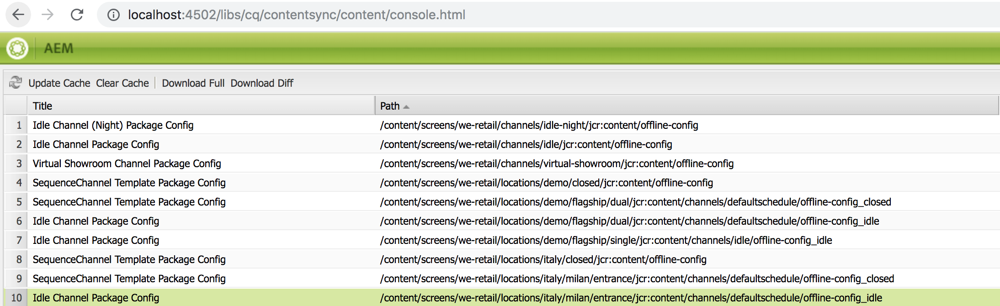

# Umstellung von ContentSync auf SmartSync{#transitioning-from-contentsync-to-smartsync}

In diesem Abschnitt erhalten Sie einen Überblick über die Funktion SmartSync und dazu, wie sie Lade- und Speichervorgänge auf Servern und Netzwerk-Traffic minimiert, um Kosten zu senken.

## Überblick {#overview}

SmartSync ist das neueste von AEM Screens verwendete Verfahren. Es ersetzt die aktuelle Methode zum Zwischenspeichern von Offline-Kanälen und deren Bereitstellung an den Player.

SmartSync wird sowohl Server-seitig als auch Client-seitig ausgeführt.

**Auf Server-Seite**:

* Der Inhalt der Kanäle, einschließlich Assets, wird in */var/contentsync* zwischengespeichert.
* Der Cache wird den Playern über ein Manifest zur Verfügung gestellt, das den verfügbaren Inhalt für eine Anzeige beschreibt.

**Auf Client-Seite**:

* Der Player aktualisiert seinen Inhalt auf Grundlage des oben generierten Manifests.

### Vorteile von SmartSync {#benefits-of-using-smartsync}

Die Funktion SmartSync bietet eine Reihe von Vorteilen für AEM Screens-Projekte. Sie erlaubt Folgendes:

* Deutliche Reduzierung des Netzwerk-Traffics und des Server-seitigen Speicherbedarfs
* Intelligenter Download von Assets durch den Player nur dann, wenn das Asset fehlt oder geändert wurde
* Server-seitige und Client-seitige Speicheroptimierungen

>[!NOTE]
>
>Adobe empfiehlt für AEM Screens-Projekte dringend den Einsatz von SmartSync.

## Migration von ContentSync zu SmartSync {#migrating-from-contentsync-to-smartsync}

>[!NOTE]
>
>Wenn Sie AEM 6.3 Feature Pack 5 und AEM 6.4 Feature Pack 3 bereits installiert haben, können Sie SmartSync für Assets aktivieren, um die Speichernutzung zu verbessern. Befolgen Sie den unten stehenden Abschnitt, um von ContentSync auf SmartSync zu wechseln und SmartSync so zu aktivieren.
>
>SmartSync ist für Screens-Player mit unterstützten Servern (AEM 6.4.3 FP3) verfügbar. Informationen zum Herunterladen des neuesten Players finden Sie unter [AEM Screens-Player-Downloads.](https://download.macromedia.com/screens/)

Gehen Sie wie folgt vor, um von ContentSync auf SmartSync umzusteigen, wenn Sie nicht über das neueste Feature Pack und Player (AEM 6.4 Feature Pack 3) verfügen:

1. Für die Migration von ContentSync zu SmartSync muss der ContentSync-Cache gelöscht werden, und zwar vor der Aktivierung von SmartSync.

   Navigate to the ContentSync console from your instance using the link ***http://localhost:4502/libs/cq/contentsync/content/console.html*** and click **Clear Cache**, as shown in the figure below:

   

   >[!CAUTION]
   >
   >Der gesamte Inhalts-Cache muss vor der erstmaligen Verwendung von SmartSync gelöscht werden.

1. Navigieren Sie zur Konfiguration der Adobe Experience Manager-Web-Konsole über AEM-Instanz > Hammersymbol > **Vorgänge** > **Web-Konsole**.

   

1. Die Konfiguration der Adobe Experience Manager-Web-Konsole wird geöffnet. Suchen Sie nach *offlinecontentservices*.

   Zum Durchsuchen der Eigenschaft **Screens-Offline-Inhaltsdienst** drücken Sie **Befehlstaste+F** unter **Mac** und **Strg+F** unter **Windows**.

   

1. Click **Save** to enable the **Screens Offline Content Services* ***property and hence use SmartSync for AEM Screens.
1. Nachdem Sie SmartSync aktiviert haben, müssen Sie zu Ihrem Projekt navigieren und auf **Offline-Inhalt aktualisieren** klicken *(in der Aktionsleiste)*, wie in der folgenden Abbildung dargestellt.

   

