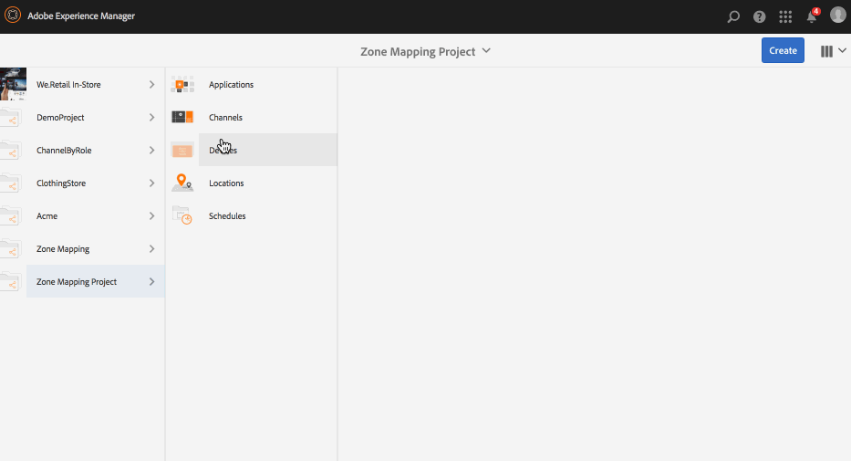
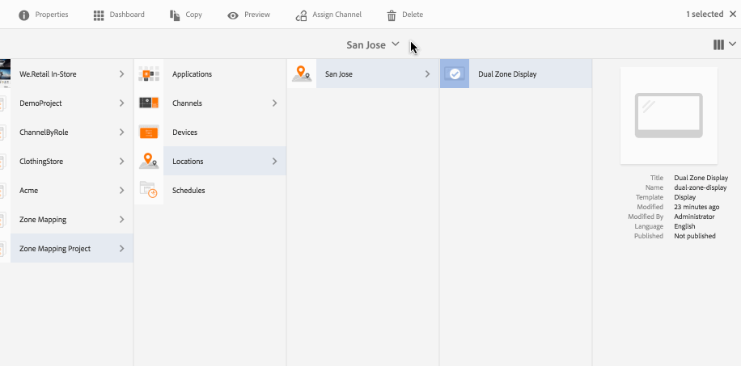

# Anzeige-Layouteditor{#display-layout-editor}

Per ***Bereichszuordnung*** können Sie unterschiedliche Bereiche erstellen und verschiedene Assets wie Videos, Bilder und Text verwenden, die sich in einem einzigen Bildschirm kontextbezogen kombinieren lassen. Führen Sie Bilder, Videos und Texte zusammen und erschaffen Sie so ein intuitives und interaktives digitales Erlebnis. Abhängig von den Projektanforderungen sind ggf. mehrere Bereiche in einer Anzeige erforderlich.

Beispiel: eine Produktsequenz mit entsprechendem Social-Media-Feed, die in zwei separaten Bereichen auf einer Anzeige laufen.

## Überblick {#overview}

Beim Erstellen einer Anzeige für Ihren Kanal können Sie verschiedene Vorlagenoptionen zum Anzeigen/Verwalten der Inhalte des Kanals wählen. 

Die folgenden Vorlagen sind beim Erstellen von Anzeigebereichen verfügbar:

* 2x1
* 2x2
* 3x1
* 4x1
* 5x1

Mit all diesen Vorlagen können Sie ein intuitives und interaktives Erlebnis für digitale Beschilderung schaffen, bei dem verschiedene Inhalte auf einem einzigen Bildschirm genutzt werden.

>[!NOTE]
>
>To learn in-depth about creating channels and displays, see [Managing Channels](managing-channels.md) and [Managing Displays](managing-displays.md) respectively in Authoring Screens.

## Nutzungsszenario – Beschreibung {#use-case-description}

Im Rahmen dieses Nutzungsszenarios können Sie ein AEM Screens-Projekt mit einem Kanal erstellen, das Inhalte nutzt und diese auf einem Bildschirm in mehreren Bereichen anzeigt.

>[!NOTE]
>
>Bereiche skalieren keine Inhalte. Daher muss dies geschehen, bevor Sie Inhalte in Kanäle einfügen.

### Schritte zur Projekterstellung {#steps-for-creating-a-project}

Gehen Sie wie folgt vor, um ein AEM Screens-Projekt zu erstellen, in dem Sie eine Bereichszuordnung für Ihr AEM Screens-Projekt durchführen:

1. ***Erstellen eines neuen Screens-Projekts***

   1. Wählen Sie den Adobe Experience Manager-Link (oben links) und dann Screens aus. Alternatively, you can go directly to: [http://localhost:4502/screens.html/content/screens](http://localhost:4502/screens.html/content/screens).
   1. Klicken Sie auf **Erstellen**, um ein neues Screens-Projekt zu erstellen.
   1. Wählen Sie im Assistenten **Screens-Projekt erstellen** die Option **Screens** aus und klicken Sie auf **Weiter**.
   1. Enter the title as **Demo Mapping Project** and click **Create**.
   

1. ***Erstellen eines neuen Kanal-Ordners***

   1. Navigieren Sie zum Projekt** Zonenzuordnung**.
   1. Klicken Sie in der Aktionsleiste auf **Erstellen**. Ein Assistent wird geöffnet.
   1. Choose the **Channels Folder **and click **Next**.
   1. Enter the Title as **Dual Zone **and click **Create**.
   

1. ***Erstellen eines neuen Kanals***

   1. Navigate to the **Zone Mapping Project** you created and select the Channels folder (**Dual Zone**).
   1. Klicken Sie in der Aktionsleiste auf **Erstellen**. Ein Assistent wird geöffnet.
   1. Wählen Sie „Sequenzkanal“ aus und klicken Sie auf **Weiter**.
   1. Enter the **Title** as **Left** and click **Create**.
   Erstellen Sie auf gleiche Weise einen weiteren Sequenz-Kanal **Right** im **Bereichszuordnungsprojekt**.

   

1. ***Hinzufügen von Inhalten zu den Kanälen***

   1. Navigate to the **Zone Mapping Project** you created and select the **Channel** you created.
   1. Klicken Sie in der Aktionsleiste auf **Erstellen.**
   1. The editor for the **Left** opens. Klicken Sie auf der linken Seite der Aktionsleiste auf das Symbol zum Ein-/Ausblenden des seitlichen Bedienfelds, um die Assets und Komponenten zu öffnen.
   1. Wählen Sie die Ihrem Kanal hinzuzufügenden Komponenten per Drag-and-Drop aus.
   Fügen Sie auf gleiche Weise auch Inhalte zum Kanal **Right** hinzu.

   

   >[!NOTE]
   >
   >Sie können den Inhalt der Kanäle je nach Projektanforderungen mit verschiedenen Assets (Bildern, Videos) auffüllen.

1. ***Erstellen eines neuen Orts***

   1. Navigate to the** Zone Mapping Project** and select the **Locations** folder.
   1. Klicken Sie neben dem Pluszeichen in der Aktionsleiste auf **Erstellen**. Ein Assistent wird geöffnet.
   1. Wählen Sie im Assistenten **Standort** aus und klicken Sie auf **Weiter**.
   1. Enter the **Title** for your location (enter the title as **San Jose**) and click **Create**.
   

1. ***Neue Anzeige für San Jose erstellen***

   1. Navigate to the location where you want to create your display (**Demo Mapping Project** --> **Locations** --> **San Jose**) and select **San Jose**.
   1. Klicken Sie in der Aktionsleiste auf **Erstellen**. Wählen Sie im Assistenten **Erstellen** die Option **Anzeige** aus und klicken Sie auf **Weiter**.
   1. Enter **Title** for your display location (enter the title as **Dual Zone**).
   1. Wählen Sie auf der Registerkarte **Anzeige** die Details für das Layout aus. Wählen Sie unter Auflösung die Option **Full HD** aus.
   1. Wählen Sie für **Anzahl der Geräte horizontal**** die Option „2“ aus**. Wählen Sie für **Anzahl der Geräte vertikal**** die Option „1“ aus**.
   1. Klicken Sie auf **Erstellen**.
   

1. ***Zuweisen von Kanälen***

   1. Navigate to the display from **Zone Mapping Project** --> **Locations** --> **San Jose** --> **Dual Zone Display**.
   1. Select **Dual Zone Display **and tap/click **Assign Channel** from the action bar, Or,
   1. Alternativ dazu können Sie auf **Dashboard** klicken und oben rechts im Bedienfeld **ZUGEWIESENE KANÄLE UND ZEITPLÄNE** die Option **+Kanal zuweisen** auswählen, wie in der nachfolgenden Abbildung gezeigt. **Kanalzuweisung **Dialogfeld wird angezeigt.
   1. Enter the **Channel Role** as **Zone**.
   1. Wählen Sie als Vorgehensweise für Kanal referenzieren die Option „Pfad“ aus. Select the channel folder path (**Zone Mapping Project **--> **Channels** --> **Dual Zone** ) in the Channel.
   1. Wählen Sie als **Priorität** für den Kanal **1** aus. Wählen Sie unter **Unterstützte Ereignisse** die Optionen **Erster Ladevorgang** und **Bildschirm bei Untätigkeit** aus.
   1. Klicken Sie auf **Speichern**.
   

1. ***Registrieren und Zuweisen des Geräts***

   1. Öffnen Sie ein separates Browser-Fenster. Wechseln Sie mithilfe des Webbrowsers zum Screens-Player oder starten Sie die AEM Screens-App. Wenn Sie das Gerät öffnen, können Sie sehen, dass das Gerät nicht registriert ist.
   1. From the AEM dashboard, navigate to **Zone Mapping Project** --> **Devices**.
   1. Klicken Sie in der Aktionsleiste auf „Geräte-Manager“.
   1. Klicken Sie auf **Geräteregistrierung**. Daraufhin werden die ausstehenden Geräte angezeigt.
   1. Wählen Sie das zu registrierende Gerät aus und klicken Sie auf **Gerät registrieren**.
   1. Sie müssen den Code validieren, indem Sie ihn über den Webbrowser oder den AEM Screens-Player überprüfen. Klicken Sie auf **Validieren**, um zum Bildschirm **Geräteregistrierung** zu wechseln.
   1. Enter **Title** as **Zone Device** and click **Register** and the device will be registered.
   1. Klicken Sie auf **Anzeige zuweisen**, um mit dem nächsten Schritt fortzufahren und das Gerät einer Anzeige zuzuweisen.
   1. Click **Assign Device** fand select the display path for your channel () as */content/screens/Test_Project/Locations/TestLocation/TestDisplay*. Klicken Sie auf **Zuweisen**.
   1. Klicken Sie auf **Beenden**, um den Vorgang abzuschließen. Das Gerät ist jetzt zugewiesen.
   

1. ***Erstellen einer Anzeige mit mehreren Bereichen***

   1. Navigate and select the display from **Zone Mapping Project** --> **Locations** --> **San Jose **--> **Dual Zone **display and click **Dashboard** from the action bar.
   1. Wählen Sie im Fenster **GERÄTE** das Symbol links neben **Gerätekonfiguration** Ihres Players aus und klicken Sie auf **Eigenschaften**.
   1. Navigieren Sie zur Registerkarte **Gerätekonfiguration** und füllen Sie die Felder **Zuordnung** und **Vorlage** aus. Enter *{&quot;a1&quot;:&quot;${display.channel}/left&quot;, &quot;a2&quot;: &quot;${display.channel}/right&quot;}* in the **Mapping** field and template as *grid-2x1*.
   1. Click **Save &amp; Close** and reload the player.
   >[!NOTE]
   >
   >***Grundlegendes zu Zuordnungen und Vorlagen in der Gerätekonfiguration:***
   >
   >* Die Kennungen „a1“ und „a2“ entsprechen den in der Vorlage definierten Bereichen, also „screens-zone-a1“ und „screens-zone-a2“.
   >* „${display.channel}/left“ verweist zum Einbetten im Bereich auf den Kanal, wobei „display.channel“ auf den aktuellen Kanalpfad der Anzeige verweist. Hierdurch werden die untergeordneten Elemente „left“ und „right“ des Kanals eingebettet.

   

#### Anzeigen von Inhalten im AEM Screens-Player {#viewing-content-in-aem-screens-player}

Laden Sie den AEM Screens-Player oder verwenden Sie den Webbrowser.

Sie werden feststellen, dass die Inhalte für beide Kanäle („Left“ und „Right“) im Screens-Player angezeigt werden. Die Inhalte werden als 2x1-Anzeigebereich dargestellt.

### Folgerung    {#inference}

Eine Bereichszuordnung, bei der eine der verfügbaren Vorlagen zum Erstellen von Kanälen in AEM Screens verwendet wird, ermöglicht clientseitiges Flattening. Sie können verschiedene Bereiche für Ihren Bildschirm erstellen und die Bereiche weiter mit Videos, Bildern und anderen verfügbaren Assets auffüllen.
