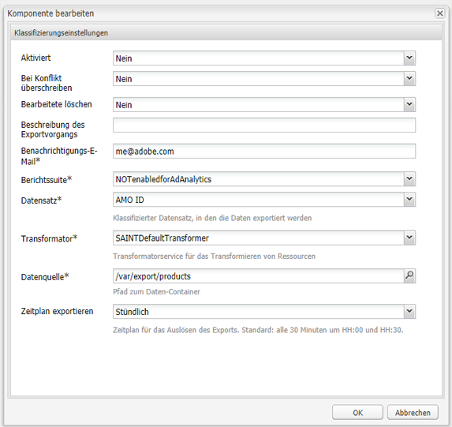

# Adobe Classifications{#adobe-classifications}

>[!CAUTION]
>
>AEM 6.4 hat das Ende der erweiterten Unterstützung erreicht und diese Dokumentation wird nicht mehr aktualisiert. Weitere Informationen finden Sie in unserer [technische Unterstützung](https://helpx.adobe.com/de/support/programs/eol-matrix.html). Unterstützte Versionen suchen [here](https://experienceleague.adobe.com/docs/?lang=de).

Adobe Classifications führt geplante Exporte von Klassifizierungsdaten in [Adobe Analytics](/help/sites-administering/adobeanalytics.md) durch. Der Ausführer führt eine **com.adobe.cq.scheduled.exporting.Exporter**.

So konfigurieren Sie Folgendes:

1. Navigieren über **Tools, Cloud Services** der **Adobe Analytics** Abschnitt.
1. Fügen Sie eine neue Konfiguration hinzu. Sie werden sehen, dass die **Adobe Analytics Classifications** Die Konfigurationsvorlage wird unter dem **Adobe Analytics Framework** Konfiguration. Bereitstellung einer **Titel** und **Name** nach Bedarf:

   

1. Klicken **Erstellen** um die Einstellungen zu konfigurieren.

   

   Die Eigenschaften umfassen Folgendes:

   | **Feld** | **Beschreibung** |
   |---|---|
   | Aktiviert | Auswählen **Ja** , um die Einstellungen für Adobe Classifications zu aktivieren. |
   | Bei Konflikt überschreiben | Auswählen **Ja** um Datenkollisionen zu überschreiben. Standardmäßig ist dies auf **Nein**. |
   | Bearbeitete löschen | Wenn auf **Ja** löscht verarbeitete Knoten, nachdem sie exportiert wurden. Der Standardwert ist **False**. |
   | Beschreibung des Exportvorgangs | Geben Sie eine Beschreibung für den Auftrag Adobe Classifications ein. |
   | Benachrichtigungs-E-Mail | Geben Sie eine E-Mail-Adresse für Adobe Classifications-Benachrichtigungen ein. |
   | Berichtssuite | Geben Sie die Report Suite ein, für die der Importauftrag ausgeführt werden soll. |
   | Datensatz | Geben Sie die Kennung der Datensatzrelation ein, für die der Importauftrag ausgeführt werden soll. |
   | Transformator | Wählen Sie aus dem Dropdown-Menü eine Transformatorimplementierung aus. |
   | Datenquelle | Navigieren Sie zum Pfad für den Datencontainer. |
   | Zeitplan exportieren | Wählen Sie den Zeitplan für den Export aus. Die Standardeinstellung ist alle 30 Minuten. |

1. Klicken **OK** , um Ihre Einstellungen zu speichern.

## Ändern der Seitengröße {#modifying-page-size}

Datensätze werden auf Seiten verarbeitet. Adobe Classifications erstellt standardmäßig Seiten mit einer Seitengröße von 1.000.

Eine Seite kann (gemäß Definition in Adobe Classifications) maximal die Größe 25.000 haben und über die Felix-Konsole geändert werden. Während des Exports sperrt Adobe Classifications den Quellknoten, um gleichzeitige Änderungen zu verhindern. Der Knoten wird nach dem Export, bei Fehlern oder beim Schließen der Sitzung entsperrt.

So ändern Sie die Seitengröße:

1. Navigieren Sie zur OSGI-Konsole unter **https://&lt;Host>:&lt;Port>/system/console/configMgr** und wählen Sie **Adobe AEM Classifications Exporter** aus.

   

1. Aktualisieren Sie die **Seitengröße exportieren** Klicken Sie nach Bedarf auf **Speichern**.

## SAINTDefaultTransformer {#saintdefaulttransformer}

>[!NOTE]
>
>Adobe Classifications wurde früher als SAINT Exporter bezeichnet.

Ein Exporter kann einen Transformator verwenden, um die Exportdaten in ein bestimmtes Format umzuwandeln. Für Adobe Classifications wird die Unterschnittstelle `SAINTTransformer<String[]>` bereitgestellt, die die Transformatorschnittstelle implementiert. Diese Schnittstelle dient dazu, den Datentyp auf den von der SAINT-API verwendeten Datentyp `String[]` zu beschränken und eine Markierungsschnittstelle für die Suche nach entsprechenden Services für die Auswahl zu erhalten.

In der Standardimplementierung (SAINTDefaultTransformer) werden die untergeordneten Ressourcen der Exporter-Quelle als Datensätze (mit Eigenschaftsnamen als Schlüssel und Eigenschaftswerten als Werte) behandelt. Die Spalte **Schlüssel** wird automatisch als erste Spalte hinzugefügt und enthält den Knotennamen. Namespace-Eigenschaften (enthalten :) werden nicht berücksichtigt.

*Knotenstruktur:*

* ID-Klassifikation `nt:unstructured`

   * 1 `nt:unstructured`

      * Produkt = Eigener Produktname (Zeichenfolge)
      * Preis = 120,90 (String)
      * Größe = M (Zeichenfolge)
      * Farbe = schwarz (Zeichenfolge)
      * Color^Code = 101 (String)

**SAINT-Kopfzeile und -Datensatz:**

| **Schlüssel** | **Produkt** | **Preis** | **Größe** | **Farbe** | **Farb-Code** |
|---|---|---|---|---|---|
| 1 | Mein Produktname | 120,90 | M | schwarz | 101 |

Die Eigenschaften umfassen Folgendes:

<table> 
 <tbody> 
  <tr> 
   <td><strong>Eigenschaftspfad</strong></td> 
   <td><strong>Beschreibung</strong></td> 
  </tr> 
  <tr> 
   <td>Transformator</td> 
   <td>Klassenname einer SAINTTransformer-Implementierung</td> 
  </tr> 
  <tr> 
   <td>email</td> 
   <td>Benachrichtigungs-E-Mail-Adresse.</td> 
  </tr> 
  <tr> 
   <td>reportsuites</td> 
   <td>Report Suite-IDs, für die der Importauftrag ausgeführt werden soll. </td> 
  </tr> 
  <tr> 
   <td>dataset</td> 
   <td>Datensatzrelations-ID, für die der Importauftrag ausgeführt werden soll. </td> 
  </tr> 
  <tr> 
   <td>description</td> 
   <td>Auftragsbeschreibung.   </td> 
  </tr> 
  <tr> 
   <td>Überschreiben</td> 
   <td>Flag zum Überschreiben von Datenkollisionen. Der Standardwert ist <strong>false</strong>.</td> 
  </tr> 
  <tr> 
   <td>Checkdivisionen</td> 
   <td>Flag zur Überprüfung der Kompatibilität von Report Suites. Der Standardwert ist <strong>true</strong>.</td> 
  </tr> 
  <tr> 
   <td>deleteprocessed</td> 
   <td>Flag zum Löschen der verarbeiteten Knoten nach dem Export. Der Standardwert ist <strong>false</strong>.</td> 
  </tr> 
 </tbody> 
</table>

## Automatisieren des Adobe Classifications-Exports {#automating-adobe-classifications-export}

Sie können einen eigenen Workflow erstellen, sodass bei jedem neuen Import der Workflow gestartet wird, um die entsprechenden und korrekt strukturierten Daten in **/var/export/** , damit sie in Adobe Classifications exportiert werden können.
