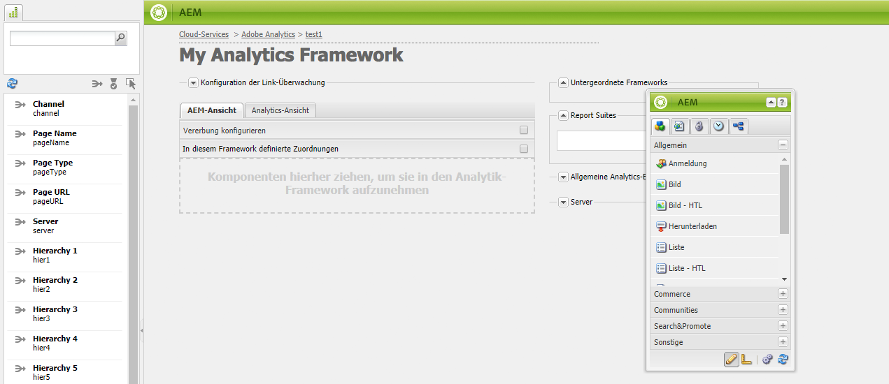
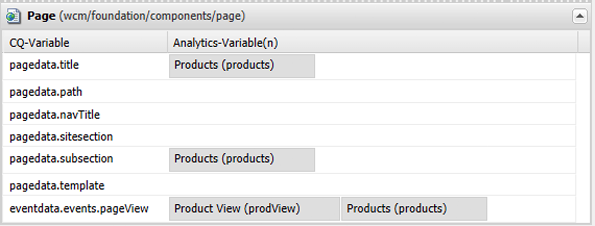
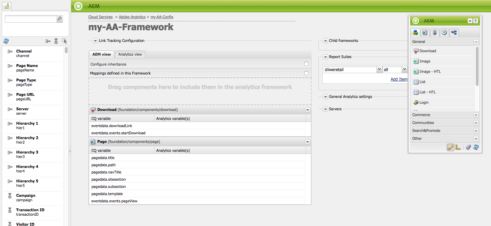

# Zuordnen von Komponentendaten zu Adobe Analytics-Eigenschaften{#mapping-component-data-with-adobe-analytics-properties}

>[!CAUTION]
>
>AEM 6.4 hat das Ende der erweiterten Unterstützung erreicht und diese Dokumentation wird nicht mehr aktualisiert. Weitere Informationen finden Sie in unserer [technische Unterstützung](https://helpx.adobe.com/de/support/programs/eol-matrix.html). Unterstützte Versionen suchen [here](https://experienceleague.adobe.com/docs/?lang=de).

Fügen Sie Komponenten zum Framework hinzu, die die Daten erfassen, die an Adobe Analytics gesendet werden sollen. Komponenten, die zum Sammeln von Analysedaten entwickelt wurden, speichern die Daten in den entsprechenden **CQ-Variable**. Wenn Sie solch eine Komponente zu einem Framework hinzufügen, zeigt das Framework die Liste der CQ-Variablen an, sodass Sie jede Variable der entsprechenden **Analytics-Variablen** zuordnen können.

Wenn die **AEM-Ansicht** geöffnet ist, werden die Analytics-Variablen im Content Finder angezeigt.

Sie können auch mehrere Analytics-Variablen derselben **CQ-Variablen** zuordnen.

Die zugeordneten Daten werden an Adobe Analytics gesendet, wenn die Seite geladen wird und die folgenden Bedingungen erfüllt sind:

* Die Seite ist mit dem Framework verknüpft.
* Die Seite verwendet die Komponenten, die dem Framework hinzugefügt werden.

Mit der folgenden Vorgehensweise können Sie Variablen von CQ-Komponenten den Eigenschaften von Adobe Analytics-Berichten zuordnen.

1. Ziehen Sie in der **AEM-Ansicht** eine Tracking-Komponente vom Sidekick auf das Framework. Wählen Sie z. B. die Komponente **Seite** aus der Kategorie **Allgemein.**

   

   Es gibt mehrere Standard-Komponentengruppen: **Allgemein**, **Commerce**, **Communities** und **Andere**. Je nach Konfiguration zeigt Ihre AEM-Instanz möglicherweise andere Gruppen und Komponenten an.

1. Um Adobe Analytics-Variablen den Variablen zuzuordnen, die in der Komponente definiert sind, ziehen Sie eine **Analytics-Variable** vom Content Finder in ein Feld auf der Tracking-Komponente. Ziehen Sie beispielsweise `Page Name (pageName)` auf `pagedata.title`.

   

   >[!NOTE]
   >
   >Die für das Framework ausgewählte Report Suite-ID (RSID) bestimmt die Adobe Analytics-Variablen, die im Content Finder angezeigt werden.

1. Wiederholen Sie die vorhergehenden beiden Schritte für andere Komponenten und Variablen.

   >[!NOTE]
   >
   >Sie können mehrere Analytics-Variablen (z. B. `events`, `props`, `eVars`) derselben CQ-Variablen (z. B. `pagedata.title`) zuordnen.

   >[!CAUTION]
   >
   >Wir empfehlen Ihnen dringend Folgendes:
   >
   >* `eVars` und `props` werden CQ-Variablen zugeordnet, die entweder mit `pagedata.X` oder mit `eventdata.X` beginnen.
   >* Ereignisse werden dagegen Variablen zugeordnet, die mit `eventdata.events.X` beginnen.

1. Um das Framework in der Veröffentlichungsinstanz Ihrer Site verfügbar zu machen, öffnen Sie die Registerkarte &quot;Seite&quot;des Sidekicks und klicken Sie auf **Framework aktivieren.**

## Zuordnen produktbezogener Variablen {#mapping-product-related-variables}

Für die Benennung produktbezogener Variablen und Ereignisse, die produktbezogenen Adobe Analytics-Eigenschaften zugeordnet werden sollen, nutzt AEM eine Konvention:

| CQ-Variable | Analytics-Variable | Beschreibung |
|---|---|---|
| `product.category` | `product.categor`y (Konversionsvariable) | Die Produktkategorie |
| `product.sku` | `product.sku` (Konversionsvariable) | Die Produkt-SKU |
| `product.quantity` | `product.quantity` (Konversionsvariable) | Die Anzahl an gekauften Produkten |
| `product.price` | `product.price` (Konversionsvariable) | Der Produktpreis |
| `product.events.*eventName*` | Die Erfolgsereignisse, die mit dem Produkt im Bericht verknüpft werden sollen. | `product.events` ist das Präfix für Ereignisse namens *eventName.* |
| `product.evars.*eVarName*` | Die Konversionsvariablen (`eVar`), die mit dem Produkt verknüpft werden sollen. | `product.evars` ist das Präfix für eVar-Variablen namens *eVarName.* |

Mehrere AEM Commerce-Komponenten nutzen diese Variablennamen.

>[!NOTE]
>
>Ordnen Sie keine Adobe Analytics-Produkteigenschaften einer CQ-Variablen zu. Die Konfiguration produktbezogener Zuordnungen, wie in der Tabelle beschrieben, entspricht der Zuordnung der Produktvariablen.

## Prüfen von Berichten in Adobe Analytics {#checking-reports-on-adobe-analytics}

1. Melden Sie sich bei Adobe Analytics mit Ihren AEM-Anmeldedaten an.
1. Stellen Sie sicher, dass Sie dieselbe RSID nutzen wie im vorherigen Schritt.
1. Wählen Sie unter **Berichte** (auf der linken Seite der Seite) die Option **Benutzerspezifische Konversion** und dann **Benutzerspezifische Konversion 1–10** aus. Wählen Sie die Variable aus, die `eVar7` entspricht.

1. Je nach genutzter Adobe Analytics-Version müssen Sie durchschnittlich 45 Minuten warten, bis der Bericht mit dem verwendeten Suchbegriff („aubergine“ im Beispiel) aktualisiert wurde.

## Verwenden des Content Finder (cf#) mit Adobe Analytics-Frameworks {#using-the-content-finder-cf-with-adobe-analytics-frameworks}

Wenn Sie ein Adobe Analytics-Framework zum ersten Mal öffnen, enthält der Content Finder vordefinierte Analytics-Variablen unter:

* Traffic

* Konversion

* Ereignisse

Wenn Sie eine RSID auswählen, werden alle zu dieser RSID gehörenden Variablen zur Liste hinzugefügt.\
`cf#` wird benötigt, um Analytics-Variablen den CQ-Variablen in den verschiedenen Tracking-Komponenten zuzuordnen. Siehe „Einrichten eines Frameworks für das grundlegende Tracking“.

Je nach für das Framework ausgewählter Ansicht enthält der Content Finder entweder Analytics-Variablen (in der AEM-Ansicht) oder CQ-Variablen (in der Analytics-Ansicht).

Die Liste kann wie folgt bearbeitet werden:

1. Wann **AEM** kann die Liste anhand der drei Filterschaltflächen nach ausgewähltem Variablentyp gefiltert werden:

   * Wenn die *Schaltfläche „Nein“* ausgewählt ist, wird die komplette Liste angezeigt.
   * Wenn die Schaltfläche **Traffic** ausgewählt ist, werden in der Liste nur die Variablen angezeigt, die zum Bereich „Traffic“ gehören
   * Wenn die Schaltfläche **Konversion** ausgewählt ist, werden in der Liste nur die Variablen angezeigt, die zum Bereich „Konversion“ gehören.
   * Wenn die Variable **Veranstaltungen** ausgewählt ist, werden in der Liste nur die Variablen angezeigt, die zum Bereich Ereignisse gehören.

   >[!NOTE]
   >
   >Sie können immer nur eine Filterschaltfläche aktivieren.

   1. Die Liste verfügt außerdem über eine Suchfunktion, mit der die Elemente nach dem im Suchfeld eingegebenen Text gefiltert werden.
   1. Wenn bei der Suche nach Elementen in der Liste eine Filteroption aktiviert ist, werden die angezeigten Ergebnisse auch nach der aktiven Schaltfläche gefiltert.
   1. Die Liste kann jederzeit mit der Schaltfläche mit den kreisförmigen Pfeilen neu geladen werden.
   1. Wenn mehrere RSIDs im Framework ausgewählt sind, werden alle Variablen in der Liste mit allen Beschriftungen angezeigt, die innerhalb der ausgewählten RSIDs verwendet werden.

1. In der Adobe Analytics-Ansicht zeigt der Content Finder alle CQ-Variablen an, die zu den Tracking-Komponenten gehören, die in die CQ-Ansicht gezogen wurden.

   * Beispiel: Wenn die **Download-Komponente **die *nur eine gezogen* in der CQ-Ansicht (die über zwei zuordnbare Variablen verfügt) *eventdata.downloadLink* und *eventdata.events.startDownload*), sieht der Content Finder beim Wechsel zur Adobe Analytics-Ansicht wie folgt aus:

   

   * Sie können die Variablen auf jede beliebige Adobe Analytics-Variable ziehen, die zu einer der drei Variablenbereiche (**Traffic**, **Konversion** und **Ereignisse**) gehört.
   * Wenn Sie in der CQ-Ansicht eine neue Tracking-Komponente auf das Framework ziehen, werden die zur Komponente gehörenden CQ-Variablen automatisch zum Content Finder (cf#) in der Adobe Analytics-Ansicht hinzugefügt.

   >[!NOTE]
   >
   >Es kann nur eine CQ-Variable gleichzeitig einer Adobe Analytics-Variablen zugeordnet werden

## Verwenden der AEM-Ansicht und der Analytics-Ansicht {#using-aem-view-and-analytics-view}

Auf einer Framework-Seite können Benutzende jederzeit zwischen zwei Ansichten der Adobe Analytics-Zuordnungen wechseln. Diese beiden Ansichten bieten mit ihren beiden unterschiedlichen Perspektiven einen besseren Überblick über die Zuordnungen im Framework.

### AEM {#aem-view}

Wenn Sie das obige Bild als Beispiel verwenden, wird das **AEM** weist die folgenden Eigenschaften auf:

1. Dies ist die Standardansicht beim Öffnen des Frameworks.
1. Linke Seite: Der Content Finder (cf#) zeigt basierend auf den ausgewählten RSIDs die Adobe Analytics-Variablen an.
1. Registerkartenkopfzeilen (**AEM-Ansicht** und **Analytics-Ansicht**): Verwenden Sie diese, um zwischen den beiden Ansichten zu wechseln.

1. **AEM-Ansicht**:

   1. Wenn das Framework Komponenten enthält, die von seinem übergeordneten Framework vererbt werden, werden sie hier aufgeführt, zusammen mit den den Komponenten zugeordneten Variablen.

      1. Vererbte Komponenten sind gesperrt.
      1. Um eine geerbte Komponente zu entsperren, doppelklicken Sie einfach auf das Vorhängeschloss neben dem Namen der Komponente
      1. Um die Vererbung wiederherzustellen, müssen Sie die entsperrte Komponente löschen. danach wird er wieder gesperrt.
   1. **Komponenten hierher ziehen, um sie in das Analytics-Framework einzuschließen**: Komponenten können aus dem Sidekick gezogen und hier abgelegt werden.
   1. Sie finden alle Komponenten, die derzeit im Analytics-Framework enthalten sind:

      1. Um eine Komponente hinzuzufügen, ziehen Sie sie aus der Registerkarte Komponenten des Sidekicks
      1. Um eine Komponente und alle zugehörigen Zuordnungen zu löschen, wählen Sie im Kontextmenü der Komponente die Option „Löschen“ und akzeptieren Sie den Löschvorgang im Bestätigungsdialogfeld.
      1. Beachten Sie, dass eine Komponente nur aus dem Framework gelöscht werden kann, in dem sie erstellt wurde, und nicht aus untergeordneten Frameworks im herkömmlichen Sinne gelöscht werden kann (sie kann nur überschrieben werden).

### Analytics-Ansicht {#analytics-view}

1. Um auf diese Ansicht zuzugreifen, wechseln Sie im Framework zur Registerkarte **Analytics-Ansicht**.
1. Linke Seite: Content Finder (cf#) wird von CQ-Variablen basierend auf den Komponenten, die in der CQ-Ansicht auf das Framework gezogen wurden, gefüllt.
1. Registerkartenkopfzeilen (**AEM-Ansicht** und **Analytics-Ansicht**): Verwenden Sie diese, um zwischen den beiden Ansichten zu wechseln.

1. In den drei Tabellen („Traffic“, „Konversion“, „Ereignis“) sind alle verfügbaren Adobe Analytics-Variablen aufgeführt, die zu den ausgewählten RSIDs gehören. Die hier gezeigten Zuordnungen sollten mit denen in der AEM übereinstimmen:

   * **Traffic**:

      * Traffic-Variable (`prop1`), die einer CQ-Variablen (`eventdata.downloadLink`) zugeordnet ist
      * Wenn neben der Komponente ein Vorhängeschloss steht, bedeutet dies, dass sie von einem übergeordneten Framework übernommen wird und daher nicht bearbeitet werden kann
   * **Konversion**:

      * Konversionsvariable (`eVar1`), die einer CQ-Variablen (`pagedata.title`) zugeordnet ist
      * Konversionsvariable (`eVar3`), die einem JavaScript-Ausdruck zugeordnet ist, der inline hinzugefügt wurde (durch Doppelklicken auf das CQ-Variablen-Feld und manuelles Eingeben des Codes)
   * **Ereignis**:

      * Ereignisvariable (`event1`), die einem CQ-Ereignis (`eventdata.events.pageView`) zugeordnet ist

>[!NOTE]
>
>Die Spalte &quot;CQ-Variable&quot;einer beliebigen Tabelle kann auch inline ausgefüllt werden, indem Sie auf das Feld doppelklicken und Text hinzufügen. Diese Felder akzeptieren JavaScript als Eingabe.
>
>* z. B. neben `prop3` können Sie
>* `'`* `Adobe:'+pagedata.title+':'+pagedata.sitesection`\
   >  , um den *Titel* einer Seite und ihre *sitesection* verkettet mit einem *:* (Doppelpunkt) und mit dem Präfix *Adobe* als `prop3` zu übermitteln.

>[!CAUTION]
>
>Sie können immer nur eine CQ-Variable auf einmal einer Adobe Analytics-Variable zuordnen.
