# Integrieren mit Adobe Campaign Classic{#integrating-with-adobe-campaign-classic}

>[!CAUTION]
>
>AEM 6.4 hat das Ende der erweiterten Unterstützung erreicht und diese Dokumentation wird nicht mehr aktualisiert. Weitere Informationen finden Sie in unserer [technische Unterstützung](https://helpx.adobe.com/de/support/programs/eol-matrix.html). Unterstützte Versionen suchen [here](https://experienceleague.adobe.com/docs/?lang=de).

>[!NOTE]
>
>Diese Dokumentation beschreibt die Integration von AEM mit der On-Premise-Lösung Adobe Campaign Classic. Wenn Sie Adobe Campaign Standard verwenden, lesen Sie [Integration mit Adobe Campaign Standard](/help/sites-administering/campaignstandard.md) für diese Anweisungen.

Mit Adobe Campaign können Sie Inhalte und Formulare für den E-Mail-Versand direkt in Adobe Experience Manager verwalten.

Um beide Lösungen gleichzeitig zu verwenden, müssen Sie sie zunächst so konfigurieren, dass eine Verbindung zueinander hergestellt wird. Dies umfasst Konfigurationsschritte sowohl in Adobe Campaign als auch in Adobe Experience Manager. Diese Schritte werden in diesem Dokument ausführlich beschrieben.

Das Arbeiten mit Adobe Campaign in AEM bietet die Möglichkeit, E-Mails über Adobe Campaign zu versenden. Eine Beschreibung finden Sie unter [Arbeiten mit Adobe Campaign](/help/sites-authoring/campaign.md). Dazu gehört auch die Verwendung von Formularen auf AEM Seiten zur Bearbeitung von Daten.

Des Weiteren sind unter Umständen die folgenden Themen relevant, wenn Sie AEM mit [Adobe Campaign](https://helpx.adobe.com/de/support/campaign/classic.html) integrieren:

* [Best Practices für E-Mail-Vorlagen](/help/sites-administering/best-practices-for-email-templates.md)
* [Fehlerbehebung bei der Adobe Campaign-Integration](/help/sites-administering/troubleshooting-campaignintegration.md)

Hinsichtlich der Erweiterung einer Adobe Campaign-Integration sind folgende Seiten empfehlenswert:

* [Erstellen benutzerspezifischer Erweiterungen](/help/sites-developing/extending-campaign-extensions.md)
* [Erstellen benutzerdefinierter Formularzuordnungen](/help/sites-developing/extending-campaign-form-mapping.md)

## Integrations-Workflow für AEM und Adobe Campaign {#aem-and-adobe-campaign-integration-workflow}

In diesem Abschnitt wird ein typischer Workflow zwischen AEM und Adobe Campaign bei der Erstellung von Kampagnen und der Bereitstellung von Inhalten beschrieben.

Der typische Workflow umfasst Folgendes und wird detailliert beschrieben:

1. Beginnen Sie mit der Erstellung Ihrer Kampagne (sowohl in Adobe Campaign als auch AEM).
1. Bevor Sie Inhalt und Versand verknüpfen, personalisieren Sie Ihre Inhalte in AEM und erstellen Sie einen Versand in Adobe Campaign.
1. Verknüpfen Sie Inhalt und Bereitstellung in Adobe Campaign.

### Kampagnenerstellung starten {#start-building-your-campaign}

Sie beginnen jederzeit mit der Erstellung einer Kampagne. Bevor Sie den Inhalt verknüpfen, sind AEM und Benutzerkontensteuerung unabhängig. Dies bedeutet, dass Marketingexperten ihre Kampagnen und Targeting in Adobe Campaign erstellen können, während Inhaltsersteller an dem Design in AEM arbeiten.

### Vor der Verknüpfung von Inhalt und Versand {#before-linking-content-and-delivery}

Bevor Sie den Inhalt verknüpfen und einen Bereitstellungsmechanismus erstellen, müssen Sie Folgendes tun:

**In AEM**

* Personalisieren Sie mithilfe der Personalisierungsfelder im **Text und Personalisierung** component

**In Adobe Campaign **

* Versand erstellen **aemContent**

### Inhalt verknüpfen und Bereitstellung festlegen {#linking-content-and-setting-delivery}

Nachdem Sie den Inhalt für die Verknüpfung und Bereitstellung vorbereitet haben, bestimmen Sie genau, wie und wo Inhalte verknüpft werden sollen.

Alle diese Schritte werden in Adobe Campaign ausgeführt.

1. Geben Sie an, welche AEM Instanz verwendet werden soll.
1. Synchronisieren Sie den Inhalt, indem Sie auf die Schaltfläche Synchronisieren klicken.
1. Öffnen Sie die Inhaltsauswahl, um Ihren Inhalt auszuwählen.

### Wenn Sie neu bei AEM sind {#if-you-are-new-to-aem}

Wenn Sie AEM sind, sind die folgenden Links hilfreich, um AEM zu verstehen:

* [Starten von AEM](/help/sites-deploying/deploy.md)
* [Verstehen von Replikationsagenten](/help/sites-deploying/replication.md)
* [Suchen von und Arbeiten mit Protokolldateien](/help/sites-deploying/monitoring-and-maintaining.md#working-with-audit-records-and-log-files)
* [Einführung in die AEM-Plattform](/help/sites-deploying/platform.md)

## Konfigurieren von Adobe Campaign {#configuring-adobe-campaign}

Die Konfiguration von Adobe Campaign umfasst Folgendes:

1. Installieren des AEM Integrationspakets in Adobe Campaign.
1. Konfiguration eines externen Kontos.
1. Überprüfen, ob der AEMResourceTypeFilter richtig konfiguriert ist.

Darüber hinaus können Sie erweiterte Konfigurationen vornehmen, darunter:

* Inhaltsbausteine verwalten
* Verwalten von Personalisierungsfeldern

Siehe [Erweiterte Konfigurationen](#advanced-configurations).

>[!NOTE]
>
>Für diese Vorgänge benötigen Sie die **Adminrolle** in Adobe Campaign.

### Voraussetzungen {#prerequisites}

Stellen Sie sicher, dass Sie zuvor die folgenden Elemente haben:

* [Eine AEM-Autoreninstanz](/help/sites-deploying/deploy.md#getting-started)
* [Eine AEM-Veröffentlichungsinstanz](/help/sites-deploying/deploy.md#author-and-publish-installs)
* [Eine Instanz von Adobe Campaign Classic](https://helpx.adobe.com/de/support/campaign/classic.html) – einschließlich eines Clients und eines Servers
* Internet Explorer 11

>[!NOTE]
>
>Wenn Sie eine ältere Version als Adobe Campaign Classic, Build 8640, ausführen, finden Sie weitere Informationen in der [Aktualisierungsdokumentation](https://docs.campaign.adobe.com/doc/AC6.1/de/PRO_Updating_Adobe_Campaign_Upgrading.html). Beachten Sie, dass der Client und die Datenbank auf den gleichen Build aktualisiert werden müssen.

>[!CAUTION]
>
>Die in den Abschnitten [Konfigurieren von Adobe Campaign](#configuring-adobe-campaign) und [Konfigurieren von Adobe Experience Manager](#configuring-adobe-experience-manager) erläuterten Vorgänge sind erforderlich, da sonst die Integration der Funktionen von AEM und Adobe Campaign nicht richtig funktioniert.

### Installieren von AEM-Integrationspaketen {#installing-the-aem-integration-package}

Sie müssen das **AEM-Integrationspaket** in Adobe Campaign installieren. Gehen Sie hierfür wie folgt vor:

1. Wechseln Sie zur Adobe Campaign-Instanz, mit der Sie eine Verknüpfung herstellen möchten.
1. Wählen Sie *Tools* > *Erweitert* > *Paket importieren...* aus.

   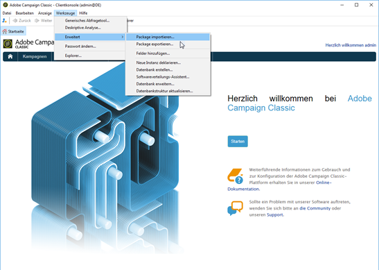

1. Klicken Sie auf **Standardpaket installieren**. Wählen Sie dann das **AEM-Integrationspaket** aus.

   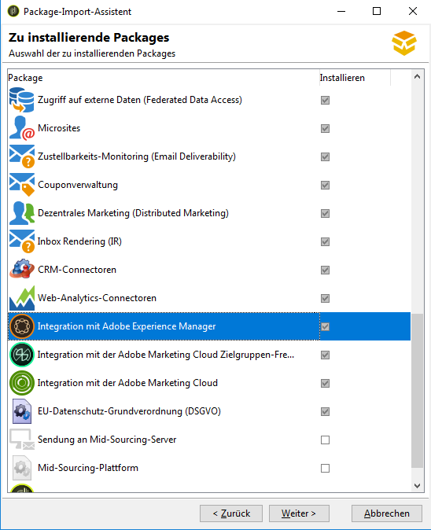

1. Klicken Sie auf **Weiter** und dann auf **Starten**.

   Dieses Paket enthält den Operator **aemserver**, der zum Verbinden des AEM-Servers mit Adobe Campaign dienen wird.

   >[!CAUTION]
   >
   >Standardmäßig ist keine Sicherheitszone für diesen Operator konfiguriert. Um über AEM eine Verbindung zu Adobe Campaign herzustellen, müssen Sie eine auswählen.
   >
   >In der Datei **serverConf.xml** muss das Attribut **allowUserPassword** der ausgewählten Sicherheitszone auf **true** festgelegt werden, um AEM zur Herstellung einer Verbindung mit Adobe Campaign per Anmeldung/Kennwort zu autorisieren.
   >
   >Wir empfehlen Ihnen dringend, eine speziell AEM zugewiesene Sicherheitszone zu erstellen, um jegliche Sicherheitsprobleme zu vermeiden. Weitere Informationen dazu finden Sie im [Installationshandbuch](https://docs.campaign.adobe.com/doc/AC/de/INS_Additional_configurations_Configuring_Campaign_server.html).

   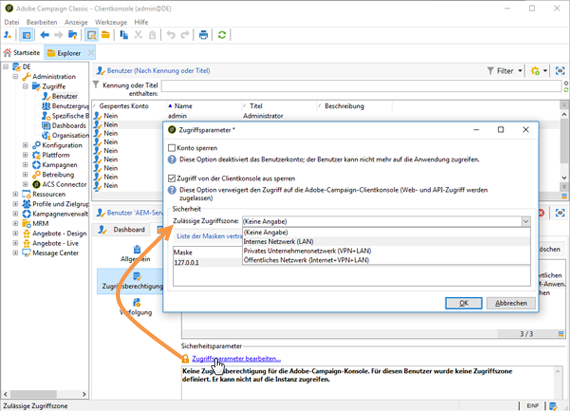

### Externes AEM-Konto konfigurieren {#configuring-an-aem-external-account}

Sie müssen ein externes Konto konfigurieren, über das Sie Adobe Campaign mit Ihrer AEM verbinden können.

>[!NOTE]
>
>* Beim Installieren des **AEM-Integrationspakets** wird ein externes AEM-Konto angelegt. Sie können die Verbindung zu Ihrer AEM-Instanz daraus konfigurieren oder eine neue erstellen.
>* Stellen Sie in AEM sicher, dass Sie das Kennwort für den Benutzer „campaign-remote“ festlegen. Sie müssen dieses Kennwort festlegen, um Adobe Campaign mit AEM zu verbinden. Melden Sie sich als Administrator an und suchen Sie in der Benutzerverwaltungskonsole nach dem Benutzer campaign-remote und klicken Sie auf **Kennwort festlegen**.
>


So konfigurieren Sie ein externes AEM:

1. Wechseln Sie zum Knoten **Administration** > **Plattform** > **Externe Konten**.
1. Erstellen Sie ein neues externes Konto und wählen Sie den **AEM**-Typ aus.
1. Geben Sie die Zugangsparameter für die AEM-Autoreninstanz ein: die Serveradresse sowie die ID und das Kennwort für die Verbindung mit dieser Instanz. Das Kennwort für das Campaign-API-Benutzerkonto entspricht dem für den Campaign-Remote-Benutzer, für den Sie in AEM ein Kennwort festlegen.

   >[!NOTE]
   >
   >Stellen Sie sicher, dass die Serveradresse **nicht** in einem Schrägstrich endet. Geben Sie beispielsweise `https://yourserver:4502` anstatt `https://yourserver:4502/` ein.

   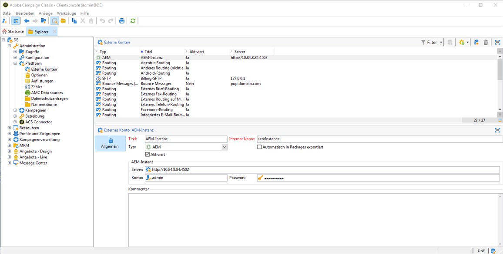 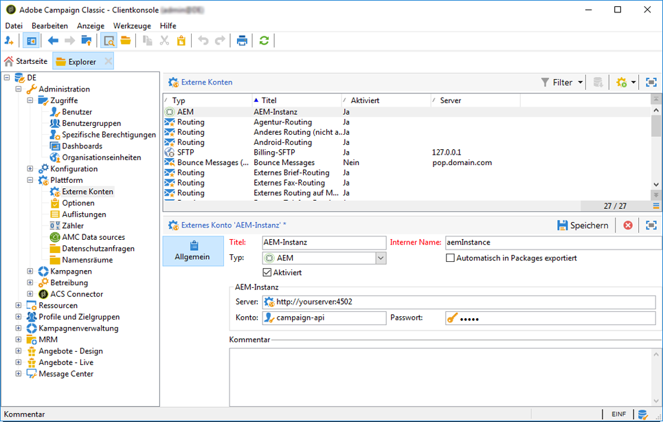

1. Stellen Sie sicher, dass das Kontrollkästchen **Aktiviert** aktiviert ist.

### Überprüfen der Option „AEMResourceTypeFilter“ {#verifying-the-aemresourcetypefilter-option}

Die Option **AEMResourceTypeFilter** wird verwendet, um Typen von AEM-Ressourcen zu filtern, die in Adobe Campaign verwendet werden können. Dadurch kann Adobe Campaign AEM Inhalte abrufen, die speziell für die Verwendung in Adobe Campaign entwickelt wurden.

Diese Option sollte vorkonfiguriert sein. Wenn Sie diese Option jedoch ändern, kann dies zu einer nicht funktionierenden Integration führen.

Überprüfen Sie wie folgt, ob die Option **AEMResourceTypeFilter** konfiguriert ist:

1. Navigieren Sie zu **Plattform** > **Optionen**.
1. Stellen Sie in der Option **AEMResourceTypeFilter** sicher, dass die Pfade korrekt sind. Dieses Feld muss den Wert enthalten:

   **mcm/campaign/components/newsletter,mcm/campaign/components/campaign_newsletterpage,mcm/neolane/components/newsletter**

   In einigen Fällen ist der Wert wie folgt:

   **mcm/campaign/components/newsletter**

   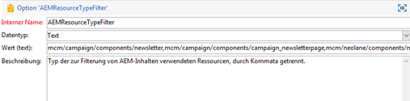

## Konfigurieren von Adobe Experience Manager {#configuring-adobe-experience-manager}

Gehen Sie wie folgt vor, um AEM zu konfigurieren:

* Konfigurieren Sie die Replikation zwischen Instanzen.
* Verbinden Sie AEM über Cloud Services mit Adobe Campaign.
* Konfigurieren Sie den Externalizer.

### Konfigurieren der Replikation zwischen AEM Instanzen {#configuring-replication-between-aem-instances}

Inhalte, die aus der AEM Authoring-Instanz erstellt wurden, werden zunächst an die Veröffentlichungsinstanz gesendet. Sie müssen eine Veröffentlichung vornehmen, damit die Bilder im Newsletter in der Veröffentlichungsinstanz verfügbar sind und den Newsletter-Empfängern zur Verfügung stehen. Der Replikationsagent muss daher so konfiguriert sein, dass er von der AEM-Autoreninstanz zur AEM-Veröffentlichungsinstanz repliziert.

>[!NOTE]
>
>Wenn Sie statt der Replikations-URL die der Öffentlichkeit zugängliche URL verwenden möchten, können Sie die **Öffentliche URL** in der folgenden Konfigurationseinstellung in OSGi festlegen (**AEM-Logo** > **Tools**-Symbol > **Vorgänge** > **Web-Konsole** > **OSGi-Konfiguration** > **AEM-Kampagnenintegration – Konfiguration**):
**Öffentliche URL:** com.day.cq.mcm.campaign.impl.IntegrationConfigImpl#aem.mcm.campaign.publicUrl

Dieser Schritt ist auch erforderlich, um bestimmte Autoreninstanzkonfigurationen in die Veröffentlichungsinstanz zu replizieren.

So konfigurieren Sie die Replikation zwischen AEM Instanzen:

1. Wählen Sie auf der Autoreninstanz **AEM-Logo** > **Tools**-Symbol > **Bereitstellung** > **Replikation** > **Agenten für Autor** aus und klicken Sie dann auf **Standardagent**.

   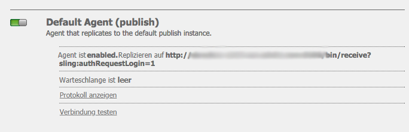

   >[!NOTE]
   Verwenden Sie nach Möglichkeit nicht localhost (eine lokale Kopie von AEM), wenn Sie die Integration mit Adobe Campaign konfigurieren, außer die Veröffentlichungs- und Autoreninstanz befinden sich auf demselben Computer.

1. Tippen oder klicken Sie auf **Bearbeiten** und wählen Sie dann die Registerkarte **Transport** aus.
1. Konfigurieren Sie den URI, indem Sie **localhost** durch die IP-Adresse oder die Adresse der AEM-Veröffentlichungsinstanz ersetzen.

   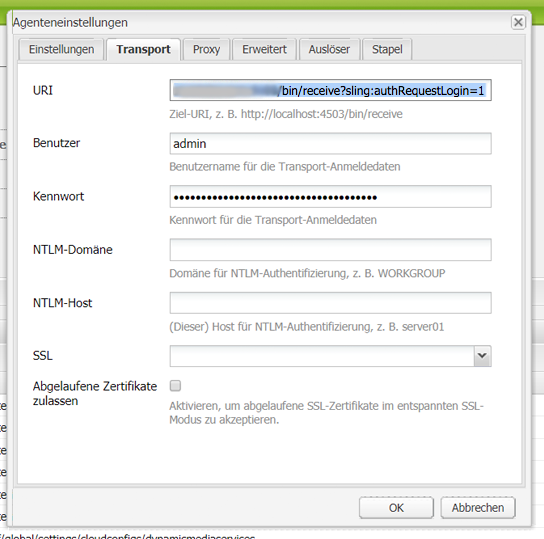

### AEM mit Adobe Campaign verbinden {#connecting-aem-to-adobe-campaign}

Bevor Sie AEM und Adobe Campaign gemeinsam verwenden können, müssen Sie die Verknüpfung zwischen beiden Lösungen herstellen, damit diese kommunizieren können.

1. Stellen Sie eine Verbindung zu Ihrer AEM Authoring-Instanz her.
1. Wählen Sie **AEM-Logo** > **Tools**-Symbol > **Bereitstellung** > **Cloud-Services** und dann im Adobe Campaign-Abschnitt **Jetzt konfigurieren** aus.

   

1. Erstellen Sie eine neue Konfiguration, indem Sie einen **Titel** eingeben und auf **Erstellen** klicken, oder wählen Sie die vorhandene Konfiguration aus, die Sie mit Ihrer Adobe Campaign-Instanz verknüpfen möchten.
1. Passen Sie die Konfiguration so an, dass sie den Parametern Ihrer Adobe Campaign-Instanz entspricht.

   * **Benutzername**: **aemserver**, der Adobe Campaign-AEM-Integrationspaketoperator, mit dem die Verknüpfung der beiden Lösungen durchgeführt wird.
   * **Passwort**: Kennwort des Adobe Campaign-aemserver-Operators. Möglicherweise müssen Sie das Kennwort für diesen Benutzer direkt in Adobe Campaign neu angeben.
   * **API-Endpunkt**: Adobe Campaign-Instanz-URL.

1. Wählen Sie **Verbindung mit Adobe Campaign herstellen** aus und klicken Sie auf **OK**.

   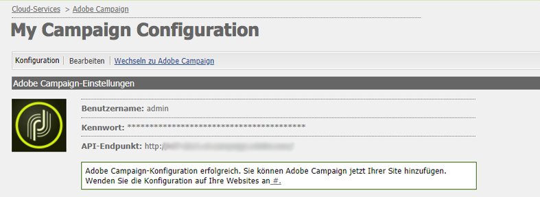

   >[!NOTE]
   Nachdem Sie [die E-Mail erstellt und veröffentlicht haben](/help/sites-authoring/campaign.md), müssen Sie die Konfiguration auf der Veröffentlichungsinstanz erneut veröffentlichen.

   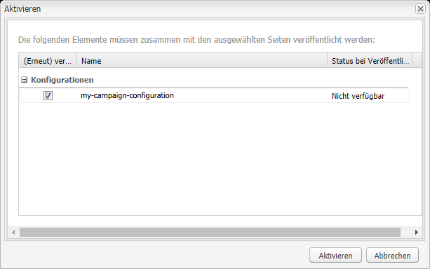

>[!NOTE]
Wenn die Verbindung fehlschlägt, überprüfen Sie Folgendes:
* Bei Verwendung einer sicheren Verbindung zu einer Adobe Campaign-Instanz (https) tritt möglicherweise ein Zertifikatproblem auf. Sie müssen das Zertifikat der Adobe Campaign-Instanz der Datei **cacerts** des JDK der AEM-Instanz hinzufügen.
* Für den [aemserver-Operator](#connecting-aem-to-adobe-campaign) muss eine Sicherheitszone in Adobe Campaign konfiguriert werden. Darüber hinaus muss das Attribut **allowUserPassword** der Sicherheitszone in der Datei **serverConf.xml** auf **true** festgelegt sein, um die AEM-Verbindung mit Adobe Campaign unter Verwendung des Anmelde-/Kennwortmodus zu autorisieren.
>
Weitere Informationen finden Sie unter [Fehlerbehebung bei der AEM/Adobe Campaign-Integration](/help/sites-administering/troubleshooting-campaignintegration.md).

### Konfigurieren des Externalizers {#configuring-the-externalizer}

Sie müssen [den Externalizer](/help/sites-developing/externalizer.md) in AEM auf der Autoreninstanz konfigurieren. Der Externalizer ist ein OSGi-Dienst, der es Ihnen ermöglicht, Ressourcenpfade in externe, absolute URLs umzuwandeln. Dieser Dienst bietet einen zentralen Ort, um diese externen URLs zu konfigurieren und zu erstellen.

Allgemeine Anweisungen finden Sie unter [Konfigurieren des Externalizers](/help/sites-developing/externalizer.md). Für die Adobe Campaign-Integration muss der Veröffentlichungsserver unter `https://<host>:<port>/system/console/configMgr/com.day.cq.commons.impl.ExternalizerImpl` so konfiguriert werden, dass er nicht auf `localhost:4503` verweist, sondern auf einen Server, der von der Adobe Campaign-Konsole erreichbar ist.

Wenn er auf `localhost:4503` oder einen anderen Server, den Adobe Campaign nicht erreichen kann, verweist, werden Ihre Bilder auf der Adobe Campaign-Konsole nicht angezeigt.


## Erweiterte Konfigurationen {#advanced-configurations}

Sie können auch einige erweiterte Konfigurationen durchführen:

* Verwalten Sie Personalisierungsfelder und -bausteine.
* Gestaltungsbausteine deaktivieren.
* Verwalten von Zielerweiterungsdaten.

### Verwalten von Personalisierungsfeldern und -bausteinen {#managing-personalization-fields-and-blocks}

Die Felder und Bausteine, die zum Hinzufügen von Personalisierung zu E-Mail-Inhalten in AEM verfügbar sind, werden von Adobe Campaign verwaltet.

Eine Standardliste wird bereitgestellt, kann jedoch geändert werden. Sie können auch Personalisierungsfelder und -bausteine hinzufügen oder ausblenden.

#### Personalisierungsfeld hinzufügen {#adding-a-personalization-field}

Zum Hinzufügen eines neuen Personalisierungsfelds zu den bereits verfügbaren Personalisierungsfeldern müssen Sie das Adobe Campaign-Schema **nms:seedMember** folgendermaßen erweitern:

>[!CAUTION]
Das Feld, das Sie hinzufügen müssen, muss bereits über eine Empfängerschemaerweiterung hinzugefügt worden sein (**nms:recipient**). Weitere Informationen finden Sie im [Konfigurationshandbuch](https://docs.campaign.adobe.com/doc/AC6.1/de/CFG_Editing_schemas_Editing_schemas.html).

1. Wechseln Sie zum Knoten **Administration** > **Konfiguration** > **Datenschemata** in der Adobe Campaign-Navigation.
1. Wählen Sie **Neu** aus.

   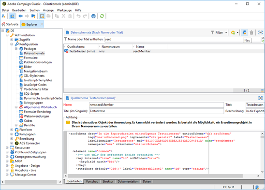

1. Wählen Sie im Popup-Fenster die Option **Daten in der Tabelle mithilfe eines Erweiterungsschemas erweitern** aus. Klicken Sie dann auf **Weiter**.

   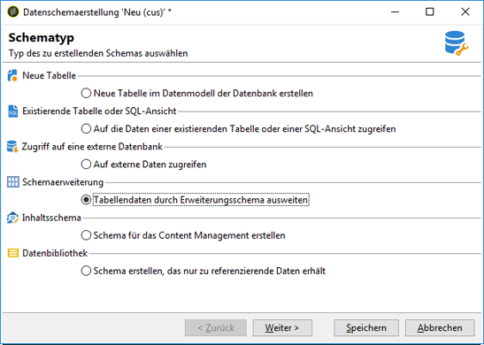

1. Geben Sie die verschiedenen Parameter des erweiterten Schemas ein:

   * **Schema**: Wählen Sie das Schema **nms:seedMember** aus. Die anderen Felder im Fenster werden automatisch ausgefüllt.
   * **Namespace**: den Namespace des erweiterten Schemas personalisieren.

1. Bearbeiten Sie den XML-Code des Schemas, um das Feld anzugeben, das Sie dort hinzufügen möchten. Weitere Informationen zu Erweiterungsschemata in Adobe Campaign finden Sie im [Konfigurationshandbuch](https://docs.campaign.adobe.com/doc/AC6.1/de/CFG_Editing_schemas_Extending_a_schema.html).
1. Speichern Sie das Schema und aktualisieren Sie dann die Adobe Campaign-Datenbankstruktur im Menü **Tools** > **Erweitert** > **Datenbankstruktur aktualisieren** der Konsole.
1. Trennen Sie die Verbindung mit der Adobe Campaign-Konsole und stellen Sie die Verbindung wieder her, um die Änderungen zu speichern. Das neue Feld wird nun in der Liste der in AEM verfügbaren Personalisierungsfelder angezeigt.

#### Beispiel {#example}

Zum Hinzufügen eines Felds **Registrierungsnummer** müssen Sie über die folgenden Elemente verfügen:

* Die Erweiterung **cus:recipient** des Schemas **nms:recipient** beinhaltet:

```xml
<element desc="Recipient table (profiles)" img="nms:recipient.png" label="Recipients" labelSingular="Recipient" name="recipient">

  <attribute dataPolicy="smartCase" desc="Recipient registration number" 
  label="Registration Number"
  length="50" name="registrationNumber" type="string"/>

</element>
```

Die Erweiterung **cus:seedMember** des Schemas **nms:seedMember** beinhaltet:

```xml
<element desc="Seed to insert in the export files" img="nms:unknownad.png" label="Seed addresses" labelSingular="Seed" name="seedMember">

  <element name="custom_nms_recipient">
    <attribute name="registrationNumber" 
    template="cus:recipient:recipient/@registrationNumber"/>
  </element>

</element>
```

Das Feld **Registrierungsnummer** ist nun Bestandteil der verfügbaren Personalisierungsfelder:


#### Ausblenden eines Personalisierungsfelds  {#hiding-a-personalization-field}

Zum Ausblenden eines Personalisierungsfelds unter den bereits verfügbaren Personalisierungsfeldern müssen Sie das Adobe Campaign-Schema **nms:seedMember** erweitern, wie im Abschnitt [Hinzufügen eines Personalisierungsfelds](#adding-a-personalization-field) näher beschrieben. Führen Sie die folgenden Schritte aus:

1. Kopieren Sie das Feld, das Sie aus dem Schema **nms:seedMember** in das erweiterte Schema (beispielsweise **cus:seedMember**) übernehmen möchten.
1. Fügen Sie dem Feld das XML-Attribut **advanced=&quot;true&quot;** hinzu. Es wird nicht mehr in der Liste der in AEM verfügbaren Personalisierungsfelder angezeigt.

   Um beispielsweise das Feld **Weitere Vornamen** auszublenden, muss das Schema **cud:seedMember** das folgende Element beinhalten:

   ```xml
   <element desc="Seed to insert in the export files" img="nms:unknownad.png" label="Seed addresses" labelSingular="Seed" name="seedMember">
   
     <element name="custom_nms_recipient">
       <attribute advanced="true" name="middleName"/>
     </element>
   
   </element>
   ```

### Gestaltungsbaustein deaktivieren {#deactivating-a-personalization-block}

So deaktivieren Sie einen Gestaltungsbaustein unter den verfügbaren:

1. Wechseln Sie zum Knoten **Ressourcen** > **Kampagnen-Management** > **Personalisierungsblöcke** in der Adobe Campaign-Navigation.
1. Wählen Sie den Personalisierungsblock aus, den Sie in AEM deaktivieren möchten.
1. Heben Sie die Auswahl des Kontrollkästchens **In den Anpassungsmenüs sichtbar** auf und speichern Sie die Änderungen. Der Block wird nicht mehr in der Liste der Personalisierungsblöcke, die in Adobe Campaign verfügbar sind, angezeigt.

   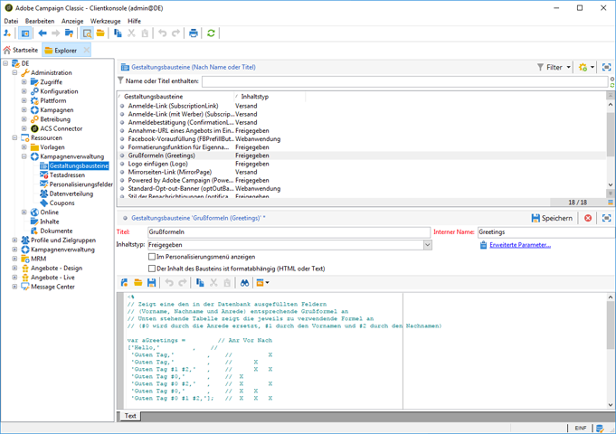

### Verwalten von Zielerweiterungsdaten {#managing-target-extension-data}

Sie können auch Zielerweiterungsdaten zur Personalisierung einfügen. Target-Erweiterungsdaten (auch &quot;Zieldaten&quot;genannt) stammen beispielsweise aus der Anreicherung oder dem Hinzufügen von Daten in einer Abfrage in einem Kampagnen-Workflow. Weitere Informationen entnehmen Sie den Abschnitten [Erstellen von Abfragen](https://docs.campaign.adobe.com/doc/AC/en/PTF_Creating_queries_About_queries_in_Campaign.html) und [Erweitern von Daten](https://docs.campaign.adobe.com/doc/AC/en/WKF_Use_cases_Enriching_data.html).

>[!NOTE]
Die Zieldaten sind nur verfügbar, wenn die AEM-Inhalte mit einer Adobe Campaign-Bereitstellung synchronisiert sind. Nähere Informationen finden Sie unter [Synchronisieren von in AEM erstellten Inhalten mit einer Bereitstellung von Adobe Campaign](/help/sites-authoring/campaign.md#synchronizing-content-created-in-aem-with-a-delivery-from-adobe-campaign-classic).


