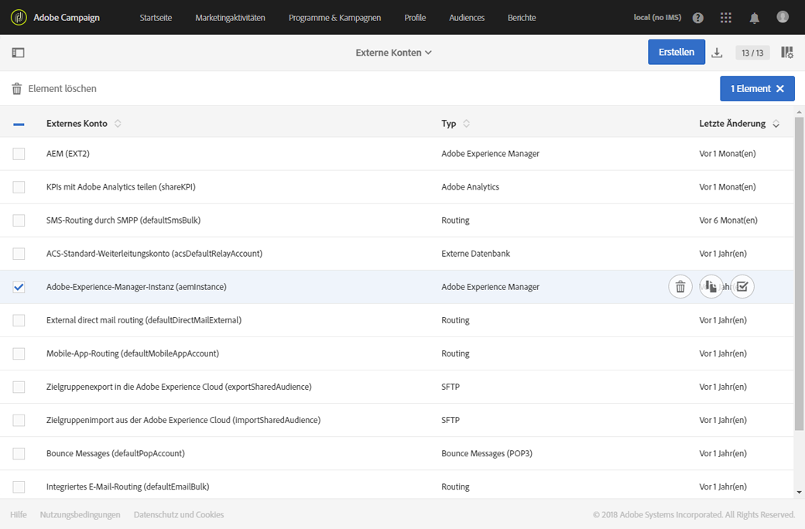
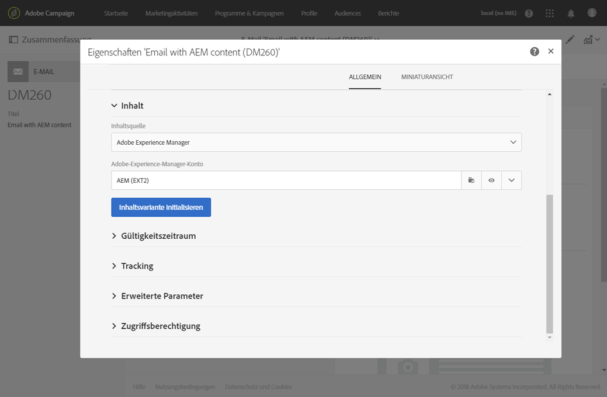
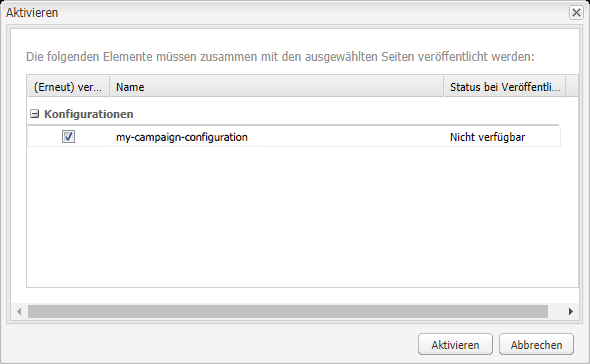

# Integrieren mit Adobe Campaign Standard{#integrating-with-adobe-campaign-standard}

>[!CAUTION]
>
>AEM 6.4 hat das Ende der erweiterten Unterstützung erreicht und diese Dokumentation wird nicht mehr aktualisiert. Weitere Informationen finden Sie in unserer [technische Unterstützung](https://helpx.adobe.com/de/support/programs/eol-matrix.html). Unterstützte Versionen suchen [here](https://experienceleague.adobe.com/docs/?lang=de).

>[!NOTE]
>
>In dieser Dokumentation wird beschrieben, wie Sie AEM mit Adobe Campaign Standard, der abonnementbasierten Lösung, integrieren. Wenn Sie Adobe Campaign 6.1 verwenden, lesen Sie [Integration mit Adobe Campaign 6.1](/help/sites-administering/campaignonpremise.md) für diese Anweisungen.

Mit Adobe Campaign können Sie Inhalte und Formulare für den E-Mail-Versand direkt in Adobe Experience Manager verwalten.

Um beide Lösungen gleichzeitig zu verwenden, müssen Sie sie zunächst so konfigurieren, dass sie miteinander verbunden werden. Dies umfasst Konfigurationsschritte sowohl in Adobe Campaign als auch in Adobe Experience Manager. Diese Schritte werden in diesem Dokument ausführlich beschrieben.

Das Arbeiten mit Adobe Campaign in AEM bietet die Möglichkeit, E-Mails und Formulare über Adobe Campaign zu senden. Eine Beschreibung finden Sie unter [Arbeiten mit Adobe Campaign](/help/sites-authoring/campaign.md).

Des Weiteren sind unter Umständen die folgenden Themen relevant, wenn Sie AEM mit [Adobe Campaign](https://docs.campaign.adobe.com/doc/standard/de/home.html) integrieren:

* [Best Practices für E-Mail-Vorlagen](/help/sites-administering/best-practices-for-email-templates.md)
* [Fehlerbehebung bei der Adobe Campaign-Integration](/help/sites-administering/troubleshooting-campaignintegration.md)

Hinsichtlich der Erweiterung einer Adobe Campaign-Integration sind folgende Seiten empfehlenswert:

* [Erstellen benutzerspezifischer Erweiterungen](/help/sites-developing/extending-campaign-extensions.md)
* [Erstellen benutzerdefinierter Formularzuordnungen](/help/sites-developing/extending-campaign-form-mapping.md)

## Konfigurieren von Adobe Campaign {#configuring-adobe-campaign}

Die Konfiguration von Adobe Campaign umfasst Folgendes:

1. Konfigurieren der **aemserver** Benutzer.
1. Erstellung eines dedizierten externen Kontos.
1. Überprüfen der Option AEMResourceTypeFilter .
1. Erstellung einer dedizierten Versandvorlage.

>[!NOTE]
>
>Für diese Vorgänge benötigen Sie die **Adminrolle** in Adobe Campaign.

### Voraussetzungen {#prerequisites}

Stellen Sie sicher, dass Sie zuvor die folgenden Elemente haben:

* [Eine AEM-Autoreninstanz](/help/sites-deploying/deploy.md#getting-started)
* [Eine AEM-Veröffentlichungsinstanz](/help/sites-deploying/deploy.md#author-and-publish-installs)
* [Eine Adobe Campaign-Instanz](https://docs.adobe.com/content/docs/de/campaign/ACS.html)

>[!CAUTION]
>
>Die in den Abschnitten [Konfigurieren von Adobe Campaign](#configuring-adobe-campaign) und [Konfigurieren von Adobe Experience Manager](#configuring-adobe-experience-manager) erläuterten Vorgänge sind erforderlich, da sonst die Integration der Funktionen von AEM und Adobe Campaign nicht richtig funktioniert.

### Konfigurieren des Benutzers „aemserver“ {#configuring-the-aemserver-user}

Der Benutzer **aemserver** muss in Adobe Campaign konfiguriert werden. **aemserver** ist ein technischer Benutzer, der zum Verbinden des AEM-Servers mit Adobe Campaign verwendet wird.

Wechseln Sie zu **Administration** > **Benutzer und Sicherheit** > **Benutzer** und wählen Sie den Benutzer **aemserver** aus. Klicken Sie darauf, um die Benutzereinstellungen zu öffnen.

* Sie müssen ein Kennwort für diesen Benutzer festlegen. Dies kann nicht über die Benutzeroberfläche erfolgen. Diese Konfiguration muss in REST von einem technischen Administrator vorgenommen werden.
* Diesem Benutzer können Sie bestimmte Rollen zuweisen, z. B. **deliveryPrepare**, die es dem Benutzer ermöglichen, Bereitstellungen zu erstellen und zu bearbeiten.

### Konfigurieren eines externen Adobe Experience Manager-Kontos {#configuring-an-adobe-experience-manager-external-account}

Sie müssen ein externes Konto konfigurieren, über das Sie Adobe Campaign mit Ihrer AEM verbinden können.

>[!NOTE]
>
>Stellen Sie in AEM sicher, dass Sie das Kennwort für den Benutzer „campaign-remote“ festlegen. Sie müssen dieses Kennwort festlegen, um Adobe Campaign mit AEM zu verbinden. Melden Sie sich als Administrator an und suchen Sie in der Benutzerverwaltungskonsole nach dem Benutzer campaign-remote und klicken Sie auf **Kennwort festlegen**.

So konfigurieren Sie ein externes AEM-Konto:

1. Wechseln Sie zu **Administration** > **Anwendungseinstellungen** > **Externe Konten**.

   

1. Wählen Sie das standardmäßige externe Konto **aemInstance** aus oder erstellen Sie ein neues, indem Sie auf die Schaltfläche **Erstellen** klicken.
1. Wählen Sie im Feld **Typ** die Option **Adobe Experience Manager** aus und geben Sie die Zugriffsparameter Ihrer AEM-Autoreninstanz ein: Server-Adresse, Kontoname und Kennwort.

   >[!NOTE]
   >
   >Hängen Sie an die URL keinen abschließenden Schrägstrich **/** an, sonst funktioniert die Verbindung nicht.

1. Das Kontrollkästchen **Aktiviert** muss aktiviert sein. Klicken Sie dann auf **Speichern**, um Ihre Änderungen zu speichern.

### Überprüfen der Option „AEMResourceTypeFilter“ {#verifying-the-aemresourcetypefilter-option}

Die Option **AEMResourceTypeFilter** wird verwendet, um Typen von AEM-Ressourcen zu filtern, die in Adobe Campaign verwendet werden können. Dadurch kann Adobe Campaign AEM Inhalte abrufen, die speziell für die Verwendung in Adobe Campaign entwickelt wurden.

Diese Option ist vorkonfiguriert. Wenn Sie diese Option jedoch ändern, kann dies zu einer nicht funktionierenden Integration führen.

So überprüfen Sie, ob die Option **AEMResourceTypeFilter** konfiguriert ist:

1. Wechseln Sie zu **Administration** > **Anwendungseinstellungen** > **Optionen**.
1. In der Liste können Sie sicherstellen, dass die Option **AEMResourceTypeFilter** aufgeführt wird und dass die Pfade korrekt sind.

### Erstellen einer AEM spezifischen E-Mail-Versandvorlage {#creating-an-aem-specific-email-delivery-template}

Die AEM-Funktion ist in den E-Mail-Vorlagen von Adobe Campaign standardmäßig deaktiviert. Sie können eine neue E-Mail-Versandvorlage konfigurieren, mit der E-Mails mit AEM Inhalt erstellt werden.

So erstellen Sie eine AEM E-Mail-Versandvorlage:

1. Navigieren Sie zu **Ressourcen** > **Vorlagen** > **Versandvorlagen**.
1. **Aktivieren Sie die Auswahl**, indem Sie in der Aktionsleiste auf das Häkchen klicken und die vorhandene Standardvorlage **Standard-E-Mail** auswählen. Duplizieren Sie sie dann, indem Sie auf das Symbol **Kopieren** und dann auf **Bestätigen** klicken.
1. Deaktivieren Sie den Auswahlmodus, indem Sie auf das **x** klicken, und öffnen Sie die neu erstellte Vorlage **Kopie von Standard-E-Mail**. Wählen Sie dann in der Aktionsleiste des Vorlagen-Dashboards die Option **Eigenschaften bearbeiten** aus.

   Sie können die **Beschriftung** der Vorlage ändern.

1. In den Eigenschaften **Inhalt** ändern Sie die **Inhaltsquelle** nach **Adobe Experience Manager**. Wählen Sie dann das zuvor erstellte externe Konto aus und klicken Sie auf **Bestätigen**.

   Speichern Sie Ihre Änderungen, indem Sie auf **Bestätigen** und anschließend auf **Speichern** klicken.

   Für die aus dieser Vorlage erstellten E-Mail-Bereitstellungen ist die AEM-Inhaltsfunktion aktiviert.

   

## Konfigurieren von Adobe Experience Manager {#configuring-adobe-experience-manager}

Gehen Sie wie folgt vor, um AEM zu konfigurieren:

* Konfigurieren Sie die Replikation zwischen Instanzen.
* Verbinden Sie AEM mit Adobe Campaign.
* Konfigurieren Sie den Externalizer.

### Konfigurieren der Replikation zwischen AEM Instanzen {#configuring-replication-between-aem-instances}

Inhalte, die aus der AEM Authoring-Instanz erstellt wurden, werden zunächst an die Veröffentlichungsinstanz gesendet. Diese Veröffentlichungsinstanz überträgt dann den Inhalt an Adobe Campaign. Der Replikationsagent muss daher so konfiguriert sein, dass er von der AEM-Autoreninstanz zur AEM-Veröffentlichungsinstanz repliziert.

>[!NOTE]
>
>Wenn Sie nicht die Replikations-URL, sondern stattdessen die öffentlich zugängliche URL verwenden möchten, können Sie die **Öffentliche URL** in der folgenden Konfigurationseinstellung im OSGi (**Instrumente** > **Web-Konsole** > **OSGi-Konfiguration > AEM Campaign-Integration - Konfiguration**):
**Öffentliche URL:** com.day.cq.mcm.campaign.impl.IntegrationConfigImpl#aem.mcm.campaign.publicUrl

Dieser Schritt ist auch erforderlich, um bestimmte Autoreninstanzkonfigurationen in die Veröffentlichungsinstanz zu replizieren.

So konfigurieren Sie die Replikation zwischen AEM Instanzen:

1. Wählen Sie in der Authoring-Instanz **AEM**> **Tools **Symbol > **Implementierung** > **Replikation** > **Agenten für Autor** Klicken Sie auf **Standardagent**.

   

   >[!NOTE]
   Verwenden Sie nach Möglichkeit nicht localhost (eine lokale Kopie von AEM), wenn Sie die Integration mit Adobe Campaign konfigurieren, außer die Veröffentlichungs- und Autoreninstanz befinden sich auf demselben Computer.

1. Klicken Sie auf **Bearbeiten** und wählen Sie dann die Registerkarte **Transport** aus.
1. Konfigurieren Sie den URI, indem Sie **localhost** durch die IP-Adresse oder die Adresse der AEM-Veröffentlichungsinstanz ersetzen.

   

### AEM mit Adobe Campaign verbinden {#connecting-aem-to-adobe-campaign}

Bevor Sie AEM und Adobe Campaign gemeinsam verwenden können, müssen Sie die Verknüpfung zwischen beiden Lösungen herstellen, damit diese kommunizieren können.

1. Stellen Sie eine Verbindung zu Ihrer AEM Authoring-Instanz her.
1. Wählen Sie **Tools** > **Vorgänge** > **Cloud** > **Cloud-Services** und dann im Adobe Campaign-Abschnitt die Option **Jetzt konfigurieren** aus.

   

1. Erstellen Sie eine neue Konfiguration, indem Sie einen **Titel** eingeben und auf **Erstellen** klicken, oder wählen Sie die vorhandene Konfiguration aus, die Sie mit Ihrer Adobe Campaign-Instanz verknüpfen möchten.
1. Passen Sie die Konfiguration so an, dass sie den Parametern Ihrer Adobe Campaign-Instanz entspricht.

   * **Benutzername**: **aemserver**, der Adobe Campaign-AEM-Integrationspaketoperator, mit dem die Verknüpfung der beiden Lösungen durchgeführt wird.
   * **Passwort**: Kennwort des Adobe Campaign-aemserver-Operators. Möglicherweise müssen Sie das Kennwort für diesen Benutzer direkt in Adobe Campaign neu angeben.
   * **API-Endpunkt**: Adobe Campaign-Instanz-URL.

1. Wählen Sie **Verbindung mit Adobe Campaign herstellen** aus und klicken Sie auf **OK**.

   

   >[!NOTE]
   Nachdem Sie [die E-Mail erstellt und veröffentlicht haben](/help/sites-authoring/campaign.md), müssen Sie die Konfiguration auf der Veröffentlichungsinstanz erneut veröffentlichen.

   

>[!NOTE]
Wenn die Verbindung fehlschlägt, überprüfen Sie Folgendes:
* Bei Verwendung einer sicheren Verbindung zu einer Adobe Campaign-Instanz (https) tritt möglicherweise ein Zertifikatproblem auf. Sie müssen der Datei **cacerts** Ihres JDK das Zertifikat der Adobe Campaign-Instanz hinzufügen.
* Weitere Informationen finden Sie unter [Fehlerbehebung bei der AEM/Adobe Campaign-Integration](/help/sites-administering/troubleshooting-campaignintegration.md).
>

### Konfigurieren des Externalizers {#configuring-the-externalizer}

Sie müssen [den Externalizer](/help/sites-developing/externalizer.md) in AEM auf der Autoreninstanz konfigurieren. Der Externalizer ist ein OSGi-Dienst, der es Ihnen ermöglicht, Ressourcenpfade in externe, absolute URLs umzuwandeln. Dieser Dienst bietet einen zentralen Ort, um diese externen URLs zu konfigurieren und zu erstellen.

Allgemeine Anweisungen finden Sie unter [Konfigurieren des Externalizers](/help/sites-developing/externalizer.md). Für die Adobe Campaign-Integration muss der Veröffentlichungsserver unter `https://<host>:<port>/system/console/configMgr/com.day.cq.commons.impl.ExternalizerImpl` so konfiguriert werden, dass er nicht auf `localhost:4503` verweist, sondern auf einen Server, der von der Adobe Campaign-Konsole erreichbar ist.

Wenn er auf `localhost:4503` oder einen anderen Server verweist, den Adobe Campaign nicht erreichen kann, werden Ihre Bilder auf der Adobe Campaign-Konsole nicht angezeigt.

