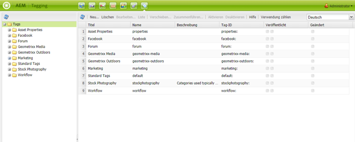

# Tagging-Konsole der klassischen Benutzeroberfläche{#classic-ui-tagging-console}

>[!CAUTION]
>
>AEM 6.4 hat das Ende der erweiterten Unterstützung erreicht und diese Dokumentation wird nicht mehr aktualisiert. Weitere Informationen finden Sie in unserer [technische Unterstützung](https://helpx.adobe.com/de/support/programs/eol-matrix.html). Unterstützte Versionen suchen [here](https://experienceleague.adobe.com/docs/?lang=de).

Dieser Abschnitt richtet sich an die Tagging-Konsole der klassischen Benutzeroberfläche.

Die Tagging-Konsole der Touch-optimierten Benutzeroberfläche ist [here](/help/sites-administering/tags.md#tagging-console).

So greifen Sie auf die Tagging-Konsole der klassischen Benutzeroberfläche zu:

* in der Autoreninstanz
* Anmelden mit Administratorrechten
* Zur Konsole navigieren

   Beispiel: [http://localhost:4502/tagging](http://localhost:4502/tagging)

## Erstellen von Tags und Namespaces {#creating-tags-and-namespaces}

1. Je nachdem, auf welcher Ebene Sie beginnen, können Sie entweder ein Tag oder einen Namespace mit **Neu**:

   Wenn Sie **Tags** Sie können einen Namespace erstellen:

   

   Wenn Sie einen Namespace auswählen (z. B. **Demo**) können Sie ein Tag in diesem Namespace erstellen:

   

1. In beiden Fällen

   * **Titel**
(
*Erforderlich*) Den Anzeigetitel für das Tag. Auch wenn beliebige Zeichen eingegeben werden können,

      Es wird empfohlen, diese Sonderzeichen nicht zu verwenden:

      * `colon (:)` – Namespace-Trennzeichen
      * `forward slash (/)` – Trennzeichen für untergeordnete Tags

      Diese Zeichen werden möglicherweise nicht angezeigt, wenn sie eingegeben werden.

   * **Name**

      (*Erforderlich*) Der Knotenname für das Tag.

   * **Beschreibung**

      (*Optional*) Eine Beschreibung für das Tag.

   * select **Erstellen**

## Bearbeiten von Tags {#editing-tags}

1. Wählen Sie im rechten Bereich das Tag aus, das Sie bearbeiten möchten.
1. Klicken Sie auf **Bearbeiten**.
1. Sie können die **Titel** und **Beschreibung**.
1. Klicken **Speichern** , um das Dialogfeld zu schließen.

## Löschen von Tags {#deleting-tags}

1. Wählen Sie im rechten Bereich das Tag aus, das Sie löschen möchten.
1. Klicken Sie auf **Löschen**.
1. Klicken **Ja** , um das Dialogfeld zu schließen.

   Das -Tag sollte nicht mehr aufgeführt werden.

## Aktivieren und Deaktivieren von Tags {#activating-and-deactivating-tags}

1. Wählen Sie im rechten Bereich den Namespace oder das Tag aus, den/das Sie aktivieren (veröffentlichen) oder deaktivieren (Veröffentlichung rückgängig machen) möchten.
1. Klicken **Aktivieren** oder **Deaktivieren** nach Bedarf.

## Liste - zeigt, wo Tags referenziert werden {#list-showing-where-tags-are-referenced}

**Liste** öffnet ein neues Fenster, das die Pfade aller Seiten anzeigt, die das markierte Tag verwenden:

## Verschieben von Tags {#moving-tags}

Um Tag-Administratoren und -Entwickler bei der Bereinigung der Taxonomie oder dem Umbenennen einer Tag-ID zu unterstützen, ist es möglich, ein Tag an einen neuen Speicherort zu verschieben:

1. Öffnen Sie die **Tagging** Konsole.
1. Wählen Sie das Tag aus und klicken Sie auf **Verschieben...** in der oberen Symbolleiste (oder im Kontextmenü).
1. Im **Tag verschieben** Dialogfeld definieren:

   * **nach**, den Zielknoten.
   * **Umbenennen in**, den neuen Knotennamen.

1. Klicken Sie auf **Verschieben**.

Die **Tag verschieben** -Dialogfeld wie folgt aussieht:

>[!NOTE]
>
>Autoren sollten Tags nicht verschieben und auch keine Tag-ID ändern. Autoren sollten lediglich [die Tag-Titel ändern](#editing-tags), wenn dies notwendig sein sollte.

## Zusammenführen von Tags {#merging-tags}

Das Zusammenführen von Tags kann sich anbieten, wenn in einer Taxonomie Duplikate vorhanden sind. Wenn Tag A mit Tag B zusammengeführt wird, werden alle mit Tag gekennzeichneten Seiten mit Tag B gekennzeichnet, und Tag A steht Autoren nicht mehr zur Verfügung.

So führen Sie ein Tag zu einem anderen zusammen:

1. Öffnen Sie die **Tagging** Konsole.
1. Wählen Sie das Tag aus und klicken Sie auf **Zusammenführen...** in der oberen Symbolleiste (oder im Kontextmenü).
1. Im **Tag zusammenführen** Dialogfeld definieren:

   * **in**, den Zielknoten.

1. Klicken **Zusammenführen**.

Das Dialogfeld **Tag zusammenführen** hat folgende Gestalt:

## Zählung der Verwendung von Tags {#counting-usage-of-tags}

So sehen Sie, wie oft ein Tag verwendet wird:

1. Öffnen Sie die **Tagging** Konsole.
1. Klicken **Count Usage** in der oberen Symbolleiste: In der Spalte Zählung wird das Ergebnis angezeigt.

## Verwalten von Tags in verschiedenen Sprachen {#managing-tags-in-different-languages}

Die optionale Eigenschaft `title` eines Tags kann in mehrere Sprachen übersetzt werden. Tag-`titles` können dann entweder in der Benutzersprache oder in der Seitensprache angezeigt werden.

### Festlegen von Tag-Titeln in verschiedenen Sprachen {#defining-tag-titles-in-multiple-languages}

Anhand des folgenden Verfahrens wird erläutert, wie Sie den `title` des Tags **Animals** in Englisch, Deutsch und Französisch übersetzen:

1. Navigieren Sie zur **Tagging**-Konsole.
1. Bearbeiten Sie das Tag **Animals** unter **Tags** > **Bildarchiv**.
1. Fügen Sie die Übersetzungen in den folgenden Sprachen hinzu:

   * **englisch**: Tiere
   * **deutsch**: Tiere
   * **französisch**: Animaux

1. Speichern Sie die Änderungen.

Das Dialogfeld sieht wie folgt aus:

Die Tagging-Konsole verwendet die Benutzerspracheinstellung. Wenn also ein Benutzer die Sprache in den Benutzereinstellungen auf Französisch festlegt, wird für das Tag „Animal“ der Begriff „Animaux“ angezeigt.

Wie Sie dem Dialogfeld eine neue Sprache hinzufügen, erfahren Sie im Abschnitt [Hinzufügen einer neuen Sprache zum Dialogfeld „Tag bearbeiten“](/help/sites-developing/building.md#adding-a-new-language-to-the-edit-tag-dialog) des Abschnitts **Tagging für Entwickler**.

### Anzeigen von Tag-Titeln in Seiteneigenschaften in der angegebenen Sprache {#displaying-tag-titles-in-page-properties-in-a-specified-language}

Standardmäßig werden die Tag-`titles` in den Seiteneigenschaften in der Seitensprache angezeigt. Das Tag-Dialogfeld in den Seiteneigenschaften verfügt über ein Feld für die Sprache, das die Anzeige der Tag-`titles` in einer anderen Sprache ermöglicht. Das folgende Verfahren erläutert die Anzeige von Tag-`titles` auf Französisch:

1. Fügen Sie entsprechend der Anleitung im vorangehenden Abschnitt eine französische Übersetzung für das Tag **Animals** unter **Tags** > **Bildarchiv** ein.
1. Öffnen Sie die Seiteneigenschaften der Seite **Products** in der englischsprachigen Verzweigung der **Geometrixx**-Website.
1. Öffnen Sie das Dialogfeld **Tags/Keywords** (indem Sie das Pulldown-Menü rechts neben dem Anzeigebereich „Tags/Keywords“ auswählen) und wählen Sie die Sprache **Französisch** aus dem Pulldown-Menü in der unteren rechten Ecke aus.
1. Scrollen Sie mithilfe der linken oder rechten Pfeilschaltfläche nach links oder rechts, bis Sie die Registerkarte **Bildarchiv** auswählen können.

   Wählen Sie das Tag **Animals** (**Animaux**) aus und klicken Sie auf eine beliebige Stelle außerhalb des Dialogfelds, um es zu schließen, und fügen Sie das Tag den Seiteneigenschaften hinzu.

   

Standardmäßig werden die Tag-`titles` im Dialogfeld „Seiteneigenschaften“ in der Seitensprache angezeigt.

Die Sprache für das Tag wird im Allgemeinen von der Seitensprache übernommen, falls diese eingestellt ist. Wenn die [Tag-Widget](/help/sites-developing/building.md#tagging-on-the-client-side) in anderen Fällen verwendet wird (z. B. in Formularen oder Dialogfeldern), hängt die Tag-Sprache vom Kontext ab.

>[!NOTE]
>
>Die Tag-Cloud und die Meta-Schlüsselwörter in der Standard-Seitenkomponente verwenden die lokalisierten Tag-`titles` basierend auf der Seitensprache, sofern sie festgelegt ist.
