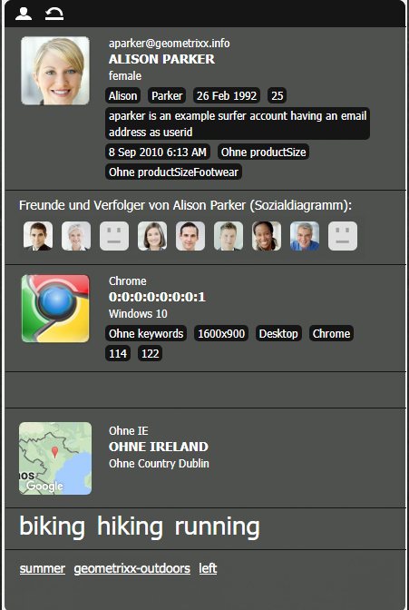
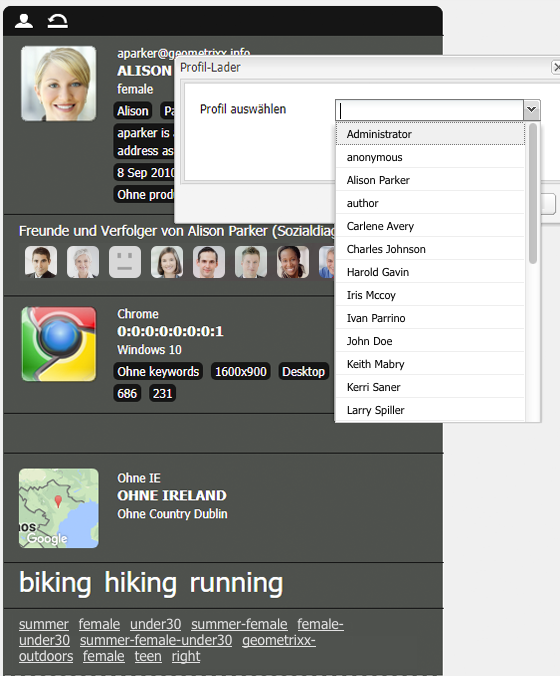
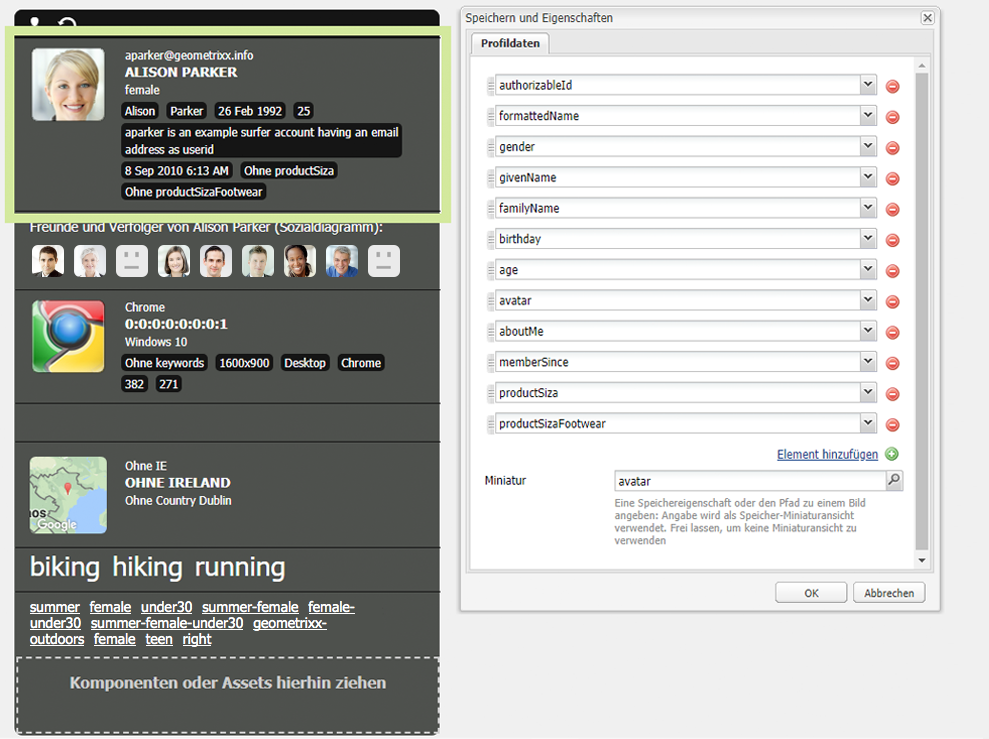
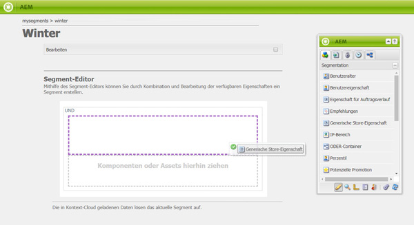

# ClientContext{#client-context}

>[!NOTE]
>
>ClientContext wurde durch ContextHub abgelöst. Weitere Informationen finden Sie in der entsprechenden [Konfigurations-](/help/sites-administering/contexthub-config.md) und [Entwicklerdokumentation](/help/sites-developing/contexthub.md).

Der Client-Kontext ist ein Mechanismus, mit dem Sie bestimmte Informationen über die aktuelle Seite und den aktuellen Besucher erhalten. It can be opened using **Ctrl-Alt-c** (windows) or **control-option-c** (Mac):

In der Veröffentlichungs- und in der Autorenumgebung werden Informationen zu Folgendem angezeigt:

* dem Besucher; abhängig von Ihrer Instanz werden bestimmte Informationen angefordert oder abgeleitet;
* Seiten-Tags und Häufigkeit, mit der der aktuelle Besucher auf diese Tags zugegriffen hat (wird beim Zeigen mit der Maus auf ein bestimmtes Tag angezeigt);
* Seiteninformationen;
* Informationen zur technischen Umgebung, z. B. IP-Adresse, Browser und Bildschirmauflösung;
* allen Segmenten, die aktuell aufgelöst werden.

Über die (nur in der Autorenumgebung verfügbaren) Symbole können Sie ClientContext-Details konfigurieren:

* **Bearbeiten** Eine neue Seite wird geöffnet. Dort können Sie [Profileigenschaften bearbeiten, hinzufügen oder entfernen](#editing-property-details).

* **Laden** Sie können [aus einer Liste von Profilen wählen und das Profil laden](#loading-a-new-user-profile), das getestet werden soll.

* **Zurücksetzen** Sie können [das Profil auf den aktuellen Benutzer zurücksetzen](#resetting-the-profile-to-the-current-user).

## Verfügbare ClientContext-Komponenten {#available-client-context-components}

ClientContext kann die folgenden Eigenschaften anzeigen ([abhängig von der mit „Bearbeiten“ getroffenen Auswahl](#adding-a-property-component)):

**Surfer-Informationen** Zeigt die folgenden clientseitigen Informationen an:

* die **IP-Adresse**
* **Suchbegriffe** , die für Suchmaschinenverweise verwendet werden
* der **verwendete Browser**
* das **Betriebssystem** , das verwendet wird
* die **Bildschirmauflösung**
* X-Position der **Maus**
* die Y **-Position der** Maus

**Aktivität Stream** : Hier erhalten Sie Informationen zur sozialen Aktivität des Benutzers auf verschiedenen Plattformen. zum Beispiel die AEM Foren, Blogs, Ratings usw.

**Kampagne** Ermöglicht es Autoren, ein bestimmtes Erlebnis für eine Kampagne zu simulieren. Diese Komponente setzt die normale Kampagnenauflösung und Erlebnisauswahl außer Kraft, um verschiedene Permutationen testen zu können.

Die Auflösung der Kampagne basiert normalerweise auf der Eigenschaft priority der Kampagne. Das Erlebnis wird im Regelfall auf Grundlage der Segmentierung ausgewählt.

**Warenkorb** zeigt Informationen zum Warenkorb einschließlich Produkteinträgen (Titel, Menge, PreisFormatiert usw.), gelöste Promotions (Titel, Nachricht usw.) und Gutscheine (Code, Beschreibung usw.).

Der Warenkorbsitzungsstore benachrichtigt mit dem ClientContextCartServlet zudem den Server über aufgelöste Promotionsänderungen (basierend auf Segmentierungsänderungen).

**Generischer Store** ist eine allgemeine Komponente, die den Inhalt eines Speichers anzeigt. Es handelt sich um eine untergeordnete Version der Komponente „Generische Store-Eigenschaften“.

Der generische Store muss mit einem JS-Renderer konfiguriert werden, der die Daten benutzerdefiniert anzeigt.

**Generische Store-Eigenschaften** ist eine allgemeine Komponente, die den Inhalt eines Stores anzeigt. Es handelt sich um eine übergeordnete Version der Komponente „Generischer Store“.

Die Komponente „Generische Store-Eigenschaften“ beinhaltet einen Standardrenderer, der die konfigurierten Eigenschaften (mit einer Miniatur) auflistet.

**Geografischer Standort** zeigt den Breiten- und Längengrad des Clients an. Über die HTML5-Geolocation-API wird der aktuelle Standort vom Browser abgefragt. Dabei wird eine Popup-Meldung angezeigt, über die der Besucher gebeten wird, seine Standortdaten freizugeben.

Bei Anzeige in der Kontext-Cloud nutzt die Komponente eine Google-API, um eine Karte als Miniatur darzustellen. Die Komponente unterliegt den [Nutzungsbeschränkungen](https://developers.google.com/maps/documentation/staticmaps/intro#Limits) der Google-API.

>[!NOTE]
>
>In AEM 6.1 bietet der Geolocation-Store nicht länger die Reverse Geocoding-Funktion. Deshalb ruf der Geolocation-Store nicht mehr Details zum aktuellen Standort ab, etwa Ortsnamen oder Ländercodes. Segmente, die diesen Store verwenden, funktionieren nicht ordnungsgemäß. Der Geolocation-Store enthält nur den Breiten- und Längengrad eines Standorts.

**JSONP Store** Eine Komponente, die Inhalte anzeigt, die von Ihrer Installation abhängig sind.

Der JSON-Standard ist eine JSON-Ergänzung, mit der dieselbe ursprüngliche Richtlinie umgangen werden kann (sodass eine Web-App mit Servern in einer anderen Domäne kommunizieren kann). Es besteht darin, das JSON-Objekt in einen Funktionsaufruf einzuschließen, um es als eine von der anderen Domäne zu laden (was eine zulässige Ausnahme von der gleichen Herkunft ist).

Der JSONP-Store ist zwar wie jeder andere Store, er lädt allerdings Informationen aus einer anderen Domäne, ohne dass für diese Informationen ein Proxy in der aktuellen Domäne benötigt wird. Siehe hierzu das Beispiel unter [Speichern von Daten in ClientContext über JSON](/help/sites-administering/client-context.md#storing-data-in-client-context-via-jsonp).

>[!NOTE]
>
>Der JSONP-Store speichert die Informationen nicht im Cookie zwischen, ruft aber die Daten bei jedem Seitenladevorgang ab.

**Profil Data** zeigt Informationen, die im Profil des Benutzers erfasst wurden. z. B. Geschlecht, Alter, E-Mail-Adresse usw.

**Gelöste Segmente** Zeigt an, welche Segmente zurzeit aufgelöst werden (häufig abhängig von anderen im Kundenkontext angezeigten Informationen). Dies ist beim Konfigurieren von Kampagnen von Interesse.

Beispiel: die Frage, ob sich die Maus aktuell im linken oder rechten Fensterbereich befindet. Dieses Segment wird hauptsächlich zum Testen verwendet, da Änderungen sofort angezeigt werden können.

**Social Graph** zeigt das soziale Diagramm der Freunde und Anhänger des Benutzers.

>[!NOTE]
>
>Dieses Feature ist derzeit als Demofunktion verfügbar und auf vorkonfigurierte Datensätze im Profilknoten unserer Demobenutzer angewiesen. Beispiel:
>
>`/home/users/geometrixx/aparker@geometrixx.info/profile` => friends-Eigenschaft

**Tag Cloud** zeigt Tags, die auf der aktuellen Seite festgelegt wurden, sowie Tags, die beim Surfen auf der Site gesammelt wurden. Wenn Sie mit der Maus auf ein Tag zeigen, sehen Sie, wie oft der aktuelle Benutzer auf Seiten mit diesem bestimmten Tag zugegriffen hat.

>[!NOTE]
Auf DAM-Assets gesetzte Tags, die auf besuchten Seiten angezeigt werden, werden nicht gezählt.

**Technographics Store** Diese Komponente ist von Ihrer Installation abhängig.

**Angezeigte Produkte** Hält die Produkte, die der Käufer angesehen hat, im Auge. Es kann das zuletzt angesehene Produkt oder das zuletzt angesehene Produkt, das sich nicht bereits im Warenkorb befindet, abgerufen werden.

Dieser Sitzungsstore verfügt über keine standardmäßige ClientContext-Komponente.

Weitere Informationen finden Sie unter [ClientContext im Detail](/help/sites-developing/client-context.md).

>[!NOTE]
Die Seitendaten sind keine Standardkomponenten in ClientContext mehr. Sie können sie ggf. hinzufügen, indem Sie ClientContext bearbeiten, die Komponente **Generische Store-Eigenschaften** hinzufügen und dann eine entsprechende Konfiguration durchführen, um den **Store** als `pagedata` zu definieren.

## Ändern des ClientContext-Profils {#changing-the-client-context-profile}

Mit ClientContext können Sie Details interaktiv verändern:

* Wenn Sie das in ClientContext verwendete Profil ändern, können Sie sehen, wie sich die Erlebnisse verschiedener Benutzer beim Anzeigen der aktuellen Seite unterscheiden.
* Abgesehen vom Ändern des Benutzerprofils können Sie auch bestimmte Profildetails ändern, um nachzuvollziehen, wie sich das Seitenerlebnis unter verschiedenen Bedingungen verändert.

### Laden neuer Benutzerprofile {#loading-a-new-user-profile}

Sie können ein Profil wie folgt ändern:

* [über das Ladesymbol oder](#loading-a-new-visitor-profile-with-the-load-profile-icon)
* [über den Auswahlregler.](#loading-a-new-user-profile-with-the-selection-slider)

Wenn Sie fertig sind, können Sie das [Profil zurücksetzen](#resetting-the-profile-to-the-current-user).

#### Laden neuer Besucherprofile mit dem Symbol „Profil laden“ {#loading-a-new-visitor-profile-with-the-load-profile-icon}

1. Klicken Sie auf das Symbol „Profil laden“:

   

1. Daraufhin wird das zugehörige Dialogfeld geöffnet. Hier können Sie das zu ladende Profil auswählen:

   

1. Klicken Sie auf **OK**, um das Profil zu laden.

#### Laden neuer Benutzerprofile mit dem Auswahlregler {#loading-a-new-user-profile-with-the-selection-slider}

Sie können ein Profil auch mit dem Auswahlregler auswählen:

1. Doppelklicken Sie auf das Symbol für den aktuellen Benutzer. Daraufhin wird die Auswahl geöffnet. Navigieren Sie mit den Pfeilen und sehen Sie sich die verfügbaren Profile an:

   

1. Klicken Sie auf das zu ladende Profil. Wenn die Details geladen wurden, klicken Sie auf eine Stelle außerhalb der Auswahl, um diese zu schließen.

#### Zurücksetzen des Profils auf den aktuellen Benutzer {#resetting-the-profile-to-the-current-user}

1. Setzen Sie das Profil in ClientContext mit dem Symbol „Zurücksetzen“ auf den aktuellen Benutzer zurück:

   

### Ändern der Browserplattform {#changing-the-browser-platform}

1. Doppelklicken Sie auf das Symbol für die Browserplattform. Daraufhin wird die Auswahl geöffnet. Navigieren Sie mit den Pfeilen und sehen Sie sich die verfügbaren Plattformen/Browser an:

   

1. Klicken Sie auf den zu ladenden Plattformbrowser. Wenn die Details geladen wurden, klicken Sie auf eine Stelle außerhalb der Auswahl, um diese zu schließen.

### Ändern der Geolocation {#changing-the-geolocation}

1. Doppelklicken Sie auf das Geolocation-Symbol. Daraufhin wird eine erweiterte Karte geöffnet. Hier können Sie die Markierung an einen neuen Standort ziehen:

   

1. Klicken Sie auf eine Stelle außerhalb der Karte, um sie zu schließen.

### Ändern der Tag-Auswahl {#changing-the-tag-selection}

1. Doppelklicken Sie auf den ClientContext-Abschnitt „Tag-Cloud“. Daraufhin wird das zugehörige Dialogfeld geöffnet. Hier können Sie Tags auswählen:

   

1. Klicken Sie auf „OK“, um Ihre Auswahl in ClientContext zu laden.

## Bearbeiten von ClientContext {#editing-the-client-context}

Mittels ClientContext-Bearbeitung können die Werte bestimmter Eigenschaften festgelegt (zurückgesetzt), neue Eigenschaften hinzugefügt oder nicht mehr benötigte Eigenschaften entfernt werden.

### Bearbeiten von Eigenschaftsdetails {#editing-property-details}

Mittels ClientContext-Bearbeitung können die Werte bestimmter Eigenschaften festgelegt (zurückgesetzt) werden. This allows you to test specific scenarios (particularly useful for [segmentation](/help/sites-administering/campaign-segmentation.md) and [campaigns](/help/sites-authoring/personalization.md)).

### Hinzufügen von Eigenschaftskomponenten {#adding-a-property-component}

After you have opened the **ClientContext design page**, you can also **Add** a completely new property using the available components (the components are listed on both the sidekick or from the **Insert New Component** dialog that is opened after a double-click on the **Drag components or assets here** box):

### Entfernen von Eigenschaftskomponenten {#removing-a-property-component}

Nach dem Öffnen der **ClientContext-Designseite** haben Sie außerdem die Möglichkeit, nicht mehr benötigte Eigenschaften zu **entfernen**, auch standardmäßig vorhandene Eigenschaften. Wurden diese entfernt, können Sie sie mit **Zurücksetzen** reaktivieren.

## Speichern von Daten in ClientContext über JSON {#storing-data-in-client-context-via-jsonp}

Folgen Sie diesem Beispiel, um die Context-Store-Komponente „JSONP-Store“ zum Hinzufügen externer Daten zu ClientContext zu verwenden. Erstellen Sie dann ein Segment basierend auf den Informationen aus diesen Daten. Im Beispiel wird der JSONP-Service von WIPmania.com verwendet. Der Service gibt Geolocation-Informationen anhand der IP-Adresse des Webclients zurück.

In diesem Beispiel wird die Beispiel-Website Geometrixx Outdoors verwendet, um auf ClientContext zuzugreifen und das erstellte Segment zu testen. Sie können eine andere Website verwenden, sofern für die Seite ClientContext aktiviert ist. (Siehe [Hinzufügen von ClientContext zu Seiten](/help/sites-developing/client-context.md#adding-client-context-to-a-page).)

### Hinzufügen der Komponente „JSONP-Store“ {#add-the-jsonp-store-component}

Fügen Sie die Komponente „JSONP-Store“ zu ClientContext hinzu und nutzen Sie diese zum Abrufen und Speichern von Geolocation-Informationen zum Webclient.

1. Öffnen Sie die englische Homepage der Geometrixx Outdoors-Site in der AEM-Autoreninstanz. ([http://localhost:4502/content/geometrixx-outdoors/en.html](http://localhost:4502/content/geometrixx-outdoors/en.html)).
1. Um den Client-Kontext zu öffnen, drücken Sie Strg-Alt-c (Fenster) oder Strg-Option-c (Mac).
1. Klicken Sie oben im ClientContext-Bereich auf das Bearbeitungssymbol, um ClientContext-Designer zu öffnen.

   

1. Ziehen Sie die Komponente „JSONP-Store“ auf ClientContext.

   

1. Doppelklicken Sie auf die Komponente, um das Bearbeitungsdialogfeld zu öffnen.
1. Geben Sie in das Feld „JSONP-Service-URL“ die folgende URL ein und klicken Sie dann auf „Store abrufen“:

   `https://api.wipmania.com/jsonp?callback=${callback}`

   Die Komponente ruft den JSONP-Service auf und führt alle Eigenschaften auf, die die zurückgegebenen Daten enthalten. Die Eigenschaften in der Liste entsprechen den in ClientContext verfügbaren Eigenschaften.

   

1. Klicken Sie auf OK.
1. Kehren Sie zur Geometrixx Outdoors-Homepage zurück und aktualisieren Sie die Seite. ClientContext umfasst nun die Informationen aus der Komponente „JSONP-Store“.

   

### Erstellen von Segmenten {#create-the-segment}

Verwenden Sie die Daten aus dem Sitzungsstore, den Sie mit der Komponente „JSONP-Store“ erstellt haben. Das Segment verwendet den Breitengrad aus dem Sitzungsstore und das aktuelle Datum, um zu bestimmen, ob am Kundenstandort Winter ist.

1. Öffnen Sie die Tools-Konsole in Ihrem Webbrowser ([http://localhost:4502/miscadmin#/etc](http://localhost:4502/miscadmin#/etc)).
1. Klicken Sie in der Ordnerstruktur auf den Ordner „Tools/Segmentation“ und dann auf „Neu“ > „Neuer Ordner“. Geben Sie die folgenden Eigenschaftswerte an und klicken Sie dann auf „Erstellen“:

   * Name: mysegments
   * Titel: My Segments

1. Wählen Sie den Ordner „My Segments“ aus und klicken Sie auf „Neu“ > „Neue Seite“:

   1. Geben Sie „Winter“ als Titel ein.
   1. Wählen Sie die Vorlage „Segment“ aus.
   1. Klicken Sie auf Erstellen.

1. Klicken Sie mit der rechten Maustaste auf das Segment „Winter“ und dann auf „Öffnen“.
1. Ziehen Sie „Generische Store-Eigenschaft“ in den standardmäßigen UND-Container.

   

1. Doppelklicken Sie auf die Komponente, um das Bearbeitungsdialogfeld zu öffnen. Geben Sie die folgenden Eigenschaftswerte an und klicken Sie dann auf „OK“:

   * Store: wipmania
   * Eigenschaftsname: Breite
   * Operator: ist größer als
   * Eigenschaftswert: 30

1. Ziehen die Komponente „Skript“ in denselben UND-Container und öffnen Sie das zugehörige Bearbeitungsdialogfeld. Fügen Sie das folgende Skript hinzu und klicken Sie dann auf „OK“:

   `3 < new Date().getMonth() < 12`

