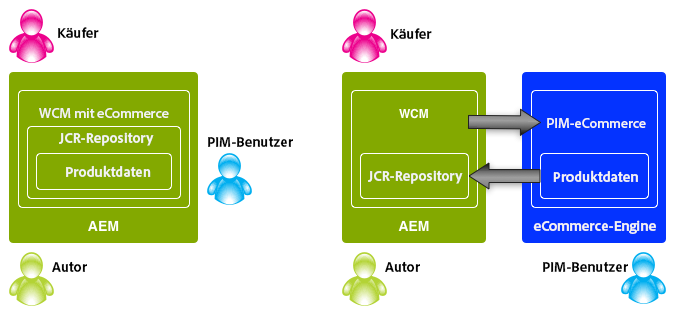

# Konzepte{#concepts}

>[!CAUTION]
>
>AEM 6.4 hat das Ende der erweiterten Unterstützung erreicht und diese Dokumentation wird nicht mehr aktualisiert. Weitere Informationen finden Sie in unserer [technische Unterstützung](https://helpx.adobe.com/de/support/programs/eol-matrix.html). Unterstützte Versionen suchen [here](https://experienceleague.adobe.com/docs/?lang=de).

Das Integrations-Framework bietet Mechanismen und Komponenten für:

* Verbindung zu einer eCommerce-Engine
* Daten in AEM abrufen
* Anzeigen dieser Daten und Erfassen der Antworten des Käufers
* Zurückgeben von Transaktionsdetails
* Suchen nach Daten beider Systeme

Das heißt:

* Käufer können sich registrieren und ohne Wartezeit einkaufen.
* Preisänderungen werden von den Käufern unverzüglich beobachtet.
* Produkte können nach Bedarf hinzugefügt werden.

>[!NOTE]
>
>Das eCommerce-Framework kann mit folgenden Funktionen verwendet werden:
>
>* [Magento](https://www.adobe.io/apis/experiencecloud/commerce-integration-framework/integrations.html#!AdobeDocs/commerce-cif-documentation/master/integrations/02-AEM-Magento.md)
>
>* [SAP Commerce Cloud](/help/sites-administering/sap-commerce-cloud.md)
>
>* [Salesforce-Commerce Cloud](https://github.com/adobe/commerce-salesforce)
>

>[!CAUTION]
>
>Das [eCommerce-Integrationsframework](https://www.adobe.com/de/solutions/web-experience-management/commerce.html) ist ein Add-on von AEM.
>
>Umfassende Informationen hierzu, passend zur entsprechenden Engine, erhalten Sie von Ihrer Ansprechperson im Vertrieb.

>[!CAUTION]
>
>Das Framework stellt die grundlegenden Voraussetzungen für Ihr eigenes Projekt bereit.
>
>Ein gewisses Maß an Entwicklungsarbeit ist immer erforderlich, um das Framework an Ihre Vorgaben anzupassen.

>[!CAUTION]
>
>Die standardmäßige AEM-Installation umfasst die allgemeine AEM (JCR) eCommerce-Implementierung.
>
>Dies ist derzeit für Demonstrationszwecke oder als Basis für eine benutzerdefinierte Implementierung gemäß Ihren Anforderungen gedacht.

Um den Betrieb zu optimieren, konzentrieren sich sowohl AEM als auch die eCommerce-Engine auf ihr eigenes Fachgebiet. Informationen werden zwischen den beiden in Echtzeit übertragen. Beispiel:

* AEM können:

   * Anfrage:

      * Produktinformationen aus der eCommerce-Engine.
   * Geben Sie Folgendes an:

      * Benutzeransichten für Produktinformationen, Warenkorb und Checkout.
      * Warenkorb und Checkout-Informationen an die eCommerce-Engine.
      * Suchmaschinenoptimierung (SEO).
      * Community-Funktionalität.
      * Unstrukturierte Marketinginteraktionen.

* Die eCommerce-Engine kann:

   * Geben Sie Folgendes an:

      * Produktinformationen aus der Datenbank.
      * Verwaltung von Produktvarianten.
      * Auftragsverwaltung.
      * Enterprise Resource Planning (ERP)
      * Suchen Sie in den Produktinformationen.
   * Prozess:

      * Der Warenkorb.
      * Der Checkout.
      * Auftragserfüllung.

>[!NOTE]
>
>Die genauen Details hängen von der eCommerce-Engine und der Projektimplementierung ab.

Eine Reihe vorkonfigurierter AEM-Komponenten wird zur Verwendung der Integrationsebene bereitgestellt. Dazu gehören derzeit:

* Produktinformationen
* Warenkorb
* Auschecken
* Mein Konto

Es stehen auch verschiedene Suchoptionen zur Verfügung.

## Architektur {#architecture}

Das Integrations-Framework stellt die API, eine Reihe von Komponenten zur Veranschaulichung der Funktionalität und mehrere Erweiterungen bereit, um Beispiele für Verbindungsmethoden bereitzustellen:

Über das Framework erhalten Sie Zugriff auf Funktionen, z. B.:

### Implementierungen {#implementations}

AEM eCommerce wird mit einer eCommerce-Engine implementiert:

* Das eCommerce-Integrations-Framework wurde entwickelt, um Ihnen die einfache Integration einer eCommerce-Engine in AEM zu ermöglichen. Die speziell entwickelte eCommerce-Engine steuert Produktdaten, Warenkörbe, Checkout und die Auftragserfüllung, während AEM die Datenanzeige und Marketingkampagnen steuert.

>[!NOTE]
>
>Die standardmäßige AEM-Installation umfasst die allgemeine AEM (JCR) eCommerce-Implementierung.
>
>Dies ist derzeit für Demonstrationszwecke oder als Basis für eine benutzerdefinierte Implementierung gemäß Ihren Anforderungen gedacht.
>
>AEM in AEM implementierter eCommerce mithilfe einer generischen, auf JCR basierenden Entwicklung lautet:
>
>* Ein eigenständiges, AEM-natives eCommerce-Beispiel zur Veranschaulichung der Verwendung der API. Damit können Produktdaten, Warenkörbe und Checkout in Verbindung mit den vorhandenen Datenanzeige- und Marketingkampagnen gesteuert werden. In diesem Fall wird die Produktdatenbank im nativen Repository von AEM gespeichert (Implementierung der Adobe von [JCR](https://www.adobe.io/experience-manager/reference-materials/spec/jcr/2.0/index.html)).\
   >  Die standardmäßige AEM-Installation enthält die Grundlagen der [generischen eCommerce-Implementierung](/help/sites-administering/generic.md).

### Commerce-Anbieter {#commerce-providers}

Beim Importieren von Daten aus einer Commerce-Engine in Ihre AEM E-Commerce-Site wird ein Commerce-Anbieter verwendet, um den Importeuren Daten bereitzustellen. Ein Commerce-Anbieter kann mehrere Importeure unterstützen.

Ein Commerce-Anbieter ist AEM Code angepasst an:

* Schnittstelle zu einer Back-End-Commerce-Engine
* ein Commerce-System über dem JCR-Repository implementieren

Derzeit stehen zwei Beispiel-Commerce-Anbieter für AEM zur Verfügung:

* ein für geometrixx-hybris
* ein anderer für geometrixx-generic (JCR)

In der Regel muss ein Projekt jedoch einen eigenen, benutzerdefinierten Commerce-Anbieter entwickeln, der für sein PIM- und Produktdatenschema spezifisch ist.

>[!NOTE]
>
>Die Geometrixx-Importeure verwenden CSV-Dateien. In den Kommentaren über ihrer Implementierung ist eine Beschreibung des akzeptierten Schemas enthalten (mit zulässigen benutzerdefinierten Eigenschaften).

Der [ProductServicesManager](https://helpx.adobe.com/experience-manager/6-4/sites/developing/using/reference-materials/javadoc/com/adobe/cq/commerce/pim/api/ProductServicesManager.html) verwaltet (über [OSGi](/help/sites-deploying/configuring.md#osgi-configuration-settings)) eine Liste der Implementierungen der [ProductImporter](https://helpx.adobe.com/experience-manager/6-4/sites/developing/using/reference-materials/javadoc/com/adobe/cq/commerce/pim/api/ProductImporter.html)- und [CatalogBlueprintImporter](https://helpx.adobe.com/experience-manager/6-4/sites/developing/using/reference-materials/javadoc/com/adobe/cq/commerce/pim/api/CatalogBlueprintImporter.html)-Schnittstelle. Diese sind im Import-Tool-Assistenten im Dropdown-Feld **Import-Tool/Commerce-Anbieter** aufgeführt (mit der Eigenschaft `commerceProvider` als Name).

Wenn ein bestimmtes Import-Tool/ein bestimmter Commerce-Anbieter im Dropdown-Feld verfügbar ist, müssen Sie alle weiteren benötigten Daten (je nach Art des Import-Tools) unter einem der folgenden Pfade definieren:

* `/apps/commerce/gui/content/catalogs/importblueprintswizard/importers`
* `/apps/commerce/gui/content/products/importproductswizard/importers`

Der Ordner unter dem entsprechenden `importers`-Ordner muss mit dem Namen des Import-Tools übereinstimmen, z. B.:

* `.../importproductswizard/importers/geometrixx/.content.xml`

Das Format der Quell-Importdatei wird vom Import-Tool definiert. Alternativ kann das Import-Tool eine Verbindung (z. B. WebDAV oder HTTP) zur Commerce-Engine herstellen.

## Rollen {#roles}

Das integrierte System ermöglicht die Pflege der Daten durch die folgenden Rollen:

* Produktdatenverwaltung (PIM)-Benutzer, der Folgendes verwaltet:

   * Produktinformationen.
   * Taxonomie, Kategorisierung, Genehmigung.
   * Interagiert mit dem digitalen Asset-Management.
   * Preise - Häufig handelt es sich dabei um ein ERP-System, das nicht explizit im Commerce-System verwaltet wird.

* Autor/Marketing-Manager, der Folgendes verwaltet:

   * Marketinginhalte für alle Kanäle.
   * Promotions.
   * Gutscheine.
   * Kampagnen.

* Surfer/Käufer, die:

   * Zeigt Ihre Produktinformationen an.
   * Setzt Artikel in den Warenkorb.
   * Checkt ihre Bestellungen aus.
   * Erwarten Sie die Erfüllung der Bestellung.

Der tatsächliche Speicherort kann von Ihrer Implementierung abhängen. Beispiel: generisch oder mit einer eCommerce-Engine:

## Produkte {#products}

### Produktdaten im Vergleich zu Marketingdaten {#product-data-versus-marketing-data}

#### Strukturelle und Marketing-Kategorien {#structural-versus-marketing-categories}

Durch die Unterscheidung der folgenden beiden Kategorien können Sie deutliche URLs mit bedeutungsvoller Struktur erstellen (Bäume von `cq:Page`-Knoten und daher sehr ähnlich der klassischen Inhaltsverwaltung in AEM):

* *Strukturelle *Kategorien

   Kategoriestruktur, die definiert, *was ein Produkt ist*; Beispiel:

   `/products/mens/shoes/sneakers`

* *Marketing*-Kategorien

   Alle anderen Kategorien, zu denen ein *Produkt gehören kann*; Beispiel:

   `/special-offers/christmas/shoes`)

### Produktdaten {#product-data}

Um Ihr Produkt zu präsentieren und zu verwalten, sollten Sie eine Reihe von Informationen über das Produkt speichern.

Produktdaten können sein:

* direkt in AEM verwaltet werden (allgemein)
* in der eCommerce-Engine verwaltet und in AEM bereitgestellt werden

   Je nach Datentyp sind die Daten [synchronisiert](#catalog-maintenance-data-synchronization), wenn erforderlich, oder direkt zugänglich. Höchst volatile und wichtige Daten wie Produktdaten werden beispielsweise bei jeder Seitenabfrage von der E-Commerce-Engine abgerufen, damit sie jederzeit aktuell sind.

Wenn die Produktdaten in AEM eingegeben/importiert wurden, können sie in den **Produkte** Konsole. Hier zeigen die Karten- und Listenansichten eines Produkts Informationen wie:

* das Bild
* der SKU-Code
* wann zuletzt geändert

### Produktvarianten {#product-variants}

Für geeignete Produkte können auch Informationen über Varianten gespeichert werden. Beispielsweise werden bei Bekleidungsartikeln die unterschiedlichen angebotenen Farben als Varianten gespeichert:

### Produktattribute {#product-attributes}

Die über die einzelnen Produkte gespeicherten Attribute können von der verwendeten eCommerce-Engine und Ihrer AEM-Implementierung abhängen. Diese sind (je nach Bedarf) beim Anzeigen von Produktseiten und/oder Bearbeiten von Produktinformationen verfügbar und können Folgendes umfassen:

* **Bild**

   Ein Bild des Produkts.

* **Titel**

   Der Produktname.

* **Beschreibung**

   Ein beschreibender Text zum Produkt.

* **Tags**

   Tags, mit denen ähnliche Produkte gruppiert werden

* **Standard-Asset-Kategorie**

   Eine Standardkategorie für Assets.

* **ERP-Daten**

   Informationen zum Enterprise Resource Planning (ERP).

   * **SKU**

      SKU-Daten

   * **Farbe**
   * **Größe**
   * **Preis**

      Der Stückpreis des Produkts.

* **Zusammenfassung**

   Eine Zusammenfassung der Produktfunktionen.

* **Funktionen**

   Umfassendere Details zu den Produktfunktionen.

### Produkt-Assets {#product-assets}

Eine Auswahl von Assets kann für einzelne Produkte gespeichert werden. Dazu gehören in der Regel Bilder und Videos.

## Kataloge {#catalogs}

Ein Katalog fasst Produktdaten zusammen, um sowohl die Verwaltung als auch die Darstellung für den Käufer zu erleichtern. Häufig wird ein Katalog nach Attributen wie Sprache, geografisches Gebiet, Marke, Saison, Hobby, Sport, u.a. strukturiert.

### Katalogstruktur {#catalog-structure}

#### Kataloge in mehreren Sprachen {#catalogs-in-multiple-languages}

AEM unterstützt Produktinhalte in mehreren Sprachen. Beim Abfragen von Daten ruft das Integrations-Framework die Sprache vom aktuellen Baum ab (z. B. `en_US` für Seiten unter `/content/geometrixx-outdoors/en_US`).

Für einen mehrsprachigen Speicher können Sie Ihren Katalog für jeden Sprachbaum einzeln importieren (oder ihn über [MSM](/help/sites-administering/msm.md)).

#### Kataloge für mehrere Marken {#catalogs-for-multiple-brands}

Ähnlich wie bei Sprachen müssen multinationale Unternehmen auch mehrere Marken unterstützen.

#### Kataloge nach Tags {#catalogs-by-tags}

Tags können auch verwendet werden, um Produkte in einem Katalog zusammenzufassen. Dieser Ansatz bietet sich für dynamischere Kataloge an.

### Katalogeinrichtung (erster Import) {#catalog-setup-initial-import}

Abhängig von Ihrer Implementierung können Sie die für Ihren Basiskatalog erforderlichen Produktdaten aus folgenden AEM importieren:

* eine CSV-Datei (für die allgemeine Implementierung)
* eCommerce-Engine

### Katalogwartung (Datensynchronisierung) {#catalog-maintenance-data-synchronization}

Weitere Änderungen an den Produktdaten werden unvermeidlich sein:

* für die generische Implementierung können diese mit der [Produkteditor](/help/sites-administering/generic.md#editing-product-information)
* die Verwendung einer [eCommerce-Engine; hier müssen die Änderungen synchronisiert werden](#data-synchronization-with-an-ecommerce-engine-ongoing)

#### Datensynchronisation mit einer eCommerce-Engine (laufend) {#data-synchronization-with-an-ecommerce-engine-ongoing}

Nach dem ersten Import sind Änderungen an Ihren Produktdaten unvermeidlich.

Bei Verwendung einer eCommerce-Engine werden die Produktdaten dort gespeichert und müssen in AEM verfügbar sein. Diese Produktdaten müssen nach Aktualisierungen synchronisiert werden.

Dies kann vom Datentyp abhängen:

* A [Die periodische Synchronisierung wird zusammen mit einem Daten-Feed der Änderungen verwendet](/help/sites-developing/sap-commerce-cloud.md#product-synchronization-and-publishing).

   Zusätzlich können Sie bestimmte Aktualisierungen für ein Express-Update auswählen.

* Hoch schwankende Daten wie Preisinformationen werden für jede Seitenanforderung von der Commerce-Engine abgerufen, um sicherzustellen, dass sie immer auf dem neuesten Stand sind.

### Kataloge - Leistung und Skalierung {#catalogs-performance-and-scaling}

Der Import eines großen Katalogs mit einer großen Anzahl von Produkten (in der Regel mehr als 100.000) aus einer eCommerce-Engine (PIM) kann sich aufgrund der großen Anzahl von Knoten auf das System auswirken. Sie kann auch die Authoring-Instanz verlangsamen, wenn die Produkte über verknüpfte Assets verfügen (z. B. Produktbilder). Das liegt daran, dass die Nachbearbeitung dieser Assets rechen- und speicherintensiv ist.

Es gibt verschiedene Möglichkeiten, diese Probleme zu umgehen:

* [Buckets](#bucketing) – um die große Anzahl an Knoten zu unterstützen
* [Abladen der Asset-Nachbearbeitung auf einer dedizierten Instanz](#offload-asset-post-processing-to-a-dedicated-instance)
* [Importieren von Produktdaten ohne Assets](#only-import-product-data)
* [Importbeschränkung und Batch-Speicherung](#import-throttling-and-batch-saves)
* [Leistungstests](#performance-testing)
* [Leistung – Verschiedenes](#performance-miscellaneous)

#### Bucket {#bucketing}

Wenn ein JCR-Knoten viele direkt untergeordnete Knoten hat (z. B. 1000 und mehr), sind Buckets (Phantom-Ordner) erforderlich, um sicherzustellen, dass die Leistung nicht beeinträchtigt wird. Diese werden beim Import anhand eines Algorithmus generiert.

Diese Behälter haben die Form von Phantom-Ordnern, die in Ihre Katalogstruktur eingeführt werden, aber so konfiguriert werden können, dass sie in öffentlichen URLs nicht sichtbar sind.

#### Auslagern der Asset-Nachbearbeitung auf eine dedizierte Instanz {#offload-asset-post-processing-to-a-dedicated-instance}

Dieses Szenario umfasst das Einrichten von zwei Autoreninstanzen:

1. Primäre Autoreninstanz

   Importiert Produktdaten vom PIM, auf dem die Nachbearbeitung für Asset-Pfade deaktiviert ist.

1. Dedizierte DAM-Autoreninstanz

   Importiert Produkt-Assets aus dem PIM, bearbeitet sie nach und repliziert sie zur Nutzung zurück zur primären Autoreninstanz.

#### Importieren von Produktdaten ohne Assets {#only-import-product-data}

Wenn Produkte keine Assets (Bilder) enthalten, die importiert werden sollen, können Sie die Produktdaten importieren, ohne von der Nachbearbeitung der Assets betroffen zu sein.

<!--delete
#### Import Throttling and Batch Saves {#import-throttling-and-batch-saves}

[Import throttling](/help/sites-deploying/scaling.md#import-throttling) and [batch saves](/help/sites-deploying/scaling.md#batch-saves) are two general [scaling](/help/sites-deploying/scaling.md) mechanisms that can help when importing large volumes of data.-->

#### Leistungstests {#performance-testing}

Leistungstests müssen bei AEM E-Commerce-Implementierungen berücksichtigt werden:

* Autorenumgebung:

   Eine Hintergrundaktivität (z. B. ein Importvorgang) kann gleichzeitig mit einer normalen Benutzeraktivität (z. B. Seitenbearbeitung) ausgeführt werden. Selbst wenn der Frontend-Leistung (im Allgemeinen) eine höhere Priorität zugeschrieben wird, kann eine mangelhafte Leistung, die Online-Autoren erleben, demotivieren und sogar eine Go-Live-Entscheidung hemmen.

* Veröffentlichungsumgebung:

   Die Replikation ist wichtig, um sicherzustellen, dass die Inhalte schnell und zuverlässig veröffentlicht werden. Dies kann dadurch beeinflusst werden, wie der Autor die Inhalte gruppiert, die veröffentlicht werden sollen.

* Frontend:

   Kombination aus Frontend- und Cache-Invalidierung kann zu Leistungseinbußen führen. Tests helfen dabei, diese zu vermeiden.

Bitte beachten Sie, dass dieser Leistungstest Kenntnisse und Analysen Ihrer Zielgruppe erfordert:

* Inhaltsvolumen

   * Assets
   * Lokalisierte I18-End-Produkte und SKUs

* Benutzeraktivität:

   * Massenbearbeitung
   * Massenveröffentlichung
   * Intensiv-Suchanfragen

* Hintergrundprozesse

   * Importvorgänge
   * Synchronisierungsaktualisierungen (z. B. Preise)

* Wartungsanforderungen (Sicherung, Tar-PM-Optimierung, Speicherbereinigung usw.)

#### Leistung – Verschiedenes {#performance-miscellaneous}

Bei allen Implementierungen können die folgenden Punkte beachtet werden:

* Da Produkt, Lagereinheiten und Kategorien zahlreich sein können, versuchen Sie, die geringstmögliche Anzahl von Knoten zur Modellierung des Inhalts zu verwenden.

   Je mehr Knoten Sie nutzen, desto flexibler sind Ihre Inhalte (z. B. ParSys). Alles ist jedoch ein Kompromiss und benötigen Sie (standardmäßig) individuelle Flexibilität bei der Bearbeitung (z. B. 30.000 Produkte)?

* Vermeiden Sie Duplizierungen so oft wie möglich (siehe Lokalisierung) oder überlegen Sie, zu wie vielen Knoten Ihre Duplizierung führen wird.
* Versuchen Sie, Ihren Inhalt so oft wie möglich mit Tags zu versehen, um die Abfrageoptimierung vorzubereiten.

   Zum Beispiel:

   `/content/products/france/fr/shoe/reebok/pump/46 SKU`

   sollte es ein Tag pro Inhaltsebene geben (d. h. Land, Sprache, Kategorie, Marke, Produkt). Die Suche nach

   `//element(*,my:Sku)[@country=’france’ and @language=’fr’`

   und

   `@category=’shoe’ and @brand=’reebok’ and @product=’pump’]`

   wird drastisch schneller sein als die Suche nach

   `/jcr:root/content/france/fr/shoe/reebok/pump/element(*,my:Sku)`

* Planen Sie in Ihrem technischen Stack ein sehr factorisiertes Inhaltszugriffsmodul und Dienste. Dies ist eine allgemeine Best Practice, aber noch wichtiger ist sie, da Sie in Optimierungsphasen Anwendungscaches für Daten hinzufügen können, die sehr häufig gelesen werden (und mit denen Sie den Bundle-Cache nicht füllen möchten).

   Beispielsweise ist die Attributverwaltung oft gut für das Caching geeignet, da sie Daten betrifft, die durch das Importieren von Produkten aktualisiert werden.
* Erwägen Sie die Verwendung von [Proxy-Seiten](/help/sites-administering/concepts.md#proxy-pages).

### Katalogbereichsseiten {#catalog-section-pages}

In Katalogabschnitten finden Sie beispielsweise Folgendes:

* eine Einleitung (Bild und/oder Text) für die Kategorie; hier können auch Banner und Teaser für Sonderangebote werben
* Links zu den einzelnen Produkten in dieser Kategorie
* Links zu den anderen Kategorien

### Produktseiten {#product-pages}

Produktseiten bieten umfassende Informationen zu einzelnen Produkten. Dynamische Aktualisierungen von werden ebenfalls widergespiegelt. z. B. Preisänderungen, die auf der eCommerce-Engine registriert sind.

Produktseiten sind AEM Seiten, die **Produkt** Komponente; z. B. innerhalb der **Commerce-Produkt** template:

Die Produkt-Komponente bietet:

* allgemeine Produktinformationen, darunter Text und Bilder
* Preise; diese werden in der Regel bei jedem Aufruf bzw. jeder Aktualisierung der Seite von der eCommerce-Engine abgerufen.
* Informationen zu Produktvarianten, z. B. Farbe und Größe

Anhand dieser Daten kann der Käufer folgende Optionen auswählen, wenn er einen Artikel zum Warenkorb hinzufügt:

* Farb- und Größenvarianten
* Menge

#### Produkt-Landingpages {#product-landing-pages}

Dies sind AEM Seiten, die hauptsächlich statische Informationen bereitstellen. z. B. eine Einführung und Übersicht mit Links zu den zugrunde liegenden Produktseiten.

### Produktkomponente {#product-component}

Die **Produkt**-Komponente können Sie zu jeder Seite mit einer übergeordneten Seite hinzufügen, welche die benötigten Metadaten bereitstellt (d. h. die Pfade zu `cartPage` und `cartObject`). Bei der Demo-Website, Geometrixx Outdoors, ist dies `UserInfo.jsp`.

Die **Produkt** -Komponente kann auch entsprechend Ihren individuellen Anforderungen angepasst werden.

### Proxy-Seiten {#proxy-pages}

Proxy-Seiten werden verwendet, um die Struktur des Repositorys zu vereinfachen und den Speicher für große Kataloge zu optimieren.

Beim Erstellen eines Katalogs werden zehn Knoten pro Produkt verwendet, da er einzelne Komponenten für jedes Produkt bereitstellt, die Sie in AEM aktualisieren und anpassen können. Diese große Anzahl von Knoten kann zu einem Problem werden, wenn Ihr Katalog Hunderte oder sogar Tausende von Produkten enthält. Um Probleme zu vermeiden, können Sie Ihren Katalog mit Proxy-Seiten erstellen.

Proxy-Seiten nutzen eine Struktur mit zwei Knoten (`jcr:content` und `cq:Page`), die keine Produktinhalte enthalten. Die Inhalte werden zur Abfragezeit durch Verweise auf die Produktdaten und die Vorlagenseite generiert.

Es gibt jedoch einen Kompromiss. Sie können Ihre Produktinformationen nicht innerhalb von AEM anpassen. Es wird eine Standardvorlage (definiert für Ihre Site) verwendet.

>[!NOTE]
>
>Wenn Sie einen großen Katalog ohne Proxyseiten importieren, treten keine Probleme auf.
>
>Sie können von einer Methodik zur anderen jederzeit konvertieren. Sie können auch einen Teilbereich Ihres Katalogs umwandeln.

## Promotions und Gutscheine {#promotions-and-vouchers}

### Gutscheine {#vouchers}

Gutscheine sind eine bewährte Methode, Rabatte anzubieten, um Käufer dazu zu bewegen, einen Kauf zu tätigen und/oder die Treue des Kunden zu belohnen.

* Gutscheine:

   * Ein Gutscheincode (der vom Käufer in den Warenkorb eingegeben wird).
   * Eine Gutscheinbeschriftung (die angezeigt wird, nachdem der Käufer sie in den Warenkorb eingegeben hat).
   * Ein Promotionpfad (der die Aktion definiert, die der Gutschein anwendet).

* Externe Commerce-Engines können auch Gutscheine bereitstellen.

AEM:

* Ein Gutschein ist eine seitenbasierte Komponente, die mit der Websites-Konsole erstellt und bearbeitet wird.
* Die **Gutschein**-Komponente bietet:

   * einen Renderer für die Gutscheinadministration; er zeigt alle Gutscheine an, die sich aktuell im Warenkorb befinden
   * Die Bearbeitungsdialogfelder (Formular) zum Verwalten (Hinzufügen/Entfernen) der Gutscheine.
   * Die zum Hinzufügen/Entfernen von Gutscheinen zum/vom Warenkorb erforderlichen Aktionen.

* Gutscheine verfügen nicht über eigene Ein- und Ausschaltzeiten, sondern über die ihrer übergeordneten Kampagnen.

>[!NOTE]
>
>AEM verwendet den Begriff **Gutschein**, der ein Synonym zu **Coupon** ist.

### Promotions {#promotions}

Promotions ermöglichen Ihnen zusammen mit Gutscheinen die Realisierung von Szenarien wie:

* Ein Unternehmen bietet benutzerdefinierte Preise für Mitarbeiter, eine handgefertigte Liste von Benutzern.
* Langfristige Kunden erhalten Rabatte auf alle Bestellungen.
* Ein Verkaufspreis, der über einen genau festgelegten Zeitraum angeboten wird.
* Ein Kunde erhält einen Gutschein, wenn seine vorherige Bestellung einen bestimmten Betrag überschritten hat.
* Ein Kunde, der kauft *product-X* erhalten Sie einen Rabatt auf *product-Y* (Produkte paarweise).

Promotions werden in der Regel nicht von Produktinformationsmanagern, sondern von Marketing-Managern verwaltet:

* Eine Promotion ist eine seitenbasierte Komponente, die mit der Websites-Konsole erstellt und bearbeitet wird. ``
* Angebote für Werbeaktionen:

   * Eine Priorität
   * Ein Promotion-Handler-Pfad

* Sie können Promotions mit einer Kampagne verknüpfen, um deren Aktivierungs-/Ausschaltzeiten zu definieren.
* Sie können Promotions mit einem Erlebnis verbinden, um deren Segmente zu definieren.
* Promotions, die nicht mit einem Erlebnis verbunden sind, werden nicht allein ausgelöst, können aber dennoch von einem Gutschein ausgelöst werden.
* Die Komponente Promotion enthält:

   * Renderer und Dialogfelder für die Promotions-Administration
   * Unterkomponenten zum Rendern und Bearbeiten von Konfigurationsparametern, die spezifisch für die Promotion-Handler sind

AEM werden die Promotions auch in die [Campaign Management](/help/sites-authoring/personalization.md):

* a [Kampagne](/help/sites-authoring/personalization.md) gibt die Ein-/Ausschaltzeiten an
* [Erlebnisse](/help/sites-authoring/personalization.md) *Innerhalb* die Kampagne wird verwendet, um Assets (Teaser-Seiten, Promotions usw.) entsprechend dem jeweiligen Zielgruppensegment zu gruppieren.

Eine Promotion kann entweder in einem Erlebnis oder direkt in der Kampagne stattfinden:

* Wenn eine Promotion in einem Erlebnis gespeichert wird, kann sie automatisch auf ein Zielgruppensegment angewendet werden.

   Beispielsweise die Promotion auf der Beispielsite geometrixx-outdoors:

   `/content/campaigns/geometrixx-outdoors/big-spender/ordervalueover100/free-shipping`

   befindet sich in einem Erlebnis, wird also immer dann automatisch ausgelöst, wenn das Segment ( `ordervalueover100`) aufgelöst wird.

* Wenn eine Promotion nicht in einem Erlebnis angezeigt wird (also nur in der Kampagne), kann sie nicht automatisch auf eine Zielgruppe angewendet werden. Sie kann jedoch dennoch ausgelöst werden, wenn ein Käufer einen Gutschein im Warenkorb eingibt und dieser Gutschein auf die Promotion verweist.

   Zum Beispiel gilt für die Promotion:

   `/content/campaigns/geometrixx-outdoors/article/10-bucks-off`

   sie befindet sich außerhalb eines Erlebnisses und wird daher nie automatisch ausgelöst wird (d. h.: basierend auf der Segmentierung). Es verweisen jedoch Gutscheine, die sich in mehreren Erlebnissen der Artikelkampagne befinden, auf diese Promotion. Werden diese Gutschein-Codes im Warenkorb eingegeben, wird die Promotion ausgelöst.

>[!NOTE]
>
>[hybris-Promotions](https://www.hybris.com/modules/promotion) und [hybris-Gutscheine](https://www.hybris.com/en/modules/voucher) decken Sie alles ab, was den Warenkorb beeinflusst und mit der Preisgestaltung in Zusammenhang steht. Werbespezifische Marketing-Inhalte (wie Banner usw.) sind nicht Teil der hybris-Promotion.

## Personalisierung  {#personalization}

### Kundenregistrierung und -konten {#customer-registration-and-accounts}

Wenn sich ein Kunde registriert, müssen die Kontodetails zwischen AEM und der eCommerce-Engine synchronisiert werden. Sensible Daten werden separat gespeichert, die Profile sind jedoch freigegeben:

Der genaue Mechanismus hängt vom Szenario ab:

1. Das Benutzerkonto ist auf beiden Systemen vorhanden:

   1. Keine Aktion erforderlich.

1. Das Benutzerkonto existiert nur in AEM:

   1. Der Benutzer wird in der eCommerce-Engine mit derselben Konto-ID und einem zufälligen Kennwort erstellt, das in AEM gespeichert wird.
   1. Das zufällig generierte Kennwort ist nötig, weil AEM beim ersten Aufruf (wenn beispielsweise eine Produktseite angefragt und für den Preis auf die eCommerce-Engine verwiesen wird) versucht, sich bei der eCommerce-Engine anzumelden. Da dies nach der AEM geschieht, ist das Kennwort nicht verfügbar.

1. Das Benutzerkonto existiert nur in der eCommerce-Engine:

   1. Das Konto wird in AEM mit derselben Konto-ID und demselben Kennwort erstellt.

Bei Verwendung einer eCommerce-Engine speichert AEM nur die Konto-ID und das Kennwort (optional eine Benutzergruppe). Alle anderen Daten werden in der eCommerce-Engine gespeichert.

>[!NOTE]
>
>Bei der Verwendung einer eCommerce-Engine müssen Sie sicherstellen, dass Konten, die für Benutzer erstellt wurden, die sich bei einer AEM-Instanz anmelden (z. B. über Workflows), mit allen anderen AEM Instanzen repliziert werden, die mit dieser Engine kommunizieren.
>
>Andernfalls werden diese anderen AEM auch versuchen, Konten für dieselben Benutzer in der Engine zu erstellen. Diese Aktionen schlagen fehl und die Engine gibt `DuplicateUidException` aus.

### Kundenanmeldung {#customer-sign-up}

Häufig ist eine Anmeldung erforderlich, damit der Käufer Zugriff auf den Warenkorb hat. Dafür ist eine Registrierung (Konto erstellen) nötig, damit ein kundenspezifisches Konto erstellt werden kann.

>[!NOTE]
>
>Ein anonymer Warenkorb und ein anonymer Kassengang werden ebenfalls unterstützt.

### Kundenanmeldung {#customer-sign-in}

Nach der Registrierung kann sich der Kunde bei seinem Konto anmelden, damit seine Aktionen nachverfolgt und seine Bestellungen bearbeitet werden.

### Single Sign-on {#single-sign-on}

Single Sign-On (SSO) wird bereitgestellt, sodass Autoren sowohl im AEM als auch im E-Commerce-System bekannt sind, ohne sich zweimal anmelden zu müssen.

### myAccount {#myaccount}

Transaktionsdaten von der eCommerce-Engine werden mit personenbezogenen Daten zum Kunden kombiniert. AEM verwendet einige dieser Daten als Profildaten. Die Aktion eines Formulars in AEM schreibt Informationen zurück in die eCommerce-Engine.

Es gibt eine Seite, auf der Sie Ihre Kontoinformationen einfach verwalten können. Um die Seite anzuzeigen, klicken Sie oben auf der Geometrixx-Seite auf **Mein Konto** oder gehen Sie zu `/content/geometrixx-outdoors/en/user/account.html`.

### Adressbuch {#address-book}

Ihre Site muss eine Auswahl von Adressen speichern. einschließlich Versand-, Abrechnungs- und Alternativadressen. Dies kann mithilfe von Formularen implementiert werden, die auf Ihrem Standard-Adressformat basieren, oder Sie können die Komponente Adressbuch verwenden, die von AEM bereitgestellt wird.

Mit dieser Komponente Adressbuch können Sie:

* Adressdaten im Buch bearbeiten
* eine Adresse aus dem Buch für die Lieferadresse auswählen
* eine Adresse aus dem Buch für die Rechnungsadresse auswählen

Sie können auswählen, welche Adresse Sie als Standard verwenden möchten.

Die Adressbuch-Komponente finden Sie auf der Seite **Mein Konto** durch Klicken auf **Adressbuch** oder indem Sie zu `/content/geometrixx-outdoors/en/user/account/address-book.html` gehen.

Klicken Sie auf **Neue Adresse hinzufügen...**, um eine neue Adresse zum Adressbuch hinzuzufügen. Dadurch wird ein Formular geöffnet, das Sie ausfüllen können. Klicken Sie dann auf **Adresse hinzufügen**.

>[!NOTE]
>
>Sie können mehrere Adressen in Ihr Adressbuch eingeben.

Das Adressbuch wird verwendet, wenn Sie Ihren Warenkorb auschecken:

Adressen werden unter `user_home/profile/addresses` aufbewahrt.
\
Die Adresse von Alison Parker befindet sich beispielsweise unter /home/users/geometrixx/aparker@geometrixx.info/profile/addresses.

Sie können auswählen, welche Adresse Sie als Standard festlegen möchten. Diese Information wird im Käuferprofil gespeichert, nicht zusammen mit der Anschrift. Als Wert für die Profileigenschaft `address.default` wird der Pfad der ausgewählten Adresse festgelegt.

### Kundenspezifische Preise {#customer-specific-pricing}

Die eCommerce-Engine verwendet den Kontext (im Wesentlichen die Kaufinformationen), um den Preis zu bestimmen, den sie hält, und stellt dann die richtigen Informationen zurück an AEM.

## Warenkorb und Bestellungen {#shopping-cart-and-orders}

Beim Einkauf durchsucht der Käufer die Produktseiten und wählt die Artikel aus, um sie in den Warenkorb zu legen. Wenn er zur Kasse wechselt, kann er eine Bestellung aufgeben.

### Anonyme Käufer {#anonymous-shoppers}

Ein anonymer Käufer kann:

* Produkte anzeigen
* Produkte zum Warenkorb hinzufügen
* Checkout durchführen, um ihre Bestellung zu platzieren

>[!NOTE]
>
>Je nach Konfiguration Ihrer Instanz können vor dem Checkout Informationen zur Adresse oder zur Kundenregistrierung erforderlich sein.

### Registrierte Käufer {#registered-shoppers}

Ein registrierter Käufer kann:

* Bei ihrem Konto anmelden
* Produkte anzeigen
* Produkte zum Warenkorb hinzufügen
* Checkout durchführen, um ihre Bestellung zu platzieren
* Anzeigen und Verfolgen früherer Bestellungen

### Übersicht über den Inhalt des Warenkorbs {#shopping-cart-content-overview}

Der Warenkorb bietet:

* Übersicht über die ausgewählten Elemente
* Links zu den Produktseiten für die ausgewählten Artikel
* die Fähigkeit,

   * Anzahl/Menge der einzelnen Elemente aktualisieren
   * einzelne Elemente entfernen

Der Warenkorb wird je nach verwendeter Engine gespeichert:

* Die generische AEM-Version speichert den Warenkorb in einem Cookie.
* Bestimmte eCommerce-Engines können den Warenkorb in einer Sitzung speichern.

In beiden Fällen bleiben Artikel im Warenkorb (und können wiederhergestellt werden) über die Anmeldung/das Abmelden (aber nur auf demselben Computer/Browser). Beispiel:

* Surfen Sie `anonymous` und fügen Sie Produkte zum Warenkorb hinzu.
* Melden Sie sich als `Allison Parker` an. Ihr Warenkorb ist leer.
* Fügen Sie Produkte zu ihrem Warenkorb hinzu.
* Melden Sie sich ab. Der Warenkorb zeigt die Produkte für `anonymous` an.

* Melden Sie sich erneut als `Allison Parker` an. Ihre Produkte werden wiederhergestellt.

>[!NOTE]
>
>Ein anonymer Warenkorb kann nur auf demselben Rechner/im selben Browser wiederhergestellt werden.

>[!NOTE]
>
>Wir raten dazu, die Wiederherstellung der Warenkorbinhalte nicht mit dem `admin`-Konto zu testen, da dabei ein Konflikt mit dem `admin`-Konto der E-Commerce-Engine (z. B. hybris) auftreten kann.

>[!NOTE]
>
>hybris kann so konfiguriert werden, dass ausstehende Warenkörbe nach einem bestimmten Zeitraum entfernt werden.

Vor dem Checkout werden Preisänderungen (in beiden Systemen) übernommen, sobald sie auftreten.

### Bestellinformationen {#order-information}

Abhängig von Ihrer Implementierung werden Informationen zu einer Bestellung entweder in der eCommerce-Engine oder AEM gespeichert. Diese Informationen werden von AEM gerendert.

Es werden verschiedene Informationen gespeichert, darunter:

* **Auftrags-ID**

   Die Referenznummer für die Bestellung.

* **Platziert**

   Das Datum, an dem die Bestellung aufgegeben wurde.

* **Status**

    Der Status der Bestellung z. B. „versendet“

* **Währung**

   Die Währung der Bestellung.

* **Inhaltselemente**

   Eine Liste der bestellten Artikel.

* **Zwischensumme**

   Die Gesamtkosten der bestellten Artikel.

* **Steuer**

   Der für die Bestellung anfallende Steuerbetrag.

* **Versand**

   Versandkosten.

* **Gesamtbetrag**

   Der Gesamtbetrag der Bestellung (bestellte Artikel, Steuer, Versand).

* **Rechnungsadresse**

   Die Adresse, an die die Rechnung gesendet werden soll.

* **Zahlungs-Token**

   Die Zahlungsmethode.

* **Zahlungsstatus**

   Status der Zahlung.

* **Lieferadresse**

   Die Adresse, an die die Waren geliefert werden sollen.

* **Versandart**

   Die Versandart, z. B. Post, Luftfracht, Seefracht.

* **Tracking-Nummer**

   Eine Tracking-Nummer des Versandunternehmens für die Sendungsnachverfolgung

* **Tracking-Link**

   Der Link, der während des Versands zur Sendungsnachverfolgung genutzt wird.

>[!NOTE]
>
>Welche Felder im Assistenten „Auftrag erstellen“ verwendet werden, hängt davon ab, ob für den Ort eine Touch-optimierte Strukturvorlage definiert ist. Im generischen Beispiel findet sich diese unter:\
>`/etc/scaffolding/geometrixx-outdoors/order/jcr:content/cq:dialog`

Wenn eine Bestellung in AEM gespeichert wird, zeigt die Bestellungs-Konsole Folgendes für jede Bestellung an:

* die Anzahl der Artikel im Warenkorb
* den Gesamtwert der Bestellung
* den Zeitpunkt, zu dem die Bestellung aufgegeben wurde
* den Status

### Bestellverfolgung {#order-tracking}

Nach der Bestellung kehren die Käufer häufig zu folgenden Punkten zurück:

* Überprüfen des Status ihrer Bestellung
* Produkte aus der Bestellung entfernen
* Produkte zur Bestellung hinzufügen

Nach Erhalt des Bestellversands möchten die Käufer möglicherweise auch den Verlauf der über einen bestimmten Zeitraum erfolgten Bestellungen einsehen.

Die Auftragserfüllung und -verfolgung wird in der Regel von der eCommerce-Engine verwaltet. Informationen können über die Bestellverlauf-Komponente in AEM angezeigt werden, die alle relevanten Details aufführt, einschließlich der angewendeten Gutscheine und Promotions. Beispiel:

## Checkout {#checkout}

Das Auschecken wird mit standardmäßigen AEM-Formularen implementiert. Dadurch kann der Marketing-Manager das Erlebnis mit Marketing-Inhalten anpassen.

Der eCommerce verwaltet dann den Checkout-Prozess mit Eingaben aus den AEM Formularen.

### Zahlungssicherheit {#payment-security}

Zahlungsdetails wie Kreditkarteninformationen werden häufig von der eCommerce-Engine verwaltet. AEM leitet solche Transaktionsdaten an die Engine weiter (von wo aus sie dann zu einem Zahlungsdienstleister weitergeleitet werden).

Die Kompatibilität der Zahlungskartenindustrie (PCI) ist möglich.

### Bestellbestätigung {#confirmation-of-order}

Die Bestellung wird auf dem Bildschirm bestätigt und lässt sich mit der [Bestellungsnachverfolgung](#order-tracking) nachverfolgen.

## Suchen {#search-features}

Da AEM Standardseiten für Produkte nutzt, können Sie mit der Standard-Such-Komponente eine Suchseite erstellen.

Wenn Sie eine gründlichere Implementierung benötigen, können Sie entweder:

* Erweitern Sie die Standardsuchkomponente mit der benötigten Funktionalität.
* die Suchmethode im `CommerceService` implementieren und dann die eCommerce-Such-Komponente auf der Suchseite nutzen

Bei Nutzung einer E-Commerce-Engine kann die E-Commerce-Such-API vollständig in die E-Commerce-Engine-Lösung implementiert werden, sodass Sie die vorkonfigurierte E-Commerce-Such-Komponente nutzen können. Mit der Facettensuche können Sie JCR und/oder die Engine durchsuchen:
