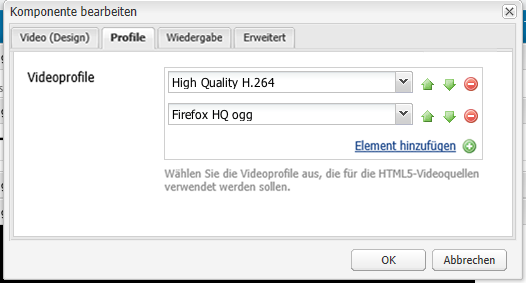

# Konfigurieren der Videokomponente  {#configure-the-video-component}

Mit der Komponente [Video](/help/sites-authoring/default-components-foundation.md#video) können Sie ein vordefiniertes OTB-Videoelement (vordefiniert) auf Ihrer Seite platzieren.

Damit eine korrekte Transkodierung erfolgt, muss Ihr Administrator [FFmpeg installieren und AEM](#install-ffmpeg) separat konfigurieren. Ihr Administrator kann auch [Ihre Videoprofile für die Verwendung mit HTML5-Elementen konfigurieren](#configure-video-profiles).

>[!CAUTION]
>
>Es wird nicht mehr erwartet, dass diese Komponente ohne umfassende Anpassungen auf Projektebene nativ funktioniert.

## Videoprofile konfigurieren {#configure-video-profiles}

Es empfiehlt sich, Videoprofile für die Verwendung von HTML5-Elementen zu definieren. Die hier getroffene Auswahl wird der Reihenfolge nach verwendet. Um zuzugreifen, verwenden Sie [Designmodus](/help/sites-authoring/default-components-designmode.md) (nur in der klassischen Benutzeroberfläche) und wählen Sie die Registerkarte **[!UICONTROL Profile]** aus:



Sie können auch das Design der Videokomponenten und -parameter für [!UICONTROL Wiedergabe], [!UICONTROL Flash] und [!UICONTROL Erweitert] konfigurieren.

## Installieren Sie FFmpeg und konfigurieren Sie AEM {#install-ffmpeg}

Die Videokomponente nutzt das Open-Source-Produkt FFmpeg eines Drittanbieters für die ordnungsgemäße Transkodierung von Videos, die von [https://ffmpeg.org/](https://ffmpeg.org/) heruntergeladen werden können. Nach der Installation von FFmpeg müssen Sie AEM zur Verwendung eines bestimmten Audiocodecs und bestimmter Echtzeitoptionen konfigurieren.

**So installieren Sie FFmpeg für Ihre Plattform**:

* **Unter Windows:**

   1. Laden Sie die kompilierte Binärdatei als `ffmpeg.zip` herunter.
   1. Entpacken Sie den Inhalt in einen Ordner.
   1. Setzen Sie die Systemumgebungsvariable `PATH` auf `<*your-ffmpeg-locatio*n>\bin`
   1. Starten Sie AEM neu.

* **Unter Mac OS X:**

   1. Installieren Sie Xcode ([https://developer.apple.com/technologies/tools/xcode.html](https://developer.apple.com/technologies/tools/xcode.html)).
   1. Installieren Sie XQuartz/X11.
   1. Installieren Sie MacPorts ([https://www.macports.org/](https://www.macports.org/))
   1. Führen Sie in der Konsole den folgenden Befehl aus und befolgen Sie die Anweisungen:

      `sudo port install ffmpeg`

      `FFmpeg` muss sich in befinden,  `PATH` damit AEM es über die Befehlszeile abrufen kann.

* **Vorkompilierte Version für OS X 10.6:**

   1. Laden Sie die vorkompilierte Version herunter.
   1. Extrahieren Sie sie in das Verzeichnis `/usr/local` .
   1. Führen Sie vom Terminal aus Folgendes aus:

      `sudo ln -s /usr/local/Cellar/ffmpeg/0.6/bin/ffmpeg /usr/bin/ffmpeg`

**So konfigurieren Sie AEM**:

1. Öffnen Sie [!UICONTROL CRXDE Lite] in Ihrem Webbrowser. ([http://localhost:4502/crx/de](http://localhost:4502/crx/de))
1. Wählen Sie den Knoten `/libs/settings/dam/video/format_aac/jcr:content` aus und stellen Sie sicher, dass die Knoteneigenschaften wie folgt lauten:

   * audioCodec:

      ```
       aac
      ```

   * customArgs:

      ```
       -flags +loop -me_method umh -g 250 -qcomp 0.6 -qmin 10 -qmax 51 -qdiff 4 -bf 16 -b_strategy 1 -i_qfactor 0.71 -cmp chroma -subq 8 -me_range 16 -coder 1 -sc_threshold 40 -b-pyramid normal -wpredp 2 -mixed-refs 1 -8x8dct 1 -fast-pskip 1 -keyint_min 25 -refs 4 -trellis 1 -direct-pred 3 -partitions i8x8,i4x4,p8x8,b8x8
      ```

1. Um die Konfiguration anzupassen, erstellen Sie eine Überlagerung im Knoten `/apps/settings/` und verschieben Sie dieselbe Struktur unter dem Knoten `/conf/global/settings/` . Sie kann nicht im Knoten `/libs` bearbeitet werden. Um beispielsweise den Pfad `/libs/settings/dam/video/fullhd-bp` zu überlagern, erstellen Sie ihn unter `/conf/global/settings/dam/video/fullhd-bp`.

   >[!NOTE]
   >
   >Überlagern und bearbeiten Sie den gesamten Profilknoten und nicht nur die Eigenschaft, die geändert werden muss. Solche Ressourcen werden nicht über SlingResourceMerger aufgelöst.

1. Haben Sie eine der Eigenschaften geändert, klicken Sie auf **[!UICONTROL Alle speichern]**.

>[!NOTE]
>
>OOTB-Workflow-Modelle werden beim Upgrade Ihrer AEM-Instanz nicht beibehalten. Adobe empfiehlt, OOTB-Workflow-Modelle zu kopieren, bevor Sie sie bearbeiten. Kopieren Sie beispielsweise das Modell OOTB DAM Update Asset , bevor Sie den Schritt FFmpeg Transcoding im Modell DAM Update Asset bearbeiten, um Videoprofilnamen auszuwählen, die vor dem Upgrade vorhanden waren. Anschließend können Sie den Knoten `/apps` überlagern, damit AEM die benutzerdefinierten Änderungen am OOTB-Modell abrufen kann.
