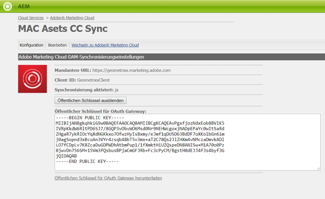
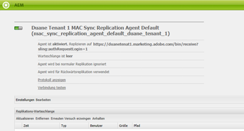

# AEM Assets-Integration mit Experience Cloud und Creative Cloud konfigurieren {#configure-aem-assets-integration-with-experience-cloud-and-creative-cloud}

Wenn Sie Adobe Experience Cloud-Kunde sind, können Sie Ihre Assets innerhalb von Adobe Experience Manager (AEM) Assets mit Adobe Creative Cloud synchronisieren und umgekehrt. Sie können Ihre Assets auch mit Experience Cloud synchronisieren und umgekehrt. Sie können diese Synchronisierung über [!DNL Adobe I/O] einrichten.

Der Workflow zur Einrichtung dieser Integration ist:

1. Erstellen Sie eine Authentifizierung in [!DNL Adobe I/O] mithilfe eines öffentlichen Gateways und erhalten Sie eine Anwendungs-ID.
1. Erstellen Sie mit der Anwendungs-ID ein Profil auf Ihrer AEM Assets-Instanz.
1. Verwenden Sie diese Konfiguration zum Synchronisieren Ihrer Assets in AEM Assets mit Creative Cloud.

Am Backend authentifiziert der AEM-Server Ihr Profil gegenüber dem Gateway und synchronisiert dann die Daten zwischen AEM Assets und Experience Cloud.

>[!NOTE]
>
>Die Funktion zum Freigeben von AEM Adobe Creative Cloud-Ordnern wird nicht mehr unterstützt. Weitere Informationen und eine bessere Methode finden Sie unter [Best Practices für die AEM- und Creative Cloud-Integration](../assets/aem-cc-integration-best-practices.md). Die Konfiguration der Replikation von AEM zu Marketing Cloud und zum Austausch von Assets zwischen AEM Assets und Marketing Cloud wird weiterhin unterstützt.

Datenfluss, wenn AEM Assets und Creative Cloud integriert werden

>[!NOTE]
>
>Das Freigeben von Assets zwischen Adobe Experience Cloud und Adobe Creative Cloud erfordert Administratorrechte für die AEM-Instanz.

>[!CAUTION]
>
>Adobe Marketing Cloud wurde in Adobe Experience Cloud umbenannt. Die folgenden Verfahren erwähnen noch Marketing Cloud, um die aktuelle Oberfläche widerzuspiegeln.

## Erstellen einer Anwendung {#create-an-application}

1. Greifen Sie auf die Adobe Developer Gateway-Schnittstelle zu, indem Sie sich unter [https://legacy-oauth.cloud.adobe.io](https://legacy-oauth.cloud.adobe.io/) einloggen.

   >[!NOTE]
   >
   >Sie benötigen Administratorrechte, um eine Anwendungs-ID zu erstellen.

1. Navigieren Sie im linken Bereich zu **[!UICONTROL Entwicklerwerkzeuge]** > **[!UICONTROL Anwendungen]**, um eine Liste von Anwendungen Ansicht.
1. Klicken Sie auf **[!UICONTROL Hinzufügen]** , um eine Anwendung zu erstellen.
1. Wählen Sie aus der Liste **[!UICONTROL Client-Anmeldeinformationen]** die Option **[!UICONTROL Dienstkonto (JWT-Assertion)]** aus. Dies ist ein Server-zu-Server-Kommunikationsdienst für die Serverauthentifizierung.

   

1. Geben Sie einen Namen für die Anwendung und eine optionale Beschreibung an.
1. Wählen Sie aus der Liste **[!UICONTROL Organisation]** die Organisation aus, für die Sie die Assets synchronisieren möchten.
1. Wählen Sie in der Liste **[!UICONTROL Scope]** **[!UICONTROL dam-read]**, **[!UICONTROL dam-sync]**, **[!UICONTROL dam-write]** und **[!UICONTROL cc-share]**.
1. Klicken Sie auf **[!UICONTROL Erstellen]**. Eine Meldung informiert Sie darüber, dass die Anwendung erstellt wurde.

   

1. Kopieren Sie die **[!UICONTROL Anwendungs-ID]**, die für die neue Anwendung generiert wird.

   >[!CAUTION]
   >
   >Achten Sie darauf, dass Sie nicht versehentlich das **[!UICONTROL Anwendungsgeheimnis]** anstelle der **[!UICONTROL Anwendungs-ID]** kopieren.

## Hinzufügen einer neuen Konfiguration zu Marketing Cloud {#add-a-new-configuration-to-marketing-cloud}

1. Klicken Sie auf das AEM-Logo in der Benutzeroberfläche in Ihrer lokalen AEM Assets-Instanz und navigieren Sie zu **[!UICONTROL Tools]** > **[!UICONTROL Cloud-Services]** > **[!UICONTROL Legacy-Cloud-Services]**.

1. Suchen Sie den Dienst **[!UICONTROL Adobe Marketing Cloud]**. Wenn keine Konfigurationen vorhanden sind, klicken Sie auf **[!UICONTROL Jetzt konfigurieren]**. Wenn Konfigurationen vorhanden sind, klicken Sie auf **[!UICONTROL Konfigurationen anzeigen]** und klicken Sie auf **[!UICONTROL [+]]**, um eine neue Konfiguration hinzuzufügen.

   >[!NOTE]
   >
   >Verwenden Sie ein Adobe ID-Konto mit Administratorrechten für die entsprechende Organisation.

1. Geben Sie im Dialogfeld **[!UICONTROL Konfiguration erstellen]** einen Titel und einen Namen für die neue Konfiguration an und klicken Sie auf **[!UICONTROL Erstellen]**.

   

1. Geben Sie im Feld **[!UICONTROL Mandanten-URL]** die URL für AEM Assets ein.

   >[!CAUTION]
   >
   >Wenn Sie die Tenant-URL als **https://&lt;tenant_id>.marketing.adobe.com** eingegeben haben, müssen Sie sie in **https://&lt;tenant_id>.experiencecloud.adobe.com ändern.** Um dies zu erreichen, gehen Sie wie folgt vor:
   1. Navigieren Sie zu **Werkzeuge > Cloud Services > Legacy-Cloud Services**.
   1. Unter „Adobe Marketing Cloud“ klicken Sie auf **Konfigurationen anzeigen**.
   1. Wählen Sie die Konfiguration, die während der Einrichtung der AEM-MAC-CC-Synchronisation erstellt wurde.
   1. Bearbeiten Sie die Cloudservice-Konfiguration und ersetzen Sie **marketing.adobe.com** im Feld &quot;Tenant-URL&quot;durch **experiencecloud.adobe.com**.
   1. Speichern Sie die Konfiguration.
   1. Testen Sie die Mac-Sync-Replikationsagenten.

1. Fügen Sie im Dialogfeld **[!UICONTROL Client-ID]** die Anwendungs-ID ein, die Sie am Ende des Vorgangs zum [Erstellen einer Anwendung](/help/sites-administering/configure-assets-cc-integration.md#create-an-application) kopiert haben.

   

1. Wählen Sie unter **[!UICONTROL Synchronisierung]** die Option **[!UICONTROL Aktiviert]** aus, um die Synchronisierung zu aktivieren, und klicken Sie auf **[!UICONTROL OK]**.

   >[!NOTE]
   Wenn Sie **Deaktiviert** auswählen, erfolgt die Synchronisierung in eine einzige Richtung.

1. Klicken Sie auf der Konfigurationsseite auf **[!UICONTROL Öffentlichen Schlüssel anzeigen]**, um den für Ihre Instanz generierten öffentlichen Schlüssel anzuzeigen. Alternativ können Sie auf **[!UICONTROL Öffentlichen Schlüssel für OAuth Gateway herunterladen]** klicken, um die Datei mit dem öffentlichen Schlüssel herunterzuladen. Öffnen Sie dann die Datei, um den öffentlichen Schlüssel anzuzeigen.

## Aktivieren der Synchronisierung {#enable-synchronization}

1. Zeigen Sie den öffentlichen Schlüssel mit einer der folgenden Methoden an, die im letzten Schritt des Verfahrens [Hinzufügen eine neue Konfiguration auf Marketing Cloud](/help/sites-administering/configure-assets-cc-integration.md#add-a-new-configuration-to-marketing-cloud) erwähnt werden. Klicken Sie auf **[!UICONTROL Öffentlichen Schlüssel anzeigen]**.

   

1. Kopieren Sie den öffentlichen Schlüssel und fügen Sie ihn in das Feld **[!UICONTROL Öffentlicher Schlüssel]** der Konfigurationsoberfläche der Anwendung ein, die Sie unter [Anwendung erstellen](/help/sites-administering/configure-assets-cc-integration.md#create-an-application) erstellt haben.

   

1. Klicken Sie auf **[!UICONTROL Aktualisieren]**. Synchronisieren Sie Ihre Assets jetzt mit der AEM Assets-Instanz.

## Testen der Synchronisierung {#test-the-synchronization}

1. Klicken Sie in der Benutzeroberfläche Ihrer lokalen AEM Assets-Instanz auf das AEM-Logo und navigieren Sie zu **[!UICONTROL Tools]** **[!UICONTROL Bereitstellung]**> **[!UICONTROL Replikation]**, um die für die Synchronisierung erstellten Replizierungs-Profil zu finden.
1. Klicken Sie auf der Seite **[!UICONTROL Replication]** auf **[!UICONTROL Agenten unter author]**.
1. Klicken Sie in der Liste der Profile auf das Standardreplikationsprofil zu Ihrer Organisation, um es zu öffnen.
1. Klicken Sie im Dialogfeld auf **[!UICONTROL Verbindung testen]**.

   

1. Sehen Sie sich den unteren Bereich der Testergebnisse an, um zu prüfen, ob die Replikation erfolgreich war.

## Benutzer zu Marketing Cloud hinzufügen {#add-users-to-marketing-cloud}

1. Melden Sie sich mithilfe der Anmeldeinformationen des Administrators bei Marketing Cloud an.
1. Wechseln Sie in den Leisten zu **[!UICONTROL Administration]**und klicken Sie dann auf **[!UICONTROL Enterprise Dashboard starten]**.
1. Klicken Sie in der Leiste auf **[!UICONTROL Benutzer]**, um die Seite **[!UICONTROL Benutzerverwaltung]** zu öffnen.
1. Klicken Sie in der Symbolleiste auf/tippen Sie auf **Hinzufügen** .
1. Fügen Sie einen oder mehr Benutzer hinzu, denen Sie die Möglichkeit zur Freigabe von Assets für Creative Cloud bereitstellen möchten.

   >[!NOTE]
   Nur die Benutzer, die Sie zu Marketing Cloud hinzufügen, können Assets von AEM Assets für Creative Cloud freigeben.

## Austauschen von Assets zwischen AEM Assets und Marketing Cloud  {#exchange-assets-between-aem-assets-and-marketing-cloud}

1. Melden Sie sich bei AEM Assets an.
1. Erstellen Sie in der Assets-Konsole einen Ordner und laden Sie einige Assets dort hoch. Erstellen Sie zum Beispiel einen Ordner **mc-demo** und laden Sie ein Asset dort hoch.
1. Wählen Sie den Ordner aus und klicken Sie auf **Freigeben** .
1. Wählen Sie im Menü **[!UICONTROL Adobe Marketing Cloud]** aus und klicken Sie dann auf **[!UICONTROL Freigeben]**. Eine Meldung benachrichtigt Sie, dass der Ordner für Marketing Cloud freigegeben wird.

   

   >[!NOTE]
   Die Freigabe eines Asset-Ordners vom Typ `sling:OrderedFolder` wird im Rahmen der Freigabe in Adobe Marketing Cloud nicht unterstützt. Wenn Sie einen Ordner bei seiner Erstellung in AEM Assets freigeben möchten, wählen Sie nicht die Option **[!UICONTROL Geordnet]** aus.

1. Aktualisieren Sie die AEM Assets-Benutzeroberfläche. Der Ordner, den Sie in der Asset-Konsole Ihrer lokalen AEM Assets-Instanz erstellt haben, wird in die Marketing Cloud-Benutzeroberfläche kopiert. Das Asset, das Sie in den Ordner in AEM Assets hochladen, wird in der Ordnerkopie in Marketing Cloud angezeigt, nachdem es vom AEM verarbeitet wurde.
1. Sie können in der replizierten Kopie des Ordners in Marketing Cloud auch ein Asset hochladen. Nach der Verarbeitung wird das Asset im freigegebenen Ordner in AEM Assets angezeigt.

## Austauschen von Assets zwischen AEM Assets und Creative Cloud  {#exchange-assets-between-aem-assets-and-creative-cloud}

Mit AEM Assets können Sie Ordner mit Assets für Benutzer von Adobe Creative Cloud freigeben.

1. Wählen Sie in der Assets-Konsole den für Creative Cloud freizugebenden Ordner aus.
1. Klicken Sie in der Symbolleiste auf **[!UICONTROL Freigeben]** .
1. Wählen Sie in der Liste die Option **[!UICONTROL Adobe Creative Cloud]**.

   >[!NOTE]
   Die Optionen sind für Benutzer mit Leseberechtigungen für das Stammverzeichnis verfügbar. Die Benutzer müssen die erforderlichen Berechtigungen verfügen, um auf die Informationen zum Replikationsagenten von Marketing Cloud zuzugreifen.

1. Fügen Sie auf der Seite **[!UICONTROL Freigeben von Creative Clouden]** den Benutzer hinzu, für den der Ordner freigegeben werden soll, und wählen Sie eine Rolle für den Benutzer aus. Klicken Sie auf **[!UICONTROL Speichern]** und dann auf **[!UICONTROL OK]**.

1. Melden Sie sich mit den Anmeldeinformationen des Benutzers, für den Sie den Ordner freigegeben haben, bei Creative Cloud an. Der freigegebene Ordner ist in Creative Cloud verfügbar.

Die Synchronisierung zwischen AEM Assets und Marketing Cloud ist so gestaltet, dass die Benutzercomputerinstanz, von der das Asset hochgeladen wird, das Recht zur Änderung des Assets behält. Nur diese Änderungen werden in der anderen Instanz eingefügt. 

Wenn zum Beispiel ein Asset von einer AEM Assets-Instanz (vor Ort) hochgeladen wird, werden die von dieser Instanz vorgenommenen Änderungen am Asset in der Marketing Cloud-Instanz aufgefüllt. Die von der Marketing Cloud-Instanz zu demselben Asset vorgenommenen Änderungen werden jedoch nicht an die AEM-Instanz übertragen und umgekehrt, wenn ein Asset aus Marketing Cloud hochgeladen wird.

>[!MORELIKETHIS]
* [Best Practices für die Integration von AEM und Creative Cloud](../assets/aem-cc-integration-best-practices.md)
* [Best Practices für die Ordnerfreigabe aus AEM in Creative Cloud](../assets/aem-cc-folder-sharing-best-practices.md)

