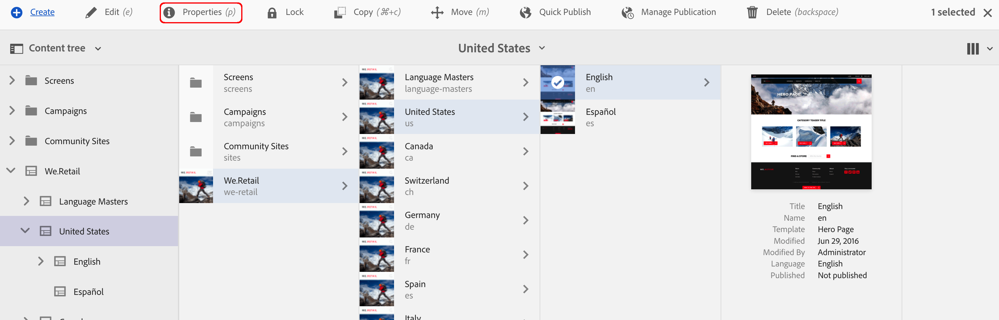

# Erstellen von geschlossenen Benutzergruppen{#creating-a-closed-user-group}

>[!CAUTION]
>
>AEM 6.4 hat das Ende der erweiterten Unterstützung erreicht und diese Dokumentation wird nicht mehr aktualisiert. Weitere Informationen finden Sie in unserer [technische Unterstützung](https://helpx.adobe.com/de/support/programs/eol-matrix.html). Unterstützte Versionen suchen [here](https://experienceleague.adobe.com/docs/?lang=de).

Geschlossene Benutzergruppen (CUGs) werden verwendet, um den Zugriff auf bestimmte Seiten zu beschränken, die sich auf einer veröffentlichten Website befinden. Für solche Seiten müssen sich die zugewiesenen Mitglieder anmelden und Sicherheitsberechtigungen bereitstellen.

So konfigurieren Sie einen solchen Bereich auf Ihrer Website:

* [Erstellen Sie die tatsächliche geschlossene Benutzergruppe und weisen Sie ihr Mitglieder zu](#creating-the-user-group-to-be-used).

* [Wenden Sie diese Gruppe auf die erforderlichen Seiten an](#applying-your-closed-user-group-to-content-pages) und wählen (oder erstellen) Sie die Anmeldeseite, die von den Mitgliedern der CUG verwendet werden soll. Dies wird auch festgelegt, wenn eine CUG auf eine Inhalts-Seite angewendet wird.

* [einen Link in beliebigem Formular zu mindestens einer Seite innerhalb des geschützten Bereichs erstellen](#linking-to-the-realm), andernfalls wird sie nicht angezeigt.
* [Konfigurieren des Dispatchers](#configure-dispatcher-for-cugs) falls in Verwendung.

>[!CAUTION]
>
>Geschlossene Benutzergruppen (CUGs) sollten immer unter Berücksichtigung der Leistung erstellt werden.
>
>Obwohl die Anzahl der Benutzer und Gruppen in einer CUG nicht begrenzt ist, kann eine hohe Anzahl von CUGs auf einer Seite die Rendering-Leistung verlangsamen.
>
>Die Auswirkungen von CUGs sollten bei Leistungstests immer berücksichtigt werden.

## Erstellen der zu verwendenden Benutzergruppe {#creating-the-user-group-to-be-used}

So erstellen Sie eine geschlossene Benutzergruppe:

1. Wechseln Sie vom AEM-Startbildschirm zu **Tools – Sicherheit**.

   >[!NOTE]
   >
   >Siehe [Verwalten von Benutzern und Gruppen](/help/sites-administering/security.md#managing-users-and-groups) für ausführliche Informationen zur Erstellung und Konfiguration von Benutzern und Gruppen.

1. Wählen Sie die **Gruppen** vom nächsten Bildschirm aus.

   

1. Klicken Sie auf die Schaltfläche **Erstellen** oben rechts, um eine neue Gruppe zu erstellen.
1. Benennen Sie Ihre neue Gruppe, z. B. `cug_access`.

   

1. Gehen Sie zur Registerkarte **Mitglieder** und weisen Sie dieser Gruppe die erforderlichen Benutzer zu.

   

1. Aktivieren Sie alle Benutzer, die Sie Ihrer CUG zugewiesen haben. Dies sind in diesem Fall alle Mitglieder der Gruppe `cug_access`.
1. Aktivieren Sie die geschlossene Benutzergruppe, sodass sie in der Publishing-Umgebung verfügbar ist. In diesem Fall ist dies die Gruppe `cug_access`.

## Anwenden der geschlossenen Benutzergruppe auf die Inhaltsseiten {#applying-your-closed-user-group-to-content-pages}

So wenden Sie die CUG auf eine Seite an:

1. Navigieren Sie zur Stammseite des eingeschränkten Bereichs, dem Sie die CUG zuweisen möchten.
1. Wählen Sie die Seite aus, indem Sie auf die Miniaturansicht klicken und dann auf **Eigenschaften** im oberen Bereich.

   

1. Rufen Sie im folgenden Fenster die Registerkarte **Erweitert** auf.
1. Blättern Sie nach unten und aktivieren Sie das Kontrollkästchen im Bereich **Authentifizierungsanforderungen**.

1. Fügen Sie unten den Kofigurationspfad hinzu und klicken Sie dann auf „Speichern“.
1. Rufen Sie dann die Registerkarte **Berechtigungen** auf und klicken Sie auf die Schaltfläche **Geschlossene Benutzergruppe bearbeiten**.

   

   >[HINWEIS!]
   >
   > Beachten Sie, dass CUGs auf der Registerkarte „Berechtigungen“ aus Blueprints nicht zu Live Copies ausgerollt werden können. Planen Sie dies ein, wenn Sie eine Live Copy konfigurieren.
   >
   > Weitere Informationen finden Sie auf [dieser Seite](closed-user-groups.md#aem-livecopy).

1. Suchen Sie nach Ihrer CUG und fügen Sie sie im folgenden Fenster hinzu - in diesem Fall fügen Sie die Gruppe mit dem Namen **cug_access**. Die Presse **Speichern**.
1. Klicken Sie auf **Aktiviert**, um festzulegen, dass diese Seite (und alle untergeordneten Seiten) zu einer CUG gehören.
1. Geben Sie die **Anmeldeseite** an, die Mitglieder der Gruppe verwenden; Beispiel:

   `/content/geometrixx/en/toolbar/login.html`

   Dies ist optional. Wenn Sie das Feld leer lassen, wird die standardmäßige Anmeldeseite verwendet.

1. Fügen Sie die **Zugelassene Gruppen**. Verwenden Sie + , um Gruppen hinzuzufügen, oder - , um sie zu entfernen. Nur Mitglieder dieser Gruppen können sich anmelden und auf die Seiten zugreifen.
1. Zuweisen einer **Bereich** (ein Name für die Seitengruppen), falls erforderlich. Frei lassen, um den Seitentitel zu verwenden.
1. Klicken **OK** , um die Spezifikation zu speichern.

Informationen zu Profilen in der Publishing-Umgebung und der Bereitstellung von Formularen zum An- und Abmelden finden Sie in [Identitäts-Management](/help/sites-administering/identity-management.md).

## Verknüpfung zum Bereich {#linking-to-the-realm}

Da das Ziel von Links zum CUG-Bereich für den anonymen Benutzer nicht sichtbar ist, entfernt der Linkchecker solche Links.

Um dies zu vermeiden, ist es ratsam, nicht geschützte Umleitungsseiten zu erstellen, die auf Seiten innerhalb des CUG-Bereichs verweisen. Die Navigationseinträge werden gerendert, ohne dass der Linkchecker Probleme verursacht. Nur wenn der Benutzer tatsächlich auf die Umleitungsseite zugreift, wird er in den CUG-Bereich umgeleitet - nachdem er seine Anmeldedaten erfolgreich bereitgestellt hat.

## Konfigurieren des Dispatchers für CUGs {#configure-dispatcher-for-cugs}

Wenn Sie den Dispatcher verwenden, müssen Sie eine Dispatcher-Farm mit den folgenden Eigenschaften definieren:

* [virtualhosts](https://helpx.adobe.com/de/experience-manager/dispatcher/using/dispatcher-configuration.html#identifying-virtual-hosts-virtualhosts): Entspricht dem Pfad zu den Seiten, für die die CUG gilt.
* \sessionmanagement: siehe unten.
* [cache](https://helpx.adobe.com/de/experience-manager/dispatcher/using/dispatcher-configuration.html#configuring-the-dispatcher-cache-cache): Ein Cache-Verzeichnis, das den Dateien gewidmet ist, für die die CUG gilt.

### Konfigurieren der Dispatcher-Sitzungsverwaltung für CUGs {#configuring-dispatcher-session-management-for-cugs}

Konfigurieren Sie das [Sitzungsmanagement in der Datei dispatcher.any](https://helpx.adobe.com/de/experience-manager/dispatcher/using/dispatcher-configuration.html#enabling-secure-sessions-sessionmanagement) für die CUG. Der Authentifizierungs-Handler, der verwendet wird, wenn der Zugriff auf CUG-Seiten angefordert wird, bestimmt, wie Sie das Sitzungsmanagement konfigurieren.

```xml
/sessionmanagement
    ...
    /header "Cookie:login-token" 
    ...
```

>[!NOTE]
>
>Wenn für eine Dispatcher-Farm das Sitzungsmanagement aktiviert ist, werden alle von der Farm verarbeiteten Seiten nicht zwischengespeichert. Um Seiten zwischenzuspeichern, die sich außerhalb der CUG befinden, erstellen Sie eine zweite Farm in der Datei dispatcher.any\
>, die die Nicht-CUG-Seiten verarbeitet.

1. Konfigurieren Sie [/sessionmanagement](https://helpx.adobe.com/de/experience-manager/dispatcher/using/dispatcher-configuration.html#enabling-secure-sessions-sessionmanagement), indem Sie `/directory` festlegen, zum Beispiel:

   ```xml
   /sessionmanagement
     {
     /directory "/usr/local/apache/.sessions"
     ...
     }
   ```

1. Legen Sie [/allowAuthorized](https://helpx.adobe.com/de/experience-manager/dispatcher/using/dispatcher-configuration.html#caching-when-authentication-is-used) auf `0` fest.
