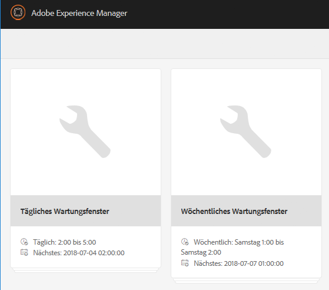
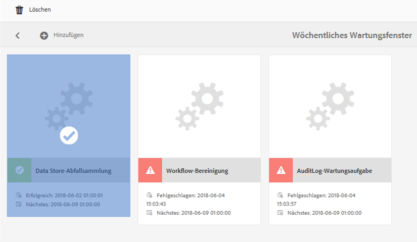
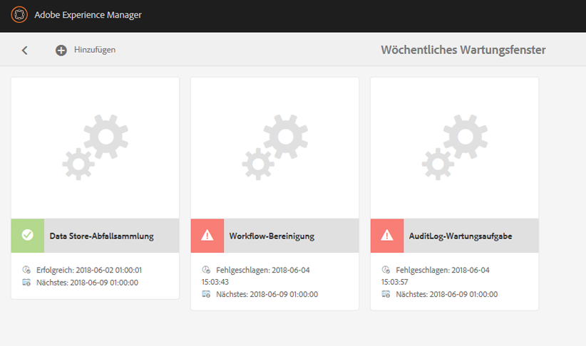

# Datenspeicherbereinigung {#data-store-garbage-collection}

Wenn ein herkömmliches WCM-Asset entfernt wird, kann der Verweis zum zugrunde liegenden Datenspeichersatz aus der Knotenhierarchie entfernt werden. Der Datenspeichersatz selbst bleibt allerdings bestehen. Dieser nicht referenzierte Datenspeichersatz wird dadurch zu „Garbage“, der nicht aufbewahrt werden muss. In Instanzen mit einer Reihe von Garbage-Assets ist es von Vorteil, diese loszuwerden, um Speicherplatz zu behalten und um die Sicherung sowie die Leistung bei der Dateisystemwartung zu optimieren.

Meist neigen WCM-Anwendungen dazu, Informationen zu sammeln. Gelöscht werden die Informationen allerdings bei Weitem nicht so oft. Auch wenn neue Bilder hinzugefügt werden und sogar wenn alte Versionen ersetzt werden, behält das Versionskontrollsystem dennoch die alte Version bei und unterstützt bei Bedarf die Möglichkeit, zu dieser Version zurückzukehren. Daher wird der Großteil der Inhalte, die wir zum System hinzufügen, permanent gespeichert. Was ist also die typische Quelle für „Garbage“ im Repository, die wir bereinigen möchten?

AEM verwendet das Repository als Speicher für eine Reihe von internen Aktivitäten und Bereinigungsaktivitäten:

* Zusammengestellte und heruntergeladene Pakete
* Für die Veröffentlichungsreplikation erstellte temporäre Dateien
* Workflow-Payload
* Während des DAM-Renderings temporär erstellte Assets

Wenn eines dieser temporären Objekte groß genug ist, Speicherplatz im Datenspeicher zu beanspruchen, und wenn das Objekt schließlich nicht mehr genutzt wird, bleibt der Datenspeichersatz selbst als „Garbage“ vorhanden. In einer typischen WCM-Autoren-/Veröffentlichungsanwendung ist die größte Quelle von „Garbage“ dieser Art in der Regel der Prozess der Aktivierung der Veröffentlichung. When data is being replicated to Publish, it if first gathered in collections in an efficient data format called &quot;Durbo&quot; and stored in the repository under `/var/replication/data`. Die Datenbundles übersteigen oft den kritischen Größenschwellenwert für den Datenspeicher und werden daher als Datenspeichersätze gespeichert. When the replication is complete, the node in `/var/replication/data` is deleted, but the data store record remains as &quot;garbage&quot;.

Eine weitere Quelle von wiederherstellbarem Garbage sind Pakete. Paketdaten werden – wie alles andere auch – im Repository und bei Paketen, die größer sind als 4 KB, im Datenspeicher gespeichert. Während eines Entwicklungsprojekts oder im Laufe der Zeit können Pakete bei der Wartung eines Systems viele Male zusammengestellt und neu erstellt werden, wobei jede Version zu einem neuen Datenspeichersatz führt, durch den der Datensatz der vorherigen Version verwaist.

## Wie funktioniert die automatische Datenspeicherbereinigung? {#how-does-data-store-garbage-collection-work}

Wenn das Repository mit einem externen Datenspeicher konfiguriert wurde, [wird die automatische Datenspeicherbereinigung im Rahmen des wöchentlichen Wartungsfensters automatisch ausgeführt](/help/sites-administering/data-store-garbage-collection.md#automating-data-store-garbage-collection). The system administrator can also [run data store garbage collection manually](#running-data-store-garbage-collection) on as as-needed basis. Im Allgemeinen wird empfohlen, dass die Datenspeicherbereinigung regelmäßig durchgeführt wird, doch die folgenden Faktoren sollten bei der Planung von Datenspeicherbereinigungen berücksichtigt werden:

* Datenspeicherbereinigungen nehmen Zeit in Anspruch und können die Leistung beieinträchtigen, was entsprechend eingeplant werden sollte.
* Das Entfernen der „Garbage“-Datensätze im Datenspeicher hat keinen Einfluss auf die normale Leistung. Es handelt sich also nicht um eine Leistungsoptimierung.
* Wenn die Speichernutzung und damit verbundene Faktoren wie die Sicherungszeiten kein Problem darstellen, kann die automatische Datenspeicherbereinigung auf sichere Weise zeitlich verschoben werden.

Der Datenspeicherbereiniger merkt sich zunächst den aktuellen Zeitstempel, wenn der Prozess beginnt. Die Sammlung der Daten wird mithilfe eines Multi-Pass-Mark-/Sweep-Pattern-Algorithmus durchgeführt.

In der ersten Phase führt der Datenspeicherbereiniger einen umfassenden Durchlauf durch die gesamten Repository-Inhalte durch. Zu jedem Inhaltsobjekt mit einem Verweis zum Datenspeichersatz sucht er die Datei im Dateisystem, führt eine Metadatenaktualisierung durch und ändert das „Zuletzt geändert“- oder MTIME-Attribut. An diesem Punkt erhalten Dateien, auf die in dieser Phase zugegriffen wurde, einen neueren Zeitstempel als den ursprünglichen Baseline-Zeitstempel.

In der zweiten Phase durchläuft der Datenspeicherbereiniger die physische Verzeichnisstruktur des Datenspeichers auf eine sehr ähnliche Weise wie eine Suche. Er untersucht das „Zuletzt geändert“- oder MTIME-Attribut der Datei und bestimmt Folgendes:

* Wenn das MTIME neuer als der ursprüngliche Baseline-Zeitstempel ist, wurde die Datei entweder in der ersten Phase gefunden oder es handelt sich um eine völlig neue Datei, die dem Repository während des laufenden Bereinigungsprozesses hinzugefügt wurde. In beiden Fällen wird der Datensatz als aktiv betrachtet und die Datei ist nicht zu löschen.
* Wenn das MTIME-Attribut vor dem ursprünglichen Baseline-Zeitstempel liegt, handelt es sich bei der Datei nicht um eine aktiv referenzierte Datei und sie wird als entfernbarer „Garbage“ betrachtet.

Dieser Ansatz funktioniert bei einem einzelnen Knoten mit einem privaten Datenspeicher sehr gut. Handelt es sich jedoch um einen freigegebenen Datenspeicher, bedeutet dies, dass potenziell aktive Live-Verweise auf Datenspeichersätze von anderen Repositorys nicht geprüft werden und dass aktive referenzierte Dateien gegebenenfalls fälschlicherweise entfernt werden. Der Systemadministrator muss vor der Planung jedweder Datenspeicherbereinigungen auf jeden Fall über die Freigabestruktur des Datenspeichers Bescheid wissen. Er darf nur dann den einfachen integrierten Prozess zur automatischen Datenspeicherbereinigung verwenden, wenn bekannt ist, dass der Datenspeicher nicht freigegeben ist.

>[!NOTE]
>
>Wenn Sie die automatische Bereinigung für einen eingerichteten Cluster- oder freigegebenen Speicher (mit Mongo oder Segment-Tar) durchführen, werden im Protokoll möglicherweise Warnungen angezeigt, wonach bestimmte Blob-IDs nicht gelöscht werden können. Dies geschieht, weil Blob-IDs, die in einer vorherigen Garbage Collection gelöscht wurden, von anderen Clustern oder freigegebenen Knoten, die keine Informationen über die ID-Löschungen haben, fälschlicherweise erneut referenziert werden. Daher wird bei der automatischen Bereinigung eine Warnung protokolliert, wenn versucht wird, eine bereits im vorherigen Durchgang gelöschte ID zu entfernen. Dieses Verhalten wirkt sich weder auf die Leistung noch auf die Funktionalität aus.

## Ausführen der automatischen Datenspeicherbereinigung {#running-data-store-garbage-collection}

Die automatische Datenspeicherbereinigung kann je nach dem eingerichteten Datenspeicher, auf dem AEM ausgeführt wird, auf drei Arten erfolgen:

1. Via [Revision Cleanup](/help/sites-deploying/revision-cleanup.md) - a garbage collection mechanism usually used for node store cleanup.

1. Über die [Automatische Datenspeicherbereinigung](/help/sites-administering/data-store-garbage-collection.md#running-data-store-garbage-collection-via-the-operations-dashboard) – ein Bereinigungsmechanismus speziell für externe Datenspeicher, der im Vorgangs-Dashboard verfügbar ist
1. Über die [JMX-Konsole](/help/sites-administering/jmx-console.md)

Wenn TarMK sowohl als Knotenspeicher als auch als Datenspeicher verwendet wird, kann die Versionsbereinigung für beide Speicher eingesetzt werden. Wenn jedoch ein externer Datenspeicher wie der Dateisystemdatenspeicher konfiguriert ist, muss die Datenspeicherbereinigung explizit und separat von der Versionsbereinigung ausgelöst werden. Automatische Datenspeicherbereinigung kann über das Vorgangs-Dashboard oder die JMX-Konsole ausgelöst werden.

In der folgenden Tabelle sind die Speicherbereinigungstypen aufgeführt, die für alle unterstützten Datenspeicherbereitstellungen in AEM 6 zu verwenden sind:

<table> 
 <tbody> 
  <tr> 
   <td><strong>Knotenspeicher</strong><br /> </td> 
   <td><strong>Datenspeicher</strong></td> 
   <td><strong>Abfallsammlung</strong><br /> </td> 
  </tr> 
  <tr> 
   <td>TarMK</td> 
   <td>TarMK</td> 
   <td>Überarbeitungsbereinigung (Binärdateien werden mit dem Segmentspeicher verknüpft)</td> 
  </tr> 
  <tr> 
   <td>TarMK</td> 
   <td>Externes Dateisystem</td> 
   <td><p>Aufgabe der Datenerfassung über das Operations-Dashboard</p> <p>JMX-Konsole</p> </td> 
  </tr> 
  <tr> 
   <td>MongoDB</td> 
   <td>MongoDB</td> 
   <td><p>Aufgabe der Datenerfassung über das Operations-Dashboard</p> <p>JMX-Konsole</p> </td> 
  </tr> 
  <tr> 
   <td>MongoDB</td> 
   <td>Externes Dateisystem</td> 
   <td><p>Aufgabe der Datenerfassung über das Operations-Dashboard</p> <p>JMX-Konsole</p> </td> 
  </tr> 
 </tbody> 
</table>

### Ausführen der automatischen Datenspeicherbereinigung über das Vorgangs-Dashboard {#running-data-store-garbage-collection-via-the-operations-dashboard}

Das integrierte, über das [Vorgangs-Dashboard](/help/sites-administering/operations-dashboard.md) verfügbare wöchentliche Wartungsfenster beinhaltet die integrierte Aufgabe, die Datenspeicherbereinigung sonntags um 1 Uhr nachts durchzuführen.

Wenn Sie die automatische Datenspeicherbereinigung zu einem anderen Zeitpunkt ausführen müssen, kann diese auch manuell über das Vorgangs-Dashboard ausgelöst werden.

Vor der Ausführung der automatischen Datenspeicherbereinigung sollten Sie prüfen, ob zu dem Zeitpunkt keine Sicherungen ausgeführt werden.

1. Öffnen Sie das Vorgangs-Dashboard über **Navigation** > **Tools** > **Vorgänge** > **Wartung**.
1. Klicken oder tippen Sie auf **Wöchentliches Wartungsfenster**.

   

1. Wählen Sie die Aufgabe **Automatische Datenspeicherbereinigung** und klicken oder tippen Sie auf das Symbol **Ausführen**.

   

1. Die automatische Datenspeicherbereinigung wird ausgeführt und der Status wird im Dashboard angezeigt.

   

>[!NOTE]
>
>Die Aufgabe zur Durchführung der automatischen Datenspeicherbereinigung wird nur angezeigt, wenn Sie einen externen Dateidatenspeicher konfiguriert haben. See [Configuring node stores and data stores in AEM 6](/help/sites-deploying/data-store-config.md#file-data-store) for information on how to set up a file data store.

### Ausführen der automatischen Datenspeicherbereinigung über die JMX-Konsole {#running-data-store-garbage-collection-via-the-jmx-console}

In diesem Abschnitt wird die manuelle Ausführung der automatischen Datenspeicherbereinigung über die JMX-Konsole erläutert. Wenn Ihre Installation ohne einen externen Datenspeicher eingerichtet wurde, gilt dies nicht für Ihre Installation. Sehen Sie sich stattdessen die Anweisungen zur Ausführung der Versionsbereinigung unter [Wartung von Repositorys](/help/sites-deploying/storage-elements-in-aem-6.md#maintaining-the-repository) an.

>[!NOTE]
>
>Wenn Sie TarMK mit einem externen Datenspeicher ausführen, müssen Sie zunächst die Versionsbereinigung ausführen, damit die Speicherbereinigung effektiv sein kann.

So führen Sie die Speicherbereinigung durch:

1. Markieren Sie in der Apache Felix OSGi Management Console die Registerkarte **Main** und wählen Sie aus dem folgenden Menü **JMX** aus
1. Suchen Sie als Nächstes nach **Repository Manager** MBean (oder gehen Sie zu `https://<host>:<port>/system/console/jmx/org.apache.jackrabbit.oak%3Aname%3Drepository+manager%2Ctype%3DRepositoryManagement`) und klicken Sie darauf.
1. Klicken Sie auf **startDataStoreGC(boolean markOnly)**.
1. enter &quot;`true`&quot; for the `markOnly` parameter if required:

   | **Option** | **Beschreibung** |
   |---|---|
   | boolean markOnly | Auf &quot;true&quot;setzen, um nur Verweise zu markieren und nicht in der Aktion &quot;mark&quot;und &quot;sweep&quot;zu fegen. Dieser Modus wird verwendet, wenn der zugrunde liegende BlobStore für mehrere verschiedene Repositorys freigegeben ist. Setzen Sie den Parameter in allen anderen Fällen auf „false“, um eine vollständige Speicherbereinigung durchzuführen. |

1. Klicken Sie auf **Invoke**. CRX führt die Speicherbereinigung durch und zeigt an, wenn diese abgeschlossen ist.

>[!NOTE]
>
>Die automatische Datenspeicherbereinigung erfasst keine Dateien, die in den letzten 24 Stunden gelöscht wurden.

>[!NOTE]
>
>Die Aufgabe zur Datenerfassung im Datenspeicher wird nur dann Beginn, wenn Sie einen externen Dateidatenspeicher konfiguriert haben. If an external file data store has not been configured, the task will return the message `Cannot perform operation: no service of type BlobGCMBean found` after invoking. See [Configuring node stores and data stores in AEM 6](/help/sites-deploying/data-store-config.md#file-data-store) for information on how to set up a file data store.

## Automatisieren der automatischen Datenspeicherbereinigung {#automating-data-store-garbage-collection}

Wenn möglich sollte die automatische Datenspeicherbereinigung ausgeführt werden, wenn das System nicht stark ausgelastet ist – so zum Beispiel am Morgen.

Das integrierte, über das [Vorgangs-Dashboard](/help/sites-administering/operations-dashboard.md) verfügbare wöchentliche Wartungsfenster beinhaltet die integrierte Aufgabe, die Datenspeicherbereinigung sonntags um 1 Uhr nachts durchzuführen. Sie sollten außerdem überprüfen, ob zu diesem Zeitpunkt keine Sicherungen durchgeführt werden. Der Start des Wartungsfensters kann bei Bedarf über das Dashboard angepasst werden.

>[!NOTE]
>
>Der Grund dafür, sie nicht gleichzeitig auszuführen, ist, dass alte (und nicht verwendete) Datenspeicherdateien ebenfalls gesichert werden, sodass die Binärdateien, falls sie zu einer alten Revision zurückgeführt werden müssen, weiterhin in der Sicherung vorhanden sind.

Wenn Sie nicht möchten, dass Datenspeicher-Garbage Collection mit dem wöchentlichen Wartungsfenster im Operations-Dashboard ausgeführt wird, kann sie auch mit den HTTP-Clients &quot;wget&quot;oder &quot;curl&quot;automatisiert werden. Das folgende Beispiel zeigt, wie die Sicherung mithilfe von curl automatisiert wird:

>[!CAUTION]
>
>Im folgenden Beispiel müssen gegebenenfalls verschiedene Parameter des `curl`-Befehls für Ihre Instanz konfiguriert werden, so zum Beispiel Hostname (`localhost`), Port (`4502`), Admin-Kennwort (`xyz`) und verschiedene Parameter für die tatsächliche automatische Datenspeicherbereinigung.

Im Folgenden finden Sie ein Beispiel für den Befehl curl, um die Datspeicher-Garbage Collection über die Befehlszeile aufzurufen:

```shell
curl -u admin:admin -X POST --data markOnly=true  http://localhost:4503/system/console/jmx/org.apache.jackrabbit.oak"%"3Aname"%"3Drepository+manager"%"2Ctype"%"3DRepositoryManagement/op/startDataStoreGC/boolean
```

Der curl-Befehl wird sofort zurückgegeben.

## Prüfen der Datenspeicherkonsistenz {#checking-data-store-consistency}

Die Datenspeicherkonsistenzprüfung meldet sämtliche fehlenden Datenspeicherbinärdateien, die dennoch referenziert werden. Führen Sie die folgenden Schritte aus, um eine Konsistenzprüfung zu starten:

1. Gehen Sie zur JMX-Konsole. For information on how to use the JMX console, see [this article](/help/sites-administering/jmx-console.md#using-the-jmx-console).

1. Suchen Sie nach dem MBean **Blob GC** und klicken Sie darauf.

1. Click the `checkConsistency()` link.

Nach dem Abschluss der Konsistenzprüfung wird eine Meldung mit der Zahl der als fehlend gemeldeten Binärdateien angezeigt. Ist die Zahl größer als 0, prüfen Sie das `error.log`, um weitere Details zu fehlenden Binärdateien anzuzeigen.

Im Folgenden finden Sie ein Beispiel dafür, wie die fehlenden Binärdateien in den Protokollen gemeldet werden:

```xml
11:32:39.673 INFO [main] MarkSweepGarbageCollector.java:600 Consistency check found [1] missing blobs
```

```xml
11:32:39.673 WARN [main] MarkSweepGarbageCollector.java:602 Consistency check failure in the blob store : DataStore backed BlobStore [org.apache.jackrabbit.oak.plugins.blob.datastore.OakFileDataStore], check missing candidates in file /tmp/gcworkdir-1467352959243/gccand-1467352959243
```

