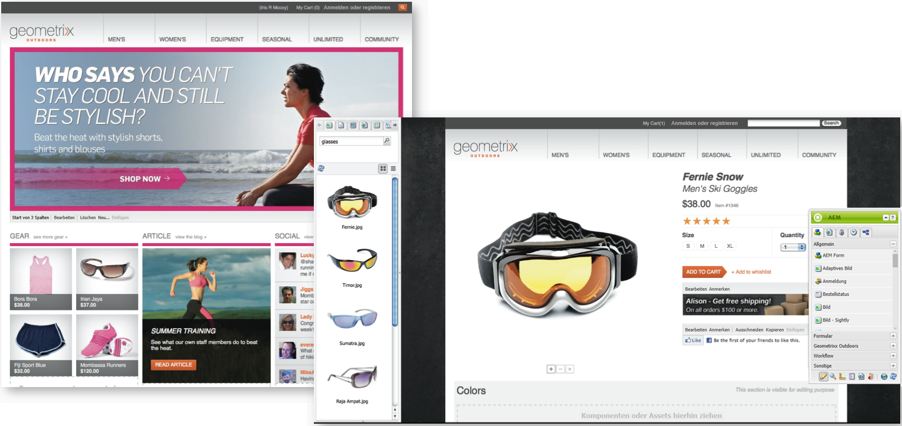
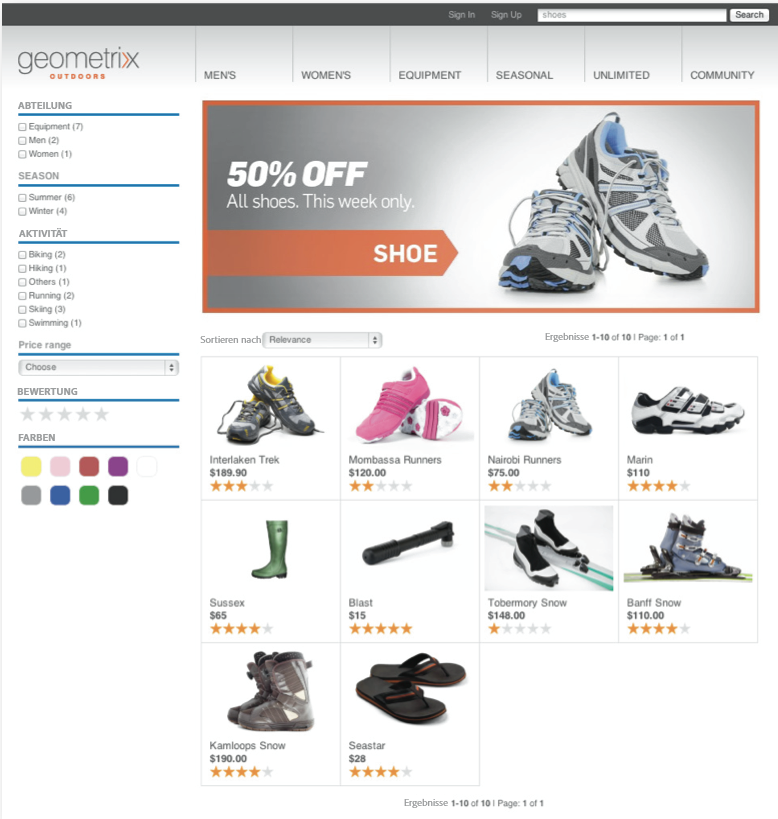
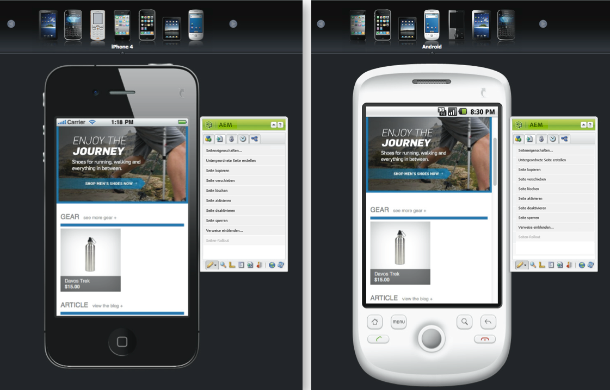
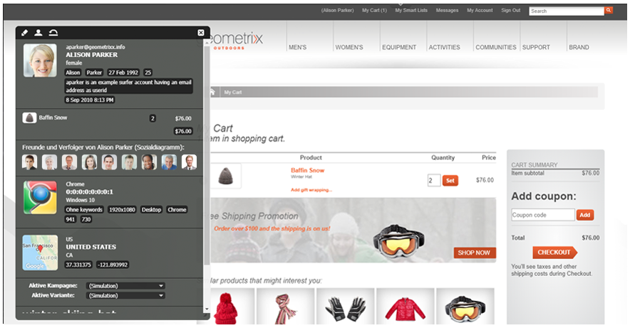
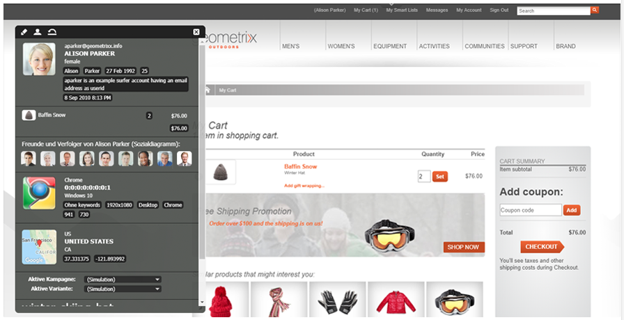

# E-Commerce{#ecommerce}

* [Konzepte](/help/sites-administering/concepts.md)
* [Verwaltung (generisch)](/help/sites-administering/generic.md)
* [SAP Commerce Cloud](/help/sites-administering/sap-commerce-cloud.md)
* [Salesforce Commerce Cloud](https://github.com/adobe/commerce-salesforce)
* [Magento](https://www.adobe.io/apis/experiencecloud/commerce-integration-framework/integrations.html#!AdobeDocs/commerce-cif-documentation/master/integrations/02-AEM-Magento.md)

Adobe bietet zwei Versionen des Commerce-Integrations-Frameworks:

|  | CIF On-Premise | CIF Cloud |
|-------------------------|--------------------------------------------------------------------------------------------------------------------------------------------------------------------------------------------------------|------------------------------------------------------------------------------------------------------------------------|
| Unterstützte AEM-Versionen | AEM On-Premise oder AMS 6.x | AEM AMS 6.4 und 6.5 |
| Back-End | - AEM, Java   - Monolithische Integration, Pre-Build-Zuordnung (Vorlage)  - JCR-Repository | - Magento  - Java und JavaScript  - Keine Commerce-Daten im JCR-Repository gespeichert |
| Front-End | Server-seitig wiedergegebene AEM-Seiten | Gemischte Seitenanwendung (hybrides Rendering) |
| Produktkatalog | - Produkt-Importer, Editor, Zwischenspeicherung in AEM  - Regelmäßige Kataloge mit AEM- oder Proxy-Seiten | - Keine Einfuhr von Erzeugnissen  - Allgemeine Vorlagen  - On-Demand-Daten über Connector |
| Skalierbarkeit | - Kann bis zu einigen Millionen Produkte unterstützen (abhängig vom Anwendungsfall)   - Zwischenspeicherung im Dispatcher | - Keine Volumenbegrenzung  - Caching im Dispatcher oder CDN |
| Standardisiertes Datenmodell | Nein | Ja, Magento GraphQL-Schema |
| Verfügbarkeit | Ja:  - SAP-Commerce Cloud (Erweiterung aktualisiert, um AEM 6.4 und Hybris 5 zu unterstützen (Standard) und Kompatibilität mit Hybris 4 sicherzustellen  - Salesforce-Commerce Cloud (Connector Open-Source-Unterstützung für AEM 6.4) | Ja, über Open Source von GitHub.   Magento Commerce (unterstützt Magento 2.3.2 (standardmäßig) und ist mit Magento 2.3.1 kompatibel). |
| Wann ist sie einzusetzen? | Eingeschränkte Anwendungsfälle: In Szenarien, in denen kleine statische Kataloge importiert werden müssen | Bevorzugte Lösung in den meisten Anwendungsfällen |

Zusammen mit der Produktdatenverwaltung (PIM) verarbeitet eCommerce die Aktivitäten auf einer Website mit Schwerpunkt auf dem Verkauf von Produkten über einen Online-Shop:

* Erstellung, Lebensdauer und Veralterung eines Produkts
* Preisverwaltung
* Transaktionsverwaltung
* Verwaltung von kompletten Katalogen
* Live- und zentralisierte Speicherdatensätze
* Webschnittstellen

Mit AEM eCommerce können Marketingexperten personalisierte Marken-Einkaufserlebnisse über Web-, Mobile- und Social-Touchpoints bereitstellen. In der Authoring-Umgebung von AEM können Sie die Seiten und Komponenten an den Kontext des Zielbesuchers und Ihre Merchandising-Strategien anpassen, zum Beispiel:

* Produktseiten
* Warenkorbkomponenten
* Kassenkomponenten

Die Implementierung ermöglicht den Echtzeitzugriff auf Produktdaten. Damit lässt sich Folgendes durchsetzen:

* Integrität der Produktdaten
* Preise
* Lagerbestand
* Variationen im Status eines Warenkorbs

>[!NOTE]
>
>Um das Integrationsframework mit externen eCommerce-Anbietern zu nutzen, müssen Sie zunächst die benötigten Pakete installieren. Weitere Informationen finden Sie unter [Bereitstellen von eCommerce](/help/sites-deploying/ecommerce.md).
>
>Informationen zur Erweiterung der eCommerce-Funktionen finden Sie unter [Entwicklung von eCommerce](/help/sites-developing/ecommerce.md).

## Zentrale Funktionen {#main-features}

AEM eCommerce bietet Folgendes:

* Einige **vordefinierte AEM** , um zu veranschaulichen, was für Ihr Projekt erreicht werden kann:

   * Produktanzeige
   * Warenkorb
   * Kasse
   * Kürzlich angezeigte Produkte
   * Gutscheine
   * und mehr

   

   >[!NOTE]
   >
   >Mit dem Integrationsframework von AEM können Sie unabhängig von Ihrer eCommerce-Engine zusätzliche AEM-Komponenten für eCommerce-Funktionen entwickeln.

* **Suche** – entweder:

   * die AEM-Suche
   * die Suche des eCommerce-Systems
   * die Suche eines Drittanbieters (z. B. Search&amp;Promote)
   * oder eine Kombination aus diesen Suchmöglichkeiten

   

* Verwendet die AEM Möglichkeit, **Inhalt auf mehreren Kanälen präsentieren**, sei es das vollständige Browserfenster oder Mobilgerät. So stehen die Inhalte in dem Format bereit, das Ihre Besucher benötigen.

   

* Funktion zur **Entwicklung Ihrer eigenen Integrationsimplementierung basierend auf dem [AEM eCommerce-Framework](#the-framework)**.

   Die beiden aktuell verfügbaren Implementierungen setzen auf derselben Basis auf und nutzen die allgemeine API (das Framework). Bei der Implementierung einer neuen Integration müssen Sie nur die Funktionen implementieren, die für Ihre Implementierung erforderlich sind. Frontendkomponenten können von jeder neuen Implementierung genutzt werden, da sie Schnittstellen verwenden (und somit unabhängig von der Implementierung sind).

* Möglichkeit zur Entwicklung von **erlebnisgesteuertem Handel basierend auf den Daten und Aktivitäten der Käufer**. Damit können Sie zahlreiche Szenarien umsetzen:

   * Beispielsweise können Sie einen Nachlass auf die Versandkosten anbieten, wenn der Gesamtbetrag der Bestellung einen bestimmten Wert überschreitet.
   * Oder Sie bieten saisonale Angebote an, die Profildaten (wie den Ort) nutzen. Diese könnten dann bei Bedarf abhängig von anderen Faktoren hervorgehoben werden.

   Im folgenden Beispiel wird ein Teaser angezeigt, da die Artikel im Warenkorb einen Wert von unter 75 USD aufweisen:

   

   Wenn die Artikel im Warenkorb den Wert von 75 USD überschreiten, erfolgt eine Änderung:

   

* Weitere Funktionen, darunter:

   * Artikel im Warenkorb werden sitzungsübergreifend gespeichert.
   * Vollständiger Bestellverlauf
   * Eilkatalogaktualisierung

## Das Framework {#the-framework}

Im Abschnitt [Konzepte](/help/sites-administering/concepts.md) finden Sie detailliertere Informationen zum Framework. Nachfolgend erhalten Sie einen groben Überblick über das Framework:

### Eigenschaften des Frameworks {#what}

* Das Integrationsframework stellt die API, mehrere Komponenten zur Veranschaulichung der Funktionalität und einige Erweiterungen für Beispiele für Anbindungsmethoden bereit.
* Das Framework stellt die grundlegende Struktur bereit, die für eine Projektimplementierung erforderlich ist.
* Das Framework ist erweiterbar.
* Das Framework stellt keine vorkonfigurierte, sofort verwendbare Website bereit. Ein gewisses Maß an Entwicklungsarbeit ist immer erforderlich, um das Framework an Ihre Vorgaben anzupassen.

### Vorteile {#why}

* Bereitstellung der grundlegenden Mechanismen, um schnell eine benutzerdefinierte eCommerce-Website zu erstellen
* Flexibilität, die für die Entwicklung einer echten eCommerce-Website nötig ist
* Veranschaulichung bewährter Verfahren
