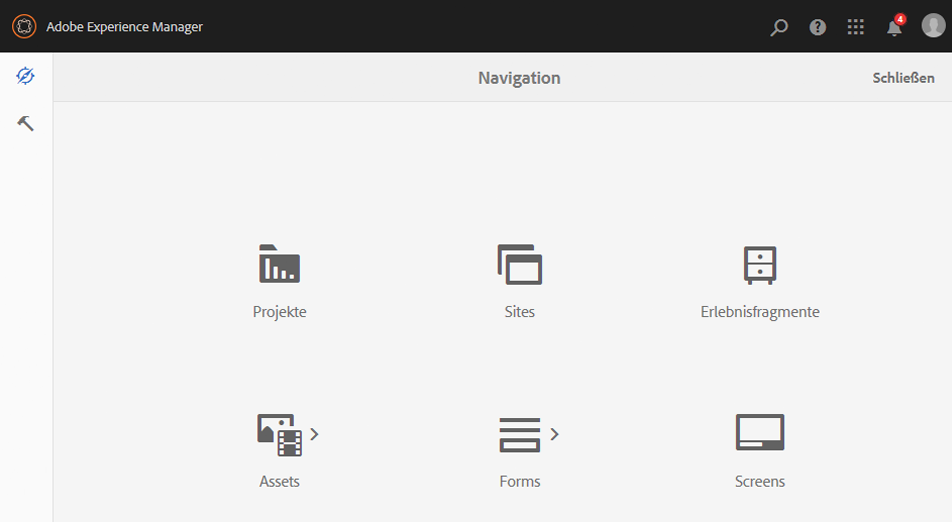
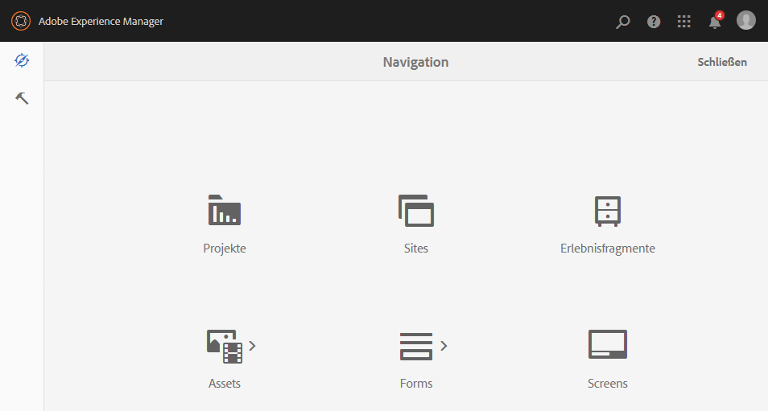

# Admin Consolen{#admin-consoles}

In der Standardeinstellung ist die Option zum Wechseln zur klassischen Benutzeroberfläche über die Admin Consoles nun deaktiviert. Aus diesem Grund werden die Pop-up-Symbole, die beim Bewegen des Mauszeigers auf bestimmte Konsolensymbole angezeigt wurden, um den Zugriff auf die klassische Benutzeroberfläche zu ermöglichen, nicht mehr eingeblendet.

Jede Konsole, die unter `/libs/cq/core/content/nav` über eine klassische Benutzeroberfläche verfügt, kann einzeln wieder aktiviert werden. Die Option **Klassische Benutzeroberfläche** wird für das Konsolensymbol dann wieder angezeigt, wenn Sie den Mauszeiger darauf bewegen.

In diesem Beispiel aktivieren wir die klassische Benutzeroberfläche wieder für die Sites-Konsole.

1. Suchen Sie mithilfe von CRXDE Lite den Knoten, der der Admin Console entspricht, für die Sie die klassische Benutzeroberfläche erneut aktivieren möchten. Sie finden ihn hier:

   `/libs/cq/core/content/nav`

   Beispiel

   [ `http://localhost:4502/crx/de/index.jsp#/libs/cq/core/content/nav`](http://localhost:4502/crx/de/index.jsp#/libs/cq/core/content/nav)

1. Wählen Sie den entsprechenden Knoten der Konsole aus, für die Sie die klassische Benutzeroberfläche wieder aktivieren möchten. Im Beispiel aktivieren wir die klassische Benutzeroberfläche für die Sites-Konsole.

   `/libs/cq/core/content/nav/sites`

1. Erstellen Sie eine Überlagerung mit der Option **Überlagerungsknoten**. Beispiel:

   * **Pfad**: `/apps/cq/core/content/nav/sites`
   * **Pfad für Überlagerung**: `/apps/`
   * **Übereinstimmungstypen abgleichen**: aktiv (Kontrollkästchen aktivieren)

1. Fügen Sie dem überlagerten Knoten die folgende boolesche Eigenschaft hinzu:

   `enableDesktopOnly = {Boolean}true`

1. Die Option **Klassische Benutzeroberfläche** ist in der Admin Console jetzt wieder als Popover-Option verfügbar.

   

Wiederholen Sie diese Schritte für jede Konsole, für die Sie den Zugriff auf die klassische Benutzeroberfläche wieder aktivieren möchten.
