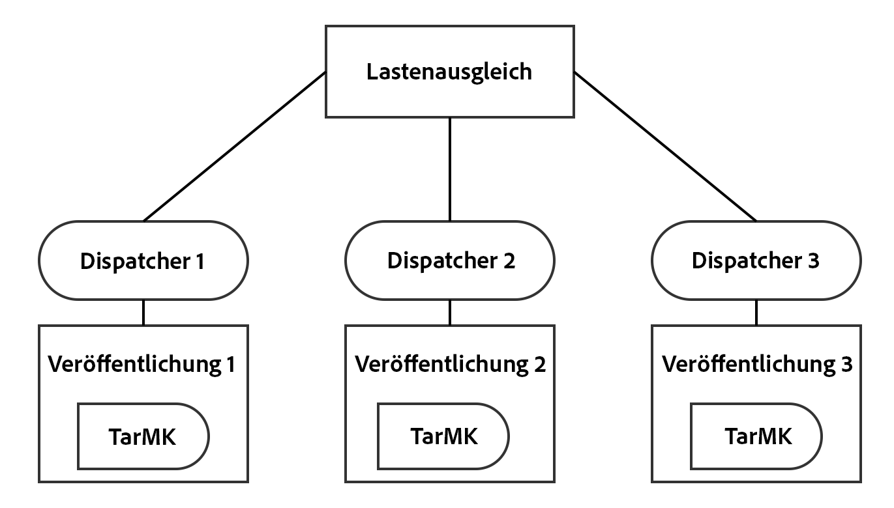
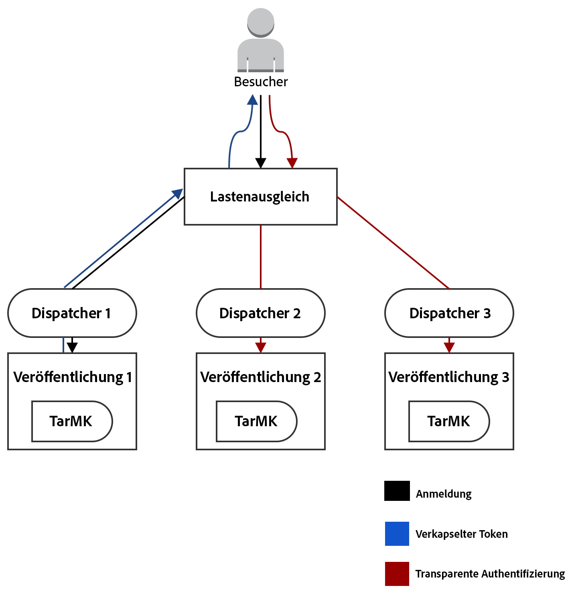
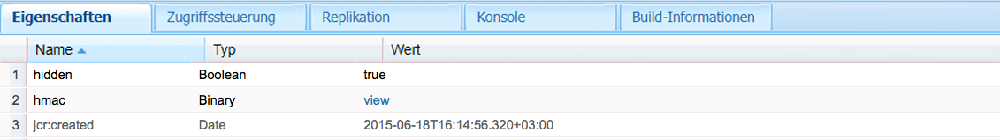

# Unterstützung von Encapsulated Tokens{#encapsulated-token-support}

>[!CAUTION]
>
>AEM 6.4 hat das Ende der erweiterten Unterstützung erreicht und diese Dokumentation wird nicht mehr aktualisiert. Weitere Informationen finden Sie in unserer [technische Unterstützung](https://helpx.adobe.com/de/support/programs/eol-matrix.html). Unterstützte Versionen suchen [here](https://experienceleague.adobe.com/docs/?lang=de).

## Einführung {#introduction}

Standardmäßig verwendet AEM den Token-Authentifizierungs-Handler, um jede Anfrage zu authentifizieren. Um Authentifizierungsanfragen zu erfüllen, benötigt der Token Authentication Handler jedoch Zugriff auf das Repository für jede Anfrage. Dies geschieht, weil Cookies zur Aufrechterhaltung des Authentifizierungsstatus verwendet werden. Logischerweise muss der Status im Repository beibehalten werden, um nachfolgende Anfragen zu validieren. Das bedeutet, dass der Authentifizierungsmechanismus stateful ist.

Dies ist von besonderer Bedeutung für die horizontale Skalierbarkeit. Bei einer Einrichtung mit mehreren Instanzen wie der unten dargestellten Veröffentlichungsfarm kann der Lastenausgleich nicht optimal erreicht werden. Bei der stateful-Authentifizierung ist der beibehaltene Authentifizierungsstatus nur in der Instanz verfügbar, in der der Benutzer zum ersten Mal authentifiziert wird.

Nehmen Sie das folgende Szenario als Beispiel:

Ein Benutzer kann in der Veröffentlichungsinstanz 1 authentifiziert werden. Wenn jedoch eine nachfolgende Anfrage an die Veröffentlichungsinstanz 2 gesendet wird, hat diese Instanz diesen beibehaltenen Authentifizierungsstatus nicht, da dieser Status im Repository der Veröffentlichungsinstanz 1 beibehalten wurde und zwei die Veröffentlichungsinstanz ihr eigenes Repository hat.

Die Lösung dafür besteht darin, Sticky-Verbindungen auf der Ebene des Lastenausgleichs zu konfigurieren. Bei Sticky-Verbindungen wird ein Benutzer immer zur selben Veröffentlichungsinstanz weitergeleitet. Daher ist ein wirklich optimaler Lastenausgleich nicht möglich.

Wenn eine Veröffentlichungsinstanz nicht verfügbar ist, verlieren alle Benutzer, die sich auf dieser Instanz authentifiziert haben, ihre Sitzung. Dies liegt daran, dass zum Überprüfen des Authentifizierungs-Cookies Repository-Zugriff erforderlich ist.

## Statuslose Authentifizierung mit dem Encapsulated Token {#stateless-authentication-with-the-encapsulated-token}

Die Lösung für die horizontale Skalierbarkeit besteht in der „Stateless“-Authentifizierung, bei der die neue Unterstützung von Encapsulated Tokens in AEM genutzt wird.

Das Encapsulated Token ist ein kryptografisches Element, das AEM die sichere Erstellung und Validierung von Authentifizierungsdaten offline ermöglicht, ohne dass ein Zugriff auf das Repository nötig ist. Auf diese Weise kann eine Authentifizierungsanfrage auf allen Veröffentlichungsinstanzen ohne Sticky-Verbindungen erfolgen. Außerdem bietet sie den Vorteil, dass die Authentifizierungsleistung verbessert wird, da nicht bei jeder Authentifizierungsanfrage auf das Repository zugegriffen werden muss.

Wie dies in einer geografisch verteilten Bereitstellung mit MongoMK-Autoren und TarMK-Veröffentlichungsinstanzen funktioniert, sehen Sie in der folgenden Grafik:

>[!NOTE]
>
>Beachten Sie, dass es beim Encapsulated Token um die Authentifizierung geht. Dadurch wird sichergestellt, dass das Cookie validiert werden kann, ohne auf das Repository zugreifen zu müssen. Es ist jedoch weiterhin erforderlich, dass der Benutzer in allen Instanzen vorhanden ist und dass die unter diesem Benutzer gespeicherten Informationen von jeder Instanz aufgerufen werden können.
>
>Wenn beispielsweise ein neuer Benutzer auf der Veröffentlichungsinstanz Nr. 1 erstellt wird, wird er aufgrund der Funktionsweise des Encapsulated Token erfolgreich auf der Veröffentlichungsinstanz Nr. 2 authentifiziert. Wenn der Benutzer nicht in der zweiten Veröffentlichungsinstanz vorhanden ist, ist die Anfrage trotzdem nicht erfolgreich.

## Konfigurieren des gekapselten Tokens {#configuring-the-encapsulated-token}

>[!NOTE]
>Alle Authentifizierungs-Handler, die Benutzer synchronisieren und auf Token-Authentifizierung (wie SAML und OAuth) angewiesen sind, funktionieren nur mit verkapselten Token, wenn:
>
>* fixierbare Sitzungen aktiviert sind oder
>
>* Benutzer bereits in AEM erstellt werden, wenn die Synchronisierung beginnt. Das bedeutet, dass gekapselte Token in Situationen, in denen die Handler während des Synchronisierungsprozesses Benutzer **erstellen**, nicht unterstützt werden.

Beim Konfigurieren des Encapsulated Tokens müssen einige Aspekte beachtet werden:

1. Aufgrund der Verschlüsselung müssen alle Instanzen denselben HMAC-Schlüssel haben. Seit AEM 6.3 wird das Schlüsselmaterial nicht mehr im Repository, sondern im eigentlichen Dateisystem gespeichert. Vor diesem Hintergrund besteht die beste Möglichkeit, die Schlüssel zu replizieren, darin, sie aus dem Dateisystem der Quellinstanz in das Dateisystem der Zielinstanz(en) zu kopieren, in die Sie die Schlüssel replizieren möchten. Weitere Informationen finden Sie unten unter &quot;Replizieren des HMAC-Schlüssels&quot;.
1. Das Encapsulated Token muss aktiviert sein. Dies kann über die Web-Konsole erfolgen.

### Replizieren des HMAC-Schlüssels {#replicating-the-hmac-key}

Der HMAC-Schlüssel liegt als binäre Eigenschaft von `/etc/key` im Repository vor. Sie können ihn separat herunterladen. Klicken Sie dazu auf den Link **Anzeigen** neben der Eigenschaft:

Um den Schlüssel auf weitere Instanzen zu replizieren, führen Sie die folgenden Schritte durch:

1. Greifen Sie auf die AEM-Instanz zu, auf der sich die zu kopierenden Schlüsseldaten befinden. In der Regel handelt es sich dabei um eine Autoreninstanz.
1. Suchen Sie im lokalen Dateisystem das Bundle `com.adobe.granite.crypto.file`. Es kann sich z. B. unter diesem Pfad befinden:

   * &lt;author-aem-install-dir>/crx-quickstart/launchpad/felix/bundle21

   Die Datei `bundle.info` in jedem Ordner identifiziert den Bundle-Namen.

1. Navigieren Sie zum Ordner „data“. Beispiel:

   * `<author-aem-install-dir>/crx-quickstart/launchpad/felix/bundle21/data`

1. die HMAC- und Master-Dateien kopieren.
1. Navigieren Sie dann zur Zielinstanz, auf der Sie den HMAC-Schlüssel duplizieren möchten, und dann zum Ordner „data“. Beispiel:

   * `<publish-aem-install-dir>/crx-quickstart/launchpad/felix/bundle21/data`

1. Fügen Sie die beiden zuvor kopierten Dateien ein.
1. [Aktualisieren Sie das Crypto-Bundle](/help/communities/deploy-communities.md#refresh-the-granite-crypto-bundle), wenn die Zielinstanz bereits ausgeführt wird.

1. Wiederholen Sie die vorherigen Schritte für alle Instanzen, auf denen Sie den Schlüssel replizieren möchten.

#### Aktivieren des Encapsulated Tokens {#enabling-the-encapsulated-token}

Wenn Sie den HMAC-Schlüssel repliziert haben, können Sie das Encapsulated Token über die Web-Konsole aktivieren:

1. Lassen Sie Ihren Browser auf `https://serveraddress:port/system/console/configMgr` verweisen.
1. Suchen Sie nach einem Eintrag namens **Day CRX Token Authentication Handler** und klicken Sie darauf.
1. Aktivieren Sie im daraufhin angezeigten Fenster das Kontrollkästchen **Unterstützung von Encapsulated Tokens aktivieren**. Klicken Sie dann auf **Speichern**.
