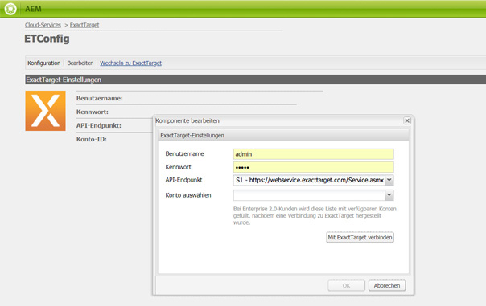
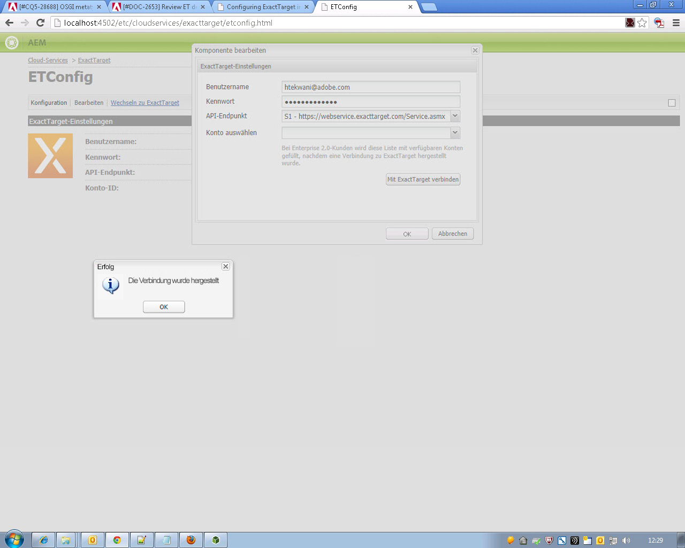
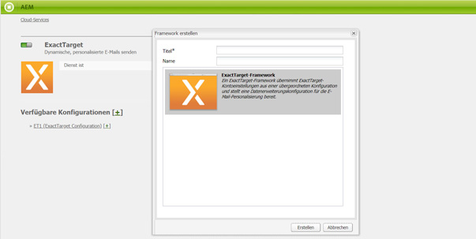
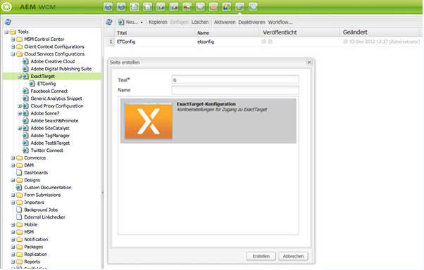

# Integrieren mit ExactTarget{#integrating-with-exacttarget}

>[!CAUTION]
>
>AEM 6.4 hat das Ende der erweiterten Unterstützung erreicht und diese Dokumentation wird nicht mehr aktualisiert. Weitere Informationen finden Sie in unserer [technische Unterstützung](https://helpx.adobe.com/de/support/programs/eol-matrix.html). Unterstützte Versionen suchen [here](https://experienceleague.adobe.com/docs/?lang=de).

Durch die Integration mit ExactTarget können Sie in AEM erstellte E-Mails über ExactTarget verwalten und versenden. Außerdem können Sie die Lead-Management-Funktionen von ExactTarget über AEM-Formulare auf AEM-Seiten verwenden.

Die Integration bietet die folgenden Funktionen:

* Die Möglichkeit, E-Mails in AEM zu erstellen und in ExactTarget zur Verteilung zu veröffentlichen.
* Die Möglichkeit, die Aktion eines AEM Formulars festzulegen, um einen ExactTarget-Abonnenten zu erstellen.

Nachdem ExactTarget konfiguriert wurde, können Sie Newsletter oder E-Mails in ExactTarget veröffentlichen. Siehe [Veröffentlichen von Newslettern in einem E-Mail-Dienst](/help/sites-authoring/personalization.md).

## Erstellen einer ExactTarget-Konfiguration {#creating-an-exacttarget-configuration}

ExactTarget-Konfigurationen können über Cloud Services oder Tools hinzugefügt werden. Beide Methoden werden in diesem Abschnitt beschrieben.

### Konfigurieren von ExactTarget über Cloud Services {#configuring-exacttarget-via-cloudservices}

So erstellen Sie eine ExactTarget-Konfiguration in Cloud Services:

1. Klicken Sie auf der Begrüßungsseite auf **Cloud Services**. (Oder gehen Sie direkt zu `https://<hostname>:<port>/etc/cloudservices.html`.)
1. Klicken Sie auf **ExactTarget** und dann auf **Konfigurieren**. Das ExactTarget-Konfigurationsfenster wird geöffnet.

   

1. Geben Sie einen Titel und optional einen Namen ein und klicken Sie auf **Erstellen**. Das Konfigurationsfenster &quot;ExactTarget-Einstellungen&quot;wird geöffnet.

   

1. Geben Sie den Benutzernamen und das Kennwort ein und wählen Sie einen API-Endpunkt aus (z. B. **https://webservice.exacttarget.com/Service.asmx**).
1. Klicken **Verbindung zu ExactTarget herstellen.** Wenn Sie eine erfolgreiche Verbindung hergestellt haben, wird ein Erfolgsdialogfeld angezeigt. Klicken Sie auf **OK**, um das Fenster zu schließen.

   

1. Wählen Sie ein Konto aus, falls verfügbar. Das Konto richtet sich an Kunden von Enterprise 2.0. Klicken Sie auf **OK**.

   ExactTarget wurde konfiguriert. Sie können die Konfiguration bearbeiten, indem Sie auf **Bearbeiten** klicken. Sie können auf ExactTarget zugreifen, indem Sie auf **Wechseln zu ExactTarget** klicken.

1. AEM bietet jetzt eine Datenerweiterungsfunktion. Sie können Spalten zur Datenerweiterung in ExactTarget importieren. Dies kann konfiguriert werden, indem Sie auf das &quot;+&quot;-Zeichen klicken, das neben der erfolgreich erstellten ExactTarget-Konfiguration angezeigt wird. Jede der vorhandenen Datenerweiterungen kann aus der Dropdown-Liste ausgewählt werden. Weitere Informationen zum Konfigurieren von Datenerweiterungen finden Sie unter [ExactTarget-Dokumentation](https://help.exacttarget.com/en/documentation/exacttarget/subscribers/data_extensions_and_data_relationships).

   Importierte Datenerweiterungsspalten können später über die **Text und Personalisierung** -Komponente.

   

### Konfigurieren von ExactTarget über Tools {#configuring-exacttarget-via-tools}

So erstellen Sie eine ExactTarget-Konfiguration in Tools:

1. Klicken Sie auf der Begrüßungsseite auf **Instrumente**. Oder navigieren Sie über `https://<hostname>:<port>/misadmin#/etc` direkt dorthin.
1. Wählen Sie **Tools** > **Cloud Service-Konfigurationen** > **ExactTarget** aus.
1. Klicken Sie auf **Neu**, um das Fenster **Seite erstellen** zu öffnen.

   

1. Geben Sie die **Titel** und optional die **Name** und klicken Sie auf **Erstellen**.
1. Geben Sie die Konfigurationsinformationen ein, wie in Schritt 4 des vorherigen Verfahrens beschrieben. Führen Sie dieses Verfahren aus, um die Konfiguration von ExactTarget abzuschließen.

### Hinzufügen mehrerer Konfigurationen {#adding-multiple-configurations}

So fügen Sie mehrere Konfigurationen hinzu:

1. Klicken Sie auf der Begrüßungsseite auf **Cloud Services** und klicken Sie auf **ExactTarget**. Klicken Sie auf die Schaltfläche **Konfigurationen anzeigen**, die angezeigt wird, wenn mindestens eine ExactTarget-Konfiguration verfügbar ist. Alle verfügbaren Konfigurationen werden aufgelistet.
1. Klicken Sie auf **+** neben Verfügbare Konfigurationen. Dadurch wird die **Erstellen von Konfigurationen** Fenster. Gehen Sie wie zuvor beschrieben vor, um eine neue Konfiguration zu erstellen.
