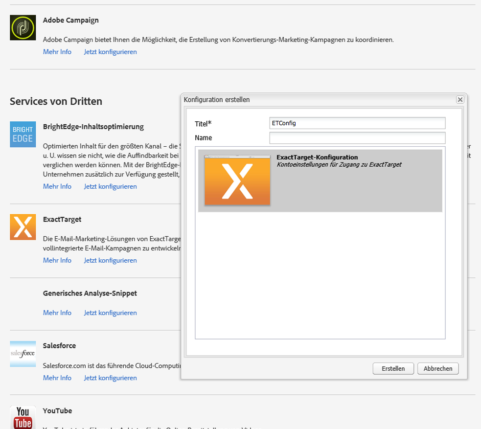

# Integration mit ExactTarget{#integrating-with-exacttarget}

Durch die Integration von AEM in die exakte Zielgruppe können Sie in AEM erstellte E-Mails verwalten und per exakte Zielgruppe senden. Sie können auch die Interessentenverwaltungsfunktionen von Exact Zielgruppe über AEM Formulare auf AEM Seiten verwenden.

Mit der Integration verfügen Sie über die folgenden Funktionen:

* die Möglichkeit, E-Mails in AEM zu erstellen und sie für ExactTarget für den Versand zu veröffentlichen
* die Möglichkeit, die Aktion für ein AEM-Formular festzulegen, einen ExactTarget-Abonnenten zu erstellen

Nach der Konfiguration von ExactTarget können Sie Newsletter oder E-Mails für ExactTarget veröffentlichen. Siehe [Veröffentlichen von Newslettern für einen E-Mail-Dienst](/help/sites-authoring/personalization.md).

## Erstellen einer ExactTarget-Konfiguration {#creating-an-exacttarget-configuration}

Sie können ExactTarget-Konfigurationen über Cloud-Services oder über die Tools hinzufügen. Beide Möglichkeiten werden in diesem Abschnitt beschrieben.

### Konfigurieren von ExactTarget über Cloud-Services {#configuring-exacttarget-via-cloudservices}

So erstellen Sie eine ExactTarget-Konfiguration über Cloud-Services:

1. Klicken Sie auf der Willkommensseite auf **Cloud-Services**. (Or directly access at `https://<hostname>:<port>/etc/cloudservices.html`.)
1. Click **ExactTarget** and then **Configure**. Das ExactTarget-Konfigurationsfenster wird geöffnet.

   

1. Geben Sie einen Titel und optional einen Namen ein und klicken Sie auf **Erstellen**. Das Konfigurationsfenster** ExactTarget-Einstellungen** wird geöffnet.

   

1. Geben Sie den Benutzernamen und das Kennwort ein und wählen Sie einen API-Endpunkt aus (z. B. **https://webservice.exacttarget.com/Service.asmx**).
1. Klicken Sie auf **Mit ExactTarget verbinden.** Wenn die Verbindung erfolgreich hergestellt wurde, wird ein Dialogfeld mit dem entsprechenden Hinweis angezeigt. Klicken Sie auf **OK**, um das Fenster zu beenden.

   

1. Wählen Sie ein Konto aus, falls verfügbar. Das Konto ist für Enterprise 2.0-Kunden. Klicken Sie auf **OK**.

   ExactTarget wurde konfiguriert. Sie können die Konfiguration bearbeiten, indem Sie auf **Bearbeiten** klicken. You can go to ExactTarget by clicking **Go to ExactTarget**.

1. AEM bietet jetzt eine Datenerweiterungsfunktion. Sie können ExactTarget-Datenerweiterungsspalten importieren. Klicken Sie zur Konfiguration auf das Pluszeichen (+), das neben der erfolgreich erstellten ExactTarget-Konfiguration angezeigt wird. Aus der Dropdown-Liste können Sie jede vorhandene Datenerweiterung auswählen. Weitere Informationen zur Konfiguration von Datenerweiterungen finden Sie in der [ExactTarget-Dokumentation](https://help.exacttarget.com/en/documentation/exacttarget/subscribers/data_extensions_and_data_relationships).

   Importierte Datenerweiterungsspalten können Sie später über die Komponente **Text und Personalisierung** nutzen.

   

### Konfigurieren von ExactTarget über die Tools {#configuring-exacttarget-via-tools}

So erstellen Sie eine ExactTarget-Konfiguration über die Tools:

1. Klicken Sie auf der Willkommensseite auf **Tools**. Or navigate there directly by going to `https://<hostname>:<port>/misadmin#/etc`.
1. Wählen Sie **Tools** > **Cloud Service-Konfigurationen** > **ExactTarget** aus.
1. Click **New** to open the **Create Page **window.

   

1. Geben Sie den **Titel** und optional den **Namen** ein und klicken Sie auf **Erstellen**.
1. Geben Sie die Konfigurationsinformationen ein, wie in Schritt 4 des vorherigen Verfahrens beschrieben. Befolgen Sie diesen Vorgang, um die Konfiguration von ExactTarget abzuschließen.

### Hinzufügen mehrerer Konfigurationen {#adding-multiple-configurations}

So fügen Sie mehrere Konfigurationen hinzu:

1. Klicken Sie auf der Willkommensseite auf **Cloud-Services** und dann auf **ExactTarget**. Click on **Show Configurations** button which appears if one or more ExactTarget configurations is available. Alle verfügbaren Konfigurationen werden aufgeführt.
1. Klicken Sie auf das Pluszeichen (**+**) neben „Verfügbare Konfigurationen“. Das Fenster **Konfiguration erstellen** wird geöffnet. Führen Sie die Schritte des vorherigen Konfigurationsverfahrens aus, um eine neue Konfiguration zu erstellen.

