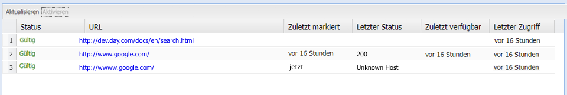

# Der Prüfer für externe Links{#the-external-link-checker}

Ein Prüfer für externe Links wird mit AEM bereitgestellt. Der Link-Prüfer:

* scannt alle Inhaltsseiten
* generiert eine Liste aller gültigen und ungültigen Links
* markiert ungültige Links direkt auf der betroffenen Inhaltsseite als kaputt

## Überprüfen externer Links {#how-to-validate-external-links}

So verwenden Sie den Prüfer für externe Links:

1. Öffnen Sie die **Tools-Konsole**.
1. Doppelklicken Sie auf **Prüfer für externe Links** (entweder im linken oder im rechten Bildschirmbereich). Eine Liste aller externen Links wird erstellt.
1. Um einen bestimmten Link zu überprüfen, wählen Sie ihn aus der Liste aus und klicken Sie auf **Überprüfen**:

   

   Informationen wie:

   * Status des Links
   * URL
   * Zeit seit der letzten Überprüfung des Links
   * Zeit seit der letzten Verfügbarkeit des Links
   * Zeit seit dem letzten Zugriff auf den Link

   werden angezeigt.

1. Auf den einzelnen Inhaltsseiten werden ungültige Links als kaputt angezeigt:

   

