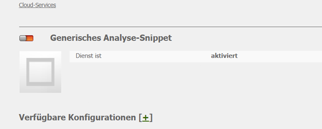
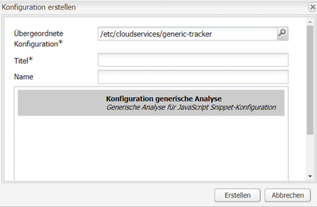
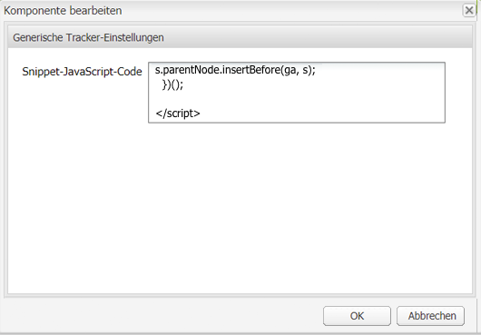
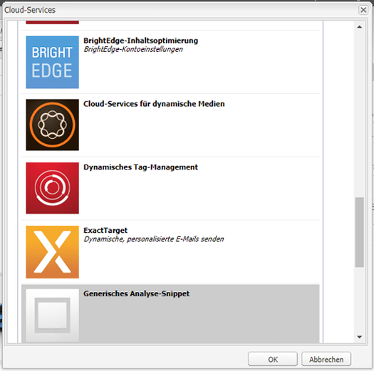
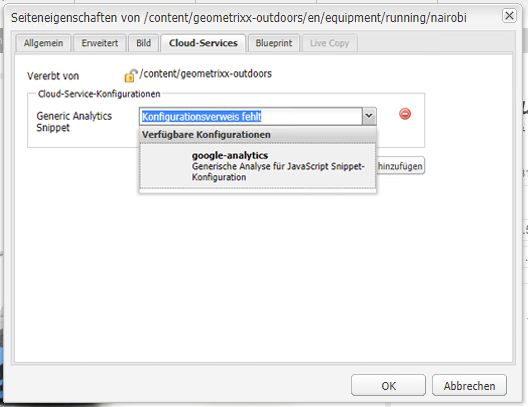

# Analyse mit externen Anbietern{#analytics-with-external-providers}

Analysen können Ihnen wichtige und interessante Informationen darüber liefern, wie Ihre Website verwendet wird.

Zur Integration mit dem entsprechenden Dienst stehen verschiedene vordefinierte Konfigurationen zur Verfügung, z. B.:

* [Adobe Analytics](/help/sites-administering/adobeanalytics.md)
* [Adobe Target](/help/sites-administering/target.md)

Sie können auch Ihre eigene Instanz der **generischen Analyse-Snippets** konfigurieren, um neue Dienstkonfigurationen zu definieren.

Die Informationen werden dann mithilfe von kleinen Code-Snippets erfasst, die den Webseiten hinzugefügt werden. Beispiel:

>[!CAUTION]
>
>Skripte dürfen nicht in `script`-Tags eingeschlossen werden.

```
var _gaq = _gaq || [];
_gaq.push(['_setAccount', 'UA-XXXXX-X']);
_gaq.push(['_trackPageview']);

(function() {
    var ga = document.createElement('script'); ga.type = 'text/javascript'; ga.async = true;
    ga.src = ('https:' == document.location.protocol ? 'https://ssl' : 'https://www') + '.google-analytics.com/ga.js';
    var s = document.getElementsByTagName('script')[0]; s.parentNode.insertBefore(ga, s);
})();
```

Diese Snippets ermöglichen die Erfassung von Daten und Generierung von Berichten. Welche Daten tatsächlich erfasst werden, hängt vom Anbieter und dem tatsächlich verwendeten Code-Snippet ab. Beispielstatistiken beinhalten Folgendes:

* Anzahl der Besucher in einem bestimmten Zeitraum
* Anzahl der besuchten Seiten
* Verwendete Suchbegriffe
* Einstiegsseiten

>[!CAUTION]
>
>Die Demosite &quot;Geometrixx-Outdoors&quot;ist so konfiguriert, dass die in den Seiteneigenschaften angegebenen Attribute an den HTML-Quellcode angehängt werden (direkt über dem `</html>` endtag) in der entsprechenden `js` Skript.
>
>
>Wenn Ihre `/apps` nicht von der standardmäßigen Seitenkomponente übernehmen ( `/libs/foundation/components/page`) müssen Sie (oder Ihre Entwickler) sicherstellen, dass die entsprechenden `js` -Skripte enthalten sind, z. B. durch `cq/cloudserviceconfigs/components/servicescomponents`oder einen ähnlichen Mechanismus verwenden.
>
>
>Ohne diese Komponente funktioniert keiner der Dienste (generisch, Analytics, Target usw.).

## Erstellen von neuen Diensten mit einem generischen Snippet {#creating-a-new-service-with-a-generic-snippet}

Für die Grundkonfiguration:

1. Öffnen Sie die **Tools-Konsole**.

1. Erweitern Sie im linken Bereich die Option **Cloud Service-Konfigurationen**.

1. Doppelklicken Sie auf **Generisches Analyse-Snippet**, um die Seite zu öffnen:

   

1. Klicken Sie auf das Plussymbol (+), um eine neue Konfiguration mithilfe des Dialogfelds hinzuzufügen. Sie müssen mindestens einen Namen, z. B. Google Analytics, zuweisen:

   

1. Klicken Sie auf **Erstellen**, woraufhin sofort das Snippet-Dialogfeld geöffnet wird, und fügen Sie das entsprechende Javascript-Snippet in das Feld ein.

   

1. Klicken Sie zum Speichern auf **OK**.

## Verwenden des neuen Dienstes auf Seiten {#using-your-new-service-on-pages}

Nach der Erstellung der Dienstkonfiguration müssen Sie nun die erforderlichen Seiten konfigurieren, um sie zu nutzen:

1. Navigieren Sie zu der Seite.

1. Öffnen Sie die **Seiteneigenschaften** im Sidekick und wählen Sie dann die Registerkarte **Cloud-Services** aus.

1. Klicken Sie auf **Service hinzufügen** und wählen Sie dann den erforderlichen Dienst aus, zum Beispiel den Dienst **Generisches Analyse-Snippet**:

   

1. Klicken Sie zum Speichern auf **OK**.

1. Sie werden zur Registerkarte **Cloud-Services** zurückgeleitet. Die **Generisches Analytics-Snippet** wird jetzt mit der Meldung aufgeführt `Configuration reference missing`. Wählen Sie in der Dropdown-Liste die spezifische Dienstinstanz aus, zum Beispiel Google Analytics:

   

1. Klicken Sie zum Speichern auf **OK**.

   Das Snippet wird nun angezeigt, wenn Sie die Seitenquelle für die Seite anzeigen.

   Nach Ablauf einer gewissen Zeitspanne können Sie die Statistiken anzeigen, die erfasst wurden.

   >[!NOTE]
   >
   >Wenn die Konfiguration an eine Seite mit untergeordneten Seiten angehängt wird, wird der Dienst von diesen ebenfalls übernommen.
