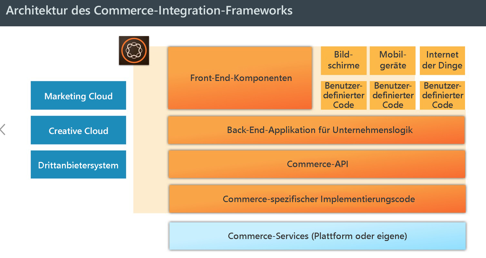
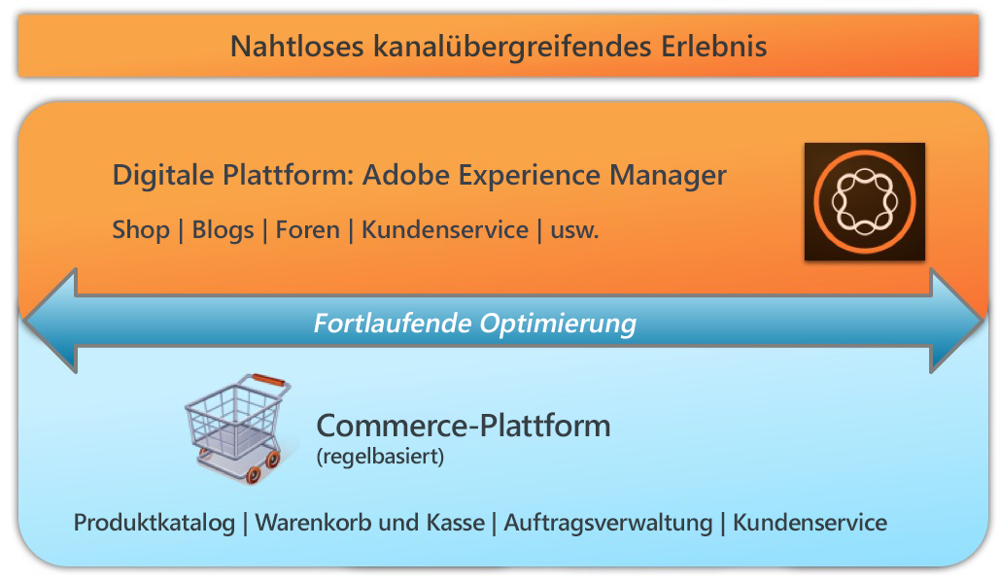

# AEM Commerce – Einhaltung der Datenschutz-Grundverordnung{#aem-commerce-gdpr-readiness}

>[!CAUTION]
>
>AEM 6.4 hat das Ende der erweiterten Unterstützung erreicht und diese Dokumentation wird nicht mehr aktualisiert. Weitere Informationen finden Sie in unserer [technische Unterstützung](https://helpx.adobe.com/de/support/programs/eol-matrix.html). Unterstützte Versionen suchen [here](https://experienceleague.adobe.com/docs/?lang=de).

>[!IMPORTANT]
>
>Die DSGVO dient in den folgenden Abschnitten als Beispiel, die betroffenen Informationen gelten jedoch für alle Datenschutzvorschriften und -bestimmungen. wie DSGVO, CCPA usw.

Die Datenschutz-Grundverordnung der Europäischen Union ist seit Mai 2018 in Kraft. Weitere Informationen finden Sie unter [DSGVO-Seite im Adobe Privacy Center](https://www.adobe.com/de/privacy/general-data-protection-regulation.html).

>[!NOTE]
>
>Siehe [AEM Einhaltung der DSGVO](/help/managing/data-protection-and-privacy.md) für weitere Informationen.

Bei unseren gebrauchsfertigen Commerce-Integrationen bildet AEM die Ebene für das Kundenerlebnis, auf der Dienste genutzt und Daten zurück an die an Kunden gerichtete Commerce-Plattform übermittelt werden, die in einem Headless-Modus ausgeführt wird.

Bei einigen Commerce-Plattformen werden Profilinformationen (`/home/users`) und Commerce-Tokens (zur Anmeldung bei der Commerce-Plattform) in AEM gespeichert. Informationen zu diesen Nutzungsszenarien finden Sie unter [Handhabung von DSGVO-bezogenen Anfragen mit der AEM-Plattform](/help/sites-administering/handling-gdpr-requests-for-aem-platform.md).

## Handhabung von DSGVO-bezogenen Anfragen in AEM Commerce {#handling-gdpr-requests-for-aem-commerce}

Für die Salesforce-Commerce Cloud-Integration speichert AEM Commerce keine DSGVO-relevanten Informationen. Übermitteln Sie entsprechende Anfragen an die [Salesforce Cloud](https://documentation.demandware.com/).

Im Rahmen der Integration mit hybris und IBM WebSphere werden bestimmte Daten in AEM gespeichert. Sie sollten die [DSGVO-Anweisungen für AEM Platform](/help/sites-administering/handling-gdpr-requests-for-aem-platform.md) und berücksichtigen diese Fragen:

1. **Wo werden meine Daten gespeichert/verwendet?** Zwischengespeicherte Benutzerprofilinformationen wie Name, Commerce-Benutzerkennung, Token, Kennwort, Adressdaten usw. werden in AEM angezeigt.
1. **Für wen gebe ich die erfassten DSGVO-Daten frei?** Jegliche in Bezug auf die DSGVO relevanten Daten, die in AEM Commerce aktualisiert werden, werden nicht gespeichert (mit Ausnahme relevanter Profilinformationen, wie oben beschrieben), jedoch mittels Proxy zurück an die Commerce-Plattform übermittelt.
1. **Löschen meiner Benutzerdaten**? Löschen Sie das Benutzerprofil in AEM und rufen Sie die Benutzerlöschung auf der Commerce-Plattform auf.

>[!NOTE]
>
>Konsultieren Sie bei Bedarf die [hybris Wiki](https://wiki.hybris.com/) oder die [Dokumentation zu Websphere Commerce](https://www-01.ibm.com/support/docview.wss?uid=swg27036450).
