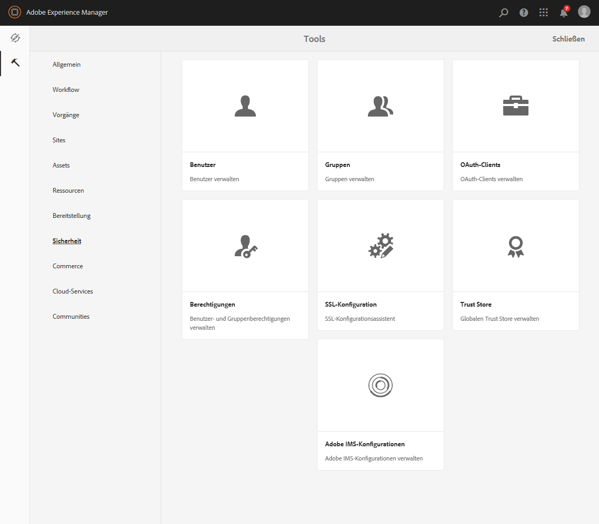
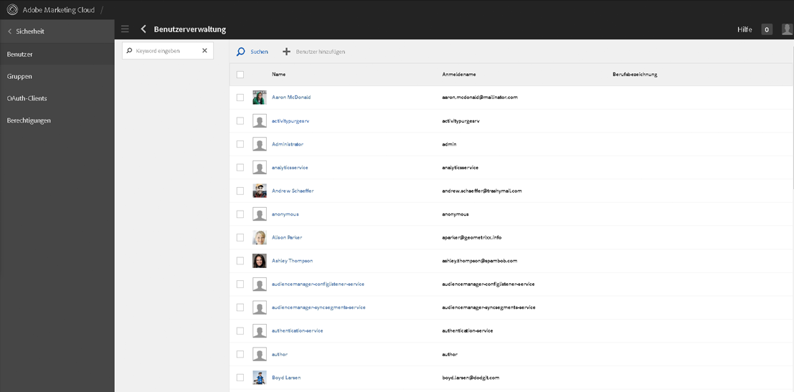
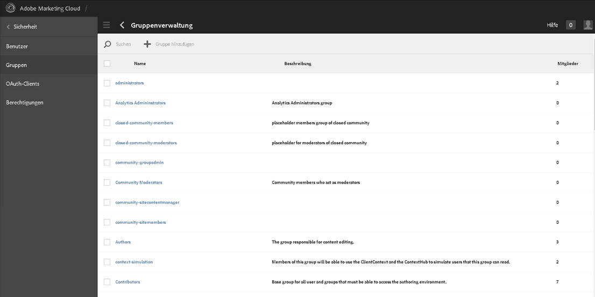
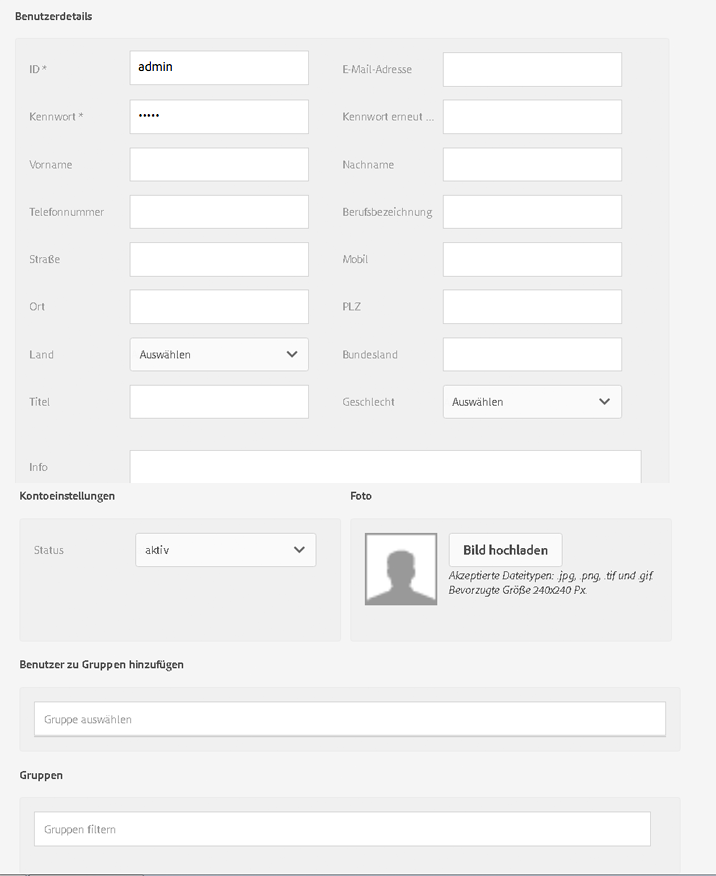
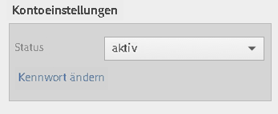
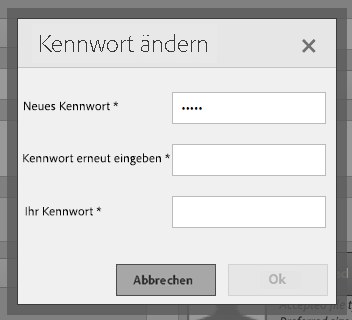
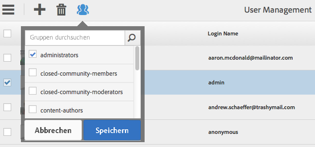
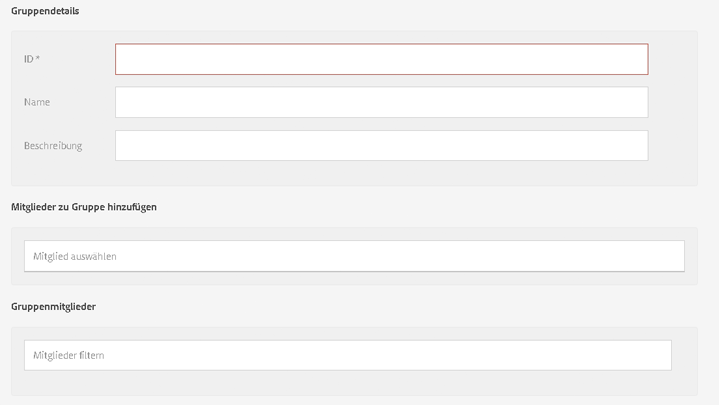

# Granite-Vorgänge – Benutzer- und Gruppenverwaltung{#granite-operations-user-and-group-administration}

>[!CAUTION]
>
>AEM 6.4 hat das Ende der erweiterten Unterstützung erreicht und diese Dokumentation wird nicht mehr aktualisiert. Weitere Informationen finden Sie in unserer [technische Unterstützung](https://helpx.adobe.com/de/support/programs/eol-matrix.html). Unterstützte Versionen suchen [here](https://experienceleague.adobe.com/docs/?lang=de).

Da Granite die CRX-Repository-Implementierung der JCR-API-Spezifikation enthält, verfügt es über eine eigene Benutzer- und Gruppenverwaltung.

Diese Konten bilden die Grundlage der [AEM-Konten](/help/sites-administering/security.md). Sämtliche in der Granite-Verwaltung durchgeführten Kontoänderungen werden widergespiegelt, falls/wenn auf die Konten über die [AEM-Benutzerkonsole](/help/sites-administering/security.md#accessing-user-administration-with-the-security-console) (z.B. `http://localhost:4502/useradmin`) zugegriffen wird. In der Konsole AEM Benutzer können Sie auch die Berechtigungen und andere AEM verwalten.

Granite-Benutzer- und Gruppenverwaltungskonsolen sind beide über das **[Instrumente](/help/sites-administering/tools-consoles.md)** Konsole der Touch-optimierten Benutzeroberfläche:

Entweder **Benutzer** oder **Gruppen** über die Tools-Konsole die entsprechende Konsole öffnen. In beiden können Sie entweder über das Kontrollkästchen und dann über Aktionen in der Symbolleiste oder durch Öffnen der Kontodetails über den Link unter **Name**.

* [Benutzerverwaltung](#user-administration)

   

   Die **Benutzer** Konsolenlisten:

   * Benutzername
   * den Anmeldenamen (Kontonamen) des Benutzers;
   * Titel, die dem Konto zugewiesen wurden.

* [Gruppenverwaltung](#group-administration)

   

   Die **Gruppen** Konsolenlisten:

   * den Gruppennamen
   * die Gruppenbeschreibung
   * die Anzahl der Benutzer/Gruppen in der Gruppe

## Benutzerverwaltung {#user-administration}

### Hinzufügen neuer Benutzer {#adding-a-new-user}

1. Verwenden Sie die **Benutzer hinzufügen** Symbol:

   

1. Die **Benutzer erstellen** Das Formular wird geöffnet:

   

   Hier können Sie die Benutzerdetails für das Konto eingeben (die meisten entsprechen dem Standard und sind selbsterklärend):

   * **ID**

      Dies ist die eindeutige Kennung des Benutzerkontos. Diese Angabe ist obligatorisch und darf keine Leerzeichen enthalten.

   * **E-Mail-Adresse**
   * **Kennwort**

      Ein Kennwort muss angegeben werden.

   * **Kennwortwdh.**

      Diese zur Bestätigung des Kennworts erforderliche Angabe ist obligatorisch.

   * **Vorname**
   * **Nachname**
   * **Telefonnummer**
   * **Titel des Auftrags**
   * **Straße**
   * **Mobilgerät**
   * **Stadt**
   * **PLZ**
   * **Land**
   * **Status**
   * **Titel**
   * **Geschlecht**
   * **Info**
   * **Kontoeinstellungen**

      * **Status**
Sie können das Konto als 
**aktiv** oder **inaktiv** markieren.
   * **Foto**

      Hier können Sie ein Foto für einen Avatar hochladen.

      Akzeptierte Dateitypen: `.jpg .png .tif .gif`

      Bevorzugte Größe: `240x240px`

   * **Benutzer zu Gruppen hinzufügen**

      Wählen Sie über die Auswahl-Dropdown-Liste die Gruppen aus, denen der Benutzer als Mitglied angehören soll. Vor dem Speichern können Sie ggf. eine getroffene Auswahl mit dem **X** neben dem Namen aufheben.

   * **Gruppen**

      Eine Liste der Gruppen, in denen der Benutzer derzeit Mitglied ist. Verwenden Sie die **X** durch den Namen, der vor dem Speichern deaktiviert werden soll.

1. Wenn Sie das Benutzerkonto definiert haben, verwenden Sie:

   * **Abbrechen** , um die Registrierung abzubrechen.
   * **Speichern** , um die Registrierung abzuschließen. Die Erstellung des Benutzerkontos wird mit einer Meldung bestätigt.

### Bearbeiten vorhandener Benutzer {#editing-an-existing-user}

1. Rufen Sie die Benutzerdetails über den Link unterhalb des Benutzernamens in der Benutzer-Konsole auf.

1. Sie können nun die Details wie unter [Hinzufügen neuer Benutzer](#adding-a-new-user) bearbeiten.

1. Rufen Sie die Benutzerdetails über den Link unterhalb des Benutzernamens in der Benutzer-Konsole auf.

1. Sie können nun die Details wie unter [Hinzufügen neuer Benutzer](#adding-a-new-user) bearbeiten.

### Ändern von Kennwörtern vorhandener Benutzer {#changing-the-password-for-an-existing-user}

1. Rufen Sie die Benutzerdetails über den Link unterhalb des Benutzernamens in der Benutzer-Konsole auf.

1. Sie können nun die Details wie unter [Hinzufügen neuer Benutzer](#adding-a-new-user) bearbeiten. Unter **Kontoeinstellungen** ist ein Link **Kennwort ändern** vorhanden.

   

1. Das Dialogfeld **Kennwort ändern** wird geöffnet. Geben Sie das neue Kennwort zusammen mit Ihrem Kennwort ein und geben Sie es erneut ein. Bestätigen Sie die Änderungen mit **OK**.

   

   Über eine Meldung wird bestätigt, dass das Kennwort geändert wurde.

### Schnellgruppenzuweisung {#quick-group-assignment}

1. Verwenden Sie das Kontrollkästchen, um einen oder mehrere Benutzer zu kennzeichnen.
1. Verwenden Sie das Symbol **Gruppen**:

   

   Hierdurch wird die Dropdown-Liste für die Gruppenauswahl geöffnet:

   

1. Im Auswahlfeld können Sie per Aus-/Abwahl festlegen, welchen Gruppen das Benutzerkonto angehören soll.

1. Wählen Sie eine der folgenden Optionen aus, nachdem Sie die Gruppen zugewiesen oder deren Zuweisung aufgehoben haben:

   * **Abbrechen** zum Verwerfen der Änderungen
   * **Speichern** zum Bestätigen der Änderungen

### Löschen vorhandener Benutzerdetails {#deleting-existing-user-details}

1. Verwenden Sie das Kontrollkästchen, um einen oder mehrere Benutzer zu kennzeichnen.
1. Löschen Sie Benutzerdetails mit dem Symbol **Löschen**:

   

1. Sie werden zum Bestätigen des Löschvorgangs aufgefordert. Daraufhin wird durch eine Meldung bestätigt, dass der Löschvorgang tatsächlich durchgeführt wurde.

## Gruppenverwaltung {#group-administration}

### Hinzufügen einer neuen Gruppe {#adding-a-new-group}

1. Verwenden Sie das Symbol Gruppe hinzufügen :

   

1. Die **Gruppe erstellen** Das Formular wird geöffnet:

   

   Hier können Sie die Gruppendetails eingeben:

   * **ID**

      Dies ist die eindeutige Kennung der Gruppe. Diese Angabe ist obligatorisch und darf keine Leerzeichen enthalten.

   * **Name**

      Der Name für die Gruppe; dieser wird in der Gruppenkonsole angezeigt.

   * **Beschreibung**

      Eine Beschreibung der Gruppe.

   * **Mitglieder zu Gruppe hinzufügen**

      Wählen Sie über die Auswahl-Dropdown-Liste die Benutzer aus, die der Gruppe hinzugefügt werden sollen. Vor dem Speichern können Sie ggf. eine getroffene Auswahl mit dem **X** neben dem Namen aufheben.

   * **Gruppenmitglieder**

      Eine Liste der Benutzer in der Gruppe. Verwenden Sie die **X** durch den Namen, der vor dem Speichern deaktiviert werden soll.

1. Wenn Sie die Gruppe definiert haben, verwenden Sie:

   * **Abbrechen** , um die Registrierung abzubrechen.
   * **Speichern** , um die Registrierung abzuschließen. Die Erstellung der Gruppe wird mit einer Meldung bestätigt.

### Bearbeiten vorhandener Gruppen {#editing-an-existing-group}

1. Rufen Sie die Gruppendetails über den Link unterhalb des Gruppennamens in der Gruppenkonsole auf.

1. Sie können nun die Details wie unter [Hinzufügen neuer Gruppen](#adding-a-new-group) bearbeiten.

### Kopieren einer vorhandenen Gruppe {#copying-an-existing-group}

1. Verwenden Sie das Kontrollkästchen, um eine Gruppe zu kennzeichnen.
1. Kopieren Sie Gruppendetails mit dem Symbol **Kopieren**:

   

1. Das Formular **Gruppeneinstellungen bearbeiten** wird geöffnet.

   Die Gruppenkennung entspricht der ursprünglichen, vorangestellt ist allerdings der Hinweis `Copy of`. Sie müssen die Kennung bearbeiten, da IDs keine Leerzeichen enthalten dürfen. Alle anderen Angaben bleiben gegenüber dem Original unverändert.

   Sie können nun die Details wie unter [Hinzufügen neuer Gruppen](#adding-a-new-group) bearbeiten.

### Löschen einer vorhandenen Gruppe {#deleting-an-existing-group}

1. Verwenden Sie das Kontrollkästchen, um eine oder mehrere Gruppen zu kennzeichnen.
1. Löschen Sie Gruppendetails mit dem Symbol **Löschen**:

   

1. Sie werden zum Bestätigen des Löschvorgangs aufgefordert. Daraufhin wird über eine Meldung bestätigt, dass der Löschvorgang tatsächlich durchgeführt wurde.
