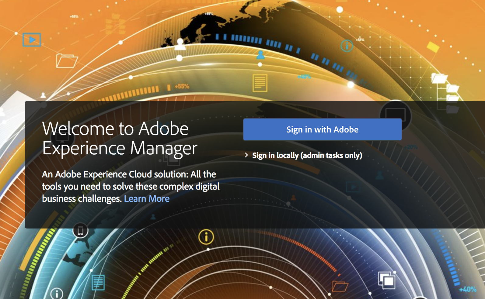
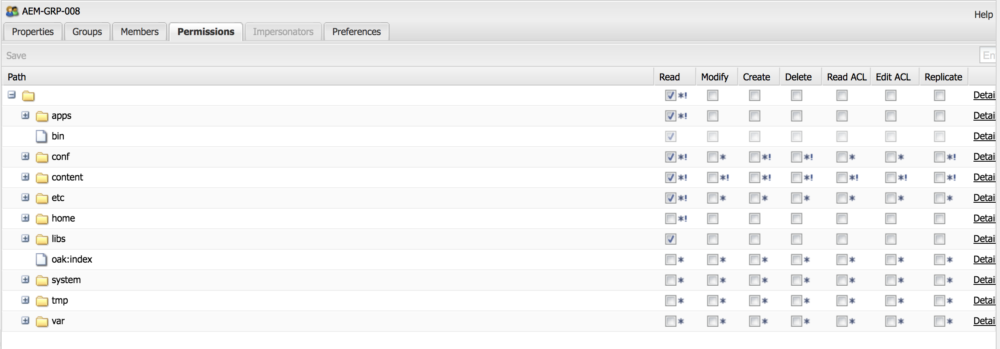

# Unterstützung der Adobe IMS-Authentifizierung und der Admin Console für AEM Managed Services {#adobe-ims-authentication-and-admin-console-support-for-aem-managed-services}

>[!CAUTION]
>
>AEM 6.4 hat das Ende der erweiterten Unterstützung erreicht und diese Dokumentation wird nicht mehr aktualisiert. Weitere Informationen finden Sie in unserer [technische Unterstützung](https://helpx.adobe.com/de/support/programs/eol-matrix.html). Unterstützte Versionen suchen [here](https://experienceleague.adobe.com/docs/?lang=de).

>[!NOTE]
>
>Beachten Sie, dass diese Funktion nur für Kunden von Adobe Managed Services verfügbar ist.

## Einführung {#introduction}

AEM 6.4.3.0 führt Admin Console-Unterstützung für AEM Instanzen und Adobe IMS(Identity Management System)-basierte Authentifizierung für **AEM Managed Services** -Kunden.

AEM Onboarding der Admin Console ermöglicht es AEM Managed Services-Kunden, alle Experience Cloud-Benutzer in einer Konsole zu verwalten. Benutzerinnen und Benutzer sowie Gruppen können Produktprofilen zugeordnet werden, die mit AEM-Instanzen verknüpft sind, sodass sie sich bei einer bestimmten Instanz anmelden können.

## Wichtige Highlights {#key-highlights}

* AEM IMS-Authentifizierungsunterstützung ist nur für AEM-Autoren, -Administratoren oder -Entwickler, nicht für externe Endbenutzer von Kunden-Sites wie Site-Besucher
* Die Admin Console repräsentiert AEM Managed Services-Kunden als IMS-Organisationen und ihre Instanzen als Produktkontexte. Kundensystem- und Produktadmins können den Zugriff auf Instanzen verwalten.
* AEM Managed Services synchronisiert Kundentopologien mit der Admin Console. Es wird eine Instanz AEM Managed Services-Produktkontexts pro Instanz in der Admin Console geben.
* Produktprofile in Admin Console bestimmen, auf welche Instanzen ein Benutzer zugreifen kann.
* Federated Authentifizierung mit eigenen SAML 2-kompatiblen Identitätsanbietern des Kunden wird unterstützt
* Es werden nur Enterprise IDs oder Federated IDs (für Single Sign-On für Kunden) unterstützt, nicht personenbezogene Adoben-IDs.
* Die Benutzerverwaltung (in Adobe Admin Console) wird weiterhin den Kundenadministratoren gehören.

## Architektur {#architecture}

Die IMS-Authentifizierung funktioniert mithilfe des OAuth-Protokolls zwischen AEM und dem Adobe IMS-Endpunkt. Wenn Benutzer zu IMS hinzugefügt wurden und eine Adobe ID haben, können sie sich mit den IMS-Anmeldeinformationen bei AEM Managed Services-Instanzen anmelden.

Der Benutzer-Anmeldefluss wird unten gezeigt, der Benutzer wird zur SSO-Validierung zu IMS und optional zum Kunden-IDP weitergeleitet und dann zurück zu AEM.

## Einrichtung {#how-to-set-up}

### Onboarding von Organisationen zur Admin Console {#onboarding-organizations-to-admin-console}

Das Onboarding von Kunden zur Admin Console ist eine Voraussetzung für die Verwendung von Adobe IMS zur AEM Authentifizierung.

Als ersten Schritt sollte Kundschaft eine Organisation in Adobe IMS bereitstellen. Adobe Enterprise-Kunden werden im [Adobe Admin Console](https://helpx.adobe.com/de/enterprise/using/admin-console.html).

AEM Managed Services-Kunden bereits über eine Organisation verfügen sollten. Im Rahmen der IMS-Bereitstellung werden die Kundeninstanzen in der Admin Console für die Verwaltung von Benutzerberechtigungen und -zugriff zur Verfügung gestellt.

Der Wechsel zu IMS zur Benutzerauthentifizierung ist eine gemeinsame Maßnahme zwischen AMS und Kunden, wobei jede Seite eigene Workflows abschließen muss.

Sobald ein Kunde als „IMS-Organisation“ existiert und AMS die Bereitstellung des Kunden für IMS abgeschlossen hat, lautet die Zusammenfassung der erforderlichen Konfigurationsschritte wie folgt:

1. Der festgelegte Systemadministrator erhält eine Einladung zur Anmeldung bei der Admin Console
1. Die Systemadministrator beansprucht die Domain, um die Eigentümerschaft der Domain zu bestätigen (in diesem Beispiel acme.com).
1. Der Systemadministrator richtet Benutzerverzeichnisse ein.
1. Der Systemadministrator konfiguriert den Identitätsanbieter (IDP) in der Admin Console für die SSO-Einrichtung.
1. Die bzw. der AEM-Admin verwaltet die lokalen Gruppen, Berechtigungen und Zugriffsrechte wie gewohnt. Siehe „Benutzer- und Gruppensynchronisierung“.

>[!NOTE]
>
>Weitere Informationen zu den Grundlagen zur Identitätsverwaltung von Adobe, einschließlich der IDP-Konfiguration, finden Sie [auf dieser Seite](https://helpx.adobe.com/de/enterprise/using/set-up-identity.html).
>
>Weitere Informationen zur Verwaltung und Admin Console von Unternehmen finden Sie im Artikel [diese Seite](https://helpx.adobe.com/de/enterprise/managing/user-guide.html).

### Onboarding von Benutzern zur Admin Console {#onboarding-users-to-the-admin-console}

Je nach der Größe des Kunden und den bevorzugten Einstellungen gibt es drei Möglichkeiten, Benutzerinnen und Benutzer hinzuzufügen:

1. Manuelles Erstellen von Benutzern und Gruppen in Admin Console
1. Hochladen einer CSV-Datei mit Benutzern
1. Synchronisieren Sie Benutzer und Gruppen im Active Directory des Unternehmens des Kunden.

#### Manuelles Hinzufügen über die Admin Console-Benutzeroberfläche {#manual-addition-through-admin-console-ui}

Benutzer und Gruppen können manuell in der Admin Console-Benutzeroberfläche erstellt werden. Diese Methode kann verwendet werden, wenn nicht viele Benutzer zu verwalten sind. Beispielsweise eine Anzahl von weniger als 50 AEM Benutzern.

Benutzer können auch manuell erstellt werden, wenn der Kunde diese Methode bereits zur Verwaltung anderer Adobe-Produkte wie Analytics-, Target- oder Creative Cloud-Anwendungen verwendet.

#### Datei-Upload in der Admin Console-Benutzeroberfläche {#file-upload-in-the-admin-console-ui}

Zur einfachen Handhabung der Benutzererstellung können Sie eine CSV-Datei hochladen, um eine große Anzahl von Benutzenden hinzuzufügen:

#### Tool zur Benutzersynchronisierung {#user-sync-tool}

Mit dem Tool zur Benutzersynchronisierung (kurz UST) können Unternehmenskunden Adobe-Benutzer erstellen oder verwalten, die Active Directory oder andere getestete OpenLDAP-Verzeichnisdienste verwenden. Die Zielbenutzer sind IT Identity-Administratoren (Enterprise Directory- und Systemadministratoren), die das Tool installieren und konfigurieren können. Das Open-Source-Tool ist anpassbar, sodass Kunden es an ihre jeweiligen Anforderungen anpassen können.

Wenn die Benutzersynchronisierung ausgeführt wird, ruft sie eine Benutzerliste aus dem Active Directory des Unternehmens (oder einer anderen kompatiblen Datenquelle) ab und vergleicht sie mit der Benutzerliste in der Admin Console. Anschließend ruft es die Adobe User Management-API auf, damit die Admin Console mit dem Verzeichnis der Organisation synchronisiert wird. Der Änderungsfluss ist vollständig einseitig. Alle in der Admin Console vorgenommenen Änderungen werden nicht in das Verzeichnis übertragen.

Das Tool ermöglicht es dem Systemadministrator, Benutzergruppen im Kundenverzeichnis mit der Produktkonfiguration und Benutzergruppen in der Admin Console zuzuordnen. Die neue UST-Version ermöglicht auch die dynamische Erstellung von Benutzergruppen in der Admin Console.

Um die Benutzersynchronisierung einzurichten, muss die Organisation Anmeldeinformationen erstellen. Die Schritte hierfür sind dieselben wie bei der [User Management-API](https://www.adobe.io/apis/cloudplatform/usermanagement/docs/setup.html).

Die Benutzersynchronisierung steht über das Adobe Github-Repository an diesem Speicherort zur Verfügung:

[https://github.com/adobe-apiplatform/user-sync.py/releases/latest](https://github.com/adobe-apiplatform/user-sync.py/releases/latest)

Hinweis: Eine Pre-Release-Version 2.4RC1 mit Unterstützung für dynamische Gruppenerstellung steht hier zur Verfügung: [https://github.com/adobe-apiplatform/user-sync.py/releases/tag/v2.4rc1](https://github.com/adobe-apiplatform/user-sync.py/releases/tag/v2.4rc1)

Die wichtigsten Funktionen dieser Version sind die Möglichkeit, neue LDAP-Gruppen für die Benutzermitgliedschaft in der Admin Console dynamisch zuzuordnen und dynamische Benutzergruppen zu erstellen.

Weitere Informationen zu den neuen Gruppenfunktionen finden Sie hier:

[https://github.com/adobe-apiplatform/user-sync.py/blob/v2/docs/en/user-manual/advanced_configuration](https://github.com/adobe-apiplatform/user-sync.py/blob/v2/docs/en/user-manual/advanced_configuration.md#additional-group-options)

>[!NOTE]
>
>Weitere Informationen zum User Sync Tool finden Sie auf der [Dokumentationsseite](https://adobe-apiplatform.github.io/user-sync.py/en/).
>
>
>Das User Sync Tool muss mit dem [hier](https://adobe-apiplatform.github.io/umapi-documentation/en/UM_Authentication.html) beschriebenen Verfahren als Adobe I/O-Client-UMAPI registriert werden.
>
>Die Dokumentation zur Adobe I/O-Konsole finden Sie [hier](https://www.adobe.io/apis/cloudplatform/console.html).
>
>
>Die User Management-API, die vom Tool zur Benutzersynchronisierung verwendet wird, wird in diesem Abschnitt behandelt [location](https://www.adobe.io/apis/cloudplatform/umapi-new.html).

>[!NOTE]
>
>Die AEM IMS-Konfiguration wird vom Adobe Managed Services-Team vorgenommen. Der Kundenadministrator kann sie jedoch gemäß seinen Anforderungen ändern (z. B. automatische Gruppenmitgliedschaft oder Gruppenzuordnung). Der IMS-Client wird auch von Ihrem Managed Services-Team registriert.

## Verwendung {#how-to-use}

### Verwalten von Produkten und Benutzerzugriff in der Admin Console {#managing-products-and-user-access-in-admin-console}

Wenn sich der Produktadministrator des Kunden bei Admin Console anmeldet, sieht er mehrere Instanzen des AEM Managed Services-Produktkontexts, wie unten dargestellt:

In diesem Beispiel hat die Organisation *AEM-MS-Onboard* 32 Instanzen mit unterschiedlichen Topologien und Umgebungen wie Staging, Produktion usw.

Sie können die Instanzdetails überprüfen, um die Instanz zu identifizieren:

Unter jeder Produktkontextinstanz ist ein zugehöriges Produktprofil vorhanden. Dieses Produktprofil wird zum Zuweisen der Zugriffsrechte für Benutzende und Gruppen verwendet.

Alle unter diesem Produktprofil hinzugefügten Benutzenden und Gruppen können sich wie im Beispiel unten gezeigt bei dieser Instanz anmelden:

### Anmeldung bei AEM {#logging-into-aem}

#### Lokale Administratoranmeldung {#local-admin-login}

AEM können lokale Anmeldungen für Admin-Benutzer weiterhin unterstützen, da der Anmeldebildschirm eine Option zur lokalen Anmeldung bietet:

#### IMS-basierte Anmeldung {#ims-based-login}

Für andere Benutzende kann die IMS-basierte Anmeldung verwendet werden, sobald IMS für die Instanz konfiguriert wurde. Der Benutzer klickt zunächst auf die **Mit Adobe anmelden** wie unten gezeigt:

Anschließend werden sie zum IMS-Anmeldebildschirm weitergeleitet und geben ihre Anmeldeinformationen ein:

Wenn während der Ersteinrichtung der Admin Console Federated IDP konfiguriert wurde, wird der Benutzer zum Kunden-IDP für die einmalige Anmeldung weitergeleitet.

Im folgenden Beispiel ist Okta der IDP:

Sobald die Authentifizierung abgeschlossen ist, wird die Benutzerin bzw. der Benutzer zurück zu AEM weitergeleitet und angemeldet:

### Migrieren vorhandener Benutzer {#migrating-existing-users}

Für bestehende AEM-Instanzen, die eine andere Authentifizierungsmethode verwenden und jetzt auf IMS migriert werden, muss ein Migrationsschritt durchgeführt werden.

Vorhandene Benutzerinnen und Benutzer im AEM-Repository (lokal über LDAP oder SAML hinzugefügt) können mit dem User Migration Utility migriert werden, damit sie auf IMS als IDP verweisen.

Dieses Dienstprogramm wird von Ihrem AMS-Team im Rahmen der IMS-Bereitstellung ausgeführt.

### Verwalten von Berechtigungen und ACLs in AEM {#managing-permissions-and-acls-in-aem}

Zugriffssteuerung und Zugriffsberechtigungen werden weiterhin in AEM verwaltet. Dies kann mithilfe separater Benutzergruppen aus IMS erreicht werden (z. B. AEM-GRP-008 im Beispiel unten), sowie durch lokale Gruppen, in denen die Berechtigungen und Zugriffsrechte definiert sind. Die von IMS synchronisierten Benutzergruppen können lokalen Gruppen zugewiesen werden und die Berechtigungen erben.

Im Beispiel unten werden der lokalen Gruppe *Dam_Users* synchronisierte Gruppen hinzugefügt.

Hier wurde ein Benutzer auch einigen Gruppen in der Admin Console zugewiesen. ( Bitte beachten Sie, dass die Benutzer und Gruppen mit dem Benutzersynchronisierungstool aus LDAP synchronisiert oder lokal erstellt werden können. Weitere Informationen finden Sie im Abschnitt . **Onboarding von Benutzern zur Admin Console** weiter oben).

>[!NOTE]
>
>Benutzergruppen werden nur synchronisiert, wenn sich Benutzerinnen und Benutzer bei der Instanz anmelden.

Die Benutzerin bzw. der Benutzer ist Teil der folgenden Gruppen in IMS:

Wenn sich die Benutzerin bzw. der Benutzer anmeldet, werden die Gruppenmitgliedschaften wie unten dargestellt synchronisiert:

In AEM können die aus IMS synchronisierten Benutzergruppen vorhandenen lokalen Gruppen (z. B. DAM-Benutzern) als Mitglieder hinzugefügt werden.

Wie unten gezeigt, die Gruppe *AEM-GRP_008* erbt die Berechtigungen und Berechtigungen von DAM-Benutzern. Dies ist eine effektive Möglichkeit zur Verwaltung von Berechtigungen für synchronisierte Gruppen und wird häufig auch bei LDAP-basierten Authentifizierungsmethoden verwendet.

