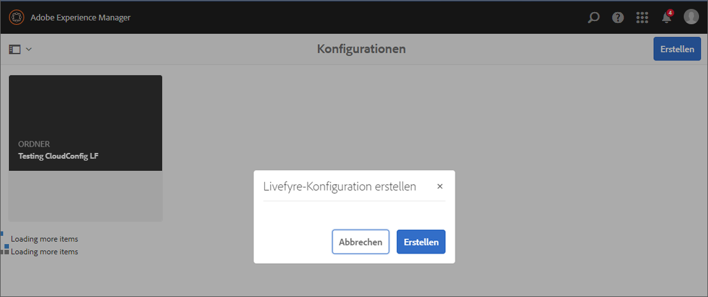
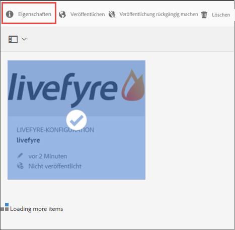
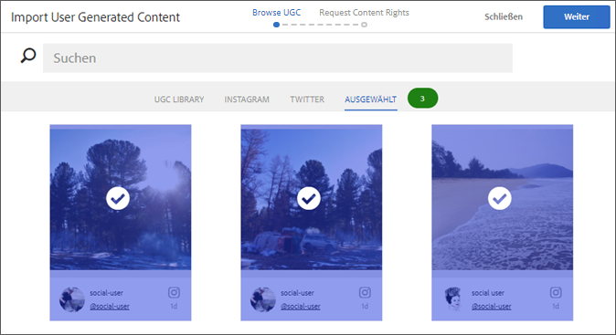

# Integrieren mit Livefyre{#integrating-with-livefyre}

Erfahren Sie, wie Sie die branchenführenden Kuratierungsfunktionen von Livefyre in Ihre AEM 6.4-Instanz integrieren und so wertvollen benutzergenerierten Inhalt aus sozialen Netzwerken innerhalb von Minuten auf Ihrer Site veröffentlichen können.

## Erste Schritte {#getting-started}

### Installieren des Livefyre-Pakets für AEM {#install-livefyre-package-for-aem}

In AEM 6.4 ist das Livefyre-Feature Pack 1.2.6 vorinstalliert. Dieses Paket beinhaltet nur die eingeschränkte Livefyre-Integration in AEM Sites und muss vor der Installation eines aktualisierten Pakets deinstalliert werden. Das neueste Paket ermöglicht eine vollständige Integration von Livefyre in AEM, einschließlich Sites, Assets und Commerce.

>[!NOTE]
>
>Einige Funktionen des AEM-LF-Pakets hängen vom Social Component Framework (SCF) ab. Wenn Sie das Livefyre-Feature Pack als Teil einer Website verwenden, die keine Communities-Site ist, müssen Sie *cq.social.scf* als eine Abhängigkeit in den clientlibs vom Typ „author“ der Website deklarieren. Wenn Sie das LF-Feature Pack als Teil einer Communities-Website verwenden, sollte diese Abhängigkeit bereits deklariert sein.

1. From the AEM homepage, click the **Tools** icon on the left rail.
1. Navigate to **Deployment > Packages**.
1. In the Package Manager, scroll until you see the pre-installed Livefyre feature package, then click the package title **cq-social-livefyre-pkg-1.2.6.zip** to expand the options.
1. Click **More > Uninstall**.

   

1. Return to the AEM homepage, click Tools, then navigate to **Deployment > Package Share**.

   Es wird eine Liste der zum Herunterladen verfügbaren Feature Packs und Hotfixes angezeigt.

1. Suchen Sie mittels Keyword-Suche nach „Livefyre“. Wählen Sie dann das Livefyre-Feature Pack für Ihre AEM-Version aus.

   

1. On the feature pack information page, click **Download**, then read the Package License Agreement and click **Accept**.
1. Return to the Package Manager, locate the newly downloaded package, and click **Install**.

   

   Ihr Livefyre-AEM-Paket ist jetzt installiert. Vor Nutzung der Integrationsfunktionen müssen Sie AEM für Livefyre konfigurieren.

   For more information on packages, see [How to Work With Packages](https://helpx.adobe.com/experience-manager/6-3/sites/administering/using/package-manager.html).

   For more information and release notes on feature packs, see [Feature Packs](https://helpx.adobe.com/experience-manager/6-3/release-notes/feature-packs-release-notes.html).

### Configure AEM to use Livefyre: Create a Configuration Folder {#configure-aem-to-use-livefyre-create-a-configuration-folder}

1. From the AEM homepage, click the **Tools** icon in the left rail, then navigate to **General > Configuration Browser**.
1. Klicken Sie auf **Erstellen**, um das Dialogfeld „Konfiguration erstellen“ zu öffnen.
1. Name your configuration and check the **Cloud Configurations** checkbox.

   This will create a folder under **Tools > Deployment > Livefyre Configuration** with the name provided.

   

### Konfigurieren von AEM für Livefyre: Erstellen einer Livefyre-Konfiguration {#configure-aem-to-use-livefyre-create-a-livefyre-configuration}

Konfigurieren Sie AEM so, dass die Livefyre-Lizenzinformationen Ihrer Organisation verwendet werden, um eine Kommunikation zwischen Livefyre und AEM zu ermöglichen.

1. From the AEM homepage, click the **Tools** icon in the left rail, then navigate to **Deployment > Livefyre Configuration**.
1. Wählen Sie den Konfigurationsordner aus, in dem eine neue Livefyre-Konfiguration erstellt werden soll. Klicken Sie dann auf **Erstellen**.

   

   >[!NOTE]
   >
   >Für Ordner müssen Cloud-Konfigurationen in ihren Eigenschaften aktiviert sein, bevor LiveCycle-Konfigurationen hinzugefügt werden können. Konfigurationsordner werden im Konfigurationsbrowser erstellt und verwaltet.
   >
   >Sie können eine Konfiguration nicht benennen – auf sie wird durch den Ordnerpfad verwiesen, unter dem sie sich befindet. Pro Ordner ist nur eine Konfiguration zulässig.

1. Wählen Sie die neu erstellte Livefyre-Konfigurationskarte aus und klicken Sie dann auf **Eigenschaften**.

   

1. Enter your organization&#39;s Livefyre credentials, then click **OK**.

   

   To access this information, open Livefyre studio and navigate to **Settings > Integration Settings > Credentials**.

   Ihre AEM-Instanz ist nun für Livefyre konfiguriert und Sie können die Integrationsfunktionen nutzen.

### Anpassen der Single-Sign-On-Integration {#customize-single-sign-on-integration}

Das Paket „Livefyre for AEM“ bietet eine Standardintegration zwischen AEM Communities-Profilen und dem Livefyre-SSO-Dienst.

Mit der Anmeldung auf Ihrer AEM-Site melden sich Benutzer gleichzeitig bei den Social-Media-Komponenten von Livefyre an. Wenn ein abgemeldeter Benutzer versucht, eine Livefyre-Komponentenfunktion zu verwenden, für die eine Authentifizierung erforderlich ist (beispielsweise zum Hochladen eines Fotos), initiiert die Livefyre-Komponente eine Benutzerauthentifizierung.

Die integrierte Standardauthentifizierung ist ggf. nicht für alle Sites ideal geeignet. Für einen optimal Ihren Site-Vorlagen entsprechenden Authentifizierungablauf und zur Erfüllung Ihrer Anforderungen können Sie den standardmäßige Livefyre-Authentifizierungsdelegaten außer Kraft setzen. Führen Sie die folgenden Schritte aus:

1. Using CRXDE Lite, copy */libs/social/integrations/livefyre/components/authorizablecomponent/authclientlib* to */apps/social/integrations/livefyre/components/authorizablecomponent/authclientlib*.
1. Edit and save */apps/social/integrations/livefyre/components/authorizablecomponent/authclientlib/auth.js* to implement a Livefyre Auth Delegate that meets your needs.

   For more information on customizing an Auth Delegate, see [Identity Integration](https://answers.livefyre.com/developers/identity-integration/).

   For more information on AEM Clientlibs, see [Using Client-Side Libraries](https://helpx.adobe.com/experience-manager/6-3/sites/developing/using/clientlibs.html).

## Verwenden von Livefyre mit AEM Sites {#use-livefyre-with-aem-sites}

### Hinzufügen von Livefyre-Komponenten zu einer Seite {#add-livefyre-components-to-a-page}

Bevor Sie Livefyre-Komponenten einer Seite in Sites hinzufügen, müssen Sie Livefyre für die Seite aktivieren, indem Sie entweder eine Livefyre-Cloud-Konfiguration von einer übergeordneten Seite übernehmen oder indem Sie der Seite die Konfiguration direkt hinzufügen. Sie können Ihrer Implementierung entnehmen, wie Cloud-Services für Ihre Site aufgenommen werden.

Sobald Livefyre für die Seite aktiviert ist, müssen Container so konfiguriert werden, dass Livefyre-Komponenten zugelassen werden. See [Configuring Components in Design Mode](https://helpx.adobe.com/experience-manager/6-3/sites/authoring/using/default-components-designmode.html) for instructions on how to enable different components.

>[!NOTE]
>
>Apps, für die eine Authentifizierung zum Posten erforderlich ist, funktionieren erst, nachdem die Authentifizierung unter Single-Sign-On-Integration anpassen konfiguriert wurde.

1. From the **Components** side panel in design mode, select **Livefyre** from the menu to limit the list to available Livefyre components.

   

1. Wählen Sie eine Livefyre Komponente aus und ziehen Sie sie an die gewünschte Stelle auf Ihrer Seite.
1. Legen Sie fest, ob Sie eine neue Livefyre-App erstellen oder eine bereits vorhandene App integrieren möchten.

   Beim Integrieren einer bereits vorhandenen App fordert AEM Sie zur Auswahl der App auf. Beim Erstellen einer neuen App muss die App aufgefüllt werden, damit Inhalt angezeigt wird. Die App wird auf der Livefyre-Site erstellt; das Netzwerk wird beim Aktivieren der Livefyre-Cloud-Konfiguration für die Seite ausgewählt.

   For more information on inserting components, see [Editing Page Content](https://helpx.adobe.com/experience-manager/6-3/sites/authoring/using/editing-content.html).

### Edit a Livefyre Component for an AEM Page. {#edit-a-livefyre-component-for-an-aem-page}

Sie können Livefyre-Komponenten nur in Livefyre Studio konfigurieren und bearbeiten. Gehen Sie in AEM wie folgt vor:

1. Klicken Sie auf die zu konfigurierende Livefyre-Komponente.
1. Click the **Configure** icon (wrench) to open the configuration dialog.
1. Click **To edit this component, go to Livefyre Studio**.
1. Bearbeiten Sie die App in Livefyre Studio.

## Verwenden von Livefyre mit AEM Assets {#use-livefyre-with-aem-assets}

### Anfordern von Rechten und Importieren von benutzergeneriertem Inhalt in AEM Assets {#request-rights-and-import-ugc-into-aem-assets}

Sie können benutzergenerierten Twitter- und Instagram-Inhalt mit dem Importtool für benutzergenerierten Inhalt aus Livefyre Studio in AEM Assets importieren. Nach Auswahl des zu importierenden Inhalts müssen Sie die Rechte an dem Inhalt anfordern, um den Import abschließen zu können.

>[!NOTE]
>
>Bevor Sie mit Assets benutzergenerierten Inhalt importieren können, müssen Sie in Livefyre Studio Konten für Social Media und zur Anforderung von Rechten einrichten. See [Setting: Rights Requests](https://marketing.adobe.com/resources/help/en_US/livefyre/c_how_requesting_rights_works.html) for more information.

So importieren Sie benutzergenerierten Inhalt in AEM Assets:

1. From the AEM homepage, navigate to **Assets > Files**.
1. Click **Create**, then click **Import UGC.**

   

1. Suchen Sie nach Inhalt:

   * Für Livefyre-Inhalt klicken Sie auf die Registerkarte „Bibliothek mit benutzergenerierten Inhalt“. Suchen Sie mithilfe der Filter und Suchfunktion nach Inhalt aus der Bibliothek mit benutzergeneriertem Inhalt.
   * Für Twitter- und Instagram-Inhalt klicken Sie auf die Registerkarte „Twitter“ oder „Instagram“. Suchen Sie mithilfe der Suchfunktion und Filter nach Inhalt.

1. Wählen Sie die zu importierenden Assets aus. The assets you select are automatically counted and saved under the **Selected** tab.
1. **Optional**: Klicken Sie auf die Registerkarte &quot; **Ausgewählt** &quot;und überprüfen Sie den zu importierenden UGC-Inhalt.
1. Klicken Sie auf **Weiter**.

   

1. Wählen Sie zum Anfordern von Rechten eine der folgenden Optionen für jedes Asset aus:

   Für Instagram:

   * **Fordern Sie manuell Rechte** an, um eine Nachricht zu erhalten, die kopiert, eingefügt und manuell über Instagram an die Inhaltsbesitzer gesendet werden kann.
   * **Weisen Sie Inhaltsrechte** manuell zu, um die Rechte für einzelne Assets zu überschreiben.
   >[!NOTE]
   >
   >Aufgrund von Aktualisierungen, die sich auf die Aggregation von Inhalten aus Konten von Benutzern ohne Geschäftszweck auswirken, können wir keine Kommentare mehr in Ihrem Namen veröffentlichen oder automatisch auf Antworten des Autors prüfen. [Klicken Sie hier, um mehr zu erfahren](https://developers.facebook.com/blog/post/2018/04/04/facebook-api-platform-product-changes/).

   

   Für Twitter:

   * Wählen Sie **Nachricht an Autor senden**, um eine Nachricht an den Inhaltsinhaber zu senden, der Rechte für das Asset anfordert.
   * **Weisen Sie Inhaltsrechte** manuell zu, um die Rechte für einzelne Assets zu überschreiben.

1. Wählen Sie **Importieren**.

   Wenn Sie eine Rechteanforderung für Twitter senden, sieht der Inhaltsinhaber die entsprechende Nachricht in seinem Konto:

   

   >[!NOTE]
   >
   >In Twitter ist die Anzahl identischer Anforderungen von ein und demselben Konto begrenzt. Wenn Sie eine größere Anzahl von Assets importieren, ändern Sie die einzelnen Nachrichten ab, um eine Kennzeichnung zu vermeiden.

1. Click **Done** in the top-right corner to finish the Rights Request workflow.

   Sie können den Status ausstehender Rechteanforderungen für Assets in Livefyre Studio sehen. Steht eine Rechteanforderung für Inhalt aus, wird das Asset erst dann in AEM Assets angezeigt, wenn die entsprechenden Rechte erteilt wurden. Das Asset wird automatisch in AEM Assets angezeigt, wenn eine Rechteanforderung gewährt wurde.

   Für Instagram müssen Sie die Antwort des Inhaltsinhabers nachverfolgen und Rechte manuell gewähren, wenn Ihnen die Rechte für den Inhalt erteilt wurden.

## Verwenden von Livefyre mit AEM Commerce {#use-livefyre-with-aem-commerce}

### Importieren von Produktkatalogen in Livefyre mit AEM Commerce {#import-product-catalogs-into-livefyre-with-aem-commerce}

AEM Commerce-Benutzer können ihren vorhandenen Produktkatalog nahtlos in Livefyre integrieren, um die Benutzerinteraktion in den Visualisierungsapps von Livefyre zu fördern.

Nach dem Import des Produktkatalogs werden die Produkte in Echtzeit in Ihrer Livefyre-Instanz angezeigt. Wenn Sie Elemente in Ihrem AEM Commerce-Produktkatalog bearbeiten oder löschen, werden die Änderungen automatisch in Livefyre widergespiegelt.

1. Vergewissern Sie sich, dass auf Ihrer AEM-Instanz das neueste Livefyre für AEM-Paket installiert ist.
1. From the AEM homepage, navigate to **AEM Commerce**.
1. Erstellen Sie eine neue Sammlung oder verwenden Sie eine vorhandene Sammlung.
1. Hover over the collection and click **Collection Properties** (pencil icon).
1. Check **Sync to Livefyre**.
1. Fill in **Livefyre Page Prefix** to link this collection to a specific page in AEM.

   Das Seitenpräfix definiert das Stammverzeichnis in Ihrer Umgebung, also den Ort, wo die Suche nach Produktseiten beginnt. Livefyre wählt die erste Seite mit einer Verknüpfung zum entsprechenden Produkt. Um verschiedene Seiten für verschiedene Produkte zu erhalten, sind mehrere Sammlungen erforderlich.

## AEM-Support-Matrix für Livefyre-Apps {#aem-support-matrix-for-livefyre-apps}

| Livefyre-Apps | AEM 6.1 | AEM 6.2 | AEM 6.3 | AEM 6.4 |
|---|---|---|---|---|
| Karussell | X | X | X | X |
| Chat | X | X | X | X |
| Comments | X | X | X | X |
| Filmstrip |  | X | X | X |
| LiveBlog | X | X | X | X |
| Map | X | X | X | X |
| Media Wall | X | X | X | X |
| Mosaic | X | X | X | X |
| Poll |  | X | X | X |
| Reviews |  | X | X | X |
| Single Card | X | X | X | X |
| Storify 2 |  | X | X | X |
| Trending |  | X | X | X |
| Hochladen-Schaltfläche |  | X | X | X |

