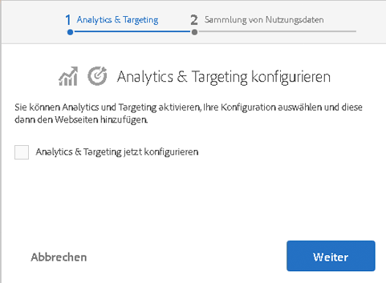

# Integrieren mit Adobe Marketing Cloud{#integrating-with-the-adobe-marketing-cloud}

>[!CAUTION]
>
>AEM 6.4 hat das Ende der erweiterten Unterstützung erreicht und diese Dokumentation wird nicht mehr aktualisiert. Weitere Informationen finden Sie in unserer [technische Unterstützung](https://helpx.adobe.com/de/support/programs/eol-matrix.html). Unterstützte Versionen suchen [here](https://experienceleague.adobe.com/docs/?lang=de).

Die [Adobe Marketing Cloud](https://www.adobe.com/solutions/digital-marketing.html)enthält leistungsstarke Produkte zur Webanalyse- und Website-Optimierung, die umsetzbare Echtzeitdaten und Einblicke liefern, um erfolgreiche Online-Initiativen zu fördern. Es bietet eine integrierte und offene Plattform für die Online-Geschäftsoptimierung. Die Cloud besteht aus integrierten Anwendungen, mit denen Kundeneinblicke gesammelt und freigesetzt werden können, um die Akquise, Konvertierung und Bindung von Kunden sowie die Erstellung und Verteilung von Inhalten zu optimieren.

Mit Adobe Experience Manager können Sie nahtlos in die folgenden Adobe Marketing Cloud-Produkte integrieren:

* Über Adobe Analytics erhalten Marketing-Experten in Echtzeit verwertbare Daten zu Online-Strategien und Marketing-Initiativen.
* Mit Adobe Target haben Marketing-Experten die Möglichkeit, die Relevanz ihrer Online-Inhalte für Kunden immer weiter zu erhöhen, und dies führt zu einer größeren Zahl von Konversionen.
* Mithilfe von Adobe Dynamic Media Classic wird die Medienverwaltung automatisiert, die Webveröffentlichung optimiert und die Weboberfläche erweitert – alles innerhalb einer gehosteten Umgebung.
* Adobe Dynamic Tag Management bietet Marketing-Experten intuitive Tools zum schnellen und einfachen Verwalten einer unbegrenzten Zahl von Adobe- und Drittanbieter-Tags.
<!-- Search&Promote was end of life September 1, 2022. * Adobe Search&Promote gives marketers the ability to control and optimize the search results on their sites. -->
* Mit Adobe Campaign können Sie den Inhalt von E-Mail-Bereitstellungen direkt in Adobe Experience Manager verwalten.

Darüber hinaus können Sie Adobe Experience Manager in die [Creative Cloud](/help/assets/aem-cc-integration-best-practices.md) und [Drittanbieterdienste](/help/sites-administering/third-party-services.md).

## Integration mit Adobe Analytics {#integrating-with-adobe-analytics}

[Adobe Analytics](https://www.omniture.com/de/products/analytics/sitecatalyst) ist eine branchenführende Lösung, mit der Experten für Digital Marketing integrierte Daten aller Online-Initiativen über mehrere Marketing-Kanäle hinweg messen, analysieren und optimieren können. Es bietet Marketing-Experten umsetzbare Echtzeit-Web-Analysedaten zu digitalen Strategien und Marketinginitiativen. Mit Adobe Analytics können Marketingexperten schnell die profitabelsten Pfade durch eine Website identifizieren, den Traffic segmentieren, um hochwertige Webbesucher zu erkennen, zu ermitteln, wo Besucher von der Site weg navigieren, und wichtige Erfolgsmetriken für Online-Marketingkampagnen identifizieren.

Sie können Adobe Analytics verwenden, um Daten aus Ihren Sites zu analysieren.

Die Integration mit Adobe Analytics bietet Ihnen folgende Möglichkeiten:

* Aktivieren von Analytics-Benutzer-Tracking
* Ordnen Sie Ihre Ausführungsmodi (z. B. Autor, Veröffentlichung) verschiedenen Report Suites zu.
* Senden Sie ClientContext-Variablen als Konversionsvariablen oder Traffic-Eigenschaften.
* Verwenden Sie vordefinierte Variablenzuordnungen.
* Konfigurieren Sie vollständige Sitebereiche gleichzeitig.
* Verfolgen Sie benutzerdefinierte Ereignisse.

Informationen zur Integration von Adobe Experience Manager in Analytics finden Sie unter [Integration mit Adobe Analytics](/help/sites-administering/adobeanalytics.md).

Der [Opt-in-Assistent](/help/sites-administering/opt-in.md) erleichtert die Durchführung der Integration.

## Integrieren mit Adobe Target {#integrating-with-adobe-target}

[Adobe Target wird von Marketing-Experten genutzt, um Online-Tests zu entwerfen und auszuführen, in kurzer Zeit Zielgruppensegmente zu erstellen (anhand des Verhaltens) und das Targeting für Inhalte und Online-Erlebnisse zu automatisieren.](https://www.omniture.com/de/products/conversion/test-and-target)

Online-Verbraucher haben heutzutage ständig wachsende Anforderungen und erwarten relevante, sogar personalisierte Inhalte von den verschiedensten Sites und Inhaltsquellen, aus denen sie wählen können. Um eine Online-Zielgruppe zu erreichen, müssen Online-Marketing-Experten schnell ermitteln, welche Angebote und Inhalte für ihre Zielgruppen relevant und überzeugend sind. Mit diesem Wissen können Marketingexperten ihre Sites kontinuierlich weiterentwickeln und die entsprechenden Inhalte auf verschiedene Zielgruppen ausrichten.

[Integration mit Adobe Target](/help/sites-administering/target.md) erläutert, wie Sie Ihre Site in Adobe Target integrieren.

Der [Opt-in-Assistent](/help/sites-administering/opt-in.md) erleichtert die Durchführung der Integration.

## Opt-in für Analytics und Target {#opting-in-to-analytics-and-target}

Adobe Experience Manager bietet ein einfaches Opt-in-Verfahren zur Integration in Adobe Analytics und Adobe Target. Wenn Sie sich als Administrator anmelden und die Projektekonsole aufrufen, wird Ihnen ein Opt-in-Assistent angezeigt.

Nutzen Sie die Integration in Analytics und/oder Target , um die Verwendung der Tracking- und Analysefunktionen sowie der Personalisierungsfunktionen ihrer Seiten zu ermöglichen. Wenn Sie sich anmelden, müssen Sie Ihre Benutzerkontoinformationen angeben und die verfolgten Seiten angeben.

Weitere Informationen finden Sie unter [Opt-in für Adobe Analytics und Target](/help/sites-administering/opt-in.md).

## Integrieren in Dynamic Media Classic {#integrating-with-scene}

Adobe Dynamic Media Classic ist eine gehostete Lösung zum Veröffentlichen, Verwalten, Verbessern und Bereitstellen von Assets für dynamisches Marketing und umfassendes visuelles Merchandising für die Bereiche Web, Mobile, E-Mail, soziale Medien, Internet-Anzeigen und Print.

In Adobe Experience Manager können Sie digitale Assets direkt aus Adobe Experience Manager in Dynamic Media Classic veröffentlichen und umgekehrt.

Darüber hinaus können Sie in Dynamic Media Classic veröffentlichte Adobe Experience Manager-Assets in verschiedenen Viewern anzeigen, z. B. Basic Zoom und Video.

Weitere Informationen zur Integration von Adobe Experience Manager in Dynamic Media Classic finden Sie unter [Integration mit Dynamic Media Classic](/help/sites-administering/scene7.md) Dokumentation.

## Integrieren mit Adobe Dynamic Tag Management {#integrating-with-adobe-dynamic-tag-management}

[Adobe Dynamic Tag Management bietet Marketing-Experten intuitive Tools zum schnellen und einfachen Verwalten einer unbegrenzten Zahl von Adobe- und Drittanbieter-Tags. ](https://www.adobe.com/de/solutions/digital-marketing/dynamic-tag-management.html) Sie haben mehr Kontrolle und Flexibilität, um nahezu alles online zu optimieren – und reduzieren damit gleichzeitig auch Ihre Abhängigkeit von IT-Ressourcen.

[Integrieren von Adobe Dynamic Tag Management](/help/sites-administering/dtm.md) mit Adobe Experience Manager verwenden, damit Sie Ihre Dynamic Tag Management-Webeigenschaften verwenden können, um Adobe Experience Manager-Sites zu verfolgen.

## Integration mit Adobe Audience Manager {#integrating-with-adobe-audience-manager}

Die Audience Manager-Integration wurde in Adobe Experience Manager 6.3 entfernt.

<!-- Search&Promote was end of life September 1, 2022. ## Integrating with Search&Promote {#integrating-with-search-promote} -->

<!-- Search&Promote was end of life September 1, 2022. Adobe Search&Promote enables marketers to optimize how visitors browse, find, compare, and select relevant products and content on web and mobile sites. Businesses can easily promote priority items based on business objectives and visitor intent, as well as automate merchandising and promotions activity by way of KPI-based triggers or metrics. -->

<!-- Search&Promote was end of life September 1, 2022. Adobe Search&Promote is a reliable and scalable hosted site search application, capable of scaling to millions of pages or products, for heavily visited online businesses ranging from retail to news sites. It offers unprecedented levels of marketer control and metrics-based relevance. -->

<!-- Search&Promote was end of life September 1, 2022. For information about integrating Adobe Experience Manager and Search&Promote, see [Integrating with Adobe Search&Promote](/help/sites-administering/search-and-promote.md). -->

## Integrieren mit Adobe Campaign {#integrating-with-adobe-campaign}

Mit [Adobe Campaign](https://www.adobe.com/de/solutions/campaign-management.html) können Sie den Inhalt von E-Mail-Bereitstellungen direkt in Adobe Experience Manager verwalten.

Informationen zur Integration von Adobe Experience Manager mit Adobe Campaign finden Sie unter [Integration mit Adobe Campaign](/help/sites-administering/campaignstandard.md).
