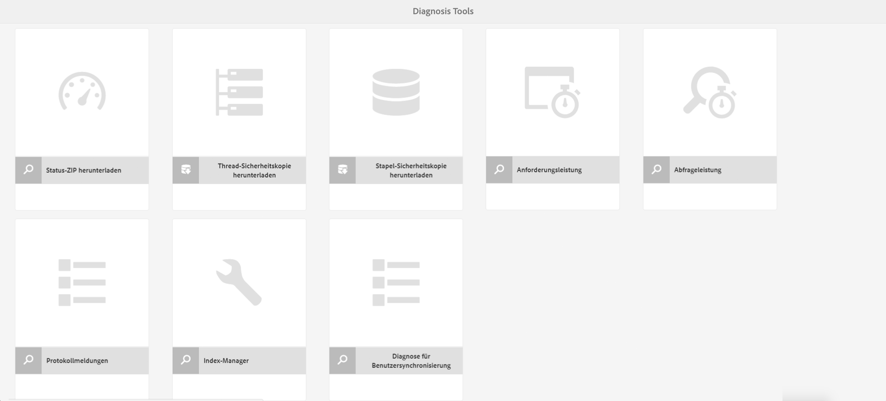
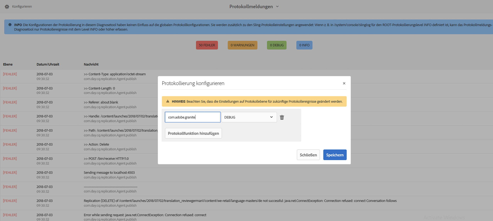
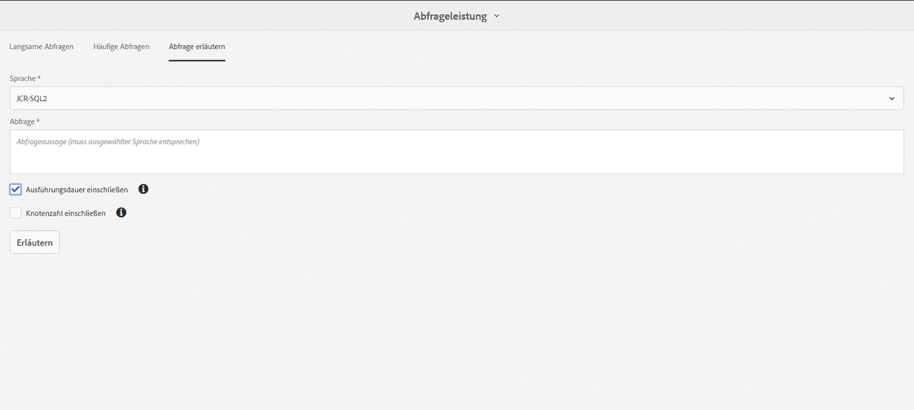
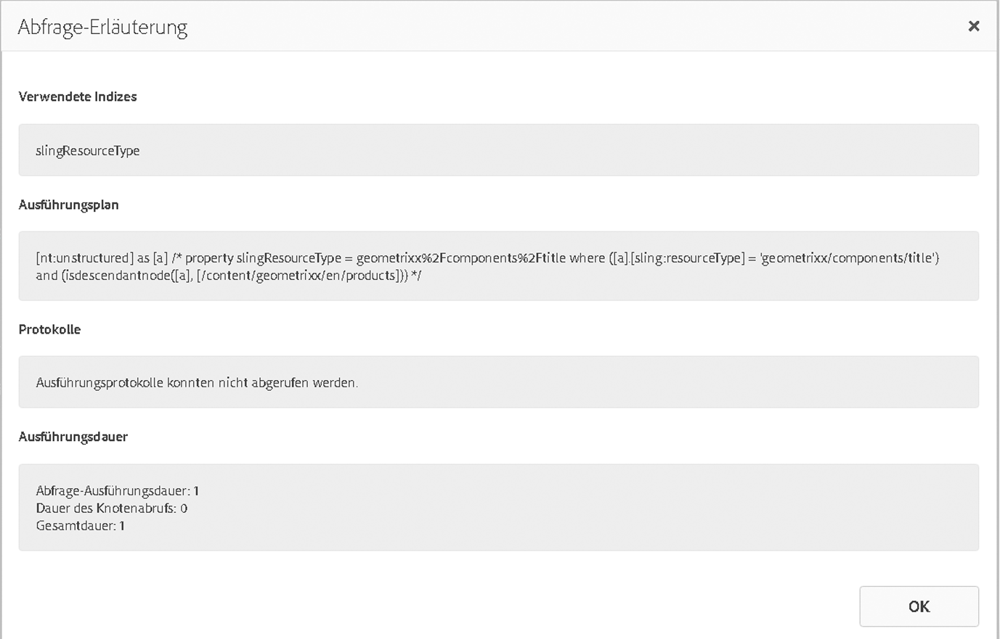
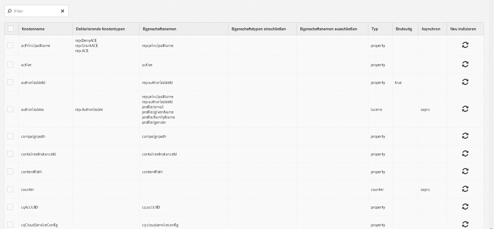
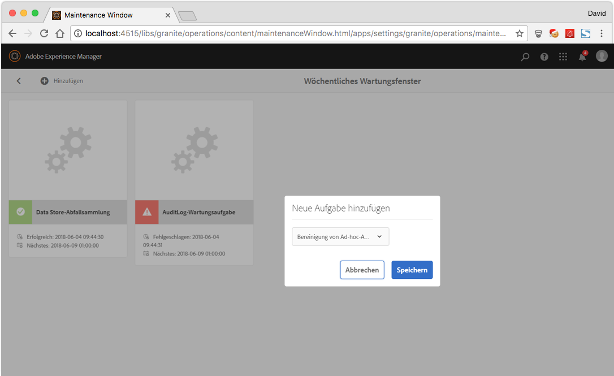
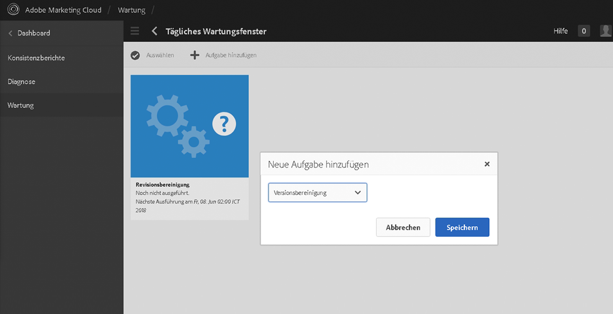

# Vorgangs-Dashboard {#operations-dashboard}

>[!CAUTION]
>
>AEM 6.4 hat das Ende der erweiterten Unterstützung erreicht und diese Dokumentation wird nicht mehr aktualisiert. Weitere Informationen finden Sie in unserer [technische Unterstützung](https://helpx.adobe.com/de/support/programs/eol-matrix.html). Unterstützte Versionen suchen [here](https://experienceleague.adobe.com/docs/?lang=de).

## Einführung {#introduction}

Das Vorgangs-Dashboard in AEM 6 hilft Systembetreibern, den Systemzustand AEM Systems auf einen Blick zu überwachen. Außerdem bietet das Dashboard automatisch erstellte Diagnosedaten zu relevanten Aspekten von AEM und ermöglicht die Konfiguration und Ausführung einer eigenständigen Wartungsautomatisierung, um Projektvorgänge und Support-Fälle deutlich zu reduzieren. Das Vorgangs-Dashboard kann mit benutzerdefinierten Konsistenzprüfungen und Wartungsaufgaben erweitert werden. Darüber hinaus ist der Zugriff auf die Daten des Vorgangs-Dashboards über externe Überwachungstools über JMX möglich.

**Das Vorgangs-Dashboard:**

* Ist ein Systemstatus mit einem Klick, der Abteilungen bei der Effizienz unterstützt
* stellt einen zentralen Überblick über die Systemkonsistenz bereit
* Verringert die Zeit zum Suchen, Analysieren und Beheben von Problemen
* Bietet eine eigenständige Wartungsautomatisierung, mit der die Kosten für den Projektbetrieb erheblich gesenkt werden können

Sie können auf dem AEM-Begrüßungsbildschirm über **Tools** > **Vorgänge** auf das Dashboard zugreifen.

>[!NOTE]
>
>Um auf das Vorgangs-Dashboard zugreifen zu können, muss der angemeldete Benutzer zur Benutzergruppe „Operatoren“ gehören. Weitere Informationen finden Sie in der Dokumentation zu [Verwaltung von Benutzern, Gruppen und Zugriffsrechten](/help/sites-administering/user-group-ac-admin.md).

## Konsistenzberichte {#health-reports}

Das Health Report System stellt über Sling-Konsistenzprüfungen Informationen zum Zustand einer AEM Instanz bereit. Dies erfolgt entweder über OSGi-, JMX- oder HTTP-Anfragen (über JSON) oder über die Touch-optimierte Benutzeroberfläche. Es bietet Messungen und Schwellenwerte für bestimmte konfigurierbare Zähler und bietet in einigen Fällen Informationen zur Lösung des Problems.

Es umfasst mehrere Funktionen, die unten beschrieben werden.

## Konsistenzprüfungen {#health-checks}

Die **Konsistenzberichte** sind ein System von Karten, die auf eine gute oder schlechte Gesundheit in einem bestimmten Produktbereich hinweisen. Diese Karten sind Visualisierungen der Sling-Konsistenzprüfungen, die Daten aus JMX und anderen Quellen aggregieren und verarbeitete Informationen erneut als MBeans verfügbar machen. Diese MBeans können auch im [JMX-Webkonsole](/help/sites-administering/jmx-console.md)unter **org.apache.sling.healthcheck** Domäne.

Sie können auf dem AEM-Willkommensbildschirm über das Menü **Tools** > **Vorgänge** > **Konsistenzberichte** oder über die folgende URL auf die Konsistenzberichte zugreifen:

`https://<serveraddress>:port/libs/granite/operations/content/healthreports/healthreportlist.html`


Das Kartensystem umfasst drei mögliche Status: **OK**, **WARNUNG** und **KRITISCH**. Diese Statusanzeigen sind das Ergebnis von Regeln und Schwellenwerten. Um diese zu konfigurieren, bewegen Sie den Mauszeiger über die Karte und klicken Sie auf das Zahnradsymbol in der Aktionsleiste:


### Konsistenzprüfungstypen {#health-check-types}

Es gibt zwei Arten von Konsistenzprüfungen in AEM 6:

1. Individuelle Konsistenzprüfungen
1. Verbund-Konsistenzprüfungen

Ein **Individuelle Konsistenzprüfung** ist eine einzelne Konsistenzprüfung, die einer Statuskarte entspricht. Individuelle Konsistenzprüfungen können mit Regeln oder Schwellenwerten konfiguriert werden und können einen oder mehrere Hinweise und Links zur Lösung identifizierter Gesundheitsprobleme bereitstellen. Nehmen wir als Beispiel die Prüfung &quot;Fehler protokollieren&quot;: Wenn die Instanzprotokolle FEHLER enthalten, finden Sie diese auf der Detailseite der Konsistenzprüfung. Oben auf der Seite sehen Sie einen Link zum Analyzer &quot;Logmeldung&quot; im Abschnitt Diagnose-Tools , der es Ihnen ermöglicht, diese Fehler detaillierter zu analysieren und die Logger neu zu konfigurieren.

A **Composite Health Check** ist eine Prüfung, die Informationen aus mehreren individuellen Prüfungen aggregiert.

Verbund-Konsistenzprüfungen werden mithilfe von **Filter-Tags**. Im Wesentlichen werden alle einzelnen Prüfungen mit demselben Filter-Tag als Verbund-Konsistenzprüfung gruppiert. Eine Verbund-Konsistenzprüfung weist nur dann den Status „OK“ auf, wenn alle individuellen Prüfungen, von denen sie Daten bezieht, ebenfalls diesen Status aufweisen.

### Erstellen von Konsistenzprüfungen {#how-to-create-health-checks}

Im Vorgangs-Dashboard können Sie die Ergebnisse von individuellen wie Verbund-Konsistenzprüfung visuell darstellen.

### Erstellen einer individuellen Konsistenzprüfung {#creating-an-individual-health-check}

Die Erstellung einer individuellen Konsistenzprüfung umfasst zwei Schritte: Implementierung einer Sling-Konsistenzprüfung und Hinzufügen eines Eintrags für die Konsistenzprüfung in den Konfigurationsknoten des Dashboards.

1. Um eine Sling-Konsistenzprüfung zu erstellen, müssen Sie eine OSGi-Komponente erstellen, die die Sling-Konsistenzprüfungs-Schnittstelle implementiert. Sie fügen diese Komponente in einem Bundle hinzu. Die Eigenschaften der Komponente identifizieren die Konsistenzprüfung vollständig. Sobald die Komponente installiert ist, wird automatisch ein JMX MBean für die Konsistenzprüfung erstellt. Siehe [Dokumentation zur Sling-Konsistenzprüfung](https://sling.apache.org/documentation/bundles/sling-health-check-tool.html) für weitere Informationen.

   Beispiels einer Sling-Konsistenzprüfungs-Komponente, mit OSGi-Dienstkomponenten-Anmerkungen geschrieben:

   ```java
   @Component(service = HealthCheck.class,         
   property = {             
       HealthCheck.NAME + "=Example Check",             
       HealthCheck.TAGS + "=example",             
       HealthCheck.TAGS + "=test",             
       HealthCheck.MBEAN_NAME + "=exampleHealthCheckMBean"         
   })
    public class ExampleHealthCheck implements HealthCheck { 
       @Override     
       public Result execute() {     
           // health check code     
       }
    }
   ```

   >[!NOTE]
   >
   >Die Eigenschaft `MBEAN_NAME` definiert den Namen des MBean, die für diese Konsistenzprüfung erstellt wird.

1. Nach dem Erstellen der Konsistenzprüfung müssen Sie einen neuen Konfigurationsknoten erstellen, damit die Konsistenzprüfung in der Oberfläche des Vorgangs-Dashboards verfügbar ist. Für diesen Schritt müssen Sie den JMX-MBean-Namen der Konsistenzprüfung kennen (die Eigenschaft `MBEAN_NAME`). Um eine Konfiguration für die Konsistenzprüfung zu erstellen, öffnen Sie CRXDE und fügen Sie einen neuen Knoten (des Typs **nt:unstructured**) unter dem folgenden Pfad hinzu: `/apps/settings/granite/operations/hc`

   Legen Sie die folgenden Eigenschaften für den neuen Knoten fest:

   * **Name:** `sling:resourceType`

      * **Typ:** `String`
      * **Wert:** `granite/operations/components/mbean`
   * **Name:** `resource`

      * **Typ:** `String`
      * **Wert:** `/system/sling/monitoring/mbeans/org/apache/sling/healthcheck/HealthCheck/exampleHealthCheck`

   >[!NOTE]
   >
   >Der o. g. Ressourcenpfad wird wie folgt erstellt: Wenn der MBean-Name der Konsistenzprüfung „test“ ist, fügen Sie am Ende des Pfads `/system/sling/monitoring/mbeans/org/apache/sling/healthcheck/HealthCheck` „test“ hinzu.
   >
   >Der endgültige Pfad lautet also:
   >
   >`/system/sling/monitoring/mbeans/org/apache/sling/healthcheck/HealthCheck/test`

   >[!NOTE]
   >
   >Stellen Sie sicher, dass beim Pfad `/apps/settings/granite/operations/hc` für die folgenden Eigenschaften „true“ festgelegt ist:
   >
   >
   >`sling:configCollectionInherit`
   >
   >`sling:configPropertyInherit`
   >
   >
   >Dadurch weiß der Konfigurations-Manager, dass die neuen Konfigurationen mit den vorhandenen aus `/libs` zusammengeführt werden sollen.

### Erstellen einer Verbund-Konsistenzprüfung {#creating-a-composite-health-check}

Die Rolle einer Verbund-Konsistenzprüfung besteht darin, eine Reihe von individuellen Konsistenzprüfungen zu aggregieren, die eine Reihe gemeinsamer Funktionen gemeinsam nutzen. Beispielsweise gruppiert die Security Composite Health Check alle individuellen Konsistenzprüfungen, die sicherheitsbezogene Überprüfungen durchführen. Der erste Schritt zum Erstellen einer zusammengesetzten Prüfung besteht darin, eine neue OSGi-Konfiguration hinzuzufügen. Damit er im Vorgangs-Dashboard angezeigt werden kann, muss ein neuer Konfigurationsknoten hinzugefügt werden, wie dies bei einer einfachen Prüfung der Fall war.

1. Wechseln Sie zum Web-Konfigurations-Manager in der OSGi-Konsole. Sie können dies tun, indem Sie `https://serveraddress:port/system/console/configMgr` aufrufen.

1. Suchen Sie nach dem Eintrag namens **Apache Sling Composite Health Check**. Beachten Sie nach der Suche, dass bereits zwei Konfigurationen verfügbar sind: eine für die Systemprüfungen und eine andere für die Sicherheitsprüfungen.
1. Erstellen Sie eine neue Konfiguration, indem Sie auf der rechten Seite der Konfiguration auf die Schaltfläche &quot;+&quot; klicken. Ein neues Fenster wird geöffnet, wie unten abgebildet:

   

1. Erstellen Sie eine Konfiguration und speichern Sie sie. Mit der neuen Konfiguration wird ein MBean erstellt.

   Der Zweck jeder Konfigurationseigenschaft lautet wie folgt:

   * **Name (hc.name):** Der Name der Verbund-Konsistenzprüfung. Es wird ein aussagekräftiger Name empfohlen.
   * **Tags (hc.tags):** Die Tags für diese Konsistenzprüfung. Wenn diese zusammengesetzte Konsistenzprüfung Teil einer anderen Verbund-Konsistenzprüfung sein soll (z. B. in einer Hierarchie der Konsistenzprüfungen), fügen Sie die Tags hinzu, mit denen dieser Verbund verbunden ist.
   * **MBean-Name (hc.mbean.name):** Der Name des MBean, das dem JMX MBean dieser zusammengesetzten Konsistenzprüfung übergeben wird.
   * **Filter-Tags (filter.tags):** Dies ist eine Eigenschaft, die für Konsistenzprüfungen bei Composite-Tests spezifisch ist. Dies sind die Tags, die der Composite aggregieren soll. Die Verbund-Konsistenzprüfung aggregiert unter ihrer Gruppe alle Konsistenzprüfungen mit Tags, die mit einem der Filter-Tags dieses Verbund übereinstimmen. Beispielsweise aggregiert eine Verbund-Konsistenzprüfung mit den Filter-Tags **test** und **check** alle individuellen und Verbund-Konsistenzprüfungen, die einen der Tags **test** und **check** in ihrer tags-Eigenschaft aufweisen ( `hc.tags`).

   >[!NOTE]
   >
   >Ein neues JMX-MBean wird für jede neue Konfiguration des Apache Sling Composite Health Checks erstellt.**

1. Zuletzt müssen Sie den Eintrag der gerade erstellten Verbund-Konsistenzprüfung im Konfigurationsknoten des Vorgangs-Dashboards hinzufügen. Die Vorgehensweise ist dieselbe wie bei individuellen Konsistenzprüfungen: ein Knoten des Typs **nt:unstructured** muss unter `/apps/settings/granite/operations/hc` erstellt werden. Die Ressourceneigenschaft des Knotens wird durch den Wert von **hc.mean.name** in der OSGi-Konfiguration.

   Wenn Sie beispielsweise eine Konfiguration erstellt haben und die Variable **hc.mbean.name** Wert zu **diskusage**, sehen die Konfigurationsknoten wie folgt aus:

   * **Name:** `Composite Health Check`

      * **Typ:** `nt:unstructured`

   Mit den folgenden Eigenschaften:

   * **Name:** `sling:resourceType`

      * **Typ:** `String`
      * **Wert:** `granite/operations/components/mbean`
   * **Name:** `resource`

      * **Typ:** `String`
      * **Wert:** `/system/sling/monitoring/mbeans/org/apache/sling/healthcheck/HealthCheck/diskusage`

   >[!NOTE]
   >
   >Wenn Sie individuelle Konsistenzprüfungen erstellen, die logisch zu einer Composite-Prüfung gehören, die standardmäßig bereits im Dashboard vorhanden ist, werden diese automatisch erfasst und unter der entsprechenden Composite-Prüfung gruppiert. Daher ist es nicht erforderlich, einen neuen Konfigurationsknoten für diese Prüfungen zu erstellen.
   >
   >Wenn Sie beispielsweise eine individuelle Sicherheits-Konsistenzprüfung erstellen, müssen Sie ihr lediglich das Tag **Sicherheit** zuweisen. Nach der Installation wird sie automatisch unter der Verbund-Konsistenzprüfung im Vorgangs-Dashboard angezeigt.

### Im Lieferumfang von AEM enthaltene Konsistenzprüfungen {#health-checks-provided-with-aem}

<table> 
 <tbody> 
  <tr> 
   <td><strong>Name der Konsistenzprüfung</strong></td> 
   <td><strong>Beschreibung</strong></td> 
  </tr> 
  <tr> 
   <td>Abfrageleistung</td> 
   <td><p>Diese Konsistenzprüfung wurde <strong>in AEM 6.4</strong> vereinfacht und überprüft nun das kürzlich überarbeitete MBean <code>Oak QueryStats</code>, genauer gesagt, das Attribut <code>SlowQueries </code>. Wenn die Statistiken langsame Abfragen enthalten, gibt die Konsistenzprüfung eine Warnung zurück. Andernfalls wird der Status "OK"zurückgegeben.<br /> </p> <p>Das MBean für diese Konsistenzprüfung ist <a href="http://localhost:4502/system/console/jmx/org.apache.sling.healthcheck%3Aname%3DqueriesStatus%2Ctype%3DHealthCheck">org.apache.sling.healthcheck:name=queriesStatus,type=HealthCheck</a>.</p> </td> 
  </tr> 
  <tr> 
   <td>Länge der Überwachungswarteschlange</td> 
   <td><p>Diese Prüfung wird für alle Event-Listener und Hintergrundbeobachter schrittweise durchgeführt. Sie vergleicht die <code>queueSize </code> mit ihrer <code>maxQueueSize</code> und:</p> 
    <ul> 
     <li>gibt den Status „Kritisch“ zurück, wenn der Wert für <code>queueSize</code> den Wert für <code>maxQueueSize</code> übersteigt (d. h., wenn Ereignisse entfernt werden)</li> 
     <li>gibt eine Warnung zurück, wenn der Wert für <code>queueSize</code> über dem <code>maxQueueSize * WARN_THRESHOLD</code> liegt (der Standardwert liegt bei 0,75) </li> 
    </ul> <p>Die maximale Länge jeder Warteschlange stammt aus separaten Konfigurationen (Oak und AEM) und kann von dieser Konsistenzprüfung nicht konfiguriert werden. Das MBean für diese Konsistenzprüfung ist <a href="http://localhost:4502/system/console/jmx/org.apache.sling.healthcheck%3Aname%3DObservationQueueLengthHealthCheck%2Ctype%3DHealthCheck">org.apache.sling.healthcheck:name=ObservationQueueLengthHealthCheck,type=HealthCheck</a>.</p> </td> 
  </tr> 
  <tr> 
   <td>Abfrage-Ausnahmelimits</td> 
   <td><p>Diese Prüfung überprüft das MBean <code>QueryEngineSettings</code>, genauer gesagt, die Attribute <code>LimitInMemory</code> und <code>LimitReads</code>, und gibt den folgenden Status zurück:</p> 
    <ul> 
     <li>den Status „Warnung“, wenn eines der Limits dem folgenden Wert entspricht oder größer ist <code>Integer.MAX_VALUE</code></li> 
     <li>den Status „Warnung“, wenn eines der Limits kleiner als 10.000 (die empfohlene Einstellung von Oak) ist</li> 
     <li>den Status „Kritisch“, wenn die <code>QueryEngineSettings</code> oder eines der Limits nicht abgerufen werden können</li> 
    </ul> <p>Das MBean für diese Konsistenzprüfung ist <a href="http://localhost:4502/system/console/jmx/org.apache.sling.healthcheck%3Aname%3DqueryTraversalLimitsBundle%2Ctype%3DHealthCheck">org.apache.sling.healthcheck:name=queryTraversalLimitsBundle,type=HealthCheck</a>.</p> </td> 
  </tr> 
  <tr> 
   <td>Synchronisierte Uhren</td> 
   <td><p>Diese Prüfung ist nur für <a href="https://github.com/apache/sling-old-svn-mirror/blob/4df9ab2d6592422889c71fa13afd453a10a5a626/bundles/extensions/discovery/oak/src/main/java/org/apache/sling/discovery/oak/SynchronizedClocksHealthCheck.java">Dokumenten-NodeStore-Cluster</a> relevant. Es wird der folgende Status zurückgegeben:</p> 
    <ul> 
     <li>gibt den Warnungsstatus zurück, wenn die Instanzuhren nicht mehr synchronisiert sind und einen vordefinierten unteren Schwellenwert überschreiten</li> 
     <li>gibt den Status "Kritisch"zurück, wenn die Instanzuhren nicht mehr synchronisiert sind und einen vordefinierten hohen Schwellenwert überschreiten</li> 
    </ul> <p>Das MBean für diese Konsistenzprüfung ist <a href="http://localhost:4502/system/console/jmx/org.apache.sling.healthcheck%3Aname%3DslingDiscoveryOakSynchronizedClocks%2Ctype%3DHealthCheck">org.apache.sling.healthcheck:name=slingDiscoveryOakSynchronizedClocks,type=HealthCheck</a>.</p> </td> 
  </tr> 
  <tr> 
   <td>Asynchrone Indexe</td> 
   <td><p>Die Prüfung der asynchronen Indizes:</p> 
    <ul> 
     <li>gibt den Status "Kritisch"zurück, wenn mindestens eine Indizierungsspur fehlschlägt</li> 
     <li>prüft <code>lastIndexedTime</code> für alle Indizierungsspuren und: 
      <ul> 
       <li>gibt den Status „Kritisch“ zurück, wenn die Zeit mehr als 2 Stunden zurückliegt </li> 
       <li>gibt den Status „Warnung“ zurück, wenn sie zwischen 2 Stunden und 45 Minuten zurückliegt </li> 
       <li>gibt den Status „OK“ zurück, wenn sie weniger als 45 Minuten zurückliegt </li> 
      </ul> </li> 
     <li>Wenn keine dieser Bedingungen erfüllt ist, wird der Status "OK"zurückgegeben.</li> 
    </ul> <p>Die Statusschwellen "Kritisch"und "Warn"sind konfigurierbar. Das MBean für diese Konsistenzprüfung ist <a href="http://localhost:4502/system/console/jmx/org.apache.sling.healthcheck%3Aname%3DasyncIndexHealthCheck%2Ctype%3DHealthCheck">org.apache.sling.healthcheck:name=asyncIndexHealthCheck,type=HealthCheck</a>.</p> <p><strong>Hinweis: </strong>Diese Konsistenzprüfung ist in AEM 6.4 und als Backport in AEM 6.3.0.1 verfügbar.</p> </td> 
  </tr> 
  <tr> 
   <td>Große Lucene-Indizes</td> 
   <td><p>Diese Prüfung nutzt die Daten des MBean <code>Lucene Index Statistics</code>, um große Indizes zu identifizieren, und:</p> 
    <ul> 
     <li>gibt den Status „Warnung“ zurück, wenn es einen Index mit mehr als 1 Mrd. Dokumenten gibt</li> 
     <li>Status "Kritisch", wenn ein Index mit mehr als 1,5 Milliarden Dokumenten vorhanden ist</li> 
    </ul> <p>Die Schwellenwerte sind konfigurierbar und das MBean für die Konsistenzprüfung ist <a href="http://localhost:4502/system/console/jmx/org.apache.sling.healthcheck%3Aname%3DlargeIndexHealthCheck%2Ctype%3DHealthCheck">org.apache.sling.healthcheck:name=largeIndexHealthCheck,type=HealthCheck.</a></p> <p><strong>Hinweis: </strong>Diese Prüfung ist in AEM 6.4 verfügbar und wurde auf AEM 6.3.2.0 rückportiert.</p> </td> 
  </tr> 
  <tr> 
   <td>Systemwartung</td> 
   <td><p>Die Systemwartung ist eine zusammengesetzte Prüfung, die OK zurückgibt, wenn alle Wartungsaufgaben wie konfiguriert ausgeführt werden. Beachten Sie Folgendes:</p> 
    <ul> 
     <li>Zu jeder Wartungsaufgabe gehört eine entsprechende Konsistenzprüfung.</li> 
     <li>Wenn eine Aufgabe nicht zu einem Wartungsfenster hinzugefügt wird, gibt ihre Konsistenzprüfung "Kritisch"zurück.</li> 
     <li>Sie müssen die Wartungsaufgaben "Auditprotokoll"und "Workflow-Bereinigung"konfigurieren oder anderweitig aus den Wartungsfenstern entfernen. Wenn diese Aufgaben nicht konfiguriert sind, schlagen sie bei der ersten Ausführung fehl, sodass die Systemwartungsprüfung den Status "Kritisch"zurückgibt.</li> 
     <li><strong>Mit AEM 6.4</strong>, gibt es auch eine Prüfung für die <a href="/help/sites-administering/operations-dashboard.md#automated-maintenance-tasks">Wartung von Lucene-Binärdateien</a> Aufgabe</li> 
     <li>Bei AEM 6.2 und niedriger gibt die Systemwartungsüberprüfung direkt nach dem Start einen Warnungsstatus zurück, da die Aufgaben nie ausgeführt werden. Ab 6.3 geben sie "OK"zurück, wenn das erste Wartungsfenster noch nicht erreicht wurde.</li> 
    </ul> <p>Das MBean für diese Konsistenzprüfung ist <a href="http://localhost:4502/system/console/jmx/org.apache.sling.healthcheck%3Aname%3Dsystemchecks%2Ctype%3DHealthCheck">org.apache.sling.healthcheck:name=systemchecks,type=HealthCheck</a>.</p> </td> 
  </tr> 
  <tr> 
   <td>Replikations-Warteschlange</td> 
   <td><p>Diese Prüfung durchläuft Replikationsagenten und untersucht deren Warteschlangen. Für das Element am Anfang der Warteschlange prüft die Prüfung, wie oft der Agent die Replikation wiederholt hat. Wenn diese Anzahl größer ist als der Wert des Parameters <code>numberOfRetriesAllowed</code>, wird eine Warnung zurückgegeben. Der Parameter <code>numberOfRetriesAllowed</code> ist konfigurierbar. </p> <p>Das MBean für diese Konsistenzprüfung ist <a href="http://localhost:4502/system/console/jmx/org.apache.sling.healthcheck%3Aname%3DreplicationQueue%2Ctype%3DHealthCheck" target="_blank">org.apache.sling.healthcheck:name=replicationQueue,type=HealthCheck</a>.</p> </td> 
  </tr> 
  <tr> 
   <td>Sling Jobs</td> 
   <td> 
    <div>
      Diese Prüfung überprüft die Anzahl an Aufträgen, die sich in der Warteschlange des Auftrags-Managers befinden, vergleicht sie mit dem Schwellenwert <code>maxNumQueueJobs</code> und: 
    </div> 
    <ul> 
     <li>gibt den Status „Kritisch“ zurück, wenn sich mehr als <code>maxNumQueueJobs</code> in der Warteschlange befinden</li> 
     <li>gibt "Kritisch"zurück, wenn es aktive Aufträge mit langer Laufzeit gibt, die älter als eine Stunde sind</li> 
     <li>gibt "Kritisch"zurück, wenn Aufträge in der Warteschlange vorhanden sind und die letzte fertige Auftragszeit älter als 1 Stunde ist</li> 
    </ul> <p>Nur der Parameter Maximale Anzahl an Aufträgen in der Warteschlange kann konfiguriert werden und hat den Standardwert 1000.</p> <p>Das MBean für diese Konsistenzprüfung ist <a href="http://localhost:4502/system/console/jmx/org.apache.sling.healthcheck%3Aname%3DslingJobs%2Ctype%3DHealthCheck" target="_blank">org.apache.sling.healthcheck:name=slingJobs,type=HealthCheck</a>.</p> </td> 
  </tr> 
  <tr> 
   <td>Anfrageleistung</td> 
   <td><p>Diese Prüfung untersucht die <code>granite.request.metrics.timer</code> <a href="http://localhost:4502/system/console/slingmetrics" target="_blank">Sling-Metrik</a> und:</p> 
    <ul> 
     <li>gibt "Kritisch"zurück, wenn der 75. Perzentil-Wert über dem kritischen Schwellenwert liegt (der Standardwert ist 500 Millisekunden)</li> 
     <li>gibt eine Warnung zurück, wenn der 75. Perzentil-Wert über dem Warnschwellenwert liegt (der Standardwert ist 200 Millisekunden)</li> 
    </ul> <p>Das MBean für diese Konsistenzprüfung ist <em> </em><a href="http://localhost:4502/system/console/jmx/org.apache.sling.healthcheck%3Aname%3DrequestsStatus%2Ctype%3DHealthCheck" target="_blank">org.apache.sling.healthcheck:name=requestsStatus,type=HealthCheck</a>.</p> </td> 
  </tr> 
  <tr> 
   <td>Fehlerprotokoll</td> 
   <td><p>Diese Prüfung gibt den Warnungsstatus zurück, wenn im Protokoll Fehler auftreten.</p> <p>Das MBean für diese Konsistenzprüfung ist <a href="http://localhost:4502/system/console/jmx/org.apache.sling.healthcheck%3Aname%3DlogErrorHealthCheck%2Ctype%3DHealthCheck" target="_blank">org.apache.sling.healthcheck:name=logErrorHealthCheck,type=HealthCheck</a>.</p> </td> 
  </tr> 
  <tr> 
   <td>Festplattenspeicher</td> 
   <td><p>Diese Prüfung untersucht das MBean <code>FileStoreStats</code>, ruft die Größe des NodeStores und den Umfang des verfügbaren Festplatten-Speicherplatzes auf der NodeStore-Partition ab und:</p> 
    <ul> 
     <li>gibt eine Warnung zurück, wenn das Verhältnis zwischen verfügbarem Speicherplatz und Repository-Größe kleiner als der Warnschwellenwert ist (der Standardwert ist 10)</li> 
     <li>gibt "Kritisch"zurück, wenn das Verhältnis zwischen verfügbarem Speicherplatz und Repository-Größe kleiner als der kritische Schwellenwert ist (der Standardwert ist 2).</li> 
    </ul> <p>Beide Werte sind konfigurierbar. Die Prüfung funktioniert nur auf Instanzen mit einem Segmentspeicher.</p> <p>Das MBean für diese Konsistenzprüfung ist <a href="http://localhost:4502/system/console/jmx/org.apache.sling.healthcheck%3Aname%3DDiskSpaceHealthCheck%2Ctype%3DHealthCheck" target="_blank">org.apache.sling.healthcheck:name=DiskSpaceHealthCheck,type=HealthCheck</a>.</p> </td> 
  </tr> 
  <tr> 
   <td>Scheduler-Statusprüfung</td> 
   <td><p>Diese Prüfung gibt eine Warnung zurück, wenn die Instanz über mehr als 60 Sekunden Quartz-Aufträge verfügt. Der Schwellenwert für die zulässige Dauer ist konfigurierbar.</p> <p>Das MBean für diese Konsistenzprüfung ist <a href="http://localhost:4502/system/console/jmx/org.apache.sling.healthcheck%3Aname%3DslingCommonsSchedulerHealthCheck%2Ctype%3DHealthCheck" target="_blank">org.apache.sling.healthcheck:name=slingCommonsSchedulerHealthCheck,type=HealthCheck</a><em>.</em></p> </td> 
  </tr> 
  <tr> 
   <td>Sicherheitsprüfungen</td> 
   <td><p>Bei der Sicherheitsprüfung handelt es sich um einen Verbund, der die Ergebnisse mehrerer sicherheitsbezogener Prüfungen zusammenfasst. Diese individuellen Konsistenzprüfungen decken unterschiedliche Aspekte der Sicherheits-Checkliste ab, die auf der <a href="/help/sites-administering/security-checklist.md">Dokumentationsseite zur Sicherheits-Checkliste zu finden ist.</a> Die Prüfung ist als Feuerprobe beim Start der Instanz nützlich. </p> <p>Das MBean für diese Konsistenzprüfung ist <a href="http://localhost:4502/system/console/jmx/org.apache.sling.healthcheck%3Aname%3Dsecuritychecks%2Ctype%3DHealthCheck" target="_blank">org.apache.sling.healthcheck:name=securitychecks,type=HealthCheck</a></p> </td> 
  </tr> 
  <tr> 
   <td>Aktive Bundles</td> 
   <td><p>Aktive Bundles überprüfen den Status aller Bundles und:</p> 
    <ul> 
     <li>gibt den Warnungsstatus zurück, wenn eines der Bundles nicht aktiv ist oder (Start, mit verzögerter Aktivierung)</li> 
     <li>Er ignoriert den Status von Bundles in der Ignorierungsliste</li> 
    </ul> <p>Der Parameter "Ignorieren"-Liste kann konfiguriert werden.</p> <p>Das MBean für diese Konsistenzprüfung ist <a href="http://localhost:4502/system/console/jmx/org.apache.sling.healthcheck%3Aname%3DinactiveBundles%2Ctype%3DHealthCheck" target="_blank">org.apache.sling.healthcheck:name=inactiveBundles,type=HealthCheck</a>.</p> </td> 
  </tr> 
  <tr> 
   <td>Code-Cache-Prüfung</td> 
   <td><p>Dies ist eine Konsistenzprüfung, die mehrere JVM-Bedingungen überprüft, die auf einen in Java 7 vorhandenen CodeCache-Fehler Trigger werden können:</p> 
    <ul> 
     <li>gibt eine Warnung zurück, wenn die Instanz unter Java 7 ausgeführt wird, wobei die Code-Cache-Bereinigung aktiviert ist</li> 
     <li>gibt eine Warnung zurück, wenn die Instanz unter Java 7 ausgeführt wird und die Größe des reservierten Code-Caches kleiner als ein Mindestschwellenwert ist (der Standardwert ist 90 MB)</li> 
    </ul> <p>Der Schwellenwert <code>minimum.code.cache.size</code> ist konfigurierbar. Weitere Informationen zu diesem Bug <a href="https://bugs.java.com/bugdatabase/view_bug.do?bug_id=8012547">finden Sie</a><a href="https://bugs.java.com/bugdatabase/view_bug.do?bug_id=8012547"></a><a href="https://bugs.java.com/bugdatabase/view_bug.do?bug_id=8012547"></a><a href="https://bugs.java.com/bugdatabase/view_bug.do?bug_id=8012547"> auf dieser Seite</a>.</p> <p>Das MBean für diese Konsistenzprüfung lautet <a href="http://localhost:4502/system/console/jmx/org.apache.sling.healthcheck%3Aname%3DcodeCacheHealthCheck%2Ctype%3DHealthCheck" target="_blank">org.apache.sling.healthcheck:name=codeCacheHealthCheck,type=HealthCheck</a>.</p> </td> 
  </tr> 
  <tr> 
   <td>Ressourcen-Suchpfad-Fehler</td> 
   <td><p>Prüft, ob unter dem Pfad <code>/apps/foundation/components/primary</code> Ressourcen vorhanden sind, und:</p> 
    <ul> 
     <li>gibt eine Warnung aus, wenn hier untergeordnete Knoten vorhanden sind: <code>/apps/foundation/components/primary</code></li> 
    </ul> <p>Das MBean für diese Konsistenzprüfung lautet <a href="http://localhost:4502/system/console/jmx/org.apache.sling.healthcheck%3Aname%3DresourceSearchPathErrorHealthCheck%2Ctype%3DHealthCheck" target="_blank">org.apache.sling.healthcheck:name=resourceSearchPathErrorHealthCheck,type=HealthCheck</a>.</p> </td> 
  </tr> 
 </tbody> 
</table>

## Überwachung mit Nagios {#monitoring-with-nagios}

Das Konsistenzprüfungs-Dashboard kann über die Granite JMX MB in Nagios integriert werden. Das nachfolgende Beispiel zeigt, wie Sie eine Prüfung hinzufügen, die verwendeten Speicher auf dem Server anzeigt, auf dem AEM ausgeführt wird.

1. Installieren und konfigurieren Sie Nagios auf dem Überwachungs-Server.
1. Installieren Sie anschließend den Nagios Remote Plugin Executor (NRPE).

   >[!NOTE]
   >
   >Weitere Informationen zur Installation von Nagios und NRPE auf Ihrem System finden Sie unter [Nagios-Dokumentation](https://library.nagios.com/library/products/nagioscore/manuals/).

1. Fügen Sie eine Hostdefinition für den AEM-Server hinzu. Dies kann über die Nagios XI-Webschnittstelle mithilfe von Configuration Manager erfolgen:

   1. Öffnen Sie einen Browser und zeigen Sie auf den Nagios-Server.
   1. Klicken Sie im oberen Menü auf die Schaltfläche **Konfigurieren**.
   1. Klicken Sie in der linken Spur unter **Erweiterte Konfiguration** auf **Core-Konfigurations-Manager**.
   1. Klicken Sie unter dem Abschnitt **Überwachung** auf den Link **Hosts**.
   1. Fügen Sie die Hostdefinition hinzu:

   

   Nachfolgend finden Sie ein Beispiel einer Host-Konfigurationsdatei unter Verwendung von Nagios Core:

   ```xml
   define host {
      address 192.168.0.5
      max_check_attempts 3
      check_period 24x7
      check-command check-host-alive
      contacts admin
      notification_interval 60
      notification_period 24x7
   }
   ```

1. Installieren Sie Nagios und NRPE auf dem AEM-Server.
1. Installieren Sie die [check_http_json](https://github.com/phrawzty/check_http_json) -Plug-in auf beiden Servern.
1. Definieren Sie einen generischen JSON-Prüfbefehl auf beiden Servern:

   ```xml
   define command{
   
       command_name    check_http_json-int
   
       command_line    /usr/lib/nagios/plugins/check_http_json --user "$ARG1$" --pass "$ARG2$" -u 'https://$HOSTNAME$:$ARG3$/$ARG4$' -e '$ARG5$' -w '$ARG6$' -c '$ARG7$'
   
   }
   ```

1. Fügen Sie einen Dienst für verwendeten Speicher auf dem AEM-Server hinzu:

   ```xml
   define service {
   
       use generic-service
   
       host_name my.remote.host
   
       service_description AEM Author Used Memory
   
       check_command  check_http_json-int!<cq-user>!<cq-password>!<cq-port>!system/sling/monitoring/mbeans/java/lang/Memory.infinity.json!{noname}.mbean:attributes.HeapMemoryUsage.mbean:attributes.used.mbean:value!<warn-threshold-in-bytes>!<critical-threshold-in-bytes>
   
       }
   ```

1. Überprüfen Sie, ob das Nagios-Dashboard den neu erstellten Dienst anzeigt:

   

## Diagnosetools {#diagnosis-tools}

Das Vorgangs-Dashboard bietet außerdem Zugriff auf Diagnose-Tools, die Ihnen helfen, die Grundursachen der Warnungen aus dem Konsistenzprüfungs-Dashboard zu finden und zu beheben sowie wichtige Debugging-Informationen für Systembetreiber bereitzustellen.

Zu den wichtigsten Funktionen zählen:

* Protokollnachrichten-Analyse
* Zugriff auf Heap- und Thread-Sicherheitskopien
* Leistungs-Analyse für Anfragen und Abfragen

Auf den Bildschirm „Diagnose-Tools“ können Sie über den AEM-Begrüßungsbildschirm über **Tools > Vorgänge > Diagnose** zugreifen. Über die folgende URL können Sie auch direkt auf die Diagnose-Tools zugreifen: `https://serveraddress:port/libs/granite/operations/content/diagnosis.html`



### Protokollmeldungen {#log-messages}

In der Benutzeroberfläche der Protokollmeldungen werden standardmäßig alle FEHLER-Meldungen angezeigt. Wenn Sie mehr Protokollmeldungen anzeigen möchten, müssen Sie eine Protokollfunktion mit der entsprechenden Protokollebene konfigurieren.

Die Protokollmeldungen nutzen einen In-Memory-Protokoll-Appender und hängen daher nicht mit den Protokolldateien zusammen. Eine weitere Konsequenz ist, dass Änderungen an den Protokollebenen in dieser Benutzeroberfläche die Informationen, die in den klassischen Protokolldateien aufgezeichnet werden, nicht ändern. Das Hinzufügen und Entfernen von Loggern in dieser Benutzeroberfläche wirkt sich nur auf die In-Memory-Logger aus. Beachten Sie außerdem, dass sich das Ändern der Logger-Konfigurationen in der Zukunft des In-Memory-Loggers widerspiegeln wird. Die Einträge, die bereits protokolliert sind und nicht mehr relevant sind, werden nicht gelöscht, aber ähnliche Einträge werden in Zukunft nicht protokolliert.

Sie können konfigurieren, was protokolliert wird, indem Sie Logger-Konfigurationen über die Zahnradschaltfläche oben links in der Benutzeroberfläche bereitstellen. Dort können Sie Logger-Konfigurationen hinzufügen, entfernen oder aktualisieren. Eine Logger-Konfiguration besteht aus einer **Protokollebene** (WARN/INFO/DEBUG) und a **Filtername**. Die **Filtername** hat die Rolle, die Quelle der protokollierten Protokollmeldungen zu filtern. Wenn eine Protokollfunktion alle Protokollmeldungen für die angegebene Ebene erfassen soll, sollte der Filtername alternativ &quot;**root**&quot;. Durch das Festlegen der Protokollierungsebene wird die Erfassung aller Nachrichten mit einer mindestens der angegebenen Ebene Trigger.

Beispiele:

* Wenn Sie alle **FEHLER** messages - keine Konfiguration erforderlich. Alle FEHLER-Meldungen werden standardmäßig erfasst.
* Wenn Sie alle **FEHLER**, **WARN** und **INFO** messages - der Logger-Name sollte auf Folgendes festgelegt werden: &quot;**root**&quot; und der Protokollierungsstufe auf: **INFO**.

* Wenn Sie alle Nachrichten aus einem bestimmten Paket erfassen möchten (z. B. com.adobe.granite), sollte der Logger-Name auf Folgendes festgelegt werden: &quot;com.adobe.granite&quot;und die Protokollebene auf: **DEBUG** (Dadurch werden alle **FEHLER**, **WARN**, **INFO** und **DEBUG** Meldungen), wie in der Abbildung unten dargestellt.



>[!NOTE]
>
>Sie können keinen Logger-Namen festlegen, um nur FEHLER-Nachrichten über einen bestimmten Filter zu erfassen. Standardmäßig werden alle FEHLER-Nachrichten erfasst.

>[!NOTE]
>
>Die Benutzeroberfläche für Protokollmeldungen gibt nicht das tatsächliche Fehlerprotokoll wieder. Wenn Sie keine anderen Typen von Protokollmeldungen in der Benutzeroberfläche konfigurieren, werden nur FEHLER-Meldungen angezeigt. Informationen zum Anzeigen bestimmter Protokollmeldungen finden Sie in den Anweisungen oben.

>[!NOTE]
>
>Die Einstellungen auf der Diagnoseseite beeinflussen nicht, was in den Protokolldateien protokolliert wird, und umgekehrt. Während das Fehlerprotokoll also möglicherweise INFO-Meldungen erfasst, werden diese möglicherweise nicht in der Benutzeroberfläche für Protokollmeldungen angezeigt. Über die Benutzeroberfläche ist es auch möglich, DEBUG-Meldungen aus bestimmten Paketen zu erfassen, ohne dass dies das Fehlerprotokoll beeinflusst. Weitere Informationen zum Konfigurieren der Protokolldateien finden Sie unter [Protokollierung](/help/sites-deploying/configure-logging.md).

>[!NOTE]
>
>**In AEM 6.4** werden Wartungsaufgaben vorkonfiguriert in einem informationsreicheren Format auf INFO-Ebene protokolliert. Dies ermöglicht eine bessere Sichtbarkeit des Zustands der Wartungsaufgaben.
>
>Wenn Sie Tools von Drittanbietern (wie Splunk) zur Überwachung und Reaktion auf Wartungsaufgaben verwenden, können Sie die folgenden Protokollanweisungen verwenden:

```
Log level: INFO
DATE+TIME [MaintanceLogger] Name=<MT_NAME>, Status=<MT_STATUS>, Time=<MT_TIME>, Error=<MT_ERROR>, Details=<MT_DETAILS>
```

### Anfrageleistung {#request-performance}

Die Anfrageleistungsseite ermöglicht die Analyse der langsamsten verarbeiteten Seitenanfragen. Nur Inhaltsanfragen werden auf dieser Seite registriert. Genauer gesagt, werden die folgenden Anfragen erfasst:

1. Anfragen, die auf Ressourcen unter `/content` zugreifen
1. Anfragen, die auf Ressourcen unter `/etc/design` zugreifen
1. Anfragen mit der Erweiterung `".html"`


Die Seite wird angezeigt:

* die Zeit, zu der die Anfrage erfolgt ist
* die URL und die Methode der Anfrage
* Die Dauer in Millisekunden

Standardmäßig werden die langsamsten 20 Seitenanfragen erfasst. Diesen Wert können Sie aber im Konfigurations-Manager ändern.

### Abfrageleistung {#query-performance}

Auf der Seite &quot;Abfrageleistung&quot;können die langsamsten vom System durchgeführten Abfragen analysiert werden. Diese Informationen werden vom Repository in einem JMX-MBean bereitgestellt. In Jackrabbit stellt das JMX-MBean `com.adobe.granite.QueryStat` diese Daten bereit, im Oak-Repository werden sie von `org.apache.jackrabbit.oak.QueryStats.` geliefert.

Die Seite wird angezeigt:

* Der Zeitpunkt, zu dem die Abfrage durchgeführt wurde
* Die Sprache der Abfrage
* Die Häufigkeit, mit der die Abfrage ausgegeben wurde
* Die Anweisung der Abfrage
* Die Dauer in Millisekunden


### Abfrage erläutern {#explain-query}

Bei jeder Abfrage versucht Oak, die beste Ausführungsmethode zu ermitteln, basierend auf den Oak-Indizes, die im Repository unter dem **oak:index** Knoten. Je nach Abfrage können Oak verschiedene Indizes auswählen. Die Ausführung einer Abfrage durch Oak zu verstehen ist der erste Schritt zur Optimierung der Abfrage.

Die Abfrage erläutern ist ein Tool, das erklärt, wie Oak eine Abfrage ausführt. Sie können darauf zugreifen, indem Sie **Tools - Vorgänge - Diagnose** Klicken Sie auf dem AEM Begrüßungsbildschirm auf **Abfrageleistung** und der Wechsel zum **Abfrage erläutern** Registerkarte.

**Funktionen**

* Unterstützung der Abfragesprachen Xpath, JCR-SQL und JCR-SQL2
* Meldung der tatsächlichen Ausführungszeit der genannten Abfrage
* Erkennung langsamer Abfragen und Warnungen zu Abfragen, die möglicherweise langsam ausfallen könnten
* Gibt den Oak-Index an, der zum Ausführen der Abfrage verwendet wird
* Zeigt die tatsächliche Erläuterung der Oak-Abfrage-Engine an
* Bietet eine Liste der langsamen und beliebten Abfragen mit Klicks zum Laden

Sobald Sie sich in der Benutzeroberfläche &quot;Abfrage erläutern&quot;befinden, müssen Sie lediglich die Abfrage eingeben und die **Erklären** Schaltfläche:



Der erste Eintrag im Abschnitt Abfrage-Erläuterung ist die eigentliche Erklärung. Die Erklärung zeigt den Indextyp an, der für die Ausführung der Abfrage verwendet wurde.

Der zweite Eintrag ist der Ausführungsplan.

Tippen Sie auf **Ausführungszeit einschließen** -Feld vor Ausführung der Abfrage zeigt auch die Zeit an, in der die Abfrage ausgeführt wurde. So erhalten Sie weitere Informationen, die zur Optimierung der Indizes für Ihre Anwendung oder Bereitstellung verwendet werden können.



### Der Index-Manager {#the-index-manager}

Der Index-Manager soll die Indexverwaltung erleichtern, z. B. die Pflege von Indizes oder die Anzeige ihres Status.

Um auf ihn zuzugreifen, klicken Sie auf dem Begrüßungsbildschirm unter **Tools > Vorgänge > Diagnose** auf die Schaltfläche **Index-Manager**.

Darüber hinaus kann auf ihn direkt über diese URL zugegriffen werden: `https://serveraddress:port/libs/granite/operations/content/diagnosistools/indexManager.html`



Die Benutzeroberfläche kann verwendet werden, um Indizes in der Tabelle zu filtern, indem die Filterkriterien in das Suchfeld in der oberen linken Ecke des Bildschirms eingegeben werden.

### Status-ZIP herunterladen {#download-status-zip}

Dadurch wird der Download einer ZIP-Datei mit nützlichen Informationen zum Systemstatus und zur Systemkonfiguration Trigger. Das Archiv enthält Instanzkonfigurationen, eine Liste von Paketen, OSGi, Sling-Metriken und Statistiken. Es kann sich daher um eine große Datei handeln. Sie können die Auswirkungen großer Statusdateien reduzieren, indem Sie das Fenster &quot;Download Status ZIP&quot;verwenden. Das Fenster finden Sie unter **AEM > Tools > Vorgänge > Diagnose > Status-ZIP herunterladen.**

In diesem Fenster können Sie auswählen, was exportiert werden soll (Protokolldateien oder andere Thread-Sicherheitskopien) und wie viele Tage von Protokollen im Download im Verhältnis zum aktuellen Datum enthalten sein sollen.


### Thread-Sicherheitskopie herunterladen {#download-thread-dump}

Dadurch wird der Download einer ZIP-Datei Trigger, die Informationen zu den im System vorhandenen Threads enthält. Es werden Informationen zu jedem Thread bereitgestellt, wie z. B. sein Status, der Klassenlader und der Stacktrace.

### Stapel-Sicherheitskopie herunterladen {#download-heap-dump}

Sie können auch eine Momentaufnahme des Heap herunterladen, um ihn zu einem späteren Zeitpunkt zu analysieren. Beachten Sie, dass dies den Download einer großen Datei in der Größenordnung von Hunderten von Megabyte Trigger.

## Automatisierte Wartungsaufgaben {#automated-maintenance-tasks}

Auf der Seite &quot;Automatisierte Wartungsaufgaben&quot;können Sie empfohlene Wartungsaufgaben, die für die regelmäßige Ausführung geplant sind, anzeigen und verfolgen. Die Aufgaben sind in das Konsistenzprüfungssystem integriert. Die Aufgaben können auch manuell über die Benutzeroberfläche ausgeführt werden.

Um zur Wartungsseite im Vorgangs-Dashboard zu gelangen, müssen Sie **Tools - Vorgänge - Dashboard - Wartung** über den AEM Willkommensbildschirm oder folgen Sie diesem Link:

`https://serveraddress:port/libs/granite/operations/content/maintenance.html`

Die folgenden Aufgaben sind im Vorgangs-Dashboard verfügbar:

1. Die **Revisionsbereinigung**Aufgabe, die sich unter der **Tägliches Wartungsfenster** Menü.

1. Die Aufgabe **Lucene-Binärdateien-Bereinigung** befindet sich unter der **Tägliches Wartungsfenster** Menü.

1. Die Aufgabe &quot;Workflow-Bereinigung&quot;, die sich unter der **Wöchentliches Wartungsfenster** Menü.

1. die Aufgabe **Datenspeicherbereinigung**, zu finden im Menü **Wöchentliches Wartungsfenster**

1. die Wartungsaufgabe **Auditprotokoll**, zu finden im Menü **Wöchentliches Wartungsfenster**

1. die Wartungsaufgabe **Versionsbereinigung**, zu finden im Menü **Wöchentliches Wartungsfenster**

Der Standardzeitplan für das tägliche Wartungsfenster beträgt 2-5 Uhr. Die für die Ausführung im wöchentlichen Wartungsfenster konfigurierten Aufgaben werden samstags zwischen 1 und 2 Uhr ausgeführt.

Sie können die Timings auch konfigurieren, indem Sie auf einer der beiden Wartungskarten auf das Zahnradsymbol klicken:


>[!NOTE]
>
>Seit AEM 6.1 können die vorhandenen Wartungsfenster auch so konfiguriert werden, dass sie monatlich ausgeführt werden.

### Revisionsbereinigung {#revision-clean-up}

Weitere Informationen zur Durchführung der Revisionsbereinigung für AEM 6.4 finden Sie unter [finden Sie in diesem speziellen Artikel](/help/sites-deploying/revision-cleanup.md).

### Lucene-Binärdateien-Bereinigung {#lucene-binaries-cleanup}

Mithilfe der Aufgabe Lucene-Binärdateien-Bereinigung können Sie Lucene-Binärdateien bereinigen und die Anforderungen an die Größe des laufenden Datenspeichers reduzieren. Grund dafür ist, dass der Churn der Lucene-Binärdateien täglich neu angefordert wird, statt wie zuvor von einer erfolgreichen Ausführung der [Datenspeicherbereinigung](/help/sites-administering/data-store-garbage-collection.md) abhängig zu sein.

Obwohl die Wartungsaufgabe entwickelt wurde, um Lucene-bezogenen Überarbeitungsfehler zu reduzieren, gibt es allgemeine Effizienzsteigerungen bei der Ausführung der Aufgabe:

* Die wöchentliche Ausführung der Speicherbereinigung wird schneller abgeschlossen
* Auch die Gesamtleistung von AEM kann sich leicht verbessern.

Die Aufgabe „Lucene-Binärdateien-Bereinigung“ finden Sie unter **AEM > Tools > Vorgänge > Wartung > Tägliches Wartungsfenster > Lucene-Binärdateien-Bereinigung**.

### Datenspeicherbereinigung {#data-store-garbage-collection}

Weitere Informationen zur automatischen Datenspeicherbereinigung finden Sie in der entsprechenden [Dokumentationsseite](/help/sites-administering/data-store-garbage-collection.md).

### Workflow-Bereinigung {#workflow-purge}

Workflows können auch über das Wartungs-Dashboard bereinigt werden. Um die Aufgabe &quot;Workflow-Bereinigung&quot;ausführen zu können, müssen Sie:

1. Klicken Sie auf **Wöchentliches Wartungsfenster** Seite.
1. Klicken Sie auf der folgenden Seite auf die **Play** im **Workflow-Bereinigung** Karte.

>[!NOTE]
>
>Weitere Informationen zur Workflow-Wartung finden Sie unter [diese Seite](workflows-administering.md#regular-purging-of-workflow-instances).

### Auditprotokoll-Wartung {#audit-log-maintenance}

Informationen zur Auditprotokoll-Wartung finden Sie auf der entsprechenden [Dokumentationsseite](/help/sites-administering/operations-audit-log.md).

### Versionsbereinigung {#version-purge}

Sie können die Wartungsaufgabe zur Versionsbereinigung planen, um alte Versionen automatisch zu löschen. Das verringert die Notwendigkeit, manuell die [Tools zur Versionsbereinigung](/help/sites-deploying/version-purging.md) zu verwenden. Um die Versionsbereinigung zu planen und zu konfigurieren, führen Sie unter **Tools > Vorgänge > Wartung > Wöchentliches Wartungsfenster** die folgenden Schritte durch:

1. Klicken Sie auf die Schaltfläche **Hinzufügen**.
1. Wählen Sie aus dem Dropdown-Menü **Versionsbereinigung** aus.

   

1. Um die Versionsbereinigung zu konfigurieren, klicken Sie auf der neu erstellten Versionsbereinigungs-Wartungskarte auf das **Zahnradsymbol**.

   

**Mit AEM 6.4** können Sie die Wartungsaufgabe Versionsbereinigung wie folgt beenden:

* Automatisch - Wenn das geplante Wartungsfenster geschlossen wird, bevor die Aufgabe abgeschlossen werden kann, wird die Aufgabe automatisch beendet. Sie wird fortgesetzt, wenn das nächste Wartungsfenster beginnt.
* Manuell – Um die Aufgabe manuell anzuhalten, klicken Sie auf der Versionsbereinigungs-Wartungskarte auf das **Stopp**-Symbol. Bei der nächsten Ausführung wird die Aufgabe sicher fortgesetzt.

>[!NOTE]
>
>Die Wartungsaufgabe anzuhalten bedeutet, die Ausführung auszusetzen, ohne den bereits ausgeführten Auftrag zu verlieren.

>[!CAUTION]
>
>Um die Größe des Repositorys zu optimieren, sollten Sie die Aufgabe zur Versionsbereinigung regelmäßig ausführen. Die Aufgabe sollte außerhalb der Geschäftszeiten geplant werden, wenn nur ein begrenzter Traffic verfügbar ist.

## Benutzerdefinierte Wartungsaufgaben {#custom-maintenance-tasks}

Sie können benutzerdefinierte Wartungsaufgaben als OSGi-Dienste implementieren. Da die Infrastruktur der Wartungsaufgaben auf der Auftragsverarbeitung von Apache Sling basiert, muss eine Wartungsaufgabe die Java-Schnittstelle ` [org.apache.sling.event.jobs.consumer.JobExecutor](https://sling.apache.org/apidocs/sling7/org/apache/sling/event/jobs/consumer/JobExecutor.html)` implementieren. Um als Wartungsaufgabe erkannt zu werden, muss sie zusätzlich mehrere Dienstregistrierungseigenschaften festlegen, wie nachfolgend aufgeführt:

<table> 
 <tbody> 
  <tr> 
   <td><strong>Diensteigenschaftsname</strong><br /> </td> 
   <td><strong>Beschreibung</strong></td> 
   <td><strong>Beispiel</strong><br /> </td> 
   <td><strong>Typ</strong></td> 
  </tr> 
  <tr> 
   <td>granite.maintenance.isStoppable</td> 
   <td>Boolesches Attribut, das definiert, ob die Aufgabe vom Benutzer angehalten werden kann. Wenn eine Aufgabe feststellt, dass sie beendet werden kann, muss sie während ihrer Ausführung überprüfen, ob sie beendet wurde, und entsprechend handeln. Der Standardwert ist "false".</td> 
   <td>true</td> 
   <td>Optional</td> 
  </tr> 
  <tr> 
   <td>granite.maintenance.mandatory</td> 
   <td>Boolesches Attribut, das definiert, ob eine Aufgabe obligatorisch ist und regelmäßig ausgeführt werden muss. Wenn eine Aufgabe obligatorisch, aber derzeit in keinem aktiven Zeitplanfenster verfügbar ist, wird dies von einer Konsistenzprüfung als Fehler gemeldet. Der Standardwert ist "false".</td> 
   <td>true</td> 
   <td>Optional</td> 
  </tr> 
  <tr> 
   <td>granite.maintenance.name</td> 
   <td>Ein eindeutiger Name für die Aufgabe – wird verwendet, um auf die Aufgabe zu verweisen. Dies ist normalerweise ein einfacher Name.</td> 
   <td>MyMaintenanceTask</td> 
   <td>Erforderlich</td> 
  </tr> 
  <tr> 
   <td>granite.maintenance.title</td> 
   <td>Ein Titel für diese Aufgabe wird angezeigt</td> 
   <td>Meine besondere Wartungsaufgabe</td> 
   <td>Erforderlich</td> 
  </tr> 
  <tr> 
   <td>job.topics</td> 
   <td>Dies ist ein einzigartiges Thema der Wartungsaufgabe.<br /> Die Apache Sling-Auftragsverarbeitung startet einen Auftrag mit genau diesem Thema, um die Wartungsaufgabe auszuführen, und wenn die Aufgabe für dieses Thema registriert wird, wird sie ausgeführt.<br /> Das Thema muss mit <i>com/adobe/granite/maintenance/job/</i> beginnen.</td> 
   <td>com/adobe/granite/maintenance/job/MyMaintenanceTask</td> 
   <td>Erforderlich</td> 
  </tr> 
 </tbody> 
</table>

Neben den o. g. Diensteigenschaften müssen Sie auch die `process()`-Methode der Schnittstelle `JobConsumer` implementieren. Fügen Sie dazu den Code hinzu, der für die Wartungsaufgabe ausgeführt werden soll. Mit dem bereitgestellten `JobExecutionContext` können Sie Statusinformationen ausgeben, prüfen, ob der Auftrag vom Benutzer angehalten wurde, und ein Ergebnis erstellen (Erfolg oder Fehler).

Wenn eine Wartungsaufgabe nicht auf allen Installationen ausgeführt werden soll (z. B. nur auf der Veröffentlichungsinstanz), können Sie den Dienst so konfigurieren, dass er eine Konfiguration benötigt, um aktiv zu sein. Fügen Sie dazu `@Component(policy=ConfigurationPolicy.REQUIRE)` hinzu. Anschließend können Sie die entsprechende Konfiguration im Repository als abhängig vom Ausführungsmodus markieren. Weitere Informationen finden Sie unter [Konfigurieren von OSGi](/help/sites-deploying/configuring-osgi.md#creating-the-configuration-in-the-repository).

Nachfolgend finden Sie ein Beispiel für eine benutzerdefinierte Wartungsaufgabe, die Dateien aus einem konfigurierbaren temporären Ordner löscht, die in den letzten 24 Stunden geändert wurden:

src/main/java/com/adobe/granite/samples/maintenance/impl/DeleteTempFilesTask.java

<table> 
 <tbody> 
  <tr> 
   <td><p> </p> <p><code>/*</code></p> <p><code> * #%L</code></p> <p><code> * sample-maintenance-task</code></p> <p><code> * %%</code></p> <p><code> * Copyright (C) 2014 Adobe</code></p> <p><code> * %%</code></p> <p><code> * Licensed under the Apache License, Version 2.0 (the "License");</code></p> <p><code> * you may not use this file except in compliance with the License.</code></p> <p><code> * You may obtain a copy of the License at</code></p> <p><code> * </code></p> <p><code> * <a href="https://www.apache.org/licenses/LICENSE-2.0">https://www.apache.org/licenses/LICENSE-2.0</a></code></p> <p><code> * </code></p> <p><code> * Unless required by applicable law or agreed to in writing, software</code></p> <p><code> * distributed under the License is distributed on an "AS IS" BASIS,</code></p> <p><code> * WITHOUT WARRANTIES OR CONDITIONS OF ANY KIND, either express or implied.</code></p> <p><code> * See the License for the specific language governing permissions and</code></p> <p><code> * limitations under the License.</code></p> <p><code> * #L%</code></p> <p><code> */</code></p> <p><code> </code></p> <p><code>package com.adobe.granite.samples.maintenance.impl;</code></p> <p><code> </code></p> <p><code>import java.io.File;</code></p> <p><code>import java.util.Calendar;</code></p> <p><code>import java.util.Collection;</code></p> <p><code>import java.util.Map;</code></p> <p><code> </code></p> <p><code>import org.apache.commons.io.FileUtils;</code></p> <p><code>import org.apache.commons.io.filefilter.IOFileFilter;</code></p> <p><code>import org.apache.commons.io.filefilter.TrueFileFilter;</code></p> <p><code>import org.apache.felix.scr.annotations.Activate;</code></p> <p><code>import org.apache.felix.scr.annotations.Component;</code></p> <p><code>import org.apache.felix.scr.annotations.Properties;</code></p> <p><code>import org.apache.felix.scr.annotations.Property;</code></p> <p><code>import org.apache.felix.scr.annotations.Service;</code></p> <p><code>import org.apache.sling.commons.osgi.PropertiesUtil;</code></p> <p><code>import org.apache.sling.event.jobs.Job;</code></p> <p><code>import org.apache.sling.event.jobs.consumer.JobConsumer;</code></p> <p><code>import org.apache.sling.event.jobs.consumer.JobExecutionContext;</code></p> <p><code>import org.apache.sling.event.jobs.consumer.JobExecutionResult;</code></p> <p><code>import org.apache.sling.event.jobs.consumer.JobExecutor;</code></p> <p><code>import org.slf4j.Logger;</code></p> <p><code>import org.slf4j.LoggerFactory;</code></p> <p><code> </code></p> <p><code>import com.adobe.granite.maintenance.MaintenanceConstants;</code></p> <p><code> </code></p> <p><code>@Component(metatype = true,</code></p> <p><code> label = "Delete Temp Files Maintenance Task",</code></p> <p><code> description = "Maintatence Task which deletes files from a configurable temporary directory which have been modified in the last 24 hours.")</code></p> <p><code>@Service</code></p> <p><code>@Properties({</code></p> <p><code> @Property(name = MaintenanceConstants.PROPERTY_TASK_NAME, value = "DeleteTempFilesTask", propertyPrivate = true),</code></p> <p><code> @Property(name = MaintenanceConstants.PROPERTY_TASK_TITLE, value = "Delete Temp Files", propertyPrivate = true),</code></p> <p><code> @Property(name = JobConsumer.PROPERTY_TOPICS, value = MaintenanceConstants.TASK_TOPIC_PREFIX</code></p> <p><code> + "DeleteTempFilesTask", propertyPrivate = true) })</code></p> <p><code>public class DeleteTempFilesTask implements JobExecutor {</code></p> <p><code> </code></p> <p><code> private static final Logger log = LoggerFactory.getLogger(DeleteTempFilesTask.class);</code></p> <p><code> </code></p> <p><code> @Property(label = "Temporary Directory", description="Temporary Directory. Defaults to the java.io.tmpdir system property.")</code></p> <p><code> private static final String PROP_TEMP_DIR = "temp.dir";</code></p> <p><code> </code></p> <p><code> private File tempDir;</code></p> <p><code> </code></p> <p><code> @Activate</code></p> <p><code> private void activate(Map&lt;string, object=""&gt; properties) {</code></p> <p><code> this.tempDir = new File(PropertiesUtil.toString(properties.get(PROP_TEMP_DIR),</code></p> <p><code> System.getProperty("java.io.tmpdir")));</code></p> <p><code> }</code></p> <p><code> </code></p> <p><code> @Override</code></p> <p><code> public JobExecutionResult process(Job job, JobExecutionContext context) {</code></p> <p><code> log.info("Deleting old temp files from {}.", tempDir.getAbsolutePath());</code></p> <p><code> Collection&lt;file&gt; files = FileUtils.listFiles(tempDir, new LastModifiedBeforeYesterdayFilter(),</code></p> <p><code> TrueFileFilter.INSTANCE);</code></p> <p><code> int counter = 0;</code></p> <p><code> for (File file : files) {</code></p> <p><code> log.debug("Deleting file {}.", file.getAbsolutePath());</code></p> <p><code> counter++;</code></p> <p><code> file.delete();</code></p> <p><code> // TODO - capture the output of delete() and do something useful with it</code></p> <p><code> }</code></p> <p><code> return context.result().message(String.format("Deleted %s files.", counter)).succeeded();</code></p> <p><code> }</code></p> <p><code> </code></p> <p><code> /**</code></p> <p><code> * IOFileFilter which filters out files which have been modified in the last 24 hours.</code></p> <p><code> *</code></p> <p><code> */</code></p> <p><code> private static class LastModifiedBeforeYesterdayFilter implements IOFileFilter {</code></p> <p><code> </code></p> <p><code> private final long minTime;</code></p> <p><code> </code></p> <p><code> private LastModifiedBeforeYesterdayFilter() {</code></p> <p><code> Calendar cal = Calendar.getInstance();</code></p> <p><code> cal.add(Calendar.DATE, -1);</code></p> <p><code> this.minTime = cal.getTimeInMillis();</code></p> <p><code> }</code></p> <p><code> </code></p> <p><code> @Override</code></p> <p><code> public boolean accept(File dir, String name) {</code></p> <p><code> // this method is never actually called.</code></p> <p><code> return false;</code></p> <p><code> }</code></p> <p><code> </code></p> <p><code> @Override</code></p> <p><code> public boolean accept(File file) {</code></p> <p><code> return file.lastModified() <= this.minTime;</code></p> <p><code> }</code></p> <p><code> }</code></p> <p><code> </code></p> <p><code>}</code></p> <p><code>&lt;file&gt;&lt;/string,&gt;</code></p> <p> </p> </td> 
  </tr> 
 </tbody> 
</table>

[experiencemanager-java-maintenancetask-sample ](https://github.com/Adobe-Marketing-Cloud/experiencemanager-java-maintenancetask-sample)- [src/main/java/com/adobe/granite/samples/maintenance/impl/DeleteTempFilesTask.java](https://github.com/Adobe-Marketing-Cloud/experiencemanager-java-maintenancetask-sample/blob/master/src/main/java/com/adobe/granite/samples/maintenance/impl/DeleteTempFilesTask.java)

Sobald der Dienst bereitgestellt wurde, wird er der UI des Vorgangs-Dashboards angezeigt und kann zu einem der verfügbaren Wartungszeitpläne hinzugefügt werden:



Daraufhin wird eine entsprechende Ressource unter /apps/granite/operations/config/maintenance/`schedule`/`taskname` hinzugefügt. Wenn die Aufgabe vom Ausführungsmodus abhängig ist, muss die Eigenschaft granite.operations.conditions.runmode auf diesem Knoten mit den Werten der Ausführungsmodi festgelegt werden, die für diese Wartungsaufgabe aktiv sein müssen.

## Systemübersicht {#system-overview}

Das **Systemübersicht-Dashboard** bietet einen großflächigen Überblick über die Konfiguration, die Hardware und den Konsistenz der AEM-Instanz. Der Status der Systemkonsistenz ist also transparent und alle entsprechenden Daten werden auf einem zentralen Dashboard zusammengeführt.

>[!NOTE]
>
>Eine Einführung in das Systemübersicht-Dashboard erhalten Sie auch [in diesem Video](https://video.tv.adobe.com/v/21340).

### Zugriff {#how-to-access}

Um auf das Systemübersicht-Dashboard zuzugreifen, gehen Sie zu **Tools > Vorgänge > Systemübersicht**.


### Dashboard &quot;Systemübersicht&quot; - Erklärung {#system-overview-dashboard-explained}

In der folgenden Tabelle werden alle im Dashboard &quot;Systemübersicht&quot;angezeigten Informationen beschrieben. Beachten Sie, dass der entsprechende Abschnitt die Meldung &quot;Keine Einträge&quot;anzeigt, wenn keine relevanten Informationen angezeigt werden (z. B. wenn keine Sicherung durchgeführt wird, keine kritischen Konsistenzprüfungen vorliegen).

Sie können auch eine `JSON`-Datei herunterladen, in der alle Dashboard-Informationen zusammengefasst sind. Klicken Sie dazu in der oberen rechten Ecke des Dashboards auf die Schaltfläche **Herunterladen**. Der `JSON`-Endpunkt ist `/libs/granite/operations/content/systemoverview/export.json` und er kann in einem `curl`-Skript für die externe Überwachung genutzt werden.

<table> 
 <tbody> 
  <tr> 
   <td><strong>Abschnitt</strong></td> 
   <td><strong>Angezeigte Informationen</strong></td> 
   <td><strong>Wann liegt ein kritischer Status vor</strong></td> 
   <td><strong>Ist verknüpft mit</strong></td> 
  </tr> 
  <tr> 
   <td>Konsistenzprüfungen</td> 
   <td> 
    <ul> 
     <li>eine Liste der Prüfungen mit dem Status "Kritisch"</li> 
     <li>eine Liste der Prüfungen mit dem Status "Warnung"</li> 
    </ul> </td> 
   <td>Visuell angezeigt:<br /> 
    <ul> 
     <li>ein rotes Tag für kritische Prüfungen</li> 
     <li>ein orangefarbenes Tag für Warnprüfungen</li> 
    </ul> </td> 
   <td> 
    <ul> 
     <li>Seite "Konsistenzberichte"</li> 
    </ul> </td> 
  </tr> 
  <tr> 
   <td>Wartungsaufgaben</td> 
   <td> 
    <ul> 
     <li>eine Liste der fehlgeschlagenen Aufgaben</li> 
     <li>eine Liste der Aufgaben, die derzeit ausgeführt werden</li> 
     <li>eine Liste der Aufgaben, die in der letzten Ausführung erfolgreich waren</li> 
     <li>eine Liste von Aufgaben, die noch nie ausgeführt wurden</li> 
     <li>eine Liste von Aufgaben, die nicht geplant sind</li> 
    </ul> </td> 
   <td><p>Visuell angezeigt:</p> 
    <ul> 
     <li>ein rotes Tag für fehlgeschlagene Aufgaben</li> 
     <li>ein orangefarbenes Tag für laufende Aufgaben (da sie sich auf die Leistung auswirken können)</li> 
     <li>graue Tags für jeden anderen Status</li> 
    </ul> </td> 
   <td> 
    <ul> 
     <li>Seite "Wartungsaufgaben"</li> 
    </ul> </td> 
  </tr> 
  <tr> 
   <td>System</td> 
   <td> 
    <ul> 
     <li>Betriebssystem und Betriebssystemversion (z. B. Mac OS X)</li> 
     <li>durchschnittliche Systemlast, abgerufen von <a href="https://docs.oracle.com/javase/8/docs/api/java/lang/management/OperatingSystemMXBean.html#getSystemLoadAverage--">OperatingSystemMXBeanusable</a></li> 
     <li>Speicherplatz (auf der Partition, auf der sich das Home-Verzeichnis befindet)</li> 
     <li>maximaler Heap, wie zurückgegeben von <a href="https://docs.oracle.com/javase/8/docs/api/java/lang/management/MemoryMXBean.html#getHeapMemoryUsage--">MemoryMXBean</a></li> 
    </ul> </td> 
   <td>Nicht zutreffend</td> 
   <td>Nicht zutreffend</td> 
  </tr> 
  <tr> 
   <td>Instanz</td> 
   <td> 
    <ul> 
     <li>AEM</li> 
     <li>Liste der Ausführungsmodi</li> 
     <li>das Datum, an dem die Instanz gestartet wurde</li> 
    </ul> </td> 
   <td>Nicht zutreffend</td> 
   <td>Nicht zutreffend</td> 
  </tr> 
  <tr> 
   <td>Repository</td> 
   <td> 
    <ul> 
     <li>die Oak-Version</li> 
     <li>Typ des Knotenspeichers (Segment Tar oder Dokument) 
      <ul> 
       <li>Wenn der Typ document ist, wird der Typ des Dokumentspeichers angezeigt (RDB oder Mongo).</li> 
      </ul> </li> 
     <li>wenn ein benutzerdefinierter Datenspeicher vorhanden ist: 
      <ul> 
       <li>für einen Dateidatenspeicher wird der Pfad angezeigt</li> 
       <li>für einen S3-Datenspeicher wird der Name des S3-Buckets angezeigt.</li> 
       <li>Für einen freigegebenen S3-Datenspeicher wird der Name des S3-Buckets angezeigt.</li> 
       <li>für einen Azure-Datenspeicher wird der Container angezeigt</li> 
      </ul> </li> 
     <li>Wenn kein benutzerdefinierter externer Datenspeicher vorhanden ist, wird eine Meldung angezeigt, die darauf hinweist</li> 
    </ul> </td> 
   <td>Nicht zutreffend</td> 
   <td>Nicht zutreffend</td> 
  </tr> 
  <tr> 
   <td>Verteilungsagenten</td> 
   <td> 
    <ul> 
     <li>Liste der Agenten mit blockierten Warteschlangen</li> 
     <li>Liste der falsch konfigurierten Agenten ("Konfigurationsfehler")</li> 
     <li>Liste der Agenten, deren Warteschlangenverarbeitung angehalten wurde</li> 
     <li>eine Liste der Leerzeichen-Agenten</li> 
     <li>eine Liste der ausgeführten Agenten (die derzeit Einträge verarbeiten)</li> 
    </ul> </td> 
   <td><p>Visuell angezeigt:</p> 
    <ul> 
     <li>ein rotes Tag für blockierte Agenten oder Konfigurationsfehler</li> 
     <li>ein orangefarbenes Tag für ausgesetzte Agenten</li> 
     <li>ein graues Tag für ausgesetzte, inaktive oder ausgeführte Agenten<br /> </li> 
    </ul> </td> 
   <td>Verteilungsseite<br /> </td> 
  </tr> 
  <tr> 
   <td>Replikations-Agenten</td> 
   <td> 
    <ul> 
     <li>Liste der Agenten mit blockierten Warteschlangen</li> 
     <li>eine Liste der Leerzeichen-Agenten</li> 
     <li>eine Liste der ausgeführten Agenten (die derzeit Einträge verarbeiten)</li> 
    </ul> </td> 
   <td><p>Visuell angezeigt:<br /> </p> 
    <ul> 
     <li>ein rotes Tag für gesperrte Agenten</li> 
     <li>ein graues Tag für ausgesetzte Agenten</li> 
    </ul> </td> 
   <td>Replikationsseite</td> 
  </tr> 
  <tr> 
   <td>Workflows</td> 
   <td> 
    <ul> 
     <li>Workflow-Aufträge: 
      <ul> 
       <li>Anzahl fehlgeschlagener Workflow-Aufträge (falls vorhanden)</li> 
       <li>Anzahl an abgebrochenen Workflow-Aufträgen (falls vorhanden)</li> 
      </ul> </li> 
    </ul> 
    <ul> 
     <li>Workflow-Anzahl – die Anzahl an Workflows in einem bestimmten Status (falls vorhanden): 
      <ul> 
       <li>running</li> 
       <li>fehlgeschlagen</li> 
       <li>ausgesetzt</li> 
       <li>abgebrochen</li> 
      </ul> </li> 
    </ul> <p>Für jeden der oben aufgeführten Status wird eine Abfrage mit einer Beschränkung von 400 Millisekunden durchgeführt. Bei 400 Millisekunden wird die Anzahl der bis zu diesem Zeitpunkt erhaltenen Einträge angezeigt.</p> </td> 
   <td><p>Nicht interpretiert:</p> 
    <ul> 
     <li>Der Benutzer sollte untersuchen, wann Workflows und Aufträge in unerwarteten Status vorhanden sind.</li> 
    </ul> </td> 
   <td>Seite "Workflow-Fehler"</td> 
  </tr> 
  <tr> 
   <td>Sling Jobs</td> 
   <td><p>Anzahl der Sling-Aufträge - Anzahl der Aufträge in einem bestimmten Status (falls vorhanden):</p> 
    <ul> 
     <li>fehlgeschlagen</li> 
     <li>in Warteschlange</li> 
     <li>abgebrochen</li> 
     <li>aktiv</li> 
    </ul> </td> 
   <td><p>Nicht interpretiert:</p> 
    <ul> 
     <li>Der Benutzer sollte untersuchen, wenn Aufträge in unerwarteten Status oder mit hohen Zahlen vorliegen.</li> 
    </ul> </td> 
   <td>Nicht zutreffend</td> 
  </tr> 
  <tr> 
   <td>Voraussichtliche Knotenanzahl</td> 
   <td><p>Geschätzte Anzahl:</p> 
    <ul> 
     <li>Seiten</li> 
     <li>Assets</li> 
     <li>tags</li> 
     <li>authorizables</li> 
     <li>Gesamtanzahl der Knoten<br /> </li> 
    </ul> <p>Die Gesamtzahl an Knoten wird vom nodeCounterMBean abgerufen, die übrigen Statistiken dagegen von IndexInfoService.</p> </td> 
   <td>Nicht zutreffend</td> 
   <td>Nicht zutreffend</td> 
  </tr> 
  <tr> 
   <td>Sicherung</td> 
   <td>Zeigt "Online-Sicherung läuft"an, falls dies der Fall ist.</td> 
   <td>Nicht zutreffend</td> 
   <td>Nicht zutreffend</td> 
  </tr> 
  <tr> 
   <td>Indizierung</td> 
   <td><p>Displays:</p> 
    <ul> 
     <li>"Indizierung wird ausgeführt"</li> 
     <li>"Abfrage wird ausgeführt"</li> 
    </ul> <p>Wenn ein Indizierungs- oder Abfragethread im Thread-Dump vorhanden ist.</p> </td> 
   <td>Nicht zutreffend</td> 
   <td>Nicht zutreffend</td> 
  </tr> 
 </tbody> 
</table>
