# Arbeiten mit Paketen{#how-to-work-with-packages}

>[!CAUTION]
>
>AEM 6.4 hat das Ende der erweiterten Unterstützung erreicht und diese Dokumentation wird nicht mehr aktualisiert. Weitere Informationen finden Sie in unserer [technische Unterstützung](https://helpx.adobe.com/de/support/programs/eol-matrix.html). Unterstützte Versionen suchen [here](https://experienceleague.adobe.com/docs/?lang=de).

Pakete bieten Ihnen die Möglichkeit, Repository-Inhalte zu importieren und zu exportieren. Beispielsweise können Sie Pakete verwenden, um neue Funktionen zu installieren, Inhalte zwischen Instanzen zu übertragen und Repository-Inhalte zu sichern.

Pakete können von den folgenden Seiten aus aufgerufen und/oder gepflegt werden:

* [Package Manager](#package-manager), mit denen Sie die Pakete in Ihrer lokalen AEM-Instanz verwalten.

* [Package Share](#package-share): ein zentralisierter Server, der sowohl öffentlich verfügbare als auch private Pakete für Ihr Unternehmen enthält. Die öffentlichen Pakete können Hotfixes, neue Funktionen, Dokumentationen usw. enthalten.

Sie können Pakete zwischen Package Manager, Package Share und Ihrem Dateisystem übertragen.

## Was sind Pakete? {#what-are-packages}

Ein Paket ist eine ZIP-Datei, die Repository-Inhalte in Form einer Serialisierung des Dateisystems enthält (auch &quot;Vault&quot;-Serialisierung genannt). Dies bietet eine benutzerfreundliche und bearbeitbare Darstellung von Dateien und Ordnern.

Pakete enthalten Inhalte, sowohl Seiteninhalte als auch projektbezogene Inhalte, die mithilfe von Filtern ausgewählt werden.

Ein Paket enthält auch Vault-Metadaten, einschließlich der Filterdefinitionen und Informationen zur Import-Konfiguration. Zusätzliche Inhaltseigenschaften (die nicht für die Paketextraktion verwendet werden) können in das Paket aufgenommen werden, z. B. eine Beschreibung, ein visuelles Bild oder ein Symbol. Diese Eigenschaften dienen nur dem Inhaltspaket-Verbraucher und Informationszwecken.

>[!NOTE]
>
>Pakete stellen die aktuelle Version des Inhalts zum Zeitpunkt der Erstellung des Pakets dar. Sie enthalten keine früheren Versionen des Inhalts, die AEM im Repository speichert.

Sie können die folgenden Aktionen für oder mit Paketen durchführen:

* Erstellung neuer Packages; Definieren von Paketeinstellungen und Filtern nach Bedarf
* Vorschau des Paketinhalts (vor der Erstellung)
* Pakete erstellen
* Paketinformationen anzeigen
* Paketinhalte anzeigen (nach der Erstellung)
* Definition für vorhandene Pakete ändern
* Vorhandene Pakete neu erstellen
* Packages neu einschließen
* Pakete von AEM in Ihr Dateisystem herunterladen
* Hochladen von Paketen aus Ihrem Dateisystem in Ihre lokale AEM-Instanz
* Validieren des Paketinhalts vor der Installation
* Führen Sie eine Trockenlaufinstallation durch
* Pakete installieren (AEM installiert Pakete nach dem Hochladen nicht automatisch)
* Pakete löschen
* Pakete wie Hotfixes aus der Package Share-Bibliothek herunterladen
* Pakete in den unternehmensinternen Abschnitt der Package Share-Bibliothek hochladen

## Paketinformationen {#package-information}

Eine Package-Definition besteht aus verschiedenen Arten von Informationen:

* [Paketeinstellungen](#package-settings)
* [Paketfilter](#package-filters)
* [Paket-Screenshots](#package-screenshots)
* [Paketsymbole](#package-icons)

### Paketeinstellungen {#package-settings}

Sie können verschiedene Paketeinstellungen bearbeiten, um Aspekte wie die Paketbeschreibung, verwandte Fehler, Abhängigkeiten und Anbieterinformationen zu definieren.

Die **Paketeinstellungen** ist über **Bearbeiten** Schaltfläche beim [erstellen](#creating-a-new-package) oder [Bearbeiten](#viewing-and-editing-package-information) ein Paket und stellt drei Registerkarten zur Konfiguration bereit. Klicken Sie nach jeder Änderung auf **OK** , um sie zu speichern.

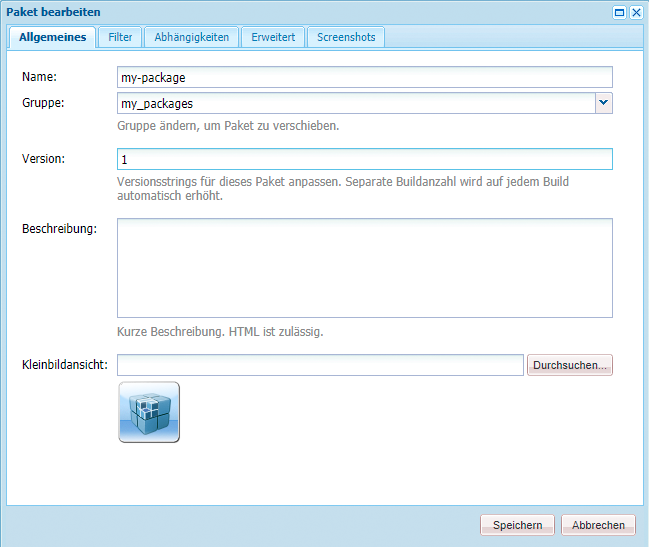

| **Feld** | **Beschreibung** |
|---|---|
| Name | Der Name des Pakets. |
| Gruppe | Der Name der Gruppe, der das Paket hinzugefügt werden soll, um Pakete zu organisieren. Geben Sie den Namen einer neuen Gruppe ein oder wählen Sie eine bestehende Gruppe aus. |
| Version | Text für die benutzerdefinierte Version. |
| Beschreibung | Eine kurze Beschreibung des Pakets. HTML Markup kann für die Formatierung verwendet werden. |
| Miniaturansicht | Das Symbol, das mit der Paketliste angezeigt wird. Klicken Sie auf Durchsuchen , um eine lokale Datei auszuwählen. |


<table> 
 <tbody> 
  <tr> 
   <th><strong>Feld</strong></th> 
   <th><strong>Beschreibung</strong></th> 
   <th><strong>Format/Beispiel</strong></th> 
  </tr> 
  <tr> 
   <td>Name</td> 
   <td>Der Name des Anbieters.</td> 
   <td><em>AEM Geometrixx<br /> </em></td> 
  </tr> 
  <tr> 
   <td>URL</td> 
   <td>URL des Anbieters.</td> 
   <td><em>https://www.aem-geometrixx.com</em></td> 
  </tr> 
  <tr> 
   <td>Link</td> 
   <td>Paketspezifischer Link zu einer Anbieterseite.</td> 
   <td><em>https://www.aem-geometrixx.com/mypackage.html</em></td> 
  </tr> 
  <tr> 
   <td>Erfordert<br /> </td> 
   <td> 
    <ul> 
     <li>Admin: Wählen Sie aus, wann das Paket nur von einem Konto mit Administratorrechten installiert werden kann.</li> 
     <li>Neu starten: Wählen Sie aus, wann der Server nach der Installation des Pakets neu gestartet werden muss.</li> 
    </ul> </td> 
   <td> </td> 
  </tr> 
  <tr> 
   <td>AC-Verwaltung</td> 
   <td><p>Geben Sie an, wie die im Package definierten Zugriffssteuerungsinformationen verarbeitet werden, wenn das Package importiert wird:</p> 
    <ul> 
     <li><strong>Groß-/Kleinschreibung</strong></li> 
     <li><strong>Überschreiben</strong></li> 
     <li><strong>Zusammenführen</strong></li> 
     <li><strong>Klar</strong></li> 
     <li><strong>MergePreserve</strong></li> 
    </ul> <p>Der Standardwert ist <strong>Ignorieren</strong>.</p> </td> 
   <td> 
    <ul> 
     <li><strong>Ignorieren</strong> - ACLs im Repository beibehalten</li> 
     <li><strong>Überschreiben</strong> - Überschreiben von ACLs im Repository</li> 
     <li><strong>Zusammenführen</strong> - Sie führen beide ACL-Sätze zusammen.</li> 
     <li><strong>Löschen</strong> - klare ACLs</li> 
     <li><strong>MergePreserve</strong> - Zusammenführen der Zugriffskontrolle im Inhalt mit dem im Paket enthaltenen durch Hinzufügen der Zugriffssteuerungseinträge der Prinzipale, die nicht im Inhalt vorhanden sind</li> 
    </ul> </td> 
  </tr> 
 </tbody> 
</table>

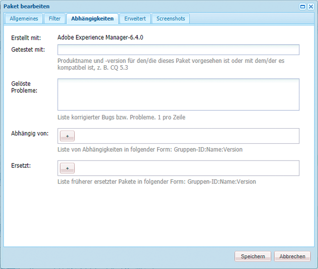

| **Feld** | **Beschreibung** | **Format/Beispiel** |
|---|---|---|
| Getestet mit | Der Produktname und die Version, auf die dieses Paket ausgerichtet ist oder mit denen es kompatibel ist. | *AEM6* |
| Behobene Fehler/Probleme | Ein Textfeld, in dem Sie Details zu Fehlern auflisten können, die mit diesem Paket behoben wurden. Bitte listen Sie jeden Fehler in einer separaten Zeile auf. | bug-nr summary |
| Hängt ab von | Listet Abhängigkeitsinformationen auf, die beachtet werden müssen, wenn andere Pakete erforderlich sind, damit das aktuelle Paket erwartungsgemäß ausgeführt werden kann. Dieses Feld ist bei der Verwendung von Hotfixes wichtig. | groupId:name:version |
| Ersetzt | Eine Liste veralteter Pakete, die dieses Paket ersetzt. Stellen Sie vor der Installation sicher, dass dieses Paket alle erforderlichen Inhalte aus den veralteten Paketen enthält, damit keine Inhalte überschrieben werden. | groupId:name:version |

### Paketfilter {#package-filters}

Filter identifizieren die Repository-Knoten, die in das Paket eingeschlossen werden sollen. Eine **Filterdefinition** legt die folgenden Informationen fest:

* Den **Stammpfad** der einzufügenden Inhalte.
* **Regeln**, durch die spezifische Knoten unterhalb des Stammpfads eingeschlossen oder ausgeschlossen werden.

Filter können keine oder mehr Regeln enthalten. Wenn keine Regeln definiert sind, enthält das Paket alle Inhalte unter dem Stammpfad.

Sie können eine oder mehrere Filterdefinitionen für ein Paket definieren. Verwenden Sie mehr als einen Filter, um Inhalte von mehreren Stammpfaden einzuschließen.


Die folgende Tabelle beschreibt diese Regeln und enthält Beispiele:

<table> 
 <tbody> 
  <tr> 
   <th> Regeltyp</th> 
   <th>Beschreibung </th> 
   <th>Beispiel </th> 
  </tr> 
  <tr> 
   <td> include</td> 
   <td>Sie können einen Pfad definieren oder einen regulären Ausdruck verwenden, um alle Knoten anzugeben, die Sie einbeziehen möchten.<br /> <br /> Das Einschließen eines Ordners bedeutet: 
    <ul> 
     <li>Verzeichnis einschließen <i>und</i> alle Dateien und Ordner in diesem Verzeichnis (d. h. die gesamte Unterstruktur)</li> 
     <li><strong>not</strong> andere Dateien oder Ordner aus unter dem angegebenen Stammverzeichnis einschließen</li> 
    </ul> </td> 
   <td>/libs/sling/install(/.*)? </td> 
  </tr> 
  <tr> 
   <td> exclude</td> 
   <td>Sie können einen Pfad angeben oder einen regulären Ausdruck verwenden, um alle Knoten anzugeben, die Sie ausschließen möchten.<br /> <br /> Wenn Sie ein Verzeichnis ausschließen, wird dieses Verzeichnis ausgeschlossen <i>und</i> alle Dateien und Ordner in diesem Verzeichnis (d. h. die gesamte Unterstruktur).<br /> </td> 
   <td>/libs/wcm/foundation/components(/.*)?</td> 
  </tr> 
 </tbody> 
</table>

>[!NOTE]
>
>Ein Paket kann mehrere Filterdefinitionen enthalten, sodass Knoten aus verschiedenen Speicherorten einfach zu einem Paket kombiniert werden können.

Paketfilter werden meist beim ersten Mal definiert [Package erstellen](#creating-a-new-package), können jedoch auch zu einem späteren Zeitpunkt bearbeitet werden (danach sollte das Paket neu erstellt werden).

### Paket-Screenshots {#package-screenshots}

Sie können Screenshots an Ihr Paket anhängen, um eine visuelle Darstellung des Inhalts zu erhalten. beispielsweise durch Bereitstellung von Screenshots neuer Funktionen.

### Paketsymbole {#package-icons}

Sie können auch ein Symbol an Ihr Paket anhängen, um eine schnelle visuelle Darstellung dessen bereitzustellen, was das Paket enthält. Dies wird dann in der Paketliste angezeigt und kann Ihnen dabei helfen, das Paket oder die Paketklasse einfach zu identifizieren.

Da ein Paket ein Symbol enthalten kann, werden die folgenden Konventionen für offizielle Pakete verwendet:

>[!NOTE]
>
>Um Verwirrung zu vermeiden, verwenden Sie ein beschreibendes Symbol für Ihr Paket und nicht eines der offiziellen Symbole.

Offizielles Hotfix-Paket:


Offizielles AEM Installations- oder Erweiterungspaket:

Offizielle Feature Packs:


## Package Manager {#package-manager}

Der Package Manager verwaltet die Pakete in Ihrer lokalen AEM-Installation. Nachdem Sie [den erforderlichen Berechtigungen zugewiesen wurde](#permissions-needed-for-using-the-package-manager) Sie können den Package Manager für verschiedene Aktionen verwenden, z. B. für die Konfiguration, Erstellung, Download und Installation Ihrer Pakete. Die zu konfigurierenden Schlüsselelemente sind:

* [Paketeinstellungen](#package-settings)
* [Paketfilter](#package-filters)

### Für die Verwendung von Package Manager erforderliche Berechtigungen {#permissions-needed-for-using-the-package-manager}

Um Benutzern das Erstellen, Ändern, Hochladen und Installieren von Paketen zu ermöglichen, müssen Sie ihnen die entsprechenden Berechtigungen an den folgenden Stellen erteilen:

* **/etc/packages** (Vollständige Rechte ohne Löschung)
* der Knoten, der den Paketinhalt enthält

Siehe [Berechtigungen festlegen](/help/sites-administering/security.md) für Anweisungen zum Ändern von Berechtigungen.

### Erstellen eines neuen Pakets {#creating-a-new-package}

So erstellen Sie eine neue Package-Definition:

1. Klicken Sie auf dem AEM Begrüßungsbildschirm auf **Pakete** (oder von **Instrumente** Doppelklicken auf Konsole **Pakete**).

1. Wählen Sie anschließend **Package Manager**.
1. Klicken Sie auf **Paket erstellen**.

   >[!NOTE]
   >
   >Wenn Ihre Instanz viele Pakete enthält, ist möglicherweise eine Ordnerstruktur vorhanden, sodass Sie zum gewünschten Zielordner navigieren können, bevor Sie das neue Paket erstellen.

1. Im Dialogfeld:

   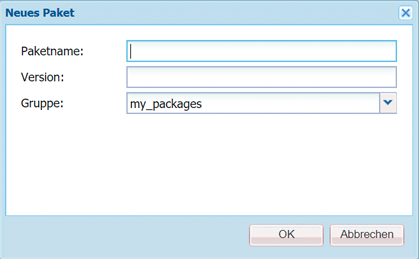

   Geben Sie Folgendes ein:

   * **Gruppenname**

      Der Name der Zielgruppe (oder des Ordners). Gruppen sollen Ihnen bei der Organisation Ihrer Pakete helfen.

      Für die Gruppe wird ein Ordner erstellt, sofern er noch nicht vorhanden ist. Wenn Sie den Gruppennamen leer lassen, wird das Paket in der Hauptpaketliste (Startseite > Pakete) erstellt.

   * **Paket-Name**

      Der Name des neuen Pakets. Wählen Sie einen beschreibenden Namen aus, damit Sie (und andere) den Inhalt des Pakets leicht identifizieren können.

   * **Version**

      Ein Textfeld zur Angabe einer Version. Dieser wird an den Paketnamen angehängt, um den Namen der ZIP-Datei zu bilden.
   Klicken Sie auf **OK**, um das Paket zu erstellen.

1. AEM listet das neue Paket im entsprechenden Gruppenordner auf.

   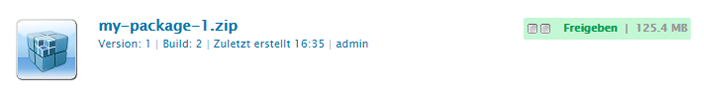

   Klicken Sie auf das Symbol oder den Paketnamen, um es zu öffnen.

   

   >[!NOTE]
   >
   >Sie können bei Bedarf zu einem späteren Zeitpunkt zu dieser Seite zurückkehren.

1. Klicken **Bearbeiten** um die [Paketeinstellungen](#package-settings).

   Hier können Sie Informationen hinzufügen und/oder bestimmte Einstellungen definieren. Diese enthalten beispielsweise eine Beschreibung, die [icon](#package-icons), verwandte Fehler und Anbieterdetails hinzufügen.

   Klicken **OK** nach Abschluss der Bearbeitung der Einstellungen.

1. Hinzufügen **[Screenshots](#package-screenshots)** nach Bedarf in das Paket. Bei der Erstellung des Pakets ist eine Instanz verfügbar. Fügen Sie bei Bedarf weitere hinzu, indem Sie **Paket-Screenshot** aus dem Sidekick.

   Fügen Sie das tatsächliche Bild hinzu, indem Sie auf die Bildkomponente im **Screenshots** Bereich hinzufügen, ein Bild hinzufügen und auf **OK**.

1. Definieren Sie die **[Paketfilter](#package-filters)** durch Ziehen von Instanzen des **Filterdefinition** aus dem Sidekick und doppelklicken Sie dann auf , um zur Bearbeitung zu öffnen:

   

   Geben Sie Folgendes an:

   * **Stammverzeichnis**
der zu verpackende Inhalt; dies kann die Wurzel einer Unterstruktur sein.
   * **Regeln**
Regeln sind optional. Bei einfachen Paketdefinitionen ist es nicht erforderlich, Regeln zum Ein- oder Ausschließen festzulegen.

      Bei Bedarf können Sie entweder [**Einschließen** oder **Ausschließen** Regeln](#package-filters) um den Paketinhalt genau zu definieren.

      Hinzufügen von Regeln mithilfe der **+** -Symbol, alternativ entfernen Sie Regeln mithilfe der **-** Symbol. Regeln werden in der Reihenfolge angewendet, sodass sie nach Bedarf mithilfe der **up** und **Nach** Schaltflächen.
   Klicken Sie anschließend auf **OK** , um den Filter zu speichern.

   >[!NOTE]
   >
   >Sie können beliebig viele Filterdefinitionen verwenden. Achten Sie jedoch darauf, dass keine Konflikte auftreten. Verwendung **Vorschau** um zu bestätigen, was der Paketinhalt sein wird.

1. Um zu bestätigen, was das Paket enthalten wird, können Sie **Vorschau**. Dadurch wird ein Probelauf des Build-Prozesses durchgeführt und alles aufgelistet, was dem Paket hinzugefügt wird, wenn es tatsächlich erstellt wird.
1. Sie können nun das Paket [aufbauen](#building-a-package).

   >[!NOTE]
   >
   >Es ist nicht obligatorisch, das Paket zu diesem Zeitpunkt zu erstellen, es kann zu einem späteren Zeitpunkt durchgeführt werden.

### Aufbauen eines Pakets {#building-a-package}

Ein Paket wird oft gleichzeitig mit Ihnen erstellt [Package-Definition erstellen](#creating-a-new-package), Sie können jedoch zu einem späteren Zeitpunkt zurückkehren, um das Paket zu erstellen oder neu zu erstellen. Dies kann nützlich sein, wenn sich der Inhalt im Repository geändert hat.

>[!NOTE]
>
>Vor der Erstellung des Pakets kann es nützlich sein, die Inhalte des Pakets in der Vorschau anzuzeigen. Klicken Sie hierzu auf **Vorschau**.

1. Öffnen Sie die Package-Definition unter **Package Manager** (klicken Sie auf das Paketsymbol oder den Paketnamen).

1. Klicken Sie auf **Aufbauen**. Ein Dialogfeld fordert Sie auf zu bestätigen, dass Sie das Paket erstellen möchten.

   >[!NOTE]
   >
   >Dies ist besonders wichtig, wenn Sie ein Paket neu erstellen, da die Paketinhalte überschrieben werden.

1. Klicken Sie auf **OK**. AEM erstellt das Paket und listet alle Inhalte auf, die dem Paket hinzugefügt wurden. Nachdem der Vorgang abgeschlossen ist, zeigt AEM eine Bestätigung an, dass das Paket aufgebaut wurde. Zudem aktualisiert AEM die Paketlisteninformationen (wenn Sie das Dialogfeld schließen).

### Neuverpacken eines Pakets {#rewrapping-a-package}

Nachdem ein Paket erstellt wurde, kann es bei Bedarf neu eingeschlossen werden.

Durch das erneute Umbrechen werden die Paketinformationen geändert - *without* den Paketinhalt ändern. Paketinformationen sind die Miniaturansicht, Beschreibung usw., d. h. alles, was Sie mit der **Paketeinstellungen** Dialogfeld (klicken Sie auf **Bearbeiten**).

Ein wichtiger Anwendungsfall für die Neueingliederung ist die Vorbereitung eines Pakets für die Paketfreigabe. Sie können beispielsweise ein vorhandenes Paket haben und es für andere freigeben. Dazu möchten Sie eine Miniaturansicht hinzufügen und eine Beschreibung hinzufügen. Anstatt das gesamte Paket mit allen Funktionen neu zu erstellen (was einige Zeit in Anspruch nehmen kann und das Risiko birgt, dass das Paket nicht mehr mit dem Original identisch ist), können Sie es neu einschließen und einfach die Miniatur und Beschreibung hinzufügen.

1. Öffnen Sie die Package-Definition unter **Package Manager** (klicken Sie auf das Paketsymbol oder den Paketnamen).

1. Klicken Sie auf **Bearbeiten** und aktualisieren Sie die **[Paketeinstellungen](#package-settings)** nach Bedarf. Klicken Sie zum Speichern auf **OK**.

1. Klicken **Rewrap**, wird ein Bestätigungsdialogfeld angezeigt.

### Anzeigen und Bearbeiten von Paketinformationen {#viewing-and-editing-package-information}

So zeigen Sie Informationen zu einer Package-Definition an oder bearbeiten sie:

1. Navigieren Sie im Package Manager zu dem Paket, das Sie anzeigen möchten.
1. Klicken Sie auf das Paketsymbol des Pakets, das Sie anzeigen möchten. Dadurch wird die Paketseite mit Informationen zur Paketdefinition geöffnet:

   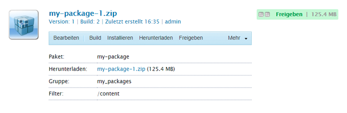

   >[!NOTE]
   >
   >Sie können auf dieser Seite auch bestimmte Aktionen für das Paket bearbeiten und durchführen.
   >
   >Die verfügbaren Schaltflächen hängen davon ab, ob das Paket bereits erstellt wurde oder nicht.

1. Wenn das Paket bereits erstellt wurde, klicken Sie auf **Inhalt**, öffnet sich ein Fenster und listet den gesamten Inhalt des Pakets auf:

### Anzeigen von Paketinhalten und Testen der Installation {#viewing-package-contents-and-testing-installation}

Nachdem ein Package erstellt wurde, können Sie den Inhalt anzeigen:

1. Navigieren Sie im Package Manager zu dem Paket, das Sie anzeigen möchten.
1. Klicken Sie auf das Paketsymbol des Pakets, das Sie anzeigen möchten. Dadurch wird die Paketseite mit Informationen zur Paketdefinition geöffnet.

1. Um den Inhalt anzuzeigen, klicken Sie auf **Inhalt**, öffnet sich ein Fenster und listet den gesamten Inhalt des Pakets auf:

   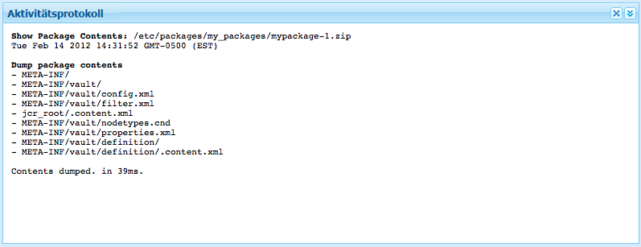

1. Klicken Sie auf , um einen Probelauf der Installation durchzuführen. **Testinstallation**. Nachdem Sie die Aktion bestätigt haben, wird ein Fenster geöffnet, in dem die Ergebnisse so aufgelistet werden, als ob die Installation durchgeführt wurde:

   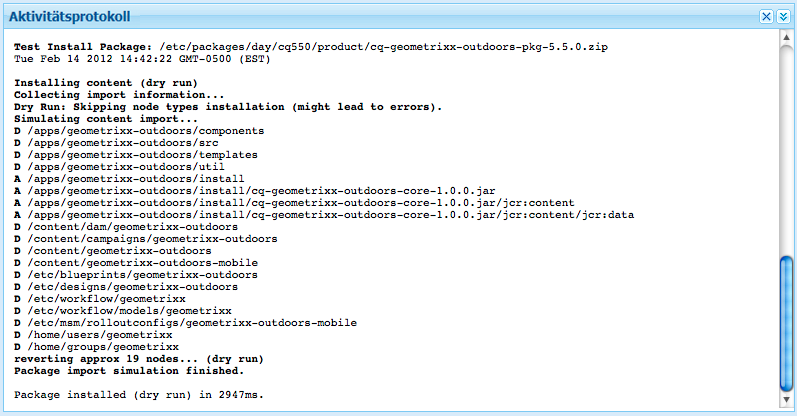

### Herunterladen von Paketen in das Dateisystem {#downloading-packages-to-your-file-system}

In diesem Abschnitt wird beschrieben, wie Sie ein Paket von AEM in Ihr Dateisystem herunterladen, indem Sie **Package Manager**.

>[!NOTE]
>
>Siehe [Package Share](#package-share) für Informationen zum Herunterladen von Hotfixes, Feature Packs und Paketen aus dem öffentlichen Bereich und dem internen Bereich der Paketfreigabe Ihres Unternehmens.
>
>In Package Share können Sie Folgendes tun:
>
>* Pakete herunterladen von [Package Share direkt in Ihrer lokalen AEM-Instanz](#downloading-and-installing-packages-from-package-share).\
   >  Nach dem Herunterladen wird das Paket in Ihr Repository importiert. Danach können Sie es sofort auf Ihrer lokalen Instanz mit der **Package Manager**. Diese Pakete enthalten Hotfixes und andere freigegebene Pakete.
>
>* Pakete herunterladen von [Package Share auf Ihrem Dateisystem](#downloading-packages-to-your-file-system-from-package-share).
>


1. Klicken Sie auf dem AEM Begrüßungsbildschirm auf **Pakete**, wählen Sie **Package Manager**.
1. Navigieren Sie zum Paket, das Sie herunterladen möchten.

   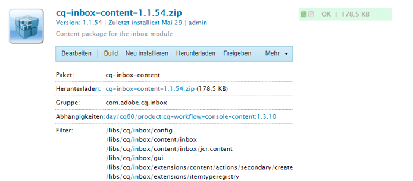

1. Klicken Sie auf den Link, der sich aus dem Namen der ZIP-Datei (unterstrichen) für das Paket ergibt, das Sie herunterladen möchten. Beispiel `export-for-offline.zip`.

   AEM lädt das Paket auf Ihren Computer herunter (mithilfe eines standardmäßigen Browser-Download-Dialogfelds).

### Hochladen von Paketen vom Dateisystem {#uploading-packages-from-your-file-system}

Mit einem Package-Upload können Sie ein Paket aus Ihrem Dateisystem in den AEM Package Manager hochladen.

>[!NOTE]
>
>Siehe [Hochladen von Paketen in die unternehmensinterne Paketfreigabe](#uploading-a-package) , um ein Paket in den privaten Bereich von Package Share Ihres Unternehmens hochzuladen.

So laden Sie ein Paket hoch:

1. Navigieren Sie zum **Package Manager**. Navigieren Sie dann zum Gruppenordner, in den das Paket hochgeladen werden soll.

   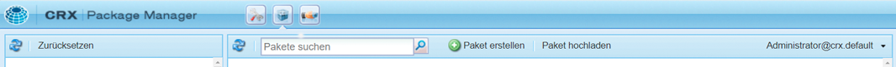

1. Klicken Sie auf **Paket hochladen**.

   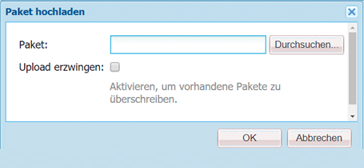

   * **File**

      Sie können entweder den Dateinamen direkt eingeben oder die **Durchsuchen...** Dialogfeld zum Auswählen des erforderlichen Pakets aus Ihrem lokalen Dateisystem (klicken Sie nach Auswahl auf **OK**).

   * **Hochladen erzwingen**

      Wenn bereits ein Paket mit diesem Namen existiert, können Sie auf dieses klicken, um den Upload zu erzwingen (und das vorhandene Paket zu überschreiben).
   Klicken **OK** damit das neue Paket hochgeladen und in der Package Manager-Liste aufgeführt wird.

   >[!NOTE]
   >
   >Stellen Sie sicher, dass die Inhalte AEM zur Verfügung stehen. [Paket installieren](#installing-packages).

### Validieren von Paketen {#validating-packages}

Vor der Installation eines Packages sollten Sie dessen Inhalt überprüfen. Da Pakete überlagerte Dateien ändern können unter `/apps` und/oder fügen, ändern und entfernen Sie ACLs, es ist oft nützlich, diese Änderungen vor der Installation zu validieren.

#### Validierungsoptionen {#validation-options}

Der Validierungsmechanismus kann die folgenden Merkmale des Pakets überprüfen:

* OSGi-Paketimporte
* Überlagerungen
* ACLs

Diese Optionen werden nachfolgend beschrieben.

* **Validieren von OSGi-Paketimporten**

   **Prüfumfang**

   Diese Validierung prüft das Paket auf alle JAR-Dateien (OSGi-Bundles) und extrahiert deren `manifest.xml` (enthält die versionierten Abhängigkeiten, von denen das OSGi-Bundle abhängt) und überprüft, ob die AEM Instanz diese Abhängigkeiten mit den richtigen Versionen exportiert.

   **Reporting**

   Alle versionierten Abhängigkeiten, die von der AEM nicht erfüllt werden können, werden im **Aktivitätsprotokoll** des Package Managers.

   **Fehlerstatus**

   Wenn Abhängigkeiten nicht erfüllt sind, starten die OSGi-Bundles im Paket mit diesen Abhängigkeiten nicht. Dies führt zu einer fehlerhaften Anwendungsbereitstellung, da alles, was auf das nicht gestartete OSGi-Bundle angewiesen ist, wiederum nicht ordnungsgemäß funktioniert.

   **Fehlerbehebung**

   Um Fehler zu beheben, die auf nicht zufrieden gestellte OSGi-Bundles zurückzuführen sind, muss die Abhängigkeitsversion im Bundle mit unzureichenden Importen angepasst werden.

* **Bestätigen von Überlagerungen**

   **Prüfumfang**

   Diese Validierung ermittelt, ob das installierte Paket eine Datei enthält, die bereits in der Ziel-AEM-Instanz überlagert ist.

   Beispiel: Bei einer bestehenden Überlagerung unter `/apps/sling/servlet/errorhandler/404.jsp` ändert ein Paket, das `/libs/sling/servlet/errorhandler/404.jsp` enthält, die vorhandene Datei unter `/libs/sling/servlet/errorhandler/404.jsp`.

   **Reporting**

   Solche Überlagerungen werden im Abschnitt **Aktivitätsprotokoll** des Package Managers.

   **Fehlerstatus**

   Ein Fehlerstatus bedeutet, dass das Paket versucht, eine bereits überlagerte Datei bereitzustellen. Daher werden die Änderungen im Paket durch die Überlagerung überschrieben (und daher &quot;ausgeblendet&quot;) und nicht übernommen.

   **Fehlerbehebung**

   Um dieses Problem zu beheben, muss der Betreuer der Überlagerungsdatei in `/apps` muss die Änderungen an der überlagerten Datei in `/libs` und die erforderlichen Änderungen in die Überlagerung ( `/apps`) und stellen Sie die überlagerte Datei erneut bereit.

   >[!NOTE]
   >
   >Beachten Sie, dass der Validierungsmechanismus keine Möglichkeit zur Abstimmung bietet, wenn der überlagerte Inhalt ordnungsgemäß in die Überlagerungsdatei integriert wurde. Daher berichtet diese Validierung auch weiterhin über Konflikte, selbst wenn die erforderlichen Änderungen vorgenommen wurden.

* **Bestätigen von ACLs**

   **Prüfumfang**

   Diese Validierung prüft, welche Berechtigungen hinzugefügt werden, wie sie verarbeitet werden (Zusammenführen/Ersetzen) und ob die aktuellen Berechtigungen betroffen sind.

   **Reporting**

   Die Berechtigungen werden im Abschnitt **Aktivitätsprotokoll** des Package Managers.

   **Fehlerstatus**

   Es können keine expliziten Fehler angegeben werden. Die Validierung gibt lediglich an, ob durch die Installation des Pakets neue ACL-Berechtigungen hinzugefügt oder beeinträchtigt werden.

   **Fehlerbehebung**

   Mithilfe der von der Validierung bereitgestellten Informationen können die betroffenen Knoten in CRXDE überprüft werden und die ACLs können im Paket nach Bedarf angepasst werden.

   >[!CAUTION]
   >
   >Als Best Practice wird empfohlen, dass Pakete keine AEM bereitgestellten ACLs beeinträchtigen sollten, da dies zu unerwartetem Produktverhalten führen kann.

#### Durchführen der Validierung {#performing-validation}

Die Validierung von Paketen kann auf zwei verschiedene Arten erfolgen:

* Über die Package Manager-Benutzeroberfläche
* Über HTTP-POST-Anfragen, wie z. B. mit cURL

>[!NOTE]
>
>Führen Sie die Validierung stets nach dem Hochladen und vor dem Installieren eines Pakets durch.

**Paketvalidierung über Package Manager**

1. Öffnen Sie Package Manager unter `https://<server>:<port>/crx/packmgr`
1. Wählen Sie das Paket in der Liste aus und klicken Sie auf **Mehr** Dropdown-Liste aus der Überschrift und **Bestätigen** aus dem Dropdown-Menü.

   >[!NOTE]
   >
   >Dies sollte nach dem Hochladen des Inhaltspakets, aber vor der Installation des Pakets erfolgen.

1. Aktivieren Sie im angezeigten modalen Dialogfeld das Kontrollkästchen der gewünschten Validierungstypen und starten Sie die Validierung durch Klicken auf **Überprüfen**. Klicken Sie alternativ auf **Abbrechen**.

1. Die ausgewählten Validierungen werden ausgeführt. Die Ergebnisse werden im Aktivitätsprotokoll des Package Managers angezeigt.

**Paketvalidierung über HTTP-POST-Anfrage**

Die POST-Anfrage hat folgendes Format.

```
https://<host>:<port>/crx/packmgr/service.jsp?cmd=validate&type=osgiPackageImports,overlays,acls
```

>[!NOTE]
>
>Die `type` -Parameter kann eine beliebige kommagetrennte ungeordnete Liste sein, die aus Folgendem besteht:
>
>* `osgiPackageImports`
>* `overlays`
>* `acls`
>
>Der Wert von `type` standardmäßig auf `osgiPackageImports` wenn nicht übergeben wurde.

Im Folgenden finden Sie ein Beispiel für die Verwendung von cURL zum Ausführen einer Paketvalidierung.

1. Wenn Sie cURL verwenden, führen Sie eine Anweisung ähnlich der folgenden aus:

   ```shell
   curl -v -X POST --user admin:admin -F file=@/Users/SomeGuy/Desktop/core.wcm.components.all-1.1.0.zip 'http://localhost:4502/crx/packmgr/service.jsp?cmd=validate&type=osgiPackageImports,overlays,acls'
   ```

1. Die angeforderte Validierung wird ausgeführt und die Antwort wird als JSON-Objekt zurückgesendet.

>[!NOTE]
>
>Die Antwort auf eine Anfrage zur Validierung einer HTTP-POST ist ein JSON-Objekt mit den Überprüfungsergebnissen.

### Installieren von Paketen {#installing-packages}

Nach dem Hochladen eines Pakets müssen Sie den Inhalt installieren. Damit der Paketinhalt installiert und funktionsfähig ist, muss er beide sein:

* in AEM geladen (entweder [aus Ihrem Dateisystem hochgeladen](#uploading-packages-from-your-file-system) oder [heruntergeladen von Package Share](#downloading-and-installing-packages-from-package-share))

* installiert

>[!CAUTION]
>
>Durch die Installation eines Pakets können vorhandene Inhalte überschrieben oder gelöscht werden. Laden Sie ein Paket nur hoch, wenn Sie sicher sind, dass es keine benötigten Inhalte löscht oder überschreibt.
>
>Um den Inhalt oder die Auswirkungen eines Pakets anzuzeigen, können Sie:
>
>* Führen Sie eine Testinstallation des Pakets durch, ohne den Inhalt zu ändern:\
   >  Öffnen Sie das Paket (klicken Sie auf das Paketsymbol oder den Paketnamen) und klicken Sie auf **Testen der Installation**.
>
>* Eine Liste der Paketinhalte anzeigen:\
   >  Öffnen Sie das Paket und klicken Sie auf **Inhalt**.
>


>[!NOTE]
>
>Unmittelbar vor der Installation des Pakets wird ein Snapshot-Paket erstellt, das den Inhalt enthält, der überschrieben wird.
>
>Dieser Schnappschuss wird erneut installiert, wenn Sie das Paket deinstallieren.

>[!CAUTION]
>
>Wenn Sie digitale Assets installieren, müssen Sie:
>
>* Deaktivieren Sie zunächst den WorkflowLauncher.\
   >  Verwenden Sie die Menüoption „Komponenten“ der OSGi-Konsole zur Deaktivierung der Option `com.day.cq.workflow.launcher.impl.WorkflowLauncherImpl`.
>
>* Wenn die Installation abgeschlossen ist, reaktivieren Sie den WorkflowLauncher erneut.
>
>Durch Deaktivieren des WorkflowLauncher wird sichergestellt, dass das Assets Importer-Framework die Assets bei der Installation nicht (unbeabsichtigt) manipuliert.

1. Navigieren Sie im Package Manager zu dem Paket, das Sie installieren möchten.

   Ein **Installieren** -Schaltfläche wird auf der Seite von Paketen angezeigt, die noch nicht installiert wurden.

   >[!NOTE]
   >
   >Alternativ können Sie das Paket öffnen, indem Sie auf sein Symbol klicken, um auf die **Installieren** dort.

1. Klicken **Installieren** um die Installation zu starten. Es wird ein Dialogfeld mit einer Liste aller vorgenommenen Änderungen und der Aufforderung zur Bestätigung angezeigt. Klicken Sie zum Abschluss auf **Schließen** im Dialogfeld.

   Das Wort **Installiert** neben dem Paket angezeigt, nachdem es installiert wurde.

### Dateisystembasiertes Hochladen und Installieren {#file-system-based-upload-and-installation}

Es gibt eine alternative Möglichkeit, Pakete in Ihre Instanz hochzuladen und zu installieren. In Ihrem Dateisystem verfügen Sie über eine `crx-quicksart` Ordner neben Ihrer JAR-Datei und `license.properties` -Datei. Sie müssen einen Ordner mit dem Namen `install` under `crx-quickstart`. Sie haben dann Folgendes: `<aem_home>/crx-quickstart/install`

In dieser Installation, Ordner, können Sie direkt Ihre Pakete hinzufügen. Sie werden automatisch auf Ihre Instanz hochgeladen und dort installiert. Nach Abschluss des Vorgangs können Sie die Pakete im Package Manager sehen.

Wenn Ihre Instanz ausgeführt wird, fügen Sie dem `install` startet direkt den Upload und die Installation auf der Instanz. Wenn Ihre Instanz nicht ausgeführt wird, werden die Pakete, die Sie in die `install` wird beim Start in alphabetischer Reihenfolge installiert.

>[!NOTE]
>
>Sie können dies auch tun, bevor Sie die Instanz zum ersten Mal starten. Dazu müssen Sie die `crx-quickstart` Ordner manuell erstellen, erstellen Sie die `install` Ordner darunter und legen Sie Ihre Pakete dorthin. Wenn Sie Ihre Instanz zum ersten Mal starten, werden die Pakete in alphabetischer Reihenfolge installiert.

### Deinstallieren von Paketen {#uninstalling-packages}

AEM ermöglicht die Deinstallation von Paketen. Durch diese Aktion wird der Inhalt des Repositorys zurückgesetzt, der auf den Schnappschuss unmittelbar vor der Paketinstallation wirkt.

>[!NOTE]
>
>Bei der Installation wird ein Snapshot-Paket erstellt, das den zu überschreibenden Inhalt enthält.
>
>Dieses Paket wird erneut installiert, wenn Sie das Paket deinstallieren.

1. Navigieren Sie im Package Manager zu dem Paket, das Sie deinstallieren möchten.
1. Klicken Sie auf das Paketsymbol des Pakets, das Sie deinstallieren möchten.
1. Klicken **Deinstallieren** , um den Inhalt dieses Pakets aus dem Repository zu entfernen. Es wird ein Dialogfeld mit einer Liste aller vorgenommenen Änderungen und der Aufforderung zur Bestätigung angezeigt. Klicken Sie zum Abschluss auf **Schließen** im Dialogfeld.

### Löschen von Packages {#deleting-packages}

So löschen Sie ein Paket aus der/den Package Manager-Liste(n):

>[!NOTE]
>
>Die installierten Dateien/Knoten aus dem Paket sind **not** gelöscht.

1. Im **Instrumente** Konsolen, erweitern Sie die **Pakete** Ordner, um Ihr Paket im rechten Bereich anzuzeigen.

1. Klicken Sie auf das Paket, das Sie löschen möchten, damit es hervorgehoben wird, und wählen Sie dann Folgendes aus:

   * Klicken **Löschen** im Menü der Symbolleiste.
   * Klicken Sie mit der rechten Maustaste und wählen Sie **Löschen**.

   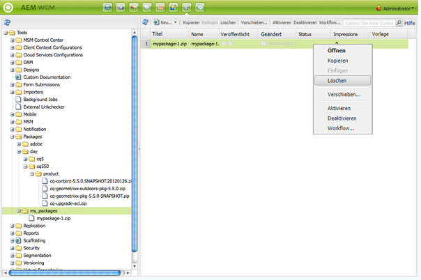

1. Daraufhin werden sie von AEM aufgefordert zu bestätigen, dass Sie das Paket löschen möchten. Klicken Sie auf **OK**, um den Löschvorgang zu bestätigen.

>[!CAUTION]
>
>Wenn dieses Paket bereits installiert wurde, wird die *installiert* Inhalt wird **not** gelöscht werden.

### Replizieren von Paketen {#replicating-packages}

Replizieren Sie den Inhalt eines Pakets, um es in der Veröffentlichungsinstanz zu installieren:

1. Im **Package Manager**, navigieren Sie zu dem Paket, das Sie replizieren möchten.

1. Klicken Sie auf das Symbol oder den Namen des Pakets, das Sie replizieren möchten, um es zu erweitern.
1. Im **Mehr** Dropdown-Menü in der Symbolleiste auswählen **Replizieren**.

## Package Share {#package-share}

Package Share war ein zentralisierter Server, der öffentlich für die Freigabe von Inhaltspaketen zur Verfügung gestellt wurde.

Sie wurde ersetzt durch [Softwareverteilung.](#software-distribution)

## Software Distribution {#software-distribution}

[Softwareverteilung](https://downloads.experiencecloud.adobe.com) ist die neue Benutzeroberfläche, die die Suche und den Download von AEM-Paketen vereinfacht.

Weitere Informationen finden Sie in der [Dokumentation zur Software-Verteilung.](https://experienceleague.adobe.com/docs/experience-cloud/software-distribution/home.html?lang=de)

>[!CAUTION]
>
>AEM Paketmanager kann derzeit nicht mit Software Distribution verwendet werden. Sie laden Ihre Pakete auf Ihre lokale Festplatte herunter.
