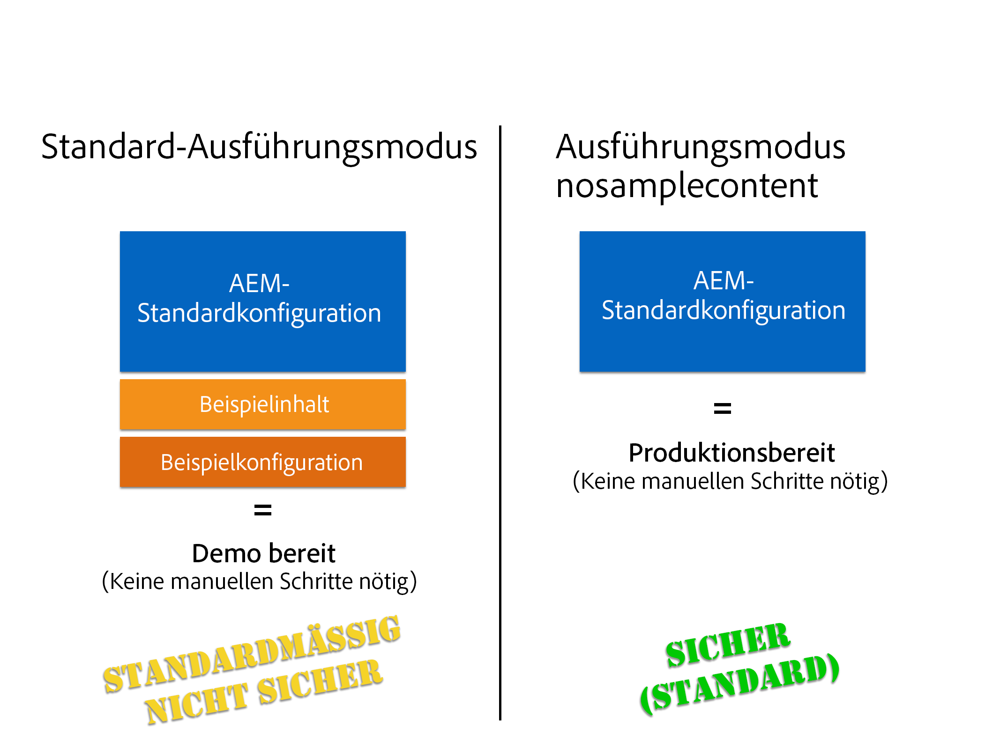

# Ausführen von AEM im produktionsbereiten Modus{#running-aem-in-production-ready-mode}

>[!CAUTION]
>
>AEM 6.4 hat das Ende der erweiterten Unterstützung erreicht und diese Dokumentation wird nicht mehr aktualisiert. Weitere Informationen finden Sie in unserer [technische Unterstützung](https://helpx.adobe.com/de/support/programs/eol-matrix.html). Unterstützte Versionen suchen [here](https://experienceleague.adobe.com/docs/?lang=de).

Mit AEM 6.1 hat Adobe den neuen `"nosamplecontent"`-Ausführungsmodus eingeführt, der der Automatisierung der für die Vorbereitung einer AEM-Instanz zur Bereitstellung einer Produktionsumgebung erforderlichen Schritte dient.

Der neue Ausführungsmodus konfiguriert nicht nur automatisch die Instanz, um die in der Sicherheitsprüfliste beschriebenen Best Practices für die Sicherheit einzuhalten, sondern entfernt darüber hinaus alle Geometrixx-Beispielsanwendungen und -konfigurationen innerhalb des Prozesses.

>[!NOTE]
>
>Da aus praktischen Gründen der AEM produktionsbereite Modus nur die meisten Aufgaben abdeckt, die zum Sichern einer Instanz erforderlich sind, wird empfohlen, die [Sicherheitscheckliste](/help/sites-administering/security-checklist.md) bevor Sie mit Ihrer Produktionsumgebung live gehen.
>
>Beachten Sie außerdem, dass die Ausführung von AEM im produktionsbereiten Modus den Zugriff auf die CRXDE Lite effektiv deaktiviert. Wenn Sie es zum Debuggen benötigen, finden Sie unter [Aktivieren von CRXDE Lite in AEM](/help/sites-administering/enabling-crxde-lite.md) weitere Informationen.



Für die Ausführung von AEM im produktionsbereiten Modus müssen Sie nur `nosamplecontent` über den Ausführungsmodus-Schalter `-r` zu Ihren vorhandenen Startargumenten hinzufügen:

```shell
java -jar aem-quickstart.jar -r nosamplecontent
```

Beispielsweise können Sie den produktionsbereiten Modus zum Starten einer Autoreninstanz mit MongoDB-Persistenz verwenden:

```shell
java -jar aem-quickstart.jar -r author,crx3,crx3mongo,nosamplecontent -Doak.mongo.uri=mongodb://remoteserver:27017 -Doak.mongo.db=aem-author
```

## Ändern eines Teils des produktionsbereiten Modus {#changes-part-of-the-production-ready-mode}

Genauer gesagt werden die folgenden Konfigurationsveränderungen durchgeführt, wenn AEM im produktionsbereiten Modus ausgeführt wird:

1. Das **CRXDE-Support-Bundle** (`com.adobe.granite.crxde-support`) ist im produktionsbereiten Modus standardmäßig deaktiviert. Es kann jederzeit über das öffentliche Maven-Repository von Adobe installiert werden. Version 3.0.0 ist für AEM 6.1 erforderlich.

1. Das Bundle **Apache Sling Simple WebDAV Access to repositories** (`org.apache.sling.jcr.webdav`) ist nur für **Autoreninstanzen** verfügbar.

1. Neu erstellte Benutzer müssen das Passwort bei der ersten Anmeldung ändern. Dies gilt nicht für den Admin-Benutzer.
1. Die Funktion zum **** Erzeugen von Debug-Informationen ist für den **Apache Sling Java Script Handler** deaktiviert.

1. **Die Funktionen zum zugeordneten Inhalt** und **zum Erzeugen von Debug-Informationen** sind für den **Apache Sling Jsp Script Handler** deaktiviert.

1. Der **Day CQ WCM-Filter** ist auf `edit` bei der **Autoreninstanz** und auf `disabled` bei der **Veröffentlichungsinstanz** eingestellt.

1. Der **Adobe Granite HTML Library Manager** wird mit den folgenden Einstellungen konfiguriert:

   1. **Minify:** `enabled`
   1. **Debug:** `disabled`
   1. **Gzip:** `enabled`
   1. **Timing:** `disabled`

1. Das **Apache Sling Get Servlet** ist so eingestellt, dass es sichere Konfigurationen standardmäßig unterstützt, so zum Beispiel wie folgt:

| **Konfiguration** | **Autor** | **Veröffentlichen** |
|---|---|---|
| TXT-Ausgabedarstellung | disabled | disabled |
| HTML-Ausgabedarstellung | disabled | disabled |
| JSON-Ausgabedarstellung | enabled | enabled |
| XML-Ausgabedarstellung | disabled | disabled |
| json.maximumresults | 1000 | 100 |
| Auto Index | disabled | disabled |
