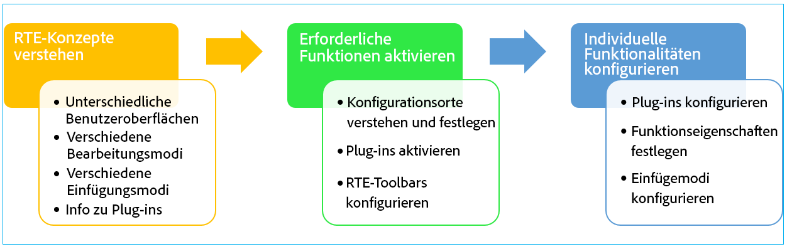
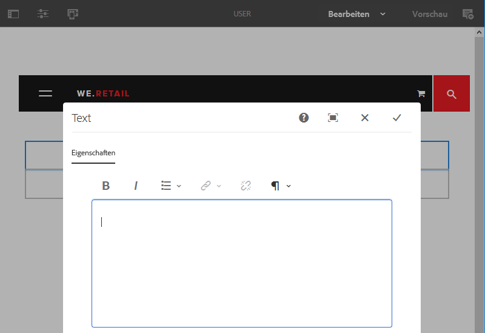
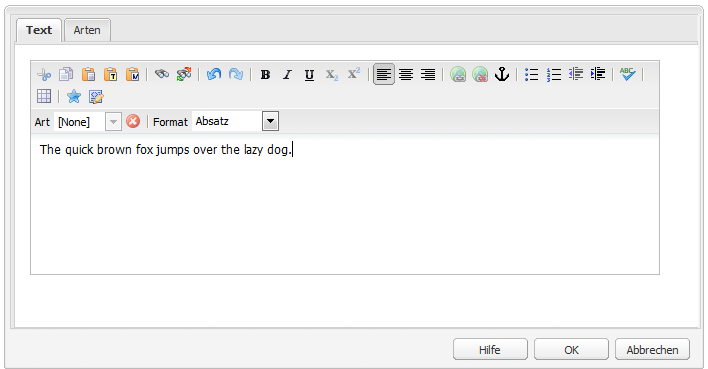

# Konfigurieren des Rich-Text-Editors {#configure-the-rich-text-editor}

>[!CAUTION]
>
>AEM 6.4 hat das Ende der erweiterten Unterstützung erreicht und diese Dokumentation wird nicht mehr aktualisiert. Weitere Informationen finden Sie in unserer [technische Unterstützung](https://helpx.adobe.com/de/support/programs/eol-matrix.html). Unterstützte Versionen suchen [here](https://experienceleague.adobe.com/docs/?lang=de).

Der Rich-Text-Editor (RTE) bietet Autoren eine Vielzahl von Funktionen zum Bearbeiten von Textinhalten. Symbole, Auswahlfelder, Symbolleisten und Menüs werden für eine WYSIWYG-Textbearbeitung bereitgestellt.

Informationen zur Verwendung der Authoring-Funktionen des RTE finden Sie unter [Verwenden des Rich-Text-Editors für das Authoring](/help/sites-authoring/rich-text-editor.md). Der RTE kann konfiguriert werden, um die in den Authoring-Komponenten verfügbaren Funktionen zu aktivieren, zu deaktivieren und zu erweitern. Der folgende Workflow veranschaulicht die empfohlene Reihenfolge für die RTE-Konfigurationsaufgaben in Experience Manager.



*Abbildung: Typischer Workflow zum Konfigurieren des Rich-Text-Editors*

## Grundlegendes zur Touch-optimierten und klassischen Benutzeroberfläche {#understand-touch-enabled-ui-and-classic-ui}

Die Touch-optimierte Benutzeroberfläche ist die standardmäßige Benutzeroberfläche für AEM. Adobe eingeführt Touch-Benutzeroberfläche mit [responsives Design](/help/sites-authoring/responsive-layout.md) für die Authoring-Umgebung, in Version 5.6. Die Touch-Benutzeroberfläche ist für Touch- und Desktop-Geräte entwickelt. Die Benutzeroberfläche unterscheidet sich erheblich von der klassischen Originalbenutzeroberfläche.


*Abbildung: Rich-Text-Editor-Symbolleiste in der Touch-optimierten Benutzeroberfläche*


*Abbildung: Rich-Text-Editor-Symbolleiste in der klassischen Benutzeroberfläche*

>[!MORELIKETHIS]
>
>* [Empfehlungen für die Benutzeroberfläche](/help/sites-deploying/ui-recommendations.md).
>* Informationen zur Einstellung der klassischen Benutzeroberfläche finden Sie unter [AEM 6.4 - Versionshinweise](/help/release-notes/deprecated-removed-features.md)
>* Informationen zu den Unterschieden zwischen den Benutzeroberflächen finden Sie unter [Touch-optimierte und klassische Benutzeroberfläche](https://aemcq5pedia.wordpress.com/2018/01/05/touch-enabled-ui-aem6-3/).
>* Detaillierte Informationen zur Touch-optimierten Benutzeroberfläche finden Sie unter [Konzepte AEM Touch-Benutzeroberfläche](/help/sites-developing/touch-ui-concepts.md)


## Verschiedene Bearbeitungsmodi {#editingmodes}

Autoren können Textinhalte in AEM mithilfe der verschiedenen Komponentenmodi erstellen und bearbeiten. Die Symbolleistenoptionen für das Authoring und Formatieren von Inhalten sowie das Benutzererlebnis von RTE-aktivierten Komponenten im verschiedenen Bearbeitungsmodus variieren je nach RTE-Konfigurationen.

| Bearbeitungsmodus | Bearbeitungsbereich | Für die Aktivierung empfohlene Funktionen | Touch-optimierte Benutzeroberfläche | Klassische Benutzeroberfläche |
|--- |--- |--- |--- |--- |
| Inline | Bearbeitung im Kontext für schnelle, geringfügige Änderungen; Formatieren ohne Öffnen eines Dialogfelds | Minimale RTE-Funktionen | Y | Y |
| RTE-Vollbild | Füllt die gesamte Seite aus | Alle erforderlichen RTE-Funktionen | Y | N |
| Dialogfeld | Dialogfeld, das oberhalb des Seiteninhalts angezeigt wird, jedoch nicht die gesamte Seite einnimmt | Alle erforderlichen RTE-Funktionen in der klassischen Benutzeroberfläche; Funktionen sollten in der Touch-optimierten Benutzeroberfläche umsichtig aktiviert werden | Y | Y |
| Dialogfeld-Vollbildmodus | Wie im Vollbildmodus; enthält neben dem RTE Felder des Dialogfelds | Alle erforderlichen RTE-Funktionen | Y | N |

>[!NOTE]
>
>In der Touch-optimierten Benutzeroberfläche ist die Quellbearbeitungsfunktion im Inline-Bearbeitungsmodus nicht verfügbar. Im Vollbildmodus können Sie Bilder nicht per Drag-and-Drop verschieben. Alle anderen Funktionen sind in allen Modi verfügbar.

### Inline-Bearbeitung {#inline-editing}

Beim Öffnen (durch langsames Doppeltippen/Klicken) kann der Inhalt innerhalb der Seite bearbeitet werden. Eine kompakte Symbolleiste mit grundlegenden Optionen erscheint.


*Abbildung: Inline-Bearbeitung mit einfacher Symbolleiste in der Touch-optimierten Benutzeroberfläche*

In der klassischen Benutzeroberfläche ermöglicht ein langsamer Doppelklick auf die Komponente die Inline-Bearbeitung und ein orangefarbener Entwurf hebt den Inhalt hervor. Wenn die Inhaltssuche geöffnet ist, wird oben im Fenster eine Symbolleiste mit den verfügbaren RTE-Formatierungsoptionen angezeigt. Ist der Content Finder nicht geöffnet, werden die Formatierungsoptionen nicht angezeigt und Sie können nur grundlegende Textbearbeitungen vornehmen.

### Bearbeitung im Vollbildmodus {#full-screen-editing}

AEM Komponenten können in der Vollbildansicht geöffnet werden, die den Seiteninhalt ausblendet und den verfügbaren Bildschirm einnimmt. Die Bearbeitung im Vollbildmodus ist quasi eine detaillierte Version der Inline-Bearbeitung, da sie die meisten Bearbeitungsmöglichkeiten bietet. Wenn Sie sich im Inline-Bearbeitungsmodus befinden, kann sie durch Klicken auf  in der kompakten Symbolleiste geöffnet werden.

Der Dialogfeld-Vollbildmodus bietet eine detaillierte RTE-Symbolleiste sowie die Optionen und Komponenten, die im Dialogfeldmodus verfügbar sind. Dies gilt nur für ein Dialogfeld, das neben anderen Komponenten einen RTE enthält.


*Abbildung: Die detaillierte RTE-Symbolleiste bei der Bearbeitung im Vollbildmodus in der Touch-optimierten Benutzeroberfläche*

### Bearbeitung in einem Dialogfeld {#dialog-editing}

Wenn Sie in der klassischen Benutzeroberfläche auf eine Komponente doppelklicken, wird ein Dialogfeld zur Bearbeitung des Inhalts geöffnet. Das Dialogfeld wird über der vorhandenen Seite geöffnet. In bestimmten Fällen kann dieses Dialogfeld auch als Popup-Fenster geöffnet werden. Dies ist beispielsweise der Fall, wenn eine Textkomponente Teil einer Spalte in einem mehrspaltigen Seitenlayout ist und zu wenig Platz für die Anzeige des Dialogfelds vorhanden ist.



*Abbildung: Dialogfeld-Bearbeitungsmodus in Touch-optimierter Benutzeroberfläche*



*Abbildung: Dialogfeld in der klassischen Benutzeroberfläche mit einer Symbolleiste zur Bearbeitung*

## Wissenswertes über RTE-Plug-ins und die zugehörigen Funktionen {#aboutplugins}

Die Funktionen werden über eine Reihe von Plug-ins zur Verfügung gestellt, jeweils mit:

* einer `features`-Eigenschaft:

   * Diese Funktion wird verwendet, um die grundlegenden Funktionen für dieses Plug-in zu aktivieren oder zu deaktivieren.
   * Dies kann mithilfe eines standardisierten Verfahrens konfiguriert werden.

* Gegebenenfalls weitere Eigenschaften und Optionen, die eine spezielle Konfiguration erfordern.

Die grundlegenden RTE-Funktionen werden durch den Wert der Eigenschaft `features` in einem Knoten aktiviert oder deaktiviert, der spezifisch für das entsprechende Plug-in ist.

In der folgenden Tabelle sind die aktuellen Plug-ins mit aufgeführt:

* Plug-in-IDs mit einem Link zur API-Dokumentation. Die ID wird als Knotenname verwendet, wenn [Aktivieren eines Plug-ins](/help/sites-administering/configure-rich-text-editor-plug-ins.md#activateplugin).
* Zulässige Werte für die Eigenschaft `features`.
* Eine Beschreibung der vom Plug-in bereitgestellten Funktion.

| Plug-in-ID | Funktionen | Beschreibung |
|--- |--- |--- |
| edit | cut copy paste-default paste-plaintext paste-wordhtml | [Ausschneiden, Kopieren und die drei Einfügemodi](/help/sites-administering/configure-rich-text-editor-plug-ins.md#text-styles). |
| [findreplace](https://helpx.adobe.com/experience-manager/6-4/sites/developing/using/reference-materials/widgets-api/index.html?class=CQ.form.rte.plugins.FindReplacePlugin) | find replace | Suchen und Ersetzen. |
| [format](https://helpx.adobe.com/experience-manager/6-4/sites/developing/using/reference-materials/widgets-api/index.html?class=CQ.form.rte.plugins.FormatPlugin) | bold italic underline | [Grundlegende Textformatierung](/help/sites-administering/configure-rich-text-editor-plug-ins.md#text-styles). |
| [image](https://helpx.adobe.com/experience-manager/6-4/sites/developing/using/reference-materials/widgets-api/index.html?class=CQ.form.rte.plugins.ImagePlugin) | image | Grundlegende Bildunterstützung (aus den Inhalten oder dem Content Finder ziehen). Nutzungsverhalten für Autoren kann je nach verwendetem Browser variieren |
| [keys](https://helpx.adobe.com/experience-manager/6-4/sites/developing/using/reference-materials/widgets-api/index.html?class=CQ.form.rte.plugins.KeyPlugin) |  | Informationen zum Definieren dieses Werts finden Sie unter [Registerkartengröße](/help/sites-administering/configure-rich-text-editor-plug-ins.md#tab-size). |
| [justify](https://helpx.adobe.com/experience-manager/6-4/sites/developing/using/reference-materials/widgets-api/index.html?class=CQ.form.rte.plugins.JustifyPlugin) | justifyleft justifycenter justifyright | Absatzausrichtung. |
| [links](https://helpx.adobe.com/experience-manager/6-4/sites/developing/using/reference-materials/widgets-api/index.html?class=CQ.form.rte.plugins.LinkPlugin) | modifylink unlink anchor | [Hyperlinks und Anker](/help/sites-administering/configure-rich-text-editor-plug-ins.md#link-styles). |
| [Listen](https://helpx.adobe.com/experience-manager/6-4/sites/developing/using/reference-materials/widgets-api/index.html?class=CQ.form.rte.plugins.ListPlugin) | ordered unordered indent outdent | Über dieses Plug-in werden [Einzüge und Listen](/help/sites-administering/configure-rich-text-editor-plug-ins.md#indent-margin) gesteuert, einschließlich verschachtelter Listen. |
| [misctools](https://helpx.adobe.com/experience-manager/6-4/sites/developing/using/reference-materials/widgets-api/index.html?class=CQ.form.rte.plugins.MiscToolsPlugin) | specialchars sourceedit | Verschiedene Tools gestatten es Autoren, [Sonderzeichen](/help/sites-administering/configure-rich-text-editor-plug-ins.md#special-char) einzugeben oder die HTML-Quelle zu bearbeiten. Außerdem können Sie [zahlreiche Sonderzeichen](/help/sites-administering/configure-rich-text-editor-plug-ins.md#define-range-char) hinzufügen, wenn Sie Ihre eigene Liste definieren möchten. |
| Paraformat | paraformat | Folgende Standard-Absatzformate sind verfügbar: „Absatz“, „Überschrift 1“, „Überschrift 2“ und „Überschrift 3“ (`<p>`, `<h1>`, `<h2>` und `<h3>`). Sie können [Hinzufügen weiterer Absatzformate](/help/sites-administering/configure-rich-text-editor-plug-ins.md#para-formats) oder erweitern Sie die Liste. |
| spellcheck | checktext | [Rechtschreibprüfung mit Sprachunterstützung](/help/sites-administering/configure-rich-text-editor-plug-ins.md#add-dict). |
| styles | styles | Unterstützung für das Styling mithilfe einer CSS-Klasse. [Fügen Sie neue Textstile hinzu](/help/sites-administering/configure-rich-text-editor-plug-ins.md#text-styles), wenn Sie eigene Stile zur Verwendung mit Text hinzufügen oder erweitern möchten. |
| subsuperscript | subscript superscript | Erweiterung der grundlegenden Formatierungsoptionen um die Optionen „Hochgestellt“ und „Tiefgestellt“. |
| table | table removetable insertrow removerow insertcolumn removecolumn cellprops mergecells splitcell selectrow selectcolumns | Weitere Informationen zum Hinzufügen eigener Stile für komplette Tabellen oder einzelne Zellen finden Sie unter [Konfigurieren von Tabellenstilen](/help/sites-administering/configure-rich-text-editor-plug-ins.md#table-styles). |
| undo | undo redo | Verlaufsgröße zu Vorgängen zum [Rückgängigmachen oder Wiederholen](/help/sites-administering/configure-rich-text-editor-plug-ins.md#undo-history). |

>[!NOTE]
>
>Das Plug-in für den Vollbildmodus wird im Dialogfeldmodus nicht unterstützt. Konfigurieren Sie die Symbolleiste für den Vollbildmodus mithilfe der Einstellung `dialogFullScreen`.

## Grundlegendes zu den Konfigurationspfaden und -speicherorten {#understand-the-configuration-paths-and-locations}

Der [RTE-Bearbeitungsmodus (und die Benutzeroberfläche)](#editingmodes), den Sie Ihren Autoren bereitstellen, legt den Speicherort für die Konfigurationsdetails fest, wenn Sie [die RTE-Plug-ins aktivieren](/help/sites-administering/configure-rich-text-editor-plug-ins.md#activateplugin):

| Bearbeitungsmodus | Standort für Touch-optimierte Benutzeroberfläche | Standort für die klassische Benutzeroberfläche |
|---|---|---|
| Inline | `cq:editConfig/cq:inplaceEditing` | `cq:editConfig/cq:inplaceEditing` |
| Vollbild | `cq:editConfig/cq:inplaceEditing` | Nicht zutreffend |
| Dialogfeld | `cq:dialog` | `dialog` |
| Dialogfeld im Vollbildmodus | `cq:dialog` | Nicht zutreffend |

>[!NOTE]
>
>Benennen Sie den Knoten unter `cq:inplaceEditing` nicht mit `config`. Definieren Sie unter dem Knoten `cq:inplaceEditing` die folgenden Eigenschaften:
>
>* **Name**: `configPath`
>* **Typ**: `String`
>* **Wert**: Pfad des Knotens, der die tatsächliche Konfiguration enthält
>
>Benennen Sie den RTE-Konfigurationsknoten nicht mit `config`. Andernfalls treten die RTE-Konfigurationen nur für die Administratoren und nicht für die Benutzer in der Gruppe `content-author` in Kraft.

Konfigurieren Sie die folgenden Eigenschaften, die nur im Dialogfeld-Bearbeitungsmodus in der Touch-optimierten Benutzeroberfläche verfügbar sind:

* `useFixedInlineToolbar`: Legen Sie diese boolesche Eigenschaft, die im RTE-Knoten (einer mit „sling:resourceType=`cq/gui/components/authoring/dialog/richtext`“) definiert ist, auf `True` fest, um die RTE-Symbolleiste zu fixieren.

   Wenn diese Eigenschaft auf „true“ gesetzt ist, wird die Rich-Text-Bearbeitung standardmäßig beim Ereignis „foundation-contentloaded“ gestartet.

   Um dies zu verhindern, setzen Sie die Eigenschaft `customStart` auf `True` und lösen Sie das Ereignis „rte-start“ zum Starten der RTE-Bearbeitung aus. Wenn diese Eigenschaft auf „true“ gesetzt ist, funktioniert das Standardverhalten, d. h. das Starten des RTE bei Klicken, nicht.

* `customStart`: Setzen Sie diese boolesche Eigenschaft, die im RTE-Knoten definiert ist, auf `True`, um den RTE-Startzeitpunkt zu steuern, indem Sie das Ereignis `rte-start` auslösen.

* `rte-start`: Lösen Sie dieses Ereignis bei `contenteditable-div` des RTE aus, wenn die RTE-Bearbeitung gestartet werden soll. Dies funktioniert nur, wenn `customStart` auf „true“ gesetzt ist.

Wenn der RTE im Touch-optimierten Dialogfeld verwendet wird, muss die Eigenschaft `useFixedInlineToolbar` auf „true“ gesetzt werden, um Probleme zu vermeiden.

## Anpassen der Bearbeitung im Kontext {#customizing-in-place-editing}

Sie können festlegen, mit welchem HTML-Selektor der Text-Editor beginnt, indem Sie die folgenden Eigenschaften konfigurieren:

* **`editElementQuery`**: Wird in `cq:InplaceEditingConfig` definiert. Diese Eigenschaft wird verwendet, um einen Selektor des HTML-Elements anzugeben, mit dem die Inline-Bearbeitung für die Textkomponente gestartet wird. Wenn sie nicht angegeben ist, wird die Inline-Bearbeitung direkt im HTML-Code der Textkomponente gestartet.
* **`textPropertyName`**: Wird in `cq:InplaceEditingConfig` definiert. Diese Eigenschaft wird verwendet, um den Namen der Eigenschaft anzugeben, die auf dem Inhaltsknoten gespeichert wird, auf dem der HTML-Wert der Textkomponente nach der Inline-Bearbeitung beibehalten wird.

Die entsprechende Eigenschaft für den Dialogfeldmodus lautet `name`.

## Aktivieren von RTE-Funktionen durch Aktivieren von Plug-ins {#enable-rte-functionalities-by-activating-plug-ins}

RTE-Funktionen werden über eine Reihe von Plug-ins mit jeweils einer Eigenschaft „Funktionen“ bereitgestellt. Sie können die features -Eigenschaft so konfigurieren, dass die verschiedenen Funktionen der einzelnen Plug-ins aktiviert oder deaktiviert werden.

Detaillierte Konfigurationen der RTE-Plug-ins finden Sie unter [Aktivieren und Konfigurieren der RTE-Plug-ins](/help/sites-administering/configure-rich-text-editor-plug-ins.md).

Laden Sie diese Beispielkonfiguration herunter, um zu erfahren, wie der RTE konfiguriert wird. In diesem Paket sind alle Funktionen aktiviert.

[Datei laden](/help/assets/assets/rte-sample-all-features-enabled-10.zip)

>[!NOTE]
>
>Die [Textkomponente Kernkomponenten](https://helpx.adobe.com/experience-manager/core-components/using/text.html) ermöglicht es Bearbeitern von Vorlagen, viele RTE-Plug-ins in der Benutzeroberfläche als Content-Richtlinien zu konfigurieren, sodass keine technische Konfiguration mehr erforderlich ist. Inhaltsrichtlinien können wie beschrieben mit Konfigurationen der RTE-Benutzeroberfläche verwendet werden. Weitere Informationen finden Sie unter [Einstellungen der RTE-Benutzeroberfläche und Inhaltsrichtlinien](/help/sites-administering/rich-text-editor.md#rtecontentpolicies), [Erstellen von Seitenvorlagen](/help/sites-authoring/templates.md)und die [Entwicklerdokumentation für Kernkomponenten](https://helpx.adobe.com/de/experience-manager/core-components/using/developing.html).

>[!NOTE]
>
>Zu Referenzzwecken finden Sie die standardmäßigen Textkomponenten (bereitgestellt im Rahmen einer Standardinstallation) unter:
>
>* `/libs/wcm/foundation/components/text`
>* `/libs/foundation/components/text`
>
>Um eine eigene Textkomponente zu erstellen, kopieren Sie die oben stehende Komponente, anstatt diese Komponenten zu bearbeiten.

## RTE-Symbolleiste konfigurieren {#dialogfullscreen}

AEM ermöglicht es Ihnen, die Benutzeroberfläche für den RichText-Editor für die verschiedenen Bearbeitungsmodi unterschiedlich zu konfigurieren. Die Standardeinstellungen finden Sie unten. Sie können diese Standardwerte entsprechend Ihren Anforderungen überschreiben.

Für ein optimales Authoring-Erlebnis:

* Aktivieren Sie in einem unverankerten Dialogfeld nur die Plug-ins, die kein Popup-Fenster haben, da das unverankerte Dialogfeld kleiner ist.
* Aktivieren Sie im Vollbilddialogfeld alle erforderlichen Plug-ins, auch die Plug-ins mit einem größeren Popup-Fenster, wie z. B. die `Paste` -Plug-in. Verwenden Sie die `dialogFullScreen` Konfiguration weiter unten beschrieben.

```java
<uiSettings jcr:primaryType="nt:unstructured">
  <cui jcr:primaryType="nt:unstructured">
    <inline
      jcr:primaryType="nt:unstructured"
      toolbar="[format#bold,format#italic,format#underline,#justify,#lists,links#modifylink,links#unlink,#paraformat]">
      <popovers jcr:primaryType="nt:unstructured">
        <justify
          jcr:primaryType="nt:unstructured"
          items="[justify#justifyleft,justify#justifycenter,justify#justifyright]"
          ref="justify"/>
        <lists
          jcr:primaryType="nt:unstructured"
          items="[lists#unordered,lists#ordered,lists#outdent,lists#indent]"
          ref="lists"/>
        <paraformat
          jcr:primaryType="nt:unstructured"
          items="paraformat:getFormats:paraformat-pulldown"
          ref="paraformat"/>
      </popovers>
    </inline>
    <dialogFullScreen
      jcr:primaryType="nt:unstructured"
      toolbar="[format#bold,format#italic,format#underline,justify#justifyleft,justify#justifycenter,justify#justifyright,lists#unordered,lists#ordered,lists#outdent,lists#indent,links#modifylink,links#unlink,table#createoredit,#paraformat,image#imageProps]">
      <popovers jcr:primaryType="nt:unstructured">
        <paraformat
          jcr:primaryType="nt:unstructured"
          items="paraformat:getFormats:paraformat-pulldown"
          ref="paraformat"/>
      </popovers>
    </dialogFullScreen>
    <tableEditOptions
      jcr:primaryType="nt:unstructured"
      toolbar="[table#insertcolumn-before,table#insertcolumn-after,table#removecolumn,-,table#insertrow-before,table#insertrow-after,table#removerow,-,table#mergecells-right,table#mergecells-down,table#mergecells,table#splitcell-horizontal,table#splitcell-vertical,-,table#selectrow,table#selectcolumn,-,table#ensureparagraph,-,table#modifytableandcell,table#removetable,-,undo#undo,undo#redo,-,table#exitTableEditing,-]">
    </tableEditOptions>
  </cui>
</uiSettings>
```

Für den Inline-Modus und den Vollbildmodus werden verschiedene Benutzeroberflächeneinstellungen verwendet. Mit der Eigenschaft &quot;toolbar&quot;werden die Schaltflächen der Symbolleiste angegeben. Wenn die Schaltfläche selbst eine Funktion aufweist (z. B. `Bold`), wird sie als `PluginName#FeatureName` angegeben (z. B. `links#modifylink`). Wenn es sich bei der Schaltfläche um ein Popover handelt (sie also einige Funktionen eines Plug-ins aufweist), wird sie als `#PluginName` angegeben (z. B. `#format`). Trennzeichen ( | ) zwischen einer Gruppe von Schaltflächen kann mit &#39;-&#39; angegeben werden.

Der Popup-Knoten im Inline- oder Vollbildmodus enthält eine Liste der verwendeten Popovers. Jeder untergeordnete Knoten unter `popovers` -Knoten nach dem Plug-in benannt wird (z. B. `format`). Sie verfügt über eine Eigenschaft `items` enthält eine Liste der Funktionen des Plug-ins (z. B. `format#bold`).

## Einstellungen für die RTE-Benutzeroberfläche und Content-Richtlinien {#rtecontentpolicies}

Administratoren können die RTE-Optionen mithilfe von Content-Richtlinien steuern, anstatt die Konfiguration wie oben beschrieben durchzuführen. Inhaltsrichtlinien definieren die Designeigenschaften einer Komponente, wenn sie als Teil eines [bearbeitbare Vorlage](../sites-authoring/templates.md). Wenn zum Beispiel eine Textkomponente, die den RTE verwendet, mit einer bearbeitbaren Vorlage verwendet wird, kann die Content-Richtlinie definieren, dass die fettgedruckte Option und einige Absatzformatierungsoptionen verfügbar sind. Inhaltsrichtlinien sind wiederverwendbar und können auf mehrere Vorlagen angewendet werden.

Ab AEM 6.4 Service Pack 3 werden die verfügbaren Optionen im RTE von den Benutzeroberflächenkonfigurationen auf die Content-Richtlinien übertragen.

* Die Benutzeroberflächen-Konfigurationseinstellungen definieren, welche Optionen für die Content-Richtlinien verfügbar sind.
* Wenn die Benutzeroberflächenkonfiguration des RTE entfernt oder ein Element nicht aktiviert wird, kann die Content-Richtlinie sie nicht konfigurieren.
* Ein Autor hat nur auf die Funktionen Zugriff, die durch die Benutzeroberflächen-Konfigurationen und Content-Richtlinien zur Verfügung gestellt werden.

Beispielsweise können Sie die [Dokumentation zur Text-Kernkomponente](https://experienceleague.adobe.com/docs/experience-manager-core-components/using/components/text.html?lang=de#the-text-component-and-the-rich-text-editor) sehen.

## Anpassen der Zuordnung zwischen Symbolleistenelementen und Befehlen {#iconstoolbar}

Sie können die Zuordnung zwischen in der RTE-Symbolleiste angezeigten Coral-Symbolen und den verfügbaren Befehlen anpassen. Sie können keine anderen Symbole als Coral-Symbole verwenden.

1. Erstellen Sie einen Knoten namens `icons` unter `uiSettings/cui`.

1. Erstellen Sie Knoten für die einzelnen Symbole darunter.
1. Geben Sie in jedem Knoten ein Coral-Symbol sowie einen Befehl an, den Sie dem Symbol zuordnen möchten.

Unten finden Sie einen Beispielausschnitt zur Zuordnung des Befehls „Bold“ (Fett) zum Coral-Symbol mit dem Namen `textItalic`.

```java
<text jcr:primaryType="nt:unstructured" sling:resourceType="cq/gui/components/authoring/dialog/richtext" name="./text" useFixedInlineToolbar="{Boolean}true"> 
    <rtePlugins jcr:primaryType="nt:unstructured"> 
        <format jcr:primaryType="nt:unstructured" features="bold,italic"/> 
    </rtePlugins> 
    <uiSettings jcr:primaryType="nt:unstructured"> 
        <cui jcr:primaryType="nt:unstructured"> 
            <inline jcr:primaryType="nt:unstructured" 
                toolbar="[format#bold,format#italic,format#underline,links#modifylink,links#unlink]"> 
            </inline> 
            <icons jcr:primaryType="nt:unstructured"> 
                <bold jcr:primaryType="nt:unstructured" 
                    command="format#bold" 
                    icon="textItalic"/> 
            </icons> 
        </cui> 
    </uiSettings> 
</text>
```

## Wechseln zum CoralUI 2-Rich-Text-Editor {#switch-to-coralui-rich-text-editor}

Sie können auf einer Seite entweder die CoralUI 2-RTE-Client-Bibliothek oder die CoralUI 3-RTE-Client-Bibliothek einbeziehen. Standardmäßig enthält der Rich-Text-Editor die CoralUI 3-RTE-Client-Bibliothek. Um zum RTE von CoralUI 2 zu wechseln, führen Sie die folgenden Schritte aus.

>[!NOTE]
>
>Adobe empfiehlt nicht, das Wechseln als Best Practice zu verwenden. Ein Wechsel zum CoralUI 2-RTE sollte nur im Notfall erfolgen. Benutzerdefinierte Plug-ins für den RTE von CoralUI 2 funktionieren mit dem RTE von CoralUI 3, wenn die Plug-ins nicht von internen RTE-Elementen wie Klassen abhängen. Wenn Sie benutzerdefinierte Plug-ins für den RTE von CoralUI3 nutzen, verwenden Sie die Bibliothek `rte.coralui3`.

1. Überlagern Sie den Knoten `/libs/cq/gui/components/authoring/editors/clientlibs/core` unter `/apps` und führen Sie folgende Schritte aus:

   * Ersetzen Sie `rte.coralui3` durch `rte.coralui2` für die Eigenschaft „dependencies“.
   * Ersetzen Sie `cq.authoring.editor.core.inlineediting.rte.coralui3` durch `cq.authoring.editor.core.inlineediting.rte.coralui2` für die Eigenschaft „embed“.
   * Ersetzen Sie `cq.authoring.rte.coralui3` durch `cq.authoring.rte.coralui2` für die Eigenschaft „embed“.

1. Überlagern Sie die Knoten `/libs/cq/gui/components/authoring/dialog/richtext/clientlibs/rte/coralui3` und `/libs/cq/gui/components/authoring/dialog/richtext/clientlibs/rte/coralui2` unter `/apps`.

   Entfernen Sie die Kategorie `cq.authoring.dialog` aus `/apps/cq/gui/components/authoring/dialog/richtext/clientlibs/rte/coralui3` und fügen Sie sie zu `/apps/cq/gui/components/authoring/dialog/richtext/clientlibs/rte/coralui2` hinzu.

1. Ändern Sie alle weiteren Abhängigkeiten, die auf der Seite aufgenommen werden, von `rte.coralui3` in `rte.coralui2`. Ändern Sie beispielsweise nach dem Überlagern des Knotens `/libs/mcm/campaign/components/touch-ui/clientlibs/rte` unter `/apps` jegliche damit verbundenen Abhängigkeiten von `rte.coralui3` in `rte.coralui2`.

1. Überlagern Sie den Knoten `cq/ui/widgets` unter `/apps`. Ersetzen Sie die Abhängigkeit `cq.rte` im Knoten `/apps/cq/ui/widgets` mit `cq.coralui2.rte`.

>[!NOTE]
>
>Der RTE von CoralUI 2 verwendet Handlebars-Vorlagen für Plug-in-Dialogfelder. Daher war die CoralUI 2-RTE-clientlib von der Handlebars-clientlib abhängig. Der RTE von CoralUI 3 verwendet keine Handlebars-Vorlagen und weist keine zugehörige Abhängigkeit auf. Wenn Ihre benutzerdefinierten Plug-ins Handlebars-Vorlagen verwenden, fügen Sie die Handlebars-clientlib in Ihre Webseite ein.

## Weiterführende Informationen {#further-information}

Weitere Informationen zum Konfigurieren des RTE finden Sie unter [AEM Widget-API](https://helpx.adobe.com/experience-manager/6-4/sites/developing/using/reference-materials/widgets-api/index.html) Referenz.

Insbesondere um die verfügbaren Plug-ins und zugehörigen Optionen anzuzeigen:

* Die [CQ.form.RichText](https://helpx.adobe.com/experience-manager/6-4/sites/developing/using/reference-materials/widgets-api/index.html?class=CQ.form.RichText) -Komponente bietet ein Formularfeld zum Bearbeiten von formatierten Textinformationen (Rich-Text). Informationen zu allen für das Rich-Text-Formular verfügbaren Parametern finden Sie in den Konfigurationsoptionen.
* Die RichText-Komponente bietet zahlreiche Funktionen mithilfe der Plug-ins, die unter [CQ.form.rte.plugins.Plugin](https://helpx.adobe.com/experience-manager/6-4/sites/developing/using/reference-materials/widgets-api/index.html?class=CQ.form.rte.plugins.Plugin) aufgeführt sind. Für jedes Plug-in gilt dabei Folgendes:

   * Weitere Informationen zu Funktionen, die aktiviert (oder deaktiviert) werden können, finden Sie unter Funktionen .
   * Unter Konfigurationsoptionen finden Sie alle Parameter, die für eine detaillierte Konfiguration des entsprechenden Plug-ins verfügbar sind.

* Weitere Informationen zu HTML-Regeln für Links finden Sie ebenfalls.

Mit den oben genannten Optionen können Sie Ihren eigenen RTE erweitern und anpassen. Um zum Beispiel die auf der Seite verfügbaren Anker beim Erstellen eines Links aufzulisten, können Sie eine eigene Implementierung des `LinkPlugin` bereitstellen.

## Bekannte Einschränkungen {#known-limitations}

AEM RTE-Funktion weist die folgenden Einschränkungen auf:

* RTE-Funktionen werden nur in AEM Komponentendialogfeldern unterstützt. RTE wird nicht in Assistenten oder Foundation-Formularen wie [Seiteneigenschaften](/help/sites-developing/page-properties-views.md) und [Strukturvorlage](/help/sites-authoring/scaffolding.md) auf der Touch-optimierten Benutzeroberfläche.

* AEM funktioniert nicht in [Hybridgeräte](/help/release-notes/known-issues.md).

* Benennen Sie den RTE-Konfigurationsknoten nicht mit `config`. Andernfalls treten die RTE-Konfigurationen nur für die Administratoren und nicht für die Benutzer in der Gruppe `content-author` in Kraft.

* RTE unterstützt keine Inline-Frame- oder iFrame-Elemente zum Einbetten von Inhalten.

>[!MORELIKETHIS]
>
>* [Konfigurieren von RTE-Plug-ins](configure-rich-text-editor-plug-ins.md)
>* [Verwenden des Rich-Text-Editors für das Authoring](../sites-authoring/rich-text-editor.md)
>* [Konfigurieren des RTE für barrierefreie Websites](rte-accessible-content.md)
>* [Funktionsparität zwischen Touch-optimierter und klassischer Benutzeroberfläche](../release-notes/touch-ui-features-status.md)
>* [Tutorial-Beispiel für die Erstellung von kombinierten Mehrfeld-Komponenten](https://experience-aem.blogspot.com/2019/05/aem-65-touchui-composite-multifield-with-coral3-rte-rich-text.html)

