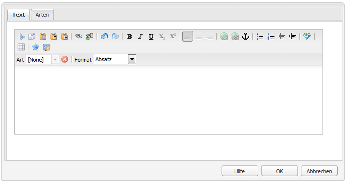

# Konfigurieren des Rich-Text-Editors {#configure-the-rich-text-editor}

Der Rich-Text-Editor (RTE) bietet Autoren eine große Bandbreite an Funktionen zum Bearbeiten von Textinhalten. Symbole, Auswahlfelder, Symbolleiste und Menüs werden für eine WYSIWYG-Textbearbeitung bereitgestellt.

Informationen zur Verwendung der Authoring-Funktionen des RTE finden Sie unter [Verwenden des Rich-Text-Editors für das Authoring](/help/sites-authoring/rich-text-editor.md). Der RTE kann konfiguriert werden, um die in den Authoring-Komponenten verfügbaren Funktionen zu aktivieren, zu deaktivieren und zu erweitern. Der folgende Arbeitsablauf zeigt die empfohlene Reihenfolge zum Abschluss der RTE-Konfigurationsschritte in Experience Manager.


*Abbildung: Typischer Arbeitsablauf zum Konfigurieren des Rich-Text-Editors*

## Grundlegendes zur Touch-optimierten und klassischen Benutzeroberfläche {#understand-touch-enabled-ui-and-classic-ui}

Die Touch-optimierte Benutzeroberfläche ist die standardmäßige Benutzeroberfläche von AEM. Adobe introduced Touch UI with [responsive design](/help/sites-authoring/responsive-layout.md) for authoring environment, in version 5.6. The Touch UI is designed for touch and desktop devices. Diese Benutzeroberfläche unterscheidet sich deutlich von der ursprünglichen klassischen Benutzeroberfläche.


*Abbildung: Rich-Text-Editor-Symbolleiste in der Touch-fähigen Benutzeroberfläche*



*Abbildung: Rich-Text-Editor-Symbolleiste in der klassischen Benutzeroberfläche*

>[!MORELIKETHIS]
>
>* [Empfehlungen für die Benutzeroberfläche](/help/sites-deploying/ui-recommendations.md).
>* Informationen zur eingestellten Unterstützung für die klassische Benutzeroberfläche finden Sie in den [Versionshinweisen für AEM 6.4](/help/release-notes/deprecated-removed-features.md).
>* For difference between the UIs, see [Touch UI and Classic UI](https://aemcq5pedia.wordpress.com/2018/01/05/touch-enabled-ui-aem6-3/)
>* Details zur Touch-optimierten Benutzeroberfläche finden Sie unter [Konzepte der Touch-basierten AEM-Benutzeroberfläche](/help/sites-developing/touch-ui-concepts.md).


## Verschiedene Bearbeitungsmodi {#editingmodes}

Autoren können Textinhalte in AEM mithilfe der verschiedenen Komponentenmodi erstellen und bearbeiten. Die Symbolleistenoptionen für das Erstellen und Formatieren von Inhalten und das Benutzererlebnis von RTE-aktivierten Komponenten in verschiedenen Bearbeitungsmodi variieren je nach RTE-Konfiguration.

| Bearbeitungsmodus | Bearbeitungsbereich | Für die Aktivierung empfohlene Funktionen | Touch-optimierte Benutzeroberfläche | Klassische Benutzeroberfläche |
|--- |--- |--- |--- |--- |
| Inline | Bearbeitung im Kontext für schnelle, geringfügige Änderungen; Formatieren ohne Öffnen eines Dialogfelds | Minimale RTE-Funktionen | J | J |
| RTE-Vollbildschirm | Füllt die gesamte Seite aus | Alle erforderlichen RTE-Funktionen | J | N |
| Dialogfeld | Dialogfeld, das oberhalb des Seiteninhalts angezeigt wird, jedoch nicht die gesamte Seite einnimmt | Alle erforderlichen RTE-Funktionen in der klassischen Benutzeroberfläche; Funktionen sollten in der Touch-optimierten Benutzeroberfläche umsichtig aktiviert werden | J | J |
| Dialogfeld-Vollbildmodus | Wie im Vollbildmodus; enthält neben dem RTE Felder des Dialogfelds | Alle erforderlichen RTE-Funktionen | J | N |

>[!NOTE]
>
>Die Funktion zum Bearbeiten der Quelle ist im Inline-Bearbeitungsmodus in der Touch-fähigen Benutzeroberfläche nicht verfügbar. Im Vollbildmodus können Sie Bilder nicht per Drag-and-Drop verschieben. Alle anderen Funktionen sind in allen Modi verfügbar.

### Inline-Bearbeitung {#inline-editing}

Beim Öffnen (durch langsames Doppeltippen/Doppelklicken) kann der Inhalt innerhalb der Seite bearbeitet werden. Dazu steht Ihnen eine kompakte Symbolleiste mit grundlegenden Optionen zur Verfügung.


*Abbildung: Inline-Bearbeitung mit einfacher Symbolleiste in der Touch-fähigen Benutzeroberfläche*

In der klassischen Benutzeroberfläche ermöglicht ein langsamer Doppelklick auf die Komponente die Inline-Bearbeitung. Eine orangefarbene Kontur markiert dann den Inhalt. Wenn der Content Finder geöffnet ist, wird oben im Fenster eine Symbolleiste mit den verfügbaren RTE-Formatierungsoptionen angezeigt. Ist der Content Finder nicht geöffnet, werden die Formatierungsoptionen nicht angezeigt und Sie können nur grundlegende Textbearbeitungen vornehmen.

### Bearbeitung im Vollbildmodus {#full-screen-editing}

AEM-Komponenten können im Vollbildmodus geöffnet werden. Dabei wird der Seiteninhalt überdeckt und der gesamte Bildschirm ausgefüllt. Die Bearbeitung im Vollbildmodus ist quasi eine detaillierte Version der Inline-Bearbeitung, da sie die meisten Bearbeitungsmöglichkeiten bietet. It can be opened by clicking , from the compact toolbar when using the inline editing mode.

Der Dialogfeld-Vollbildmodus bietet eine detaillierte RTE-Symbolleiste und die Optionen und Komponenten, die im Dialogmodus verfügbar sind. Dies gilt nur für ein Dialogfeld, das neben anderen Komponenten einen RTE enthält.


*Abbildung: Die detaillierte RTE-Symbolleiste beim Bearbeiten im Vollbildmodus in der Touch-fähigen Benutzeroberfläche*

### Bearbeitung in einem Dialogfeld {#dialog-editing}

Wenn Sie in der klassischen Benutzeroberfläche auf eine Komponente doppelklicken, öffnet sich ein Dialogfeld zur Bearbeitung des Inhalts. Das Dialogfeld öffnet sich oben auf der jeweiligen Seite. In bestimmten Fällen kann dieses Dialogfeld auch als Popup-Fenster geöffnet werden. Wenn eine Textkomponente beispielsweise Teil einer Spalte in einem mehrspaltigen Seitenlayout ist und der für das Dialogfeld verfügbare Bereich kleiner ist.


*Abbildung: Dialogfeldbearbeitungsmodus in der Touch-fähigen Benutzeroberfläche*


*Abbildung: Dialogfeld in der klassischen Benutzeroberfläche mit detaillierter Symbolleiste zur Bearbeitung*

## RTE-Plug-ins und die zugehörigen Funktionen {#aboutplugins}

Die Funktionen werden über eine Reihe von Plug-ins zur Verfügung gestellt, jeweils mit:

* Eine `features` Eigenschaft:

   * die zur Aktivierung oder Deaktivierung der grundlegenden Funktionalität des jeweiligen Plug-ins verwendet werden kann;
   * die über ein standardisiertes Verfahren konfiguriert werden kann;

* Gegebenenfalls weitere Eigenschaften und Optionen, die eine spezielle Konfiguration erfordern.

Die grundlegenden RTE-Funktionen sind durch den Wert der Eigenschaft `features` auf einem Knoten aktiviert oder deaktiviert, der spezifisch für das entsprechende Plug-in ist.

In der folgenden Tabelle sind die aktuellen Plug-ins und Folgendes aufgeführt:

* Plug-in-IDs mit einem Link zur API-Dokumentation. Die ID wird bei [Aktivierung eines Plug-ins](/help/sites-administering/configure-rich-text-editor-plug-ins.md#activateplugin) als Knotenname verwendet.
* Zulässige Werte für die Eigenschaft `features`.
* Eine Beschreibung der vom Plug-in bereitgestellten Funktion.

| Plug-in-ID | features | Beschreibung |
|--- |--- |--- |
| edit | cut copy paste-default paste-plaintext paste-wordhtml | [Ausschneiden, Kopieren und drei Einfügemodi](/help/sites-administering/configure-rich-text-editor-plug-ins.md#textstyles) |
| [findreplace](https://helpx.adobe.com/experience-manager/6-4/sites/developing/using/reference-materials/widgets-api/index.html?class=CQ.form.rte.plugins.FindReplacePlugin) | find replace | Suchen und Ersetzen. |
| [format](https://helpx.adobe.com/experience-manager/6-4/sites/developing/using/reference-materials/widgets-api/index.html?class=CQ.form.rte.plugins.FormatPlugin) | fette kursive Unterstreichung | [Grundlegende Textformatierung](/help/sites-administering/configure-rich-text-editor-plug-ins.md#textstyles) |
| [image](https://helpx.adobe.com/experience-manager/6-4/sites/developing/using/reference-materials/widgets-api/index.html?class=CQ.form.rte.plugins.ImagePlugin) | image | Grundlegende Bildunterstützung (Ziehen aus der Inhaltssuche oder Inhaltssuche). Nutzungsverhalten für Autoren kann je nach verwendetem Browser variieren |
| [keys](https://helpx.adobe.com/experience-manager/6-4/sites/developing/using/reference-materials/widgets-api/index.html?class=CQ.form.rte.plugins.KeyPlugin) |  | Informationen zum Definieren dieses Werts finden Sie unter [Registerkarten-Größe](/help/sites-administering/configure-rich-text-editor-plug-ins.md#tabsize). |
| [justify](https://helpx.adobe.com/experience-manager/6-4/sites/developing/using/reference-materials/widgets-api/index.html?class=CQ.form.rte.plugins.JustifyPlugin) | justifyleft justifycenter justifyright | Absatzausrichtung |
| [links](https://helpx.adobe.com/experience-manager/6-4/sites/developing/using/reference-materials/widgets-api/index.html?class=CQ.form.rte.plugins.LinkPlugin) | modifylink unlink anchor | [Hyperlinks und Anker](/help/sites-administering/configure-rich-text-editor-plug-ins.md#linkstyles) |
| [lists](https://helpx.adobe.com/experience-manager/6-4/sites/developing/using/reference-materials/widgets-api/index.html?class=CQ.form.rte.plugins.ListPlugin) | ordered unordered indent outdent | This plug-in controls both [indentation and lists](/help/sites-administering/configure-rich-text-editor-plug-ins.md#indentmargin); including nested lists. |
| [misctools](https://helpx.adobe.com/experience-manager/6-4/sites/developing/using/reference-materials/widgets-api/index.html?class=CQ.form.rte.plugins.MiscToolsPlugin) | specialchars sourceedit | Miscellaneous tools allow authors to enter [special characters](/help/sites-administering/configure-rich-text-editor-plug-ins.md#spchar) or edit the HTML source. Also, you can add a whole [range of special characters](/help/sites-administering/configure-rich-text-editor-plug-ins.md#definerangechar) if you want to define your own list. |
| Paraformat | paraformat | The default paragraph formats are Paragraph, Heading 1, Heading 2, and Heading 3 (`<p>`, `<h1>`, `<h2>`, and `<h3>`). Sie können [weitere Absatzformate](/help/sites-administering/configure-rich-text-editor-plug-ins.md#paraformats) hinzufügen oder die Liste erweitern. |
| spellcheck | checktext | [Rechtschreibprüfung mit Spracherkennung](/help/sites-administering/configure-rich-text-editor-plug-ins.md#adddict). |
| styles | styles | Unterstützung für die Formatierung mit einer CSS-Klasse. [Hinzufügen Sie neue Textstile](/help/sites-administering/configure-rich-text-editor-plug-ins.md#textstyles) , wenn Sie Ihren eigenen Stilbereich für die Verwendung mit Text hinzufügen (oder erweitern) möchten. |
| subsuperscript | subscript superscript | Erweiterungen zu den grundlegenden Formaten, indem Sie Unter- und Super-Skript hinzufügen. |
| table | table removetable insertrow removerow insertcolumn removecolumn cellprops mergecells splitcell selectrow selectcolumns | See [configure table styles](/help/sites-administering/configure-rich-text-editor-plug-ins.md#tablestyles), if you want to add your own styles for either entire tables or individual cells. |
| undo | undo redo | History size of [undo and redo](/help/sites-administering/configure-rich-text-editor-plug-ins.md#undohistory) operations. |

>[!NOTE]
>
>Das Plug-in für den Vollbildmodus wird im Dialogfeldmodus nicht unterstützt. Use of the `dialogFullScreen` setting to configure the toolbar for full screen mode.

## Grundlegendes zu den Konfigurationspfaden und -speicherorten {#understand-the-configuration-paths-and-locations}

Der [RTE-Bearbeitungsmodus (und die Benutzeroberfläche)](#editingmodes), den Sie Ihren Autoren bereitstellen, legt den Speicherort für die Konfigurationsdetails fest, wenn Sie [die RTE-Plug-ins aktivieren](/help/sites-administering/configure-rich-text-editor-plug-ins.md#activateplugin):

| Bearbeitungsmodus | Speicherort für die Touch-optimierte Benutzeroberfläche | Speicherort für die klassische Benutzeroberfläche |
|---|---|---|
| Inline | `cq:editConfig/cq:inplaceEditing` | `cq:editConfig/cq:inplaceEditing` |
| Vollbild | `cq:editConfig/cq:inplaceEditing` | Nicht zutreffend |
| Dialogfeld | `cq:dialog` | `dialog` |
| Dialogfeld im Vollbildmodus | `cq:dialog` | Nicht zutreffend |

>[!NOTE]
>
>Do not name the node under `cq:inplaceEditing` as `config`. On `cq:inplaceEditing` node, define the following properties:
>
>* **Name**: `configPath`
>* **Typ**: `String`
>* **Wert**: Pfad des Knotens, der die tatsächliche Konfiguration enthält
>
>
Benennen Sie den RTE-Konfigurationsknoten nicht mit `config`. Otherwise, the RTE configurations take effect for only the administrators and not for the users in the group `content-author`.

Konfigurieren Sie die folgenden Eigenschaften, die nur im Dialogfeld-Bearbeitungsmodus in der Touch-optimierten Benutzeroberfläche verfügbar sind:

* `useFixedInlineToolbar`: Legen Sie diese boolesche Eigenschaft, die auf dem RTE-Knoten definiert ist (mit sling:resourceType= `cq/gui/components/authoring/dialog/richtext`), auf `True`fest, damit die RTE-Symbolleiste nicht schwebend, sondern fixiert wird.

   Wenn diese Eigenschaft auf „true“ gesetzt ist, wird die Rich-Text-Bearbeitung standardmäßig bei dem Ereignis „foundation-contentloaded“ gestartet.

   Um dies zu verhindern, setzen Sie die Eigenschaft `customStart` auf `True` und lösen Sie das Ereignis „rte-start“ zum Starten der RTE-Bearbeitung aus. Wenn diese Eigenschaft auf „true“ gesetzt ist, funktioniert das Standardverhalten, d. h. das Starten des RTE bei Klicken, nicht.

* `customStart`: Setzen Sie diese boolesche Eigenschaft, die im RTE-Knoten definiert ist, auf `True`, um den RTE-Startzeitpunkt zu steuern, indem Sie das Ereignis `rte-start` auslösen.

* `rte-start`: Lösen Sie dieses Ereignis bei `contenteditable-div` des RTE aus, wenn die RTE-Bearbeitung gestartet werden soll. Dies funktioniert nur, wenn `customStart` auf „true“ gesetzt ist.

Wenn der RTE im Touch-optimierten Dialogfeld verwendet wird, muss die Eigenschaft `useFixedInlineToolbar` auf „true“ gesetzt werden, um Probleme zu vermeiden.

## Anpassen der ersetzenden Bearbeitung {#customizing-in-place-editing}

Sie können festlegen, für welchen HTML-Selektor die Beginn des Texteditors definiert werden, indem Sie die folgenden Eigenschaften konfigurieren:

* **`editElementQuery`** - Definiert auf `cq:InplaceEditingConfig`, wird diese Eigenschaft verwendet, um einen Selektor des HTML-Elements anzugeben, auf dem die Inline-Bearbeitung für die Textkomponente gestartet wird. Wenn nicht angegeben, wird die Inline-Bearbeitung direkt im HTML der Textkomponente gestartet.
* **`textPropertyName`** - Definiert auf `cq:InplaceEditingConfig`, wird diese Eigenschaft verwendet, um den Namen der Eigenschaft anzugeben, die auf dem Knoten &quot;content&quot;gespeichert wird, auf dem der HTML-Wert der Textkomponente nach der Inline-Bearbeitung beibehalten wird.

Die entsprechende Eigenschaft für den Dialogmodus ist `name`.

## Aktivieren von RTE-Funktionen durch Aktivieren von Plug-ins {#enable-rte-functionalities-by-activating-plug-ins}

RTE-Funktionen werden über eine Reihe von Plug-ins mit jeweils einer Eigenschaft „features“ bereitgestellt. Sie können die Funktionseigenschaft konfigurieren, um die verschiedenen Funktionen jedes Plug-ins zu (de-)aktivieren.

Ausführliche Konfigurationen des RTE-Plug-ins finden Sie unter [Aktivieren und Konfigurieren von RTE-Plug-ins](/help/sites-administering/configure-rich-text-editor-plug-ins.md).

Laden Sie diese Beispielkonfiguration herunter, um zu erfahren, wie der RTE konfiguriert wird. In diesem Paket sind alle Funktionen aktiviert.

[Datei laden](/help/assets/assets/rte-sample-all-features-enabled-10.zip)

>[!NOTE]
>
>Die [Core Components-Textkomponente](https://helpx.adobe.com/experience-manager/core-components/using/text.html) ermöglicht es Bearbeitern von Vorlagen, viele RTE-Plug-ins in der Benutzeroberfläche als Content-Richtlinien zu konfigurieren, sodass keine technische Konfiguration mehr erforderlich ist. Content-Richtlinien können wie beschrieben mit RTE-Benutzeroberflächen verwendet werden. For more information, see the [RTE user interface settings and content polices](/help/sites-administering/rich-text-editor.md#rtecontentpolicies), [Create page templates](/help/sites-authoring/templates.md), and the [Core Components developer documentation](https://helpx.adobe.com/experience-manager/core-components/using/developing.html).

>[!NOTE]
>
>Zu Referenzzwecken finden Sie die standardmäßigen Textkomponenten (bereitgestellt im Rahmen einer Standardinstallation) unter:
>
>* `/libs/wcm/foundation/components/text`
>* `/libs/foundation/components/text`
>
>
Um eine eigene Textkomponente zu erstellen, kopieren Sie die oben stehende Komponente, anstatt diese Komponenten zu bearbeiten.

## RTE-Symbolleiste konfigurieren {#dialogfullscreen}

Mit AEM können Sie die Benutzeroberfläche für den Rich Text Editor für die verschiedenen Bearbeitungsmodi unterschiedlich konfigurieren. Die Standardeinstellungen finden Sie unten. Sie können diese Standardwerte entsprechend Ihren Anforderungen überschreiben.

So erzielen Sie das beste Authoring-Erlebnis:

* Aktivieren Sie in einem unverankerten Dialogfeld nur die Plug-ins, die über kein Pop-up verfügen, da das unverankerte Dialogfeld kleiner ist.
* In full screen dialog, enable all the required plug-ins, even the plug-ins with larger pop-up, such as the `Paste` plug-in. Use the `dialogFullScreen` configuration described below.

```java
<uiSettings jcr:primaryType="nt:unstructured">
  <cui jcr:primaryType="nt:unstructured">
    <inline
      jcr:primaryType="nt:unstructured"
      toolbar="[format#bold,format#italic,format#underline,#justify,#lists,links#modifylink,links#unlink,#paraformat]">
      <popovers jcr:primaryType="nt:unstructured">
        <justify
          jcr:primaryType="nt:unstructured"
          items="[justify#justifyleft,justify#justifycenter,justify#justifyright]"
          ref="justify"/>
        <lists
          jcr:primaryType="nt:unstructured"
          items="[lists#unordered,lists#ordered,lists#outdent,lists#indent]"
          ref="lists"/>
        <paraformat
          jcr:primaryType="nt:unstructured"
          items="paraformat:getFormats:paraformat-pulldown"
          ref="paraformat"/>
      </popovers>
    </inline>
    <dialogFullScreen
      jcr:primaryType="nt:unstructured"
      toolbar="[format#bold,format#italic,format#underline,justify#justifyleft,justify#justifycenter,justify#justifyright,lists#unordered,lists#ordered,lists#outdent,lists#indent,links#modifylink,links#unlink,table#createoredit,#paraformat,image#imageProps]">
      <popovers jcr:primaryType="nt:unstructured">
        <paraformat
          jcr:primaryType="nt:unstructured"
          items="paraformat:getFormats:paraformat-pulldown"
          ref="paraformat"/>
      </popovers>
    </dialogFullScreen>
    <tableEditOptions
      jcr:primaryType="nt:unstructured"
      toolbar="[table#insertcolumn-before,table#insertcolumn-after,table#removecolumn,-,table#insertrow-before,table#insertrow-after,table#removerow,-,table#mergecells-right,table#mergecells-down,table#mergecells,table#splitcell-horizontal,table#splitcell-vertical,-,table#selectrow,table#selectcolumn,-,table#ensureparagraph,-,table#modifytableandcell,table#removetable,-,undo#undo,undo#redo,-,table#exitTableEditing,-]">
    </tableEditOptions>
  </cui>
</uiSettings>
```

Für den Inline-Modus und den Vollbildmodus werden verschiedene Benutzeroberflächen-Einstellungen verwendet. Die Symbolleisten-Eigenschaft wird verwendet, um die Schaltflächen der Symbolleiste festzulegen. For example, if the button is itself a feature (for example, `Bold`), it is specified as `PluginName#FeatureName` (for example, `links#modifylink`). If the button is a popover (containing some features of a plug-in), it is specified as `#PluginName` (for example, `#format`). Trennzeichen ( | ) zwischen einer Gruppe von Schaltflächen können mit „-“ angegeben werden.

Der Knoten „pop-up“ im Inline- oder Vollbildmodus enthält eine Liste der verwendeten Popovers. Each child node under the `popovers` node is named after the plug-in (for example, `format`). It has a property `items` containing a list of features of the plug-in (for example, `format#bold`).

## Einstellungen für die RTE-Benutzeroberfläche und Content-Richtlinien {#rtecontentpolicies}

Administratoren können die RTE-Optionen mithilfe von Content-Richtlinien steuern, anstatt die Konfiguration wie oben beschrieben durchzuführen. Content-Richtlinien definieren die Designeigenschaften einer Komponente, wenn sie als Teil einer [bearbeitbaren Vorlage](../sites-authoring/templates.md) verwendet wird. Wenn zum Beispiel eine Textkomponente, die den RTE verwendet, mit einer bearbeitbaren Vorlage verwendet wird, kann die Content-Richtlinie definieren, dass die fettgedruckte Option und einige Absatzformatierungsoptionen verfügbar sind. Content-Richtlinien sind wiederverwendbar und können auf eine Vielzahl von Vorlagen angewendet werden.

Ab AEM 6.4 Service Pack 3 werden die verfügbaren Optionen im RTE von der Benutzeroberflächenkonfiguration auf die Content-Richtlinien übertragen.

* Die Benutzeroberflächen-Konfigurationseinstellungen definieren, welche Optionen für die Content-Richtlinien verfügbar sind.
* Wenn die Benutzeroberflächenkonfiguration des RTE entfernt wurde oder ein Element nicht aktiviert wird, kann die Inhaltsrichtlinie es nicht konfigurieren.
* Ein Autor hat nur auf die Funktionen Zugriff, die durch die Benutzeroberflächen-Konfigurationen und Content-Richtlinien zur Verfügung gestellt werden.

Beispielsweise können Sie die [Text-Core Component-Dokumentation](https://docs.adobe.com/content/help/de/experience-manager-core-components/using/components/text.html#the-text-component-and-the-rich-text-editor) sehen.

## Anpassen der Zuordnung zwischen Symbolleistenelementen und Befehlen {#iconstoolbar}

Sie können die Zuordnung zwischen in der RTE-Symbolleiste angezeigten Coral-Symbolen und den verfügbaren Befehlen anpassen. Sie können keine anderen Symbole als Coral-Symbole verwenden.

1. Create a node named `icons` under `uiSettings/cui`.

1. Erstellen Sie Knoten für die einzelnen Symbole darunter.
1. Geben Sie auf jeder einzelnen Symbol-Node ein Korallensymbol und einen Befehl ein, der dem Symbol zugeordnet werden soll.

Below is a sample snippet to map the command Bold to the Coral icon named `textItalic`.

```java
<text jcr:primaryType="nt:unstructured" sling:resourceType="cq/gui/components/authoring/dialog/richtext" name="./text" useFixedInlineToolbar="{Boolean}true"> 
    <rtePlugins jcr:primaryType="nt:unstructured"> 
        <format jcr:primaryType="nt:unstructured" features="bold,italic"/> 
    </rtePlugins> 
    <uiSettings jcr:primaryType="nt:unstructured"> 
        <cui jcr:primaryType="nt:unstructured"> 
            <inline jcr:primaryType="nt:unstructured" 
                toolbar="[format#bold,format#italic,format#underline,links#modifylink,links#unlink]"> 
            </inline> 
            <icons jcr:primaryType="nt:unstructured"> 
                <bold jcr:primaryType="nt:unstructured" 
                    command="format#bold" 
                    icon="textItalic"/> 
            </icons> 
        </cui> 
    </uiSettings> 
</text>
```

## Wechseln zum CoralUI 2-Rich-Text-Editor {#switch-to-coralui-rich-text-editor}

Auf einer Seite können Sie entweder CoralUI 2 RTE clientlib oder CoralUI 3 RTE clientlib einbeziehen. Standardmäßig beinhaltet der Rich-Text-Editor die CoralUI 3-RTE-Client-Bibliothek. Führen Sie für den Wechsel zum CoralUI 2-RTE die folgenden Schritte aus.

>[!NOTE]
>
>Adobe empfiehlt den Wechsel nicht als bewährtes Verfahren. Ein Wechsel zum CoralUI 2-RTE sollte nur im Notfall erfolgen. Benutzerdefinierte Plug-ins für den RTE von CoralUI 2-RTE können im RTE von CoralUI 3 verwendet werden, wenn die Plug-ins nicht von internen RTE-Elementen, etwa Klassen, abhängig sind. Wenn Sie benutzerdefinierte Plug-ins für den RTE von CoralUI nutzen, verwenden Sie die Bibliothek `rte.coralui3`3.

1. Überlagern Sie die Node `/libs/cq/gui/components/authoring/editors/clientlibs/core` unter `/apps`und führen Sie folgende Schritte aus:

   * Replace `rte.coralui3` with `rte.coralui2` for the dependencies property.
   * Replace `cq.authoring.editor.core.inlineediting.rte.coralui3` with `cq.authoring.editor.core.inlineediting.rte.coralui2` for the embed property.
   * Replace `cq.authoring.rte.coralui3` with `cq.authoring.rte.coralui2` for the embed property.

1. Überlagern Sie die Knoten `/libs/cq/gui/components/authoring/dialog/richtext/clientlibs/rte/coralui3` und `/libs/cq/gui/components/authoring/dialog/richtext/clientlibs/rte/coralui2` darunter `/apps`.

   Entfernen Sie die Kategorie `cq.authoring.dialog` aus `/apps/cq/gui/components/authoring/dialog/richtext/clientlibs/rte/coralui3` und fügen Sie sie hinzu `/apps/cq/gui/components/authoring/dialog/richtext/clientlibs/rte/coralui2`.

1. Ändern Sie alle weiteren Abhängigkeiten, die auf der Seite aufgenommen werden, von `rte.coralui3` in `rte.coralui2`. For example, after overlaying the node `/libs/mcm/campaign/components/touch-ui/clientlibs/rte` under `/apps`, change any dependency on it from `rte.coralui3` to `rte.coralui2`.

1. Overlay the node `cq/ui/widgets` under `/apps`. Ersetzen Sie die Abhängigkeit `cq.rte` am Knoten `/apps/cq/ui/widgets` durch `cq.coralui2.rte`.

>[!NOTE]
>
>Der CoralUI 2-RTE verwendet Handlebars-Vorlagen für Plug-in-Dialogfelder. Deshalb bestand eine Abhängigkeit zwischen der CoralUI 2-RTE-Client-Bibliothek und der Handlebars-Client-Bibliothek. Der CoralUI 3-RTE verwendet keine Handlebars-Vorlagen, weshalb hier keine Abhängigkeiten vorliegen. Wenn Ihre benutzerspezifischen Plug-ins Handlebars-Vorlagen verwenden, nehmen Sie die Handlebars-Client-Bibliothek in Ihre Webseite auf.

## Weiterführende Informationen {#further-information}

Weitere Informationen zum Konfigurieren des RTE finden Sie im [AEM Widget API](https://helpx.adobe.com/de/experience-manager/6-4/sites/developing/using/reference-materials/widgets-api/index.html)-Referenzhandbuch.

Wenn Sie vor allem die verfügbaren Plug-ins und zugehörigen Optionen sehen wollen:

* Die [CQ.form.RichText](https://helpx.adobe.com/experience-manager/6-4/sites/developing/using/reference-materials/widgets-api/index.html?class=CQ.form.RichText)-Komponente stellt ein Formularfeld zum Bearbeiten von formatierten Textinformationen zur Verfügung (Rich Text). Informationen zu allen verfügbaren Parametern für das Rich-Text-Formular finden Sie in den Konfigurationsoptionen.
* Die RichText-Komponente bietet zahlreiche Funktionen mithilfe der Plug-ins, die unter [CQ.form.rte.plugins.Plugin](https://helpx.adobe.com/experience-manager/6-4/sites/developing/using/reference-materials/widgets-api/index.html?class=CQ.form.rte.plugins.Plugin) aufgeführt sind. Für jedes Plug-in gilt dabei Folgendes:

   * Weitere Informationen zu Funktionen, die aktiviert (oder deaktiviert) werden können, finden Sie unter Funktionen.
   * Unter Konfigurationsoptionen finden Sie alle verfügbaren Parameter für eine detaillierte Konfiguration des entsprechenden Plug-Ins.

* Weitere Informationen zu den HTML-Regeln für Links sind ebenfalls verfügbar.

Sie können die oben aufgeführten Optionen verwenden, um Ihren eigenen RTE zu erweitern und anpassen. Um zum Beispiel die auf der Seite verfügbaren Anker beim Erstellen eines Links aufzulisten, können Sie eine eigene Implementierung des `LinkPlugin` bereitstellen.

## Bekannte Einschränkungen {#known-limitations}

Für die AEM RTE-Funktion gelten folgende Einschränkungen:

* RTE-Funktionen werden nur in Dialogfeldern zu AEM-Komponenten unterstützt. RTE wird nicht in Assistenten und nicht in Foundation-Formularen wie [Seiteneigenschaften](/help/sites-developing/page-properties-views.md) und [Strukturvorlage](/help/sites-authoring/scaffolding.md) in der Touch-optimierten Benutzeroberfläche unterstützt.

* AEM funktioniert nicht auf [Hybrid-Geräten](/help/release-notes/known-issues.md).

* Do not name the RTE configuration node `config`. Otherwise, the RTE configuration takes effect for only the administrators and not for the users in the group `content-author`.

* RTE unterstützt keine Inline-Frame- oder iFrame-Elemente zum Einbetten von Inhalten.

>[!MORELIKETHIS]
>
>* [Konfigurieren von RTE-Plug-ins](configure-rich-text-editor-plug-ins.md)
>* [Verwenden des Rich-Text-Editors für das Authoring](../sites-authoring/rich-text-editor.md)
>* [Konfigurieren des RTE für barrierefreie Websites](rte-accessible-content.md)
>* [Funktionsparität zwischen Touch-optimierter und klassischer Benutzeroberfläche](../release-notes/touch-ui-features-status.md)
>* [Tutorial-Beispiel für die Erstellung von kombinierten Mehrfeld-Komponenten](https://experience-aem.blogspot.com/2019/05/aem-65-touchui-composite-multifield-with-coral3-rte-rich-text.html)

