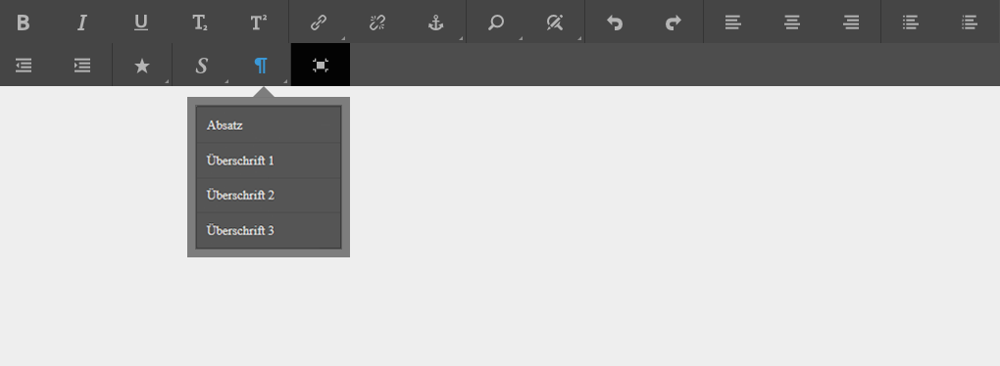

# Konfigurieren von RTE für die Erstellung zugriffsbereiter Sites  {#configuring-rte-for-producing-accessible-sites}

AEM unterstützt beides:

* Standardmäßige Funktionen zur Barrierefreiheit, einschließlich Alternativtext für Bilder
* sowie zusätzliche Funktionen, auf die bei der Erstellung von Inhalt mit Komponenten zugegriffen werden kann, die den Rich-Text-Editor (RTE) verwenden.

>[!NOTE]
>
>* [Kurzanleitung zu WCAG 2.0](/help/managing/qg-wcag.md)
* [Erstellen barrierefreier Inhalte (gemäß WCAG 2.0)](/help/sites-authoring/creating-accessible-content.md)


Inhaltsautoren können Funktionen von RTE verwenden, um beim Hinzufügen von Inhalten zu einer Seite Informationen zur Barrierefreiheit bereitzustellen. Dies kann das Hinzufügen struktureller Informationen durch Überschriften und Absatzelemente umfassen.

Sie können [diese Funktionen durch die Konfiguration von RTE-Plug-ins zur Komponente konfigurieren und anpassen](#configuring-the-plugin-features). Beispielsweise können Sie mit dem Plug-in `paraformat` semantische Blockebenenelemente hinzufügen, einschließlich der Erweiterung der Anzahl der Überschriftenebenen, die über die standardmäßig bereitgestellten grundlegenden `H1`, `H2` und `H3` hinausgeht.

Der RTE ist in verschiedenen Komponenten sowohl der Touch-optimierten als auch der klassischen Benutzeroberfläche verfügbar. Die primäre Komponente zur Verwendung von RTE ist die **Textkomponente**.

Die Komponente **Text** in AEM ist sowohl für die Touch-optimierte als auch für die klassische Benutzeroberfläche verfügbar. Auf den folgenden Bildern wird der Rich-Text-Editor mit einer Reihe von Plug-ins aktiviert, einschließlich `paraformat`:

* Die Komponente **Text** in der Touch-optimierten Benutzeroberfläche:

   

* Die **Textkomponente** in der klassischen Benutzeroberfläche:

   

>[!NOTE]
Es gibt Unterschiede zwischen den in der klassischen und der Touch-optimierten Benutzeroberfläche verfügbaren RTE-Funktionen. Weitere Informationen finden Sie unter
* [Plug-ins und ihre Funktionen](/help/sites-administering/rich-text-editor.md#aboutplugins)
* [Plug-ins und ihre Funktionen - Touch-optimierte Benutzeroberfläche](/help/sites-administering/rich-text-editor.md#aboutplugins)


## Konfigurieren der Plug-in-Funktionen {#configuring-the-plugin-features}

Die vollständigen Anweisungen zum Konfigurieren des RTE sind auf der Seite [Konfigurieren des Rich-Text-Editors](/help/sites-administering/rich-text-editor.md) verfügbar. Dies deckt alles ab, einschließlich der wichtigen Schritte:

* [Plug-ins und ihre Funktionen](/help/sites-administering/rich-text-editor.md#aboutplugins)
* [Konfigurationsspeicherorte](/help/sites-administering/rich-text-editor.md#understand-the-configuration-paths-and-locations)
* [Aktivieren eines Plug-ins und Konfigurieren der features-Eigenschaft](/help/sites-administering/rich-text-editor.md#enable-rte-functionalities-by-activating-plug-ins)
* [Konfigurieren anderer RTE-Funktionen](/help/sites-administering/rich-text-editor.md#enable-rte-functionalities-by-activating-plug-ins)

Durch das Konfigurieren eines Plug-ins innerhalb des entsprechenden `rtePlugins`-Unterzweigs in CRXDE Lite (siehe folgendes Bild) können Sie entweder alle oder spezifische Funktionen für das Plug-in aktivieren.


### Beispiel – Angeben von im RTE-Auswahlfeld verfügbaren Absatzformaten {#example-specifying-paragraph-formats-available-in-rte-selection-field}

Es können wie folgt neue semantische Blockformate zur Auswahl bereitgestellt werden:

1. Legen Sie den [Konfigurationsspeicherort](/help/sites-administering/rich-text-editor.md#understand-the-configuration-paths-and-locations) abhängig von Ihrem RTE fest und navigieren Sie dorthin.
1. [Aktivieren Sie das Absatzauswahlfeld](/help/sites-administering/rich-text-editor.md) durch die [Aktivierung des Plug-ins](/help/sites-administering/rich-text-editor.md#enable-rte-functionalities-by-activating-plug-ins).
1. [Geben Sie die Formate an, die Sie im Absatzauswahlfeld zur Verfügung haben möchten](/help/sites-administering/rich-text-editor.md).
1. Die Absatzformate sind dann für den Autor der Inhalte aus den Auswahlfeldern im RTE verfügbar. Auf sie kann wie folgt zugegriffen werden:

   * Verwenden des Absatzsymbols ([pilcrow](https://en.wikipedia.org/wiki/Pilcrow)) in der Touch-optimierten Benutzeroberfläche:

   

   * Mithilfe des **Formatfelds** (Dropdown-Auswahl) in der klassischen Benutzeroberfläche.


Mit Strukturelementen, die im RTE über die Absatzformatoptionen verfügbar sind, stellt AEM eine gute Grundlage für die Entwicklung barrierefreier Inhalte bereit. Inhaltsautoren können den RTE für die Formatierung der Schriftgröße, der Farben oder anderer verwandter Attribute verwenden und dadurch die Erstellung einer Inline-Formatierung verhindern. Stattdessen müssen sie entsprechende Strukturelemente wie Überschriften auswählen und über die Option „Arten“ ausgewählte globale Formatarten verwenden. Dies sorgt für ein sauberes Markup, mehr Optionen für Benutzer, die die Suche mit ihren eigenen Formatvorlagen durchführen, sowie korrekt strukturierte Inhalte.

## Verwenden der Funktion „Quellenbearbeitung“    {#use-of-the-source-edit-feature}

In einigen Fällen halten Inhaltsautoren es für erforderlich, den mithilfe des RTE erstellten HTML-Quell-Code zu untersuchen und anzupassen. So kann beispielsweise ein innerhalb des RTE erstellter Inhalt ein zusätzliches Markup erfordern, um Compliance mit WCAG 2.0 sicherzustellen. Dies lässt sich mit der Option [Quellenbearbeitung](/help/sites-administering/rich-text-editor.md#aboutplugins) des RTE umsetzen. Sie können die Funktion [`sourceedit` im Plug-in `misctools` angeben](/help/sites-administering/rich-text-editor.md#aboutplugins).

>[!CAUTION]
Gehen Sie beim Verwenden der Funktion `sourceedit` sorgfältig vor. Tippfehler und/oder nicht unterstützte Funktionen können zusätzliche Probleme hervorrufen.

## Hinzufügen von Unterstützung für zusätzliche HTML-Elemente und -Attribute {#adding-support-for-additional-html-elements-and-attributes}

Um die Barrierefreiheitsfunktionen von AEM weiter auszubauen, ist es möglich, die vorhandenen Komponenten basierend auf dem RTE (wie die Komponenten **Text** und **Tabelle**) um zusätzliche Elemente und Attribute zu erweitern.

Das folgende Verfahren zeigt, wie Sie die Komponente **Tabelle** mit einem **Beschriftung**-Element erweitern, das Benutzern von Hilfstechnologien Informationen über eine Datentabelle bereitstellt:

### Beispiel – Hinzufügen der Beschriftung zum Dialogfeld „Tabelleneigenschaften“{#example-adding-the-caption-to-the-table-properties-dialog}

Fügen Sie im Konstruktor von `TablePropertiesDialog` ein zusätzliches Texteingabefeld hinzu, dass für die Bearbeitung der Beschriftung verwendet wird. Beachten Sie, dass `itemId` auf `caption` gesetzt werden muss (d. h. der Name des DOM-Attributs), um den Inhalt automatisch zu verarbeiten.

Unter **Tabelle** müssen Sie das Attribut explizit zum/vom DOM-Element festlegen/entfernen. Der Wert wird vom Dialogfeld im `config`-Objekt weitergegeben. Beachten Sie, dass DOM-Attribute mithilfe der entsprechenden `CQ.form.rte.Common`-Methoden (`com` ist kurz für `CQ.form.rte.Common`) festgelegt/entfernt werden sollten, um die üblichen Fallstricke bei Browserimplementierungen zu vermeiden.

>[!NOTE]
Dieses Verfahren eignet sich nur für die klassische Benutzeroberfläche.

### Schritt-für-Schritt-Anweisungen  {#step-by-step-instructions}

1. Starten Sie CRXDE Lite. Zum Beispiel: [http://localhost:4502/crx/de/](http://localhost:4502/crx/de/)
1. Kopieren:

   `/libs/cq/ui/widgets/source/widgets/form/rte/commands/Table.js`

   in:

   `/apps/cq/ui/widgets/source/widgets/form/rte/commands/Table.js`

   >[!NOTE]
   Sie müssen Zwischenordner erstellen, falls diese nicht bereits vorhanden sind.

1. Kopieren:

   `/libs/cq/ui/widgets/source/widgets/form/rte/plugins/TablePropertiesDialog.js`

   in:

   `/apps/cq/ui/widgets/source/widgets/form/rte/plugins/TablePropertiesDialog.js`.

1. Öffnen Sie die folgende Datei zur Bearbeitung (durch Doppelklicken öffnen):

   `/apps/cq/ui/widgets/source/widgets/form/rte/plugins/TablePropertiesDialog.js`

1. In der `constructor`-Methode, vor dem Lesen der Zeilen:

   ```
   var dialogRef = this;
   ```

   Fügen Sie den folgenden Code hinzu:

   ```
   editItems.push({
       "itemId": "caption",
       "name": "caption",
       "xtype": "textfield",
       "fieldLabel": CQ.I18n.getMessage("Caption"),
       "value": (this.table && this.table.caption ? this.table.caption.textContent : "")
   });
   ```

1. Öffnen Sie die folgende Datei:

   `/apps/cq/ui/widgets/source/widgets/form/rte/commands/Table.js`.

1. Fügen Sie am Ende der `transferConfigToTable` -Methode den folgenden Code hinzu:

   ```
   /**
    * Adds Caption Element
   */
   var captionElement;
   if (dom.firstChild && dom.firstChild.tagName.toLowerCase() == "caption")
   {
      captionElement = dom.firstChild;
   }
   if (config.caption)
   {
       var captionTextNode = document.createTextNode(config.caption)
       if (captionElement)
       {
          dom.replaceNode(captionElement.firstChild,captionTextNode);
       } else
       {
           captionElement = document.createElement("caption");
           captionElement.appendChild(captionTextNode);
           if (dom.childNodes.length>0)
           {
              dom.insertBefore(captionElement, dom.firstChild);
           } else
           {
              dom.appendChild(captionElement);
           }
       }
   } else if (captionElement)
   {
     dom.removeChild(captionElement);
   }
   ```

1. Speichern Sie Ihre Änderungen mithilfe von **Alle speichern**

>[!NOTE]
Ein „Nur Text“-Feld ist die einzige zulässige Eingabeart für den Wert des „caption“-Elements. Es kann jedes ExtJS-Widget verwendet werden, das den Wert der Beschriftung über die Methode `getValue()` bereitstellt.
Um Bearbeitungsfunktionen für weitere Elemente und Attribute hinzuzufügen, stellen Sie sicher, dass sowohl:
* Die `itemId`-Eigenschaft für jedes entsprechende Feld wird auf den Namen des entsprechenden DOM-Attributs (`TablePropertiesDialog`) gesetzt.
* Das Attribut explizit für das DOM-Element festgelegt und/oder entfernt wird (`Table`).

