# Integrieren mit Salesforce{#integrating-with-salesforce}

>[!CAUTION]
>
>AEM 6.4 hat das Ende der erweiterten Unterstützung erreicht und diese Dokumentation wird nicht mehr aktualisiert. Weitere Informationen finden Sie in unserer [technische Unterstützung](https://helpx.adobe.com/de/support/programs/eol-matrix.html). Unterstützte Versionen suchen [here](https://experienceleague.adobe.com/docs/?lang=de).

Die Integration von Salesforce mit AEM bietet Lead-Management-Funktionen und nutzt die vorhandenen Funktionen, die Salesforce standardmäßig bereitstellt. Sie können AEM konfigurieren, um Leads in Salesforce zu posten und Komponenten zu erstellen, die direkt über Salesforce auf Daten zugreifen.

Die bidirektionale und erweiterbare Integration zwischen AEM und Salesforce ermöglicht Folgendes:

* Organisationen, Daten vollständig zu verwenden und zu aktualisieren, um das Kundenerlebnis zu verbessern.
* Interaktion von Marketing- zu Verkaufsaktivitäten.
* Organisationen zum automatischen Übertragen und Empfangen von Daten aus einem Salesforce-Datenspeicher.

Dieses Dokument beschäftigt sich mit den folgenden Themen:

* wie Salesforce-Cloud Services konfiguriert werden (konfigurieren Sie AEM für die Integration mit Salesforce).
* Verwendung von Salesforce-Lead-/Kontaktinformationen in ClientContext und zur Personalisierung.
* wie Sie das Salesforce-Workflow-Modell verwenden, um AEM Benutzer als Leads zu Salesforce zu posten.
* wie Sie eine Komponente erstellen, die Daten aus Salesforce anzeigt.

## AEM zur Integration mit Salesforce konfigurieren {#configuring-aem-to-integrate-with-salesforce}

Um AEM für die Integration mit Salesforce zu konfigurieren, müssen Sie zunächst eine Fernzugriffsanwendung in Salesforce konfigurieren. Anschließend konfigurieren Sie den Salesforce-Cloud-Service so, dass er auf diese Remote-Zugriffsanwendung verweist.

>[!NOTE]
>
>Sie können ein kostenloses Entwicklerkonto in Salesforce erstellen.

So konfigurieren Sie AEM für die Integration mit Salesforce:

1. Navigieren Sie in AEM zu **Cloud-Services**. Klicken Sie unter „Services von Dritten“ auf **Jetzt konfigurieren** unter **Salesforce**.

   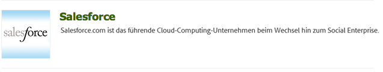

1. Erstellen Sie eine neue Konfiguration, z. B. **Entwickler**.

   >[!NOTE]
   >
   >Die neue Konfiguration leitet zu einer neuen Seite um: **http://localhost:4502/etc/cloudservices/salesforce/developer.html**. Dies ist genau der Wert, den Sie beim Erstellen der Remote-Zugriffsanwendung in Salesforce in der Callback-URL angeben müssen. Diese Werte müssen übereinstimmen.

1. Melden Sie sich bei Ihrem Salesforce-Konto an (wenn Sie noch kein solches Konto haben, legen Sie eines unter [https://developer.force.com](https://developer.force.com) an).
1. Navigieren Sie in Salesforce zu **Erstellen** > **Apps**, um zur Option **Verbundene Apps** zu gelangen (in den Salesforce-Vorgängerversionen war der Workflow **Bereitstellen** > **Fernzugriff**).
1. Klicken Sie auf **Neu**, um AEM mit Salesforce zu verbinden.

   

1. Geben Sie die **Name der Connected App**, **API-Name** und **Kontakt-E-Mail**. Wählen Sie die **OAuth-Einstellungen aktivieren** aktivieren und die **Callback-URL** und fügen Sie einen OAuth-Bereich hinzu (z. B. vollständigen Zugriff). Die Rückruf-URL sieht in etwa folgendermaßen aus: `http://localhost:4502/etc/cloudservices/salesforce/developer.html`

   Ändern Sie den Server-Namen/die Port-Nummer und den Seitennamen, sodass sie Ihrer Konfiguration entsprechen.

   

1. Klicken Sie auf **Speichern**, um die Salesforce-Konfiguration zu speichern. Salesforce erstellt einen **Kundenschlüssel** und ein **Kundengeheimnis**, die Sie für die AEM-Konfiguration benötigen.

   

   >[!NOTE]
   >
   >Möglicherweise müssen Sie mehrere Minuten (bis zu 15 Minuten) warten, bis die Fernzugriffsanwendung in Salesforce aktiviert wird.

1. Navigieren Sie AEM zu **Cloud Services** und navigieren Sie zur zuvor erstellten Salesforce-Konfiguration (z. B. **Entwickler**). Klicken **Bearbeiten** und geben Sie den Kundenschlüssel und das Kundengeheimnis von salesforce.com ein.

   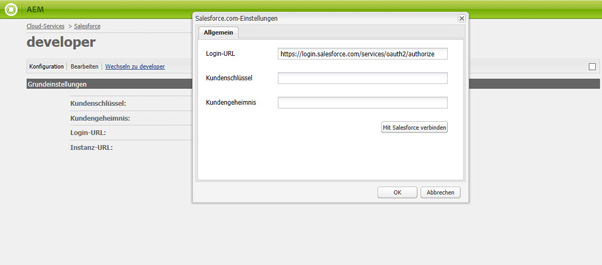

   | Login-URL | Dies ist der Salesforce-Autorisierungsendpunkt. Der Wert ist bereits ausgefüllt und kann in den meisten Fällen verwendet werden. |
   |---|---|
   | Kundenschlüssel | Geben Sie den Wert ein, den Sie von der Seite für die Registrierung bei der Fernzugriffsanwendung in salesforce.com abgerufen haben. |
   | Kundengeheimnis | Geben Sie den Wert ein, den Sie von der Seite für die Registrierung bei der Fernzugriffsanwendung in salesforce.com abgerufen haben. |

1. Klicken **Mit Salesforce verbinden** um eine Verbindung herzustellen. Salesforce fordert Sie auf, dass Ihre Konfiguration eine Verbindung zu Salesforce herstellt.

   

   In AEM wird ein Bestätigungsdialogfeld mit der Meldung geöffnet, dass die Verbindung hergestellt wurde.

1. Navigieren Sie zur Stammseite Ihrer Website und klicken Sie auf **Seiteneigenschaften**. Wählen Sie dann **Cloud-Services** aus und fügen Sie **Salesforce** hinzu. Wählen Sie die richtige Konfiguration aus (beispielsweise **developer**).

   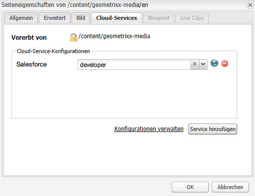

   Jetzt können Sie das Workflow-Modell verwenden, um Leads an Salesforce zu posten und Komponenten zu erstellen, die auf Daten aus Salesforce zugreifen.

## AEM Benutzer als Salesforce Leads exportieren {#exporting-aem-users-as-salesforce-leads}

Wenn Sie einen AEM als Salesforce-Lead exportieren möchten, müssen Sie den Workflow so konfigurieren, dass Leads an Salesforce veröffentlicht werden.

So exportieren Sie AEM Benutzer als Salesforce-Leads:

1. Navigieren Sie zum Salesforce-Workflow unter `http://localhost:4502/workflow`. Klicken Sie dazu mit der rechten Maustaste auf den Workflow **Salesforce.com-Export** und klicken Sie dann auf **Start**.

   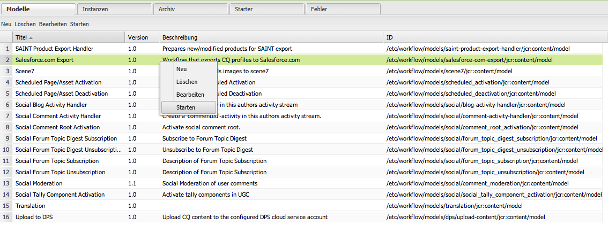

1. Wählen Sie den AEM Benutzer, den Sie als Lead erstellen möchten, als **Nutzlast** für diesen Workflow (Startseite -> Benutzer). Stellen Sie sicher, dass Sie den Profilknoten des Benutzers auswählen, da er Informationen wie **givenName**, **familyName** usw., die Salesforce-Leads zugeordnet sind **FirstName** und **LastName** -Felder.

   

   >[!NOTE]
   >
   >Vor Beginn dieses Workflows gibt es bestimmte Pflichtfelder, die ein Lead-Knoten in AEM vor der Veröffentlichung bei Salesforce aufweisen muss. Diese sind **givenName**, **familyName**, **company** und **email**. Um eine vollständige Liste der Zuordnung zwischen AEM-Benutzer und Salesforce-Lead einzusehen, rufen Sie [Zuordnungskonfiguration zwischen AEM-Benutzer und Salesforce-Lead](#mapping-configuration-between-aem-user-and-salesforce-lead) auf.

1. Klicken Sie auf **OK**. Die Benutzerinformationen werden nach salesforce.com exportiert. Sie können es unter salesforce.com überprüfen.

   >[!NOTE]
   >
   >Die Fehlerprotokolle zeigen Ihnen, ob ein Lead importiert wird. Weitere Informationen finden Sie im Fehlerprotokoll .

### Konfiguration des Salesforce.com Export-Workflows {#configuring-the-salesforce-com-export-workflow}

Möglicherweise müssen Sie den Salesforce.com Export-Workflow so konfigurieren, dass er der korrekten Salesforce.com-Konfiguration entspricht, oder Sie müssen andere Änderungen vornehmen.

So konfigurieren Sie den Salesforce.com-Export-Workflow:

1. Navigieren Sie zu `http://localhost:4502/cf#/etc/workflow/models/salesforce-com-export.html.`

   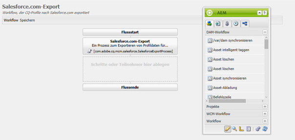

1. Öffnen Sie den Schritt „Salesforce.com-Export“ und wählen Sie die Registerkarte **Argumente** aus. Stellen Sie sicher, dass die richtige Konfiguration ausgewählt ist, und klicken Sie auf **OK**. Aktivieren Sie zudem das Kontrollkästchen, wenn Sie möchten, dass der Workflow einen Lead, der in Salesforce gelöscht wurde, neu erstellt.

   

1. Klicken Sie auf **Speichern**, um Ihre Änderungen zu speichern.

   

### Zuordnungskonfiguration zwischen AEM-Benutzer und Salesforce-Lead {#mapping-configuration-between-aem-user-and-salesforce-lead}

Um die aktuelle Zuordnungskonfiguration zwischen einem AEM-Benutzer und einem Salesforce-Lead einzusehen oder zu bearbeiten, öffnen Sie den Konfigurations-Manager unter `https://<hostname>:<port>/system/console/configMgr` und suchen Sie nach **Salesforce-Lead-Zuordnungskonfiguration**.

1. Öffnen Sie den Konfigurations-Manager. Dazu klicken Sie auf **Web-Konsole** oder Sie gehen direkt zu `https://<hostname>:<port>/system/console/configMgr.`
1. Suchen Sie nach **Salesforce-Lead-Zuordnungskonfiguration**.

   

1. Ändern Sie die Zuordnungen nach Bedarf. Die Standardzuordnung folgt dem Muster** aemUserAttribute=sfLeadAttribute**. Klicken Sie auf **Speichern**, um Ihre Änderungen zu speichern.

## Konfigurieren des Salesforce ClientContext Store {#configuring-salesforce-client-context-store}

Der Salesforce-Client-Kontextspeicher zeigt zusätzliche Informationen zum derzeit angemeldeten Benutzer an, als bereits in AEM verfügbar sind. Diese zusätzlichen Informationen werden abhängig von der Verbindung des Benutzers mit Salesforce von Salesforce abgerufen.

Konfigurieren Sie dazu Folgendes:

1. Verknüpfen Sie einen AEM mit einer Salesforce-ID über die Salesforce Connect-Komponente.
1. Fügen Sie die Salesforce-Profildaten zur Client-Kontextseite hinzu, um zu konfigurieren, welche Eigenschaften Sie sehen möchten.
1. (Optional) Erstellen Sie ein Segment, das die Daten aus dem Salesforce Client Context Store verwendet.

### Verknüpfen eines AEM Benutzers mit einer Salesforce ID {#linking-an-aem-user-with-a-salesforce-id}

Sie müssen einen AEM Benutzer einer Salesforce-ID zuordnen, um sie im Client-Kontext zu laden. In einem realen Szenario würden Sie basierend auf bekannten Benutzerdaten eine Verknüpfung mit einer Validierung herstellen. Zu Demonstrationszwecken verwenden Sie in diesem Verfahren die **Salesforce Connect** -Komponente.

1. Navigieren Sie in AEM zu einer Website, melden Sie sich an und ziehen Sie die **Salesforce Connect** -Komponente aus dem Sidekick.

   >[!NOTE]
   >
   >Wenn die Variable **Salesforce Connect** -Komponente nicht verfügbar ist, navigieren Sie zu **Design** anzeigen und auswählen, um sie verfügbar zu machen in **Bearbeiten** anzeigen.

   

   Wenn Sie die Komponente auf die Seite ziehen, zeigt diese **Verknüpfung zu Salesforce=Aus** an.

   

   >[!NOTE]
   >
   >Diese Komponente dient nur zu Demonstrationszwecken. Für reale Szenarien gibt es einen weiteren Prozess, um Benutzer mit Leads zu verknüpfen/zuzuordnen.

1. Nachdem Sie die Komponente auf die Seite gezogen haben, öffnen Sie sie, um sie zu konfigurieren. Wählen Sie die Konfiguration, den Kontakttyp und den Salesforce-Lead oder -Kontakt aus und klicken Sie auf **OK**.

   

   AEM verknüpft den Benutzer mit dem Salesforce-Kontakt oder -Lead.

   

### Hinzufügen von Salesforce-Daten zu ClientContext {#adding-salesforce-data-to-client-context}

Sie können Benutzerdaten aus Salesforce in ClientContext laden, um sie für die Personalisierung zu verwenden:

1. Öffnen Sie den ClientContext, den Sie erweitern möchten, indem Sie dorthin navigieren. Beispiel: `http://localhost:4502/etc/clientcontext/default/content.html.`

   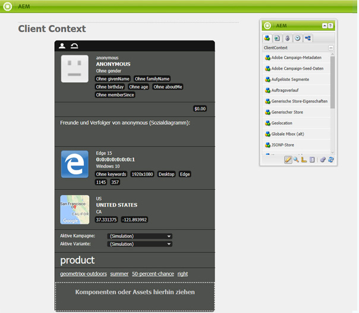

1. Ziehen Sie die **Salesforce-Profildaten**-Komponente auf den ClientContext.

   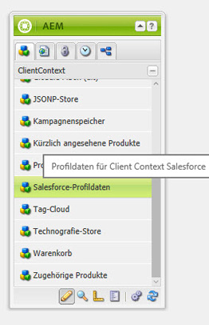

1. Doppelklicken Sie auf die Komponente, um sie zu öffnen. Auswählen **Element hinzufügen** und wählen Sie eine Eigenschaft aus der Dropdownliste aus. Fügen Sie beliebig viele Eigenschaften hinzu und wählen Sie **OK**.

   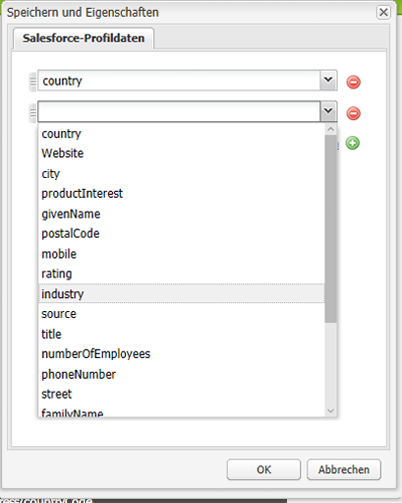

1. Jetzt können Sie die Salesforce-spezifischen Eigenschaften aus Salesforce im ClientContext sehen.

   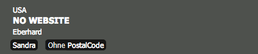

### Erstellen eines Segments mithilfe von Daten aus dem Salesforce Client Context Store {#building-a-segment-using-data-from-salesforce-client-context-store}

Sie können ein Segment erstellen, das Daten aus dem Salesforce Client Context Store verwendet. Gehen Sie hierfür wie folgt vor:

1. Navigieren Sie zur Segmentierung in AEM, entweder indem Sie zu **Tools** > **Segmentierung** oder aber zu [http://localhost:4502/miscadmin#/etc/segmentation](http://localhost:4502/miscadmin#/etc/segmentation) wechseln.
1. Erstellen oder aktualisieren Sie ein Segment, um Daten aus Salesforce einzuschließen. Weitere Informationen finden Sie unter [Segmentierung](/help/sites-administering/campaign-segmentation.md).

## Suchen nach Leads {#searching-leads}

AEM wird mit einer Beispielsuchkomponente geliefert, die Leads in Salesforce gemäß den angegebenen Kriterien durchsucht. Diese Komponente zeigt Ihnen, wie Sie mit der Salesforce REST API nach Salesforce-Objekten suchen können. Sie müssen eine Seite mit einer Salesforce-Konfiguration verknüpfen, um einen Aufruf an salesforce.com auszulösen.

>[!NOTE]
>
>Dies ist eine Beispielkomponente, die Ihnen zeigt, wie Sie die Salesforce REST API zum Abfragen von Salesforce-Objekten verwenden. Verwenden Sie es als Beispiel, um komplexere Komponenten basierend auf Ihren Anforderungen zu erstellen.

So verwenden Sie diese Komponente:

1. Navigieren Sie zu der Seite, auf der Sie diese Konfiguration verwenden möchten. Öffnen Sie die Seiteneigenschaften und wählen Sie **Cloud Services.** Klicken **Dienste hinzufügen** und wählen Sie **Salesforce** und klicken Sie auf **OK**.

   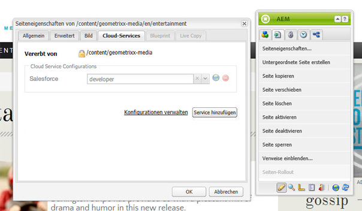

1. Ziehen Sie die Salesforce-Suchkomponente auf die Seite (sofern sie aktiviert wurde). Um sie zu aktivieren, wechseln Sie zum Designmodus und fügen Sie ihn dem entsprechenden Bereich hinzu).

   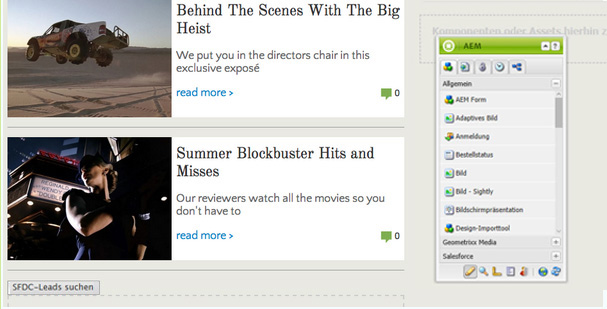

1. Öffnen Sie die Suchkomponente und legen Sie die Suchparameter fest. Klicken Sie dann auf **OK**.

   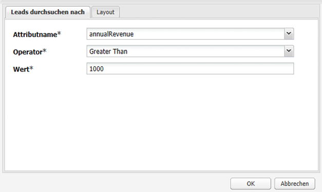

1. AEM zeigt die in Ihrer Suchkomponente aufgeführten Leads an, die den angegebenen Kriterien entsprechen.

   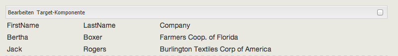
