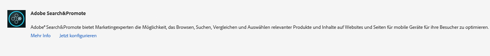
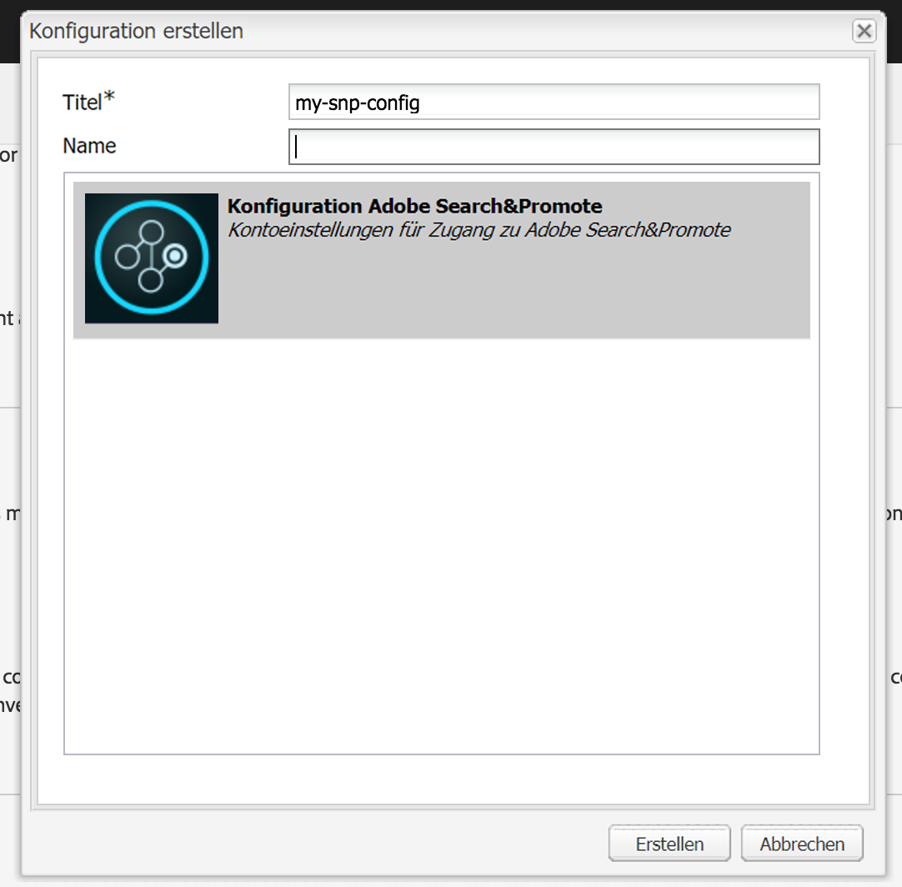
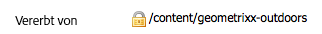

# Integrieren mit Adobe Search&amp;Promote{#integrating-with-adobe-search-promote}

Führen Sie zum Abrufen des Dienstes Adobe Search&amp;Promote von unserer Website die folgenden Aufgaben durch:

1. Geben Sie die URL der Cloud an.
1. Konfigurieren Sie die Verbindung mit dem Search&amp;Promote-Dienst.
1. Add Search&amp;Promote components to [!UICONTROL Sidekick].
1. Verwenden Sie die Komponenten für die Bearbeitung des Inhalts. (Siehe [Hinzufügen von Search&amp;Promote-Funktionen zu einer Webseite](/help/sites-authoring/search-and-promote.md).)
1. Fügen Sie Ihren Seiten Banner hinzu. Bannerbilder reagieren auf Search&amp;Promote-Daten.
1. Generieren Sie eine Sitemap für den Search&amp;Promote-Dienst.

>[!NOTE]
>
>Wenn Sie Search&amp;Promote mit einer benutzerdefinierten Proxy-Konfiguration verwenden, müssen Sie beide HTTP-Client-Proxy-Konfigurationen vornehmen, da manche AEM-Funktionen 3.x-APIs verwenden und andere wiederum 4.x-APIs:
>
>* 3.x wird mit [http://localhost:4502/system/console/configMgr/com.day.commons.httpclient](http://localhost:4502/system/console/configMgr/com.day.commons.httpclient) konfiguriert.
>* 4.x wird mit [http://localhost:4502/system/console/configMgr/org.apache.http.proxyconfigurator](http://localhost:4502/system/console/configMgr/org.apache.http.proxyconfigurator) konfiguriert.

>

## Ändern der URL des Search&amp;Promote-Diensts {#changing-the-search-promote-service-url}

The default URL that is configured for the Search&amp;Promote service is `https://searchandpromote.omniture.com/px/`. Verwenden Sie zur Verwendung eines anderen Diensts die OSGi-Konsole, um eine andere URL anzugeben.

**So ändern Sie die URL** des Search&amp;Promote:

1. Open the [!UICONTROL OSGi] console and tap the **[!UICONTROL Configuration]** tab. ([http://localhost:4502/system/console/configMgr.](http://localhost:4502/system/console/configMgr))

1. Click the **[!UICONTROL Day CQ Search&amp;Promote Configuration]** item.
1. Geben Sie im Textfeld **[!UICONTROL Remote-Server-URI]** die URL ein und tippen Sie dann auf **[!UICONTROL Speichern]**.

## Konfigurieren der Verbindung mit Search&amp;Promote {#configuring-the-connection-to-search-promote}

Konfigurieren Sie eine oder mehrere Verbindungen mit Search&amp;Promote, sodass Ihre Webseiten mit dem Dienst interagieren können. Für die Verbindung benötigen Sie die Mitgliedsidentifikations- und Kontonummer Ihres Search&amp;Promote-Kontos.

**So konfigurieren Sie die Verbindung zu Search&amp;Promote**:

1. From the **[!UICONTROL Tools]** icon > **[!UICONTROL Deployment]**, select **[!UICONTROL Cloud Services]**.

   Hierdurch werden Sie zum Dashboard der Cloud-Services weitergeleitet. Wenn auf einem lokalen Computer die URL des Dashboards in etwa wie folgt aussieht:

   [http://localhost:4502/libs/cq/core/content/tools/cloudservices.html](http://localhost:4502/libs/cq/core/content/tools/cloudservices.html)

1. In the [!UICONTROL Cloud Services] page, tap the **[!UICONTROL Adobe Search&amp;Promote]** link or the **[!UICONTROL Search&amp;Promote]** icon.

1. If this is the first time you are configuring Adobe Search&amp;Promote, tap **[!UICONTROL Configure Now]** to open the [!UICONTROL Create Configuration] panel.

   If you would like to learn more about Search&amp;Promote click **[!UICONTROL Learn more]** instead.

   

1. Enter a **[!UICONTROL Title]** that is recognizable to page authors, and enter a unique **[!UICONTROL Name]**, then tap **[!UICONTROL Create]**.

   Darüber hinaus wird die neu erstellte Konfiguration unter **[!UICONTROL Verfügbare Konfigurationen]** im **[!UICONTROL Cloud-Services-Dashboard]** des Adobe Search&amp;Promote-Listenelements angezeigt.

   

1. Fügen Sie im Dialogfeld &quot;Komponente [!UICONTROL bearbeiten] &quot;den Feldern Folgendes hinzu:

   * **[!UICONTROL Mitglieds-ID]**
   * **[!UICONTROL Kontonummer]**

   >[!NOTE]
   >
   >Um diese Informationen selbst zu erhalten, melden Sie sich an bei:
   >
   >[https://searchandpromote.omniture.com/center/](https://searchandpromote.omniture.com/center/)
   >
   >mithilfe Ihrer gültigen Seach&amp;Promote-Zugriffsberechtigung (E-Mail/Kennwort) anmelden.
   >
   >Beachten Sie die URL in der Adressleiste Ihres Browsers. Es sollte in etwa wie folgt aussehen:
   >
   >
   >
   >[https://searchandpromote.omniture.com/px/home/?sp_id=XXXXXXXX-spYYYYYYYY](https://searchandpromote.omniture.com/px/home/?sp_id=XXXXXXXX-spYYYYYYYY)
   >
   >Dabei entspricht **XXXXXXXX** Ihrer **[!UICONTROL Mitglieds-ID]** und **[!UICONTROL spYYYYY]** Ihrer Kontonummer.

1. Tap **[!UICONTROL Connect To Search&amp;Promote]**.

   When the connection success message appears, tap **[!UICONTROL OK]**.

   (Nach der Verbindung ändert sich der Schaltflächen-Text zu **[!UICONTROL Erneut mit Search&amp;Promote verbinden]**.)

1. Tippen Sie auf **[!UICONTROL OK]**. Die Seite mit den Search&amp;Promote-Einstellungen wird für die gerade von Ihnen erstellte Konfiguration angezeigt.

## Konfigurieren des Datenzentrums {#configuring-the-data-center}

Wenn sich Ihr Search&amp;Promote in Asien oder Europa befindet, müssen Sie das Standarddatencenter so ändern, dass es auf das richtige verweist (das Standarddatencenter gilt für Nordamerika-Konten).

**Sie können das Datenzentrum wie folgt konfigurieren**:

1. Navigate to the Web console at `http://localhost:4502/system/console/configMgr/com.day.cq.searchpromote.impl.SearchPromoteServiceImpl`

   

1. Ändern Sie den URI je nach Standort des Servers in einen der folgenden:

   * North America: [https://center.atomz.com/px/](https://center.atomz.com/px/)
   * EMEA: [https://center.lon5.atomz.com/px/](https://center.lon5.atomz.com/px/)
   * APAC: [https://center.sin2.atomz.com/px/](https://center.sin2.atomz.com/px/)

1. Tippen Sie auf **[!UICONTROL Speichern]**.

## Hinzufügen von Search&amp;Promote-Komponenten zum Sidekick {#adding-search-promote-components-to-sidekick}

In [!UICONTROL Design] mode, edit a **[!UICONTROL par]** component to allow the Search&amp;Promote components in [!UICONTROL Sidekick]. (In der Dokumentation zu den [Komponenten](/help/sites-developing/components.md) finden Sie weitere Informationen.)

For information about using the components, see [Adding Search&amp;Promote features to a Web Page](/help/sites-authoring/search-and-promote.md).

## Angeben des von Ihren Seiten verwendeten Search&amp;Promote-Dienstes {#specifying-the-search-promote-service-that-your-pages-use}

Konfigurieren Sie Webseiten so, dass diese einen spezifischen Search&amp;Promote-Dienst verwenden. Search&amp;Promote-Komponenten verwenden automatisch den Dienst ihrer Hostseite.

Wenn Sie die Search&amp;Promote-Eigenschaften für eine Hostseite konfigurieren, übernehmen alle untergeordneten Seiten die Einstellungen. Bei Bedarf können Sie die untergeordneten Seiten so konfigurieren, dass sie die übernommenen Einstellungen außer Kraft setzen.

>[!NOTE]
>
>Die Dienstverbindung muss bereits konfiguriert sein. Siehe [Konfigurieren der Verbindung zu Search&amp;Promote](#configuring-the-connection-to-search-promote).

1. Öffnen Sie das Dialogfeld **[!UICONTROL Seiteneigenschaften]**. Klicken Sie beispielsweise mit der rechten Maustaste auf die Seite **[!UICONTROL Websites]** und klicken Sie auf **[!UICONTROL Eigenschaften]**.

1. Klicken Sie auf die Registerkarte **[!UICONTROL Cloud-Services.]**

1. Zum Deaktivieren der Vererbung der Cloud Service-Konfigurationen von einer übergeordneten Seite klicken Sie auf das Schlosssymbol neben dem Vererbungspfad.

   

1. Click **[!UICONTROL Add Service]**, select **[!UICONTROL Adobe Search&amp;Promote]**, then click **[!UICONTROL OK]**.

1. Select the connection configuration for your Search&amp;Promote account, then click **[!UICONTROL OK]**.

## Produkt-Feed {#product-feed}

Mit der Search&amp;Promote-Integration haben Sie folgende Möglichkeiten:

* Use the [!UICONTROL eCommerce] API, independently of the underlying repository structure and commerce platform.
* Leverage the [!UICONTROL Index Connector] feature of Search&amp;Promote to provide a product feed in XML format.
* Leverage the [!UICONTROL Remote Control] feature of Search&amp;Promote to perform on-demand or scheduled requests of the product feed.
* Feed-Erstellung für verschiedene Search&amp;Promote, konfiguriert als Cloud-Services-Konfigurationen.

For more information, see [Product Feed](/help/sites-administering/product-feed.md).
