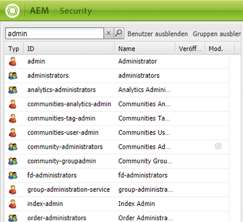
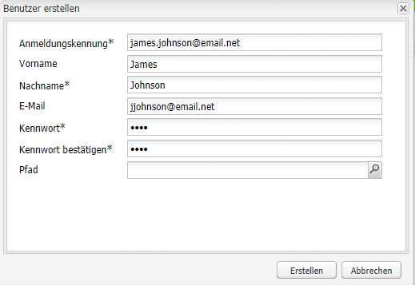
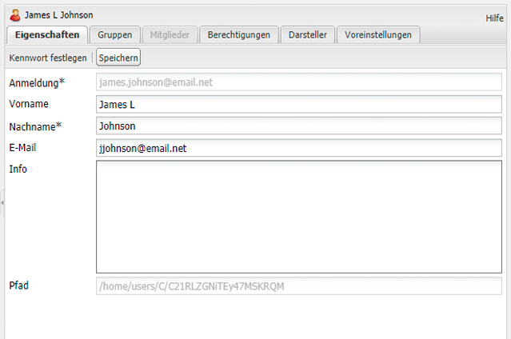
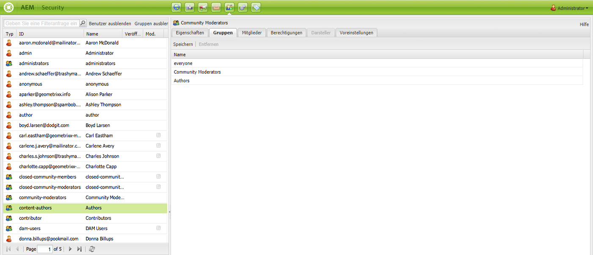
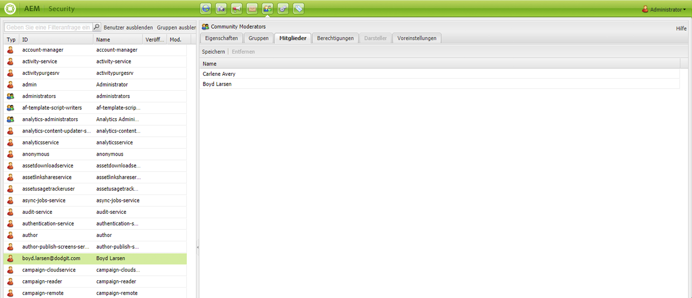
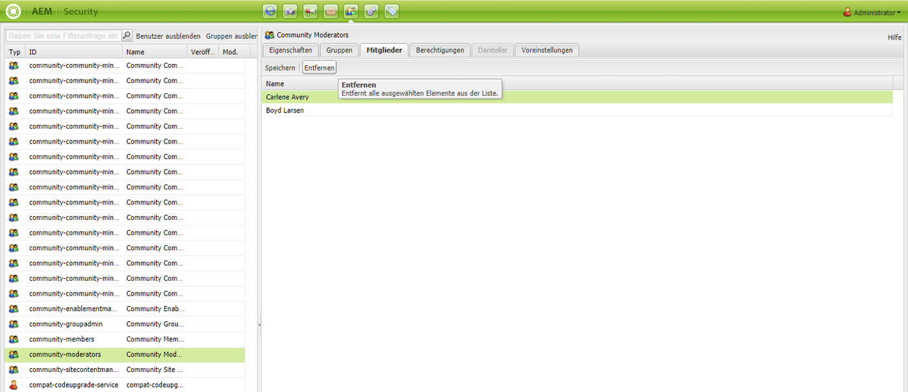
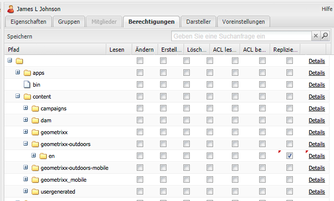

# Benutzerverwaltung und Sicherheit{#user-administration-and-security}

>[!CAUTION]
>
>AEM 6.4 hat das Ende der erweiterten Unterstützung erreicht und diese Dokumentation wird nicht mehr aktualisiert. Weitere Informationen finden Sie in unserer [technische Unterstützung](https://helpx.adobe.com/de/support/programs/eol-matrix.html). Unterstützte Versionen suchen [here](https://experienceleague.adobe.com/docs/?lang=de).

In diesem Kapitel wird beschrieben, wie die Benutzerautorisierung konfiguriert und verwaltet wird. Außerdem werden die Grundlagen für die Funktionsweise von Authentifizierung und Autorisierung in AEM beschrieben.

## Benutzer und Gruppen in AEM {#users-and-groups-in-aem}

In diesem Abschnitt werden die verschiedenen Entitäten und verwandten Konzepte ausführlicher behandelt, damit Sie ein benutzerfreundliches Verwaltungskonzept konfigurieren können.

### Benutzer {#users}

Benutzer melden sich mit ihrem Konto bei AEM an. Jedes Benutzerkonto ist eindeutig und enthält die grundlegenden Kontodetails sowie die zugewiesenen Berechtigungen.

Benutzer sind häufig Mitglieder von Gruppen, was die Zuweisung dieser Berechtigungen und/oder Berechtigungen vereinfacht.

### Gruppen {#groups}

Gruppen sind Sammlungen von Benutzern und/oder anderen Gruppen; Diese werden alle als Mitglieder einer Gruppe bezeichnet.

Ihr Hauptzweck besteht darin, den Wartungsvorgang zu vereinfachen, indem die Anzahl der zu aktualisierenden Entitäten verringert wird, da eine Änderung an einer Gruppe auf alle Mitglieder der Gruppe angewendet wird. Gruppen spiegeln häufig Folgendes wider:

* eine Rolle innerhalb der Anwendung; z. B. jemand, der den Inhalt surfen darf, oder jemand, der Inhalte hinzufügen darf.
* Ihre eigene Organisation; Sie können die Rollen erweitern, um zwischen Mitwirkenden aus verschiedenen Abteilungen zu unterscheiden, wenn sie auf verschiedene Zweige in der Inhaltsstruktur beschränkt sind.

Daher bleiben Gruppen meist stabil, während Benutzer häufiger kommen und gehen.

Mit Planung und sauberer Struktur kann die Verwendung von Gruppen Ihre Struktur widerspiegeln, sodass Sie einen klaren Überblick und einen effizienten Mechanismus für Aktualisierungen erhalten.

### Integrierte Benutzer und Gruppen {#built-in-users-and-groups}

AEM WCM installiert eine Reihe von Benutzern und Gruppen. Diese werden angezeigt, wenn Sie nach der Installation zum ersten Mal auf die Sicherheitskonsole zugreifen.

In den folgenden Tabellen sind die einzelnen Elemente zusammen mit aufgeführt:

* einer kurzen Beschreibung;
* etwaigen Empfehlungen zu erforderlichen Änderungen.

*Ändern Sie alle Standardkennwörter* (sofern Sie nicht das gesamte Konto unter gewissen Bedingungen löschen).

<table> 
 <tbody> 
  <tr> 
   <td>Benutzer-ID </td> 
   <td>Typ</td> 
   <td>Beschreibung</td> 
   <td>Empfehlung</td> 
  </tr> 
  <tr> 
   <td>
admin
 
Standardkennwort: admin
 </td> 
   <td>User</td> 
   <td>
Systemverwaltungskonto mit vollen Zugriffsrechten.
 
Dieses Konto wird für die Verbindung zwischen AEM WCM und CRX verwendet.
 
Wenn Sie dieses Konto versehentlich löschen, wird es beim Neustart des Repositorys neu erstellt (in der Standardeinrichtung).
 
Das Administratorkonto ist eine Anforderung der AEM Plattform. Folglich kann dieses Konto nicht gelöscht werden.
 </td> 
   <td>
Adobe empfiehlt dringend, das Kennwort für dieses Benutzerkonto von der Standardeinstellung zu ändern.
 
Vorzugsweise sollte dies bei der Installation geschehen, aber danach ist es möglich.
 
Hinweis: Dieses Konto ist nicht mit dem Administratorkonto der CQ Servlet Engine zu verwechseln.
 </td> 
  </tr> 
  <tr> 
   <td>
Anonym
 
 
 </td> 
   <td>User</td> 
   <td>
Enthält die Standardrechte für nicht authentifizierten Zugriff auf eine Instanz. Standardmäßig sind hierdurch die Mindestzugriffsrechte festgelegt.
 
Wenn Sie dieses Konto versehentlich löschen, wird es beim Start neu erstellt. Sie kann nicht dauerhaft gelöscht werden, sie kann jedoch deaktiviert werden.
 </td> 
   <td>Vermeiden Sie es, dieses Konto zu löschen oder zu deaktivieren, da dies die Funktionsweise von Autoreninstanzen negativ beeinflusst. Wenn es Sicherheitsanforderungen gibt, die Sie dazu verpflichten, sie zu löschen, stellen Sie sicher, dass Sie zuerst die Auswirkungen auf Ihre Systeme ordnungsgemäß testen.</td> 
  </tr> 
  <tr> 
   <td>
author
 
Standardkennwort: author
 </td> 
   <td>User</td> 
   <td>
Ein Autorenkonto, das in /content geschrieben werden darf. Umfasst Berechtigungen für Mitwirkende und Surfer.
 
Kann als Webmaster verwendet werden, da er Zugriff auf die gesamte /content-Struktur hat.
 
Dies ist kein integrierter Benutzer, sondern ein anderer Geometrixx-Demobenutzer
 </td> 
   <td>
Adobe empfiehlt, entweder das Konto vollständig zu löschen oder das Standardkennwort zu ändern.
 
Vorzugsweise sollte dies bei der Installation geschehen, aber danach ist es möglich.
 </td> 
  </tr> 
  <tr> 
   <td>Administratoren</td> 
   <td>Gruppe</td> 
   <td>
Gruppe, die allen Mitgliedern Administratorrechte gewährt. Diese Gruppe darf nur von Administratoren bearbeitet werden.
 
Hat vollständige Zugriffsrechte.
 </td> 
   <td>Wenn Sie für einen Knoten „deny-everyone“ festlegen, haben Admins nur dann Zugriff, wenn dieser erneut für die Gruppe gewährt wird.</td> 
  </tr> 
  <tr> 
   <td>content-authors</td> 
   <td>Gruppe</td> 
   <td>
Gruppe, die für die Inhaltsbearbeitung verantwortlich ist. Es sind Berechtigungen zum Lesen, Ändern, Erstellen und Löschen erforderlich.
 </td> 
   <td>Sie können eigene „content-author“-Gruppen mit projektspezifischen Zugriffsrechten erstellen, sofern Sie Berechtigungen zum Lesen, Ändern, Erstellen und Löschen bereitstellen.</td> 
  </tr> 
  <tr> 
   <td>contributor</td> 
   <td>Gruppe</td> 
   <td>
Grundlegende Berechtigungen, die es dem Benutzer ermöglichen, Inhalte zu schreiben (nur in der Funktionalität).
 
Weist der /content-Struktur keine Berechtigungen zu - diese müssen speziell für die einzelnen Gruppen oder Benutzer zugewiesen werden.
 </td> 
   <td> </td> 
  </tr> 
  <tr> 
   <td>dam-users</td> 
   <td>Gruppe</td> 
   <td>Vordefinierte Referenzgruppe für einen typischen AEM Assets-Benutzer. Mitglieder dieser Gruppe verfügen über die entsprechenden Berechtigungen, um das Hochladen/Freigeben von Assets und Sammlungen zu ermöglichen.</td> 
   <td> </td> 
  </tr> 
  <tr> 
   <td>everyone</td> 
   <td>Gruppe</td> 
   <td>
Jeder Benutzer in AEM ist ein Mitglied der Gruppe Jeder, auch wenn Sie die Gruppe oder die Mitgliedschaftsbeziehung nicht in allen Tools sehen.
 
Diese Gruppe kann als Standardberechtigungen betrachtet werden, da sie verwendet werden kann, um Berechtigungen für alle anzuwenden, selbst für Benutzer, die in Zukunft erstellt werden.
 </td> 
   <td>
Ändern oder löschen Sie diese Gruppe nicht.
 
Eine Änderung dieses Kontos wirkt sich auf die Sicherheit zusätzlich aus.
 </td> 
  </tr> 
  <tr> 
   <td>tag-administrators</td> 
   <td>Gruppe</td> 
   <td>Gruppe, die Tags bearbeiten darf.</td> 
   <td> </td> 
  </tr> 
  <tr> 
   <td>user-administrators</td> 
   <td>Gruppe</td> 
   <td>Gruppe, die zur Benutzerverwaltung autorisiert, also berechtigt, Benutzerinnen und Benutzer sowie Gruppen zu erstellen.</td> 
   <td> </td> 
  </tr> 
  <tr> 
   <td>workflow-editors</td> 
   <td>Gruppe</td> 
   <td>Gruppe, die zum Erstellen und Ändern von Workflow-Modellen berechtigt ist.</td> 
   <td> </td> 
  </tr> 
  <tr> 
   <td>workflow-users</td> 
   <td>Gruppe</td> 
   <td>
Ein Benutzer, der an einem Workflow teilnimmt, muss Mitglied von Gruppen-Workflow-Benutzern sein. Dadurch erhält er vollständigen Zugriff auf: /etc/workflow/instances, damit sie die Workflow-Instanz aktualisieren können.
 
Die Gruppe ist Teil der Standardinstallation, Sie müssen jedoch Ihre Benutzer manuell zur Gruppe hinzufügen.
 </td> 
  </tr> 
 </tbody> 
</table>

## Berechtigungen in AEM {#permissions-in-aem}

AEM nutzt ACLs (Access Control Lists, Zugriffssteuerungslisten), um zu ermitteln, welche Aktionen eine Benutzerin, ein Benutzer oder eine Gruppe wo durchführen kann.

### Berechtigungen und ACLs {#permissions-and-acls}

Berechtigungen definieren, wer welche Aktionen für eine Ressource ausführen darf. Berechtigungen sind das Ergebnis einer Bewertung der [Zugriffssteuerung](#access-control-lists-and-how-they-are-evaluated).

Sie können die für bestimmte Benutzende erteilten/abgelehnten Berechtigungen durch Aktivieren oder Deaktivieren der Kontrollkästchen für die einzelnen AEM-[Aktionen](security.md#actions) ändern. Ein Häkchen bedeutet, dass eine Aktion erlaubt ist. Kein Häkchen bedeutet, dass eine Aktion abgelehnt wird.

Wenn sich das Häkchen im Raster befindet, zeigt auch an, welche Berechtigungen Benutzer an welchen Stellen in AEM haben (d. h. welche Pfade).

### Aktionen {#actions}

Aktionen können auf einer Seite (Ressource) ausgeführt werden. Für jede Seite in der Hierarchie können Sie festlegen, welche Aktion der Benutzer auf dieser Seite ausführen darf. Mithilfe von [Berechtigungen](#permissions-and-acls) können Sie eine Aktion zulassen oder ablehnen.

<table> 
 <tbody> 
  <tr> 
   <td><strong>Aktion </strong></td> 
   <td><strong>Beschreibung </strong></td> 
  </tr> 
  <tr> 
   <td>Lesen</td> 
   <td>Benutzende dürfen die Seite und alle untergeordneten Seiten lesen.</td> 
  </tr> 
  <tr> 
   <td>Ändern</td> 
   <td>
Benutzende können:
 
    <ul> 
     <li>vorhandenen Inhalt auf der Seite und auf untergeordneten Seiten ändern.</li> 
     <li>neue Absätze auf der Seite oder auf untergeordneten Seiten erstellen.</li> 
    </ul> 
Benutzende können auf JCR-Ebene eine Ressource ändern, indem sie die zugehörigen Eigenschaften, Sperr- und Versionierungsvorgänge sowie nt-Änderungen bearbeiten. Außerdem verfügen sie über volle Schreibrechte für Knoten, die untergeordnete jcr:content-Knoten definieren, z. B. cq:Page, nt:file, cq:Asset.
 </td> 
  </tr> 
  <tr> 
   <td>Erstellen</td> 
   <td>
Benutzende können:
 
    <ul> 
     <li>eine neue Seite oder untergeordnete Seite erstellen.</li> 
    </ul> 
Wenn <strong>Verändern</strong> nicht zulässig ist, sind die Unterstrukturen unter „jcr:content“ ausdrücklich ausgeschlossen, weil die Erstellung von jcr:content und seiner untergeordneten Knoten als Seitenbearbeitung gilt. Dies gilt nur für die Knoten, die einen untergeordneten jcr:content-Knoten definieren.
 </td> 
  </tr> 
  <tr> 
   <td>Löschen</td> 
   <td>
Benutzende können:
 
    <ul> 
     <li>vorhandene Absätze von der Seite oder einer untergeordneten Seite löschen.</li> 
     <li>eine Seite oder untergeordnete Seite löschen.</li> 
    </ul> 
Wenn <strong>Verändern</strong> nicht zulässig ist, sind die Unterstrukturen unter „jcr:content“ ausdrücklich ausgeschlossen, weil die Entfernung von jcr:content und seiner untergeordneten Knoten als Seitenbearbeitung gilt. Dies gilt nur für die Knoten, die einen untergeordneten jcr:content-Knoten definieren.
 </td> 
  </tr> 
  <tr> 
   <td>ACL lesen</td> 
   <td>Benutzende können die Zugriffssteuerungsliste der Seite oder untergeordneten Seiten lesen.</td> 
  </tr> 
  <tr> 
   <td>ACL bearbeiten</td> 
   <td>Benutzende können die Zugriffssteuerungsliste der Seite oder untergeordneter Seiten ändern.</td> 
  </tr> 
  <tr> 
   <td>Replizieren</td> 
   <td>Benutzende können Inhalte in einer anderen Umgebung replizieren (z. B. in der Publishing-Umgebung). Die Berechtigung gilt auch für untergeordnete Seiten.</td> 
  </tr> 
 </tbody> 
</table>

>[!NOTE]
>
>AEM generiert automatisch Benutzergruppen für die Rollenzuweisung (Inhaber, Bearbeiter, Betrachter) in [Sammlungen](/help/assets/managing-collections-touch-ui.md). Das manuelle Hinzufügen von ACLs für solche Gruppen kann jedoch Sicherheitslücken in AEM verursachen. Adobe empfiehlt, das manuelle Hinzufügen von ACLs zu vermeiden.

### Zugriffssteuerungslisten und deren Bewertung {#access-control-lists-and-how-they-are-evaluated}

AEM WCM verwendet Zugriffssteuerungslisten (ACLs), um die Berechtigungen zu organisieren, die auf die verschiedenen Seiten angewendet werden.

Zugriffssteuerungslisten bestehen aus den individuellen Berechtigungen und werden verwendet, um die Reihenfolge zu bestimmen, in der diese Berechtigungen tatsächlich angewendet werden. Die Liste wird entsprechend der Hierarchie der betroffenen Seiten gebildet. Diese Liste wird dann von unten nach oben gescannt, bis die erste geeignete Berechtigung zur Anwendung auf eine Seite gefunden wurde.

>[!NOTE]
>
>Es gibt ACLs, die in den Beispielen enthalten sind. Es wird empfohlen, dass Sie überprüfen und bestimmen, was für Ihre Anwendungen geeignet ist. Um sich die enthaltenen ACLs anzusehen, gehen Sie zu **CRXDE** und wählen Sie die Registerkarte **Zugriffssteuerung** für die folgenden Knoten aus:
>
>`/etc/cloudservices/facebookconnect/geometrixx-outdoorsfacebookapp`: Alle haben Lesezugriff.
>`/etc/cloudservices/twitterconnect/geometrixx-outdoors-twitter-app`: Alle haben Lesezugriff.
>`/home/users/geometrixx-outdoors`: Alle haben Lesezugriff für `*/profile*` und\
>`*/social/relationships/following/*`.
>
>Ihre benutzerdefinierte Anwendung kann den Zugriff für andere Beziehungen festlegen, z. B. `*/social/relationships/friend/*` oder `*/social/relationships/pending-following/*`.
>
>Wenn Sie bestimmte ACLs für Communities erstellen, können Mitgliedern, die diesen Communities beitreten, zusätzliche Berechtigungen erteilt werden. Dies könnte beispielsweise der Fall sein, wenn Benutzende den Communities unter `/content/geometrixx-outdoors/en/community/hiking` oder `/content/geometrixx-outdoors/en/community/winter-sports` beitreten.

### Berechtigungsstatus {#permission-states}

>[!NOTE]
>
>Für CQ 5.3-Benutzer:
>
>Im Gegensatz zu vorherigen CQ-Versionen **erstellen** und **delete** sollte nicht mehr gewährt werden, wenn ein Benutzer nur Seiten ändern muss. Geben Sie stattdessen die **Ändern** nur dann zu aktivieren, wenn Sie möchten, dass Benutzer Komponenten auf vorhandenen Seiten erstellen, ändern oder löschen können.
>
>Aus Gründen der Abwärtskompatibilität werden bei den Aktionstests keine Knoten, die **jcr:content** berücksichtigt.

| **Aktion** | **Beschreibung** |
|---|---|
| Zulassen (Häkchen) | AEM WCM ermöglicht es Benutzenden, die Aktion auf dieser Seite oder auf untergeordneten Seiten durchzuführen. |
| Verweigern (kein Häkchen) | AEM WCM gestattet es Benutzenden nicht, die Aktion auf dieser Seite oder auf untergeordneten Seiten durchzuführen. |

Die Berechtigungen werden auch auf alle untergeordneten Seiten angewendet.

Wenn eine Berechtigung nicht vom übergeordneten Knoten vererbt wird, aber mindestens einen lokalen Eintrag dafür hat, werden die folgenden Symbole an das Kontrollkästchen angehängt. Ein lokaler Eintrag ist ein Eintrag, der in der CRX 2.2-Benutzeroberfläche erstellt wird. (Platzhalter-ACLs können derzeit nur in CRX erstellt werden.)

Für eine Aktion unter einem bestimmten Pfad:

<table> 
 <tbody> 
  <tr> 
   <td>* (Sternchen)</td> 
   <td>Es gibt mindestens einen lokalen Eintrag (entweder effektiv oder ineffektiv). Diese Platzhalter-ACLs werden in CRX definiert.</td> 
  </tr> 
  <tr> 
   <td>! (Ausrufezeichen)</td> 
   <td>Es gibt mindestens einen Eintrag, der derzeit nicht effektiv ist.</td> 
  </tr> 
 </tbody> 
</table>

Wenn Sie den Mauszeiger über das Sternchen oder Ausrufezeichen bewegen, enthält eine QuickInfo weitere Details zu den deklarierten Einträgen. Die QuickInfo ist in zwei Teile unterteilt:

<table> 
 <tbody> 
  <tr> 
   <td>Oberer Teil</td> 
   <td>
Listet die effektiven Einträge auf.
 </td> 
  </tr> 
  <tr> 
   <td>Unterer Teil</td> 
   <td>Listet die ineffektiven Einträge auf, die an anderen Stellen der Struktur wirksam sein können (wird durch ein spezielles Attribut angegeben, wobei das entsprechende ACE den Umfang des Eintrags begrenzt). Dies kann auch ein Eintrag sein, dessen Wirkung von einem anderen Eintrag, der unter dem angegebenen Pfad oder in einem Vorgängerknoten definiert wurde, aufgehoben wurde.</td> 
  </tr> 
 </tbody> 
</table>

>[!NOTE]
>
>Wenn für eine Seite keine Berechtigungen definiert sind, werden alle Aktionen verweigert.

Im Folgenden finden Sie Empfehlungen zur Verwaltung von Zugriffssteuerungslisten:

* Weisen Sie Benutzern keine Berechtigungen direkt zu. Weisen Sie sie nur Gruppen zu.

   Dies vereinfacht die Wartung, da die Anzahl der Gruppen viel kleiner ist als die Anzahl der Benutzer und auch weniger flüchtig ist.

* Wenn Sie möchten, dass eine Gruppe/ein Benutzer nur Seiten ändern kann, gewähren Sie ihnen keine Berechtigung zum Erstellen oder Ablehnen von Rechten. Erteilen Sie ihnen nur Änderungen und Leseberechtigungen.
* Verwenden Sie Deny sparsam. Soweit möglich, darf nur &quot;Zulassen&quot;verwendet werden.

   Die Verwendung von Ablehnen kann zu unerwarteten Auswirkungen führen, wenn die Berechtigungen in einer anderen Reihenfolge als der erwarteten angewendet werden. Wenn ein Benutzer Mitglied mehrerer Gruppen ist, können die Anweisungen vom Typ Ablehnen von einer Gruppe die Anweisung Zulassen von einer anderen Gruppe abbrechen oder umgekehrt. Es ist schwierig, in diesem Fall einen Überblick zu behalten und kann leicht zu unvorhergesehenen Ergebnissen führen, während Zuweisungen zulassen solche Konflikte nicht verursacht.

   Adobe empfiehlt, mit Allow anstatt Deny zu arbeiten. Siehe [Best Practices](#best-practices).

Bevor Sie eine der Berechtigungen ändern, sollten Sie wissen, wie sie funktionieren und miteinander in Beziehung stehen. In der CRX-Dokumentation erfahren Sie, wie AEM WCM funktioniert. [bewertet Zugriffsberechtigungen](/help/sites-administering/user-group-ac-admin.md#how-access-rights-are-evaluated) und Beispiele zum Einrichten von Zugriffssteuerungslisten.

### Berechtigungen {#permissions}

Mit Berechtigungen erhalten Benutzer und Gruppen Zugriff auf AEM Funktionen auf AEM Seiten.

Berechtigungen werden pfadweise durch Ein-/Ausblenden der Knoten durchsucht. Außerdem können Sie die Vererbung von Berechtigungen bis zum Stammknoten nachverfolgen.

Um Berechtigungen zuzulassen oder abzulehnen, aktivieren bzw. deaktivieren Sie die entsprechenden Kontrollkästchen.

### Anzeigen detaillierter Berechtigungsinformationen {#viewing-detailed-permission-information}

Zusammen mit der Rasteransicht bietet AEM eine detaillierte Ansicht der Berechtigungen für einen ausgewählten Benutzer/eine ausgewählte Gruppe unter einem bestimmten Pfad. Die Detailansicht enthält zusätzliche Informationen.

Neben der Anzeige von Informationen können Sie auch den aktuellen Benutzer oder die aktuelle Gruppe aus einer Gruppe ein- oder ausschließen. Siehe [Hinzufügen von Benutzenden oder Gruppen beim Hinzufügen von Berechtigungen](#adding-users-or-groups-while-adding-permissions). Hier durchgeführte Änderungen werden sofort im oberen Abschnitt der Detailansicht wiedergegeben.

Zum Aufrufen der Detailansicht klicken Sie für beliebige Gruppen/Benutzende und Pfad auf der Registerkarte **Berechtigungen** auf **Details**.

Die Details werden in zwei voneinander getrennten Bereichen angezeigt:

<table> 
 <tbody> 
  <tr> 
   <td>Oberer Teil</td> 
   <td>
Wiederholt die im Baumdiagramm angezeigten Informationen. Ein Symbol zeigt für jede Aktion an, ob sie zulässig oder verweigert ist:
 
    <ul> 
     <li>Kein Symbol = kein deklarierter Eintrag</li> 
     <li>(Häkchen) = deklarierte Aktion (zulässig)</li> 
     <li>(-) = deklarierte Aktion (verweigert)</li> 
    </ul> </td> 
  </tr> 
  <tr> 
   <td>Unterer Teil</td> 
   <td>
Zeigt das Raster der Benutzenden bzw. Gruppen an, das folgende Funktionen hat:
 
    <ul> 
     <li>Deklariert einen Eintrag für den angegebenen Pfad UND</li> 
     <li>ist die angegebene Autorisierung ODER ist eine Gruppe</li> 
    </ul> </td> 
  </tr> 
 </tbody> 
</table>

### Stellvertretendes Agieren für andere Benutzende {#impersonating-another-user}

Mit der Funktion [Stellvertretend agieren ](/help/sites-authoring/user-properties.md#user-settings)können Benutzende im Auftrag anderer Benutzenden arbeiten.

Das bedeutet, dass ein Benutzerkonto andere Konten angeben kann, die mit seinem Konto arbeiten können. Mit anderen Worten: Wenn Benutzer B die Berechtigung hat, sich als Benutzer A zu präsentieren, kann Benutzer B Aktionen mit den vollständigen Kontodetails von Benutzer A durchführen.

Dadurch können die stellvertretenden Konten Aufgaben so ausführen, als ob sie das Konto verwenden würden, für das sie stellvertretend agieren. z. B. bei Abwesenheit oder kurzfristiger Lastenteilung.

>[!NOTE]
>
>Um stellvertretend für Benutzerinnen und Benutzer ohne Administratorrechte arbeiten zu können, muss der Stellvertreter (im obigen Fall Benutzer B) über LESE-Berechtigungen im Pfad `/home/users` verfügen.
>
>Weitere Informationen zur Vorgehensweise finden Sie unter [Berechtigungen in AEM](/help/sites-administering/security.md#permissions-in-aem).

>[!CAUTION]
>
>Wenn ein Konto stellvertretend für ein anderes agiert, ist es sehr schwer zu sehen. Im Auditprotokoll wird ein Eintrag eingefügt, wenn der Identitätswechsel beginnt und endet. Die anderen Protokolldateien (wie das Zugriffsprotokoll) enthalten jedoch keine Informationen darüber, dass bei den Ereignissen eine Identitätswechsel stattgefunden hat. Wenn also Benutzer B stellvertretend für Benutzer A agiert, sehen alle Ereignisse so aus, als ob sie von Benutzer A persönlich durchgeführt würden.

>[!CAUTION]
>
>Wird stellvertretend für andere Benutzende agiert, ist es möglich, eine Seite zu sperren. Eine auf diese Weise gesperrte Seite kann jedoch nur dann entsperrt werden, wenn der Benutzer, der stellvertretend agiert hat, oder ein Benutzer mit Administratorrechten.
>
>Seiten lassen sich nicht stellvertretend für Benutzende entsperren, die die Seite gesperrt haben.

### Best Practices {#best-practices}

Im Folgenden werden Best Practices für die Arbeit mit Berechtigungen und Berechtigungen beschrieben:

| Regel | Grund |
|--- |--- |
| *Benutzergruppen* | Vermeiden Sie es, Zugriffsrechte einzelnen Benutzenden zuzuweisen. Dafür gibt es mehrere Gründe:<ul><li>Da es viel mehr Benutzende als Gruppen gibt, vereinfachen Gruppen die Struktur.</li><li>Gruppen bieten Ihnen einen Überblick über alle Konten.</li> <li>Die Vererbung bei Gruppen ist einfacher.</li><li>Benutzer wechseln häufiger. Gruppen sind auf Langfristigkeit ausgelegt.</li></ul> |
| *Zulassen statt verweigern* | Verwenden Sie immer Anweisungen vom Typ „Zulassen“, um die Rechte einer Gruppe festzulegen (sofern möglich). Vermeiden Sie Anweisungen vom Typ „Ablehnen“. Gruppen werden der Reihe nach bewertet. Diese Reihenfolge kann je nach Benutzenden unterschiedlich definiert sein. Mit anderen Worten: Sie haben womöglich nur wenig Kontrolle über die Reihenfolge, in der die Anweisungen implementiert und bewertet werden. Wenn Sie ausschließlich Anweisungen vom Typ „Zulassen“ verwenden, spielt die Reihenfolge keine Rolle. |
| *Einfach halten* | Es lohnt sich, bei der Konfiguration einer Neuinstallation etwas Zeit und Gedanken zu investieren. Eine klare Struktur vereinfacht die fortlaufende Wartung und Verwaltung, sodass sowohl aktuelle Kollegen als auch Nachfolger die Implementierung problemlos verstehen können. |
| *Test* | Verwenden Sie zum Üben eine Testinstallation, um sicherzustellen, dass Sie die Beziehungen zwischen den verschiedenen Benutzenden sowie Gruppen verstehen. |
| *Standardbenutzende/Gruppen* | Aktualisieren Sie die Standardbenutzenden und -gruppen immer sofort nach der Installation, um Sicherheitsprobleme zu vermeiden. |

## Verwalten von Benutzenden und Gruppen {#managing-users-and-groups}

Zu den Benutzern gehören Personen, die das System verwenden, und ausländische Systeme, die Anforderungen an das System stellen.

Eine Gruppe ist eine Gruppe von Benutzern.

Beide können über die Funktion Benutzerverwaltung in der Sicherheitskonsole konfiguriert werden.

### Zugriff auf die Benutzerverwaltung über die Sicherheitskonsole {#accessing-user-administration-with-the-security-console}

Sie können über die Sicherheitskonsole auf alle Benutzer, Gruppen und zugehörigen Berechtigungen zugreifen. Alle in diesem Abschnitt beschriebenen Verfahren werden in diesem Fenster durchgeführt.

Führen Sie einen der folgenden Schritte aus, um auf AEM WCM-Sicherheit zuzugreifen:

* Klicken Sie im Begrüßungsbildschirm oder in verschiedenen anderen Bereichen in AEM auf das Sicherheitssymbol:

* Navigieren Sie direkt zu `https://<server>:<port>/useradmin`. Achten Sie darauf, sich als Admin bei AEM anzumelden.

Es wird folgendes Fenster angezeigt:

In der linken Struktur werden alle Benutzer und Gruppen aufgelistet, die sich derzeit im System befinden. Sie können die anzuzeigenden Spalten auswählen, den Inhalt der Spalten sortieren und die Anzeigereihenfolge der Spalten ändern, indem Sie die Spaltenüberschrift an eine neue Position ziehen.

Über die Registerkarten können Sie auf verschiedene Konfigurationen zugreifen:

<!-- ??? in table below. -->

| Registerkarte | Beschreibung |
|--- |--- |
| Filterfeld | Ein Mechanismus zum Filtern der aufgelisteten Benutzenden und/oder Gruppen. Siehe [Filtern von Benutzenden und Gruppen](#filtering-users-and-groups). |
| Benutzende ausblenden | Ein Umschalter, mit dem alle aufgeführten Benutzenden ausgeblendet werden, sodass nur Gruppen verbleiben. Siehe [Ausblenden von Benutzenden und Gruppen](#hiding-users-and-groups). |
| Gruppen ausblenden | Ein Umschalter, mit dem alle aufgelisteten Gruppen ausgeblendet werden, sodass nur Benutzende verbleiben. Siehe [Ausblenden von Benutzenden und Gruppen](#hiding-users-and-groups). |
| Bearbeiten | Ein Menü, über das Sie Benutzende oder Gruppen erstellen und löschen sowie aktivieren und deaktivieren können. Siehe [Erstellen von Benutzenden und Gruppen](#creating-users-and-groups) und [Löschen von Benutzenden und Gruppen](#deleting-users-and-groups). |
| Eigenschaften | Listet Informationen über Benutzenden oder eine Gruppe auf, z. B. E-Mail-Adresse, Beschreibung und Namen. Außerdem können Sie das Passwort der Benutzenden ändern. Siehe [Erstellen von Benutzenden und Gruppen](#creating-users-and-groups), [Ändern von Benutzer- und Gruppeneigenschaften](#modifying-user-and-group-properties) und [Ändern von Benutzerkennwörtern](#changing-a-user-password). |
| Gruppen | Listet alle Gruppen auf, denen die/der ausgewählte Benutzende oder die ausgewählte Gruppe angehört. Sie können die/den ausgewählte(n) Benutzenden oder die ausgewählte Gruppe zusätzlichen Gruppen zuweisen oder aus Gruppen entfernen. Siehe [Gruppen](#adding-users-or-groups-to-a-group). |
| Mitglieder | Nur für Gruppen verfügbar. Es werden nur die Mitglieder einer bestimmten Gruppe aufgeführt. Siehe [Mitglieder](#members-adding-users-or-groups-to-a-group). |
| Berechtigungen | Sie können Benutzenden oder Gruppen Berechtigungen zuweisen. Hiermit können Sie Folgendes steuern:<ul><li>Berechtigungen für bestimmte Seiten/Knoten. Siehe [Festlegen von Zugriffsberechtigungen](#setting-permissions). </li><li>Berechtigungen zum Erstellen und Löschen von Seiten und zum Ändern der Hierarchie. Sie können [Berechtigungen zuweisen](#settingprivileges), z. B. Hierarchieänderung, mit denen Sie Seiten erstellen und löschen können.</li><li>Berechtigungen im Zusammenhang mit [Replikationsberechtigungen](#setting-replication-privileges) (normalerweise von der Autoren- zur Veröffentlichungsinstanz) anhand eines Pfads.</li></ul> |
| Stellvertretender | Ermöglicht es anderen Benutzenden, die Identität des Kontos zu übernehmen. Dies ist nützlich, wenn ein/e Benutzende stellvertretend für andere agieren soll. Siehe [Stellvertretendes Agieren für Benutzende](#impersonating-another-user). |
| Voreinstellungen | Legt [Voreinstellungen für die Gruppe oder Benutzende](#setting-user-and-group-preferences) fest, etwa Sprachvoreinstellungen. |

### Filtern von Benutzenden und Gruppen {#filtering-users-and-groups}

Sie können die Liste durch Eingabe eines Filterausdrucks filtern, der alle nicht dem Ausdruck entsprechenden Benutzende und Gruppen ausblendet. Sie können Benutzende sowie Gruppen auch über die Schaltflächen [„Benutzende ausblenden“ und „Gruppen ausblenden“](#hiding-users-and-groups) ausblenden.

So filtern Sie Benutzende oder Gruppen:

1. Geben Sie in der linken Strukturliste Ihren Filterausdruck in das bereitgestellte Feld ein. Beispiel: **admin** zeigt alle Benutzer und Gruppen an, die diese Zeichenfolge enthalten.
1. Klicken Sie auf die Lupe, um die Liste zu filtern.

   

1. Klicken Sie auf **x**, um alle Filter zu entfernen.

### Ausblenden von Benutzern und Gruppen {#hiding-users-and-groups}

Das Ausblenden von Benutzern oder Gruppen ist eine weitere Möglichkeit, die Liste aller Benutzer und Gruppen in einem System zu filtern. Es gibt zwei Umschalter. Durch Klicken auf Benutzer ausblenden werden alle Benutzer aus der Ansicht ausgeblendet und durch Klicken auf Gruppen ausblenden werden alle Gruppen aus der Ansicht ausgeblendet (Sie können Benutzer und Gruppen nicht gleichzeitig ausblenden). Informationen zum Filtern der Liste mithilfe eines Filterausdrucks finden Sie unter [Filtern von Benutzern und Gruppen](#filtering-users-and-groups).

So blenden Sie Benutzer und Gruppen aus:

1. Im **Sicherheit** Console, klicken Sie auf **Benutzer ausblenden** oder **Gruppen ausblenden**. Die ausgewählte Schaltfläche wird hervorgehoben.

   

1. Damit die Benutzenden bzw. Gruppen wieder angezeigt werden, klicken Sie erneut auf die entsprechende Schaltfläche.

### Erstellen von Benutzenden und Gruppen {#creating-users-and-groups}

Erstellen von neuen Benutzenden oder Gruppen

1. Klicken Sie in der Strukturliste der **Sicherheitskonsole** auf **Bearbeiten** und dann entweder auf **Benutzende erstellen** oder **Gruppe erstellen**.

   

1. Geben Sie die erforderlichen Details ein, je nachdem, ob Sie einen Benutzer oder eine Gruppe erstellen.

   * Wenn Sie **Benutzer erstellen,** Geben Sie die Anmelde-ID, Vor- und Nachname, E-Mail-Adresse und ein Passwort ein. Standardmäßig erstellt AEM einen Pfad basierend auf dem ersten Buchstaben des Nachnamens. Sie können aber auch einen anderen Pfad festlegen.

   

   * Bei Auswahl von **Gruppe erstellen** geben Sie eine Gruppenkennung und eine optionale Beschreibung ein.

   

1. Klicken Sie auf **Erstellen**. Der von Ihnen erstellte Benutzer oder die erstellte Gruppe wird in der Strukturliste angezeigt.

### Löschen von Benutzern und Gruppen {#deleting-users-and-groups}

So löschen Sie einen Benutzer oder eine Gruppe:

1. Im **Sicherheit** -Konsole, wählen Sie den Benutzer oder die Gruppe aus, den/die Sie löschen möchten. Wenn Sie mehrere Elemente löschen möchten, klicken Sie bei gedrückter Umschalt- oder Strg-Taste, um sie auszuwählen.
1. Klicken **Bearbeiten,** Wählen Sie dann Löschen aus. AEM WCM fragt, ob Sie den Benutzer oder die Gruppe löschen möchten.
1. Klicken Sie auf **OK**, um den Vorgang zu bestätigen, oder auf „Abbrechen“, um die Aktion abzubrechen.

### Ändern von Benutzer- und Gruppeneigenschaften {#modifying-user-and-group-properties}

So ändern Sie Benutzer- und Gruppeneigenschaften:

1. Doppelklicken Sie in der **Sicherheitskonsole** auf den Namen der/des zu ändernden Benutzenden bzw. der zu ändernden Gruppe.

1. Klicken Sie auf die Registerkarte **Eigenschaften**, nehmen Sie die erforderlichen Änderungen vor und klicken Sie auf **Speichern**.

   

>[!NOTE]
>
>Der Pfad der/des Benutzenden wird unten in den Benutzereigenschaften angezeigt. Er ist unveränderbar.

### Ändern von Benutzerkennwörtern {#changing-a-user-password}

Gehen Sie wie folgt vor, um das Passwort einer/eines Benutzenden zu ändern.

>[!NOTE]
>
>Das Admin-Passwort kann nicht über die Sicherheitskonsole geändert werden. Um das Passwort für das Admin-Konto zu ändern, verwenden Sie die unter „Granite-Vorgänge“ bereitgestellte [Benutzerkonsole](/help/sites-administering/granite-user-group-admin.md#changing-the-password-for-an-existing-user).

1. Doppelklicken Sie in der **Sicherheitskonsole** auf den Namen der/des Benutzenden, deren bzw. dessen Passwort geändert werden soll.
1. Klicken Sie auf die Registerkarte **Eigenschaften** (sofern noch nicht aktiv).

1. Klicken Sie auf **Kennwort festlegen**. Daraufhin wird das Fenster „Kennwort festlegen“ geöffnet, in dem Sie das Kennwort ändern können.

   

1. Geben Sie das neue Kennwort zweimal ein; da sie nicht in unverschlüsseltem Text angezeigt werden. Dies dient zur Bestätigung. Wenn sie nicht übereinstimmen, zeigt das System einen Fehler an.
1. Klicken **Satz** , um das neue Kennwort für das Konto zu aktivieren.

### Hinzufügen von Benutzern oder Gruppen zu einer Gruppe {#adding-users-or-groups-to-a-group}

AEM bietet drei verschiedene Möglichkeiten, Benutzer oder Gruppen zu einer vorhandenen Gruppe hinzuzufügen:

* Wenn Sie sich in der Gruppe befinden, können Sie Mitglieder hinzufügen (entweder Benutzer oder Gruppen).
* Wenn Sie Mitglied sind, können Sie Gruppen Mitglieder hinzufügen.
* Wenn Sie an Berechtigungen arbeiten, können Sie Gruppen Mitglieder hinzufügen.

### Gruppen - Hinzufügen von Benutzern oder Gruppen zu einer Gruppe {#groups-adding-users-or-groups-to-a-group}

Die **Gruppen** zeigt an, zu welchen Gruppen das aktuelle Konto gehört. Sie können damit das ausgewählte Konto zu einer Gruppe hinzufügen:

1. Doppelklicken Sie auf den Namen des Kontos (Benutzer oder Gruppe), das Sie einer Gruppe zuweisen möchten.
1. Klicken Sie auf **Gruppen** Registerkarte. Es wird eine Liste der Gruppen angezeigt, zu denen das Konto bereits gehört.
1. Klicken Sie in der Strukturliste auf den Namen der Gruppe, der Sie das Konto hinzufügen möchten, und ziehen Sie sie in den **Gruppen** -Bereich. (Wenn Sie mehrere Benutzer hinzufügen möchten, klicken Sie bei gedrückter Umschalt- oder Strg-Taste auf diese Namen und ziehen Sie sie.)

   

1. Klicken Sie auf **Speichern**, um Ihre Änderungen zu speichern.

### Mitglieder - Hinzufügen von Benutzern oder Gruppen zu einer Gruppe {#members-adding-users-or-groups-to-a-group}

Die **Mitglieder** -Tab funktioniert nur für Gruppen und zeigt an, welche Benutzer und Gruppen zur aktuellen Gruppe gehören. Hier können Sie einer Gruppe Konten hinzufügen:

1. Doppelklicken Sie auf den Namen der Gruppe, der Sie Mitglieder hinzufügen möchten.
1. Klicken Sie auf **Mitglieder** Registerkarte. Es wird eine Liste der Mitglieder angezeigt, die bereits zu dieser Gruppe gehören.
1. Klicken Sie in der Strukturliste auf den Namen des Mitglieds, das Sie der Gruppe hinzufügen möchten, und ziehen Sie es in die **Mitglieder** -Bereich. (Wenn Sie mehrere Benutzer hinzufügen möchten, klicken Sie bei gedrückter Umschalt- oder Strg-Taste auf diese Namen und ziehen Sie sie.)

   

1. Klicken Sie auf **Speichern**, um Ihre Änderungen zu speichern.

### Hinzufügen von Benutzenden oder Gruppen beim Hinzufügen von Berechtigungen {#adding-users-or-groups-while-adding-permissions}

So fügen Sie einer Gruppe unter einem bestimmten Pfad Mitglieder hinzu:

1. Doppelklicken Sie auf den Namen der Gruppen oder Benutzenden, denen Benutzende hinzugefügt werden sollen.

1. Klicken Sie auf die Registerkarte **Berechtigungen**.

1. Navigieren Sie zu dem Pfad, dem Berechtigungen hinzugefügt werden sollen, und klicken Sie auf **Details**. Im unteren Abschnitt des Detailfensters finden Sie Informationen darüber, wer Berechtigungen für diese Seite besitzt.

   

1. Aktivieren Sie das Kontrollkästchen im **Mitglied** -Spalte für die Mitglieder, die Berechtigungen für diesen Pfad erhalten sollen. Deaktivieren Sie das Kontrollkästchen für Mitglieder, für die Sie Berechtigungen entfernen möchten. In der Zelle, an der Sie Änderungen vorgenommen haben, wird ein rotes Dreieck angezeigt.
1. Klicken Sie auf **OK**, um die Änderungen zu speichern.

### Entfernen von Benutzenden oder Gruppen aus Gruppen {#removing-users-or-groups-from-groups}

AEM bietet drei Möglichkeiten, Benutzer oder Gruppen aus einer Gruppe zu entfernen:

* Wenn Sie sich im Gruppenprofil befinden, können Sie Mitglieder (Benutzer oder Gruppen) entfernen.
* Wenn Sie sich im Mitgliederprofil befinden, können Sie Mitglieder aus Gruppen entfernen.
* Wenn Sie an Berechtigungen arbeiten, können Sie Mitglieder aus Gruppen entfernen.

### Gruppen – Entfernen von Benutzenden oder Gruppen aus Gruppen {#groups-removing-users-or-groups-from-groups}

So entfernen Sie ein Benutzer- oder Gruppenkonto aus einer Gruppe:

1. Doppelklicken Sie auf den Namen der Gruppe oder des Benutzerkontos, die/das Sie aus einer Gruppe entfernen möchten.
1. Klicken Sie auf **Gruppen** Registerkarte. Sie sehen, zu welchen Gruppen das ausgewählte Konto gehört.
1. Im **Gruppen** klicken Sie auf den Namen des Benutzers oder der Gruppe, den/die Sie aus der Gruppe entfernen möchten, und klicken Sie auf **Entfernen**. (Wenn mehrere Konten entfernt werden sollen, klicken Sie bei gedrückter Umschalt- oder Strg-Taste auf die entsprechenden Namen und dann auf **Entfernen**.)

   

1. Klicken Sie auf **Speichern**, um Ihre Änderungen zu speichern.

### Mitglieder – Entfernen von Benutzenden oder Gruppen aus Gruppen {#members-removing-users-or-groups-from-groups}

So entfernen Sie Konten aus einer Gruppe:

1. Doppelklicken Sie auf den Namen der Gruppe, aus der Sie Mitglieder entfernen möchten.
1. Klicken Sie auf **Mitglieder** Registerkarte. Es wird eine Liste der Mitglieder angezeigt, die bereits zu dieser Gruppe gehören.
1. Im **Mitglieder** klicken Sie auf den Namen des Mitglieds, das Sie aus der Gruppe entfernen möchten, und klicken Sie auf **Entfernen**. (Wenn Sie mehrere Benutzer entfernen möchten, klicken Sie bei gedrückter Umschalt- oder Strg-Taste auf diese Namen und klicken Sie auf **Entfernen**.

   

1. Klicken Sie auf **Speichern**, um Ihre Änderungen zu speichern.

### Entfernen von Benutzenden oder Gruppen beim Hinzufügen von Berechtigungen {#removing-users-or-groups-while-adding-permissions}

So entfernen Sie Mitglieder aus einer Gruppe unter einem bestimmten Pfad:

1. Doppelklicken Sie auf den Namen der Gruppen oder der Benutzenden, für die Benutzende entfernt werden sollen.

1. Klicken Sie auf die Registerkarte **Berechtigungen**.

1. Navigieren Sie zu dem Pfad, dem Berechtigungen entfernt werden sollen, und klicken Sie auf **Details**. Im unteren Abschnitt des Detailfensters finden Sie Informationen darüber, wer Berechtigungen für diese Seite besitzt.

   

1. Aktivieren Sie das Kontrollkästchen im **Mitglied** -Spalte für die Mitglieder, die Berechtigungen für diesen Pfad erhalten sollen. Deaktivieren Sie das Kontrollkästchen für Mitglieder, für die Sie Berechtigungen entfernen möchten. In der Zelle, an der Sie Änderungen vorgenommen haben, wird ein rotes Dreieck angezeigt.
1. Klicken Sie auf **OK**, um die Änderungen zu speichern.

### Benutzersynchronisierung {#user-synchronization}

Wenn es sich bei der Bereitstellung um eine [Veröffentlichungsfarm](/help/sites-deploying/recommended-deploys.md#tarmk-farm) handelt, müssen Benutzende sowie Gruppen auf allen Veröffentlichungsknoten synchronisiert werden.

Informationen zur Benutzersynchronisierung und zur Aktivierung finden Sie unter [Benutzersynchronisierung](/help/sites-administering/sync.md).

## Verwalten von Berechtigungen {#managing-permissions}

Dieser Abschnitt beschreibt, wie Berechtigungen, darunter auch die zur Replikation, festgelegt werden.

### Festlegen von Berechtigungen {#setting-permissions}

Mit Berechtigungen können Benutzer bestimmte Aktionen auf Ressourcen in bestimmten Pfaden durchführen. Dazu gehört auch das Erstellen oder Löschen von Seiten.

So fügen Sie Berechtigungen hinzu bzw. ändern oder löschen diese:

1. Doppelklicken Sie in der **Sicherheitskonsole** auf den Namen der/des Benutzenden bzw. der Gruppe, für den bzw. die Berechtigungen festgelegt werden sollen, oder [suchen Sie nach Knoten](#searching-for-nodes).

1. Klicken Sie auf die Registerkarte **Berechtigungen**.

   

1. Aktivieren Sie im Strukturraster das entsprechende Kontrollkästchen, um zuzulassen, dass die ausgewählte Benutzerin, der ausgewählte Benutzer oder die ausgewählte Gruppe eine Aktion durchführen kann, oder deaktivieren Sie das entsprechende Kontrollkästchen, um dies abzulehnen. Um weitere Informationen zu erhalten, klicken Sie auf **Details**.

1. Klicken Sie abschließend auf **Speichern**.

### Festlegen von Replikationsberechtigungen {#setting-replication-privileges}

Die Replikationsberechtigung ist das Recht, Inhalte zu veröffentlichen und kann für Gruppen und Benutzer festgelegt werden.

>[!NOTE]
>
>* Alle auf eine Gruppe angewendeten Replikationsrechte gelten für alle Benutzer dieser Gruppe.
>* Die Replikationsberechtigungen eines Benutzers ersetzen die Replikationsberechtigungen einer Gruppe.
>* Die Replikationsrechte &quot;Zulassen&quot;haben eine höhere Priorität als die Replikationsrechte &quot;Ablehnen&quot;. Weitere Informationen finden Sie unter [Berechtigungen in AEM](#permissions-in-aem).
>

So legen Sie Replikationsberechtigungen fest:

1. Wählen Sie den Benutzer oder die Gruppe aus der Liste aus, doppelklicken Sie zum Öffnen auf und klicken Sie auf **Berechtigungen**.
1. Navigieren Sie im Raster zu dem Pfad, unter dem die/der Benutzende Replikationsberechtigungen besitzen soll, oder [suchen Sie nach Knoten.](#searching-for-nodes)

1. Aktivieren Sie in der Spalte **Replizieren** im ausgewählten Pfad das Kontrollkästchen, um eine Replikationsberechtigung für diese Benutzerin, diesen Benutzer oder diese Gruppe hinzuzufügen, oder deaktivieren Sie das Kontrollkästchen, um die Replikationsberechtigung aufzuheben. In AEM wird ein rotes Dreieck dort angezeigt, wo Sie Änderungen vorgenommen, aber noch nicht gespeichert haben.

   

1. Klicken Sie auf **Speichern**, um Ihre Änderungen zu speichern.

### Suchen nach Knoten {#searching-for-nodes}

Beim Hinzufügen oder Entfernen von Berechtigungen können Sie den Knoten durchsuchen oder suchen.

Es gibt zwei verschiedene Arten der Pfadsuche:

* Pfadsuche - Wenn die Suchzeichenfolge mit &quot;/&quot;beginnt, sucht die Suche nach den direkten Unterknoten des angegebenen Pfads:

Im Suchfeld stehen Ihnen folgende Möglichkeiten zur Verfügung:

| Aktion | Funktion |
|--- |--- |
| Nach-rechts-Taste | Wählt einen Unterknoten im Suchergebnis aus. |
| Nach-unten-Taste | Startet die Suche erneut. |
| Eingabetaste | Wählt einen Unterknoten aus und lädt ihn in die Baumstruktur. |

* Volltextsuche – Wenn die Suchzeichenfolge nicht mit „/“ beginnt, wird eine Volltextsuche in allen Knoten unter dem Pfad /content ausgeführt.

So führen Sie eine Pfad- oder Volltextsuche durch:

1. Wählen Sie in der Sicherheitskonsole eine Benutzerin, einen Benutzer oder eine Gruppe aus und klicken Sie dann auf die Registerkarte **Berechtigungen**.

1. Geben Sie einen Suchbegriff in das Suchfeld ein.

### Benutzerpersonalisierung {#impersonating-users}

Sie können einen oder mehrere Benutzer angeben, die stellvertretend für den aktuellen Benutzer agieren dürfen. Dies bedeutet, dass sie ihre Kontoeinstellungen auf die des aktuellen Benutzers umstellen und im Namen dieses Benutzers handeln können.

Verwenden Sie diese Funktion mit Vorsicht, da sie Benutzern die Durchführung von Aktionen ermöglichen kann, die ihr eigener Benutzer nicht ausführen kann. Bei der stellvertretenden Verwendung eines Benutzers werden Benutzer darüber informiert, dass sie nicht als selbst angemeldet sind.

Es gibt verschiedene Szenarien, in denen Sie diese Funktion verwenden können, darunter:

* Wenn du nicht im Büro bist, kannst du dich von einer anderen Person stellvertretend agieren lassen, während du weg bist. Mit dieser Funktion können Sie sicherstellen, dass jemand über Ihre Zugriffsrechte verfügt und Sie kein Benutzerprofil ändern oder Ihr Passwort angeben müssen.
* Sie können sie zum Debugging verwenden. Beispielsweise um zu sehen, wie die Website nach einem Benutzer mit eingeschränkten Zugriffsrechten sucht. Wenn sich ein Benutzer über technische Probleme beschwert, können Sie sich für diesen Benutzer stellvertretend für die Diagnose und Lösung des Problems entscheiden.

So imitieren Sie einen vorhandenen Benutzer:

1. Wählen Sie in der Strukturliste den Namen der Person aus, der Sie andere Benutzer zuweisen möchten, die stellvertretend agieren sollen. Doppelklicken Sie zum Öffnen auf .
1. Klicken Sie auf **Darsteller** Registerkarte.
1. Klicken Sie auf den Benutzer, der stellvertretend für den ausgewählten Benutzer agieren soll. Ziehen Sie den Benutzer (der stellvertretend agieren wird) aus der Liste in den Bereich Identität annehmen . Der Name wird in der Liste angezeigt.

   

1. Klicken Sie auf **Speichern**.

### Festlegen von Benutzer- und Gruppeneinstellungen {#setting-user-and-group-preferences}

So legen Sie Benutzer- und Gruppenvoreinstellungen fest, einschließlich Sprache, Fensterverwaltung und Symbolleistenvoreinstellungen:

1. Wählen Sie im linken Baum den Benutzer oder die Gruppe aus, dessen Voreinstellungen Sie ändern möchten. Um mehrere Benutzer oder Gruppen auszuwählen, klicken Sie bei gedrückter Strg- oder Umschalttaste auf Ihre Auswahl.
1. Klicken Sie auf **Voreinstellungen** Registerkarte.

   

1. Nehmen Sie die erforderlichen Änderungen an den Gruppen- oder Benutzereinstellungen vor und klicken Sie auf **Speichern** wenn fertig.

### Benutzer oder Administratoren mit der Berechtigung zum Verwalten anderer Benutzer einrichten {#setting-users-or-administrators-to-have-the-privilege-to-manage-other-users}

So richten Sie Benutzende oder Admins mit Berechtigungen zum Löschen/Aktivieren/Deaktivieren anderer Benutzenden ein:

1. Fügen Sie die Benutzerin oder den Benutzer, die bzw. der zum Verwalten anderer Benutzenden berechtigt werden soll, der Administratorgruppe hinzu und speichern Sie Ihre Änderungen.

   

1. Navigieren Sie auf der Registerkarte **Berechtigungen** der Benutzerin oder des Benutzers zu „/“ und aktivieren Sie in der Spalte „Replizieren“ das Kontrollkästchen zum Zulassen einer Replikation unter „/“. Klicken Sie dann auf **Speichern**.

   

   Der ausgewählte Benutzer kann jetzt Benutzer deaktivieren, aktivieren, löschen und erstellen.

### Erweitern von Berechtigungen auf Projektebene {#extending-privileges-on-a-project-level}

Wenn Sie planen, anwendungsspezifische Berechtigungen zu implementieren, wird in den folgenden Informationen beschrieben, was Sie für die Implementierung einer benutzerdefinierten Berechtigung und deren Durchsetzung in CQ wissen müssen:

Die Berechtigung zum Ändern der Hierarchie wird von einer Kombination von jcr-Berechtigungen abgedeckt. Die Replikationsberechtigung **crx:replicate** wird mit anderen Berechtigungen im jcr-Repository gespeichert/evaluiert. Sie wird jedoch nicht auf jcr-Ebene durchgesetzt.

Die Definition und Registrierung benutzerdefinierter Berechtigungen sind ab Version 2.4 offizieller Bestandteil der [Jackrabbit-API](https://jackrabbit.apache.org/api/2.8/org/apache/jackrabbit/api/security/authorization/PrivilegeManager.html) (siehe auch [JCR-2887](https://issues.apache.org/jira/browse/JCR-2887)). Die weitere Verwendung wird über die JCR-Zugriffssteuerungsverwaltung abgedeckt, wie in [JSR 283](https://jcp.org/en/jsr/detail?id=283) (Abschnitt 16) definiert. Außerdem definiert die Jackrabbit-API verschiedene Erweiterungen.

Der Mechanismus zur Berechtigungsregistrierung befindet sich auf der Benutzeroberfläche unter **Repository Configuration**.

Die Registrierung neuer (benutzerdefinierter) Berechtigungen ist selbst durch eine integrierte Berechtigung geschützt, die auf Repository-Ebene erteilt werden muss (in JCR: Übergabe von „null“ als „absPath“-Parameter in der ac-mgt-API; für Details siehe „JSR 333“). Standardmäßig wird diese Berechtigung dem Profil **admin** und allen Mitgliedern der Administratorgruppe erteilt.

>[!NOTE]
>
>Zwar erfolgen im Rahmen der Implementierung sowohl die Validierung als auch die Bewertung der benutzerdefinierten Berechtigungen, durchgesetzt werden sie jedoch nur in Form von Aggregaten integrierter Berechtigungen.
