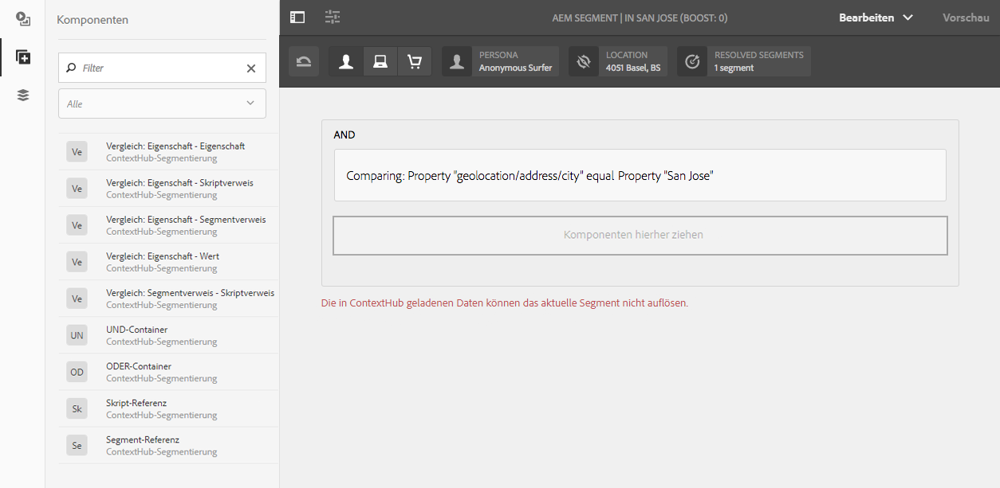
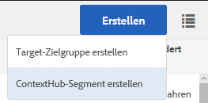

# Konfigurieren der Segmentierung mit ContextHub{#configuring-segmentation-with-contexthub}

>[!NOTE]
>
>Dieser Abschnitt beschreibt das Konfigurieren der Segmentierung unter Verwendung von ContextHub. Wenn Sie die ClientContext-Funktion verwenden, rufen Sie die entsprechende Dokumentation zum [Konfigurieren der Segmentierung für ClientContext](/help/sites-administering/campaign-segmentation.md) auf.


Die Segmentierung ist bei der Erstellung einer Kampagne eine grundlegende Überlegung. Unter [Verwalten von Zielgruppen](/help/sites-authoring/managing-audiences.md) finden Sie Informationen zur Funktionsweise der Segmentierung sowie zu Schlüsselbegriffen.

Je nach den von Ihnen bereits zu den Besuchern Ihrer Site erfassten Informationen sowie je nach Ihren angepeilten Zielen müssen Sie die erforderlichen Segmente und Strategien für Ihre zielgerichteten Inhalte festlegen.

Diese Segmente werden dann verwendet, um einem Besucher gezielt bestimmte Inhalte bereitzustellen. Dieser Inhalt wird im Abschnitt [Personalisierung](/help/sites-authoring/personalization.md) der Website verwaltet. Hier festgelegte [Aktivitäten](/help/sites-authoring/activitylib.md) können auf jeder Seite einbezogen werden – und sie können bestimmen, auf welches Besuchersegment die spezialisierten Inhalte angewendet werden sollen.

AEM ermöglicht Ihnen die einfache Personalisierung Ihres Benutzererlebnisses. Außerdem können Sie damit die Ergebnisse Ihrer Segmentdefinitionen überprüfen.

## Zugriff auf Segmente {#accessing-segments}

Die [Zielgruppen-Konsole](/help/sites-authoring/managing-audiences.md) wird verwendet, um Segmente für ContextHub oder ClientContext sowie Zielgruppen für Ihr Adobe Target-Konto zu verwalten. Diese Dokumentation befasst sich mit der Verwaltung von Segmenten für ContextHub. Weitere Informationen zu [ClientContext-Segmenten](/help/sites-administering/campaign-segmentation.md) und Adobe Target-Segmenten finden Sie in der entsprechenden Dokumentation.

Zum Zugriff auf Ihre Segmente wählen Sie in der globalen Navigation die Optionen **Navigation > Personalisierung > Zielgruppen** aus.


## Segment-Editor {#segment-editor}

The **Segment Editor** allows you to easily modify a segment. Wählen Sie zur Bearbeitung eines Segments ein Segment aus der [Liste von Segmenten](/help/sites-administering/segmentation.md#accessing-segments) aus und klicken Sie auf die Schaltfläche **Bearbeiten**.



Using the components browser you can add **AND** and **OR** containers to define the segment logic, then add additional components to compare properties and values or reference scripts and other segments to define the selection criteria (see [Creating a New Segment](#creating-a-new-segment)) to define the exact scenario for selecting the segment.

Wenn die gesamte Anweisung mit „true“ bewertet wurde, wird das Segment aufgelöst. Falls mehrere Segmente zutreffen, wird außerdem der Faktor **Verstärken** verwendet. See [Creating a New Segment](#creating-a-new-segment) for details on the [boost factor.](/help/sites-administering/campaign-segmentation.md#boost-factor)

>[!CAUTION]
>
>Der Segment-Editor prüft nicht auf Zirkelbezüge. Ein Beispiel hierfür wäre, wenn Segment A auf ein anderes Segment B verweist, das wiederum auf Segment A verweist. Sie müssen sicherstellen, dass Ihre Segmente keine Zirkelbezüge enthalten.

### Container {#containers}

Die folgenden Container sind standardmäßig verfügbar und ermöglichen Ihnen die Gruppierung von Vergleichen und Verweisen zum Zweck einer booleschen Bewertung. Sie können vom Komponentenbrowser in den Editor gezogen werden. See the following section [Using AND and OR Containers](/help/sites-administering/segmentation.md#using-and-and-or-containers) for more information.

<table> 
 <tbody> 
  <tr> 
   <td>UND-Container<br /> </td> 
   <td>Der boolesche AND-Operator<br /> </td> 
  </tr> 
  <tr> 
   <td>ODER-Container<br /> </td> 
   <td>Der boolesche OR-Operator</td> 
  </tr> 
 </tbody> 
</table>

### Vergleiche {#comparisons}

Die folgenden Segmentvergleiche sind standardmäßig für die Bewertung der Segmenteigenschaften verfügbar. Sie können vom Komponentenbrowser in den Editor gezogen werden.

<table> 
 <tbody> 
  <tr> 
   <td>property-value<br /> </td> 
   <td>Vergleicht eine Eigenschaft eines Stores mit einem definierten Wert<br /> </td> 
  </tr> 
  <tr> 
   <td>property-property</td> 
   <td>Vergleicht eine Eigenschaft eines Stores mit einer anderen Eigenschaft<br /> </td> 
  </tr> 
  <tr> 
   <td>Eigenschafts-Segment-Referenz</td> 
   <td>Vergleicht eine Eigenschaft eines Stores mit einem anderen referenzierten Segment<br /> </td> 
  </tr> 
  <tr> 
   <td>PropertyScript-Referenz</td> 
   <td>Vergleicht eine Eigenschaft eines Stores mit den Ergebnissen eines Skripts<br /> </td> 
  </tr> 
  <tr> 
   <td>Segment-Referenz - Skript-Referenz</td> 
   <td>Vergleicht ein referenziertes Segment mit den Ergebnissen eines Skripts<br /> </td> 
  </tr> 
 </tbody> 
</table>

>[!NOTE]
>
>Wenn beim Vergleich von Werten der Datentyp des Vergleichs nicht festgelegt ist (d. h. automatisch erkannt wird), vergleicht die ContextHub-Segmentierungsengine die Werte einfach wie JavaScript. Sie verteilt keine Werte an die erwarteten Typen, was zu irreführenden Ergebnissen führen kann. Beispiel:
>
>`null < 30 // will return true`
>
>Therefore when [creating a segment](/help/sites-administering/segmentation.md#creating-a-new-segment), you should select a **data type** whenever the types of compared values are known. Beispiel:
>
>When comparing the property `profile/age`, you already know that the compared type will be **number**, so even if `profile/age` is not set, a comparison `profile/age` less-than 30 will return **false**, as you would expect.

### Verweise {#references}

Die folgenden Verweise sind standardmäßig für die direkte Verknüpfung eines Skripts oder eines anderen Segments verfügbar. Sie können vom Komponentenbrowser in den Editor gezogen werden.

<table> 
 <tbody> 
  <tr> 
   <td>Segment-Verweis<br /> </td> 
   <td>Bewerten Sie das referenzierte Segment</td> 
  </tr> 
  <tr> 
   <td>Skript-Referenz</td> 
   <td>Bewerten Sie das referenzierte Skript. Weitere Informationen finden Sie im folgenden Abschnitt <a href="/help/sites-administering/segmentation.md#using-script-references">Verwenden von Skriptverweisen</a> .</td> 
  </tr> 
 </tbody> 
</table>

## Erstellen eines neuen Segments {#creating-a-new-segment}

So legen Sie Ihr neues Segment fest:

1. Klicken oder tippen Sie nach dem [Zugriff auf die Segmente](/help/sites-administering/segmentation.md#accessing-segments) auf die Schaltfläche „Erstellen“ und wählen Sie **ContextHub-Segment erstellen** aus.

   

1. Geben Sie unter **Neues ContextHub-Segment** einen Titel für das Segment sowie bei Bedarf einen Verstärkungswert ein und tippen oder klicken Sie auf **Erstellen**.

   

   Jedes Segment verfügt über einen Boost-Parameter, der als Gewichtungsfaktor verwendet wird. Eine höhere Zahl zeigt an, dass das Segment in Instanzen mit mehreren gültigen Segmenten bei der Auswahl gegenüber einem Segment mit einer niedrigeren Zahl bevorzugt wird.

   * Mindestwert: `0`
   * Höchstwert: `1000000`

1. Ziehen Sie einen Vergleich oder Verweis in den Segment-Editor. Der Vergleich oder Verweis wird dann im standardmäßigen UND-Container angezeigt.
1. Doppelklicken oder tippen Sie auf die Konfigurationsoption des neuen Verweises oder Segments, um die spezifischen Parameter zu bearbeiten. In diesem Beispiel prüfen wir auf Personen in San José.

   

   Legen Sie möglichst immer einen **Datentyp** fest, um die ordnungsgemäße Bewertung Ihrer Vergleiche sicherzustellen. Weitere Informationen finden Sie unter [Vergleiche](/help/sites-administering/segmentation.md#comparisons).

1. Klicken Sie auf **OK**, um Ihre Definition zu speichern:
1. Fügen Sie bei Bedarf weitere Komponenten hinzu. Sie können boolesche Ausdrücke anhand der Containerkomponenten für UND- und ODER-Vergleiche formulieren (siehe [Verwenden von UND- und ODER-Containern](/help/sites-administering/segmentation.md#using-and-and-or-containers) weiter unten). Mit dem Segment-Editor können Sie nicht mehr benötigte Komponenten löschen oder diese an neue Positionen innerhalb der Anweisung ziehen.

### Verwenden von UND- und ODER-Containern {#using-and-and-or-containers}

Mithilfe von UND- und ODER-Containerkomponenten können Sie komplexe Segmente in AEM erstellen. Hierbei ist es hilfreich, sich einige grundlegende Punkte bewusst zu machen:

* Die oberste Ebene der Definition ist immer der UND-Container, der ursprünglich erstellt wurde. Dies kann nicht geändert werden, hat aber keine Auswirkungen auf den Rest Ihrer Segmentdefinition.
* Stellen Sie sicher, dass die Verschachtelung Ihrer Container Sinn ergibt. Die Container können als die Klammern Ihres booleschen Ausdrucks betrachtet werden.

Das folgende Beispiel wird zur Auswahl von Besuchern verwendet, die zu unserer wichtigsten Alterszielgruppe gehören:

Männlich und zwischen 30 und 59

ODER

Weiblich und zwischen 30 und 59

Beginnen Sie damit, eine ODER-Containerkomponente innerhalb des standardmäßigen UND-Containers zu platzieren. Innerhalb des ODER-Containers fügen Sie zwei UND-Container hinzu und in beiden können Sie die Eigenschaft oder die Referenz-Komponenten hinzufügen.


### Verwenden von Skript-Referenzen {#using-script-references}

Durch die Verwendung der Skript-Referenzkomponente kann die Bewertung einer Segmenteigenschaft an ein externes Skript delegiert werden. Sobald das Skript ordnungsgemäß konfiguriert ist, kann es als eine beliebige andere Komponente einer Segmentbedingung verwendet werden.

#### Definieren eines Skripts für einen Verweis {#defining-a-script-to-reference}

1. Add file to `contexthub.segment-engine.scripts` clientlib.
1. Implementieren Sie eine Funktion, durch die ein Wert ausgegeben wird. Beispiel:

   ```
   ContextHub.console.log(ContextHub.Shared.timestamp(), '[loading] contexthub.segment-engine.scripts - script.profile-info.js');
   
   (function() {
       'use strict';
   
       /**
        * Sample script returning profile information. Returns user info if data is available, false otherwise.
        *
        * @returns {Boolean}
        */
       var getProfileInfo = function() {
           /* let the SegmentEngine know when script should be re-run */
           this.dependOn(ContextHub.SegmentEngine.Property('profile/age'));
           this.dependOn(ContextHub.SegmentEngine.Property('profile/givenName'));
   
           /* variables */
           var name = ContextHub.get('profile/givenName');
           var age = ContextHub.get('profile/age');
   
           return name === 'Joe' && age === 123;
       };
   
       /* register function */
       ContextHub.SegmentEngine.ScriptManager.register('getProfileInfo', getProfileInfo);
   
   })();
   ```

1. Register the script with `ContextHub.SegmentEngine.ScriptManager.register`.

Wenn das Skript von zusätzlichen Eigenschaften abhängig ist, sollte dieses `this.dependOn()` () abrufen. For example if the script depends on `profile/age`:

```
this.dependOn(ContextHub.SegmentEngine.Property('profile/age'));
```

#### Verweisen auf ein Skript {#referencing-a-script}

1. Erstellen Sie ein ContextHub-Segment.
1. Fügen Sie eine **Skript-Referenz**-Komponente an der gewünschten Stelle des Segments hinzu.
1. Öffnen Sie das Dialogfeld der **Skript-Referenz**-Komponente. Ist das Skript [ordnungsgemäß konfiguriert](/help/sites-administering/segmentation.md#defining-a-script-to-reference), sollte es im Dropdown-Menü **Skriptname** verfügbar sein.

## Testen der Anwendung eines Segments {#testing-the-application-of-a-segment}

Sobald das Segment definiert wurde, können die potenziellen Ergebnisse mithilfe von **[ContextHub](/help/sites-authoring/ch-previewing.md)getestet werden.**

1. Vorschau einer Seite
1. Klicken Sie auf das ContextHub-Symbol, damit die ContextHub-Symbolleiste angezeigt wird.
1. Wählen Sie eine Rolle aus, die mit dem von Ihnen erstellten Segment übereinstimmt.
1. Der ContextHub löst die entsprechenden Elemente für die ausgewählte Rolle auf.

Unsere einfache Segmentdefinition zur Identifikation von Benutzern in unserer wichtigsten Alterszielgruppe ist beispielsweise eine einfache Segmentdefinition, die auf dem Alter und Geschlecht des Benutzers basiert. Das Laden einer spezifischen Rolle, die mit diesen Kriterien übereinstimmt, zeigt, ob das Segment erfolgreich aufgelöst wurde:


Oder ob es nicht aufgelöst wurde:


>[!NOTE]
>
>Alle Eigenschaften werden sofort aufgelöst, obwohl die meisten sich nur beim erneuten Laden der Seite ändern.

Solche Tests können auch zu Inhaltsseiten und in Kombination mit gezieltem Inhalt und damit verbundenen **Aktivitäten** und **Erlebnissen** durchgeführt werden.

Wenn Sie mithilfe des obigen Beispiels zum Segment zur wichtigsten Alterszielgruppe eine Aktivität und ein Erlebnis eingerichtet haben, können Sie Ihr Segment ganz einfach mit der Aktivität testen. Weitere Details zur Einrichtung einer Aktivität finden Sie in der entsprechenden [Dokumentation zur Bearbeitung gezielter Inhalte](/help/sites-authoring/content-targeting-touch.md).

1. Im Bearbeitungsmodus einer Seite, auf der Sie gezielte Inhalte eingerichtet haben, können Sie anhand des Pfeilsymbols auf dem Inhalt erkennen, dass es sich um gezielten Inhalt handelt.

   

1. Wechseln Sie in den Vorschaumodus und anschließend mithilfe von ContextHub zu einer Rolle, die nicht mit der für das Erlebnis konfigurierten Segmentierung übereinstimmt.

   

1. Wechseln Sie zu einer Rolle, die nicht mit der für das Erlebnis konfigurierten Segmentierung übereinstimmt, und sehen Sie, wie sich das Erlebnis entsprechend verändert.

   

## Verwenden Ihres Segments {#using-your-segment}

Segmente werden zur Steuerung des tatsächlichen Inhalts verwendet, der spezifischen Zielgruppen angezeigt wird. See [Managing Audiences](/help/sites-authoring/managing-audiences.md) for more information about audiences and segments and [Authoring Targeted Content](/help/sites-authoring/content-targeting-touch.md) about using audiences and segments to target content.
