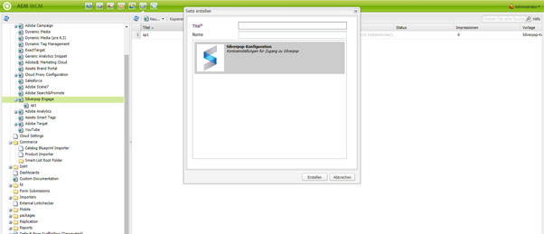
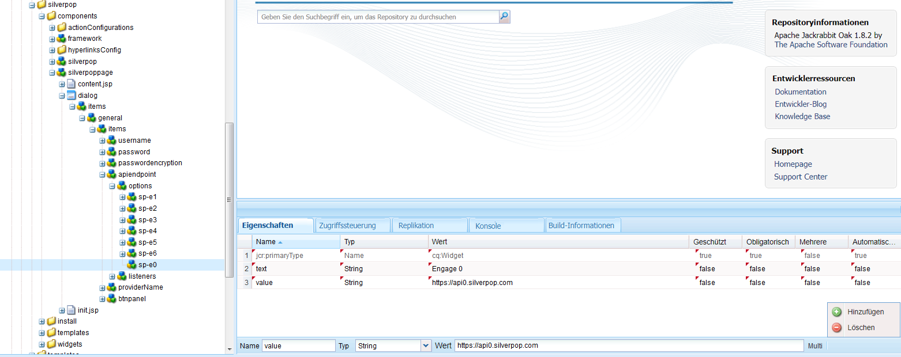
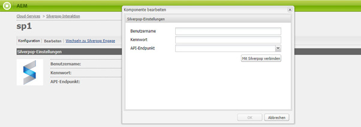

# Integrieren mit Silverpop Engage{#integrating-with-silverpop-engage}

>[!CAUTION]
>
>AEM 6.4 hat das Ende der erweiterten Unterstützung erreicht und diese Dokumentation wird nicht mehr aktualisiert. Weitere Informationen finden Sie in unserer [technische Unterstützung](https://helpx.adobe.com/de/support/programs/eol-matrix.html). Unterstützte Versionen suchen [here](https://experienceleague.adobe.com/docs/?lang=de).

>[!NOTE]
>
>Die Silverpop-Integration ist **not** sofort verfügbar. Sie müssen die [Silverpop-Integrationspaket](https://www.adobeaemcloud.com/content/marketplace/marketplaceProxy.html?packagePath=/content/companies/public/adobe/packages/aem620/product/cq-mcm-integrations-silverpop-content) von Package Share aus und installieren Sie es auf Ihrer Instanz. Nachdem Sie das Paket installiert haben, können Sie es wie in diesem Dokument beschrieben konfigurieren.

Durch die Integration von AEM mit Silverpop Engage können Sie in AEM erstellte E-Mails per Silverpop verwalten und senden. Darüber hinaus können Sie die Silverpop-Funktionen zur Lead-Verwaltung über AEM Forms auf AEM-Seiten verwenden.

Die Integration bietet die folgenden Funktionen:

* Die Möglichkeit, E-Mails in AEM zu erstellen und zur Verteilung in Silverpop zu veröffentlichen.
* Die Möglichkeit, die Aktion eines AEM Formulars festzulegen, um einen Silverpop-Abonnenten zu erstellen.

Nachdem Silverpop Engage konfiguriert wurde, können Sie Newsletter oder E-Mails über Silverpop Engage veröffentlichen.

## Erstellen einer Silverpop-Konfiguration {#creating-a-silverpop-configuration}

Sie können Silverpop-Konfigurationen über **Cloud-Services**, **Tools** oder **API-Endpunkte** hinzufügen. Alle Methoden werden in diesem Abschnitt beschrieben.

### Konfigurieren von Silverpop über Cloud Services {#configuring-silverpop-via-cloudservices}

So erstellen Sie eine Silverpop-Konfiguration in Cloud Services:

1. Tippen oder klicken Sie in AEM auf **Tools** > **Bereitstellung** > **Cloud-Services**. (Oder gehen Sie direkt zu `https://<hostname>:<port>/etc/cloudservices.html`.)
1. Klicken Sie unter den Drittanbieterdiensten auf **Silverpop Engage** und dann auf **Konfigurieren**. Das Fenster für die Silverpop-Konfiguration wird geöffnet.

   >[!NOTE]
   >
   >Silverpop Engage ist nur dann als Option bei Diensten von Drittanbietern verfügbar, wenn Sie das Paket von Package Share herunterladen.

1. Geben Sie einen Titel und optional einen Namen ein und klicken Sie auf **Erstellen**. Das Konfigurationsfenster mit den **Silverpop-Einstellungen** wird geöffnet.
1. Geben Sie den Benutzernamen und das Kennwort ein und wählen Sie einen API-Endpunkt aus der Dropdown-Liste aus.
1. Klicken **Stellen Sie eine Verbindung zu Silverpop her.** Wenn Sie eine erfolgreiche Verbindung hergestellt haben, wird ein Erfolgsdialogfeld angezeigt. Klicken Sie auf **OK**, um das Fenster zu beenden. Sie können auf Silverpop zugreifen, indem Sie auf **Wechseln zu Silverpop Engage** klicken.
1. Silverpop wurde konfiguriert. Sie können die Konfiguration bearbeiten, indem Sie auf **Bearbeiten** klicken.
1. Darüber hinaus kann das Silverpop Engage-Framework für personalisierte Aktionen konfiguriert werden, indem Titel und Name angegeben werden (optional). Klicken Sie auf Erstellen , um das Framework für die bereits konfigurierte Silverpop-Verbindung erfolgreich zu erstellen.

   Importierte Datenerweiterungsspalten können später über die AEM-Komponente verwendet werden - **Text und Personalisierung**.

### Konfigurieren von Silverpop über Tools {#configuring-silverpop-via-tools}

So erstellen Sie eine Silverpop-Konfiguration in Tools:

1. Tippen oder klicken Sie in AEM auf **Tools** > **Bereitstellung** > **Cloud-Services**. Oder navigieren Sie über `https://<hostname>:<port>/misadmin#/etc` direkt dorthin.
1. Wählen Sie **Tools**, **Cloud Service-Konfigurationen** und dann **Silverpop Engage**.
1. Wählen Sie **Neu**, um das Fenster **Seite erstellen** zu öffnen.

   

1. Geben Sie die **Titel** und optional die **Name** und klicken Sie auf **Erstellen**.
1. Geben Sie die Konfigurationsinformationen ein, wie in Schritt 4 des vorherigen Verfahrens beschrieben. Führen Sie dieses Verfahren aus, um die Konfiguration von Silverpop abzuschließen.

### Hinzufügen mehrerer Konfigurationen {#adding-multiple-configurations}

So fügen Sie mehrere Konfigurationen hinzu:

1. Klicken Sie auf der Begrüßungsseite auf **Cloud Services** und klicken Sie auf **Silverpop Engage**. Klicken Sie auf die Schaltfläche **Konfigurationen anzeigen**, die eingeblendet wird, wenn mindestens eine Silverpop-Konfiguration verfügbar ist. Alle verfügbaren Konfigurationen werden aufgelistet.
1. Klicken Sie auf **+** neben Verfügbare Konfigurationen. Dadurch wird die **Erstellen von Konfigurationen** Fenster. Gehen Sie wie zuvor beschrieben vor, um eine neue Konfiguration zu erstellen.

### Konfigurieren von API-Endpunkten für die Verbindung mit Silverpop {#configuring-api-end-points-for-connecting-to-silverpop}

Derzeit hat AEM sechs ungesicherte Endpunkte (Engage 1 bis 6). Silverpop bietet nun zwei neue Endpunkte sowie geänderte Verbindungsendpunkte für die vorhandenen Endpunkte.

Gehen Sie wie folgt vor, um die API-Endpunkte zu konfigurieren :

1. Navigieren Sie zu `/libs/mcm/silverpop/components/silverpoppage/dialog/items/general/items/apiendpoint/options node` auf `https://<hostname>:<port>/crxde.`
1. Klicken Sie mit der rechten Maustaste und wählen Sie **Erstellen** und dann **Knoten erstellen**.
1. Geben Sie unter **Name** den Namen `sp-e0` ein und wählen Sie unter **Typ** den Typ `cq:Widget` aus.
1. Fügen Sie dem neu hinzugefügten Knoten zwei Eigenschaften hinzu:

   1. **Name**: `text`, **Typ**: `String`, **Wert**: `Engage 0`
   1. **Name**: `value`, **Typ**: `String`, **Wert**: `https://api0.silverpop.com`

   

   Klicken Sie auf die Schaltfläche „Alle speichern“.

1. Erstellen Sie einen weiteren Knoten, für den Sie unter **Name** den Namen `sp-e7` und unter **Typ** den Typ `cq:Widget` angeben.

   Fügen Sie dem neu hinzugefügten Knoten zwei Eigenschaften hinzu:

   1. **Name**: `text`, **Typ**: `String`, **Wert**: `Pilot`
   1. **Name**: `value`, **Typ**: `String`, **Wert**: `https://apipilot.silverpop.com/XMLAPI`

1. Um die vorhandenen API-Endpunkte (Engage 1 bis 6) zu ändern, klicken Sie jeweils darauf und ersetzen Sie die Werte wie folgt:

   | **Knotenname** | **Vorhandener Endpunktwert** | **Neuer Endpunktwert** |
   |---|---|---|
   | sp-e1 | https://api.engage1.silverpop.com/XMLAPI | https://api1.silverpop.com |
   | sp-e2 | https://api.engage2.silverpop.com/XMLAPI | https://api2.silverpop.com |
   | sp-e3 | https://api.engage3.silverpop.com/XMLAPI | https://api3.silverpop.com |
   | sp-e4 | https://api.engage4.silverpop.com/XMLAPI | https://api4.silverpop.com |
   | sp-e5 | https://api.engage5.silverpop.com/XMLAPI | https://api5.silverpop.com |
   | sp-e6 | https://api.pilot.silverpop.com/XMLAPI | https://api6.silverpop.com |

1. Klicken Sie auf **Alle speichern**. AEM ist nun bereit, über gesicherte Endpunkte eine Verbindung mit Silverpop herzustellen.

   
