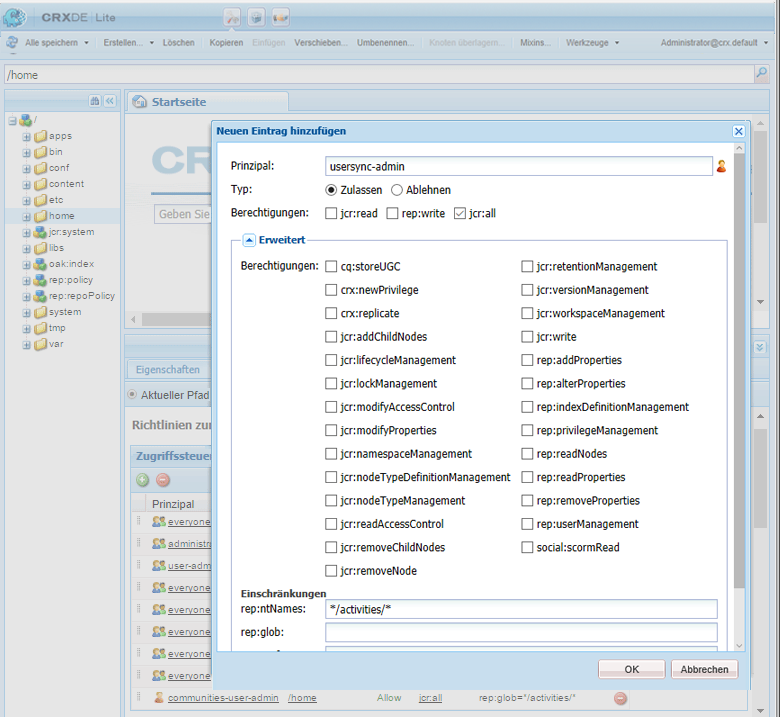
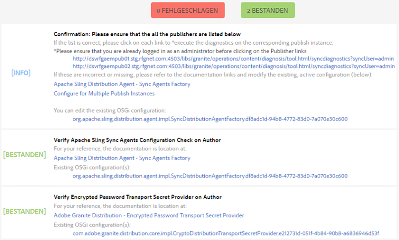
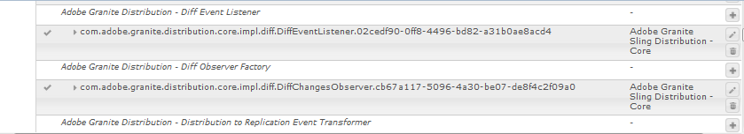

# Benutzersynchronisierung{#user-synchronization}

>[!CAUTION]
>
>AEM 6.4 hat das Ende der erweiterten Unterstützung erreicht und diese Dokumentation wird nicht mehr aktualisiert. Weitere Informationen finden Sie in unserer [technische Unterstützung](https://helpx.adobe.com/de/support/programs/eol-matrix.html). Unterstützte Versionen suchen [here](https://experienceleague.adobe.com/docs/?lang=de).

## Einführung {#introduction}

Wenn es sich bei der Bereitstellung um eine [Veröffentlichungsfarm](/help/sites-deploying/recommended-deploys.md#tarmk-farm) handelt, müssen Mitglieder sich anmelden und ihre Daten auf allen Veröffentlichungsknoten einsehen können.

In der Veröffentlichungsumgebung erstellte Benutzer und Benutzergruppen (Benutzerdaten) werden in der Autorenumgebung nicht benötigt.

Die meisten in der Autorenumgebung erstellten Benutzerdaten sollen in der Autorenumgebung verbleiben und nicht in die Veröffentlichungsinstanzen kopiert werden.

Registrierungen und Änderungen, die an einer Veröffentlichungsinstanz vorgenommen werden, müssen mit anderen Veröffentlichungsinstanzen synchronisiert werden, damit sie Zugriff auf dieselben Benutzerdaten haben.

Ab AEM 6.1 werden Benutzerdaten bei aktivierter Benutzersynchronisierung automatisch über alle Veröffentlichungsinstanzen in der Farm hinweg synchronisiert und nicht in Autoreninstanzen erstellt.

## Sling Distribution {#sling-distribution}

Die Benutzerdaten werden zusammen mit den zugehörigen [Zugriffssteuerungslisten](/help/sites-administering/security.md) (Access Control Lists, ACLs) im [Oak-Core](/help/sites-deploying/platform.md), der Ebene unter Oak JCR, gespeichert und über die [Oak-API](https://helpx.adobe.com/experience-manager/6-4/sites/developing/using/reference-materials/javadoc/org/apache/jackrabbit/oak/api/package-tree.html) aufgerufen. Im Falle unregelmäßiger Updates ist es sinnvoll, Benutzerdaten mit anderen Veröffentlichungsinstanzen per [Sling Content Distribution](https://github.com/apache/sling/blob/trunk/contrib/extensions/distribution/README.md) (Sling Distribution) zu synchronisieren.

Eine Benutzersynchronisierung mit Sling Distribution weist im Vergleich zur herkömmlichen Replikation folgende Vorteile auf :

* *Benutzer*, *Benutzerprofile* und *Benutzergruppen* werden nicht in der Veröffentlichungsinstanz erstellt

* Die Sling-Distribution legt Eigenschaften in JCR-Ereignissen fest, sodass es möglich ist, innerhalb von Publish-seitigen Ereignis-Listenern zu agieren, ohne unendliche Replikationsschleifen zu berücksichtigen
* Die Sling-Verteilung sendet nur Benutzerdaten an nicht ursprüngliche Veröffentlichungsinstanzen, wodurch unnötiger Traffic vermieden wird
* [ACLs](/help/sites-administering/security.md) werden im Benutzerknoten festgelegt und sind in der Synchronisierung enthalten

>[!NOTE]
>
>Wenn Sitzungen erforderlich sind, wird empfohlen, entweder eine SSO-Lösung zu verwenden oder eine fixierbare Sitzung zu verwenden und Kunden dazu zu veranlassen, sich anzumelden, wenn sie zu einem anderen Herausgeber wechseln.

>[!CAUTION]
>
>Synchronisierung der ***Administratoren** *Gruppe wird nicht unterstützt, auch wenn die Benutzersynchronisierung aktiviert ist. Stattdessen wird ein Fehler beim Diff-Import in das Fehlerprotokoll geschrieben.
>
>Wenn es sich bei der Bereitstellung um eine Veröffentlichungsfarm handelt, wird ein Benutzer daher zum * hinzugefügt oder daraus entfernt.**Administratoren** *Gruppe, muss die Änderung manuell für jede Veröffentlichungsinstanz vorgenommen werden.

## Aktivieren der Benutzersynchronisierung {#enable-user-sync}

>[!NOTE]
>
>Standardmäßig ist für die Benutzersynchronisierung `disabled` festgelegt.
>
>Die Aktivierung der Benutzersynchronisierung umfasst das Ändern von *vorhandene* OSGi-Konfigurationen.
>
>Aufgrund der Aktivierung der Benutzersynchronisierung sollten keine neuen Konfigurationen hinzugefügt werden.

Die Benutzersynchronisierung beruht bei der Verwaltung der Benutzerdatenverteilung auf der Autorenumgebung, auch wenn die Benutzerdaten nicht auf der Autoreninstanz erstellt werden. Ein wesentlicher Teil, aber nicht die vollständige Konfiguration findet in der Autorenumgebung statt. Dabei ist für jeden Schritt klar festgelegt, ob er in der Autoren- oder Veröffentlichungsinstanz durchgeführt werden muss.

Im Folgenden finden Sie eine Beschreibung der Schritte, die zum Aktivieren der Benutzersynchronisierung erforderlich sind, gefolgt von einem Abschnitt zur [Fehlerbehebung](#troubleshooting):

### Voraussetzungen {#prerequisites}

1. Wenn Benutzer und Benutzergruppen bereits auf einem Herausgeber erstellt wurden, wird empfohlen, die Benutzerdaten vor der Konfiguration und Aktivierung der Benutzersynchronisierung [manuell zu synchronisieren](#manually-syncing-users-and-user-groups).

   Sobald die Benutzersynchronisierung aktiviert wurde, werden nur neu erstellte Benutzer und Gruppen synchronisiert.

1. Vergewissern Sie sich, dass der neueste Code installiert wurde:

* [AEM-Plattform-Updates](https://helpx.adobe.com/de/experience-manager/kb/aem62-available-hotfixes.html)
* [AEM Communities-Updates](/help/communities/deploy-communities.md#latest-releases)

### 1. Apache Sling Distribution Agent – Sync Agents Factory {#apache-sling-distribution-agent-sync-agents-factory}

**Benutzersynchronisierung aktivieren**

* **in der Autoreninstanz**

   * Anmelden mit Administratorberechtigungen
   * auf die [Web-Konsole](/help/sites-deploying/configuring-osgi.md)

      * Beispiel: [http://localhost:4502/system/console/configMgr](http://localhost:4502/system/console/configMgr)
   * Suchen Sie `Apache Sling Distribution Agent - Sync Agents Factory`.

      * Wählen Sie die vorhandene Konfiguration aus, um sie zur Bearbeitung zu öffnen (Bleistiftsymbol).

         Überprüfen Sie `name`: **`socialpubsync`**

      * Aktivieren Sie das Kontrollkästchen `Enabled`.
      * Wählen Sie `Save` aus.


### 2. Erstellen autorisierter Benutzer {#createauthuser}

**Konfigurieren von Berechtigungen**
Dieser autorisierte Benutzer wird in Schritt 3 zum Konfigurieren einer Sling Distribution in Autoreninstanzen verwendet.

* **in jeder Veröffentlichungsinstanz**

   * Anmelden mit Administratorberechtigungen
   * auf die [Sicherheitskonsole](/help/sites-administering/security.md)

      * Beispiel: [http://localhost:4503/useradmin](http://localhost:4503/useradmin)
   * Erstellen Sie einen neuen Benutzer.

      * Beispiel: `usersync-admin`
   * Fügen Sie diesen Benutzer der Benutzergruppe **`administrators`** hinzu.
   * [Fügen Sie für diesen Benutzer eine ACL unter /home hinzu.](#addacls)

      * `Allow jcr:all` mit der Einschränkung `rep:glob=*/activities/*`


>[!CAUTION]
>
>Es muss ein neuer Benutzer erstellt werden.
>
>* Als Standardbenutzer wird **`admin`** zugewiesen.
>* Verwenden Sie `*communities-user-admin *user*.*` nicht.
>


#### Hinzufügen von ACL {#addacls}

* CRXDE Lite des Zugriffs

   * Beispiel: [http://localhost:4503/crx/de](http://localhost:4503/crx/de)

* Wählen Sie den Knoten `/home` aus.
* Wählen Sie im rechten Bereich die Registerkarte `Access Control` aus.
* Fügen Sie mit der Schaltfläche `+` einen ACL-Eintrag hinzu.

   * **Prinzipal**: *nach dem für die Benutzersynchronisierung erstellten Benutzer suchen*
   * **Typ**: `Allow`
   * **Berechtigungen**: `jcr:all`
   * **Einschränkungen**: rep:glob: `*/activities/*`
   * select **OK**

* select **Alle speichern**



Siehe auch

* [Verwalten von Zugriffsrechten](/help/sites-administering/user-group-ac-admin.md#access-right-management)
* Fehlerbehebungsabschnitt [Ausnahme bei Änderungsvorgang während Antwortverarbeitung](#modify-operation-exception-during-response-processing).

### 3. Adobe Granite Distribution - Encrypted Password Transport Secret Provider {#adobegraniteencpasswrd}

**Berechtigungen konfigurieren**

Wenn ein autorisierter Benutzer, ein Mitglied der Benutzergruppe **`administrators`**, in allen Veröffentlichungsinstanzen erstellt wurde, muss dieser autorisierte Benutzer in der Autoreninstanz als ein Benutzer identifiziert werden, der zum Synchronisieren von Benutzerdaten zwischen Autoren- und Veröffentlichungsinstanzen berechtigt ist.

* **in der Autoreninstanz**

   * Anmelden mit Administratorberechtigungen
   * auf die [Web-Konsole](/help/sites-deploying/configuring-osgi.md)

      * Beispiel: [http://localhost:4502/system/console/configMgr](http://localhost:4502/system/console/configMgr)
   * Suchen Sie `com.adobe.granite.distribution.core.impl.CryptoDistributionTransportSecretProvider.name`.
   * Wählen Sie die vorhandene Konfiguration aus, um sie zur Bearbeitung zu öffnen (Bleistiftsymbol).

      Überprüfen Sie `property name` : **`socialpubsync-publishUser`**

   * Legen Sie den Benutzernamen und das Kennwort für den in der Veröffentlichungsinstanz in Schritt 2 erstellten [autorisierten Benutzer](#createauthuser) fest.

      * Beispiel: `usersync-admin`


### 4. Apache Sling Distribution Agent - Queue Agents Factory {#apache-sling-distribution-agent-queue-agents-factory}

**Benutzersynchronisierung aktivieren**

* **In der Veröffentlichungsinstanz** :

   * Anmelden mit Administratorberechtigungen
   * auf die [Web-Konsole](/help/sites-deploying/configuring-osgi.md)

      * Beispiel: [http://localhost:4503/system/console/configMgr](http://localhost:4503/system/console/configMgr)
   * Suchen Sie `Apache Sling Distribution Agent - Queue Agents Factory`.

      * Wählen Sie die vorhandene Konfiguration aus, um sie zur Bearbeitung zu öffnen (Bleistiftsymbol).

         Überprüfen Sie `Name` : `socialpubsync-reverse`

      * Aktivieren Sie das Kontrollkästchen `Enabled`.
      * Wählen Sie `Save` aus.
   * **wiederholen** Sie den Vorgang für jede Veröffentlichungsinstanz


### 5. Adobe Granite Distribution - Diff Observer Factory {#diffobserver}

**Aktivieren der Gruppensynchronisierung**

* **in jeder Veröffentlichungsinstanz** :

   * Anmelden mit Administratorberechtigungen
   * auf die [Web-Konsole](/help/sites-deploying/configuring-osgi.md)

      * Beispiel: [http://localhost:4503/system/console/configMgr](http://localhost:4503/system/console/configMgr)
   * Suchen Sie `Adobe Granite Distribution - Diff Observer Factory`.

      * Wählen Sie die vorhandene Konfiguration aus, um sie zur Bearbeitung zu öffnen (Bleistiftsymbol).

         Überprüfen Sie `agent name` : `socialpubsync-reverse`

      * Aktivieren Sie das Kontrollkästchen `Enabled`.
      * Wählen Sie `Save` aus.


### 6. Apache Sling Distribution Trigger - Scheduled Trigger Factory {#apache-sling-distribution-trigger-scheduled-triggers-factory}

**(Optional) Ändern des Abrufintervalls**

Standardmäßig fragt der Autor alle 30 Sekunden nach Änderungen ab. So ändern Sie dieses Intervall :

* **in der Autoreninstanz**

   * Anmelden mit Administratorberechtigungen
   * auf die [Web-Konsole](/help/sites-deploying/configuring-osgi.md)

      * Beispiel: [http://localhost:4502/system/console/configMgr](http://localhost:4502/system/console/configMgr)
   * Suchen Sie `Apache Sling Distribution Trigger - Scheduled Triggers Factory`.

      * Wählen Sie die vorhandene Konfiguration aus, um sie zur Bearbeitung zu öffnen (Bleistiftsymbol).

         * Überprüfen Sie `Name` : `socialpubsync-scheduled-trigger`
      * Stellen Sie `Interval in Seconds` auf das gewünschte Intervall ein.
      * Wählen Sie `Save` aus.


## Konfigurieren für mehrere Veröffentlichungsinstanzen {#configure-for-multiple-publish-instances}

Die Standardkonfiguration gilt für eine einzelne Veröffentlichungsinstanz. Da durch die Benutzersynchronisierung mehrere Veröffentlichungsinstanzen, etwa für eine Veröffentlichungsfarm, synchronisiert werden sollen, müssen die zusätzlichen Veröffentlichungsinstanzen der Sync Agents Factory hinzugefügt werden.

### 7. Apache Sling Distribution Agent – Sync Agents Factory {#apache-sling-distribution-agent-sync-agents-factory-1}

**Hinzufügen von Veröffentlichungsinstanzen :**

* **in der Autoreninstanz**

   * Anmelden mit Administratorberechtigungen
   * auf die [Web-Konsole](/help/sites-deploying/configuring-osgi.md)

      * Beispiel: [http://localhost:4502/system/console/configMgr](http://localhost:4502/system/console/configMgr)
   * Suchen Sie `Apache Sling Distribution Agent - Sync Agents Factory`.

      * Wählen Sie die vorhandene Konfiguration aus, um sie zur Bearbeitung zu öffnen (Bleistiftsymbol).

         Überprüfen Sie `Name` : `socialpubsync`


* **Exporter Endpoints**
Es sollte für jeden Herausgeber einen Exporter-Endpunkt geben. Beispielsweise sollten bei 2 Herausgebern, localhost:4503 und 4504, 2 Einträge vorhanden sein:

   * http://localhost:4503/libs/sling/distribution/services/exporters/socialpubsync-reverse
   * http://localhost:4504/libs/sling/distribution/services/exporters/socialpubsync-reverse

* **Importer Endpoints**
Es sollte für jeden Herausgeber einen Importer-Endpunkt geben. Beispielsweise sollten bei 2 Herausgebern, localhost:4503 und 4504, 2 Einträge vorhanden sein:

   * http://localhost:4503/libs/sling/distribution/services/importers/socialpubsync
   * http://localhost:4504/libs/sling/distribution/services/importers/socialpubsync

* Wählen Sie `Save` aus.

### 8. AEM Communities-Listener für die Benutzersynchronisierung {#aem-communities-user-sync-listener}

**(Optional) Synchronisieren zusätzlicher JCR-Knoten**

Wenn benutzerdefinierte Daten vorliegen, die über mehrere Veröffentlichungsinstanzen hinweg synchronisiert werden sollen, gehen Sie wie folgt vor:

* **In jeder Veröffentlichungsinstanz**:

   * Anmelden mit Administratorberechtigungen
   * auf die [Web-Konsole](/help/sites-deploying/configuring-osgi.md)

      * Beispiel: [http://localhost:4503/system/console/configMgr](http://localhost:4503/system/console/configMgr)
   * Suchen Sie `AEM Communities User Sync Listener`.
   * Wählen Sie die vorhandene Konfiguration aus, um sie zur Bearbeitung zu öffnen (Bleistiftsymbol).

      Überprüfen Sie `Name`: `socialpubsync-scheduled-trigger`


* **Knotentypen**

   Hierbei handelt es sich um die Liste der Knotentypen, die synchronisiert werden. Mit Ausnahme von „sling:Folder“ müssen hier alle Knotentypen aufgeführt werden („sling:Folder“ wird separat abgewickelt).

   Standardliste zu synchronisierender Knotentypen:

   * rep:User
   * nt:unstructured
   * nt:resource

* **Ignorierende Eigenschaften**

   Hierbei handelt es sich um die Liste der Eigenschaften, die beim Erkennen von Änderungen ignoriert werden. Änderungen an diesen Eigenschaften werden möglicherweise im Zuge anderer Änderungen synchronisiert (da die Synchronisierung immer auf Knotenebene erfolgt), aber Änderungen an diesen Eigenschaften werden nicht von selbst durch eine Synchronisierung ausgelöst.

   Zu ignorierende Standardeigenschaft:

   * cq:lastModified

* **Ignorierbare Knoten**

   Unterpfade, die bei der Synchronisierung vollständig ignoriert werden. Elemente in diesen Unterpfaden werden nie synchronisiert.

   Zu ignorierende Standardknoten:

   * .Token zu widerrufen
   * system

* **Verteilte Ordner**

   Die meisten Sling:Folders werden ignoriert, weil eine Synchronisierung nicht erforderlich ist. Die wenigen Ausnahmen finden Sie hier aufgeführt.

   Zu synchronisierende Standardordner

   * Segmente/Scoring
   * social/relations
   * activities

### 9. Eindeutige Sling-ID {#unique-sling-id}

>[!CAUTION]
>
>Wenn die Sling-ID zwischen zwei oder mehr Veröffentlichungsinstanzen übereinstimmt, schlägt die Benutzergruppensynchronisierung fehl.

Wenn die Sling-ID für mehrere Veröffentlichungsinstanzen in einer Veröffentlichungsfarm identisch ist, werden Benutzergruppen nicht synchronisiert.

Um zu überprüfen, ob alle Sling-ID-Werte unterschiedlich sind, gehen Sie in jeder Veröffentlichungsinstanz wie folgt vor :

1. Navigieren Sie zu `http://<host>:<port>/system/console/status-slingsettings`.
1. Überprüfen Sie den Wert unter **Sling ID**.


Wenn die Sling-ID einer Veröffentlichungsinstanz der Sling-ID einer anderen Veröffentlichungsinstanz entspricht, gehen Sie wie folgt vor:

1. Beenden Sie eine der Veröffentlichungsinstanzen mit der entsprechenden Sling-ID.
1. im Verzeichnis crx-quickstart/launchpad/felix

   * Suchen und löschen Sie die Datei mit dem Namen *sling.id.file*

      * Beispiel für ein Linux-System:

         `rm -i $(find . -type f -name sling.id.file)`

      * Beispiel für ein Windows-System:

         `use windows explorer and search for *sling.id.file*`

1. Starten Sie die Veröffentlichungsinstanz.

   * Beim Start wird ihm eine neue Sling-ID zugewiesen.

1. überprüfen, ob die **Sling ID** ist jetzt eindeutig

Wiederholen Sie diese Schritte, bis alle Veröffentlichungsinstanzen über eine eindeutige Sling-ID verfügen.

## Vault Package Builder Factory {#vault-package-builder-factory}

Damit Updates ordnungsgemäß synchronisiert werden, muss der Vault-Paket-Builder zur Benutzersynchronisierung geändert werden :

* auf jeder AEM Veröffentlichungsinstanz
* auf die [Web-Konsole](/help/sites-deploying/configuring-osgi.md)

   * Beispiel: [http://localhost:4503/system/console/configMgr](http://localhost:4503/system/console/configMgr)

* Suchen Sie `Apache Sling Distribution Packaging - Vault Package Builder Factor`.

   * `Builder name: socialpubsync-vlt`

* Wählen Sie das Bearbeitungssymbol aus.
* Fügen Sie zwei `Package Filters` hinzu:

   * `/home/users|-.*/.tokens`
   * `/home/users|-.*/rep:cache`

* Richtlinienhandhabung :

   * Zum Überschreiben der vorhandenen Knoten „rep:policy“ mit neuen fügen Sie einen dritten Paketfilter hinzu :

      * `/home/users|+.*/rep:policy`
   * Um eine Richtlinienverteilung zu verhindern, stellen Sie Folgendes ein:

      * `Acl Handling :` `IGNORE`


## Was passiert, wenn ... {#what-happens-when}

### Benutzer-Self-Registers oder Bearbeitungsprofil bei der Veröffentlichung {#user-self-registers-or-edits-profile-on-publish}

Per Design werden in der Veröffentlichungsumgebung erstellte Benutzer und Profile (Selbstregistrierung) nicht in der Autorenumgebung angezeigt.

Wenn es sich bei der Topologie um eine [Veröffentlichungsfarm](/help/sites-deploying/recommended-deploys.md#tarmk-farm) handelt und die Benutzersynchronisierung korrekt konfiguriert wurde, werden *Benutzer* und *Benutzerprofil* über die Veröffentlichungsfarm hinweg mittels Sling Distribution synchronisiert.

### Benutzer oder Benutzergruppen werden über die Sicherheitskonsole erstellt {#users-or-user-groups-are-created-using-security-console}

Standardmäßig werden in der Veröffentlichungsumgebung erstellte Benutzerdaten nicht in der Autorenumgebung angezeigt und umgekehrt.

Wenn die [Benutzerverwaltung und Sicherheit](/help/sites-administering/security.md) wird verwendet, um neue Benutzer in der Veröffentlichungsumgebung hinzuzufügen. Die Benutzersynchronisierung synchronisiert die neuen Benutzer und deren Gruppenmitgliedschaft ggf. mit anderen Veröffentlichungsinstanzen. Bei der Benutzersynchronisierung werden auch die über die Sicherheitskonsole erstellten Benutzergruppen synchronisiert.

## Fehlerbehebung {#troubleshooting}

### Anleitung zum Offline-Ausführen der Benutzersynchronisierung {#how-to-take-user-sync-offline}

So nutzen Sie die Benutzersynchronisierung offline, um [Herausgeber entfernen](#how-to-remove-a-publisher) oder [Daten manuell synchronisieren](#manually-syncing-users-and-user-groups), muss die Verteilungswarteschlange leer und ruhig sein.

So prüfen Sie den Status der Verteilungswarteschlange:

* In der Autoreninstanz:

   * Rufen Sie [CRXDE Lite](/help/sites-developing/developing-with-crxde-lite.md) auf.

      * Suchen Sie nach Einträgen in den Ordnerknoten `/var/sling/distribution/packages`,

         * die nach dem Muster `distrpackage_*` benannt sind.
   * using [Package Manager](/help/sites-administering/package-manager.md)

      * Suchen Sie nach ausstehenden Paketen (noch nicht installiert).

         * die nach dem Muster `socialpubsync-vlt*` benannt sind,
         * die von `communities-user-admin` erstellt wurden.


Wenn die Verteilungswarteschlange leer ist, deaktivieren Sie die Benutzersynchronisierung :

* In der Autoreninstanz:

   * *Deaktivieren* Sie das Kontrollkästchen `Enabled` für [Apache Sling Distribution Agent – Sync Agents Factory](#apache-sling-distribution-agent-sync-agents-factory).

Um die Benutzersynchronisierung nach Durchführung der Aufgaben erneut zu aktivieren, gehen Sie wie folgt vor :

* In der Autoreninstanz:

   * Aktivieren Sie das Kontrollkästchen `Enabled` für [Apache Sling Distribution Agent – Sync Agents Factory](#apache-sling-distribution-agent-sync-agents-factory).

### Diagnose für Benutzersynchronisierung {#user-sync-diagnostics}

User Sync Diagnostics ist ein Tool, das die Konfiguration überprüft und versucht, Probleme zu identifizieren.

Navigieren Sie einfach in der Autoreninstanz von der Hauptkonsole zu **„Tools“ > „Vorgänge“ > „Diagnose“ > „Diagnose für Benutzersynchronisierung“**.

Die Ergebnisse werden einfach durch Aufrufen der Konsole „Diagnose für Benutzersynchronisierung“ angezeigt.

Folgendes wird angezeigt, wenn die Benutzersynchronisierung nicht aktiviert wurde :


#### Ausführen der Diagnose für Herausgeber {#how-to-run-diagnostics-for-publishers}

Wenn die Diagnose von der Autorenumgebung aus ausgeführt wird, enthalten die Ergebnisse für das Bestehen/Fehlschlagen eine [INFO] -Abschnitt, der die Liste der konfigurierten Veröffentlichungsinstanzen zur Bestätigung anzeigt.

In der Liste enthalten ist eine URL für jede Veröffentlichungsinstanz, die die Diagnose für diese Instanz ausführt. Der URL-Parameter `syncUser` ist an die Diagnose-URL angehängt. Der Wert lautet dabei auf den *autorisierten Sychronisierungsbenutzer*, der in [Schritt 2](/help/sites-administering/sync.md#createauthuser) erstellt wurde.

**Hinweis**: Bevor Sie die URL aufrufen, muss der *autorisierte Synchronisierungsbenutzer* bereits bei dieser Veröffentlichungsinstanz angemeldet sein.



### Fehlerhaft hinzugefügte Konfiguration {#improperconfig}

Wenn die Benutzersynchronisierung nicht funktioniert, besteht das häufigste Problem darin, dass zusätzliche Konfigurationen *hinzugefügt*. Stattdessen sollte die *vorhandene* Standardkonfiguration *bearbeitet* werden.

Im Folgenden sehen Sie, wie die bearbeiteten Standardkonfigurationen in der Web-Konsole angezeigt werden sollten. Bei mehr als der einen Instanz sollte die hinzugefügte Konfiguration entfernt werden.

#### (Autor) Eine Konfiguration „Apache Sling Distribution Agent – Sync Agents Factory“ {#author-one-apache-sling-distribution-agent-sync-agents-factory}


#### (Autor) Eine Adobe Granite Distribution - Encrypted Password Transport Secret Provider {#author-one-adobe-granite-distribution-encrypted-password-transport-secret-provider}


#### (Veröffentlichung) Ein Apache Sling Distribution Agent - Queue Agents Factory {#publish-one-apache-sling-distribution-agent-queue-agents-factory}


#### (Veröffentlichung) Eine Adobe Granite Distribution - Diff Observer Factory {#publish-one-adobe-granite-distribution-diff-observer-factory}



#### (Autor) Ein Apache Sling Distribution Trigger - Scheduled Trigger Factory {#author-one-apache-sling-distribution-trigger-scheduled-triggers-factory}


### Ausnahme bei Änderungsvorgang während der Antwortverarbeitung {#modify-operation-exception-during-response-processing}

Wenn Folgendes im Protokoll steht :

`org.apache.sling.servlets.post.impl.operations.ModifyOperation Exception during response processing.`

`java.lang.IllegalStateException: This tree does not exist`

prüfen Sie, ob Abschnitt [2. Erstellen autorisierter Benutzer](#createauthuser) ordnungsgemäß befolgt wurde.

Dieser Abschnitt beschreibt, wie ein autorisierter Benutzer erstellt wird, der in allen Veröffentlichungsinstanzen vorhanden ist, und wie dieser Benutzer in der OSGi-Konfiguration „Secret Provider“ der Autoreninstanz identifiziert wird. Standardmäßig ist `admin` der Benutzer.

Der autorisierte Benutzer sollte als Mitglied der Benutzergruppe **`administrators`** aufgenommen werden. Außerdem sollten die Berechtigungen für diese Gruppe nicht geändert werden.

Für den autorisierten Benutzer sollten explizit die folgenden Rechte und Einschränkungen für alle Veröffentlichungsinstanzen gelten :

| **Pfad** | **jcr:all** | **rep:glob** |
|---|---|---|
| /home | X | &amp;ast;/activities/&amp;ast; |
| /home/users | X | &amp;ast;/activities/&amp;ast; |
| /home/groups | X | &amp;ast;/activities/&amp;ast; |

Als Mitglied der Gruppe `administrators` sollten für den autorisierten Benutzer die folgenden Rechte für alle Veröffentlichungsinstanzen gelten :

| **Pfad** | **jcr:all** | **jcr:read** | **rep:write** |
|---|---|---|---|
| /etc/packages/sling/distribution |  |  | X |
| /libs/sling/distribution |  | X |  |
| /var |  |  | X |
| /var/eventing |  | X | X |
| /var/sling/distribution |  | X | X |

### Fehlgeschlagene Benutzergruppensynchronisierung {#user-group-sync-failed}

Wenn die Sling-ID zwischen zwei oder mehr Veröffentlichungsinstanzen übereinstimmt, schlägt die Benutzergruppensynchronisierung fehl.

Siehe Abschnitt [9. Eindeutige Sling-ID](#unique-sling-id)

### Manuelles Synchronisieren von Benutzern und Benutzergruppen {#manually-syncing-users-and-user-groups}

* Bei Herausgebern mit Benutzern und Benutzergruppen :

   * [Deaktivieren Sie ggf. die Benutzersynchronisierung.](#how-to-take-user-sync-offline)
   * [Erstellen Sie ein Paket](/help/sites-administering/package-manager.md#creating-a-new-package) von `/home`.

      * Beim Bearbeiten des Pakets

         * Registerkarte „Filter“: „Filter hinzufügen“: > „Stammverzeichnis“: `/home`
         * Registerkarte „Erweitert“ > „AC-Handhabung“: `Overwrite`
   * [Exportieren Sie das Paket.](/help/sites-administering/package-manager.md#downloading-packages-to-your-file-system)


* Bei anderen Veröffentlichungsinstanzen :

   * [Importieren Sie das Paket.](/help/sites-administering/package-manager.md#installing-packages)

Zum Konfigurieren oder Aktivieren der Benutzersynchronisierung gehen Sie zu Schritt 1: [Apache Sling Distribution Agent – Sync Agents Factory](#apache-sling-distribution-agent-sync-agents-factory).

### wann ein Herausgeber nicht verfügbar wird {#when-a-publisher-becomes-unavailable}

Wenn eine Veröffentlichungsinstanz nicht mehr verfügbar ist, sollte sie nicht entfernt werden, sofern sie zukünftig wieder online geschaltet werden soll. Änderungen für den Herausgeber werden in die Warteschlange gestellt und sobald dieser wieder online ist, werden die Änderungen verarbeitet.

Wenn die Veröffentlichungsinstanz nicht wieder online geschaltet wird, also dauerhaft offline ist, muss sie entfernt werden, weil durch das Auffüllen der Warteschlangen der Speicherplatz in der Autorenumgebung spürbar beansprucht wird.

Wenn ein Herausgeber nicht mehr verfügbar ist, finden Sie im Autorprotokoll Ausnahmen wie die folgende :

```
28.01.2016 15:57:48.475 ERROR
 [pool-12-thread-34-org_apache_sling_distribution_queue_socialpubsync_endpoint1
 (org/apache/sling/distribution/queue/socialpubsync/endpoint1)]
 org.apache.sling.distribution.agent.impl.SimpleDistributionAgent [agent][socialpubsync] could not deliver package distrpackage_1454014575838_a2b45ec8-0400-42f3-bed8-ae09b66381cb
 org.apache.sling.distribution.packaging.DistributionPackageImportException: failed in importing package ...
```

### Entfernen von Herausgebern {#how-to-remove-a-publisher}

So entfernen Sie einen Herausgeber aus der [Apache Sling Distribution Agent - Sync Agents Factory](#apache-sling-distribution-agent-sync-agents-factory), muss die Verteilungswarteschlange leer und ruhig sein.

* in der Autoreninstanz :

   * [Schalten Sie die Benutzersynchronisierung offline.](#how-to-take-user-sync-offline)
   * Folgen Sie [Schritt 7](#apache-sling-distribution-agent-sync-agents-factory), um den Herausgeber aus beiden Server-Listen zu entfernen :

      * `Exporter Endpoints`
      * `Importer Endpoints`
   * Erneutes Aktivieren der Benutzersynchronisierung

      * Aktivieren Sie das Kontrollkästchen `Enabled` für [Apache Sling Distribution Agent – Sync Agents Factory](#apache-sling-distribution-agent-sync-agents-factory).
