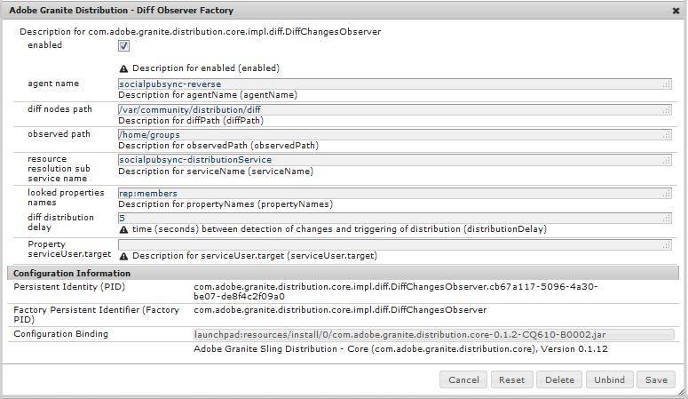

# Benutzersynchronisierung{#user-synchronization}

## Einführung {#introduction}

Wenn es sich bei der Bereitstellung um eine [Veröffentlichungsfarm](/help/sites-deploying/recommended-deploys.md#tarmk-farm) handelt, müssen Mitglieder sich anmelden und ihre Daten auf allen Veröffentlichungsknoten einsehen können.

In der Veröffentlichungsumgebung erstellte Benutzer und Benutzergruppen (Benutzerdaten) werden in der Autorenumgebung nicht benötigt.

Die meisten in der Autorenumgebung erstellten Benutzerdaten sind auf einen Verbleib in der Autorenumgebung ausgelegt und werden nicht in Veröffentlichungsinstanzen kopiert.

Registrierungs- und Änderungsvorgänge in einer Veröffentlichungsinstanz müssen mit anderen Veröffentlichungsinstanzen synchronisiert werden, damit sie Zugriff auf dieselben Benutzerdaten haben.

Ab AEM 6.1 werden Benutzerdaten bei aktivierter Benutzersynchronisierung automatisch über alle Veröffentlichungsinstanzen in der Farm hinweg synchronisiert und nicht in Autoreninstanzen erstellt.

## Sling Distribution {#sling-distribution}

Die Benutzerdaten werden zusammen mit den [ACLs](/help/sites-administering/security.md) im [Oak Core](/help/sites-deploying/platform.md), der Ebene unter Oak JCR, gespeichert und über die [Oak API](https://helpx.adobe.com/experience-manager/6-4/sites/developing/using/reference-materials/javadoc/org/apache/jackrabbit/oak/api/package-tree.html) aufgerufen. Bei seltenen Aktualisierungen ist es sinnvoll, Benutzerdaten mithilfe von [Sling Content Distribution](https://github.com/apache/sling/blob/trunk/contrib/extensions/distribution/README.md) (Sling-Verteilung) mit anderen Veröffentlichungsinstanzen zu synchronisieren.

Die Vorteile der Benutzersynchronisierung mit der Sling-Verteilung im Vergleich zur herkömmlichen Replikation sind:

* In Veröffentlichungsinstanzen erstellte *Benutzer*, *Benutzerprofile* und *Benutzergruppen* werden nicht in Autoreninstanzen erstellt.

* Sling Distribution legt Eigenschaften in jcr-Ereignissen fest, sodass innerhalb veröffentlichungsseitiger Event-Listener agiert werden kann, ohne unendliche Replikationsschleifen berücksichtigen zu müssen.
* Sling Distribution sendet Benutzerdaten ausschließlich an nicht ursprüngliche Veröffentlichungsinstanzen, wodurch unnötiger Traffic beseitigt wird.
* [](/help/sites-administering/security.md) ACLsset im Benutzerknoten ist in der Synchronisierung enthalten

>[!NOTE]
>
>Wenn Sitzungen erforderlich sind, wird empfohlen, entweder eine SSO-Lösung oder Sticky-Sitzungen zu verwenden und Kunden sich anmelden zu lassen, wenn sie zu einem anderen Herausgeber umgeschaltet werden.

>[!CAUTION]
>
>Die Synchronisierung der Gruppe ***administrators** *wird nicht unterstützt, auch wenn die Benutzersynchronisierung aktiviert ist. Stattdessen wird ein Fehler beim Diff-Import in das Fehlerprotokoll geschrieben.
>
>Wenn es sich bei der Bereitstellung um eine Veröffentlichungsfarm handelt und ein Benutzer der Gruppe ***administrators** *hinzugefügt oder daraus entfernt wird, muss die Änderung daher manuell für jede Veröffentlichungsinstanz vorgenommen werden.

## Aktivieren der Benutzersynchronisierung {#enable-user-sync}

>[!NOTE]
>
>Standardmäßig ist die Benutzersynchronisierung `disabled`.
>
>Die Aktivierung der Benutzersynchronisierung beinhaltet die Änderung *vorhandener* OSGi-Konfigurationen.
>
>Aufgrund der Aktivierung der Benutzersynchronisierung sollten keine neuen Konfigurationen hinzugefügt werden.

Die Benutzersynchronisierung ist davon abhängig, dass die Autorenumgebung die Verteilung der Benutzerdaten verwaltet, auch wenn die Benutzerdaten nicht in der Autoreninstanz erstellt werden. Ein Großteil, aber nicht alle der Konfigurationen finden in der Autorenumgebung statt und jeder Schritt gibt klar an, ob er in der Autoren- oder Veröffentlichungsumgebung ausgeführt werden soll.

Im Folgenden finden Sie eine Beschreibung der Schritte, die zum Aktivieren der Benutzersynchronisierung erforderlich sind, gefolgt von einem Abschnitt zur [Fehlerbehebung](#troubleshooting):

### Voraussetzungen {#prerequisites}

1. Wenn Benutzer und Benutzergruppen bereits auf einem Herausgeber erstellt wurden, wird empfohlen, die Benutzerdaten vor der Konfiguration und Aktivierung der Benutzersynchronisierung [manuell zu synchronisieren](#manually-syncing-users-and-user-groups).

   Sobald die Benutzersynchronisierung aktiviert wurde, werden nur neu erstellte Benutzer und Gruppen synchronisiert.

1. Stellen Sie sicher, dass der neueste Code installiert wurde:

* [AEM-Plattformupdates](https://experienceleague.adobe.com/docs/experience-manager-release-information/aem-release-updates/aem-releases-updates.html?lang=de)
* [AEM Communities-Updates](/help/communities/deploy-communities.md#latest-releases)

### 1. Apache Sling Distribution Agent – Sync Agents Factory {#apache-sling-distribution-agent-sync-agents-factory}

**Aktivieren der Benutzersynchronisierung**

* **In der Autoreninstanz:**

   * Melden Sie sich mit Administratorrechten an.
   * Rufen Sie die [Web-Konsole](/help/sites-deploying/configuring-osgi.md) auf.

      * Beispiel: [http://localhost:4502/system/console/configMgr](http://localhost:4502/system/console/configMgr)
   * locate `Apache Sling Distribution Agent - Sync Agents Factory`

      * Wählen Sie die vorhandene Konfiguration aus, um sie zur Bearbeitung zu öffnen (Bleistiftsymbol).

         Überprüfen `name`: **`socialpubsync`**

      * Aktivieren Sie das Kontrollkästchen `Enabled` .
      * auswählen `Save`


### 2. Erstellen autorisierter Benutzer {#createauthuser}

**Konfigurieren von Berechtigungen** Dieser autorisierte Benutzer wird in Schritt 3 zum Konfigurieren einer Sling Distribution in Autoreninstanzen verwendet.

* **In jeder Veröffentlichungsinstanz:**

   * Melden Sie sich mit Administratorrechten an.
   * Rufen Sie die [Sicherheitskonsole](/help/sites-administering/security.md) auf.

      * Beispiel: [http://localhost:4503/useradmin](http://localhost:4503/useradmin)
   * Erstellen Sie einen neuen Benutzer.

      * Beispiel: `usersync-admin`
   * Fügen Sie diesen Benutzer der Benutzergruppe **`administrators`** hinzu.
   * [Fügen Sie ACL für diesen Benutzer zu /home hinzu.](#addacls)

      * `Allow jcr:all` mit Einschränkungen  `rep:glob=*/activities/*`


>[!CAUTION]
>
>Es muss ein neuer Benutzer erstellt werden.
>
>* Als Standardbenutzer wird **`admin`** zugewiesen.
>* Nicht verwenden `*communities-user-admin *user*.*`

>


#### Hinzufügen von ACLs {#addacls}

* Rufen Sie CRXDE Lite auf.

   * Beispiel: [http://localhost:4503/crx/de](http://localhost:4503/crx/de)

* Knoten auswählen `/home`
* Wählen Sie im rechten Bereich die Registerkarte `Access Control` aus.
* Wählen Sie die Schaltfläche `+` aus, um einen ACL-Eintrag hinzuzufügen.

   * **Prinzipal**: *nach dem für die Benutzersynchronisierung erstellten Benutzer suchen*
   * **Typ**: `Allow`
   * **Berechtigungen**:  `jcr:all`
   * **** EinschränkungenRep:glob:  `*/activities/*`
   * Wählen Sie **OK** aus.

* Wählen Sie **Alle speichern** aus.


Siehe auch

* [Verwalten von Zugriffsrechten](/help/sites-administering/user-group-ac-admin.md#access-right-management)
* Fehlerbehebungsabschnitt [Ausnahme bei Änderungsvorgängen bei der Antwortverarbeitung](#modify-operation-exception-during-response-processing).

### 3. Adobe Granite Distribution – Encrypted Password Transport Secret Provider {#adobegraniteencpasswrd}

**Konfigurieren von Berechtigungen**

Sobald ein autorisierter Benutzer, ein Mitglied der **`administrators`**Benutzergruppe, auf allen Veröffentlichungsinstanzen erstellt wurde, muss dieser autorisierte Benutzer beim Autor als Benutzer identifiziert werden, der berechtigt ist, Benutzerdaten vom Autor zur Veröffentlichung zu synchronisieren.

* **In der Autoreninstanz:**

   * Melden Sie sich mit Administratorrechten an.
   * Rufen Sie die [Web-Konsole](/help/sites-deploying/configuring-osgi.md) auf.

      * Beispiel: [http://localhost:4502/system/console/configMgr](http://localhost:4502/system/console/configMgr)
   * locate `com.adobe.granite.distribution.core.impl.CryptoDistributionTransportSecretProvider.name`
   * Wählen Sie die vorhandene Konfiguration aus, um sie zur Bearbeitung zu öffnen (Bleistiftsymbol).

      Überprüfen `property name` : **`socialpubsync-publishUser`**

   * Legen Sie den Benutzernamen und das Kennwort für den in der Veröffentlichungsinstanz in Schritt 2 erstellten [autorisierten Benutzer](#createauthuser) fest.

      * Beispiel: `usersync-admin`


### 4. Apache Sling Distribution Agent – Queue Agents Factory {#apache-sling-distribution-agent-queue-agents-factory}

**Aktivieren der Benutzersynchronisierung**

* **In der Veröffentlichungsinstanz**:

   * Melden Sie sich mit Administratorrechten an.
   * Rufen Sie die [Web-Konsole](/help/sites-deploying/configuring-osgi.md) auf.

      * Beispiel: [http://localhost:4503/system/console/configMgr](http://localhost:4503/system/console/configMgr)
   * locate `Apache Sling Distribution Agent - Queue Agents Factory`

      * Wählen Sie die vorhandene Konfiguration aus, um sie zur Bearbeitung zu öffnen (Bleistiftsymbol).

         Überprüfen `Name` : `socialpubsync-reverse`

      * Aktivieren Sie das Kontrollkästchen `Enabled` .
      * auswählen `Save`
   * **Wiederholen** Sie den Vorgang für jede Veröffentlichungsinstanz.


### 5. Adobe Granite Distribution – Diff Observer Factory {#diffobserver}

**Aktivieren der Gruppensynchronisierung**

* **In jeder Veröffentlichungsinstanz**:

   * Melden Sie sich mit Administratorrechten an.
   * Rufen Sie die [Web-Konsole](/help/sites-deploying/configuring-osgi.md) auf.

      * Beispiel: [http://localhost:4503/system/console/configMgr](http://localhost:4503/system/console/configMgr)
   * locate `Adobe Granite Distribution - Diff Observer Factory`

      * Wählen Sie die vorhandene Konfiguration aus, um sie zur Bearbeitung zu öffnen (Bleistiftsymbol).

         Überprüfen `agent name` : `socialpubsync-reverse`

      * Aktivieren Sie das Kontrollkästchen `Enabled` .
      * auswählen `Save`




### 6. Apache Sling Distribution Trigger – Scheduled Triggers Factory {#apache-sling-distribution-trigger-scheduled-triggers-factory}

**(Optional) Bearbeiten des Abrufintervalls**

Standardmäßig ruft der Autor Änderungen alle 30 Sekunden ab. So ändern Sie dieses Intervall :

* **In der Autoreninstanz:**

   * Melden Sie sich mit Administratorrechten an.
   * Rufen Sie die [Web-Konsole](/help/sites-deploying/configuring-osgi.md) auf.

      * Beispiel: [http://localhost:4502/system/console/configMgr](http://localhost:4502/system/console/configMgr)
   * locate `Apache Sling Distribution Trigger - Scheduled Triggers Factory`

      * Wählen Sie die vorhandene Konfiguration aus, um sie zur Bearbeitung zu öffnen (Bleistiftsymbol).

         * Überprüfen `Name` : `socialpubsync-scheduled-trigger`
      * Stellen Sie `Interval in Seconds` auf das gewünschte Intervall ein.
      * auswählen `Save`


## Konfigurieren für mehrere Veröffentlichungsinstanzen {#configure-for-multiple-publish-instances}

Die Standardkonfiguration ist für eine einzelne Veröffentlichungsinstanz vorgesehen. Da durch die Benutzersynchronisierung mehrere Veröffentlichungsinstanzen, etwa für eine Veröffentlichungsfarm, synchronisiert werden sollen, müssen die zusätzlichen Veröffentlichungsinstanzen der Synchronisierungsagenten-Factory hinzugefügt werden.

### 7. Apache Sling Distribution Agent – Sync Agents Factory {#apache-sling-distribution-agent-sync-agents-factory-1}

**Hinzufügen von Veröffentlichungsinstanzen:**

* **In der Autoreninstanz:**

   * Melden Sie sich mit Administratorrechten an.
   * Rufen Sie die [Web-Konsole](/help/sites-deploying/configuring-osgi.md) auf.

      * Beispiel: [http://localhost:4502/system/console/configMgr](http://localhost:4502/system/console/configMgr)
   * locate `Apache Sling Distribution Agent - Sync Agents Factory`

      * Wählen Sie die vorhandene Konfiguration aus, um sie zur Bearbeitung zu öffnen (Bleistiftsymbol).

         Überprüfen `Name` : `socialpubsync`


* **Exporter Endpoints** Es sollte für jeden Herausgeber einen Exporter-Endpunkt geben. Beispielsweise sollten bei 2 Herausgebern, localhost:4503 und 4504, 2 Einträge vorhanden sein:

   * http://localhost:4503/libs/sling/distribution/services/exporters/socialpubsync-reverse
   * http://localhost:4504/libs/sling/distribution/services/exporters/socialpubsync-reverse

* **Importer**
EndpointsEs sollte für jeden Herausgeber einen Importer-Endpunkt geben. Beispielsweise sollten bei 2 Herausgebern, localhost:4503 und 4504, 2 Einträge vorhanden sein:

   * http://localhost:4503/libs/sling/distribution/services/importers/socialpubsync
   * http://localhost:4504/libs/sling/distribution/services/importers/socialpubsync

* auswählen `Save`

### 8. AEM Communities User Sync Listener {#aem-communities-user-sync-listener}

**(Optional) Synchronisieren zusätzlicher JCR-Knoten**

Wenn benutzerdefinierte Daten vorliegen, die über mehrere Veröffentlichungsinstanzen hinweg synchronisiert werden sollen, gehen Sie wie folgt vor:

* **In jeder Veröffentlichungsinstanz**:

   * Melden Sie sich mit Administratorrechten an.
   * Rufen Sie die [Web-Konsole](/help/sites-deploying/configuring-osgi.md) auf.

      * Beispiel: [http://localhost:4503/system/console/configMgr](http://localhost:4503/system/console/configMgr)
   * locate `AEM Communities User Sync Listener`
   * Wählen Sie die vorhandene Konfiguration aus, um sie zur Bearbeitung zu öffnen (Bleistiftsymbol).

      Überprüfen `Name`: `socialpubsync-scheduled-trigger`


* **Knotentypen**

   Dies ist die Liste der Knotentypen, die synchronisiert werden. Mit Ausnahme von „sling:Folder“ müssen hier alle Knotentypen aufgeführt werden („sling:Folder“ wird separat abgewickelt).

   Standardliste zu synchronisierender Knotentypen:

   * rep:User
   * nt:unstructured
   * nt:resource

* **Ignorierende Eigenschaften**

   Hierbei handelt es sich um die Liste der Eigenschaften, die beim Erkennen von Änderungen ignoriert werden. Änderungen an diesen Eigenschaften werden möglicherweise im Zuge anderer Änderungen synchronisiert (da die Synchronisierung immer auf Knotenebene erfolgt), aber Änderungen an diesen Eigenschaften werden nicht von selbst durch eine Synchronisierung ausgelöst.

   Zu ignorierende Standardeigenschaft:

   * cq:lastModified

* **Ignorierbare Knoten**

   Unterpfade, die bei der Synchronisierung vollständig ignoriert werden. Elemente in diesen Unterpfaden werden nie synchronisiert.

   Zu ignorierende Standardknoten:

   * .tokens
   * system

* **Verteilte Ordner**

   Die meisten sling:Folders werden ignoriert, da eine Synchronisierung nicht erforderlich ist. Die wenigen Ausnahmen finden Sie hier aufgeführt.

   Zu synchronisierende Standardordner

   * segments/scoring
   * social/relationships
   * activities

### 9. Eindeutige Sling-ID  {#unique-sling-id}

>[!CAUTION]
>
>Wenn die Sling-ID zwischen zwei oder mehr Veröffentlichungsinstanzen übereinstimmt, schlägt die Benutzergruppesynchronisierung fehl.

Wenn die Sling-ID für mehrere Veröffentlichungsinstanzen in einer Veröffentlichungsfarm identisch ist, werden Benutzergruppen nicht synchronisiert.

Um zu überprüfen, ob alle Sling-ID-Werte unterschiedlich sind, gehen Sie in jeder Veröffentlichungsinstanz wie folgt vor:

1. zu `http://<host>:<port>/system/console/status-slingsettings` navigieren
1. Überprüfen Sie den Wert unter **Sling ID**.


Wenn die Sling-ID einer Veröffentlichungsinstanz der Sling-ID einer anderen Veröffentlichungsinstanz entspricht, gehen Sie wie folgt vor:

1. Halten Sie eine der Veröffentlichungsinstanzen mit übereinstimmender Sling-ID an.
1. Gehen Sie wie folgt im Verzeichnis „crx-quickstart/launchpad/felix“ vor:

   * Suchen und löschen Sie die Datei *sling.id.file*.

      * z. B. auf einem Linux-System:

         `rm -i $(find . -type f -name sling.id.file)`

      * Beispiel für ein Windows-System:

         `use windows explorer and search for *sling.id.file*`

1. Starten der Veröffentlichungsinstanz

   * Beim Start wird der Instanz eine neue Sling-ID zugewiesen.

1. Vergewissern Sie sich, dass die **Sling-ID** nun eindeutig ist.

Wiederholen Sie diese Schritte, bis alle Veröffentlichungsinstanzen über eine eindeutige Sling-ID verfügen.

## Vault Package Builder Factory  {#vault-package-builder-factory}

Damit Updates ordnungsgemäß synchronisiert werden, muss der Vault-Paket-Builder zur Benutzersynchronisierung geändert werden:

* In jeder AEM-Veröffentlichungsinstanz:
* Rufen Sie die [Web-Konsole](/help/sites-deploying/configuring-osgi.md) auf.

   * Beispiel: [http://localhost:4503/system/console/configMgr](http://localhost:4503/system/console/configMgr)

* Suchen Sie nach `Apache Sling Distribution Packaging - Vault Package Builder Factor` .

   * `Builder name: socialpubsync-vlt`

* Wählen Sie das Bearbeitungssymbol aus.
* Fügen Sie zwei `Package Filters` hinzu:

   * `/home/users|-.*/.tokens`
   * `/home/users|-.*/rep:cache`

* Richtlinienhandhabung:

   * Zum Überschreiben der vorhandenen Knoten „rep:policy“ mit neuen fügen Sie einen dritten Paketfilter hinzu:

      * `/home/users|+.*/rep:policy`
   * Um eine Richtlinienverteilung zu verhindern, stellen Sie Folgendes ein:

      * `Acl Handling :` `IGNORE`


## Was passiert wenn ... {#what-happens-when}

### Selbstregistrierung oder Profilbearbeitung der Benutzer in der Veröffentlichungsumgebung {#user-self-registers-or-edits-profile-on-publish}

Per Design werden in der Veröffentlichungsumgebung erstellte Benutzer und Profile (Selbstregistrierung) nicht in der Autorenumgebung angezeigt.

Wenn die Topologie eine [Veröffentlichungsfarm](/help/sites-deploying/recommended-deploys.md#tarmk-farm) ist und die Benutzersynchronisierung korrekt konfiguriert wurde, werden der *Benutzer *und das *Benutzerprofil* über die Veröffentlichungsfarm hinweg mithilfe der Sling-Verteilung synchronisiert.

### Erstellung von Benutzern oder Benutzergruppen über die Sicherheitskonsole {#users-or-user-groups-are-created-using-security-console}

Per Design werden die in der Veröffentlichungsumgebung erstellten Benutzerdaten nicht in der Autorenumgebung angezeigt (und umgekehrt).

Wenn in der Veröffentlichungsumgebung neue Benutzer über die Konsole [Benutzerverwaltung und Sicherheit](/help/sites-administering/security.md) hinzugefügt werden, werden die neuen Benutzer und ihre Gruppenmitgliedschaft im Rahmen der Benutzersynchronisierung ggf. mit anderen Veröffentlichungsinstanzen synchronisiert. Bei der Benutzersynchronisierung werden auch die über die Sicherheitskonsole erstellten Benutzergruppen synchronisiert.

## Fehlerbehebung {#troubleshooting}

### Offlineschalten der Benutzersynchronisierung  {#how-to-take-user-sync-offline}

Zum Offlineschalten der Benutzersynchronisierung zwecks [Entfernung eines Herausgebers](#how-to-remove-a-publisher) oder [manueller Datensynchronisierung](#manually-syncing-users-and-user-groups) muss die Verteilungswarteschlange leer und störungsfrei sein.

So prüfen Sie den Status der Verteilungswarteschlange:

* In der Autoreninstanz:

   * Verwenden von [CRXDE Lite](/help/sites-developing/developing-with-crxde-lite.md)

      * Suchen Sie nach Einträgen in `/var/sling/distribution/packages`

         * die nach dem Muster `distrpackage_*` _* benannt sind.
   * Rufen Sie [Package Manager](/help/sites-administering/package-manager.md) auf.

      * Suchen Sie nach ausstehenden (noch nicht installierten) Paketen,

         * mit dem Muster `socialpubsync-vlt*` benannt.
         * erstellt von `communities-user-admin`


Wenn die Verteilungswarteschlange leer ist, deaktivieren Sie die Benutzersynchronisierung:

* In der Autoreninstanz:

   * *deaktivieren *das Kontrollkästchen `Enabled` für [Apache Sling Distribution Agent - Sync Agents Factory](#apache-sling-distribution-agent-sync-agents-factory)

Um die Benutzersynchronisierung nach Durchführung der Aufgaben erneut zu aktivieren, gehen Sie wie folgt vor:

* In der Autoreninstanz:

   * Aktivieren Sie das Kontrollkästchen `Enabled` für [Apache Sling Distribution Agent - Sync Agents Factory](#apache-sling-distribution-agent-sync-agents-factory) .

### Diagnose für Benutzersynchronisierung {#user-sync-diagnostics}

Die Diagnose für Benutzersynchronisierung ist ein Tool zur Überprüfung von Konfigurationen und zur Identifizierung etwaiger Probleme.

Navigieren Sie auf der Autoreninstanz einfach von der Hauptkonsole durch **Tools, Vorgänge, Diagnose, Diagnose der Benutzersynchronisierung.**

Die Ergebnisse werden einfach durch Aufrufen der Konsole „Diagnose für Benutzersynchronisierung“ angezeigt.

Folgendes wird angezeigt, wenn die Benutzersynchronisierung nicht aktiviert wurde:


#### Ausführen der Diagnose für Herausgeber {#how-to-run-diagnostics-for-publishers}

Wenn die Diagnose in der Autorenumgebung ausgeführt wird, enthalten die Ergebnisse für die Übermittlung/den Fehlschlag einen Abschnitt [INFO] , in dem die Liste der konfigurierten Veröffentlichungsinstanzen zur Bestätigung angezeigt wird.

In der Liste enthalten ist eine URL für jede Veröffentlichungsinstanz, die die Diagnose für diese Instanz ausführt. Der URL-Parameter `syncUser` wird an die Diagnose-URL angehängt, dessen Wert auf den *autorisierten Synchronisierungsbenutzer* festgelegt ist, der in [Schritt 2](/help/sites-administering/sync.md#createauthuser) erstellt wurde.

**Hinweis**: Bevor Sie die URL aufrufen, muss der *autorisierte Synchronisierungsbenutzer* bereits bei dieser Veröffentlichungsinstanz angemeldet sein.


### Falsch hinzugefügte Konfiguration {#improperconfig}

Wenn ein Fehler bei der Benutzersynchronisierung auftritt, ist dies im Allgemeinen darauf zurückzuführen, dass zusätzliche Konfigurationen *hinzugefügt* wurden. Stattdessen sollte die *vorhandene *Standardkonfiguration *bearbeitet* sein.

Im Folgende sehen Sie, wie die bearbeiteten Standardkonfigurationen in der Web-Konsole angezeigt werden sollten. Bei mehr als der einen Instanz sollte die hinzugefügte Konfiguration entfernt werden.

#### (Autor) Eine Konfiguration „Apache Sling Distribution Agent – Sync Agents Factory“{#author-one-apache-sling-distribution-agent-sync-agents-factory}


#### (Autor) Eine Konfiguration „Adobe Granite Distribution – Encrypted Password Transport Secret Provider“{#author-one-adobe-granite-distribution-encrypted-password-transport-secret-provider}


#### (Veröffentlichung) Eine Konfiguration „Apache Sling Distribution Agent – Queue Agents Factory“{#publish-one-apache-sling-distribution-agent-queue-agents-factory}


#### (Veröffentlichung) Eine Konfiguration „Adobe Granite Distribution – Diff Observer Factory“{#publish-one-adobe-granite-distribution-diff-observer-factory}


#### (Autor) Eine Konfiguration „Apache Sling Distribution Trigger – Scheduled Triggers Factory“{#author-one-apache-sling-distribution-trigger-scheduled-triggers-factory}


### Ausnahme bei Änderungsvorgang während Antwortverarbeitung {#modify-operation-exception-during-response-processing}

Wenn Folgendes im Protokoll steht:

`org.apache.sling.servlets.post.impl.operations.ModifyOperation Exception during response processing.`

`java.lang.IllegalStateException: This tree does not exist`

Überprüfen Sie dann, ob der Abschnitt [2. Autorisierte Benutzer erstellen](#createauthuser) wurde ordnungsgemäß befolgt.

Dieser Abschnitt beschreibt, wie ein autorisierter Benutzer erstellt wird, wer in allen Veröffentlichungsinstanzen existiert und wie diese Benutzer in der OSGi-Konfiguration „Secret Provider“ der Autoreninstanz identifiziert werden. Standardmäßig ist der Benutzer `admin`.

Der autorisierte Benutzer sollte als Mitglied der Benutzergruppe **`administrators`** aufgenommen werden. Außerdem sollten die Berechtigungen für diese Gruppe nicht geändert werden.

Für den autorisierten Benutzer sollten explizit die folgenden Rechte und Einschränkungen für alle Veröffentlichungsinstanzen gelten:

| **path** | **jcr:all** | **rep:glob** |
|---|---|---|
| /home | X | &amp;ast;/activities/&amp;ast; |
| /home/users | X | &amp;ast;/activities/&amp;ast; |
| /home/groups | X | &amp;ast;/activities/&amp;ast; |

Als Mitglied der Gruppe `administrators` sollte der autorisierte Benutzer für alle Veröffentlichungsinstanzen über die folgenden Berechtigungen verfügen:

| **path** | **jcr:all** | **jcr:read** | **rep:write** |
|---|---|---|---|
| /etc/packages/sling/distribution |  |  | X |
| /libs/sling/distribution |  | X |  |
| /var |  |  | X |
| /var/eventing |  | X | X |
| /var/sling/distribution |  | X | X |

### Fehlgeschlagene Benutzergruppensynchronisierung  {#user-group-sync-failed}

Wenn die Sling-ID zwischen zwei oder mehr Veröffentlichungsinstanzen übereinstimmt, schlägt die Benutzergruppesynchronisierung fehl.

Siehe Abschnitt [9. Eindeutige Sling-ID](#unique-sling-id)

### Manuelles Synchronisieren von Benutzern und Benutzergruppen  {#manually-syncing-users-and-user-groups}

* Bei Herausgebern mit Benutzern und Benutzergruppen:

   * [Deaktivieren Sie ggf. die Benutzersynchronisierung.](#how-to-take-user-sync-offline)
   * [Erstellen eines ](/help/sites-administering/package-manager.md#creating-a-new-package) Pakets von  `/home`

      * Beim Bearbeiten des Pakets

         * Registerkarte Filter : Filter hinzufügen : Stammpfad: `/home`
         * Erweiterter Tab : AC-Handhabung : `Overwrite`
   * [Exportieren Sie das Paket.](/help/sites-administering/package-manager.md#downloading-packages-to-your-file-system)


* Bei anderen Veröffentlichungsinstanzen:

   * [Importieren Sie das Paket.](/help/sites-administering/package-manager.md#installing-packages)

Um die Benutzersynchronisierung zu konfigurieren oder zu aktivieren, gehen Sie zu Schritt 1: [Apache Sling Distribution Agent - Sync Agents Factory](#apache-sling-distribution-agent-sync-agents-factory)

### Nichtverfügbarkeit von Herausgebern {#when-a-publisher-becomes-unavailable}

Wenn eine Veröffentlichungsinstanz nicht mehr verfügbar ist, sollte sie nicht entfernt werden, sofern sie zukünftig wieder online geschaltet wird. Änderungen für den Herausgeber werden in die Warteschlange gestellt und sobald dieser wieder online ist, werden die Änderungen verarbeitet.

Wenn die Veröffentlichungsinstanz nie wieder online ist, wenn sie dauerhaft offline ist, muss sie entfernt werden, da die Warteschlangen-Erstellung zu einer spürbaren Festplattenspeicherplatznutzung in der Autorenumgebung führt.

Wenn ein Herausgeber nicht mehr verfügbar ist, finden Sie im Autorprotokoll Ausnahmen wie die folgende:

```
28.01.2016 15:57:48.475 ERROR
 [pool-12-thread-34-org_apache_sling_distribution_queue_socialpubsync_endpoint1
 (org/apache/sling/distribution/queue/socialpubsync/endpoint1)]
 org.apache.sling.distribution.agent.impl.SimpleDistributionAgent [agent][socialpubsync] could not deliver package distrpackage_1454014575838_a2b45ec8-0400-42f3-bed8-ae09b66381cb
 org.apache.sling.distribution.packaging.DistributionPackageImportException: failed in importing package ...
```

### Entfernen von Herausgebern {#how-to-remove-a-publisher}

Um einen Herausgeber aus [Apache Sling Distribution Agent – Sync Agents Factory](#apache-sling-distribution-agent-sync-agents-factory) zu entfernen, muss die Verteilungswarteschlange leer und störungsfrei sein.

* In der Autoreninstanz:

   * [Schalten Sie die Benutzersynchronisierung offline.](#how-to-take-user-sync-offline)
   * Folgen Sie [Schritt 7](#apache-sling-distribution-agent-sync-agents-factory), um den Herausgeber aus beiden Serverlisten zu entfernen:

      * `Exporter Endpoints`
      * `Importer Endpoints`
   * Erneutes Aktivieren der Benutzersynchronisierung

      * Aktivieren Sie das Kontrollkästchen `Enabled` für [Apache Sling Distribution Agent - Sync Agents Factory](#apache-sling-distribution-agent-sync-agents-factory) .
