# Verbesserungen an der Übersetzung{#translation-enhancements}

>[!CAUTION]
>
>AEM 6.4 hat das Ende der erweiterten Unterstützung erreicht und diese Dokumentation wird nicht mehr aktualisiert. Weitere Informationen finden Sie in unserer [technische Unterstützung](https://helpx.adobe.com/de/support/programs/eol-matrix.html). Unterstützte Versionen suchen [here](https://experienceleague.adobe.com/docs/?lang=de).

Auf dieser Seite werden schrittweise Verbesserungen und Verbesserungen AEM Übersetzungsmanagementfunktionen vorgestellt.

## Automatisierung von Übersetzungsprojekten {#translation-project-automation}

Es wurden Optionen zur Verbesserung der Produktivität bei der Arbeit mit Übersetzungsprojekten hinzugefügt, z. B. zum automatischen Hervorheben und Löschen von Übersetzungsstarts und zum Planen der wiederholten Ausführung eines Übersetzungsprojekts.

1. Klicken oder tippen Sie in Ihrem Übersetzungsprojekt unten auf der Kachel **Zusammenfassung der Übersetzung** auf die Auslassungspunkte.

   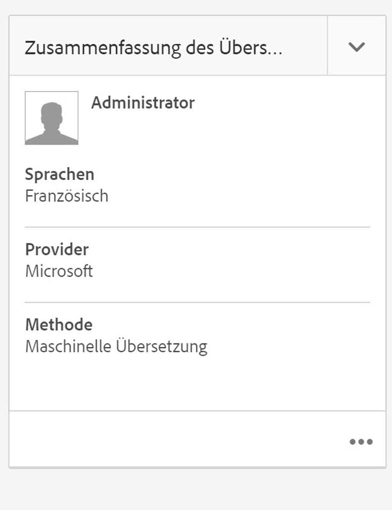

1. Wechseln Sie zur Registerkarte **Erweitert**. Unten können Sie die Option **Übersetzungsstarts automatisch hervorheben** wählen.

   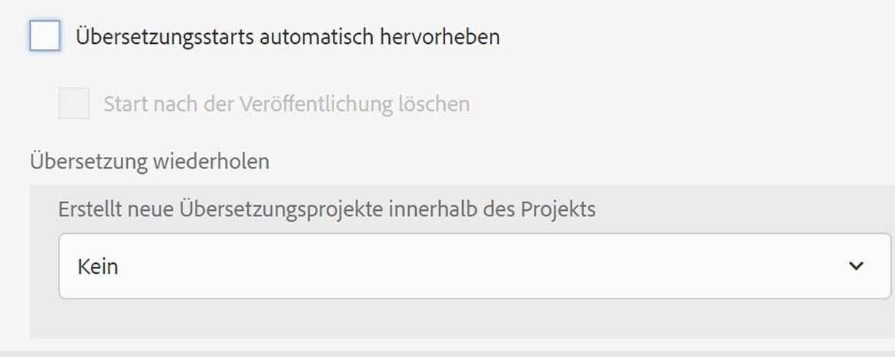

1. Optional können Sie auswählen, ob Übersetzungsstarts nach Erhalt des Übersetzungsinhalts automatisch hervorgehoben und gelöscht werden sollen.

   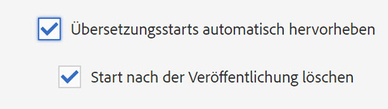

1. Um die wiederholte Ausführung eines Übersetzungsprojekts festzulegen, wählen Sie die Häufigkeit in der Dropdown-Liste **Übersetzung wiederholen** aus. Bei der wiederholten Projektausführung werden Übersetzungsaufträge in den angegebenen Intervallen automatisch erstellt und ausgeführt.

   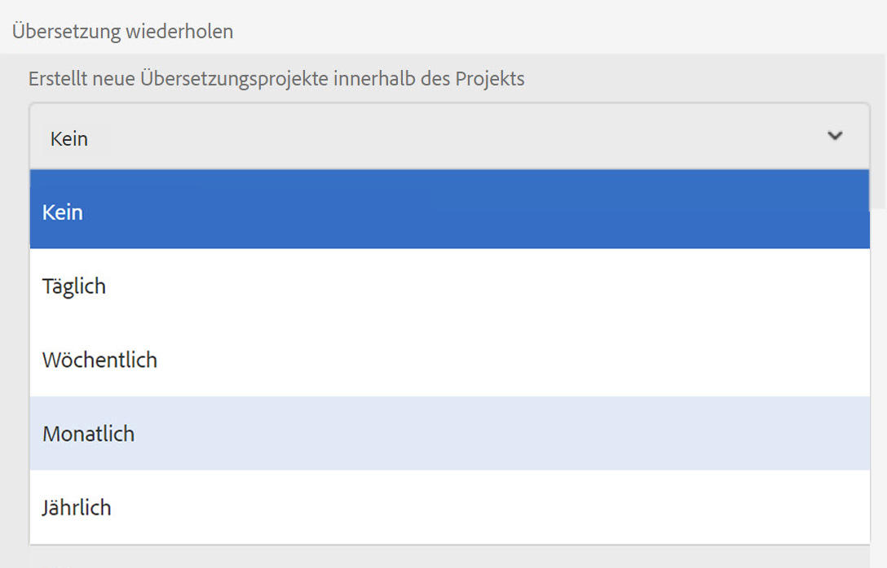

## Mehrsprachige Übersetzungsprojekte {#multilingual-translation-projects}

Es ist möglich, mehrere Zielsprachen in einem Übersetzungsprojekt zu konfigurieren, um die Anzahl der insgesamt erstellten Übersetzungsprojekte zu reduzieren.

1. Klicken oder tippen Sie in Ihrem Übersetzungsprojekt unten auf der Kachel **Zusammenfassung der Übersetzung** auf die Punkte.

   

1. Wechseln Sie zur Registerkarte **Erweitert**. Sie können unter **Zielsprache** mehrere Sprachen hinzufügen.

   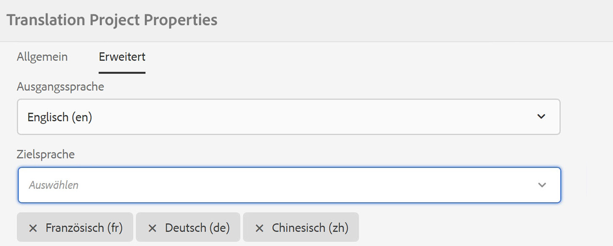

1. Falls Sie die Übersetzung über die Verweisleiste in Sites initiieren, können Sie alternativ hierzu Sprachen hinzufügen und die Option **Mehrsprachiges Übersetzungsprojekt erstellen** wählen.

   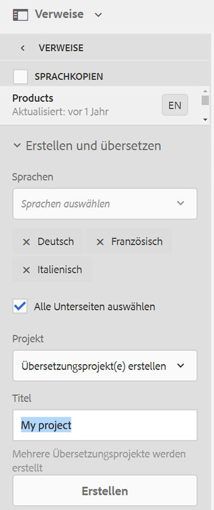

1. Im Projekt werden Übersetzungsaufträge für jede Zielsprache erstellt. Sie können entweder einzeln im Projekt oder gemeinsam gestartet werden, indem das Projekt global auf der Admin-Ebene für Projekte ausgeführt wird.

   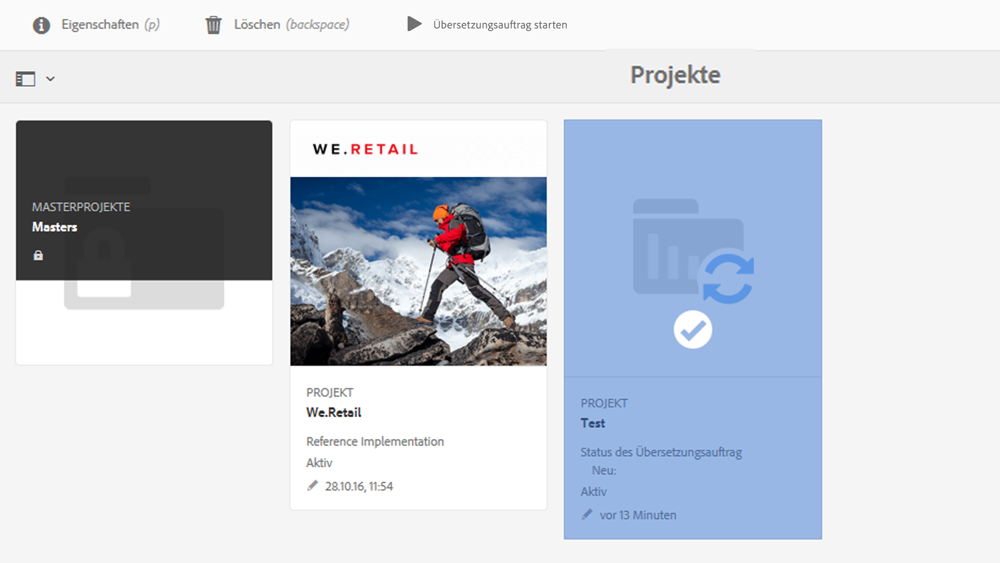

## Translation-Memory-Aktualisierungen {#translation-memory-updates}

Für manuelle Bearbeitungen von übersetzten Inhalten kann wieder eine Synchronisierung mit dem System für die Übersetzungsverwaltung (Translation Management System, TMS) durchgeführt werden, um das Translation Memory zu trainieren.

1. Wählen Sie in der Sites-Konsole nach dem Aktualisieren des Textinhalts auf einer übersetzten Seite die Option **Translation Memory aktualisieren** aus.

   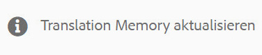

1. In einer Listenansicht werden die Quelle und die Übersetzung für jede bearbeitete Textkomponente nebeneinander verglichen. Wählen Sie aus, welche Übersetzungsaktualisierungen mit der Translation Memory synchronisiert werden sollen, und wählen Sie die Option **Speicher aktualisieren** aus.

   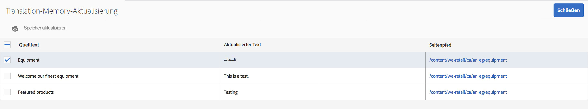

   >[!NOTE]
   >
   >AEM sendet eine XML-Darstellung der ausgewählten Zeichenfolgen zurück an das Translation Management System.

## Sprachkopien auf mehreren Ebenen {#language-copies-on-multiple-levels}

Sie können Sprach-Stämme jetzt unter Knoten gruppieren, z. B. nach Region. Diese werden weiterhin als Stämme von Sprachkopien erkannt.

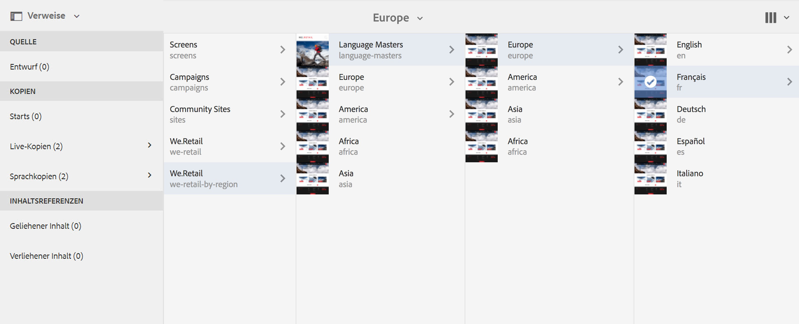

>[!CAUTION]
>
>Hierbei ist nur eine Ebene zulässig. Beispielsweise lässt Folgendes nicht zu, dass die Seite &quot;es&quot;in eine Sprachkopie aufgelöst wird:
>
>* `/content/we-retail/language-masters/en`
>* `/content/we-retail/language-masters/americas/central-america/es`
>
>Die Sprachkopie `es` wird nicht erkannt, da sie zwei Ebenen (americas/central-america) vom Knoten `en` entfernt ist.

>[!NOTE]
>
>Sprachstämme können einen beliebigen Seitennamen haben, nicht nur den ISO-Code der Sprache. AEM prüft immer zuerst den Pfad und den Namen, aber wenn der Seitenname keine Sprache identifiziert, überprüft AEM die Eigenschaft cq:language der Seite auf die Sprachkennung.

## Berichte zum Übersetzungsstatus {#translation-status-reporting}

Eine Eigenschaft kann jetzt in der Sites-Listenansicht ausgewählt werden, die anzeigt, ob eine Seite übersetzt wurde, sich in der Übersetzung befindet oder noch nicht übersetzt wurde. Sie können dies wie folgt anzeigen:

1. Wechseln Sie in Sites zur **Listenansicht**.

   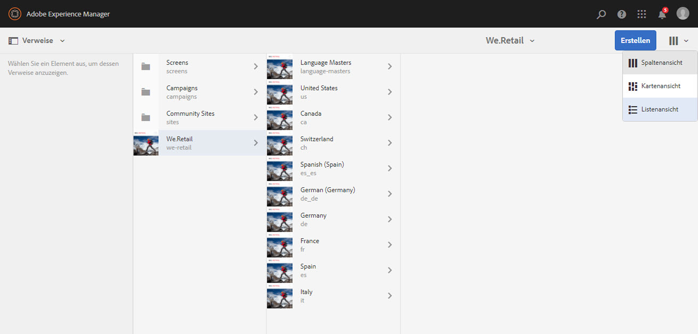

1. Klicken oder tippen Sie auf **Anzeigeeinstellungen**.

   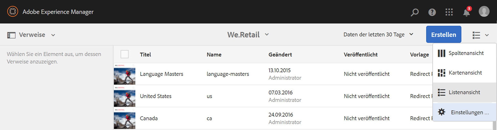

1. Aktivieren Sie unter **Übersetzung** das Kontrollkästchen **Übersetzt** und tippen bzw. klicken Sie auf **Aktualisieren**.

   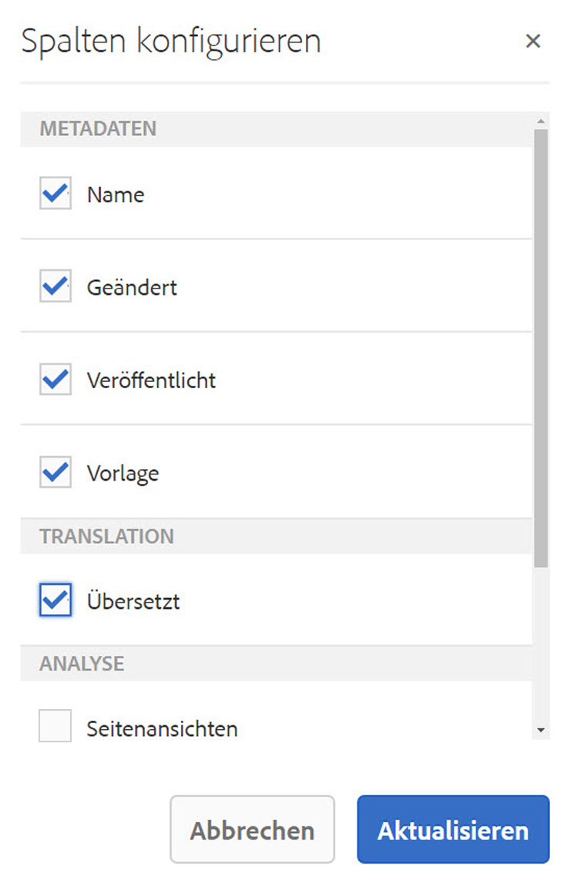

Die Spalte **Übersetzt** mit dem Übersetzungsstatus der Seiten wird angezeigt.

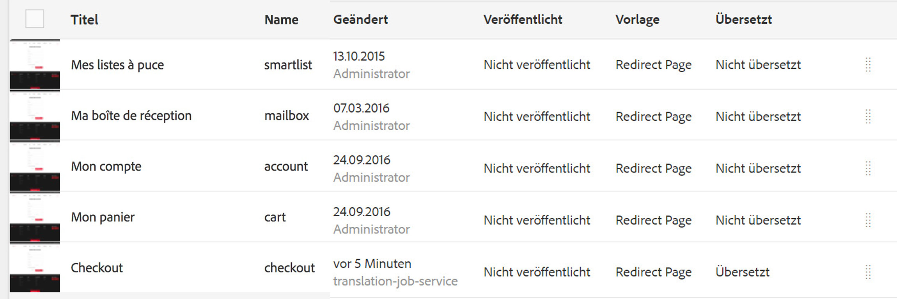
